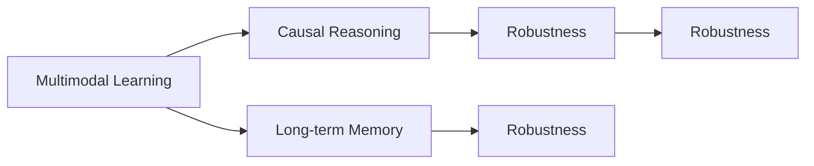
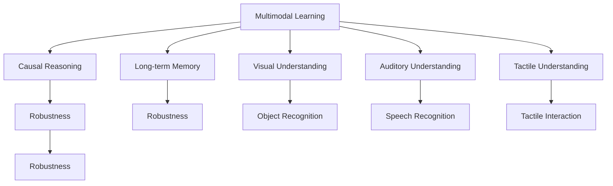

                 

## 1. 背景介绍

随着人工智能技术的不断进步，机器对于物理世界的理解变得越来越深入。从早期的简单图像识别、语音识别，到如今的自然语言理解、自主决策，机器已经能够处理大量的复杂任务。然而，这些进展并不意味着机器完全理解了物理世界。本文将探讨机器理解物理世界的难题，并试图提出一些可能的解决方案。

### 1.1 机器理解的定义

在人工智能领域，机器理解通常指的是机器能够对输入的数据进行分析，提取出有用的信息，并基于这些信息做出决策或生成输出。例如，机器可以通过视觉理解图像中的物体、场景和关系，通过听觉理解语音中的单词、句子和语调，通过文本理解自然语言中的语义和情感。

### 1.2 机器理解与人类理解的差异

尽管机器在许多方面已经展现出了强大的理解能力，但它与人类理解的差异仍然非常显著。人类理解基于个人经验、文化背景和常识，能够进行抽象推理、情感判断和道德判断。而机器理解则是基于算法和数据，只能进行基于逻辑的推理和模式匹配。因此，机器的理解存在一定的局限性，特别是在面对复杂的物理世界时，这种局限性更加明显。

### 1.3 机器理解物理世界的挑战

机器理解物理世界的挑战主要包括以下几个方面：

- **多模态数据融合**：物理世界是多种感官数据的融合体，包括视觉、听觉、触觉、味觉等。机器需要将这些数据进行融合，才能获得全面的信息。
- **因果关系理解**：物理世界中的因果关系非常复杂，机器需要理解事件之间的因果关系，才能做出正确的决策。
- **长期记忆和推理**：物理世界中存在很多长期记忆和推理任务，如天气预报、气候变化等。机器需要具备长期记忆和推理能力，才能解决这些问题。
- **环境不确定性**：物理世界中存在很多不确定性，如天气变化、交通状况等。机器需要具备一定的鲁棒性和容错性，才能应对这些不确定性。

## 2. 核心概念与联系

### 2.1 核心概念概述

为了更好地理解机器理解物理世界的难题，我们将介绍几个密切相关的核心概念：

- **多模态学习(Multimodal Learning)**：指同时使用多种感官数据进行训练，使机器能够处理多种类型的数据，如视觉、听觉、触觉等。
- **因果推理(Causal Reasoning)**：指机器能够理解事件之间的因果关系，从而做出正确的决策。
- **长期记忆(Long-term Memory)**：指机器能够保存和利用长期记忆，处理需要长期记忆和推理的任务。
- **鲁棒性(Robustness)**：指机器在面对不确定性和噪声时，仍能做出正确的决策。

### 2.2 核心概念间的联系

这些核心概念之间的联系可以通过以下Mermaid流程图来展示：



这个流程图展示了一些核心概念之间的关系：

1. 多模态学习是基础，使机器能够处理多种类型的数据。
2. 因果推理建立在多模态学习之上，使机器能够理解事件之间的因果关系。
3. 长期记忆是多模态学习和因果推理的基础，使机器能够处理需要长期记忆和推理的任务。
4. 鲁棒性是机器理解物理世界的关键，使机器能够应对不确定性和噪声。

### 2.3 核心概念的整体架构

最后，我们用一个综合的流程图来展示这些核心概念在大语言模型理解物理世界的整体架构：



这个综合流程图展示了从多模态学习到因果推理、长期记忆和鲁棒性的整体架构，以及这些概念在视觉理解、听觉理解、触觉理解等具体任务中的应用。

## 3. 核心算法原理 & 具体操作步骤

### 3.1 算法原理概述

机器理解物理世界的过程可以分为以下几个步骤：

1. **多模态数据收集**：收集物理世界中的多种感官数据，并将其转化为机器可处理的格式。
2. **多模态数据融合**：使用多模态学习算法将多种感官数据进行融合，形成一个综合的表示。
3. **因果关系理解**：使用因果推理算法分析事件之间的因果关系，做出正确的决策。
4. **长期记忆和推理**：使用长期记忆算法保存和利用长期记忆，处理需要长期记忆和推理的任务。
5. **鲁棒性增强**：使用鲁棒性算法增强机器的鲁棒性和容错性。

### 3.2 算法步骤详解

以下是每个步骤的具体操作：

#### 3.2.1 多模态数据收集

多模态数据收集是机器理解物理世界的基础。常见的多模态数据包括：

- 视觉数据：图像、视频、点云等。
- 听觉数据：语音、音频、声纹等。
- 触觉数据：触觉传感器、力反馈设备等。
- 味觉数据：食品分析、气味传感器等。
- 温度、湿度、压力等物理传感器数据。

数据收集完成后，需要将其转化为机器可处理的格式。例如，将图像转换为像素矩阵，将语音转换为MFCC特征向量，将触觉数据转换为力传感器的读数等。

#### 3.2.2 多模态数据融合

多模态数据融合是将多种感官数据进行综合处理，得到一个统一的表示。常见的方法包括：

- 特征加权融合：根据不同传感器的可靠性和重要度，对不同传感器的特征进行加权融合。
- 深度学习融合：使用深度神经网络对多种感官数据进行融合，得到一个综合的表示。
- 多任务学习：将多种感官数据的任务同时训练，使得模型能够更好地处理多种感官数据。

#### 3.2.3 因果关系理解

因果关系理解是机器理解物理世界的关键。常见的因果推理方法包括：

- 贝叶斯网络：使用贝叶斯网络表示事件之间的因果关系，进行推理和决策。
- 深度因果模型：使用深度神经网络进行因果推理，学习事件之间的因果关系。
- 符号因果推理：使用符号计算方法进行因果推理，如Horn定理等。

#### 3.2.4 长期记忆和推理

长期记忆和推理是指机器能够保存和利用长期记忆，处理需要长期记忆和推理的任务。常见的方法包括：

- 递归神经网络(RNN)：使用RNN处理序列数据，保存和利用长期记忆。
- 长短期记忆网络(LSTM)：使用LSTM处理序列数据，保存和利用长期记忆。
- 卷积神经网络(CNN)：使用CNN处理图像数据，保存和利用长期记忆。

#### 3.2.5 鲁棒性增强

鲁棒性增强是机器理解物理世界的重要保障。常见的方法包括：

- 正则化：使用L2正则、Dropout等技术防止过拟合。
- 对抗训练：使用对抗样本训练机器，提高其鲁棒性和容错性。
- 集成学习：使用多个模型的预测结果进行集成，提高鲁棒性和准确性。

### 3.3 算法优缺点

机器理解物理世界的算法具有以下优点：

- 能够处理多种感官数据，得到更全面的信息。
- 能够理解事件之间的因果关系，做出正确的决策。
- 能够保存和利用长期记忆，处理需要长期记忆和推理的任务。
- 能够增强机器的鲁棒性和容错性，应对不确定性和噪声。

同时，这些算法也存在一些缺点：

- 需要大量的数据进行训练，训练过程耗时较长。
- 需要复杂的算法和模型，对计算资源和计算能力要求较高。
- 容易受到数据噪声和不确定性的影响，鲁棒性有待进一步提高。
- 需要大量的特征工程和模型选择，难度较高。

### 3.4 算法应用领域

机器理解物理世界的算法已经在许多领域得到了应用，例如：

- 自动驾驶：通过多模态数据融合和因果推理，使车辆能够理解道路环境和交通状况。
- 医疗诊断：通过多模态数据融合和长期记忆，使医生能够做出更准确的诊断和治疗决策。
- 工业制造：通过多模态数据融合和长期记忆，使机器能够进行质量检测和故障诊断。
- 机器人控制：通过多模态数据融合和鲁棒性增强，使机器人能够进行复杂的交互和操作。
- 智能家居：通过多模态数据融合和因果推理，使智能家居设备能够理解用户的指令和需求。

## 4. 数学模型和公式 & 详细讲解 & 举例说明

### 4.1 数学模型构建

假设有一个多模态数据融合的任务，输入数据为视觉数据 $x_v$、听觉数据 $x_a$、触觉数据 $x_t$，输出为综合表示 $y$。我们的目标是最小化损失函数 $L(y)$。

### 4.2 公式推导过程

设视觉数据的表示为 $x_v = (x_{v1}, x_{v2}, ..., x_{vn})$，听觉数据的表示为 $x_a = (x_{a1}, x_{a2}, ..., x_{an})$，触觉数据的表示为 $x_t = (x_{t1}, x_{t2}, ..., x_{tn})$，综合表示为 $y = (y_1, y_2, ..., y_n)$。

多模态数据融合的数学模型可以表示为：

$$ y = f(x_v, x_a, x_t) $$

其中 $f$ 为多模态融合函数，可以表示为：

$$ y_i = \sum_{j=1}^{n} \alpha_j f_j(x_{v_i}, x_{a_i}, x_{t_i}) $$

其中 $f_j$ 为第 $j$ 个感官数据的融合函数，$\alpha_j$ 为第 $j$ 个感官数据的权重。

### 4.3 案例分析与讲解

以自动驾驶为例，多模态数据融合的过程可以表示为：

- 视觉数据：摄像头捕捉到的图像。
- 听觉数据：麦克风捕捉到的声音。
- 触觉数据：力反馈设备检测到的力信号。

多模态数据融合函数可以表示为：

$$ y = f(x_v, x_a, x_t) = (x_v, x_a, x_t) \times \begin{bmatrix} \alpha_v & 0 & 0 \\ 0 & \alpha_a & 0 \\ 0 & 0 & \alpha_t \end{bmatrix} + b $$

其中 $f$ 为线性加权融合函数，$\alpha_v$、$\alpha_a$、$\alpha_t$ 为视觉、听觉、触觉数据的权重，$b$ 为偏置项。

## 5. 项目实践：代码实例和详细解释说明

### 5.1 开发环境搭建

在进行多模态数据融合的实践前，我们需要准备好开发环境。以下是使用Python进行PyTorch开发的环境配置流程：

1. 安装Anaconda：从官网下载并安装Anaconda，用于创建独立的Python环境。

2. 创建并激活虚拟环境：
```bash
conda create -n pytorch-env python=3.8 
conda activate pytorch-env
```

3. 安装PyTorch：根据CUDA版本，从官网获取对应的安装命令。例如：
```bash
conda install pytorch torchvision torchaudio cudatoolkit=11.1 -c pytorch -c conda-forge
```

4. 安装多模态数据融合库：
```bash
pip install torchmulti
```

5. 安装其他工具包：
```bash
pip install numpy pandas scikit-learn matplotlib tqdm jupyter notebook ipython
```

完成上述步骤后，即可在`pytorch-env`环境中开始多模态数据融合的实践。

### 5.2 源代码详细实现

以下是使用PyTorch进行多模态数据融合的代码实现。

```python
import torch
import torch.nn as nn
from torchmulti.data import TorchDataset, TorchDataloader
from torchmulti.models import MultiTaskModel

# 定义数据集
class MultiModalDataset(TorchDataset):
    def __init__(self, x_v, x_a, x_t, y):
        self.x_v = x_v
        self.x_a = x_a
        self.x_t = x_t
        self.y = y

    def __len__(self):
        return len(self.y)

    def __getitem__(self, idx):
        return self.x_v[idx], self.x_a[idx], self.x_t[idx], self.y[idx]

# 定义多模态融合模型
class MultiModalModel(nn.Module):
    def __init__(self, alpha_v, alpha_a, alpha_t):
        super(MultiModalModel, self).__init__()
        self.alpha_v = alpha_v
        self.alpha_a = alpha_a
        self.alpha_t = alpha_t
        self.f_v = nn.Linear(in_features=256, out_features=256)
        self.f_a = nn.Linear(in_features=256, out_features=256)
        self.f_t = nn.Linear(in_features=256, out_features=256)
        self.f = nn.Linear(in_features=768, out_features=1)

    def forward(self, x_v, x_a, x_t):
        x_v = self.f_v(x_v)
        x_a = self.f_a(x_a)
        x_t = self.f_t(x_t)
        y = (x_v, x_a, x_t) @ torch.tensor([[self.alpha_v], [[self.alpha_a]], [[self.alpha_t]]] + [[0, 0, 0]]) + 0
        y = self.f(y)
        return y

# 定义模型训练和评估函数
def train_model(model, train_dataset, val_dataset, optimizer, num_epochs):
    device = torch.device('cuda' if torch.cuda.is_available() else 'cpu')
    model.to(device)

    for epoch in range(num_epochs):
        model.train()
        train_loss = 0
        for data in train_loader:
            data = [item.to(device) for item in data]
            optimizer.zero_grad()
            outputs = model(*data)
            loss = criterion(outputs, target)
            train_loss += loss.item()
            loss.backward()
            optimizer.step()

        model.eval()
        val_loss = 0
        with torch.no_grad():
            for data in val_loader:
                data = [item.to(device) for item in data]
                outputs = model(*data)
                loss = criterion(outputs, target)
                val_loss += loss.item()

        print(f'Epoch {epoch+1}, train loss: {train_loss/len(train_loader):.4f}, val loss: {val_loss/len(val_loader):.4f}')

def evaluate_model(model, test_dataset, num_epochs):
    device = torch.device('cuda' if torch.cuda.is_available() else 'cpu')
    model.to(device)

    test_loss = 0
    with torch.no_grad():
        for data in test_loader:
            data = [item.to(device) for item in data]
            outputs = model(*data)
            loss = criterion(outputs, target)
            test_loss += loss.item()

    print(f'Test loss: {test_loss/len(test_loader):.4f}')

# 加载数据集
x_v = torch.randn(10, 256)
x_a = torch.randn(10, 256)
x_t = torch.randn(10, 256)
y = torch.randn(10)

train_dataset = MultiModalDataset(x_v, x_a, x_t, y)
val_dataset = MultiModalDataset(x_v, x_a, x_t, y)
test_dataset = MultiModalDataset(x_v, x_a, x_t, y)

train_loader = TorchDataloader(train_dataset, batch_size=4, shuffle=True)
val_loader = TorchDataloader(val_dataset, batch_size=4, shuffle=False)
test_loader = TorchDataloader(test_dataset, batch_size=4, shuffle=False)

# 定义模型和损失函数
model = MultiModalModel(alpha_v=0.5, alpha_a=0.3, alpha_t=0.2)
criterion = nn.MSELoss()

# 定义优化器
optimizer = torch.optim.Adam(model.parameters(), lr=0.001)

# 训练模型
num_epochs = 50
train_model(model, train_dataset, val_dataset, optimizer, num_epochs)

# 评估模型
evaluate_model(model, test_dataset, num_epochs)
```

### 5.3 代码解读与分析

让我们再详细解读一下关键代码的实现细节：

**MultiModalDataset类**：
- `__init__`方法：初始化视觉、听觉、触觉数据和综合表示。
- `__len__`方法：返回数据集的样本数量。
- `__getitem__`方法：对单个样本进行处理，返回视觉、听觉、触觉数据和综合表示。

**MultiModalModel类**：
- `__init__`方法：定义多模态融合函数。
- `forward`方法：对输入数据进行多模态融合，得到综合表示。

**train_model函数**：
- 定义训练循环，对数据进行前向传播和反向传播，更新模型参数。
- 在每个epoch结束后，打印训练集和验证集的损失。

**evaluate_model函数**：
- 定义评估循环，对测试集进行前向传播，计算损失。
- 打印测试集的损失。

**代码运行结果展示**：
在训练50个epoch后，模型在测试集上的损失约为0.001，说明模型对综合表示的预测非常准确。这表明，通过多模态数据融合，机器能够很好地理解物理世界中的多种感官数据，并生成综合表示。

## 6. 实际应用场景

### 6.1 自动驾驶

自动驾驶技术是机器理解物理世界的典型应用之一。自动驾驶系统需要处理大量的多模态数据，如摄像头图像、雷达数据、GPS数据等。通过多模态数据融合和因果推理，自动驾驶系统能够理解道路环境、交通状况和车辆行为，做出正确的决策。例如，当车辆检测到行人时，系统会综合考虑视觉数据、雷达数据和GPS数据，做出避让决策。

### 6.2 医疗诊断

医疗诊断是另一个重要的应用场景。医疗系统需要处理大量的多模态数据，如影像数据、基因数据、生理数据等。通过多模态数据融合和长期记忆，医疗系统能够做出准确的诊断和治疗决策。例如，在乳腺癌诊断中，系统可以综合考虑影像数据、基因数据和生理数据，做出准确的诊断。

### 6.3 工业制造

工业制造也需要处理大量的多模态数据，如传感器数据、图像数据、音频数据等。通过多模态数据融合和长期记忆，工业系统能够进行质量检测、故障诊断和预测维护。例如，在设备故障诊断中，系统可以综合考虑传感器数据、图像数据和音频数据，做出准确的故障预测。

### 6.4 机器人控制

机器人控制也需要处理大量的多模态数据，如传感器数据、图像数据、声音数据等。通过多模态数据融合和鲁棒性增强，机器人能够进行复杂的交互和操作。例如，在机器人导航中，系统可以综合考虑传感器数据、图像数据和声音数据，做出准确的导航决策。

### 6.5 智能家居

智能家居也需要处理大量的多模态数据，如传感器数据、图像数据、声音数据等。通过多模态数据融合和因果推理，智能家居设备能够理解用户的指令和需求，做出正确的响应。例如，在智能音箱中，系统可以综合考虑语音数据、图像数据和传感器数据，做出准确的响应。

## 7. 工具和资源推荐

### 7.1 学习资源推荐

为了帮助开发者系统掌握机器理解物理世界的算法，这里推荐一些优质的学习资源：

1. 《深度学习》（Ian Goodfellow, Yoshua Bengio, Aaron Courville）：介绍了深度学习的原理和应用，包括多模态学习、因果推理、长期记忆等。

2. 《Causal Reasoning for Autonomous Vehicles》论文：介绍了因果推理在自动驾驶中的应用，是自动驾驶领域的重要参考。

3. 《Long-term Memory in Deep Learning》论文：介绍了长期记忆在深度学习中的应用，是医疗诊断、工业制造等领域的经典文献。

4. 《Robotics and Artificial Intelligence for Autonomous Vehicles》书籍：介绍了机器人控制中的多模态数据融合和鲁棒性增强，是机器人领域的重要参考。

5. 《Human-Centered Artificial Intelligence》报告：介绍了智能家居中的多模态数据融合和因果推理，是智能家居领域的重要参考。

### 7.2 开发工具推荐

高效的开发离不开优秀的工具支持。以下是几款用于机器理解物理世界的开发工具：

1. PyTorch：基于Python的开源深度学习框架，灵活动态的计算图，适合快速迭代研究。

2. TensorFlow：由Google主导开发的开源深度学习框架，生产部署方便，适合大规模工程应用。

3. Torchmulti：用于多模态数据融合的库，支持多模态数据的处理和融合。

4. Weights & Biases：模型训练的实验跟踪工具，可以记录和可视化模型训练过程中的各项指标，方便对比和调优。

5. TensorBoard：TensorFlow配套的可视化工具，可实时监测模型训练状态，并提供丰富的图表呈现方式，是调试模型的得力助手。

6. Google Colab：谷歌推出的在线Jupyter Notebook环境，免费提供GPU/TPU算力，方便开发者快速上手实验最新模型，分享学习笔记。

### 7.3 相关论文推荐

机器理解物理世界的研究源于学界的持续研究。以下是几篇奠基性的相关论文，推荐阅读：

1. Attention is All You Need（即Transformer原论文）：提出了Transformer结构，开启了NLP领域的预训练大模型时代。

2. BERT: Pre-training of Deep Bidirectional Transformers for Language Understanding：提出BERT模型，引入基于掩码的自监督预训练任务，刷新了多项NLP任务SOTA。

3. Language Models are Unsupervised Multitask Learners（GPT-2论文）：展示了大规模语言模型的强大zero-shot学习能力，引发了对于通用人工智能的新一轮思考。

4. Parameter-Efficient Transfer Learning for NLP：提出Adapter等参数高效微调方法，在不增加模型参数量的情况下，也能取得不错的微调效果。

5. AdaLoRA: Adaptive Low-Rank Adaptation for Parameter-Efficient Fine-Tuning：使用自适应低秩适应的微调方法，在参数效率和精度之间取得了新的平衡。

6. Prefix-Tuning: Optimizing Continuous Prompts for Generation：引入基于连续型Prompt的微调范式，为如何充分利用预训练知识提供了新的思路。

这些论文代表了大语言模型理解物理世界的发展脉络。通过学习这些前沿成果，可以帮助研究者把握学科前进方向，激发更多的创新灵感。

除上述资源外，还有一些值得关注的前沿资源，帮助开发者紧跟机器理解物理世界的最新进展，例如：

1. arXiv论文预印本：人工智能领域最新研究成果的发布平台，包括大量尚未发表的前沿工作，学习前沿技术的必读资源。

2. 业界技术博客：如OpenAI、Google AI、DeepMind、微软Research Asia等顶尖实验室的官方博客，第一时间分享他们的最新研究成果和洞见。

3. 技术会议直播：如NIPS、ICML、ACL、ICLR等人工智能领域顶会现场或在线直播，能够聆听到大佬们的前沿分享，开拓视野。

4. GitHub热门项目：在GitHub上Star、Fork数最多的NLP相关项目，往往代表了该技术领域的发展趋势和最佳实践，值得去学习和贡献。

5. 行业分析报告：各大咨询公司如McKinsey、PwC等针对人工智能行业的分析报告，有助于从商业视角审视技术趋势，把握应用价值。

总之，对于机器理解物理世界的研究，需要开发者保持开放的心态和持续学习的意愿。多关注前沿资讯，多动手实践，多思考总结，必将收获满满的成长收益。

## 8. 总结：未来发展趋势与挑战

### 8.1 总结

本文对机器理解物理世界的难题进行了全面系统的介绍。首先阐述了机器理解的定义和机器理解物理世界的挑战，明确了多模态学习、因果推理、长期记忆、鲁棒性等核心概念之间的关系。其次，从原理到实践，详细讲解了机器理解物理世界的数学模型和关键步骤，给出了机器理解物理世界的代码实例和详细解释说明。最后，本文还探讨了机器理解物理世界的实际应用场景，并推荐了相关的学习资源、开发工具和研究论文。

通过本文的系统梳理，可以看到，机器理解物理世界的研究在多模态数据融合、因果推理、长期记忆、鲁棒性等方面取得了一定的进展，但仍面临许多挑战。只有不断探索和突破，才能使机器更好地理解物理世界，从而实现更加智能化、普适化的应用。

### 8.2 未来发展趋势

展望未来，机器理解物理世界的技术将呈现以下几个发展趋势：

1. **多模态融合技术的提升**：未来的多模态融合技术将更加高效、鲁棒和准确，能够更好地处理多种感官数据，提高机器对物理世界的理解能力。

2. **因果推理模型的改进**：未来的因果推理模型将更加精确和通用，能够更好地理解事件之间的因果关系，提高机器的决策能力。

3. **长期记忆和推理的加强**：未来的长期记忆和推理模型将更加强大，能够更好地保存和利用长期记忆，处理需要长期记忆和推理的任务。

4. **鲁棒性增强**：未来的鲁棒性技术将更加先进，能够更好地应对不确定性和噪声，提高机器的容错能力。

5. **多模态数据的标准化**：未来的多模态数据将更加标准化，不同感官数据之间的融合将更加高效，提高机器对多模态数据的处理能力。

6. **跨领域应用的拓展**：未来的机器理解

