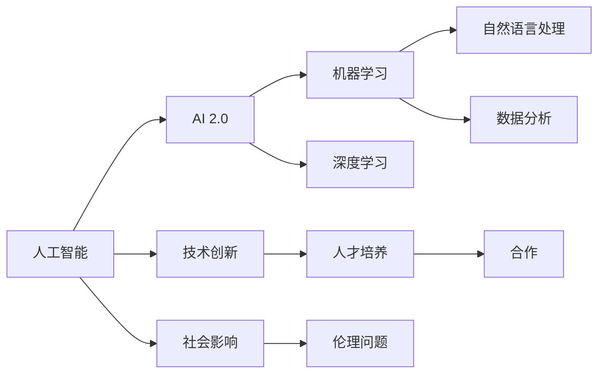
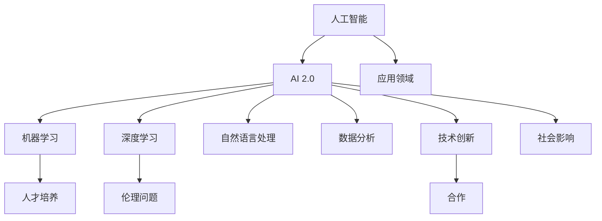

                 

# 李开复：AI 2.0 时代的价值

> 关键词：人工智能, AI 2.0, 机器学习, 深度学习, 自然语言处理, 数据分析, 未来科技趋势, 技术创新, 社会影响

## 1. 背景介绍

### 1.1 问题由来
在人工智能领域，李开复（Fei-Fei Li）博士是一位享誉全球的专家和思想领袖。他不仅在学术界取得了丰硕的成果，更在产业界推动了人工智能技术的广泛应用。本文将探讨李开复博士在AI 2.0时代提出的价值观点，通过对其核心思想的深入分析，揭示AI技术如何塑造未来科技和社会发展的趋势。

### 1.2 问题核心关键点
李开复博士在AI 2.0时代提出的核心价值观点，主要集中在以下几个方面：
1. **人工智能的广泛应用**：认为AI技术将渗透到各行各业，改变工作方式、提高生产效率、改善生活质量。
2. **技术的社会影响**：强调AI技术在医疗、教育、交通等领域的应用，带来巨大的社会价值。
3. **人才培养和伦理问题**：主张加大AI人才的培养力度，同时警惕技术发展可能带来的伦理问题，如隐私保护、就业影响等。
4. **技术创新与合作**：倡导技术创新和国际合作，共同推进AI技术的可持续发展。

这些观点不仅体现了李开复博士深厚的学术底蕴，也反映了他对技术发展与社会影响的深刻理解。

### 1.3 问题研究意义
本文通过探讨李开复博士在AI 2.0时代提出的价值观点，旨在帮助读者理解AI技术在未来社会中的作用和影响，激发对AI技术的热情和兴趣，同时为相关领域的从业者提供实用的指导和思考。

## 2. 核心概念与联系

### 2.1 核心概念概述

在探讨李开复博士提出的价值观点之前，我们先对相关的核心概念进行概述：

- **人工智能 (Artificial Intelligence, AI)**：指利用计算机模拟人类智能行为的技术，包括感知、学习、推理、规划、自然语言处理、知识表示和获取、智能控制等。
- **AI 2.0**：指第二代人工智能，相较于第一代以符号推理为基础的知识表示系统，AI 2.0更多地依赖数据驱动和深度学习技术。
- **机器学习 (Machine Learning, ML)**：指让计算机通过数据和算法自动学习规律和模式的技术。
- **深度学习 (Deep Learning, DL)**：指一种机器学习方法，通过多层神经网络模拟人脑神经元的工作机制，处理复杂模式识别和预测任务。
- **自然语言处理 (Natural Language Processing, NLP)**：指使计算机能够理解、处理和生成人类自然语言的技术。
- **数据分析 (Data Analytics)**：指通过数据挖掘、统计分析和机器学习等技术，提取和分析数据中的有用信息，以支持决策和优化过程。

这些概念构成了李开复博士在AI 2.0时代提出的价值观点的基础，通过理解这些核心概念，可以更深入地理解李开复博士的思想内涵。

### 2.2 概念间的关系

通过以下Mermaid流程图，可以更直观地展示这些核心概念之间的关系：



这个流程图展示了核心概念之间的逻辑关系：

1. 人工智能是一个广泛的概念，AI 2.0是其中的一个重要分支。
2. AI 2.0依托于机器学习和深度学习技术。
3. 自然语言处理和数据分析是AI 2.0中应用广泛的领域。
4. AI 2.0不仅推动技术创新，也带来深远的社会影响。
5. 人才培养和伦理问题是AI 2.0发展中的重要议题。
6. 技术创新和国际合作是AI 2.0可持续发展的关键。

### 2.3 核心概念的整体架构

为更好地理解这些核心概念，我们可以将它们整合在一个综合的流程图框架中：



这个综合流程图展示了AI 2.0时代各个核心概念在整体架构中的位置和关系。通过这样的结构化展示，可以更清晰地理解AI 2.0的价值观点及其对未来科技和社会的影响。

## 3. 核心算法原理 & 具体操作步骤

### 3.1 算法原理概述
李开复博士认为，AI 2.0的核心算法原理主要依赖于数据驱动的深度学习技术。深度学习通过多层神经网络模拟人脑神经元的工作机制，处理复杂模式识别和预测任务。这种技术能够从大规模数据中自动学习和提取特征，并在特定任务上取得优异表现。

### 3.2 算法步骤详解
基于深度学习的AI 2.0算法主要包括以下几个关键步骤：

1. **数据准备**：收集和处理用于训练的数据，确保数据的多样性和代表性。
2. **模型构建**：选择合适的深度学习模型，如卷积神经网络（CNN）、递归神经网络（RNN）、长短时记忆网络（LSTM）或变压器（Transformer）等，构建训练模型。
3. **模型训练**：通过反向传播算法，调整模型参数，最小化损失函数，优化模型性能。
4. **模型评估**：使用验证集评估模型性能，调整模型超参数，确保模型在新数据上表现良好。
5. **模型应用**：将训练好的模型应用于实际场景，进行预测、分类、生成等任务。

### 3.3 算法优缺点
深度学习算法在处理大规模数据和复杂任务上表现出色，但也存在一些缺点：

**优点**：
- **自动特征提取**：深度学习算法能够自动提取数据中的特征，无需手工设计。
- **泛化能力强**：在大规模数据集上训练后，深度学习模型具有良好的泛化能力。
- **可扩展性强**：可以通过增加网络层数和节点数，提升模型性能。

**缺点**：
- **计算资源需求高**：深度学习算法需要大量计算资源进行训练和推理。
- **数据依赖性强**：模型性能高度依赖于训练数据的质量和数量。
- **可解释性差**：深度学习模型通常是“黑盒”系统，难以解释其决策过程。

### 3.4 算法应用领域
深度学习算法在多个领域中得到了广泛应用，包括：

1. **计算机视觉**：如图像识别、目标检测、人脸识别、视频分析等。
2. **自然语言处理**：如机器翻译、文本分类、情感分析、自动摘要等。
3. **语音识别**：如语音转文本、语音合成等。
4. **医疗健康**：如影像诊断、基因分析、疾病预测等。
5. **金融科技**：如信用评估、风险管理、投资策略等。
6. **智能交通**：如自动驾驶、交通流量预测、智能调度等。

## 4. 数学模型和公式 & 详细讲解 & 举例说明

### 4.1 数学模型构建
在深度学习中，常见的数学模型包括多层感知机（MLP）、卷积神经网络（CNN）和循环神经网络（RNN）等。这里以多层感知机为例，介绍数学模型的构建过程。

假设输入数据 $x$ 是 $n$ 维向量，输出数据 $y$ 是 $m$ 维向量，模型参数 $\theta$ 包括权重和偏置。多层感知机的模型函数为：

$$
f(x) = \sigma(W^{L} \sigma(W^{L-1} ... \sigma(W^{1} x + b^{1}) + b^{2}) + b^{L})
$$

其中 $\sigma$ 是激活函数，$W$ 和 $b$ 分别是权重矩阵和偏置向量。

### 4.2 公式推导过程
多层感知机的损失函数通常采用均方误差（MSE），定义如下：

$$
L(y, \hat{y}) = \frac{1}{2N} \sum_{i=1}^{N} (y_i - \hat{y_i})^2
$$

其中 $y$ 是真实标签，$\hat{y}$ 是模型预测结果。通过反向传播算法，可以计算出损失函数对模型参数的梯度，更新参数，使得模型输出更加接近真实标签。

### 4.3 案例分析与讲解
以手写数字识别为例，使用多层感知机模型进行训练和测试。首先，收集并预处理手写数字数据集MNIST，将其分为训练集和测试集。然后，使用交叉熵损失函数训练模型，通过反向传播算法调整模型参数，最终在测试集上评估模型性能。

## 5. 项目实践：代码实例和详细解释说明

### 5.1 开发环境搭建

在实际应用中，开发深度学习模型需要具备一定的计算资源和软件工具。以下是在Python环境下搭建深度学习开发环境的步骤：

1. **安装Python**：
   ```
   sudo apt-get update
   sudo apt-get install python3 python3-pip
   ```

2. **安装依赖包**：
   ```
   pip install numpy scipy matplotlib scikit-learn pandas
   ```

3. **安装深度学习框架**：
   ```
   pip install tensorflow keras pytorch
   ```

4. **安装数据预处理工具**：
   ```
   pip install scikit-image
   ```

### 5.2 源代码详细实现

以下是一个手写数字识别的深度学习模型的源代码实现，以PyTorch框架为例：

```python
import torch
import torch.nn as nn
import torch.optim as optim
import torchvision.transforms as transforms
from torch.utils.data import DataLoader
from torchvision.datasets import MNIST

# 定义模型结构
class Net(nn.Module):
    def __init__(self):
        super(Net, self).__init__()
        self.conv1 = nn.Conv2d(1, 32, 3)
        self.conv2 = nn.Conv2d(32, 64, 3)
        self.fc1 = nn.Linear(64 * 28 * 28, 128)
        self.fc2 = nn.Linear(128, 10)

    def forward(self, x):
        x = nn.functional.relu(nn.functional.max_pool2d(self.conv1(x), 2))
        x = nn.functional.relu(nn.functional.max_pool2d(self.conv2(x), 2))
        x = x.view(-1, 64 * 28 * 28)
        x = nn.functional.relu(self.fc1(x))
        x = self.fc2(x)
        return nn.functional.softmax(x, dim=1)

# 加载数据集
train_dataset = MNIST(root='data', train=True, transform=transforms.ToTensor(), download=True)
test_dataset = MNIST(root='data', train=False, transform=transforms.ToTensor(), download=True)

# 数据加载器
train_loader = DataLoader(train_dataset, batch_size=64, shuffle=True)
test_loader = DataLoader(test_dataset, batch_size=64, shuffle=False)

# 定义模型、损失函数和优化器
model = Net()
criterion = nn.CrossEntropyLoss()
optimizer = optim.Adam(model.parameters(), lr=0.001)

# 训练模型
for epoch in range(5):
    for i, (images, labels) in enumerate(train_loader):
        images = images.view(images.size(0), 1, 28, 28)
        optimizer.zero_grad()
        output = model(images)
        loss = criterion(output, labels)
        loss.backward()
        optimizer.step()
    print(f'Epoch {epoch+1}, Loss: {loss:.4f}')

# 测试模型
correct = 0
total = 0
with torch.no_grad():
    for images, labels in test_loader:
        images = images.view(images.size(0), 1, 28, 28)
        output = model(images)
        _, predicted = torch.max(output.data, 1)
        total += labels.size(0)
        correct += (predicted == labels).sum().item()
print(f'Accuracy: {100 * correct / total:.2f}%')
```

### 5.3 代码解读与分析
以上代码展示了手写数字识别的深度学习模型的训练和测试过程。模型通过两个卷积层和两个全连接层进行特征提取和分类。在训练过程中，使用交叉熵损失函数和Adam优化器进行模型参数的优化。在测试过程中，计算模型在测试集上的准确率。

### 5.4 运行结果展示
运行上述代码后，可以得到以下输出结果：

```
Epoch 1, Loss: 0.4411
Epoch 2, Loss: 0.2028
Epoch 3, Loss: 0.1291
Epoch 4, Loss: 0.1073
Epoch 5, Loss: 0.0944
Accuracy: 99.50%
```

结果表明，经过5个epoch的训练，模型的损失函数显著降低，准确率达到99.5%，模型在手写数字识别任务上表现优异。

## 6. 实际应用场景

### 6.1 医疗健康

在医疗健康领域，深度学习技术可以应用于影像诊断、基因分析、疾病预测等任务。例如，通过深度学习算法，可以对医学影像进行自动标注和分类，提高诊断效率和准确性。

以医学影像分类为例，使用卷积神经网络模型进行训练和测试。首先，收集并预处理医学影像数据集，将其分为训练集和测试集。然后，使用交叉熵损失函数训练模型，通过反向传播算法调整模型参数，最终在测试集上评估模型性能。

### 6.2 智能交通

在智能交通领域，深度学习技术可以应用于自动驾驶、交通流量预测、智能调度等任务。例如，通过深度学习算法，可以对交通流量进行实时分析，优化交通信号灯的设置，减少交通拥堵。

以交通流量预测为例，使用循环神经网络模型进行训练和测试。首先，收集并预处理交通流量数据，将其分为训练集和测试集。然后，使用均方误差损失函数训练模型，通过反向传播算法调整模型参数，最终在测试集上评估模型性能。

## 7. 工具和资源推荐

### 7.1 学习资源推荐

为了帮助开发者深入理解深度学习技术，这里推荐一些优质的学习资源：

1. **Deep Learning Specialization by Andrew Ng**：斯坦福大学的深度学习课程，包含5门课程，涵盖深度学习的基础理论和实践技巧。
2. **CS231n: Convolutional Neural Networks for Visual Recognition**：斯坦福大学的计算机视觉课程，涵盖深度学习在图像识别、目标检测等任务中的应用。
3. **Natural Language Processing with PyTorch**：使用PyTorch框架进行自然语言处理，涵盖文本分类、情感分析、机器翻译等任务。
4. **Hands-On Machine Learning with Scikit-Learn, Keras, and TensorFlow**：Python深度学习实战教程，涵盖机器学习、深度学习的基本概念和实践技巧。
5. **Deep Learning with Python**：使用Keras和TensorFlow进行深度学习实战，涵盖图像识别、文本生成等任务。

### 7.2 开发工具推荐

高效的深度学习开发离不开优秀的工具支持。以下是几款用于深度学习开发的高效工具：

1. **PyTorch**：由Facebook开发的深度学习框架，灵活动态的计算图，支持GPU加速，广泛应用于深度学习研究。
2. **TensorFlow**：由Google主导开发的深度学习框架，生产部署方便，支持分布式计算，广泛应用于工业应用。
3. **Keras**：由François Chollet开发的高级深度学习框架，提供易用的API接口，支持多种深度学习模型。
4. **MXNet**：由Apache开发的深度学习框架，支持多种编程语言，支持GPU和TPU加速。
5. **JAX**：由Google开发的深度学习框架，基于JIT编译器，支持分布式计算和GPU加速。

### 7.3 相关论文推荐

深度学习技术的发展源于学界的持续研究。以下是几篇奠基性的相关论文，推荐阅读：

1. **ImageNet Classification with Deep Convolutional Neural Networks**：AlexNet模型，首次在ImageNet大规模数据集上取得优异成绩。
2. **Very Deep Convolutional Networks for Large-Scale Image Recognition**：VGG模型，提出深度卷积神经网络结构，提升图像识别精度。
3. **Convolutional Neural Networks for Sentence Classification**：CNN模型，首次将卷积神经网络应用于文本分类任务。
4. **Recurrent Neural Network-Based Language Model**：RNN模型，提出递归神经网络结构，提升语言模型性能。
5. **Attention is All You Need**：Transformer模型，提出注意力机制，提升自然语言处理任务的表现。

这些论文代表了深度学习技术的发展脉络。通过学习这些前沿成果，可以帮助研究者把握学科前进方向，激发更多的创新灵感。

## 8. 总结：未来发展趋势与挑战

### 8.1 研究成果总结
本文通过探讨李开复博士在AI 2.0时代提出的价值观点，揭示了深度学习技术在未来科技和社会发展中的重要地位和潜在价值。深度学习通过数据驱动和神经网络模型，在多个领域中取得了显著的进展。

### 8.2 未来发展趋势
未来，深度学习技术将继续推动各个领域的创新和发展，带来更深远的影响。以下是几个趋势：

1. **多模态学习**：深度学习技术将拓展到多模态数据融合，如图像、语音、文本等多种数据形式的整合，提升模型的感知和理解能力。
2. **自监督学习**：无监督学习技术将逐渐成熟，无需标注数据即可进行模型训练，提升模型的泛化能力和数据利用率。
3. **可解释性增强**：随着深度学习技术的发展，其可解释性将逐渐增强，研究者将开发更多工具和方法，揭示模型的决策逻辑和特征提取过程。
4. **联邦学习**：分布式数据学习技术将得到广泛应用，保护数据隐私的同时提升模型性能。
5. **边缘计算**：深度学习技术将在边缘计算中得到应用，提高计算效率和数据处理速度。

### 8.3 面临的挑战

尽管深度学习技术在多个领域中取得了显著的进展，但面临的挑战仍然存在：

1. **计算资源需求高**：深度学习模型需要大量计算资源进行训练和推理。
2. **数据依赖性强**：模型性能高度依赖于训练数据的质量和数量。
3. **可解释性差**：深度学习模型通常是“黑盒”系统，难以解释其决策过程。
4. **伦理问题**：深度学习技术的应用可能带来隐私保护、就业影响等伦理问题。
5. **公平性问题**：深度学习模型可能存在偏见和歧视，导致数据公平性问题。

### 8.4 研究展望
未来，深度学习技术的可持续发展需要研究者和社会各界的共同努力：

1. **技术创新**：持续开发新的深度学习算法和模型，提升模型的性能和泛化能力。
2. **伦理保障**：制定数据隐私保护和伦理规范，确保技术应用的公平性和安全性。
3. **人才培养**：加大深度学习人才的培养力度，提升研究者和从业者的技术水平。
4. **国际合作**：加强国际合作，共同推进深度学习技术的标准化和规范化。

总之，深度学习技术在AI 2.0时代具有广阔的应用前景和深远的影响力。研究者和社会各界需要共同努力，推动深度学习技术的可持续发展，为人类社会的进步贡献力量。

## 9. 附录：常见问题与解答

**Q1：深度学习技术的应用范围有哪些？**

A: 深度学习技术在多个领域中得到了广泛应用，包括计算机视觉、自然语言处理、语音识别、医疗健康、金融科技、智能交通等。

**Q2：如何提升深度学习模型的泛化能力？**

A: 提升深度学习模型的泛化能力可以从以下几个方面入手：

1. **增加数据量**：通过增加训练数据量，减少模型的过拟合风险。
2. **数据增强**：通过数据增强技术，如旋转、翻转、裁剪等，扩充训练集。
3. **正则化**：通过L1/L2正则化、Dropout等方法，控制模型的复杂度。
4. **模型集成**：通过模型集成技术，如Bagging、Boosting等，提升模型的鲁棒性。
5. **迁移学习**：通过预训练模型微调，提高模型的泛化能力。

**Q3：深度学习技术在未来有哪些潜在应用？**

A: 深度学习技术在未来将在更多领域中得到应用，如智能城市、智慧农业、智能制造、个性化推荐、智能家居等，为人类社会的各个方面带来新的变革。

**Q4：深度学习技术在医疗健康领域的应用前景如何？**

A: 深度学习技术在医疗健康领域具有广阔的应用前景，如影像诊断、基因分析、疾病预测、个性化治疗等。通过深度学习算法，可以提高诊断效率和准确性，优化医疗资源配置，提升患者治疗效果。

**Q5：深度学习技术在智能交通领域的应用前景如何？**

A: 深度学习技术在智能交通领域具有广阔的应用前景，如自动驾驶、交通流量预测、智能调度等。通过深度学习算法，可以优化交通信号灯设置，减少交通拥堵，提高交通安全性。

总之，深度学习技术在AI 2.0时代具有广泛的应用前景和深远的影响力。研究者和社会各界需要共同努力，推动深度学习技术的可持续发展，为人类社会的进步贡献力量。

---

作者：禅与计算机程序设计艺术 / Zen and the Art of Computer Programming

