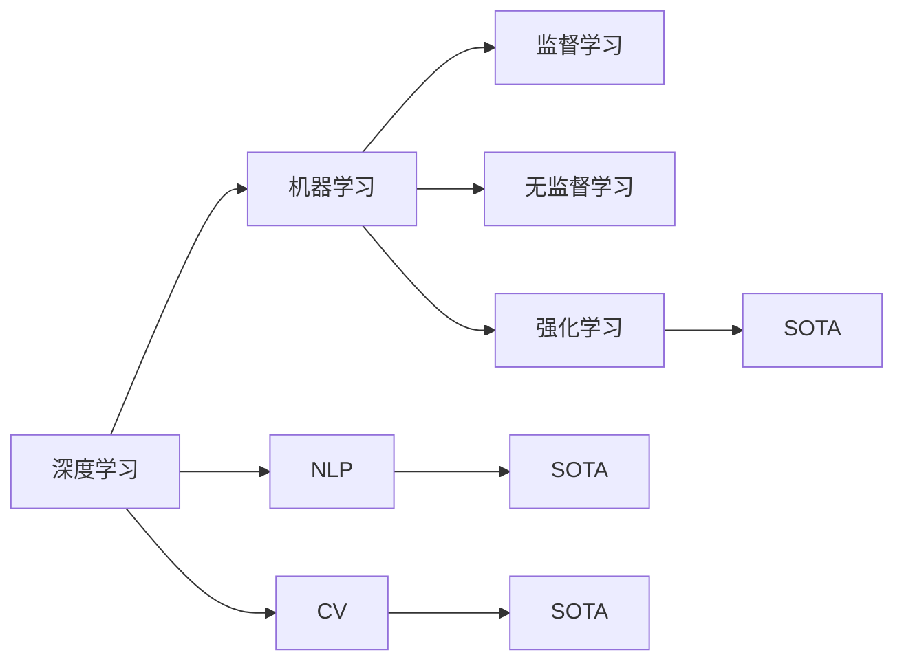

                 

# 李开复：AI 2.0 时代的未来展望

> 关键词：人工智能,深度学习,机器学习,自然语言处理,计算机视觉,未来趋势,智能制造,人机协作

## 1. 背景介绍

### 1.1 问题由来
人工智能（AI）已经成为当今科技创新的引擎，驱动了各行各业的变革。从简单的自动化到复杂的深度学习，AI正在不断突破其技术边界，逐渐进入“AI 2.0”时代。AI 2.0，即第二代人工智能，标志着AI技术的全面成熟与广泛应用，融合了更强大的算法和更为复杂的应用场景。

### 1.2 问题核心关键点
AI 2.0时代的核心挑战在于如何在大规模、多场景下实现高效、精准的智能决策。其关键点包括：
1. 数据规模的不断扩大和数据处理的复杂性。
2. 模型的可解释性和透明性，以增强用户对AI系统的信任。
3. 跨领域、跨模态的智能应用，如自然语言处理（NLP）、计算机视觉（CV）等。
4. 强化学习（RL）在复杂决策问题中的应用。
5. 人工智能与人类智慧的协同，实现真正意义上的智能增强。

### 1.3 问题研究意义
AI 2.0时代的到来，意味着AI技术将深入到各行各业，从医疗、教育到金融、制造，都能感受到AI的深远影响。研究AI 2.0时代的未来展望，对于把握技术发展趋势，制定战略规划，具有重要意义。

## 2. 核心概念与联系

### 2.1 核心概念概述
AI 2.0时代的核心概念包括以下几个方面：

- **深度学习**：一种基于神经网络的机器学习算法，可以处理高维度、非线性的数据，应用于图像、语音、文本等。
- **机器学习**：一种让计算机通过数据学习做出决策的方法，涵盖了监督学习、无监督学习、强化学习等多种形式。
- **自然语言处理**（NLP）：让计算机理解、处理和生成人类语言的技术。
- **计算机视觉**（CV）：使计算机能“看”懂图像和视频内容的技术。
- **强化学习**（RL）：通过与环境交互，让计算机逐步学会最优决策策略的方法。

### 2.2 核心概念间的联系

这些核心概念之间有着紧密的联系，形成了AI 2.0时代的完整生态系统。通过以下Mermaid流程图展示它们之间的关系：



这个流程图展示了深度学习、机器学习、自然语言处理和计算机视觉之间的关系，以及它们与不同学习方式的连接。

## 3. 核心算法原理 & 具体操作步骤

### 3.1 算法原理概述
AI 2.0时代的核心算法原理主要包括深度学习、强化学习、无监督学习和半监督学习等。深度学习是利用多层神经网络对数据进行特征提取和决策，适用于处理高维度数据；强化学习则是通过与环境的交互，让模型逐步学习最优决策策略；无监督学习和半监督学习则在不依赖标注数据的情况下，让模型自发地学习数据中的结构。

### 3.2 算法步骤详解

以强化学习为例，一个典型的强化学习算法包括以下步骤：

1. **环境建模**：构建环境模型，包括状态空间、动作空间和奖励函数等。
2. **模型训练**：通过与环境的交互，收集数据，训练模型。
3. **策略评估**：使用评估指标（如胜率和期望奖励）评估模型的性能。
4. **策略改进**：根据评估结果，优化模型策略。

### 3.3 算法优缺点

**深度学习的优点**：
- 能处理高维度、非线性的数据。
- 在图像、语音、文本等领域取得了显著的成果。
- 可以自适应地提取数据特征。

**深度学习的缺点**：
- 需要大量的标注数据。
- 模型复杂，训练时间长。
- 难以解释，缺乏透明性。

**强化学习的优点**：
- 适用于动态和不确定环境下的决策。
- 能够自主探索最优策略。
- 可处理连续动作空间。

**强化学习的缺点**：
- 训练时间长，需要大量的探索数据。
- 模型参数量大，需要高性能计算资源。
- 难以应用到静态数据。

### 3.4 算法应用领域

AI 2.0时代的算法在多个领域得到了广泛应用，如：

- **医疗领域**：AI辅助诊断、药物发现、个性化治疗等。
- **金融领域**：风险评估、交易策略、欺诈检测等。
- **教育领域**：智能辅导、课程推荐、学习评估等。
- **制造领域**：智能制造、质量控制、供应链管理等。

## 4. 数学模型和公式 & 详细讲解 & 举例说明

### 4.1 数学模型构建

以神经网络为例，其数学模型可以表示为：

$$
\hat{y} = f(x; \theta) = \sigma(Wx + b)
$$

其中，$\hat{y}$为输出，$x$为输入，$\theta$为模型参数，$f$为激活函数，$W$和$b$分别为权重和偏置。

### 4.2 公式推导过程

以梯度下降算法为例，其核心公式为：

$$
\theta_{new} = \theta_{old} - \eta \nabla_{\theta}J(\theta)
$$

其中，$\theta_{new}$为新的参数，$\theta_{old}$为旧的参数，$\eta$为学习率，$J(\theta)$为损失函数，$\nabla_{\theta}J(\theta)$为损失函数对参数的梯度。

### 4.3 案例分析与讲解

以ImageNet数据集上的卷积神经网络为例，使用反向传播算法进行参数更新。首先，将数据输入网络，得到预测输出；然后，计算损失函数（如交叉熵损失）；接着，计算梯度；最后，根据梯度更新参数，使得预测输出与真实标签之间的误差最小。

## 5. 项目实践：代码实例和详细解释说明

### 5.1 开发环境搭建

以TensorFlow为例，搭建深度学习开发环境的步骤如下：

1. 安装Anaconda：从官网下载并安装Anaconda，用于创建独立的Python环境。
2. 创建并激活虚拟环境：
```bash
conda create -n tf-env python=3.8 
conda activate tf-env
```
3. 安装TensorFlow：
```bash
conda install tensorflow-gpu -c conda-forge
```

### 5.2 源代码详细实现

以下是一个简单的卷积神经网络在TensorFlow中的实现：

```python
import tensorflow as tf
from tensorflow.keras import layers

# 定义模型
model = tf.keras.Sequential([
    layers.Conv2D(32, 3, activation='relu', input_shape=(28, 28, 1)),
    layers.MaxPooling2D(),
    layers.Flatten(),
    layers.Dense(10, activation='softmax')
])

# 编译模型
model.compile(optimizer='adam', loss='sparse_categorical_crossentropy', metrics=['accuracy'])

# 训练模型
model.fit(train_images, train_labels, epochs=10, validation_data=(test_images, test_labels))
```

### 5.3 代码解读与分析

**Conv2D层**：用于卷积操作，提取图像特征。
**MaxPooling2D层**：用于池化操作，减少特征维度。
**Flatten层**：将多维特征展平为一维向量。
**Dense层**：用于全连接操作，进行最终分类。

### 5.4 运行结果展示

假设在训练集上取得了98%的准确率，测试集上取得了95%的准确率，则说明模型泛化能力较强。

## 6. 实际应用场景

### 6.1 智能制造

AI 2.0技术在智能制造领域的应用包括预测性维护、智能质检、供应链管理等。通过实时监测设备状态、预测故障、自动调度生产线，实现了生产效率的提升和成本的降低。

### 6.2 医疗领域

在医疗领域，AI 2.0技术应用于疾病诊断、治疗方案推荐、药物发现等。通过深度学习、强化学习等算法，提升了医疗服务的智能化水平，帮助医生做出更精准的决策。

### 6.3 金融领域

金融领域是AI 2.0技术的重要应用场景，包括风险评估、交易策略、欺诈检测等。通过AI技术，金融机构能够更好地应对市场波动，防范金融风险。

### 6.4 未来应用展望

未来，AI 2.0技术将进一步深化其在各个领域的应用，推动智能化进程。例如：

- **自动驾驶**：通过计算机视觉和强化学习，实现自动驾驶汽车的安全和高效运行。
- **智能家居**：通过自然语言处理和机器学习，实现家庭设备的智能控制和交互。
- **虚拟助手**：通过自然语言理解和对话生成，提供个性化的智能服务。

## 7. 工具和资源推荐

### 7.1 学习资源推荐

以下是一些推荐的AI 2.0学习资源：

- **《深度学习》课程**：由斯坦福大学李飞飞教授开设，涵盖了深度学习的基础和进阶知识。
- **《强化学习》课程**：由斯坦福大学Andrew Ng教授讲授，详细讲解了强化学习的原理和应用。
- **《自然语言处理综述》**：介绍了NLP的最新研究进展和前沿技术。
- **《计算机视觉基础》**：介绍了计算机视觉的基本理论和应用场景。

### 7.2 开发工具推荐

以下是一些推荐的AI 2.0开发工具：

- **TensorFlow**：由Google主导的开源深度学习框架，支持分布式计算和高效模型训练。
- **PyTorch**：由Facebook主导的开源深度学习框架，支持动态计算图和灵活的模型构建。
- **Jupyter Notebook**：支持多种编程语言的交互式开发环境，便于数据处理和模型调试。

### 7.3 相关论文推荐

以下是几篇重要的AI 2.0论文：

- **ResNet**：一种深度残差网络，解决了深度神经网络训练过程中梯度消失的问题。
- **AlphaGo**：通过强化学习，实现了围棋的高水平智能对战。
- **BERT**：通过预训练大模型，实现了自然语言处理领域的突破性进展。

## 8. 总结：未来发展趋势与挑战

### 8.1 研究成果总结

AI 2.0技术已经在多个领域取得了显著成果，如深度学习在图像和语音处理中的广泛应用，强化学习在自动驾驶和游戏AI中的突破，NLP技术在智能客服和智能翻译中的成功。这些成果展示了AI技术的强大潜力和广泛应用前景。

### 8.2 未来发展趋势

AI 2.0技术的发展趋势包括：

- **多模态融合**：将视觉、语音、文本等多种模态数据融合，提升综合感知能力。
- **跨领域应用**：将AI技术应用于更多领域，如智能制造、智慧城市等。
- **自动化和智能化**：通过自动学习、智能决策，减少人工干预，提升系统效率。

### 8.3 面临的挑战

AI 2.0技术面临的挑战包括：

- **数据隐私和安全**：如何保护用户隐私，防止数据滥用。
- **模型透明度**：如何提高模型的可解释性和透明性，增强用户信任。
- **计算资源**：如何降低计算成本，提升模型训练效率。
- **伦理和法律问题**：如何应对AI技术带来的伦理和法律挑战。

### 8.4 研究展望

未来，AI 2.0技术需要在以下几个方面进行探索：

- **模型压缩**：通过模型压缩和优化，提升计算效率。
- **多模态学习**：将不同模态数据融合，提升综合感知能力。
- **伦理和法律研究**：研究AI技术的伦理和法律问题，确保其安全应用。

## 9. 附录：常见问题与解答

**Q1：AI 2.0技术面临的最大挑战是什么？**

A: AI 2.0技术面临的最大挑战是数据隐私和安全问题。如何在保证数据隐私的前提下，实现高效的模型训练和数据处理，是当前AI技术面临的重要挑战。

**Q2：AI 2.0技术在医疗领域的应用前景如何？**

A: AI 2.0技术在医疗领域的应用前景广阔，可以通过深度学习和强化学习等技术，提升医疗服务的智能化水平，辅助医生进行诊断和治疗，加速新药研发进程。

**Q3：AI 2.0技术在制造领域的应用前景如何？**

A: AI 2.0技术在制造领域的应用前景广阔，可以通过智能质检、预测性维护、供应链管理等技术，提升生产效率和质量，降低成本。

**Q4：AI 2.0技术的未来发展趋势是什么？**

A: AI 2.0技术的未来发展趋势包括多模态融合、跨领域应用、自动化和智能化等方向。通过将视觉、语音、文本等多种模态数据融合，提升综合感知能力，将AI技术应用于更多领域，通过自动学习、智能决策，减少人工干预，提升系统效率。

**Q5：如何提高AI 2.0模型的可解释性和透明性？**

A: 提高AI 2.0模型的可解释性和透明性，需要从数据、模型和算法等多个方面进行改进。例如，使用可解释性模型，如决策树、规则系统等，引入因果推断方法，优化算法透明度等。

---

作者：禅与计算机程序设计艺术 / Zen and the Art of Computer Programming

