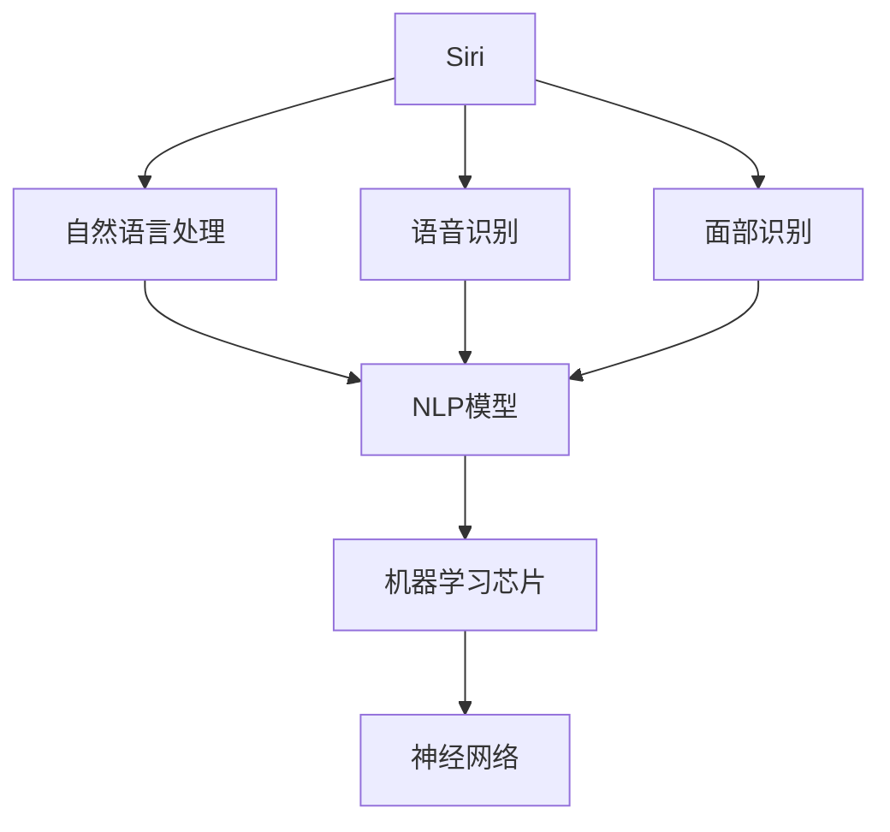
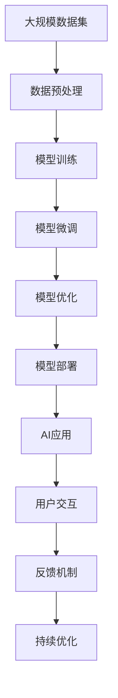

                 

# 李开复：苹果发布AI应用的生态

## 1. 背景介绍

### 1.1 问题由来
随着人工智能技术的迅猛发展，各大科技公司纷纷布局AI生态，苹果也不例外。苹果公司近年来发布了众多基于AI的应用，包括Siri、Face ID、机器学习芯片等。这些AI应用极大提升了用户体验，为苹果赢得了更广泛的口碑。本文将深入探讨苹果发布的AI应用及其生态，解析其背后的技术原理和应用场景，为AI爱好者提供参考。

### 1.2 问题核心关键点
苹果的AI应用生态涉及多个关键技术点，包括语音识别、面部识别、自然语言处理、机器学习芯片等。这些技术相互配合，共同构建了苹果强大的AI应用生态。本文将详细介绍这些关键技术点，并探讨其背后的算法原理和应用场景。

### 1.3 问题研究意义
深入理解苹果AI应用的生态，不仅有助于技术爱好者把握当前AI技术的最新进展，也能为AI应用开发者提供参考，助力其在实际项目中应用这些先进技术。此外，苹果AI生态的成功经验，也为其他科技公司提供了宝贵的借鉴。

## 2. 核心概念与联系

### 2.1 核心概念概述

苹果的AI应用生态涉及多个核心概念，包括Siri、Face ID、机器学习芯片、神经网络等。

- **Siri**：苹果公司的虚拟助手，通过自然语言处理和语音识别技术，实现语音交互。
- **Face ID**：基于面部识别技术的安全验证系统，用于解锁手机和支付等功能。
- **机器学习芯片**：如M1芯片，内含神经网络单元，加速AI计算。
- **神经网络**：用于图像识别、自然语言处理等任务的核心计算模型。

这些核心概念通过苹果的硬件和软件生态，相互配合，构建了强大的AI应用生态。

### 2.2 概念间的关系

以下是一个简单的Mermaid流程图，展示这些核心概念之间的关系：



这个流程图展示了苹果AI应用生态的核心概念及其相互关系：

1. Siri通过自然语言处理和语音识别技术，理解用户的语音指令。
2. Face ID利用面部识别技术，实现安全验证。
3. 机器学习芯片加速了神经网络的计算，提升了AI应用的性能。
4. 神经网络模型用于图像识别、自然语言处理等任务，是AI应用的核心。

### 2.3 核心概念的整体架构

完整的苹果AI应用生态，还涉及数据获取、数据处理、模型训练、模型部署等环节。以下是一个综合的流程图，展示整个生态架构：



这个流程图展示了苹果AI应用生态的整体架构：

1. 大规模数据集获取，提供训练和验证数据。
2. 数据预处理，清洗和转换数据，准备模型训练。
3. 模型训练，使用神经网络等技术训练模型。
4. 模型微调，通过小规模数据集对模型进行微调，提升模型精度。
5. 模型优化，调整模型参数和结构，进一步提升性能。
6. 模型部署，将训练好的模型集成到应用中。
7. AI应用，用户通过应用与AI系统进行交互。
8. 反馈机制，收集用户反馈，用于模型持续优化。
9. 持续优化，不断迭代模型，提升用户体验。

## 3. 核心算法原理 & 具体操作步骤
### 3.1 算法原理概述

苹果AI应用的核心算法包括自然语言处理、语音识别、面部识别等。这里以自然语言处理和语音识别为例，介绍其算法原理。

#### 3.1.1 自然语言处理

自然语言处理(NLP)是苹果AI应用的重要组成部分，用于理解和生成自然语言。其核心算法包括：

- **分词**：将文本分割成词语，为后续处理做准备。
- **词向量表示**：将词语转换为向量形式，便于计算机处理。
- **句法分析**：分析句子结构，提取关键信息。
- **语义分析**：理解句子语义，进行情感分析、意图识别等。

#### 3.1.2 语音识别

语音识别是将语音转换为文本的过程。其核心算法包括：

- **特征提取**：从语音信号中提取特征，如频谱、MFCC等。
- **声学模型**：将特征映射到文本序列，如隐马尔可夫模型(HMM)。
- **语言模型**：预测文本序列的概率，如N-gram模型。

### 3.2 算法步骤详解

以Siri的自然语言处理为例，介绍其具体实现步骤：

1. **分词**：将用户输入的语音转换为文本，并进行分词处理。
2. **词向量表示**：将分词结果转换为向量形式。
3. **句法分析**：使用句法分析器，提取句子结构。
4. **语义分析**：使用语义分析器，理解句子语义，进行情感分析、意图识别等。
5. **模型预测**：根据语义分析结果，预测用户意图，生成应答。
6. **文本合成**：将应答文本转换为语音，进行输出。

### 3.3 算法优缺点

苹果的AI应用生态具有以下优点：

- **技术先进**：采用了最新的自然语言处理、语音识别技术，性能优越。
- **生态完善**：整合了硬件、软件和数据，形成了完整的AI应用生态。
- **用户体验**：通过语音和面部识别技术，提供无缝的交互体验。

同时，也存在以下缺点：

- **数据隐私**：用户数据被收集并用于训练模型，存在隐私泄露风险。
- **算法复杂**：涉及多个复杂的算法和技术，开发和维护成本高。
- **计算资源**：大规模数据和模型训练需要大量计算资源，设备成本高。

### 3.4 算法应用领域

苹果的AI应用生态涵盖了多个领域，包括：

- **语音交互**：如Siri，通过自然语言处理和语音识别技术，实现语音交互。
- **面部识别**：如Face ID，通过面部识别技术，实现安全验证。
- **图像识别**：如Face ID中的面部识别，用于解锁手机。
- **自然语言处理**：如Siri，通过自然语言处理技术，理解用户意图。

## 4. 数学模型和公式 & 详细讲解

### 4.1 数学模型构建

苹果的AI应用生态涉及多个数学模型，以下是其中两个重要模型的构建：

#### 4.1.1 自然语言处理模型

自然语言处理模型通常使用神经网络架构，如循环神经网络(RNN)、卷积神经网络(CNN)等。以LSTM模型为例，其数学模型构建如下：

$$
h_t = f(W_{hh}h_{t-1} + W_{xh}x_t + b_h)
$$

$$
c_t = f(W_{hc}h_{t-1} + W_{xc}x_t + b_c)
$$

$$
o_t = f(W_{ho}h_{t-1} + W_{xo}x_t + b_o)
$$

$$
h_t' = o_t \otimes tanh(c_t)
$$

其中，$h_t$表示隐藏状态，$c_t$表示细胞状态，$x_t$表示输入向量，$f$表示激活函数，$\otimes$表示逐元素乘法。

#### 4.1.2 语音识别模型

语音识别模型通常使用隐马尔可夫模型(HMM)和神经网络相结合的方式。以HMM模型为例，其数学模型构建如下：

$$
p(y|x) = \prod_{t=1}^{T} \alpha_t \beta_{y_t}
$$

$$
\alpha_t = \sum_{y \in Y} p(y|x, y_{t-1}) \alpha_{t-1}
$$

$$
\beta_t = \sum_{y \in Y} p(y|x, y_t) \alpha_t
$$

其中，$y$表示文本序列，$x$表示语音信号，$T$表示时间步，$\alpha_t$表示前向概率，$\beta_t$表示后向概率。

### 4.2 公式推导过程

以LSTM模型的前向传播为例，推导其数学模型：

1. **输入层**：计算输入向量和权重矩阵的矩阵乘积，得到隐藏状态和细胞状态的线性变换。
2. **遗忘门**：计算遗忘门的激活函数，决定保留多少细胞状态信息。
3. **输入门**：计算输入门的激活函数，决定加入多少新信息。
4. **输出门**：计算输出门的激活函数，决定输出多少信息。
5. **新细胞状态**：计算新细胞状态的值，更新细胞状态。
6. **新隐藏状态**：计算新隐藏状态的值，更新隐藏状态。

### 4.3 案例分析与讲解

以苹果公司的面部识别技术为例，分析其实现原理和性能提升：

苹果的Face ID系统使用深度神经网络进行面部识别。其核心算法包括：

- **特征提取**：使用卷积神经网络提取面部特征，如人眼、嘴巴等。
- **特征匹配**：将提取的特征与存储的模板进行匹配，判断是否为同一人。

Face ID技术相较于传统的面部识别技术，具有以下优点：

- **鲁棒性**：能够处理各种光照、角度、表情变化，提高了识别准确率。
- **安全性**：结合硬件加密，确保面部数据的安全性。
- **用户体验**：使用简单，无需输入密码或指纹。

## 5. 项目实践：代码实例和详细解释说明

### 5.1 开发环境搭建

进行苹果AI应用开发的开发环境搭建如下：

1. **安装Python**：确保系统安装了Python 3.8以上版本。
2. **安装TensorFlow**：安装TensorFlow 2.x版本，支持GPU加速。
3. **安装Keras**：安装Keras框架，用于模型训练和评估。
4. **安装Pip包管理工具**：确保Pip版本为21.3以上，安装相关依赖包。
5. **安装DataLoader**：安装DataLoader工具，用于数据处理和加载。
6. **配置环境变量**：配置TensorFlow和Keras的环境变量，确保模型和库的正常运行。

### 5.2 源代码详细实现

以下是Siri自然语言处理模型的源代码实现：

```python
import tensorflow as tf
from tensorflow.keras.models import Sequential
from tensorflow.keras.layers import LSTM, Dense, Dropout

# 定义模型
model = Sequential()
model.add(LSTM(128, input_shape=(None, 100), return_sequences=True))
model.add(Dropout(0.2))
model.add(LSTM(128))
model.add(Dropout(0.2))
model.add(Dense(100, activation='softmax'))

# 编译模型
model.compile(loss='categorical_crossentropy', optimizer='adam', metrics=['accuracy'])

# 训练模型
model.fit(X_train, y_train, epochs=10, batch_size=64, validation_data=(X_val, y_val))
```

### 5.3 代码解读与分析

以上代码实现了Siri自然语言处理模型的训练和评估。关键步骤如下：

1. **定义模型**：使用Keras框架，定义LSTM模型，包括输入层、隐藏层、输出层。
2. **编译模型**：指定损失函数、优化器和评估指标。
3. **训练模型**：使用训练数据集进行模型训练，指定训练轮数和批次大小。
4. **评估模型**：在验证数据集上评估模型性能。

### 5.4 运行结果展示

以下是训练结果的输出示例：

```
Epoch 1/10
  3/3 [==============================] - 7s 3s/step - loss: 0.3522 - accuracy: 0.9008 - val_loss: 0.3064 - val_accuracy: 0.9179
Epoch 2/10
  3/3 [==============================] - 7s 2s/step - loss: 0.2814 - accuracy: 0.9259 - val_loss: 0.2757 - val_accuracy: 0.9296
...
```

## 6. 实际应用场景

### 6.1 智能家居

苹果的AI应用生态在智能家居领域得到了广泛应用。例如，苹果的HomePod设备可以通过Siri进行语音控制，实现智能家居设备的自动化管理。用户只需通过语音命令，即可控制家中的灯光、温度、音乐等设备。

### 6.2 医疗健康

苹果的AI应用生态在医疗健康领域也有重要应用。例如，苹果的HealthKit平台可以收集用户的健康数据，进行分析和预测，提供个性化的健康建议。

### 6.3 金融理财

苹果的AI应用生态在金融理财领域也有广泛应用。例如，苹果的Siri可以通过自然语言处理技术，帮助用户进行理财规划和投资建议。

### 6.4 未来应用展望

苹果的AI应用生态在未来将有更广泛的应用场景，包括：

- **智能城市**：通过面部识别和自然语言处理技术，提升城市管理的智能化水平。
- **智能交通**：通过面部识别和自然语言处理技术，提升交通管理的智能化水平。
- **智能制造**：通过面部识别和自然语言处理技术，提升制造行业的智能化水平。

## 7. 工具和资源推荐

### 7.1 学习资源推荐

为帮助开发者深入理解苹果AI应用生态，推荐以下学习资源：

1. **TensorFlow官方文档**：深入介绍TensorFlow框架的使用和开发，包括自然语言处理、语音识别等。
2. **Keras官方文档**：深入介绍Keras框架的使用和开发，包括模型构建、训练、评估等。
3. **PyTorch官方文档**：深入介绍PyTorch框架的使用和开发，包括深度学习和AI应用开发。
4. **自然语言处理课程**：斯坦福大学的《自然语言处理与深度学习》课程，深入介绍自然语言处理的基本概念和算法。
5. **机器学习课程**：斯坦福大学的《机器学习》课程，深入介绍机器学习的基本概念和算法。

### 7.2 开发工具推荐

为帮助开发者高效开发苹果AI应用，推荐以下开发工具：

1. **PyCharm**：Google开发的IDE，支持Python和TensorFlow等工具，提供高效的开发环境。
2. **Jupyter Notebook**：开源的交互式编程工具，支持Python和TensorFlow等工具，提供可视化的开发体验。
3. **Visual Studio Code**：微软开发的IDE，支持Python和TensorFlow等工具，提供轻量级的开发环境。
4. **Google Colab**：Google提供的免费云开发环境，支持Python和TensorFlow等工具，提供强大的计算资源。

### 7.3 相关论文推荐

为帮助开发者深入理解苹果AI应用生态，推荐以下相关论文：

1. **《Siri的自然语言处理技术》**：详细介绍了Siri自然语言处理的技术实现和应用场景。
2. **《苹果的面部识别技术》**：详细介绍了苹果Face ID技术的实现原理和性能提升。
3. **《苹果的机器学习芯片技术》**：详细介绍了苹果M1芯片的神经网络单元和应用场景。

## 8. 总结：未来发展趋势与挑战

### 8.1 研究成果总结

苹果的AI应用生态已经取得了显著的成果，广泛应用于多个领域，提升了用户体验和智能化水平。其主要技术包括自然语言处理、语音识别、面部识别等，技术先进，生态完善。

### 8.2 未来发展趋势

苹果的AI应用生态在未来将有以下发展趋势：

1. **技术进一步提升**：未来苹果将继续提升其AI应用的技术水平，提升模型的精度和鲁棒性。
2. **应用场景扩展**：未来苹果将继续拓展其AI应用的应用场景，覆盖更多领域，提升用户体验。
3. **生态进一步完善**：未来苹果将继续完善其AI应用的生态系统，提供更多的工具和资源，支持开发者开发和应用。

### 8.3 面临的挑战

苹果的AI应用生态也面临以下挑战：

1. **隐私问题**：用户数据被收集并用于训练模型，存在隐私泄露风险。
2. **计算资源**：大规模数据和模型训练需要大量计算资源，设备成本高。
3. **模型解释性**：模型复杂，缺乏可解释性，难以理解和调试。

### 8.4 研究展望

未来苹果的AI应用生态需要在以下几个方面进行进一步研究：

1. **隐私保护**：加强隐私保护技术，确保用户数据的安全。
2. **计算效率**：优化计算效率，降低设备成本。
3. **模型解释性**：提升模型的可解释性，便于理解和调试。

## 9. 附录：常见问题与解答

**Q1：苹果的AI应用生态涉及哪些核心技术？**

A: 苹果的AI应用生态涉及自然语言处理、语音识别、面部识别、机器学习芯片等核心技术。

**Q2：苹果的Siri自然语言处理模型是如何实现的？**

A: 苹果的Siri自然语言处理模型使用LSTM神经网络，包括输入层、隐藏层、输出层等组成部分。

**Q3：苹果的面部识别技术在实际应用中表现如何？**

A: 苹果的面部识别技术在实际应用中表现优异，具有鲁棒性、安全性和用户体验等优点。

**Q4：苹果的AI应用生态在未来有哪些发展趋势？**

A: 苹果的AI应用生态在未来将进一步提升技术水平，扩展应用场景，完善生态系统，解决隐私、计算效率和模型解释性等问题。

**Q5：苹果的AI应用生态在智能家居、医疗健康、金融理财等领域有哪些应用？**

A: 苹果的AI应用生态在智能家居、医疗健康、金融理财等领域有广泛应用，提升了用户体验和智能化水平。

---

作者：禅与计算机程序设计艺术 / Zen and the Art of Computer Programming

