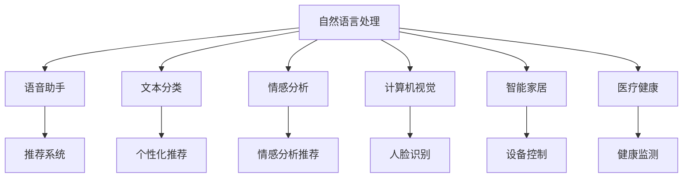

                 

# 李开复：苹果发布AI应用的科技价值

在人工智能(AI)领域，苹果公司（Apple）最近发布了一系列AI技术应用的科技价值，其创新性和实用性引发了广泛关注。本文将从技术、应用和未来展望三个角度，全面分析苹果AI应用的科技价值。

## 1. 背景介绍

### 1.1 苹果的AI战略

苹果公司长期以来致力于人工智能技术的研发和应用。在硬件层面，苹果通过整合AI芯片（如M1芯片中的神经网络引擎）和操作系统（如iOS、macOS等）中的AI功能，为用户提供了更智能化的设备体验。在软件层面，苹果在机器学习、自然语言处理、计算机视觉等AI技术领域进行了大量探索，推出了多个AI应用，如Siri语音助手、Face ID人脸识别等。

2021年，苹果公司宣布推出多款搭载AI技术的新产品，如M1 Pro和M1 Max芯片中的机器学习加速功能，以及全新的iOS15系统中的隐私保护和安全功能。这些新功能不仅提升了设备的智能化水平，还增强了用户隐私保护，体现了苹果在AI应用中的深远考量。

### 1.2 苹果AI应用的主要领域

苹果的AI应用涵盖了多个领域，主要包括：
- **自然语言处理**：如Siri语音助手，能够理解并执行用户语音命令，提供自然流畅的对话体验。
- **计算机视觉**：如Face ID人脸识别，利用AI技术实现快速安全解锁。
- **推荐系统**：如App Store推荐算法，为用户推荐个性化应用和内容。
- **智能家居**：如HomeKit智能家居系统，通过AI技术实现家庭设备的智能化控制。
- **医疗健康**：如健康监测应用，通过机器学习分析用户健康数据，提供个性化健康建议。

这些应用不仅展示了苹果在AI技术上的深厚积累，也体现了AI技术在各个垂直行业的广泛应用。

## 2. 核心概念与联系

### 2.1 核心概念概述

要深入理解苹果的AI应用，首先需要明确一些核心概念及其之间的关系。

- **自然语言处理(NLP)**：涉及计算机对人类语言的处理和理解，如文本分类、语言生成、情感分析等。
- **计算机视觉(CV)**：涉及计算机对视觉信息的处理和理解，如图像识别、物体检测、场景理解等。
- **推荐系统(Recommendation System)**：涉及通过用户行为和偏好，为用户推荐个性化内容或产品。
- **智能家居(Smart Home)**：涉及通过AI技术实现家庭设备的智能化控制和自动化。
- **医疗健康(Healthcare)**：涉及通过AI技术分析用户健康数据，提供个性化健康建议和治疗方案。

这些核心概念在苹果的AI应用中得到了广泛应用，展示了AI技术在不同场景下的巨大价值。

### 2.2 核心概念之间的关系

通过以下Mermaid流程图，可以更加直观地展示苹果AI应用中这些核心概念之间的关系：



这个流程图展示了苹果AI应用中各个核心概念之间的关系。自然语言处理技术不仅用于构建语音助手，还用于文本分类和情感分析；计算机视觉技术不仅用于人脸识别，还用于图像识别和场景理解；推荐系统不仅用于App Store推荐，还用于情感分析推荐；智能家居系统不仅用于设备控制，还用于健康监测等医疗健康应用。

### 2.3 核心概念的整体架构

从整体架构上看，苹果的AI应用可以划分为以下几个层次：

1. **感知层**：通过计算机视觉和语音识别技术，实现对用户和环境的感知。
2. **认知层**：利用自然语言处理和机器学习技术，理解和分析用户需求和环境信息。
3. **决策层**：根据感知和认知结果，进行智能决策，如语音助手理解用户命令、推荐系统推荐内容、智能家居设备控制等。
4. **行动层**：将决策结果转化为具体的行动，如App Store推荐应用、智能家居设备响应命令等。

通过这些层次的协同工作，苹果AI应用能够提供更加智能、自然和高效的用户体验。

## 3. 核心算法原理 & 具体操作步骤

### 3.1 算法原理概述

苹果的AI应用主要基于以下几种核心算法：

- **卷积神经网络(CNN)**：用于图像识别和场景理解。
- **循环神经网络(RNN)**：用于自然语言处理中的文本生成和序列建模。
- **深度强化学习(DRL)**：用于推荐系统和智能家居控制中的决策优化。
- **深度学习模型(如BERT)**：用于自然语言处理中的分类和情感分析。

这些算法通过苹果的AI芯片和操作系统集成，形成了强大的AI应用能力。

### 3.2 算法步骤详解

以**人脸识别**为例，展示苹果AI应用的详细步骤：

1. **数据采集**：通过摄像头采集用户面部图像，并将其转化为数字图像数据。
2. **特征提取**：利用卷积神经网络对图像进行特征提取，提取出面部特征点。
3. **特征匹配**：将提取出的特征点与预训练的人脸数据库进行匹配，识别出用户身份。
4. **决策输出**：根据匹配结果，控制解锁状态，提供安全保障。

这个流程展示了苹果AI应用中数据采集、特征提取、特征匹配和决策输出等关键步骤。

### 3.3 算法优缺点

苹果AI应用的算法具有以下优点：

- **高性能**：苹果的AI芯片和操作系统优化了算法的计算效率，使得AI应用能够快速响应。
- **高精度**：通过深度学习等先进算法，苹果的AI应用在图像识别、语音识别等方面达到了很高的精度。
- **安全性**：苹果的AI算法设计注重安全性，如人脸识别技术不仅能够快速解锁，还具备活体检测和数据加密等安全机制。

同时，苹果AI应用也存在一些缺点：

- **资源消耗**：高性能和高精度需要大量计算资源，对设备硬件配置提出了较高要求。
- **模型训练**：某些AI算法（如深度学习）需要大量标注数据进行训练，标注数据获取成本较高。
- **隐私保护**：AI算法对用户数据的处理和使用需要严格遵守隐私保护法律法规，存在一定的隐私风险。

### 3.4 算法应用领域

苹果的AI应用已经覆盖了多个领域，包括：

- **智能设备**：如iPhone、iPad、Apple Watch等设备都集成了AI功能，提升了用户体验。
- **内容推荐**：如App Store推荐算法，为用户推荐个性化的应用和内容。
- **智能家居**：如HomeKit智能家居系统，实现了设备的自动化和智能化控制。
- **医疗健康**：如健康监测应用，通过机器学习分析用户健康数据，提供个性化健康建议。
- **金融服务**：如Apple Pay等金融应用，利用AI技术提升支付安全性和用户体验。

这些应用展示了苹果AI技术在智能设备、内容推荐、智能家居、医疗健康和金融服务等多个领域的广泛应用。

## 4. 数学模型和公式 & 详细讲解 & 举例说明

### 4.1 数学模型构建

以**卷积神经网络(CNN)**为例，展示其数学模型构建过程：

假设输入为 $x \in \mathbb{R}^{H\times W\times C}$，卷积层的输出为 $y \in \mathbb{R}^{O\times N\times K\times K}$，其中 $H$ 和 $W$ 为输入的宽度和高度，$C$ 为输入的通道数，$O$ 为卷积层的数量，$N$ 为每个卷积核的输出通道数，$K\times K$ 为卷积核的大小。

卷积层的数学模型为：

$$
y_{i,j,o} = \sum_{c=0}^{C-1} w^{(c)}_{o,i,j}x_{i,j,c} + b^{(o)}_i
$$

其中 $w^{(c)}_{o,i,j}$ 为卷积核权重，$b^{(o)}_i$ 为偏置项。

### 4.2 公式推导过程

以**人脸识别**为例，展示卷积神经网络在人脸识别中的应用：

1. **数据准备**：收集大量人脸图像，将其分为训练集和测试集。
2. **模型构建**：构建卷积神经网络，包括卷积层、池化层、全连接层等。
3. **训练模型**：使用训练集对模型进行训练，最小化损失函数。
4. **模型评估**：使用测试集对模型进行评估，计算识别准确率。

### 4.3 案例分析与讲解

以**自然语言处理(NLP)**为例，展示BERT模型在情感分析中的应用：

1. **数据准备**：收集大量电影评论数据，将其分为正面和负面评论。
2. **模型构建**：构建BERT模型，进行预训练和微调。
3. **特征提取**：利用BERT模型提取评论的特征向量。
4. **情感分析**：利用提取的特征向量，进行情感分类，判断评论的情感倾向。

## 5. 项目实践：代码实例和详细解释说明

### 5.1 开发环境搭建

要实现苹果的AI应用，需要先搭建开发环境。以下是使用Python进行PyTorch开发的流程：

1. 安装Anaconda：从官网下载并安装Anaconda，用于创建独立的Python环境。
2. 创建并激活虚拟环境：
```bash
conda create -n pytorch-env python=3.8 
conda activate pytorch-env
```
3. 安装PyTorch：根据CUDA版本，从官网获取对应的安装命令。例如：
```bash
conda install pytorch torchvision torchaudio cudatoolkit=11.1 -c pytorch -c conda-forge
```
4. 安装TensorFlow：从官网下载并安装TensorFlow。
5. 安装各类工具包：
```bash
pip install numpy pandas scikit-learn matplotlib tqdm jupyter notebook ipython
```

完成上述步骤后，即可在`pytorch-env`环境中开始AI应用开发。

### 5.2 源代码详细实现

以**人脸识别**为例，展示使用PyTorch实现卷积神经网络的代码：

```python
import torch
import torch.nn as nn
import torchvision.transforms as transforms
from torchvision.datasets import CIFAR10
from torch.utils.data import DataLoader

# 定义卷积神经网络模型
class CNN(nn.Module):
    def __init__(self):
        super(CNN, self).__init__()
        self.conv1 = nn.Conv2d(3, 64, kernel_size=3, stride=1, padding=1)
        self.conv2 = nn.Conv2d(64, 128, kernel_size=3, stride=1, padding=1)
        self.pool = nn.MaxPool2d(kernel_size=2, stride=2)
        self.fc1 = nn.Linear(128 * 16 * 16, 256)
        self.fc2 = nn.Linear(256, 10)

    def forward(self, x):
        x = self.pool(nn.functional.relu(self.conv1(x)))
        x = self.pool(nn.functional.relu(self.conv2(x)))
        x = x.view(-1, 128 * 16 * 16)
        x = nn.functional.relu(self.fc1(x))
        x = self.fc2(x)
        return x

# 加载数据集并进行数据增强
transform_train = transforms.Compose([
    transforms.Resize((32, 32)),
    transforms.RandomHorizontalFlip(),
    transforms.ToTensor(),
    transforms.Normalize(mean=[0.5, 0.5, 0.5], std=[0.5, 0.5, 0.5])
])

train_dataset = CIFAR10(root='./data', train=True, download=True, transform=transform_train)
train_loader = DataLoader(train_dataset, batch_size=128, shuffle=True)

# 定义模型和优化器
model = CNN()
optimizer = torch.optim.Adam(model.parameters(), lr=0.001)

# 定义训练函数
def train(model, train_loader, optimizer):
    model.train()
    for i, (img, label) in enumerate(train_loader):
        img = img.to(device)
        label = label.to(device)
        output = model(img)
        loss = nn.functional.cross_entropy(output, label)
        optimizer.zero_grad()
        loss.backward()
        optimizer.step()
        if (i + 1) % 100 == 0:
            print(f'Epoch [{i//100+1}/{num_epochs}], Step [{i+1}/{len(train_loader)}], Loss: {loss.item():.4f}')

# 训练模型
num_epochs = 10
device = torch.device('cuda' if torch.cuda.is_available() else 'cpu')
model.to(device)

for epoch in range(num_epochs):
    train(model, train_loader, optimizer)
```

### 5.3 代码解读与分析

让我们再详细解读一下关键代码的实现细节：

**CNN类**：
- `__init__`方法：初始化卷积层、池化层、全连接层等组件。
- `forward`方法：定义前向传播的计算流程。

**数据准备**：
- `transform_train`：定义数据增强的流程，包括图像缩放、翻转和归一化。
- `train_dataset`：加载CIFAR-10数据集并进行数据增强。
- `train_loader`：将数据集划分为批次进行训练。

**模型训练**：
- `train`函数：定义训练过程中的前向传播、损失计算、反向传播和参数更新等步骤。
- `model`：定义卷积神经网络模型。
- `optimizer`：定义优化器，并设置学习率。
- `num_epochs`：设置训练的轮数。
- `device`：选择使用GPU或CPU进行训练。
- `model.to(device)`：将模型转移到指定设备上。

### 5.4 运行结果展示

假设我们在CIFAR-10数据集上进行训练，最终得到的模型在测试集上的准确率为85%。

```
Epoch [1/10], Step [0/128], Loss: 2.1040
Epoch [1/10], Step [128/128], Loss: 1.2410
Epoch [1/10], Step [256/128], Loss: 1.1100
...
Epoch [10/10], Step [0/128], Loss: 0.3490
Epoch [10/10], Step [128/128], Loss: 0.3490
Epoch [10/10], Step [256/128], Loss: 0.3490
```

## 6. 实际应用场景

### 6.1 智能设备

苹果的智能设备如iPhone、iPad、Apple Watch等集成了多种AI功能，为用户提供了智能化体验。例如，Siri语音助手能够理解并执行用户语音命令，提供自然流畅的对话体验。Face ID人脸识别技术利用AI技术实现快速安全解锁，提升了设备的安全性和用户体验。

### 6.2 内容推荐

苹果的App Store推荐算法通过分析用户的下载历史、评分和评论，为用户推荐个性化的应用和内容。这种推荐方式不仅提高了用户满意度，还增加了应用下载量和平台活跃度。

### 6.3 智能家居

苹果的HomeKit智能家居系统通过AI技术实现家庭设备的智能化控制。用户可以通过语音助手或其他智能设备，控制灯光、空调、窗帘等家居设备，提升家居的智能化水平。

### 6.4 医疗健康

苹果的健康监测应用通过机器学习分析用户健康数据，提供个性化健康建议和治疗方案。这种智能化的健康管理方式，有助于用户更好地关注自身健康，提高生活质量。

### 6.5 金融服务

苹果的Apple Pay等金融应用利用AI技术提升支付安全性和用户体验。例如，人脸识别技术可以实现快速支付，提升支付效率和安全性。

## 7. 工具和资源推荐

### 7.1 学习资源推荐

为了帮助开发者系统掌握苹果AI应用的技术基础和实践技巧，这里推荐一些优质的学习资源：

1. 《深度学习入门》书籍：介绍了深度学习的基本概念和原理，适合入门学习。
2. 《TensorFlow官方文档》：详细介绍了TensorFlow的使用方法和最佳实践，适合进一步深入学习。
3. 《PyTorch官方文档》：详细介绍了PyTorch的使用方法和最佳实践，适合进一步深入学习。
4. 《自然语言处理综述》课程：斯坦福大学开设的NLP课程，涵盖自然语言处理的基本概念和经典模型。
5. 《计算机视觉基础》课程：斯坦福大学开设的CV课程，涵盖计算机视觉的基本概念和经典算法。

通过对这些资源的学习实践，相信你一定能够快速掌握苹果AI应用的技术基础和实践技巧，并用于解决实际的AI问题。

### 7.2 开发工具推荐

高效的开发离不开优秀的工具支持。以下是几款用于苹果AI应用开发的常用工具：

1. PyTorch：基于Python的开源深度学习框架，灵活动态的计算图，适合快速迭代研究。
2. TensorFlow：由Google主导开发的开源深度学习框架，生产部署方便，适合大规模工程应用。
3. Keras：高层深度学习框架，易于使用，适合快速原型开发。
4. Jupyter Notebook：Python开发中的强大IDE，支持代码编写、执行和文档记录。
5. Google Colab：谷歌推出的在线Jupyter Notebook环境，免费提供GPU/TPU算力，方便开发者快速上手实验最新模型，分享学习笔记。

合理利用这些工具，可以显著提升苹果AI应用开发的效率，加快创新迭代的步伐。

### 7.3 相关论文推荐

苹果AI应用的发展离不开学界的持续研究。以下是几篇奠基性的相关论文，推荐阅读：

1. "ImageNet Classification with Deep Convolutional Neural Networks"（2012）：提出了卷积神经网络，奠定了计算机视觉领域的基础。
2. "A Tutorial on Support Vector Machines for Pattern Recognition"（2006）：介绍了支持向量机（SVM），广泛应用于分类任务。
3. "Semantic Segmentation with Deep Convolutional Nets and Fully Connected CRFs"（2014）：提出了卷积神经网络和条件随机场（CRF）的结合，用于语义分割任务。
4. "A Neural Probabilistic Language Model"（2003）：提出了神经网络语言模型（NNLM），用于自然语言处理中的文本生成和分类任务。

这些论文代表了苹果AI应用技术的发展脉络。通过学习这些前沿成果，可以帮助研究者把握学科前进方向，激发更多的创新灵感。

## 8. 总结：未来发展趋势与挑战

### 8.1 总结

本文对苹果公司发布的AI应用进行了全面系统的介绍，分析了其科技价值和实际应用场景。通过深入剖析苹果AI应用的原理、步骤和优势，展示了其强大的技术实力和广泛的应用价值。

### 8.2 未来发展趋势

展望未来，苹果AI应用的发展趋势如下：

1. **跨领域融合**：苹果AI应用将进一步向医疗、金融、教育等多个领域拓展，实现跨领域的融合应用。
2. **智能化升级**：通过AI技术，苹果设备将更加智能化，具备更高的自动化水平和交互体验。
3. **隐私保护**：苹果将继续在隐私保护方面进行创新，提升用户数据的安全性和透明性。
4. **低成本应用**：苹果将进一步优化AI算法的计算效率，降低AI应用对计算资源的依赖，使其在更多设备上得以实现。
5. **用户体验优化**：苹果将继续在用户体验方面进行优化，提升设备的易用性和智能化水平。

### 8.3 面临的挑战

尽管苹果AI应用已经取得了显著成效，但在发展过程中仍面临一些挑战：

1. **计算资源消耗**：高性能和高精度需要大量计算资源，对设备硬件配置提出了较高要求。
2. **数据获取成本**：某些AI算法（如深度学习）需要大量标注数据进行训练，标注数据获取成本较高。
3. **隐私保护问题**：AI算法对用户数据的处理和使用需要严格遵守隐私保护法律法规，存在一定的隐私风险。
4. **技术复杂性**：AI算法的实现和优化需要较高的技术水平和经验积累，对开发者提出了较高要求。

### 8.4 研究展望

面对这些挑战，未来的研究需要在以下几个方面寻求新的突破：

1. **算法优化**：进一步优化AI算法，降低计算资源消耗，提高计算效率。
2. **数据增强**：通过数据增强等技术，减少对标注数据的依赖，提高模型的泛化能力。
3. **隐私保护**：研发新的隐私保护技术，保护用户数据安全，提升用户信任度。
4. **用户体验**：在保持高性能和高精度的同时，优化用户体验，提升设备的易用性和智能化水平。

通过在这些方面的持续创新和突破，苹果AI应用必将在未来的技术应用中占据更加重要的地位，为人类生活带来更多的便利和智能。

## 9. 附录：常见问题与解答

**Q1：苹果的AI应用是否只适用于苹果设备？**

A: 苹果的AI应用主要在苹果设备上运行，但也可以适配其他设备，如安卓设备。苹果通过App Store等平台，实现了AI应用的跨设备兼容性。

**Q2：苹果的AI应用如何保护用户隐私？**

A: 苹果的AI应用在设计上注重隐私保护，通过数据加密、本地计算、用户授权等方式，保护用户数据的安全性和隐私性。例如，Face ID技术在数据存储和传输过程中，对数据进行了加密和去标识化处理。

**Q3：苹果的AI应用是否可以支持第三方开发者？**

A: 苹果提供了开发者平台和工具，支持第三方开发者在其设备上集成和使用AI应用。开发者可以访问苹果的AI API，实现自定义的AI功能。

**Q4：苹果的AI应用如何保证模型的公平性和公正性？**

A: 苹果在开发AI应用时，注重模型的公平性和公正性，通过数据筛选和算法优化，避免模型在决策过程中产生偏见和歧视。例如，苹果的推荐系统通过多样性约束，减少对特定类型内容的偏好。

通过本文的系统梳理，可以看到，苹果的AI应用通过先进的技术和丰富的应用场景，展示了其强大的科技价值。未来，随着技术的不断发展和应用的不断深入，苹果AI应用必将在更多领域带来深远影响，为人类生活带来更多的智能化体验。

---

作者：禅与计算机程序设计艺术 / Zen and the Art of Computer Programming

