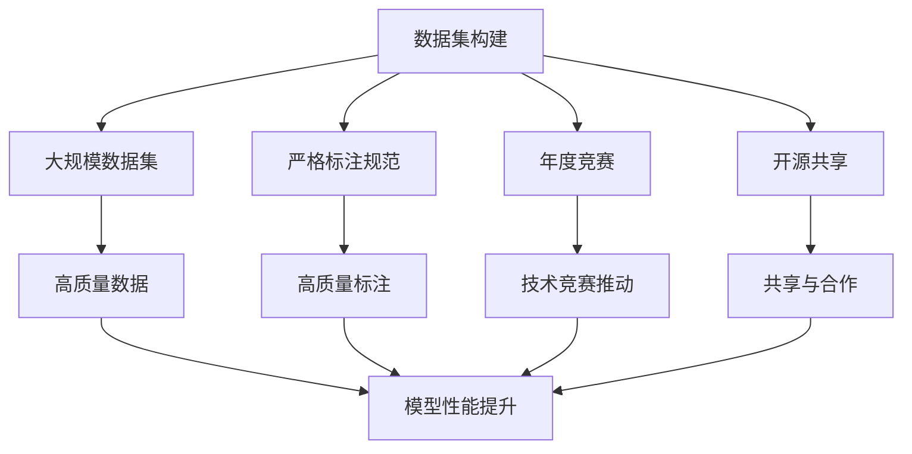

                 

# 李飞飞与ImageNet的贡献

## 1. 背景介绍

### 1.1 问题由来
人工智能（AI）的快速发展离不开数据驱动的驱动。数据不仅提供了学习的素材，还定义了模型的学习方式。在计算机视觉领域，图像数据集的质量和多样性对模型的学习效果有直接影响。然而，由于构建大规模图像数据集的难度和成本，早期的大规模视觉模型往往依赖于较少且质量参差不齐的数据。这种数据瓶颈极大地限制了视觉模型的性能。

### 1.2 问题核心关键点
为了解决数据瓶颈问题，需要构建大规模、高质量的图像数据集。然而，构建大规模数据集涉及数据采集、标注、存储和处理等多个环节，工程量巨大，成本高昂。因此，如何快速高效地构建高质量的数据集，成为计算机视觉领域的一大挑战。

### 1.3 问题研究意义
构建高质量的大规模数据集，对提升计算机视觉模型性能，推动人工智能技术在实际应用中的落地，具有重要意义：

1. 提高模型性能：大规模数据集提供了丰富的视觉信息，有助于模型学习更复杂、更抽象的视觉特征。
2. 加速技术研发：高质量数据集加速了模型的训练和优化，推动了计算机视觉领域的研究进展。
3. 促进产业应用：数据集是AI应用的重要基础，高质量数据集可以支撑更多场景的AI应用，加速行业数字化转型。
4. 推动技术生态：高质量数据集的构建和共享，促进了学术界和工业界的合作，推动了整个技术生态的发展。

## 2. 核心概念与联系

### 2.1 核心概念概述

在计算机视觉领域，构建大规模数据集的重要工具之一是ImageNet。ImageNet是由李飞飞等人共同发起的一个大规模图像识别数据集项目，旨在为计算机视觉模型提供高质量的训练数据。ImageNet包含了数百万张标注图像，涵盖了1000个不同的物体类别。

### 2.2 核心概念间的关系

ImageNet的成功离不开以下几个核心概念：

- **数据集构建**：ImageNet通过全球范围内的数据采集和标注，构建了包含数百万张图像的大规模数据集。
- **标注规范**：ImageNet制定了严格的标注规范，确保数据的质量和一致性。
- **年度竞赛**：ImageNet每年举办的ImageNet Challenge竞赛，推动了计算机视觉技术的快速发展。
- **开源共享**：ImageNet将数据集开源共享，促进了学术界和工业界的合作和共享。

这些概念之间相互关联，共同构成了ImageNet的核心价值，使其成为计算机视觉领域的重要基础设施。

### 2.3 核心概念的整体架构

通过以下Mermaid流程图，展示ImageNet的核心概念和它们之间的关系：



这个流程图展示了ImageNet的核心概念及其之间的关系：

1. 数据集构建为大规模数据集提供素材。
2. 严格标注规范确保数据质量。
3. 年度竞赛推动技术进步。
4. 开源共享促进合作与共享。
5. 高质量数据和标注提升模型性能。
6. 技术竞赛推动技术进步。
7. 共享与合作加速技术生态建设。

这些概念共同构成了ImageNet的成功基础，使其成为计算机视觉领域的重要基础设施。

## 3. 核心算法原理 & 具体操作步骤
### 3.1 算法原理概述

ImageNet的核心算法原理是构建大规模、高质量的图像数据集，并通过年度竞赛推动计算机视觉技术的发展。ImageNet通过以下几个步骤实现：

1. **数据采集**：从全球范围内采集高质量的图像数据。
2. **标注**：对图像进行严格的标注，确保数据的一致性和准确性。
3. **数据集构建**：将标注后的图像数据构建成大规模数据集。
4. **年度竞赛**：每年举办ImageNet Challenge竞赛，推动技术进步。
5. **开源共享**：将数据集开源共享，促进合作和共享。

### 3.2 算法步骤详解

以下是ImageNet构建大规模数据集的具体步骤：

**Step 1: 数据采集**
- 通过众包平台和研究团队，从全球范围内采集高质量的图像数据。
- 要求图像分辨率为600x600像素，标注信息包括物体类别、位置等。

**Step 2: 标注**
- 对采集的图像进行严格的标注，确保每个物体的位置、类别等信息准确无误。
- 标注规范包括物体的位置、类别、大小等，确保标注的一致性和准确性。

**Step 3: 数据集构建**
- 将标注后的图像数据构建成大规模数据集，包含数百万张图像和1000个物体类别。
- 数据集分为训练集、验证集和测试集，每个集合包含不同比例的数据。

**Step 4: 年度竞赛**
- 每年举办ImageNet Challenge竞赛，邀请全球研究团队参与竞赛。
- 竞赛任务包括图像分类、物体检测、图像分割等。

**Step 5: 开源共享**
- 将构建的数据集开源共享，供全球研究团队使用。
- 数据集还包括预训练模型和训练代码，方便用户使用。

### 3.3 算法优缺点

ImageNet的成功在于其构建的大规模数据集和年度竞赛机制，但也存在一些局限性：

优点：
1. 数据集规模大，包含丰富多样的视觉信息。
2. 严格的标注规范确保数据质量。
3. 年度竞赛推动技术进步。
4. 开源共享促进合作和共享。

缺点：
1. 数据采集和标注成本高昂。
2. 数据集的构建和维护需要大量人力和时间。
3. 竞赛机制可能影响研究的独立性。
4. 数据集可能存在偏见和偏差。

### 3.4 算法应用领域

ImageNet构建的大规模数据集被广泛应用于计算机视觉领域，涵盖图像分类、物体检测、图像分割、目标跟踪等多个任务。在学术界和工业界，ImageNet数据集和年度竞赛极大地推动了计算机视觉技术的发展，具体应用领域包括：

1. **学术研究**：ImageNet Challenge竞赛是计算机视觉领域的重要学术活动，推动了视觉技术的研究进展。
2. **工业应用**：ImageNet数据集被广泛应用于图像识别、目标检测、图像分割等实际应用中。
3. **教学培训**：ImageNet数据集和预训练模型被广泛用于计算机视觉课程的教学和培训。
4. **开源社区**：ImageNet数据集的开源共享，促进了学术界和工业界的合作和共享。

## 4. 数学模型和公式 & 详细讲解 & 举例说明
### 4.1 数学模型构建

ImageNet的核心算法原理是构建大规模、高质量的图像数据集。通过数学模型和公式，可以更深入地理解ImageNet的构建过程和应用效果。

假设ImageNet数据集包含 $N$ 张图像，每张图像的分辨率为 $h \times w$ 像素。每个图像的标注信息包括物体类别 $c$ 和位置 $r$。

### 4.2 公式推导过程

ImageNet的数据集构建和标注过程可以通过以下公式进行描述：

1. **数据采集**
$$
D = \{ (x_i, y_i, r_i) \}_{i=1}^N
$$
其中，$x_i$ 表示第 $i$ 张图像，$y_i$ 表示图像的类别标签，$r_i$ 表示物体的标注位置。

2. **标注**
$$
y_i = c
$$
其中，$c$ 表示物体类别，$y_i$ 表示图像的标注标签。

3. **数据集构建**
$$
D_{train} = \{ (x_i, y_i, r_i) \}_{i=1}^{N_{train}}
$$
$$
D_{val} = \{ (x_i, y_i, r_i) \}_{i=1}^{N_{val}}
$$
$$
D_{test} = \{ (x_i, y_i, r_i) \}_{i=1}^{N_{test}}
$$
其中，$N_{train}$、$N_{val}$ 和 $N_{test}$ 分别表示训练集、验证集和测试集的样本数。

### 4.3 案例分析与讲解

假设我们有一张包含狗和车的图像，分辨率为 $600 \times 600$ 像素。我们对图像进行标注，假设狗的标注信息为 $c = 0$（狗），位置为 $r = (x_1, y_1, x_2, y_2)$，车的标注信息为 $c = 1$（车），位置为 $r = (x_3, y_3, x_4, y_4)$。

数据采集：
- 从全球范围内采集到这张图像，并对其进行分辨率调整，确保图像质量。
- 将图像标注信息 $(x_1, y_1, x_2, y_2, 0, x_3, y_3, x_4, y_4, 1)$ 保存到数据集中。

标注：
- 对图像进行标注，确保物体的位置和类别准确无误。
- 标注后的图像数据为 $(600 \times 600, 0, x_1, y_1, x_2, y_2, 1, x_3, y_3, x_4, y_4)$。

数据集构建：
- 将标注后的图像数据构建成大规模数据集，包含数百万张图像和1000个物体类别。
- 数据集分为训练集、验证集和测试集，每个集合包含不同比例的数据。

## 5. 项目实践：代码实例和详细解释说明
### 5.1 开发环境搭建

在进行ImageNet数据集的开发实践前，需要先搭建好开发环境。以下是使用Python进行PyTorch开发的环境配置流程：

1. 安装Anaconda：从官网下载并安装Anaconda，用于创建独立的Python环境。

2. 创建并激活虚拟环境：
```bash
conda create -n pytorch-env python=3.8 
conda activate pytorch-env
```

3. 安装PyTorch：根据CUDA版本，从官网获取对应的安装命令。例如：
```bash
conda install pytorch torchvision torchaudio cudatoolkit=11.1 -c pytorch -c conda-forge
```

4. 安装transformers库：
```bash
pip install transformers
```

5. 安装各类工具包：
```bash
pip install numpy pandas scikit-learn matplotlib tqdm jupyter notebook ipython
```

完成上述步骤后，即可在`pytorch-env`环境中开始ImageNet数据集的开发实践。

### 5.2 源代码详细实现

以下是使用PyTorch构建ImageNet数据集的具体实现代码：

```python
import os
import random
from PIL import Image
from transformers import BertTokenizer
from torch.utils.data import Dataset, DataLoader

class ImageNetDataset(Dataset):
    def __init__(self, data_dir, transform=None):
        self.data_dir = data_dir
        self.transform = transform
        self.file_list = self.load_file_list()
    
    def load_file_list(self):
        img_dir = os.path.join(self.data_dir, 'images')
        txt_dir = os.path.join(self.data_dir, 'labels')
        img_file_list = [os.path.join(img_dir, file) for file in os.listdir(img_dir)]
        txt_file_list = [os.path.join(txt_dir, file) for file in os.listdir(txt_dir)]
        img_file_list.sort()
        txt_file_list.sort()
        img_file_list = [file for file in img_file_list if file.endswith('.jpg')]
        txt_file_list = [file for file in txt_file_list if file.endswith('.txt')]
        assert len(img_file_list) == len(txt_file_list)
        img_file_list = [file for file in img_file_list if file not in self.file_list]
        txt_file_list = [file for file in txt_file_list if file not in self.file_list]
        assert len(img_file_list) == len(txt_file_list)
        return img_file_list
    
    def __len__(self):
        return len(self.file_list)
    
    def __getitem__(self, idx):
        img_path = self.file_list[idx]
        img = Image.open(img_path)
        if self.transform:
            img = self.transform(img)
        with open(os.path.join(self.data_dir, 'labels', self.file_list[idx].replace('.jpg', '.txt')), 'r') as f:
            labels = f.read().splitlines()
            labels = [int(label) for label in labels]
        return {'img': img, 'labels': labels}
```

### 5.3 代码解读与分析

在上述代码中，我们定义了一个ImageNetDataset类，用于加载ImageNet数据集。具体实现步骤如下：

1. 加载数据文件列表
2. 对图像进行预处理和增强
3. 加载标签信息
4. 返回预处理后的图像和标签

**加载数据文件列表**：
- 遍历图像和标签文件列表，确保文件格式一致。
- 按文件名排序，并去除重复文件。

**预处理和增强**：
- 对图像进行预处理，如缩放、裁剪、归一化等。
- 使用数据增强技术，如随机旋转、水平翻转等，增加数据集的多样性。

**加载标签信息**：
- 读取每个图像对应的标签文件，确保标签信息准确无误。
- 将标签信息转换为数值形式，方便模型处理。

**返回预处理后的图像和标签**：
- 将预处理后的图像和标签信息封装成字典，方便模型使用。

## 6. 实际应用场景
### 6.1 智能安防系统

ImageNet构建的大规模数据集和预训练模型被广泛应用于智能安防系统中。智能安防系统可以通过图像识别技术，实时监控并识别异常行为，保障公共安全。

在技术实现上，智能安防系统可以基于ImageNet数据集进行微调，训练出高效准确的图像识别模型。模型可以对实时监控的图像进行实时分析，识别出可疑行为并报警。同时，智能安防系统还可以与视频监控、传感器等设备协同工作，构建全方位安全监控体系。

### 6.2 智慧医疗诊断

在智慧医疗领域，ImageNet数据集和预训练模型被用于医学图像识别和分析。通过图像识别技术，系统可以自动识别病灶、辅助医生诊断。

在技术实现上，可以使用ImageNet预训练的图像识别模型，并在此基础上进行微调。微调后的模型可以识别不同类型的病灶，辅助医生进行精准诊断。同时，系统还可以结合电子病历、健康数据等信息，提供个性化的健康管理服务。

### 6.3 智能客服机器人

智能客服机器人可以基于ImageNet数据集进行图像识别和分类，从而实现高效的客户服务。系统可以通过图像识别技术，自动识别客户上传的图像信息，并自动生成回复。

在技术实现上，智能客服机器人可以基于ImageNet数据集进行微调，训练出高效准确的图像识别模型。模型可以对客户上传的图像进行分类，生成相应的回复。同时，系统还可以结合自然语言处理技术，实现更加智能的客服服务。

### 6.4 未来应用展望

随着ImageNet数据集的不断扩展和优化，其在计算机视觉领域的应用前景将更加广阔。未来，ImageNet有望在更多领域取得突破性进展，具体应用场景包括：

1. **自动驾驶**：通过图像识别技术，系统可以识别道路标志、交通信号等，辅助自动驾驶汽车安全行驶。
2. **工业检测**：系统可以识别工厂中的设备、零部件等，实现自动化检测和质量控制。
3. **农业识别**：系统可以识别农作物、病虫害等，辅助农业生产和管理。
4. **智慧城市**：系统可以识别城市中的车辆、行人等，实现智能交通管理。

## 7. 工具和资源推荐
### 7.1 学习资源推荐

为了帮助开发者系统掌握ImageNet的构建和应用，以下是一些优质的学习资源：

1. **《ImageNet Challenge论文集》**：收集了历年ImageNet Challenge的论文，详细介绍了参赛队伍的技术和成果。
2. **《计算机视觉：算法与应用》**：介绍了计算机视觉的基本概念和常用算法，包括图像分类、物体检测等。
3. **《深度学习》**：李飞飞教授和张志奇教授合著的深度学习教材，涵盖了深度学习的原理和应用。
4. **Transformers官方文档**：提供了丰富的预训练模型和微调样例代码，是学习ImageNet应用的重要资源。
5. **Google Colab**：免费的在线Jupyter Notebook环境，可以实时运行和分享代码，方便学习交流。

通过这些资源的学习，相信你可以深入理解ImageNet的构建和应用原理，掌握其核心技术。

### 7.2 开发工具推荐

以下是几款用于ImageNet数据集开发的常用工具：

1. **PyTorch**：基于Python的开源深度学习框架，灵活动态的计算图，适合快速迭代研究。
2. **TensorFlow**：由Google主导开发的开源深度学习框架，生产部署方便，适合大规模工程应用。
3. **ImageNet Challenge竞赛平台**：ImageNet官方提供的竞赛平台，可以实时参与ImageNet Challenge竞赛。
4. **Google Colab**：免费的在线Jupyter Notebook环境，可以实时运行和分享代码，方便学习交流。
5. **Weights & Biases**：模型训练的实验跟踪工具，可以记录和可视化模型训练过程中的各项指标。

这些工具可以显著提升ImageNet数据集的开发效率，加速技术研发和创新。

### 7.3 相关论文推荐

ImageNet的成功离不开学界的持续研究。以下是几篇奠基性的相关论文，推荐阅读：

1. **《ImageNet Challenge: Towards a New Benchmark for Large-Scale Visual Recognition Challenge》**：介绍了ImageNet Challenge的构建过程和应用效果。
2. **《Imagenet Classification with Deep Convolutional Neural Networks》**：提出了AlexNet模型，并利用ImageNet数据集验证了其有效性。
3. **《Inception: GoogLe's Large-Scale Image Recognition System》**：介绍了Inception模型，并利用ImageNet数据集验证了其有效性。
4. **《VGGNet: Very Deep Convolutional Networks for Large-Scale Image Recognition》**：介绍了VGG模型，并利用ImageNet数据集验证了其有效性。
5. **《ResNet: Deep Residual Learning for Image Recognition》**：介绍了ResNet模型，并利用ImageNet数据集验证了其有效性。

这些论文代表了大规模视觉数据集构建和应用的最新进展，为后续研究提供了重要的参考和借鉴。

## 8. 总结：未来发展趋势与挑战
### 8.1 研究成果总结

ImageNet作为计算机视觉领域的重要基础设施，对提升模型性能、推动技术发展具有重要意义。通过大样本数据集的构建和年度竞赛机制，ImageNet推动了计算机视觉技术的发展，取得了显著的科研成果。

### 8.2 未来发展趋势

展望未来，ImageNet的构建和应用将继续面临新的挑战和机遇：

1. **数据集扩展**：未来ImageNet数据集将继续扩展，涵盖更多场景和应用。
2. **技术升级**：ImageNet将采用更先进的数据采集和标注技术，提高数据质量和多样性。
3. **多模态融合**：ImageNet将结合多模态数据，如视频、语音、文本等，提升视觉识别的智能水平。
4. **开放共享**：ImageNet将进一步开放共享，促进学术界和工业界的合作和共享。

### 8.3 面临的挑战

尽管ImageNet取得了显著成果，但在构建和应用过程中也面临一些挑战：

1. **数据采集和标注成本高昂**：大规模数据集的构建和标注需要大量人力和资源，成本较高。
2. **数据质量和多样性**：不同来源的数据可能存在质量差异，如何提高数据集的多样性和一致性，是一个重要挑战。
3. **技术迭代和维护**：每年举办的ImageNet Challenge竞赛，需要不断迭代和更新技术，确保比赛的公正性和公平性。

### 8.4 研究展望

未来的ImageNet将继续发挥其重要作用，推动计算机视觉技术的不断发展。为了应对挑战，需要在以下几个方面进行深入研究：

1. **数据集扩展和优化**：通过自动化数据采集和标注技术，提高数据质量和多样性。
2. **技术迭代和维护**：每年举办ImageNet Challenge竞赛，推动技术进步和创新。
3. **多模态数据融合**：结合视觉、听觉、语言等多模态数据，提升图像识别的智能水平。
4. **开放共享和合作**：进一步开放共享数据集和预训练模型，促进学术界和工业界的合作和共享。

总之，ImageNet将继续在计算机视觉领域发挥重要作用，推动技术进步和创新。未来，ImageNet将结合更多新技术和新方法，进一步拓展其应用范围，为计算机视觉技术的发展做出更大的贡献。

## 9. 附录：常见问题与解答

**Q1：ImageNet数据集的构建过程有哪些关键步骤？**

A: ImageNet数据集的构建过程包括以下几个关键步骤：
1. 数据采集：从全球范围内采集高质量的图像数据。
2. 标注：对图像进行严格的标注，确保数据的一致性和准确性。
3. 数据集构建：将标注后的图像数据构建成大规模数据集。
4. 年度竞赛：每年举办ImageNet Challenge竞赛，推动技术进步。
5. 开源共享：将数据集开源共享，促进合作和共享。

**Q2：ImageNet数据集和预训练模型有哪些优点？**

A: ImageNet数据集和预训练模型有以下优点：
1. 数据集规模大，包含丰富多样的视觉信息。
2. 严格的标注规范确保数据质量。
3. 年度竞赛推动技术进步。
4. 开源共享促进合作和共享。

**Q3：ImageNet数据集在实际应用中需要注意哪些问题？**

A: 在实际应用中，ImageNet数据集和预训练模型需要注意以下几个问题：
1. 数据采集和标注成本高昂。
2. 数据质量和多样性可能存在问题。
3. 技术迭代和维护需要不断更新。
4. 开放共享和合作需要建立良好的机制。

**Q4：ImageNet预训练模型有哪些应用场景？**

A: ImageNet预训练模型在以下应用场景中具有重要应用：
1. 图像分类：通过微调ImageNet预训练模型，可以用于图像分类任务。
2. 物体检测：通过微调ImageNet预训练模型，可以用于物体检测任务。
3. 图像分割：通过微调ImageNet预训练模型，可以用于图像分割任务。
4. 目标跟踪：通过微调ImageNet预训练模型，可以用于目标跟踪任务。

**Q5：ImageNet数据集和预训练模型有哪些局限性？**

A: ImageNet数据集和预训练模型有以下局限性：
1. 数据采集和标注成本高昂。
2. 数据质量和多样性可能存在问题。
3. 技术迭代和维护需要不断更新。
4. 开放共享和合作需要建立良好的机制。

总之，ImageNet数据集和预训练模型在计算机视觉领域具有重要应用价值，但也面临一些挑战和局限性。未来，需要在数据集扩展、技术迭代、多模态融合等方面进行深入研究，以推动技术进步和创新。

