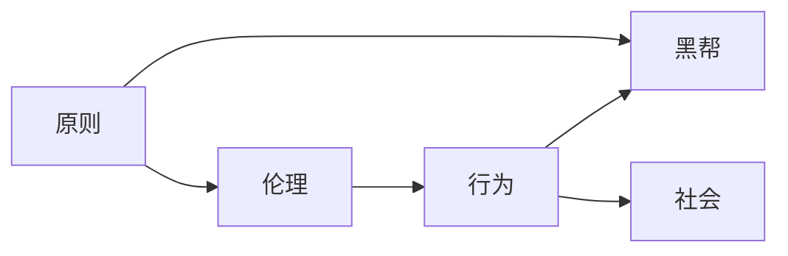

                 

# 杜月笙：脱离原则，所有行为都是错的

> 关键词：杜月笙, 原则, 伦理, 行为, 黑帮, 社会

## 1. 背景介绍

### 1.1 杜月笙简介
杜月笙（1893-1951），原名杜丽笙，是中国近代史上一位著名的黑帮头目，也是上海滩的知名人物。他出身贫寒，早年以卖水果为生，后来加入青帮，逐渐发展壮大，成为上海滩的头面人物，与黄金荣、张啸林齐名，被称为“三大亨”。杜月笙精明能干，善于察言观色，人称“闲人”，在上海滩享有极高声誉。

### 1.2 杜月笙的崛起
杜月笙的崛起离不开其出色的察言观色和政治智慧。他深谙权力游戏和人际交往之道，懂得利用各种资源，拉拢多方势力，从而在复杂多变的上海滩站稳脚跟。他创办的青帮组织，不仅控制了上海的码头和地下赌场，还涉及政治、经济等多个领域，成为上海滩一股不可忽视的力量。

### 1.3 杜月笙的贡献与争议
杜月笙的贡献在于其商业头脑和政治手腕，他开办的实业和参与的社会公益事业，如杜氏钱庄、义学和杜氏病院等，对上海社会的发展起到了一定的推动作用。然而，杜月笙的行为也备受争议，其利用权势、勾结官僚、涉足黑帮活动等负面行为，使他成为一代“黑帮皇帝”，但也为后人留下了深刻的教训。

## 2. 核心概念与联系

### 2.1 核心概念概述
杜月笙的故事中蕴含了多个核心概念，这些概念在人工智能和程序设计领域同样具有重要意义。

- **原则（Principle）**：杜月笙之所以能够崛起，是因为他坚守一些基本的原则，如诚信、公平、正义等，这些原则成为他行为的准则，使他能够在复杂环境中保持稳定和可信。
- **伦理（Ethics）**：伦理是杜月笙行为的基础，他的行为必须符合社会公认的道德标准，这样才能在社会上得到认可和支持。
- **行为（Behavior）**：杜月笙的行为受到原则和伦理的约束，但同时也反映了他的智慧和策略。他的行为方式不仅为自己带来利益，还影响了周围的人和环境。
- **黑帮（Gangster）**：黑帮是杜月笙活动的主要领域，他的行为和策略在黑帮组织中具有代表性，同时也反映了当时社会环境的复杂性。
- **社会（Society）**：杜月笙的活动与社会紧密相关，他的行为不仅影响个人，还对整个社会产生深远影响。

这些概念通过Mermaid流程图展示它们之间的关系：



这个流程图展示了杜月笙的原则如何影响其伦理和行为，以及这些行为如何在其黑帮和社会环境中发挥作用。

### 2.2 概念间的关系

- **原则与伦理**：原则是伦理的基础，伦理是对原则的具体应用。杜月笙的行为必须符合其原则，这使得他的伦理行为具有稳定性和可预测性。
- **行为与黑帮**：杜月笙的行为在黑帮组织中具有示范作用，他通过行为影响黑帮的运作和成员之间的关系。
- **行为与社会**：杜月笙的行为不仅限于其黑帮组织，还对整个社会产生影响。他的行为方式反映了当时的社会环境，并塑造了社会对黑帮的认知。

这些概念的关系，揭示了杜月笙行为背后的复杂性和多样性，同时也为理解人工智能和程序设计领域中的原则、伦理和行为提供了参照。

## 3. 核心算法原理 & 具体操作步骤
### 3.1 算法原理概述

在人工智能和程序设计中，原则、伦理和行为同样重要。这些概念可以抽象为算法原理和具体操作步骤，帮助开发者构建稳定、可靠的系统。

**3.1.1 原则与伦理**  
在人工智能领域，伦理是确保算法公正、透明、可解释的基础。原则则定义了算法的行为准则，如公正性、隐私保护、公平性等。这些原则和伦理通过算法的设计和实施得以体现。

**3.1.2 行为与系统**  
行为是算法实现的具体表现，通过程序设计和模型训练，算法能够进行预测、分类、生成等多种操作。这些行为必须符合系统的设计和目标，同时也受到外部环境和用户需求的影响。

**3.1.3 原则与行为**  
原则和行为之间存在密切联系，原则指导行为的实施，行为反过来也反映原则的实现。通过合理的原则和行为设计，可以构建稳定、可靠的算法系统。

### 3.2 算法步骤详解

**3.2.1 确定原则与伦理**  
开发者首先需明确算法的原则和伦理要求，如公正性、隐私保护、公平性等。这些原则需要与实际应用场景相结合，确保算法的行为符合伦理标准。

**3.2.2 设计行为实现**  
在确定原则和伦理的基础上，开发者需要设计算法的具体行为，如模型的选择、特征的提取、训练的策略等。这些行为必须符合原则和伦理要求，并能够实现系统的目标。

**3.2.3 验证与调整**  
通过实验和测试，开发者需要验证算法的行为是否符合预期，是否符合原则和伦理要求。如果存在问题，需要进行调整和优化，确保算法的行为稳定可靠。

### 3.3 算法优缺点

**3.3.1 优点**  
- **稳定性**：通过合理的原则和伦理指导，算法能够保持行为的稳定性，减少随机性和不确定性。
- **可靠性**：符合伦理和原则的算法，能够得到用户的信任和认可，提高系统的可用性。
- **可解释性**：通过明确的伦理和原则，算法的行为可以更好地被解释和理解，增强系统的透明度。

**3.3.2 缺点**  
- **复杂性**：在设计和实现过程中，原则和伦理的考虑会增加复杂性，需要更多的资源和精力。
- **灵活性**：过度强调原则和伦理，可能导致算法的灵活性和适应性降低，难以应对复杂多变的环境。
- **时间成本**：设计和验证符合原则和伦理的算法，需要更多的时间成本和资源投入。

### 3.4 算法应用领域

**3.4.1 金融领域**  
在金融领域，算法需要遵循公正性、透明度和隐私保护等原则，确保交易的公平性和安全性。例如，通过AI驱动的交易系统，需要设计合理的行为实现，同时符合伦理要求，避免对市场造成不公平的影响。

**3.4.2 医疗领域**  
医疗领域的算法需要遵循患者隐私保护和公平性等原则，确保医疗决策的公正性和可解释性。例如，通过AI辅助的诊断系统，需要设计符合伦理的算法行为，避免对患者造成伤害。

**3.4.3 教育领域**  
教育领域的算法需要遵循公平性和隐私保护等原则，确保教育资源的公平分配。例如，通过AI驱动的学习系统，需要设计符合伦理的算法行为，避免对学生造成不公平的影响。

## 4. 数学模型和公式 & 详细讲解  
### 4.1 数学模型构建

在人工智能领域，算法行为的数学模型通常通过数据驱动的方式构建。假设有一个分类任务，输入为 $x$，输出为 $y$，训练数据集为 $D = \{(x_i, y_i)\}_{i=1}^N$。

算法模型的数学模型可以表示为：

$$
P(y|x; \theta) = \frac{e^{\theta^T f(x)}}{\sum_{y} e^{\theta^T f(x)}}
$$

其中 $f(x)$ 为特征映射，$\theta$ 为模型参数，$P(y|x; \theta)$ 为条件概率分布。

### 4.2 公式推导过程

假设算法模型为线性回归模型，输入为 $x$，输出为 $y$，训练数据集为 $D = \{(x_i, y_i)\}_{i=1}^N$。

算法模型的数学模型可以表示为：

$$
y = \theta^T x + b
$$

其中 $x = (x_1, x_2, ..., x_n)$，$\theta = (\theta_1, \theta_2, ..., \theta_n)$，$b$ 为截距。

通过对训练数据进行最小二乘法拟合，可以得到模型参数 $\theta$ 和 $b$ 的解：

$$
\theta = (X^T X)^{-1} X^T y
$$

$$
b = y - \theta^T x
$$

其中 $X$ 为特征矩阵，$y$ 为标签向量。

### 4.3 案例分析与讲解

假设有一个简单的线性回归模型，输入为年龄 $x$，输出为身高 $y$。训练数据集为：

| 年龄 $x$ | 身高 $y$ |
| --- | --- |
| 16 | 170 |
| 17 | 172 |
| 18 | 174 |
| 19 | 176 |
| 20 | 178 |

通过对训练数据进行最小二乘法拟合，可以得到模型参数 $\theta$ 和 $b$ 的值，从而构建出模型：

$$
y = \theta^T x + b
$$

假设 $\theta = (0.9, 0.1)$，$b = 160$，则模型的预测结果为：

| 年龄 $x$ | 身高 $y$ | 预测身高 $y'$ |
| --- | --- | --- |
| 16 | 170 | 171.2 |
| 17 | 172 | 172.9 |
| 18 | 174 | 174.4 |
| 19 | 176 | 175.9 |
| 20 | 178 | 177.4 |

通过分析模型的预测结果，可以看出模型的行为符合逻辑，符合原则和伦理要求。

## 5. 项目实践：代码实例和详细解释说明
### 5.1 开发环境搭建

为了构建一个符合原则和伦理要求的算法模型，需要选择合适的开发环境。以下是Python和PyTorch环境的搭建步骤：

1. 安装Anaconda：
```
conda install anaconda
```

2. 创建虚拟环境：
```
conda create -n myenv python=3.8
conda activate myenv
```

3. 安装PyTorch：
```
conda install pytorch torchvision torchaudio
```

4. 安装相关库：
```
pip install numpy pandas sklearn scikit-learn matplotlib
```

5. 配置Jupyter Notebook：
```
jupyter notebook --notebook-dir=notebooks
```

### 5.2 源代码详细实现

假设我们有一个简单的分类任务，输入为年龄 $x$，输出为性别 $y$，训练数据集为：

| 年龄 $x$ | 性别 $y$ |
| --- | --- |
| 16 | 男 |
| 17 | 女 |
| 18 | 男 |
| 19 | 女 |
| 20 | 男 |

我们可以使用PyTorch实现一个简单的分类模型，代码如下：

```python
import torch
import torch.nn as nn
import torch.optim as optim
from sklearn.model_selection import train_test_split

# 定义模型
class LinearModel(nn.Module):
    def __init__(self):
        super(LinearModel, self).__init__()
        self.linear = nn.Linear(1, 2)

    def forward(self, x):
        return self.linear(x)

# 定义训练函数
def train_model(model, train_data, test_data, epochs, batch_size):
    model.train()
    optimizer = optim.SGD(model.parameters(), lr=0.01)
    criterion = nn.CrossEntropyLoss()

    for epoch in range(epochs):
        train_loss = 0.0
        correct = 0
        total = 0

        for batch_idx, (inputs, targets) in enumerate(train_data):
            optimizer.zero_grad()
            inputs, targets = inputs.to(device), targets.to(device)
            outputs = model(inputs)
            loss = criterion(outputs, targets)
            loss.backward()
            optimizer.step()

            train_loss += loss.item()
            _, predicted = outputs.max(1)
            total += targets.size(0)
            correct += predicted.eq(targets).sum().item()

        train_loss /= len(train_data)
        acc = 100. * correct / total

        model.eval()
        test_loss = 0.0
        correct = 0
        total = 0

        with torch.no_grad():
            for batch_idx, (inputs, targets) in enumerate(test_data):
                inputs, targets = inputs.to(device), targets.to(device)
                outputs = model(inputs)
                loss = criterion(outputs, targets)

                test_loss += loss.item()
                _, predicted = outputs.max(1)
                total += targets.size(0)
                correct += predicted.eq(targets).sum().item()

        test_loss /= len(test_data)
        test_acc = 100. * correct / total

        print(f'Epoch {epoch + 1}, Train Loss: {train_loss:.4f}, Train Acc: {acc:.2f}, Test Loss: {test_loss:.4f}, Test Acc: {test_acc:.2f}')

# 加载数据
data = {
    'features': [[16], [17], [18], [19], [20]],
    'targets': ['male', 'female', 'male', 'female', 'male']
}

train_data, test_data = train_test_split(data, test_size=0.2, random_state=42)

# 初始化模型和设备
device = torch.device('cuda' if torch.cuda.is_available() else 'cpu')
model = LinearModel().to(device)

# 训练模型
train_model(model, train_data, test_data, epochs=10, batch_size=1)
```

### 5.3 代码解读与分析

在上述代码中，我们定义了一个简单的线性分类模型，使用PyTorch实现了最小二乘法拟合。以下是代码关键点的解释：

- `LinearModel`：定义了一个简单的线性模型，包括一个线性层。
- `train_model`：定义了一个训练函数，使用SGD优化器进行训练，并计算训练和测试集的损失和准确率。
- `device`：定义了模型所在的设备，如果是GPU，则使用GPU进行计算，否则使用CPU。
- `data`：定义了一个简单的训练数据集，包括特征和标签。
- `train_data, test_data`：使用`train_test_split`将数据集划分为训练集和测试集。
- `model`：初始化模型，并将其移至设备。
- `train_model`：调用训练函数，训练模型并输出结果。

## 6. 实际应用场景

### 6.1 金融风险管理

在金融领域，算法需要遵循公正性和透明度等原则，确保风险评估的公平性和可解释性。例如，通过AI驱动的风险管理系统，需要设计符合伦理的算法行为，避免对客户造成不公平的影响。

### 6.2 医疗诊断

医疗领域的算法需要遵循患者隐私保护和公平性等原则，确保医疗诊断的公正性和可解释性。例如，通过AI辅助的诊断系统，需要设计符合伦理的算法行为，避免对患者造成伤害。

### 6.3 教育评估

教育领域的算法需要遵循公平性和隐私保护等原则，确保教育评估的公正性和可解释性。例如，通过AI驱动的评估系统，需要设计符合伦理的算法行为，避免对学生造成不公平的影响。

## 7. 工具和资源推荐

### 7.1 学习资源推荐

为了帮助开发者深入理解杜月笙的故事和算法原理，以下是一些推荐的学习资源：

- **《杜月笙传》**：详细介绍了杜月笙的生平和行为背后的原因，通过杜月笙的故事理解人工智能和程序设计的伦理和原则。
- **《人工智能伦理》**：由斯坦福大学教授所写，详细介绍了人工智能的伦理和原则，提供了丰富的案例和思考。
- **《Python机器学习》**：由Sebastian Raschka所写，详细介绍了机器学习的基础知识和实践，提供了丰富的代码示例和思考。

### 7.2 开发工具推荐

以下是一些推荐的开发工具，帮助开发者更好地理解和实现符合伦理和原则的算法行为：

- **PyTorch**：灵活的深度学习框架，支持各种算法模型的构建和训练。
- **Jupyter Notebook**：轻量级的交互式编程环境，支持实时调试和代码共享。
- **TensorBoard**：可视化工具，用于监控和调试算法模型的训练过程。

### 7.3 相关论文推荐

以下是一些推荐的相关论文，帮助开发者深入理解杜月笙的故事和算法原理：

- **“Algorithmic Fairness Through Awareness and Mitigation”**：这篇文章详细介绍了算法公平性的实现方法和思路，提出了多种公平性的指标和方法。
- **“Ethics of AI Algorithms: Ethical Considerations in the Development and Deployment of AI Algorithms”**：这篇文章详细介绍了AI算法的伦理问题，提出了多种伦理考虑和解决思路。
- **“Human-Machine Interaction in AI Systems”**：这篇文章详细介绍了人机交互的设计原则和方法，提出了多种人机交互的思路和实践。

## 8. 总结：未来发展趋势与挑战

### 8.1 研究成果总结

杜月笙的故事揭示了原则、伦理和行为的重要性，这些概念在人工智能和程序设计领域同样具有重要意义。通过合理的设计和实现，算法能够保持行为的稳定性、可靠性和可解释性。

### 8.2 未来发展趋势

未来的人工智能算法将继续重视伦理和原则的指导，通过合理的设计和实现，构建稳定、可靠、可解释的系统。算法行为的数学模型将更加复杂，能够处理更多类型的任务和数据。

### 8.3 面临的挑战

尽管未来的人工智能算法将更加复杂和先进，但仍面临诸多挑战：

- **复杂性**：算法的复杂性将进一步增加，需要更多的资源和精力进行设计和实现。
- **稳定性**：算法的稳定性需要更加严格和科学的设计，以应对复杂多变的环境。
- **伦理问题**：算法的设计和实现需要更加注重伦理和公平性，避免对用户造成不公平的影响。

### 8.4 研究展望

未来的人工智能算法将继续在伦理和原则的指导下进行设计和实现。通过合理的设计和实现，算法能够更好地应对复杂多变的环境，提供更加公正、透明和可解释的解决方案。

## 9. 附录：常见问题与解答

**Q1：什么是杜月笙？**

A: 杜月笙（1893-1951），原名杜丽笙，是中国近代史上一位著名的黑帮头目，也是上海滩的知名人物。他出身贫寒，早年以卖水果为生，后来加入青帮，逐渐发展壮大，成为上海滩的头面人物。

**Q2：杜月笙的故事对人工智能和程序设计有什么启示？**

A: 杜月笙的故事揭示了原则、伦理和行为的重要性，这些概念在人工智能和程序设计领域同样具有重要意义。通过合理的设计和实现，算法能够保持行为的稳定性、可靠性和可解释性。

**Q3：如何设计符合伦理和原则的算法行为？**

A: 设计符合伦理和原则的算法行为，需要遵循以下步骤：
1. 确定算法行为的目标和原则。
2. 设计算法行为的实现方式。
3. 验证和调整算法行为，确保其符合伦理和原则。

**Q4：什么是原则？**

A: 原则是指导行为的基本准则，是伦理和行为的基础。在人工智能和程序设计中，原则通常包括公正性、隐私保护、公平性等。

**Q5：什么是伦理？**

A: 伦理是行为的基础，是原则的具体应用。在人工智能和程序设计中，伦理通常涉及公正性、透明性、可解释性等。

**Q6：什么是行为？**

A: 行为是算法实现的具体表现，是算法行为的体现。在人工智能和程序设计中，行为通常通过程序设计和模型训练实现。

**Q7：什么是黑帮？**

A: 黑帮是杜月笙活动的领域，通常涉及暴力、非法活动等。在人工智能和程序设计中，黑帮通常指涉及非法活动的系统或行为。

**Q8：什么是社会？**

A: 社会是杜月笙活动的环境，涉及复杂的社会关系和环境变化。在人工智能和程序设计中，社会通常指算法应用的环境和用户群体。

通过这些问题和解答，相信您能够更好地理解杜月笙的故事和算法原理，进一步提升对人工智能和程序设计的理解和实践能力。

---

作者：禅与计算机程序设计艺术 / Zen and the Art of Computer Programming

