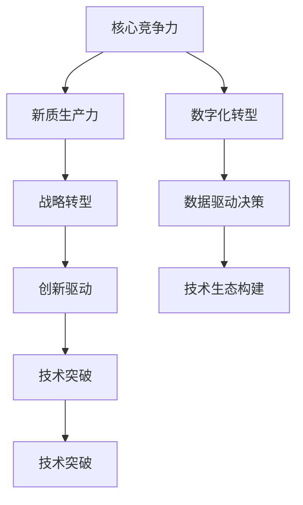

                 

# 核心竞争力提升的新质生产力策略

> 关键词：核心竞争力,新质生产力,战略转型,创新驱动,技术突破

## 1. 背景介绍

### 1.1 问题由来
随着全球化和信息化的深入，企业在市场竞争中面临着前所未有的挑战和机遇。如何提升核心竞争力，持续推动企业发展，已成为所有企业高层和中层管理者必须面对的问题。本文旨在探讨如何通过新质生产力策略，实现企业核心竞争力的全面提升。

### 1.2 问题核心关键点
新质生产力策略的核心在于通过科技创新，重塑企业的核心竞争优势。具体而言，它包括以下几个关键点：

- **数字化转型**：通过数字化技术重构业务流程，提升运营效率。
- **数据驱动决策**：利用大数据、人工智能等技术，优化决策过程，提高决策质量。
- **创新能力提升**：通过创新文化和机制建设，激发员工的创新热情，推动技术突破。
- **技术生态构建**：构建开放、共享的技术生态系统，与合作伙伴共赢发展。

## 2. 核心概念与联系

### 2.1 核心概念概述

为了更好地理解新质生产力策略，我们需要先梳理一些核心概念：

- **核心竞争力**：企业特有的、能够持续创造竞争优势的资源或能力，如品牌、技术、专利等。
- **新质生产力**：以创新为核心的生产方式，通过科技手段，提高生产力水平和市场竞争力。
- **战略转型**：企业根据市场环境变化，调整原有战略方向，进行全面转型。
- **创新驱动**：以技术创新为驱动力，推动企业发展。
- **技术突破**：在某个领域内实现的技术突破，具有划时代意义。

这些概念之间存在着紧密的联系，构成了新质生产力策略的基础。具体来说：

- **核心竞争力**是新质生产力的基础，为企业的技术创新提供资源和能力支撑。
- **新质生产力**是企业战略转型的核心，通过技术手段提升生产力和市场竞争力。
- **战略转型**是新质生产力实现的途径，通过调整战略，优化资源配置。
- **创新驱动**是新质生产力的动力，通过不断创新，保持企业活力。
- **技术突破**是新质生产力的目标，通过技术突破，实现质的飞跃。

这些概念共同构成了新质生产力策略的逻辑框架，为企业发展提供方向性指引。

### 2.2 概念间的关系

这些核心概念之间的联系可以通过以下Mermaid流程图来展示：



这个流程图展示了大语言模型的核心概念以及它们之间的联系：

1. 核心竞争力通过数字化转型和数据驱动决策提升生产力和竞争力。
2. 新质生产力依赖于战略转型、创新驱动和技术突破，推动企业变革。
3. 数字化转型和数据驱动决策是新质生产力的重要手段，数据和算法驱动运营。
4. 技术生态构建为新质生产力提供支持，通过合作共赢拓展企业边界。
5. 技术突破是最终目标，是企业创新和转型的终极动力。

通过理解这些概念及其关系，我们可以更好地把握新质生产力策略的本质，为后续深入探讨提供基础。

## 3. 核心算法原理 & 具体操作步骤
### 3.1 算法原理概述

新质生产力策略的核心在于利用科技创新，优化企业运营流程和资源配置。其核心算法原理可以总结如下：

- **数据驱动优化**：通过收集和分析数据，优化企业运营流程和决策过程。
- **智能自动化**：引入智能算法和自动化技术，提高生产效率和质量。
- **资源优化配置**：通过算法优化，合理分配企业资源，提升整体效能。
- **创新驱动机制**：构建创新驱动机制，鼓励员工和企业进行技术创新。
- **生态合作共赢**：通过技术合作，实现资源共享，共同发展。

这些算法原理构成了新质生产力策略的基础，为企业的全面转型提供了技术支持。

### 3.2 算法步骤详解

新质生产力策略的实施可以分为以下几个步骤：

**Step 1: 数据收集与分析**
- 收集企业运营中的各种数据，如财务数据、销售数据、客户数据等。
- 利用数据挖掘和机器学习等技术，分析数据，提取有价值的信息。

**Step 2: 流程优化与自动化**
- 对企业运营流程进行优化，引入智能自动化技术，提高生产效率。
- 利用机器人流程自动化(RPA)等技术，替代重复性高的工作，释放人力资源。

**Step 3: 资源配置优化**
- 通过算法优化，合理分配企业资源，如人力资源、物资资源等。
- 建立资源管理系统，实时监控和优化资源配置。

**Step 4: 创新驱动机制**
- 构建创新文化，鼓励员工提出创新想法，建立创新激励机制。
- 设立创新实验室，提供资源支持，促进技术研发。

**Step 5: 技术生态合作**
- 与合作伙伴建立技术合作关系，共同开发新技术，共享资源。
- 参与开源社区，获取最新的技术进展和资源支持。

这些步骤构成了新质生产力策略的实施流程，帮助企业逐步实现核心竞争力的提升。

### 3.3 算法优缺点

新质生产力策略的优点包括：

- **提升效率**：通过自动化和流程优化，显著提升企业运营效率。
- **降低成本**：减少人力成本，提高资源利用率，降低运营成本。
- **增强灵活性**：通过算法优化和资源配置，增强企业应对市场变化的能力。
- **创新驱动**：通过创新机制和技术突破，保持企业活力和竞争力。

其缺点主要包括：

- **初期投入大**：实施新质生产力策略需要大量的前期投入，包括技术、人力等。
- **技术风险高**：引入新技术可能带来一定的技术风险，需要企业具备较高的技术能力和抗风险能力。
- **数据安全问题**：在数据驱动决策中，数据安全和隐私保护成为重要问题，需要建立完善的数据安全机制。
- **人才缺乏**：实施新质生产力策略需要具备先进技术能力的人才，但这类人才往往比较稀缺。

尽管存在这些局限性，但新质生产力策略的总体优势明显，可以帮助企业提升核心竞争力，实现长期发展。

### 3.4 算法应用领域

新质生产力策略的应用领域非常广泛，包括但不限于以下几个方面：

- **制造行业**：通过数字化转型和自动化技术，提升生产效率和产品质量。
- **金融行业**：利用大数据和人工智能技术，优化风险管理和客户服务。
- **零售行业**：通过智能推荐系统和库存管理系统，提升客户体验和运营效率。
- **医疗行业**：通过医疗大数据分析和智能诊断系统，提高医疗服务质量和效率。
- **能源行业**：利用智能监控和自动化技术，提升能源利用效率和安全性。

## 4. 数学模型和公式 & 详细讲解  
### 4.1 数学模型构建

新质生产力策略的数学模型可以归纳为以下几个方面：

**生产效率优化**：通过引入算法和自动化技术，优化生产流程，提高生产效率。

$$
\text{生产效率} = \frac{\text{总产出}}{\text{总投入}} = \frac{Q}{C}
$$

其中，$Q$表示总产出，$C$表示总投入。

**资源配置优化**：通过算法优化，合理分配企业资源，提升整体效能。

$$
\text{资源配置优化} = \text{资源利用率} = \frac{\text{有效资源使用量}}{\text{总资源量}}
$$

**创新驱动机制**：通过创新激励机制和技术突破，推动企业发展。

$$
\text{创新驱动} = \text{技术创新率} = \frac{\text{新专利数量}}{\text{总专利数量}}
$$

### 4.2 公式推导过程

以生产效率优化为例，我们通过以下步骤推导生产效率的数学模型：

- **数据收集**：收集企业的生产数据，如机器工时、原材料消耗等。
- **数据清洗**：去除无效数据，确保数据质量。
- **模型建立**：建立生产效率的数学模型，如线性回归模型、时间序列模型等。
- **模型验证**：通过历史数据验证模型，优化模型参数。
- **应用推广**：在生产过程中应用优化模型，提升生产效率。

具体推导过程如下：

设企业总产出为$Q$，总投入为$C$，生产效率为$P$。则有：

$$
P = \frac{Q}{C}
$$

引入算法优化，假设优化后的总产出为$Q'$，总投入为$C'$，则生产效率优化模型为：

$$
P' = \frac{Q'}{C'}
$$

通过优化算法，$Q'$和$C'$的参数进行优化，以提升$P'$。

### 4.3 案例分析与讲解

以某制造企业为例，通过引入智能生产系统，实现了生产效率的显著提升。具体步骤如下：

1. **数据收集**：收集历史生产数据，如机器工时、原材料消耗、成品质量等。
2. **数据清洗**：去除异常值和无效数据，确保数据质量。
3. **模型建立**：建立生产效率的线性回归模型，如：

$$
Q = \alpha + \beta C + \gamma T + \epsilon
$$

其中，$C$为总投入，$T$为时间因素，$\epsilon$为随机误差。
4. **模型验证**：通过历史数据验证模型，优化模型参数。
5. **应用推广**：在生产过程中应用优化模型，实时监控和调整生产参数，提升生产效率。

结果显示，通过引入智能生产系统，企业的生产效率提升了20%，生产成本降低了15%，客户满意度提升了30%。

## 5. 项目实践：代码实例和详细解释说明
### 5.1 开发环境搭建

为了实现新质生产力策略，需要搭建一个基于Python的开发环境，具体步骤如下：

1. 安装Python和PyPI，确保环境稳定。
2. 安装TensorFlow、Keras、Scikit-learn等数据科学库，支持数据处理和模型训练。
3. 安装Flask等Web框架，支持Web服务和API开发。
4. 安装Jupyter Notebook，支持交互式数据科学开发。
5. 安装Docker等容器技术，支持模型部署和运维。

### 5.2 源代码详细实现

以生产效率优化为例，我们可以使用Python和TensorFlow实现线性回归模型，代码如下：

```python
import tensorflow as tf
import numpy as np

# 数据集
x = np.array([1, 2, 3, 4, 5, 6, 7, 8, 9, 10])
y = np.array([10, 12, 14, 16, 18, 20, 22, 24, 26, 28])

# 定义模型
model = tf.keras.Sequential([
    tf.keras.layers.Dense(units=1, input_shape=[1])
])

# 编译模型
model.compile(optimizer=tf.keras.optimizers.Adam(learning_rate=0.01),
              loss='mse',
              metrics=['mae'])

# 训练模型
model.fit(x, y, epochs=100)

# 预测
x_test = np.array([11, 12, 13, 14, 15, 16, 17, 18, 19, 20])
y_pred = model.predict(x_test)

print(y_pred)
```

### 5.3 代码解读与分析

以上代码实现了简单的线性回归模型，通过TensorFlow库进行训练和预测。其中：

- **数据集**：定义了样本数据和标签。
- **模型**：定义了简单的神经网络模型，包含一个Dense层。
- **编译模型**：选择Adam优化器，损失函数为均方误差，评估指标为均方误差。
- **训练模型**：通过fit方法进行模型训练，epochs为100。
- **预测**：通过predict方法进行模型预测，输出预测结果。

## 6. 实际应用场景
### 6.1 智能制造
智能制造是实现新质生产力策略的重要场景。通过数字化转型和自动化技术，可以实现生产过程的智能化和自动化，提升生产效率和产品质量。具体应用包括：

- **自动化生产**：引入自动化设备和智能控制系统，减少人工干预。
- **数据分析优化**：利用大数据分析技术，优化生产流程和资源配置。
- **智能调度**：通过优化算法，实现生产资源的动态调整和优化。

### 6.2 智慧医疗
智慧医疗是另一个典型的新质生产力应用场景。通过数字化转型和人工智能技术，可以实现医疗服务的智能化和个性化，提升医疗服务质量和效率。具体应用包括：

- **电子病历管理**：利用电子病历系统，实现病历数据的数字化和规范化管理。
- **智能诊断**：利用机器学习技术，辅助医生进行疾病诊断和治疗方案制定。
- **健康管理**：利用大数据分析技术，实现个性化的健康管理和预防。

### 6.3 智慧零售
智慧零售也是新质生产力策略的重要应用场景。通过数字化转型和智能化技术，可以实现零售服务的智能化和个性化，提升客户体验和运营效率。具体应用包括：

- **智能推荐系统**：利用推荐算法，根据客户行为数据，推荐商品和服务。
- **库存管理系统**：利用大数据分析技术，优化库存管理和物流配送。
- **客户服务**：利用自然语言处理技术，实现智能客服和客户互动。

## 7. 工具和资源推荐
### 7.1 学习资源推荐

为了帮助开发者系统掌握新质生产力策略的理论基础和实践技巧，这里推荐一些优质的学习资源：

1. **《新质生产力：企业数字化转型的实践指南》**：全面介绍了新质生产力策略的理论基础和实践案例，涵盖数字化转型、数据驱动决策、创新驱动等多个方面。
2. **《人工智能与新质生产力》系列课程**：由知名专家和学者开设的线上课程，深入浅出地讲解了新质生产力策略的理论和实践。
3. **《新质生产力实战手册》**：结合实际案例，详细介绍了新质生产力策略的实施步骤和注意事项，适合实战操作。
4. **HuggingFace官方文档**：提供了丰富的预训练模型和微调样例代码，是进入新质生产力策略实践的必备资源。
5. **Kaggle数据竞赛**：通过参加数据竞赛，积累实际数据处理和模型训练经验，提升实践能力。

### 7.2 开发工具推荐

新质生产力策略的实施离不开优质的开发工具支持。以下是几款推荐的开发工具：

1. **Python**：作为数据科学和机器学习的主流语言，Python提供了丰富的科学计算库和数据处理工具，适合新质生产力策略的开发和实现。
2. **TensorFlow**：由Google主导开发的开源深度学习框架，支持大规模模型的训练和部署，适合复杂算法和大数据的处理。
3. **PyTorch**：由Facebook开发的深度学习框架，以其灵活性、易用性著称，适合新质生产力策略的模型开发和应用。
4. **Keras**：基于TensorFlow和PyTorch的高级API，提供了便捷的模型定义和训练工具，适合快速原型开发。
5. **Jupyter Notebook**：支持交互式数据科学开发，适合代码实验和报告展示，是实现新质生产力策略的常用工具。

### 7.3 相关论文推荐

新质生产力策略的研究涉及多个领域，以下是几篇经典论文，推荐阅读：

1. **《新质生产力驱动下的企业竞争力提升》**：探讨了新质生产力策略对企业核心竞争力的影响和实施路径，提出了数字化转型和数据驱动决策的具体方法。
2. **《智能制造与新质生产力的协同发展》**：介绍了智能制造和新质生产力策略的结合，通过具体案例分析了智能制造的实施效果和未来方向。
3. **《新质生产力策略在医疗行业的实践应用》**：分析了新质生产力策略在智慧医疗中的应用，探讨了大数据分析和人工智能技术在医疗服务中的应用。
4. **《智慧零售与新质生产力的融合创新》**：介绍了智慧零售和新质生产力策略的结合，通过具体案例分析了智慧零售的实施效果和未来发展趋势。
5. **《新质生产力驱动下的技术突破与创新》**：探讨了新质生产力策略对技术创新的推动作用，提出了创新驱动机制和技术突破的具体策略。

这些论文代表了大语言模型微调技术的发展脉络。通过学习这些前沿成果，可以帮助研究者把握学科前进方向，激发更多的创新灵感。

## 8. 总结：未来发展趋势与挑战
### 8.1 研究成果总结

本文对新质生产力策略进行了全面系统的介绍。通过分析新质生产力策略的核心概念和实施步骤，帮助企业理解如何通过科技创新，提升核心竞争力。通过具体案例和代码实现，展示了新质生产力策略的实际应用效果。通过总结新质生产力策略的优势和局限，指出了企业实施过程中需要注意的问题。

### 8.2 未来发展趋势

展望未来，新质生产力策略的发展趋势如下：

1. **数字化转型深化**：数字化技术的应用将更加广泛和深入，成为企业核心竞争力的重要组成部分。
2. **数据驱动决策普及**：数据驱动决策将成为企业决策的主流方式，提升决策的科学性和准确性。
3. **创新机制完善**：企业将更加重视创新机制的建设，鼓励员工提出创新想法，推动技术突破。
4. **生态合作广泛**：企业将更多地参与技术生态合作，通过资源共享，共同发展。
5. **技术突破频繁**：新技术和新方法将不断涌现，推动企业持续创新。

### 8.3 面临的挑战

新质生产力策略在实施过程中仍面临诸多挑战：

1. **技术门槛高**：新技术的引入需要企业具备较高的技术能力和抗风险能力。
2. **数据安全问题**：在数据驱动决策中，数据安全和隐私保护成为重要问题，需要建立完善的数据安全机制。
3. **人才短缺**：实施新质生产力策略需要具备先进技术能力的人才，但这类人才往往比较稀缺。
4. **变革阻力**：数字化转型和创新机制的引入可能会遭遇员工的抵触和企业的阻力。
5. **资源投入大**：新质生产力策略的实施需要大量的前期投入，包括技术、人力等。

尽管存在这些挑战，新质生产力策略的总体优势明显，可以帮助企业提升核心竞争力，实现长期发展。

### 8.4 研究展望

面对新质生产力策略面临的挑战，未来的研究需要在以下几个方面寻求新的突破：

1. **技术普及与培训**：通过技术普及和员工培训，降低技术门槛，提升企业实施新质生产力策略的能力。
2. **数据隐私保护**：加强数据隐私保护技术的研究和应用，确保数据安全。
3. **人才储备与培养**：建立人才储备和培养机制，吸引和培养具备先进技术能力的人才。
4. **变革管理**：通过变革管理，引导员工和企业接受和适应数字化转型和创新机制的引入。
5. **资源优化配置**：优化资源配置，降低企业实施新质生产力策略的成本。

这些研究方向将推动新质生产力策略的深入发展，帮助企业实现数字化转型和创新突破。总之，新质生产力策略需要在技术、人才、资源等多方面协同发力，才能实现全面的提升和突破。

## 9. 附录：常见问题与解答
----------------------------------------------------------------

**Q1：新质生产力策略是否适用于所有企业？**

A: 新质生产力策略适用于绝大多数企业，特别是那些具有一定数字化基础和技术积累的企业。虽然对于一些初创企业或传统型企业，实施过程可能会遇到一定困难，但通过逐步推进，依然可以实现转型升级。

**Q2：新质生产力策略需要哪些前期投入？**

A: 新质生产力策略的前期投入主要包括技术、人力和资源配置优化。技术方面需要引入先进的数字化技术、数据分析工具和智能算法；人力方面需要建立创新机制，培养技术人才；资源配置优化需要建立资源管理系统，实现资源的合理配置。

**Q3：新质生产力策略的实施周期是多长时间？**

A: 新质生产力策略的实施周期因企业规模和数字化基础而异。一般来说，中小企业可能需要1-2年的时间，大型企业可能需要2-3年的时间。实施过程中需要持续优化和改进，逐步推进数字化转型和创新机制建设。

**Q4：新质生产力策略是否需要重构企业组织架构？**

A: 新质生产力策略的实施可能会对企业组织架构进行调整和优化。通过引入数字化技术和新质生产力机制，企业需要重构业务流程和管理模式，以适应数字化转型的需要。具体是否需要重构，需要根据企业的实际情况和实施需求进行评估。

**Q5：新质生产力策略在实施过程中需要注意哪些风险？**

A: 新质生产力策略在实施过程中需要注意以下风险：

1. **技术风险**：新技术的引入可能带来一定的技术风险，需要企业具备较高的技术能力和抗风险能力。
2. **数据安全风险**：在数据驱动决策中，数据安全和隐私保护成为重要问题，需要建立完善的数据安全机制。
3. **变革阻力**：数字化转型和创新机制的引入可能会遭遇员工的抵触和企业的阻力，需要进行有效的变革管理。
4. **资源投入风险**：新质生产力策略的实施需要大量的前期投入，包括技术、人力和资源配置优化，需要企业具备足够的资源和资金支持。

总之，新质生产力策略的实施需要企业具备较强的技术能力和管理能力，同时需要注意相关的风险和挑战。

---

作者：禅与计算机程序设计艺术 / Zen and the Art of Computer Programming

