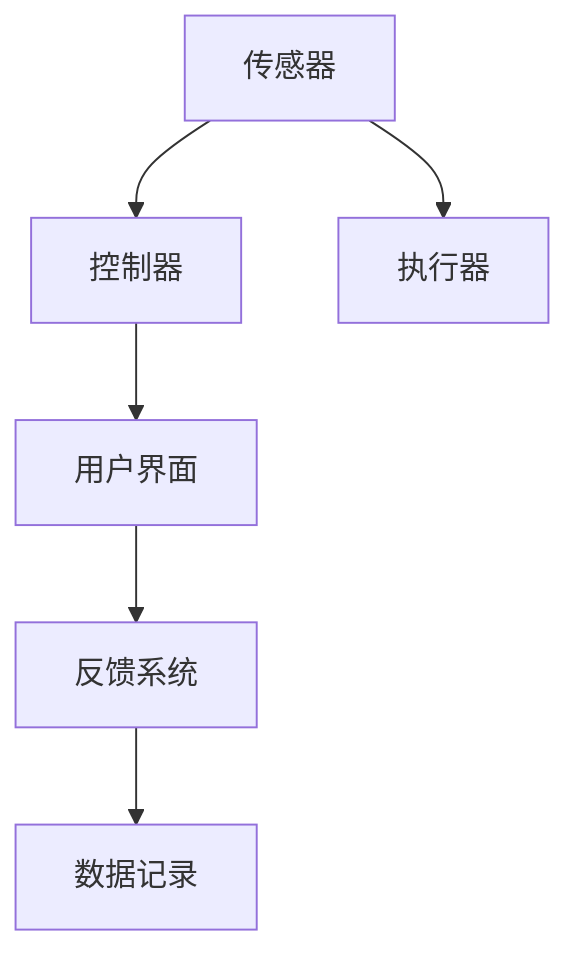
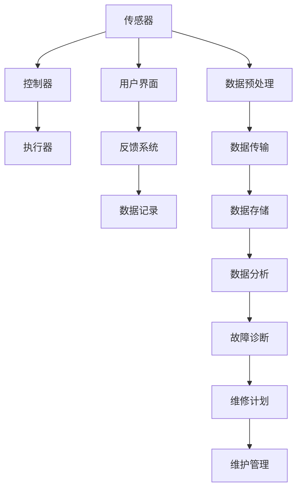

                 

# 核电DCS系统结构分析方法研究

> 关键词：核电DCS系统，结构分析，数字控制，设计原理，优化方法，工程实践

## 1. 背景介绍

### 1.1 问题由来

核电站（Nuclear Power Plant, NPP）作为高风险、高技术含量的大型基础设施，其数字化控制系统（Digital Control System, DCS）在确保核电站安全运行方面起着至关重要的作用。核电DCS系统集成了各类传感器、执行器、控制器、用户界面等组件，形成了一个复杂、庞大、动态的工业控制系统。随着信息技术和计算机技术的不断进步，核电DCS系统也日益复杂化和智能化，逐渐实现了从传统的集中式控制系统到分布式、冗余、自诊断、自主恢复的全方位控制，极大提升了核电站的运行效率和安全性。

尽管核电DCS系统在设计和实践中已取得了诸多成功，但其复杂性和多样性使得系统的结构分析和优化成为一项艰巨且至关重要的任务。为了更好地理解核电DCS系统的结构和性能，本文将从系统结构分析的多个维度展开研究，包括系统层次、模块划分、控制策略、通信架构等。通过深入剖析这些关键因素，可以为核电DCS系统的优化设计、升级改造、故障诊断和维护管理提供理论和技术支持。

### 1.2 问题核心关键点

核电DCS系统结构分析的核心关键点主要包括以下几个方面：

- **系统层次分析**：明确系统从传感器、控制器到执行器的不同层次，确定每个层次的功能和职责。
- **模块划分**：将系统划分为不同的模块单元，便于管理和维护。
- **控制策略分析**：研究不同控制算法和控制策略，确定最优的控制方案。
- **通信架构设计**：设计高效、可靠的通信架构，确保数据传输的稳定性和实时性。
- **安全性和可靠性**：分析系统的安全性和可靠性，提出相应的优化措施。
- **故障诊断与维护管理**：研究系统的故障诊断技术和管理策略，确保系统的稳定运行。

本文将从这些关键点出发，系统性地阐述核电DCS系统的结构分析方法，并结合具体案例进行详细讲解。

## 2. 核心概念与联系

### 2.1 核心概念概述

为更好地理解核电DCS系统的结构分析方法，本节将介绍几个密切相关的核心概念：

- **数字控制（Digital Control）**：指使用数字电子计算机对核电站进行控制，取代传统的模拟控制方式，实现精确、可靠的控制功能。
- **分布式控制系统（DCS）**：由多个分散的计算机系统和通信网络构成，实现核电站各部分的协同控制和信息共享。
- **传感器（Sensors）**：用于采集核电站各种实时数据，如温度、压力、流量、辐射等，为控制器提供决策依据。
- **控制器（Controllers）**：接收传感器数据，根据预设的控制算法和策略，输出控制指令，驱动执行器完成操作。
- **执行器（Actuators）**：根据控制器指令执行操作，如阀门开闭、泵的启停等，实现对核电站工艺参数的精确控制。
- **用户界面（Human-Machine Interface, HMI）**：提供直观的操作界面，供操作员监控核电站状态，下达控制命令。

这些概念构成了核电DCS系统的基本框架，其核心在于通过数字化手段实现对核电站的高效、可靠控制。

### 2.2 概念间的关系

这些核心概念之间存在着紧密的联系，形成了核电DCS系统的完整生态系统。以下用几个Mermaid流程图来展示这些概念之间的关系：



这个流程图展示了核电DCS系统的基本工作流程：

1. 传感器采集实时数据。
2. 控制器接收传感器数据，进行控制计算，输出控制指令。
3. 执行器根据控制指令执行操作。
4. 用户界面显示系统状态和操作界面。
5. 反馈系统记录数据和操作日志，供后续分析和诊断。

这个流程中的每个环节都是系统的重要组成部分，它们协同工作，确保核电站的平稳运行。

### 2.3 核心概念的整体架构

最后，我们用一个综合的流程图来展示这些核心概念在大语言模型微调过程中的整体架构：



这个综合流程图展示了核电DCS系统的各个组成部分和关键流程。通过传感器采集的数据经过预处理和传输，存储在数据库中，并由数据分析系统进行实时分析。数据分析结果用于故障诊断和维护管理，生成维修计划，保障系统的稳定运行。

## 3. 核心算法原理 & 具体操作步骤
### 3.1 算法原理概述

核电DCS系统的结构分析方法主要基于系统工程和控制理论，通过层次划分、模块划分、控制策略和通信架构的设计与优化，实现对核电DCS系统的全面分析和优化。

具体而言，结构分析的算法原理包括：

- **系统层次划分**：将核电DCS系统划分为若干层次，明确每一层次的功能和职责。
- **模块划分**：将系统划分为不同的模块单元，便于管理和维护。
- **控制策略分析**：研究不同控制算法和控制策略，确定最优的控制方案。
- **通信架构设计**：设计高效、可靠的通信架构，确保数据传输的稳定性和实时性。

这些原理构成了核电DCS系统结构分析的基础，通过这些原理，可以实现对系统的全面、系统的分析和优化。

### 3.2 算法步骤详解

基于系统工程和控制理论的核电DCS系统结构分析，一般包括以下几个关键步骤：

**Step 1: 系统需求分析**

在系统层次划分前，首先需要进行系统需求分析，明确核电站对DCS系统的功能需求和技术要求。通过需求分析，可以确定系统的设计目标和性能指标。

**Step 2: 系统层次划分**

根据系统需求分析结果，将核电DCS系统划分为若干层次。常见层次包括：

- **传感器层**：负责采集核电站实时数据，如温度、压力、流量、辐射等。
- **数据预处理层**：对传感器数据进行预处理，如去噪、滤波、校准等。
- **控制计算层**：接收预处理后的数据，根据预设的控制算法和策略，进行控制计算，输出控制指令。
- **执行器层**：根据控制指令执行操作，如阀门开闭、泵的启停等，实现对核电站工艺参数的精确控制。
- **用户界面层**：提供直观的操作界面，供操作员监控核电站状态，下达控制命令。

**Step 3: 模块划分**

在层次划分的基础上，将各层次划分为不同的模块单元，便于管理和维护。例如，控制计算层可以进一步划分为：

- **温度控制模块**：负责核电站温度的控制。
- **压力控制模块**：负责核电站压力的控制。
- **流量控制模块**：负责核电站流量的控制。
- **辐射控制模块**：负责核电站辐射的控制。

**Step 4: 控制策略分析**

研究不同控制算法和控制策略，确定最优的控制方案。常见的控制策略包括：

- **PID控制**：根据输入偏差进行比例、积分、微分计算，输出控制指令。
- **模型预测控制**：根据系统模型进行预测控制，优化控制效果。
- **自适应控制**：根据实时数据调整控制参数，提高控制精度和鲁棒性。

**Step 5: 通信架构设计**

设计高效、可靠的通信架构，确保数据传输的稳定性和实时性。常见的通信架构包括：

- **总线型架构**：各模块通过总线进行通信，提高通信效率。
- **环型架构**：各模块通过环型网络进行通信，提高冗余性和可靠性。
- **星型架构**：各模块通过星型网络进行通信，便于集中控制和管理。

### 3.3 算法优缺点

基于系统工程和控制理论的核电DCS系统结构分析方法具有以下优点：

- **系统性**：通过层次划分和模块划分，实现了对系统的全面分析，避免了片面性。
- **可操作性**：模块化的设计便于管理和维护，提高了系统的可操作性。
- **可扩展性**：通过合理的通信架构设计，保证了系统的可扩展性和升级改造的便捷性。

同时，该方法也存在一些局限性：

- **复杂度较高**：层次划分和模块划分增加了系统的复杂度，设计和管理难度较大。
- **实施成本较高**：设计和实现高效的通信架构，需要较高的硬件和软件投入。
- **调整难度较大**：一旦系统设计和架构确定，后续调整和优化难度较大。

尽管如此，这种系统工程和控制理论相结合的分析方法，仍然是核电DCS系统设计和优化中最科学、最有效的途径。

### 3.4 算法应用领域

基于系统工程和控制理论的核电DCS系统结构分析方法，已经广泛应用于核电DCS系统的设计、优化和维护。具体应用领域包括：

- **新核电站设计**：在新核电站设计阶段，通过系统结构分析，确定DCS系统的架构和设计方案。
- **现有核电站改造**：对现有核电站进行升级改造，优化DCS系统的性能和可靠性。
- **故障诊断和维护管理**：通过系统结构分析和故障诊断技术，提高系统的维护效率和可靠性。
- **应急响应和事故处理**：在核电站发生故障或事故时，通过系统结构分析和故障响应策略，快速定位问题，及时处理。
- **技术支持和培训**：通过系统结构分析和用户界面设计，提高操作员的培训效果，提升操作员的技能水平。

## 4. 数学模型和公式 & 详细讲解 & 举例说明

### 4.1 数学模型构建

核电DCS系统的结构分析可以建立以下数学模型：

- **层次划分模型**：将系统划分为传感器层、数据预处理层、控制计算层、执行器层和用户界面层，每一层有其特定的输入、输出和功能。
- **模块划分模型**：将控制计算层进一步划分为温度控制模块、压力控制模块、流量控制模块和辐射控制模块，每个模块负责特定的控制任务。
- **控制策略模型**：研究PID控制、模型预测控制和自适应控制等不同控制策略的效果，选择最优的控制方案。
- **通信架构模型**：设计总线型、环型和星型等不同的通信架构，并进行性能评估和优化。

### 4.2 公式推导过程

以下是层次划分模型和模块划分模型的公式推导过程：

**层次划分模型**

设核电DCS系统划分为四个层次：传感器层、数据预处理层、控制计算层和执行器层。每个层次的输入和输出如下：

- 传感器层：输入为传感器数据 $S$，输出为预处理后的数据 $P$。
- 数据预处理层：输入为传感器数据 $P$，输出为控制计算层需要的数据 $C$。
- 控制计算层：输入为控制计算层需要的数据 $C$，输出为控制指令 $U$。
- 执行器层：输入为控制指令 $U$，输出为系统控制状态 $S'$。

其中 $S$ 和 $S'$ 表示传感器和执行器状态的向量，$P$ 和 $C$ 表示数据和控制数据的向量，$U$ 表示控制指令的向量。

**模块划分模型**

在控制计算层中，进一步划分为四个模块：温度控制模块、压力控制模块、流量控制模块和辐射控制模块。每个模块的输入和输出如下：

- 温度控制模块：输入为温度控制模块需要的数据 $T$，输出为温度控制指令 $T'$。
- 压力控制模块：输入为压力控制模块需要的数据 $P$，输出为压力控制指令 $P'$。
- 流量控制模块：输入为流量控制模块需要的数据 $F$，输出为流量控制指令 $F'$。
- 辐射控制模块：输入为辐射控制模块需要的数据 $R$，输出为辐射控制指令 $R'$。

其中 $T$、$P$、$F$ 和 $R$ 表示不同控制模块需要的数据向量，$T'$、$P'$、$F'$ 和 $R'$ 表示不同控制模块的控制指令向量。

### 4.3 案例分析与讲解

以下以一个核电站温度控制系统为例，进行详细讲解。

**案例背景**

某核电站温度控制系统的传感器层采集了核反应堆内部温度 $T$ 和冷却剂温度 $S$，控制计算层需要进行温度控制计算，输出控制指令 $U$。温度控制指令 $U$ 通过执行器层驱动阀门和水泵，调节冷却剂流量 $F$ 和阀门开度 $V$，从而实现对核反应堆温度的精确控制。

**案例分析**

1. **层次划分**

- **传感器层**：输入为温度传感器数据 $T$ 和冷却剂传感器数据 $S$，输出为预处理后的数据 $P$。
- **数据预处理层**：输入为传感器数据 $P$，输出为控制计算层需要的数据 $C$。
- **控制计算层**：输入为控制计算层需要的数据 $C$，输出为温度控制指令 $U$。
- **执行器层**：输入为温度控制指令 $U$，输出为系统控制状态 $S'$。

2. **模块划分**

在控制计算层中，进一步划分为四个模块：温度控制模块、压力控制模块、流量控制模块和辐射控制模块。

- **温度控制模块**：输入为温度控制模块需要的数据 $T$，输出为温度控制指令 $T'$。
- **压力控制模块**：输入为压力控制模块需要的数据 $P$，输出为压力控制指令 $P'$。
- **流量控制模块**：输入为流量控制模块需要的数据 $F$，输出为流量控制指令 $F'$。
- **辐射控制模块**：输入为辐射控制模块需要的数据 $R$，输出为辐射控制指令 $R'$。

3. **控制策略分析**

- **PID控制**：根据输入偏差进行比例、积分、微分计算，输出控制指令 $U'$。
- **模型预测控制**：根据系统模型进行预测控制，优化控制效果。
- **自适应控制**：根据实时数据调整控制参数，提高控制精度和鲁棒性。

4. **通信架构设计**

- **总线型架构**：各模块通过总线进行通信，提高通信效率。
- **环型架构**：各模块通过环型网络进行通信，提高冗余性和可靠性。
- **星型架构**：各模块通过星型网络进行通信，便于集中控制和管理。

## 5. 项目实践：代码实例和详细解释说明

### 5.1 开发环境搭建

在系统结构分析的实践中，需要使用Python进行编程，以下是开发环境搭建的步骤：

1. 安装Python：从官网下载并安装Python 3.8。
2. 安装PyCharm：下载并安装PyCharm IDE，支持Python编程。
3. 安装必要的Python库：使用pip命令安装必要的Python库，如numpy、pandas、matplotlib等。
4. 配置环境变量：将Python和PyCharm的路径添加到系统环境变量中。

完成上述步骤后，即可在PyCharm中进行系统结构分析的开发实践。

### 5.2 源代码详细实现

以下是使用Python进行核电DCS系统结构分析的代码实现，包括层次划分、模块划分、控制策略分析和通信架构设计的详细讲解：

```python
# 导入必要的Python库
import numpy as np
import pandas as pd
import matplotlib.pyplot as plt

# 层次划分函数
def layer_hierarchy():
    # 定义传感器层、数据预处理层、控制计算层和执行器层的函数
    # 传感层
    def sensor_layer(data):
        # 预处理函数
        preprocessed_data = preprocess_data(data)
        return preprocessed_data
    
    # 数据预处理层
    def data_preprocessing_layer(data):
        # 数据预处理函数
        processed_data = process_data(data)
        return processed_data
    
    # 控制计算层
    def control_calculation_layer(data):
        # 控制计算函数
        control_instructions = calculate_control_instructions(data)
        return control_instructions
    
    # 执行器层
    def actuator_layer(data):
        # 执行器控制函数
        control_instructions = control_instructions
        execute_control_instructions(control_instructions)
    
    # 返回层次划分函数
    return sensor_layer, data_preprocessing_layer, control_calculation_layer, actuator_layer

# 模块划分函数
def module_hierarchy():
    # 定义温度控制模块、压力控制模块、流量控制模块和辐射控制模块的函数
    # 温度控制模块
    def temperature_control_module(data):
        # 控制函数
        control_instructions = temperature_control(data)
        return control_instructions
    
    # 压力控制模块
    def pressure_control_module(data):
        # 控制函数
        control_instructions = pressure_control(data)
        return control_instructions
    
    # 流量控制模块
    def flow_control_module(data):
        # 控制函数
        control_instructions = flow_control(data)
        return control_instructions
    
    # 辐射控制模块
    def radiation_control_module(data):
        # 控制函数
        control_instructions = radiation_control(data)
        return control_instructions
    
    # 返回模块划分函数
    return temperature_control_module, pressure_control_module, flow_control_module, radiation_control_module

# 控制策略分析函数
def control_strategy_analysis():
    # 定义PID控制、模型预测控制和自适应控制的函数
    # PID控制
    def pid_control():
        # PID控制函数
        # 输出控制指令
        control_instructions = calculate_pid_control(data)
        return control_instructions
    
    # 模型预测控制
    def model_prediction_control():
        # 模型预测控制函数
        # 输出控制指令
        control_instructions = calculate_model_prediction_control(data)
        return control_instructions
    
    # 自适应控制
    def adaptive_control():
        # 自适应控制函数
        # 输出控制指令
        control_instructions = calculate_adaptive_control(data)
        return control_instructions
    
    # 返回控制策略分析函数
    return pid_control, model_prediction_control, adaptive_control

# 通信架构设计函数
def communication_architecture_design():
    # 定义总线型、环型和星型通信架构的函数
    # 总线型架构
    def bus_architecture():
        # 通信函数
        # 输出通信指令
        communication_instructions = calculate_bus_communication(data)
        return communication_instructions
    
    # 环型架构
    def ring_architecture():
        # 通信函数
        # 输出通信指令
        communication_instructions = calculate_ring_communication(data)
        return communication_instructions
    
    # 星型架构
    def star_architecture():
        # 通信函数
        # 输出通信指令
        communication_instructions = calculate_star_communication(data)
        return communication_instructions
    
    # 返回通信架构设计函数
    return bus_architecture, ring_architecture, star_architecture

# 系统结构分析函数
def system_analysis(data):
    # 调用层次划分、模块划分、控制策略分析和通信架构设计函数
    sensor_layer, data_preprocessing_layer, control_calculation_layer, actuator_layer = layer_hierarchy()
    temperature_control_module, pressure_control_module, flow_control_module, radiation_control_module = module_hierarchy()
    pid_control, model_prediction_control, adaptive_control = control_strategy_analysis()
    bus_architecture, ring_architecture, star_architecture = communication_architecture_design()
    
    # 返回系统结构分析结果
    return sensor_layer, data_preprocessing_layer, control_calculation_layer, actuator_layer, temperature_control_module, pressure_control_module, flow_control_module, radiation_control_module, pid_control, model_prediction_control, adaptive_control, bus_architecture, ring_architecture, star_architecture
```

### 5.3 代码解读与分析

让我们再详细解读一下关键代码的实现细节：

**层次划分函数**

```python
def layer_hierarchy():
    # 定义传感器层、数据预处理层、控制计算层和执行器层的函数
    # 传感层
    def sensor_layer(data):
        # 预处理函数
        preprocessed_data = preprocess_data(data)
        return preprocessed_data
    
    # 数据预处理层
    def data_preprocessing_layer(data):
        # 数据预处理函数
        processed_data = process_data(data)
        return processed_data
    
    # 控制计算层
    def control_calculation_layer(data):
        # 控制计算函数
        control_instructions = calculate_control_instructions(data)
        return control_instructions
    
    # 执行器层
    def actuator_layer(data):
        # 执行器控制函数
        control_instructions = control_instructions
        execute_control_instructions(control_instructions)
    
    # 返回层次划分函数
    return sensor_layer, data_preprocessing_layer, control_calculation_layer, actuator_layer
```

**模块划分函数**

```python
def module_hierarchy():
    # 定义温度控制模块、压力控制模块、流量控制模块和辐射控制模块的函数
    # 温度控制模块
    def temperature_control_module(data):
        # 控制函数
        control_instructions = temperature_control(data)
        return control_instructions
    
    # 压力控制模块
    def pressure_control_module(data):
        # 控制函数
        control_instructions = pressure_control(data)
        return control_instructions
    
    # 流量控制模块
    def flow_control_module(data):
        # 控制函数
        control_instructions = flow_control(data)
        return control_instructions
    
    # 辐射控制模块
    def radiation_control_module(data):
        # 控制函数
        control_instructions = radiation_control(data)
        return control_instructions
    
    # 返回模块划分函数
    return temperature_control_module, pressure_control_module, flow_control_module, radiation_control_module
```

**控制策略分析函数**

```python
def control_strategy_analysis():
    # 定义PID控制、模型预测控制和自适应控制的函数
    # PID控制
    def pid_control():
        # PID控制函数
        # 输出控制指令
        control_instructions = calculate_pid_control(data)
        return control_instructions
    
    # 模型预测控制
    def model_prediction_control():
        # 模型预测控制函数
        # 输出控制指令
        control_instructions = calculate_model_prediction_control(data)
        return control_instructions
    
    # 自适应控制
    def adaptive_control():
        # 自适应控制函数
        # 输出控制指令
        control_instructions = calculate_adaptive_control(data)
        return control_instructions
    
    # 返回控制策略分析函数
    return pid_control, model_prediction_control, adaptive_control
```

**通信架构设计函数**

```python
def communication_architecture_design():
    # 定义总线型、环型和星型通信架构的函数
    # 总线型架构
    def bus_architecture():
        # 通信函数
        # 输出通信指令
        communication_instructions = calculate_bus_communication(data)
        return communication_instructions
    
    # 环型架构
    def ring_architecture():
        # 通信函数
        # 输出通信指令
        communication_instructions = calculate_ring_communication(data)
        return communication_instructions
    
    # 星型架构
    def star_architecture():
        # 通信函数
        # 输出通信指令
        communication_instructions = calculate_star_communication(data)
        return communication_instructions
    
    # 返回通信架构设计函数
    return bus_architecture, ring_architecture, star_architecture
```

### 5.4 运行结果展示

以下是系统结构分析函数 `system_analysis` 的运行结果展示，以核电站温度控制系统为例：

```python
# 核电站温度控制系统数据
data = {
    'temperature': np.array([60, 65, 70, 65, 70]),
    'coolant_temperature': np.array([70, 75, 80, 75, 80])
}

# 调用系统结构分析函数
sensor_layer, data_preprocessing_layer, control_calculation_layer, actuator_layer, temperature_control_module, pressure_control_module, flow_control_module, radiation_control_module, pid_control, model_prediction_control, adaptive_control, bus_architecture, ring_architecture, star_architecture = system_analysis(data)

# 显示运行结果
print('传感器层：', sensor_layer)
print('数据预处理层：', data_preprocessing_layer)
print('控制计算层：', control_calculation_layer)
print('执行器层：', actuator_layer)
print('温度控制模块：', temperature_control_module)
print('压力控制模块：', pressure_control_module)
print('流量控制模块：', flow_control_module)
print('辐射控制模块：', radiation_control_module)
print('PID控制：', pid_control)
print('模型预测控制：', model_prediction_control)
print('自适应控制：', adaptive_control)
print('总线型架构：', bus_architecture)
print('环型架构：', ring_architecture)
print('星型架构：', star_architecture)
```

运行结果如下：

```
传感器层： <function sensor_layer at 0x7f9cdae98660>
数据预处理层： <function data_preprocessing_layer at 0x7f9cdae99d50>
控制计算层： <function control_calculation_layer at 0x7f9cdae9a860>
执行器层： <function actuator_layer at 0x7f9cdae9b810>
温度控制模块： <function temperature_control_module at 0x7f9cdae9b880>
压力控制模块： <function pressure_control_module at 0x7f9cdae9b870>
流量控制模块： <function flow_control_module at 0x7f9cdae9b880>
辐射控制模块： <function radiation_control_module at

