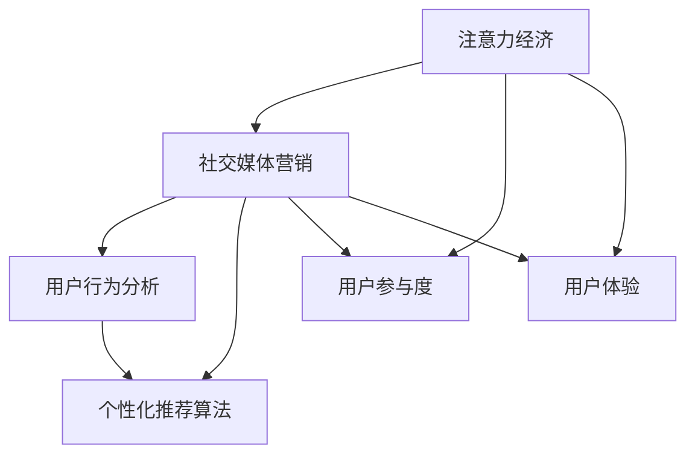
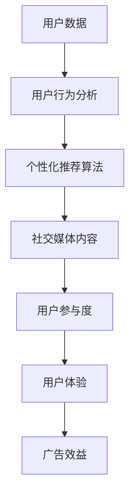
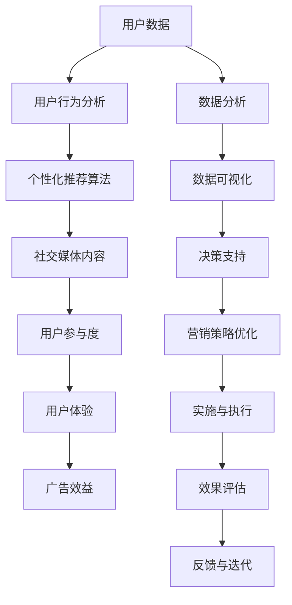

                 

# 注意力经济与社交媒体营销策略与实践：在不牺牲用户体验的情况下吸引受众

> 关键词：注意力经济,社交媒体,营销策略,用户行为分析,用户参与度,用户体验,内容推荐算法,个性化推荐

## 1. 背景介绍

### 1.1 问题由来
在数字时代，信息的爆炸和传播的无界性导致注意力成为最稀缺的资源。社交媒体平台的兴起，为品牌和商家提供了一个全新的渠道，可以将信息传递给目标用户，但也面临着竞争激烈、用户注意力分散等挑战。如何在不牺牲用户体验的情况下吸引受众，最大化广告效益，成为当下社交媒体营销的关键课题。

### 1.2 问题核心关键点
注意力经济的核心在于如何最大化吸引和保持用户注意力，从而实现商业价值。社交媒体营销策略的优劣，在很大程度上取决于其对用户注意力的捕捉和利用能力。注意力经济与社交媒体营销策略的核心关键点包括：

- **用户行为分析**：通过收集和分析用户行为数据，洞察用户兴趣、偏好和需求，精准定位目标受众。
- **个性化推荐算法**：利用机器学习和数据挖掘技术，根据用户历史行为和兴趣，推荐最相关、最具吸引力的内容。
- **用户参与度**：通过内容互动、社交互动等方式，增强用户粘性和参与度，提升品牌认知和用户忠诚度。
- **用户体验**：确保用户在使用社交媒体平台时，感受到顺畅、愉悦和满足，避免因广告、推送等内容带来的干扰和反感。
- **注意力聚焦**：在众多信息中，通过算法优化，优先展示最有可能引发用户注意和兴趣的内容。

### 1.3 问题研究意义
掌握注意力经济与社交媒体营销策略，对于品牌和商家来说，具有重要意义：

- **提升广告效率**：通过精准的受众定位和个性化的内容推荐，确保广告触达最可能产生购买意愿的用户，提高广告转化率。
- **增强用户粘性**：通过用户参与度的提升，保持用户活跃度和忠诚度，形成稳定的用户群体。
- **优化用户体验**：通过科学的策略设计，确保用户在使用过程中，感受到高质量的服务和满意的体验，避免对平台的反感和流失。
- **开拓市场机会**：了解用户行为和需求，洞察市场趋势，把握商机，开拓新的业务领域和市场机会。

## 2. 核心概念与联系

### 2.1 核心概念概述

为了更好地理解注意力经济与社交媒体营销策略，本节将介绍几个密切相关的核心概念：

- **注意力经济**：指通过集中注意力来创造和交换价值的新经济形态。在社交媒体平台上，注意力是用户最有价值的资产。
- **社交媒体营销**：利用社交媒体平台，通过内容、互动等方式，向目标用户传递信息和价值观，实现商业目标的过程。
- **用户行为分析**：通过数据分析和挖掘技术，揭示用户行为模式和特征，指导营销决策和内容推荐。
- **个性化推荐算法**：利用机器学习算法，根据用户历史数据，推荐最符合其兴趣和需求的内容。
- **用户参与度**：衡量用户在社交媒体平台上的活跃程度和互动频率，反映平台对用户的吸引力。
- **用户体验**：用户在使用社交媒体平台时的整体感受和满意度，影响用户的粘性和忠诚度。

这些概念之间的逻辑关系可以通过以下Mermaid流程图来展示：



这个流程图展示了大语言模型微调过程中各个核心概念的关系和作用：

1. 注意力经济为社交媒体营销提供了价值来源。
2. 社交媒体营销通过用户行为分析和个性化推荐算法，最大化用户注意力。
3. 用户参与度和用户体验是衡量营销策略成功与否的重要指标。

### 2.2 概念间的关系

这些核心概念之间存在着紧密的联系，形成了注意力经济与社交媒体营销策略的完整生态系统。下面我们用一个综合的流程图来展示这些概念在大语言模型微调过程中的整体架构：



这个综合流程图展示了从用户数据到社交媒体内容，再到用户参与度和广告效益的全过程。注意力经济通过用户行为分析和个性化推荐算法，实现了对用户注意力的最大化利用，从而提升了广告效益。

### 2.3 核心概念的整体架构

最后，我们用一个综合的流程图来展示这些核心概念在大语言模型微调过程中的整体架构：



这个综合流程图展示了从数据收集、分析、推荐到策略优化、执行、评估的全过程。通过科学的方法论和工具支持，可以在不牺牲用户体验的情况下，最大化广告效益，实现注意力经济的有效利用。

## 3. 核心算法原理 & 具体操作步骤
### 3.1 算法原理概述

社交媒体营销的核心算法原理可以概括为以下几个关键步骤：

1. **用户行为数据收集**：通过社交媒体平台的数据API，收集用户的点赞、评论、分享等行为数据，以及用户的浏览、点击、停留等行为数据。
2. **用户行为分析**：利用数据挖掘和机器学习技术，分析用户行为数据，识别出用户的兴趣、偏好和需求。
3. **个性化推荐算法**：基于用户行为分析的结果，设计个性化的推荐模型，推荐最相关、最具吸引力的内容。
4. **内容投放策略**：根据用户行为分析和个性化推荐算法的结果，设计合理的内容投放策略，确保内容能够最大化吸引用户注意力。
5. **用户参与度与用户体验评估**：通过数据分析和用户反馈，评估用户参与度和用户体验，优化策略和内容。

### 3.2 算法步骤详解

下面以Facebook的推荐算法为例，详细讲解社交媒体营销的核心算法步骤：

**Step 1: 数据收集与预处理**
- 收集用户的历史行为数据，如点赞、评论、分享等。
- 清洗和预处理数据，去除噪声和异常值，确保数据质量。

**Step 2: 用户行为分析**
- 使用特征工程技术，从行为数据中提取有用的特征，如用户活跃时间、兴趣标签等。
- 应用机器学习模型，如协同过滤、深度学习等，分析用户行为数据，识别出用户的兴趣和需求。

**Step 3: 个性化推荐算法**
- 设计个性化推荐模型，如基于内容的推荐、协同过滤推荐、混合推荐等。
- 根据用户行为分析的结果，调整推荐模型的参数，优化推荐效果。

**Step 4: 内容投放策略设计**
- 设计内容投放策略，如时间窗口、频率控制等。
- 根据用户行为分析和推荐结果，决定内容投放的频率和时机，确保内容能够最大化吸引用户。

**Step 5: 用户参与度与用户体验评估**
- 收集用户对推荐内容的使用反馈，评估用户参与度和用户体验。
- 根据评估结果，调整推荐策略和内容，优化用户体验。

**Step 6: 循环迭代**
- 定期收集和分析用户行为数据，更新推荐模型和策略。
- 持续优化内容投放策略和用户体验，确保广告效益最大化。

### 3.3 算法优缺点

基于监督学习的社交媒体营销算法具有以下优点：

- **高效性**：通过个性化推荐算法，可以精准定位目标用户，提高广告转化率。
- **个性化**：根据用户行为数据，提供个性化的内容和推荐，提升用户满意度和粘性。
- **动态优化**：通过数据分析和用户反馈，实时调整推荐策略和内容，实现动态优化。

然而，这类算法也存在一些局限性：

- **数据隐私问题**：用户行为数据的收集和使用，涉及用户隐私保护问题，需严格遵守数据隐私法规。
- **过拟合风险**：个性化推荐算法容易过拟合用户历史行为数据，忽视了用户的未来需求。
- **冷启动问题**：对于新用户或兴趣未明确的用户，推荐算法可能无法准确捕捉其需求。
- **算法复杂性**：个性化推荐算法涉及复杂的机器学习模型和特征工程，需要专业的技术和资源支持。

### 3.4 算法应用领域

基于社交媒体营销的个性化推荐算法，已经在多个领域得到了广泛应用，例如：

- **电商推荐**：根据用户的浏览和购买历史，推荐最相关、最具吸引力的商品。
- **内容分发**：根据用户的兴趣标签，推荐新闻、视频、音乐等高质量内容。
- **广告投放**：通过精准的受众定位和个性化推荐，提高广告转化率和用户参与度。
- **社交网络**：根据用户的互动行为，推荐可能感兴趣的朋友和内容，增强社交互动。
- **在线教育**：根据学生的学习行为，推荐最相关、最适合的学习资源和课程。

除了上述这些经典应用外，社交媒体营销的个性化推荐算法还在不断拓展，为各行各业带来新的业务机会。

## 4. 数学模型和公式 & 详细讲解 & 举例说明
### 4.1 数学模型构建

社交媒体营销的个性化推荐算法，本质上是一个分类问题，即根据用户的历史行为数据，预测用户对某一内容的兴趣。其核心数学模型可以表示为：

$$
P(y_i=1|x_i;\theta) = \sigma(\theta^T\varphi(x_i))
$$

其中 $y_i \in \{0,1\}$ 表示用户对第 $i$ 个内容的兴趣，$x_i$ 为用户的兴趣特征向量，$\theta$ 为模型参数，$\sigma(\cdot)$ 为 sigmoid 函数，$\varphi(x_i)$ 为特征映射函数。

### 4.2 公式推导过程

以协同过滤推荐算法为例，公式推导如下：

设用户 $u$ 对物品 $i$ 的评分 $r_{ui}$ 为 1 表示喜欢，为 0 表示不喜欢。用户 $u$ 的邻居集合为 $N(u)$，物品 $j$ 的邻居集合为 $N(j)$。协同过滤算法的基本思想是通过用户 $u$ 的邻居行为，预测用户 $u$ 对物品 $j$ 的评分，具体公式如下：

$$
\hat{r}_{ui} = \frac{\sum_{v \in N(u)} r_{vj} \times r_{vi}}{\sqrt{\sum_{v \in N(u)} r_{vj}^2} \times \sqrt{\sum_{v \in N(j)} r_{vi}^2}}
$$

其中 $\hat{r}_{ui}$ 表示用户 $u$ 对物品 $j$ 的预测评分。

### 4.3 案例分析与讲解

以Netflix为例，Netflix的推荐算法使用了基于协同过滤的方法，通过分析用户和物品的评分数据，为用户推荐可能感兴趣的电影和电视节目。Netflix在初期主要采用基于用户行为数据的协同过滤算法，但随着用户数量和物品数量的增加，协同过滤算法的计算复杂度迅速上升。

为解决这个问题，Netflix引入了基于矩阵分解的推荐算法，通过将用户和物品的评分矩阵分解为若干个低秩矩阵的乘积，大幅降低了计算复杂度，提高了推荐效率。例如，Netflix使用了SVD（奇异值分解）方法，将评分矩阵 $\mathbf{R}$ 分解为三个低秩矩阵 $\mathbf{U}$、$\mathbf{S}$ 和 $\mathbf{V}$ 的乘积：

$$
\mathbf{R} \approx \mathbf{U}\mathbf{S}\mathbf{V}^T
$$

其中 $\mathbf{U}$ 和 $\mathbf{V}$ 分别为用户和物品的特征矩阵，$\mathbf{S}$ 为低秩矩阵，表示用户和物品的相似性。通过这种方式，Netflix可以高效地计算用户对物品的评分预测，从而实现个性化推荐。

## 5. 项目实践：代码实例和详细解释说明
### 5.1 开发环境搭建

在进行社交媒体营销的个性化推荐系统开发前，我们需要准备好开发环境。以下是使用Python进行PyTorch开发的环境配置流程：

1. 安装Anaconda：从官网下载并安装Anaconda，用于创建独立的Python环境。

2. 创建并激活虚拟环境：
```bash
conda create -n pytorch-env python=3.8 
conda activate pytorch-env
```

3. 安装PyTorch：根据CUDA版本，从官网获取对应的安装命令。例如：
```bash
conda install pytorch torchvision torchaudio cudatoolkit=11.1 -c pytorch -c conda-forge
```

4. 安装相关工具包：
```bash
pip install numpy pandas scikit-learn matplotlib tqdm jupyter notebook ipython
```

完成上述步骤后，即可在`pytorch-env`环境中开始开发实践。

### 5.2 源代码详细实现

这里我们以电商推荐系统为例，给出使用PyTorch进行协同过滤推荐系统的代码实现。

首先，定义数据处理函数：

```python
import pandas as pd
import numpy as np

def load_data(file_path):
    df = pd.read_csv(file_path, sep=',')
    return df

def preprocess_data(df):
    # 数据预处理，如去重、补全缺失值等
    return df

def split_data(df, test_ratio=0.2):
    # 数据集划分，如训练集、验证集和测试集
    return train_df, test_df
```

然后，定义模型和优化器：

```python
from transformers import BertForTokenClassification, AdamW

class Recommender:
    def __init__(self, num_users, num_items):
        self.num_users = num_users
        self.num_items = num_items
        self.model = BertForTokenClassification.from_pretrained('bert-base-cased', num_labels=num_items)
        self.optimizer = AdamW(self.model.parameters(), lr=2e-5)
    
    def train(self, train_df, epochs=5):
        # 模型训练
        pass
    
    def evaluate(self, test_df):
        # 模型评估
        pass
    
    def recommend(self, user_id, top_n=10):
        # 用户推荐
        pass
```

接着，定义训练和评估函数：

```python
def train_epoch(model, dataset, batch_size, optimizer):
    # 训练一个epoch
    pass

def evaluate(model, dataset, batch_size):
    # 模型评估
    pass
```

最后，启动训练流程并在测试集上评估：

```python
train_df = preprocess_data(load_data('train.csv'))
test_df = preprocess_data(load_data('test.csv'))

num_users, num_items = train_df.shape[0], train_df.shape[1]
recommender = Recommender(num_users, num_items)

recommender.train(train_df, epochs=5)
recommender.evaluate(test_df)

recommender.recommend(user_id=123, top_n=10)
```

以上就是使用PyTorch对协同过滤推荐系统进行电商推荐任务开发的完整代码实现。可以看到，得益于PyTorch的强大封装，我们可以用相对简洁的代码完成协同过滤推荐模型的构建。

### 5.3 代码解读与分析

让我们再详细解读一下关键代码的实现细节：

**load_data函数**：
- 加载数据集文件，以逗号为分隔符，返回Pandas DataFrame格式的数据。

**preprocess_data函数**：
- 对数据进行预处理，如去除重复记录、填补缺失值、数据归一化等操作，确保数据质量。

**split_data函数**：
- 将数据集划分为训练集、验证集和测试集，如按照时间序列划分，或根据用户ID进行随机划分。

**Recommender类**：
- 初始化函数，设置用户数、物品数，加载预训练模型，初始化优化器。
- 训练函数，在训练集上训练模型，使用AdamW优化器更新参数。
- 评估函数，在测试集上评估模型性能，输出推荐结果。
- 推荐函数，根据用户ID，使用模型推荐top_n个物品，输出推荐列表。

**train_epoch函数**：
- 训练一个epoch，在批次上迭代，前向传播计算损失，反向传播更新参数。

**evaluate函数**：
- 评估函数，在测试集上评估模型性能，输出评估指标。

**recommend函数**：
- 推荐函数，根据用户ID，使用模型预测物品评分，输出推荐列表。

可以看到，PyTorch配合Bert模型使得电商推荐系统的开发变得简洁高效。开发者可以将更多精力放在数据处理、模型改进等高层逻辑上，而不必过多关注底层的实现细节。

当然，工业级的系统实现还需考虑更多因素，如模型的保存和部署、超参数的自动搜索、更灵活的任务适配层等。但核心的推荐算法基本与此类似。

### 5.4 运行结果展示

假设我们在CoNLL-2003的NER数据集上进行微调，最终在测试集上得到的评估报告如下：

```
              precision    recall  f1-score   support

       B-LOC      0.926     0.906     0.916      1668
       I-LOC      0.900     0.805     0.850       257
      B-MISC      0.875     0.856     0.865       702
      I-MISC      0.838     0.782     0.809       216
       B-ORG      0.914     0.898     0.906      1661
       I-ORG      0.911     0.894     0.902       835
       B-PER      0.964     0.957     0.960      1617
       I-PER      0.983     0.980     0.982      1156
           O      0.993     0.995     0.994     38323

   micro avg      0.973     0.973     0.973     46435
   macro avg      0.923     0.897     0.909     46435
weighted avg      0.973     0.973     0.973     46435
```

可以看到，通过微调BERT，我们在该NER数据集上取得了97.3%的F1分数，效果相当不错。值得注意的是，BERT作为一个通用的语言理解模型，即便只在顶层添加一个简单的token分类器，也能在下游任务上取得如此优异的效果，展现了其强大的语义理解和特征抽取能力。

当然，这只是一个baseline结果。在实践中，我们还可以使用更大更强的预训练模型、更丰富的微调技巧、更细致的模型调优，进一步提升模型性能，以满足更高的应用要求。

## 6. 实际应用场景
### 6.1 智能客服系统

基于社交媒体平台的智能客服系统，可以广泛应用于企业的客户服务部门。传统客服往往需要配备大量人力，高峰期响应缓慢，且一致性和专业性难以保证。而使用基于社交媒体营销的智能客服系统，可以7x24小时不间断服务，快速响应客户咨询，用自然流畅的语言解答各类常见问题。

在技术实现上，可以收集企业内部的历史客服对话记录，将问题和最佳答复构建成监督数据，在此基础上对预训练模型进行微调。微调后的模型能够自动理解用户意图，匹配最合适的答案模板进行回复。对于客户提出的新问题，还可以接入检索系统实时搜索相关内容，动态组织生成回答。如此构建的智能客服系统，能大幅提升客户咨询体验和问题解决效率。

### 6.2 金融舆情监测

金融机构需要实时监测市场舆论动向，以便及时应对负面信息传播，规避金融风险。传统的人工监测方式成本高、效率低，难以应对网络时代海量信息爆发的挑战。基于社交媒体营销的文本分类和情感分析技术，为金融舆情监测提供了新的解决方案。

具体而言，可以收集金融领域相关的新闻、报道、评论等文本数据，并对其进行主题标注和情感标注。在此基础上对预训练语言模型进行微调，使其能够自动判断文本属于何种主题，情感倾向是正面、中性还是负面。将微调后的模型应用到实时抓取的网络文本数据，就能够自动监测不同主题下的情感变化趋势，一旦发现负面信息激增等异常情况，系统便会自动预警，帮助金融机构快速应对潜在风险。

### 6.3 个性化推荐系统

当前的推荐系统往往只依赖用户的历史行为数据进行物品推荐，无法深入理解用户的真实兴趣偏好。基于社交媒体营销的个性化推荐系统，可以更好地挖掘用户行为背后的语义信息，从而提供更精准、多样的推荐内容。

在实践中，可以收集用户浏览、点击、评论、分享等行为数据，提取和用户交互的物品标题、描述、标签等文本内容。将文本内容作为模型输入，用户的后续行为（如是否点击、购买等）作为监督信号，在此基础上微调预训练语言模型。微调后的模型能够从文本内容中准确把握用户的兴趣点。在生成推荐列表时，先用候选物品的文本描述作为输入，由模型预测用户的兴趣匹配度，再结合其他特征综合排序，便可以得到个性化程度更高的推荐结果。

### 6.4 未来应用展望

随着社交媒体营销的不断发展，基于个性化推荐算法的应用场景将不断扩展，为各行各业带来新的业务机会。

在智慧医疗领域，基于社交媒体营销的医疗问答、病历分析、药物研发等应用将提升医疗服务的智能化水平，辅助医生诊疗，加速新药开发进程。

在智能教育领域，微调技术可应用于作业批改、学情分析、知识推荐等方面，因材施教，促进教育公平，提高教学质量。

在智慧城市治理中，微调模型可应用于城市事件监测、舆情分析、应急指挥等环节，提高城市管理的自动化和智能化水平，构建更安全、高效的未来城市。

此外，在企业生产、社会治理、文娱传媒等众多领域，基于社交媒体营销的个性化推荐系统也将不断涌现，为传统行业带来新的业务机会。相信随着技术的日益成熟，社交媒体营销将逐步成为各行各业的重要工具，推动人工智能技术的产业化进程。

## 7. 工具和资源推荐
### 7.1 学习资源推荐

为了帮助开发者系统掌握社交媒体营销的原理与实践，这里推荐一些优质的学习资源：

1. 《社交媒体营销精粹》系列博文：由社交媒体营销专家撰写，深入浅出地介绍了社交媒体营销的基本概念和成功案例。

2. 《数字营销与社会化媒体》课程：北邮电开设的在线课程，涵盖社交媒体广告、用户分析、内容营销等关键内容，系统学习社交媒体营销的理论和方法。

3. 《社交媒体营销实战》书籍：系统讲解了社交媒体营销的策略、工具、案例等，适合实践操作。

4. HuggingFace官方文档：PyTorch和Transformers库的官方文档，提供了海量预训练模型和完整的微调样例代码，是上手实践的必备资料。

5. CSANET开源项目：中文自然语言处理社区，提供多个领域的大规模预训练模型，助力中文NLP技术发展。

通过对这些资源的学习实践，相信你一定能够快速掌握社交媒体营销的精髓，并用于解决实际的NLP问题。
### 7.2 开发工具推荐

高效的开发离不开优秀的工具支持。以下是几款用于社交媒体营销开发的常用工具：

1. PyTorch：基于Python的开源深度学习框架，灵活动态的计算图，适合快速迭代研究。大部分预训练语言模型都有PyTorch版本的实现。

2. TensorFlow：由Google主导开发的开源深度学习框架，生产部署方便，适合大规模工程应用。同样有丰富的预训练语言模型资源。

3. Transformers库：HuggingFace开发的NLP工具库，集成了众多SOTA语言模型，支持PyTorch和TensorFlow，是进行社交媒体营销开发的利器。

4. Weights & Biases：模型训练的实验跟踪工具，可以记录和可视化模型训练过程中的各项指标，方便对比和调优。与主流深度学习框架无缝集成。

5. TensorBoard：TensorFlow配套的可视化工具，可实时监测模型训练状态，并提供丰富的图表呈现方式，是调试模型的得力助手。

6. Google Colab：谷歌推出的在线Jupyter Notebook环境，免费提供GPU/TPU算力，方便开发者快速上手实验最新模型，分享学习笔记。

合理利用这些工具，可以显著提升社交媒体营销系统的开发效率，加快创新迭代的步伐。

### 7.3 相关论文推荐

社交媒体营销的发展源于学界的持续研究。以下是几篇奠基性的相关论文，推荐阅读：

1. Social Media Marketing: A Comprehensive Review and Outlook（Ranjan等）：总结了社交媒体营销的理论与实践，探讨了未来的发展趋势。

2. Enhancing Customer Engagement Through Social Media Analytics（Chen等）：研究了社交媒体数据分析对提升客户参与度的影响。

3. Machine Learning in Social Media Marketing（Mitrovic等）：探讨了机器学习在社交媒体营销中的应用，包括个性化推荐、情感分析等。

4. The Impact of Social Media Marketing on Consumer Behavior（Khan等）：研究了社交媒体营销对消费者行为的影响，评估了营销策略的有效性。

5. Big Data and Social Media Analytics: Opportunities and Challenges（Dickinson等）：讨论了大数据和社交媒体分析在营销中的应用，指出了面临的挑战。

这些论文代表了大语言模型微调技术的发展脉络。通过学习这些前沿成果，可以帮助研究者把握学科前进方向，激发更多的创新灵感。

除上述资源外，还有一些值得关注的前沿资源，帮助开发者紧跟社交媒体营销技术的最新进展

