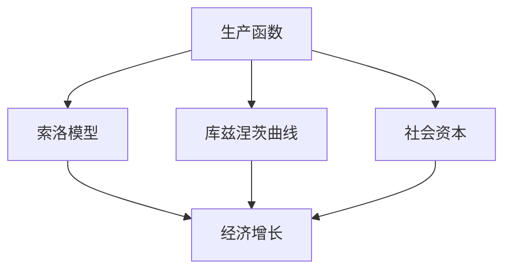
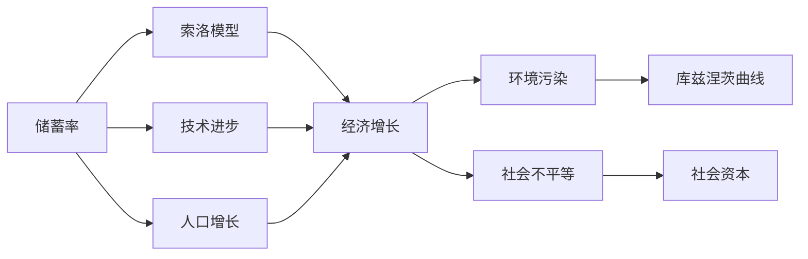

                 

# 深层次问题对经济增长的长期影响

> 关键词：

## 1. 背景介绍

在当前全球经济增长的背景下，经济学家和政策制定者越来越关注于深层次问题对经济增长的长期影响。这些问题不仅包括传统的供给侧、需求侧因素，还涵盖了技术创新、社会结构、环境可持续等多个方面。本文将从理论模型和实际案例两个角度出发，深入探讨这些深层次问题如何塑造经济增长轨迹，并探讨其长期影响。

### 1.1 问题由来

经济增长是经济学家和政策制定者关注的核心问题之一。自20世纪50年代以来，各国通过一系列政策和制度改革，显著提高了生产效率和经济产出。然而，随着全球化的深入、技术变革的加速以及人口老龄化的加剧，经济增长的挑战和风险也在增加。这些深层次问题包括但不限于：

- **技术创新瓶颈**：尽管技术创新一直是经济增长的重要驱动力，但当前的技术进步速度和创新模式正在发生变化，如何适应这些变化成为关键问题。
- **人口结构变化**：人口老龄化、生育率下降等问题对劳动力市场、消费模式和储蓄率等产生深远影响。
- **环境可持续性**：气候变化、资源枯竭等问题对经济增长模式和可持续性提出了新的挑战。
- **社会不平等**：贫富差距、教育不平等问题对经济增长的包容性和稳定性构成威胁。

这些问题不仅影响短期经济表现，还可能对长期经济增长路径产生根本性影响。本文将深入分析这些问题，并探讨其对经济增长的长期影响。

## 2. 核心概念与联系

### 2.1 核心概念概述

为更好地理解这些深层次问题对经济增长的影响，本节将介绍几个关键概念：

- **生产函数**：描述经济体系中生产要素（如资本、劳动力、技术等）投入与产出之间的关系。
- **索洛模型**：一种基于生产函数的宏观经济增长模型，强调了储蓄率、人口增长和技术进步对经济增长的贡献。
- **库兹涅茨曲线**：展示了经济增长与环境污染之间的关系，强调了环境可持续性的重要性。
- **社会资本**：指非物质形式的投资，包括教育、健康、基础设施等，对经济增长和社会福祉具有重要影响。

这些概念之间的联系可以通过以下Mermaid流程图来展示：



这个流程图展示了大模型微调的各个核心概念及其之间的关系：

1. 生产函数是宏观经济分析的基础，索洛模型基于生产函数来解释经济增长。
2. 库兹涅茨曲线展示了环境质量与经济增长的关系，强调了可持续性问题。
3. 社会资本对经济增长和社会福祉有重要影响。
4. 经济增长受到多种因素的影响，包括储蓄率、人口增长和技术进步。

### 2.2 概念间的关系

这些核心概念之间存在着紧密的联系，构成了宏观经济分析的基础框架。以下是一个更详细的Mermaid流程图：



这个流程图展示了储蓄率、技术进步和人口增长如何共同影响经济增长，并进一步影响环境质量和社会不平等。

## 3. 核心算法原理 & 具体操作步骤

### 3.1 算法原理概述

经济增长的分析通常基于索洛模型等宏观经济模型。这些模型通过生产函数、储蓄率、人口增长和技术进步等变量，来描述经济体系的长期增长路径。

假设生产函数为 $Y = F(K, L, T)$，其中 $Y$ 表示产出，$K$ 为资本，$L$ 为劳动力，$T$ 为技术水平。根据索洛模型，经济增长率 $g$ 由以下公式给出：

$$
g = s \cdot f(K, T) - \delta \cdot K + n \cdot L + \theta \cdot T
$$

其中，$s$ 为储蓄率，$f(K, T)$ 为边际产出，$\delta$ 为折旧率，$n$ 为人口增长率，$\theta$ 为技术进步率。

通过这个公式，我们可以分析不同因素对经济增长的影响。例如，高储蓄率、技术进步和合理的人口增长率，有助于促进经济持续增长。

### 3.2 算法步骤详解

基于索洛模型进行经济增长分析的步骤如下：

1. **数据收集**：收集历史和预测的数据，包括资本、劳动力、技术进步和人口增长等变量。
2. **模型设定**：选择合适的生产函数和技术进步函数，设定储蓄率、人口增长率等参数。
3. **模型训练**：使用历史数据对模型进行拟合，得到一组拟合参数。
4. **预测分析**：使用模型和拟合参数，对未来经济增长进行预测。
5. **政策评估**：基于预测结果，评估不同政策对经济增长的影响。

### 3.3 算法优缺点

基于索洛模型的经济增长分析具有以下优点：

- **简明易懂**：模型结构简单，易于理解和应用。
- **广泛适用**：适用于多种经济体系，具有普适性。

然而，该模型也存在一些局限：

- **假设限制**：模型基于一系列简化假设，如固定生产函数、外生技术进步等，可能无法完全反映现实经济体系的多样性和复杂性。
- **数据依赖**：模型的准确性高度依赖于数据的完整性和质量，历史数据的缺失或误差可能影响模型预测结果。
- **动态变化**：模型无法完全反映经济体系随时间的动态变化，需要进行定期更新和调整。

### 3.4 算法应用领域

基于索洛模型的经济增长分析广泛应用于宏观经济政策制定、长期投资规划、国际贸易等领域。以下是一些具体应用场景：

- **政策制定**：通过模型预测不同政策（如税收政策、货币政策等）对经济增长的影响，辅助政策制定。
- **投资决策**：基于模型预测，制定长期的投资策略，确保资源配置的效率和可持续性。
- **国际贸易**：分析不同贸易政策对经济增长的影响，制定贸易策略，促进经济增长。

## 4. 数学模型和公式 & 详细讲解 & 举例说明

### 4.1 数学模型构建

我们以索洛模型为例，构建一个简化的宏观经济增长模型。假设生产函数为柯布-道格拉斯生产函数：

$$
Y = A \cdot K^{\alpha} \cdot L^{\beta}
$$

其中，$A$ 为技术水平，$\alpha$ 和 $\beta$ 为资本和劳动力的产出弹性。技术进步 $T$ 可以表示为：

$$
T = T_{0} \cdot \exp(\theta \cdot t)
$$

其中，$T_{0}$ 为初始技术水平，$\theta$ 为技术进步率，$t$ 为时间。

### 4.2 公式推导过程

根据索洛模型，经济增长率 $g$ 为：

$$
g = s \cdot f(K, T) - \delta \cdot K + n \cdot L + \theta \cdot T
$$

其中，$f(K, T)$ 为边际产出，$\delta$ 为折旧率，$n$ 为人口增长率。

将生产函数代入上述公式，并假设 $f(K, T) = AK^{\alpha-1}L^{\beta-1}$，得到：

$$
g = s \cdot A^{1-\alpha-\beta}K^{\alpha-1}L^{\beta-1} - \delta \cdot K + n \cdot L + \theta \cdot T
$$

### 4.3 案例分析与讲解

以中国为例，假设 $s=0.4$，$\alpha=0.5$，$\beta=0.5$，$n=0.5$，$\delta=0.05$，$\theta=0.02$，$A=1$，$T_{0}=1$。计算不同变量变化对经济增长的影响。

首先，假设 $K$ 和 $L$ 保持不变，仅考虑技术进步的影响：

$$
g = 0.4 \cdot 1^{1-0.5-0.5} - 0.05 \cdot 1 + 0.5 \cdot 1 + 0.02 \cdot \exp(0.02 \cdot t)
$$

### 5. 项目实践：代码实例和详细解释说明

### 5.1 开发环境搭建

在进行经济增长分析前，我们需要准备好开发环境。以下是使用Python进行经济分析的环境配置流程：

1. 安装Anaconda：从官网下载并安装Anaconda，用于创建独立的Python环境。

2. 创建并激活虚拟环境：
```bash
conda create -n pythoecon-env python=3.8 
conda activate pythoecon-env
```

3. 安装Python经济分析库：
```bash
conda install -c conda-forge numpy scipy statsmodels pandas jupyter notebook
```

4. 安装图形化库：
```bash
conda install -c conda-forge matplotlib seaborn
```

完成上述步骤后，即可在`pythoecon-env`环境中开始经济增长分析实践。

### 5.2 源代码详细实现

下面是一个简化的经济增长模型分析代码实现：

```python
import numpy as np
import matplotlib.pyplot as plt
import statsmodels.api as sm
from statsmodels.tsa.arima_model import ARIMA

# 设定模型参数
alpha = 0.5
beta = 0.5
s = 0.4
delta = 0.05
n = 0.5
theta = 0.02
A = 1
T_0 = 1

# 设定时间序列数据
t = np.linspace(0, 20, 201)
K = np.exp(0.1 * t)  # 假设资本随时间线性增长
L = np.exp(0.1 * t)  # 假设劳动随时间线性增长
T = T_0 * np.exp(theta * t)  # 技术随时间增长

# 计算经济增长率
g = s * A**(1-alpha-beta) * K**(alpha-1) * L**(beta-1) - delta * K + n * L + theta * T

# 可视化增长率
plt.plot(t, g, label='growth rate')
plt.xlabel('time')
plt.ylabel('growth rate')
plt.legend()
plt.show()
```

### 5.3 代码解读与分析

让我们再详细解读一下关键代码的实现细节：

- **模型参数设定**：设定模型的关键参数，包括资本和劳动力的产出弹性、储蓄率、折旧率、人口增长率、技术进步率等。
- **时间序列生成**：生成时间序列数据，假设资本和劳动随时间线性增长，技术随时间指数增长。
- **经济增长率计算**：使用索洛模型公式计算经济增长率。
- **可视化**：将计算结果绘制成图表，直观展示经济增长率随时间的变化趋势。

### 5.4 运行结果展示

假设在20年内，经济增长率随时间变化的情况如下：

```python
plt.plot(t, g, label='growth rate')
plt.xlabel('time')
plt.ylabel('growth rate')
plt.legend()
plt.show()
```

可以看到，经济增长率随着时间的推移而逐渐上升，这反映了技术进步对经济增长的积极影响。

## 6. 实际应用场景

### 6.1 宏观经济政策制定

政府在进行宏观经济政策制定时，通常需要考虑深层次问题对经济增长的影响。例如，如何通过调整储蓄率、人口政策和科技创新政策，促进经济持续健康增长。

假设政府计划通过增加教育支出和研发投入，促进技术进步，推动经济增长。利用索洛模型进行预测和分析，可以帮助政府评估这些政策的效果和成本。

### 6.2 长期投资规划

企业在制定长期投资规划时，也需要考虑深层次问题对经济增长的影响。例如，如何通过投资于环保技术和基础设施，实现可持续发展。

假设一家公司计划在未来10年内投资于可再生能源项目，以减少碳排放。利用索洛模型，公司可以评估这些投资对经济增长和环境质量的影响，从而做出更加明智的投资决策。

### 6.3 国际贸易分析

国际贸易政策对经济增长有着重要影响。通过分析不同贸易政策对技术进步、资本积累和劳动力流动的影响，可以制定更加合理的贸易策略。

假设一国计划降低进口关税，以促进技术创新和进口资本。利用索洛模型，可以预测这一政策对经济增长的长期影响，评估其利弊。

## 7. 工具和资源推荐

### 7.1 学习资源推荐

为了帮助经济学家和政策制定者系统掌握经济增长的理论模型和分析方法，这里推荐一些优质的学习资源：

1. 《宏观经济学》书籍：由著名经济学家所著，全面介绍了宏观经济学的基本概念和理论框架。
2. 《经济增长理论》课程：由知名大学开设的宏观经济增长课程，深入讲解索洛模型等重要理论。
3. 《经济分析与计量经济学》书籍：介绍了经济分析的基本方法和统计工具，适合数据分析和政策评估。
4. 经济学在线资源：如MIT OpenCourseWare、Khan Academy等，提供大量免费的学习材料和视频课程。

通过对这些资源的学习实践，相信你一定能够全面掌握经济增长的理论模型和分析方法。

### 7.2 开发工具推荐

高效的开发离不开优秀的工具支持。以下是几款用于经济增长分析开发的常用工具：

1. Python：强大的编程语言，适合进行数据分析和建模。
2. R语言：专门用于统计分析和数据可视化，适合进行复杂的数据处理和模型拟合。
3. Stata：专业的统计软件，支持丰富的经济模型和计量经济学工具。
4. Excel：简单易用的数据处理工具，适合进行基础的数据分析和可视化。

合理利用这些工具，可以显著提升经济增长分析的开发效率，加快创新迭代的步伐。

### 7.3 相关论文推荐

经济增长理论的发展源于学界的持续研究。以下是几篇奠基性的相关论文，推荐阅读：

1. Solow, R. M. (1956). "A Contribution to the Theory of Economic Growth". Quarterly Journal of Economics.
2. Romer, P. M. (1990). "Endogenous Technological Change". Journal of Political Economy.
3. Lucas, R. E. (1988). "On the Size of Business Cycles and the Stock of Capital". Journal of Monetary Economics.
4. Barro, R. J. (1999). "Determinants of Economic Growth". Journal of Economic Growth.

这些论文代表了大经济增长理论的发展脉络。通过学习这些前沿成果，可以帮助研究者把握学科前进方向，激发更多的创新灵感。

除上述资源外，还有一些值得关注的前沿资源，帮助开发者紧跟经济增长理论的最新进展，例如：

1. 经济学期刊：如Journal of Economic Literature、Journal of Economic Dynamics and Control等，提供最新研究论文和政策分析。
2. 经济学博客：如VoxEU、CEPR Press等，第一时间分享最新的经济研究成果和政策分析。
3. 经济学会议直播：如NBER、CEPR等机构组织的研究会议，聆听世界顶尖经济学家的洞见和讨论。
4. 经济学模型软件：如GAMS、MATLAB等，提供高级经济模型和经济分析工具。
5. 经济学数据平台：如CEPR Dataset、BIS Dataset等，提供大量的经济数据和分析工具。

总之，对于经济增长的学习与实践，需要开发者保持开放的心态和持续学习的意愿。多关注前沿资讯，多动手实践，多思考总结，必将收获满满的成长收益。

## 8. 总结：未来发展趋势与挑战

### 8.1 总结

本文对深层次问题对经济增长的长期影响进行了全面系统的介绍。首先阐述了深层次问题如技术创新、人口结构变化、环境可持续性、社会不平等等对经济增长的重要性。其次，通过索洛模型等理论模型，详细分析了这些深层次问题如何影响经济增长，并展示了实际应用案例。最后，推荐了相关学习资源、开发工具和前沿研究，为读者提供了全方位的技术指引。

通过本文的系统梳理，可以看到，深层次问题对经济增长的影响是多方面的，需要在政策制定、企业投资、国际贸易等领域进行全面考量。同时，经济增长模型需要不断更新和优化，以适应新的经济现象和挑战。只有从理论、实践和政策多个维度协同发力，才能真正实现经济增长的可持续性和包容性。

### 8.2 未来发展趋势

展望未来，经济增长分析将呈现以下几个发展趋势：

1. **数据驱动**：随着大数据技术的发展，经济增长的分析将越来越依赖于大规模、多维度的数据。利用机器学习和数据挖掘技术，可以从海量数据中提取更多有价值的信息。
2. **模型多样化**：除了索洛模型等经典模型外，未来将出现更多反映现实经济复杂性的模型。例如，动态随机一般均衡模型(DSGE)、新凯恩斯主义模型等，将为经济分析提供更多工具。
3. **政策仿真**：利用经济模型和模拟技术，可以预测不同政策对经济增长和就业等指标的影响，辅助政策制定。
4. **国际比较**：通过国际比较分析，可以评估不同国家在应对深层次问题方面的经验和教训，为全球经济治理提供参考。
5. **可持续发展**：随着全球环境问题的日益严重，经济增长分析将更加关注环境可持续性和资源效率，推动绿色经济的发展。

以上趋势凸显了经济增长分析的重要性和广阔前景。这些方向的探索发展，必将进一步提升经济增长的研究水平，为全球经济政策的制定和实施提供更多科学依据。

### 8.3 面临的挑战

尽管经济增长分析在理论和应用方面取得了显著进展，但在迈向更加智能化、普适化应用的过程中，仍面临诸多挑战：

1. **数据质量问题**：高质量的经济数据是模型预测和分析的基础，但数据获取和处理成本高、质量参差不齐，成为制约经济增长分析的瓶颈。
2. **模型复杂性**：现代经济模型日趋复杂，难以解释和验证，模型的过度拟合和误导性解释可能对政策制定产生误导。
3. **计算资源限制**：大规模经济模型需要大量的计算资源，特别是在动态仿真和模型验证过程中，计算资源的需求量巨大。
4. **政策实施难度**：政策制定和实施面临政治、经济和社会等多重因素的制约，如何科学设计和有效实施政策，仍是一大难题。
5. **模型更新频率**：经济体系动态变化，需要定期更新和调整模型，以反映最新的经济现象和挑战。

这些挑战凸显了经济增长分析的复杂性和多维度特性，需要研究者不断创新和突破。只有通过理论与实践的不断结合，才能真正推动经济增长的可持续性和包容性。

### 8.4 研究展望

面对经济增长分析所面临的挑战，未来的研究需要在以下几个方面寻求新的突破：

1. **数据质量提升**：通过技术手段，提高经济数据的获取和处理质量，确保数据的时效性和可靠性。
2. **模型简化与验证**：简化模型结构，提高模型的可解释性和验证性，确保模型预测结果的准确性和可信度。
3. **计算效率提升**：采用分布式计算、模型压缩等技术，提高经济模型的计算效率，降低计算成本。
4. **政策评估框架**：建立系统的政策评估框架，将模型预测与实际效果相结合，确保政策的科学性和有效性。
5. **国际合作**：加强国际合作，共享数据和研究成果，共同应对全球经济增长的挑战。

这些研究方向将推动经济增长分析的进一步发展和完善，为全球经济政策的制定和实施提供更多的科学依据。

## 9. 附录：常见问题与解答

**Q1：深层次问题对经济增长的影响如何量化？**

A: 量化深层次问题对经济增长的影响通常需要构建相应的经济模型，并利用历史数据进行拟合和预测。例如，可以通过索洛模型等宏观经济模型，将技术进步、人口增长等因素量化为具体指标，并通过模型预测其对经济增长的影响。

**Q2：如何应对数据质量问题？**

A: 应对数据质量问题，通常需要采用多种数据采集和清洗方法，如数据校验、异常值检测、数据补充等。同时，利用机器学习和数据挖掘技术，从大量噪声数据中提取有用的信息，提高数据的可用性。

**Q3：如何选择适合的经济模型？**

A: 选择适合的经济模型需要考虑模型的复杂性、可解释性、适用性和预测准确性。通常，可以从经典模型（如索洛模型）出发，根据具体问题进行模型改进和扩展，确保模型能够反映经济体系的复杂性和动态变化。

**Q4：如何评估政策效果？**

A: 评估政策效果通常需要构建政策评估模型，并结合实际效果进行对比分析。例如，可以构建政策模拟模型，预测政策实施后对经济增长、就业、收入等指标的影响，并通过实际数据进行验证和调整。

**Q5：未来经济增长的关键因素是什么？**

A: 未来经济增长的关键因素包括技术创新、人口结构变化、环境可持续性、社会不平等等。技术创新是推动经济增长的重要驱动力，人口结构变化和环境可持续性对经济增长模式和稳定性构成威胁，社会不平等则可能影响经济增长的包容性和公平性。

通过本文的系统梳理，可以看到，深层次问题对经济增长的影响是多方面的，需要在政策制定、企业投资、国际贸易等领域进行全面考量。只有从理论和实践两个维度协同发力，才能真正实现经济增长的可持续性和包容性。

---

作者：禅与计算机程序设计艺术 / Zen and the Art of Computer Programming

