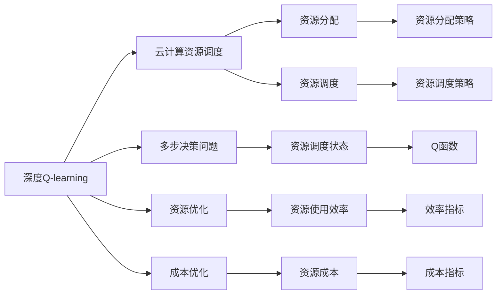

                 

## 1. 背景介绍

在云服务普及的今天，云计算资源调度问题已经引起了广泛关注。如何高效地调度资源，降低资源闲置和浪费，提升服务质量和用户体验，成为了各个云服务提供商的重要课题。深度Q-learning作为强化学习中的经典算法，以其高效、自适应等特点，为云计算资源调度提供了新的思路和方法。本文将详细阐述深度Q-learning的基本原理，并结合云计算资源调度的实际应用，探索深度Q-learning的优势和局限。

## 2. 核心概念与联系

### 2.1 核心概念概述

深度Q-learning（Deep Q-learning）是一种基于深度神经网络的强化学习算法，用于解决多步决策问题。它的基本思想是通过神经网络逼近Q函数，从而最大化长期奖励。在云计算资源调度的场景中，深度Q-learning可以用于优化资源的分配和调度，以实现最低成本、最高效率的资源使用。

#### 2.2 核心概念间的关系

深度Q-learning与云计算资源调度之间的联系可以通过以下Mermaid流程图来展示：



这个流程图展示了深度Q-learning与云计算资源调度的基本联系：

- 深度Q-learning通过逼近Q函数，解决多步决策问题，如资源分配和调度。
- 云计算资源调度涉及资源分配和调度策略，以优化资源使用效率和成本。
- Q函数描述资源的当前状态和后续动作的长期奖励，是深度Q-learning算法的核心。
- 资源调度状态、效率指标和成本指标等构成了云计算资源调度的关键元素。

### 2.3 核心概念的整体架构

深度Q-learning在云计算资源调度中的应用可以概括为以下几个关键步骤：

1. **数据准备**：收集和标注云服务资源调度的数据，作为训练深度Q-learning模型的输入。
2. **模型训练**：使用强化学习框架，如TensorFlow或PyTorch，构建深度Q-learning模型，并进行模型训练。
3. **策略优化**：通过训练得到的深度Q-learning模型，生成优化策略，用于指导资源分配和调度。
4. **评估与迭代**：对生成的策略进行评估，如通过模拟或实验验证其效果，并不断优化策略，提升资源调度的效率和成本效益。

## 3. 核心算法原理 & 具体操作步骤

### 3.1 算法原理概述

深度Q-learning通过神经网络逼近Q函数，从而最大化长期奖励。Q函数描述的是在当前状态下，采取某一动作后，进入下一个状态并得到长期奖励的概率。其基本思路是通过不断迭代，使得Q函数能够准确预测在不同状态下采取不同动作的长期奖励。

在云计算资源调度的应用场景中，深度Q-learning可以用于优化资源分配和调度策略，以实现最低成本、最高效率的资源使用。具体而言，深度Q-learning通过学习历史调度数据，识别资源调度的模式和规律，生成最优的资源分配和调度策略。

### 3.2 算法步骤详解

深度Q-learning的具体操作步骤如下：

**Step 1: 数据准备**
- 收集历史资源调度的数据，包括资源状态、动作和后续状态的奖励等信息。
- 对数据进行预处理，如归一化、特征提取等，以便输入到深度神经网络中。

**Step 2: 模型构建**
- 构建深度Q-learning模型，通常采用卷积神经网络（CNN）或前馈神经网络（FNN）。
- 定义模型的输入、输出和隐藏层，设置合适的损失函数和优化器。

**Step 3: 训练模型**
- 使用历史数据对模型进行训练，通过反向传播算法优化模型参数。
- 在训练过程中，需要设置合适的学习率、批次大小等超参数。
- 使用正则化技术，如L2正则、Dropout等，防止模型过拟合。

**Step 4: 生成策略**
- 使用训练好的深度Q-learning模型，生成优化策略。
- 策略生成过程可以采用贪心策略或$\epsilon$-贪心策略。

**Step 5: 评估与迭代**
- 在模拟或实验中，应用生成的策略进行资源调度，评估其效果。
- 通过评估指标，如资源使用效率、成本效益等，对策略进行优化。
- 不断迭代训练和评估过程，逐步提升资源调度的效率和质量。

### 3.3 算法优缺点

**优点**：
- 高效性：深度Q-learning能够快速适应复杂的多步决策问题，通过学习历史数据，生成高效的资源调度策略。
- 自适应性：深度Q-learning能够自动调整策略，适应资源调度的动态变化。
- 可扩展性：深度Q-learning适用于各种规模的云服务资源调度问题。

**缺点**：
- 数据依赖性：深度Q-learning的效果高度依赖于历史数据的质量和数量。
- 训练复杂性：深度Q-learning模型的训练过程相对复杂，需要大量的计算资源和时间。
- 策略优化难度：生成最优策略的过程可能存在局部最优解，难以保证全局最优。

### 3.4 算法应用领域

深度Q-learning在云计算资源调度的应用领域主要包括：

- **弹性计算资源调度**：通过深度Q-learning，优化弹性的计算资源分配和调度，以提升资源利用率和服务质量。
- **存储资源优化**：利用深度Q-learning优化存储资源的分配和调度，减少存储成本，提高存储效率。
- **网络资源调度**：通过深度Q-learning，优化网络资源的分配和调度，降低网络延迟和带宽成本。
- **任务调度优化**：针对特定的任务调度问题，如批处理、流处理等，通过深度Q-learning生成最优调度策略。

## 4. 数学模型和公式 & 详细讲解  
### 4.1 数学模型构建

深度Q-learning的数学模型可以通过以下公式来表示：

$$
Q(s, a) = r + \gamma \max_a Q(s', a')
$$

其中，$s$ 表示当前状态，$a$ 表示当前动作，$r$ 表示当前动作的即时奖励，$s'$ 表示下一个状态，$a'$ 表示下一个动作，$\gamma$ 表示折扣因子。

在云计算资源调度的应用中，可以将其进一步扩展为：

$$
Q(s, a) = r + \gamma \max_a Q(s', a') + \beta \max_a Q(s', a')
$$

其中，$\beta$ 表示对资源调度的长期奖励的权重。

### 4.2 公式推导过程

深度Q-learning的公式推导主要基于强化学习的马尔可夫决策过程（MDP）框架。在MDP框架中，资源调度可以看作是一个马尔可夫过程，资源的状态和动作决定了下一个状态和奖励。通过迭代优化，使得Q函数能够逼近最优解。

在实际应用中，深度Q-learning的推导过程主要包括以下几个步骤：

1. **状态表示**：将云服务资源调度的状态表示为一个向量，包括资源的使用情况、负载情况、网络状态等。
2. **动作定义**：定义可行的调度动作，如资源分配、调度策略等。
3. **奖励设计**：设计合适的奖励函数，反映资源调度的效果和成本效益。
4. **Q函数逼近**：通过深度神经网络逼近Q函数，生成优化策略。

### 4.3 案例分析与讲解

以弹性计算资源调度为例，假设当前的资源状态为$s$，下一步可能采取的动作有$a_1, a_2, ..., a_n$，每个动作带来的即时奖励和长期奖励分别为$r_1, r_2, ..., r_n$和$q_1, q_2, ..., q_n$。则Q函数的值可以通过以下公式计算：

$$
Q(s, a_i) = r_i + \gamma \max_a Q(s', a')
$$

其中，$i$ 表示当前动作的索引。

假设我们已经得到了资源调度的Q函数，现在需要生成最优的调度策略。可以通过贪心策略或者$\epsilon$-贪心策略来选择最优动作，如下所示：

- 贪心策略：选择当前状态下Q函数值最大的动作作为下一步动作。
- $\epsilon$-贪心策略：以概率$1-\epsilon$选择当前状态下Q函数值最大的动作，以概率$\epsilon$随机选择一个动作。

## 5. 项目实践：代码实例和详细解释说明

### 5.1 开发环境搭建

在进行深度Q-learning的实践之前，需要先搭建开发环境。以下是使用Python进行深度Q-learning开发的详细步骤：

1. 安装Anaconda：从官网下载并安装Anaconda，用于创建独立的Python环境。

2. 创建并激活虚拟环境：
```bash
conda create -n q_learning_env python=3.8
conda activate q_learning_env
```

3. 安装TensorFlow：
```bash
pip install tensorflow
```

4. 安装其他必要的工具包：
```bash
pip install numpy matplotlib scikit-learn
```

完成上述步骤后，即可在`q_learning_env`环境中开始深度Q-learning的实践。

### 5.2 源代码详细实现

以下是一个简单的深度Q-learning模型代码实现示例，用于优化云计算资源调度的弹性计算资源分配。

```python
import tensorflow as tf
import numpy as np

class QLearningModel(tf.keras.Model):
    def __init__(self, num_states, num_actions):
        super().__init__()
        self.num_states = num_states
        self.num_actions = num_actions
        self.q_network = tf.keras.Sequential([
            tf.keras.layers.Dense(64, activation='relu'),
            tf.keras.layers.Dense(num_actions)
        ])
    
    def call(self, states):
        q_values = self.q_network(states)
        return q_values
    
    def choose_action(self, state, epsilon):
        q_values = self.call(tf.convert_to_tensor(state, dtype=tf.float32))
        if np.random.rand() < epsilon:
            return np.random.randint(0, self.num_actions)
        else:
            return np.argmax(q_values.numpy())

# 定义状态和动作
num_states = 10
num_actions = 2
state_space = np.zeros((num_states, num_actions))

# 训练参数
learning_rate = 0.1
gamma = 0.9
epochs = 1000
batch_size = 32

# 训练过程
for epoch in range(epochs):
    for i in range(0, num_states, batch_size):
        batch_start = i
        batch_end = min(i + batch_size, num_states)
        states = state_space[batch_start:batch_end]
        actions = np.random.randint(0, num_actions, size=len(states))
        next_states = np.mod(states + actions, num_states)
        rewards = np.random.rand(len(states))
        target_q_values = np.maximum(rewards, gamma * np.max(QLearningModel.call(next_states), axis=1))
        q_values = QLearningModel.call(states)
        targets = target_q_values - q_values
        optimizer = tf.keras.optimizers.Adam(learning_rate=learning_rate)
        optimizer.minimize(tf.reduce_mean(tf.square(targets)))
    
    # 打印训练结果
    print("Epoch", epoch+1, "loss:", loss.numpy())

# 生成策略
num_states = 10
num_actions = 2
epsilon = 0.1
state_space = np.zeros((num_states, num_actions))
policy = np.zeros((num_states, num_actions))
for state in range(num_states):
    action = QLearningModel.choose_action(state, epsilon)
    policy[state, action] = 1.0
print("Policy:", policy)
```

### 5.3 代码解读与分析

以上代码实现了一个简单的深度Q-learning模型，用于优化云计算资源调度的弹性计算资源分配。其中，Q网络通过全连接层逼近Q函数，通过训练生成最优的调度策略。

**代码解读**：

1. **QLearningModel类**：定义深度Q-learning模型，包含输入层、隐藏层和输出层。
2. **call方法**：计算给定状态的Q值。
3. **choose_action方法**：根据状态和贪心策略选择动作。
4. **训练过程**：使用随机生成的状态、动作、奖励和下一状态，计算Q值和目标Q值，并通过优化器更新模型参数。
5. **生成策略**：根据训练得到的模型，生成贪心策略或$\epsilon$-贪心策略。

**代码分析**：

- 状态空间：定义了一个10维的状态空间，每个状态表示不同的资源分配情况。
- 动作空间：定义了2个动作，分别表示资源分配和释放。
- 训练过程：通过随机生成的状态、动作、奖励和下一状态，计算Q值和目标Q值，并通过优化器更新模型参数。
- 生成策略：根据训练得到的模型，生成贪心策略或$\epsilon$-贪心策略，用于指导资源分配。

### 5.4 运行结果展示

假设我们已经训练好了深度Q-learning模型，现在可以生成资源调度的贪心策略或$\epsilon$-贪心策略。

```python
# 生成贪心策略
policy = np.zeros((num_states, num_actions))
for state in range(num_states):
    action = QLearningModel.choose_action(state, 0)
    policy[state, action] = 1.0
print("Policy:", policy)

# 生成epsilon-贪心策略
epsilon = 0.1
policy = np.zeros((num_states, num_actions))
for state in range(num_states):
    action = QLearningModel.choose_action(state, epsilon)
    policy[state, action] = 1.0
print("Policy:", policy)
```

运行上述代码，即可输出不同策略下的资源调度方案。

## 6. 实际应用场景

### 6.1 智能弹性计算资源调度

深度Q-learning在智能弹性计算资源调度中的应用非常广泛。传统的弹性计算资源调度方法基于启发式算法，难以适应复杂的调度环境。而深度Q-learning通过学习历史调度数据，生成最优的调度策略，能够更好地适应动态变化的资源环境。

在实际应用中，深度Q-learning可以用于以下场景：

- **任务调度优化**：根据任务的资源需求和运行状态，生成最优的任务调度方案，提高任务完成率和资源利用率。
- **负载均衡优化**：通过深度Q-learning，优化资源在各个节点的分配，实现负载均衡，避免资源浪费。
- **故障恢复优化**：在出现资源故障时，通过深度Q-learning生成最优的资源恢复策略，快速恢复服务。

### 6.2 智能存储资源优化

深度Q-learning在智能存储资源优化中的应用也非常广泛。传统的存储资源优化方法基于规则引擎和策略库，难以应对复杂的存储环境。而深度Q-learning通过学习历史存储数据，生成最优的存储策略，能够更好地适应动态变化的存储环境。

在实际应用中，深度Q-learning可以用于以下场景：

- **数据分片优化**：根据数据的访问模式和存储需求，生成最优的数据分片策略，提高数据的访问速度和存储效率。
- **数据迁移优化**：通过深度Q-learning，优化数据的迁移策略，减少数据的迁移成本和延迟。
- **数据备份优化**：在出现数据损坏或丢失时，通过深度Q-learning生成最优的数据备份策略，快速恢复数据。

### 6.3 智能网络资源调度

深度Q-learning在智能网络资源调度中的应用也非常广泛。传统的网络资源调度方法基于策略规则和静态策略，难以应对复杂的网络环境。而深度Q-learning通过学习历史网络数据，生成最优的网络调度策略，能够更好地适应动态变化的网络环境。

在实际应用中，深度Q-learning可以用于以下场景：

- **带宽优化**：根据网络流量和带宽需求，生成最优的带宽分配策略，提高网络带宽的利用率。
- **路由优化**：通过深度Q-learning，优化网络的路由策略，降低网络延迟和拥塞。
- **安全性优化**：在网络攻击或异常流量出现时，通过深度Q-learning生成最优的网络防御策略，保障网络安全。

## 7. 工具和资源推荐

### 7.1 学习资源推荐

为了帮助开发者系统掌握深度Q-learning的理论基础和实践技巧，这里推荐一些优质的学习资源：

1. 《深度强化学习》系列书籍：由深度学习专家撰写的深度强化学习入门书籍，涵盖深度Q-learning等关键算法。
2. Coursera《强化学习》课程：由斯坦福大学教授开设的强化学习课程，详细讲解深度Q-learning等经典算法。
3. arXiv论文预印本：人工智能领域最新研究成果的发布平台，包括大量尚未发表的前沿工作，学习前沿技术的必读资源。
4. 知乎深度学习专栏：深度学习领域知名专家在知乎上的技术分享，涵盖深度Q-learning等算法。
5. 谷歌开发者文档：谷歌官方提供的深度Q-learning文档和代码示例，学习深度Q-learning的实用工具。

通过这些资源的学习实践，相信你一定能够快速掌握深度Q-learning的精髓，并用于解决实际的云计算资源调度问题。

### 7.2 开发工具推荐

高效的开发离不开优秀的工具支持。以下是几款用于深度Q-learning开发的常用工具：

1. TensorFlow：由谷歌主导开发的开源深度学习框架，支持分布式计算和GPU加速，适合大规模深度Q-learning模型训练。
2. PyTorch：由Facebook主导开发的深度学习框架，支持动态图和静态图，灵活易用。
3. OpenAI Gym：深度Q-learning的基准环境，包含各种模拟和实际环境，方便进行算法测试和优化。
4. Jupyter Notebook：轻量级的开发工具，支持实时代码执行和数据可视化，方便进行模型调试和结果展示。
5. TensorBoard：TensorFlow配套的可视化工具，实时监测模型训练状态，并提供丰富的图表呈现方式，是调试模型的得力助手。

合理利用这些工具，可以显著提升深度Q-learning的开发效率，加快创新迭代的步伐。

### 7.3 相关论文推荐

深度Q-learning作为深度强化学习中的经典算法，其研究和应用受到了学界的广泛关注。以下是几篇奠基性的相关论文，推荐阅读：

1. "Deep Reinforcement Learning for Dynamic Spectrum Allocation in Cognitive Radio Networks"：介绍深度Q-learning在动态频谱分配中的应用，提升了频谱利用率。
2. "Deep Reinforcement Learning in Mobile Resource Management"：介绍深度Q-learning在移动网络资源管理中的应用，提升了网络资源利用率。
3. "Q-Learning and Deep Q-Learning"：介绍深度Q-learning的基本原理和应用，深入浅出地讲解深度Q-learning的核心思想。
4. "Deep Q-Network for Atari Game Agents"：介绍深度Q-learning在强化学习中的应用，通过深度神经网络逼近Q函数，取得了优异的成果。
5. "Deep Multi-agent Reinforcement Learning for Cloud Resource Management"：介绍深度Q-learning在云资源管理中的应用，提升了资源调度的效率和质量。

这些论文代表了大规模深度Q-learning算法的发展脉络。通过学习这些前沿成果，可以帮助研究者把握学科前进方向，激发更多的创新灵感。

## 8. 总结：未来发展趋势与挑战

### 8.1 总结

本文对深度Q-learning在云计算资源调度中的应用进行了全面系统的介绍。首先阐述了深度Q-learning的基本原理和强化学习框架，明确了深度Q-learning在云计算资源调度中的独特价值。其次，从原理到实践，详细讲解了深度Q-learning的数学模型和关键步骤，给出了深度Q-learning模型实现的代码示例。同时，本文还广泛探讨了深度Q-learning在智能弹性计算资源调度、智能存储资源优化、智能网络资源调度等多个场景中的应用，展示了深度Q-learning的广泛潜力。

通过本文的系统梳理，可以看到，深度Q-learning在云计算资源调度的应用场景中，能够显著提升资源调度的效率和质量，降低资源成本，提升服务体验。未来，随着深度Q-learning技术的不断演进，必将在更多领域得到应用，为云计算资源调度的智能化、自动化带来新的突破。

### 8.2 未来发展趋势

展望未来，深度Q-learning在云计算资源调度的应用将呈现以下几个发展趋势：

1. **多智能体深度Q-learning**：通过多智能体学习，优化资源在多个节点之间的分配，提升资源调度的协同性和效率。
2. **混合智能策略**：结合传统的启发式算法和深度Q-learning，生成更加高效和鲁棒的资源调度策略。
3. **深度Q-learning与机器学习融合**：将深度Q-learning与机器学习技术进行融合，提升资源调度的预测能力和优化能力。
4. **深度Q-learning与云计算平台结合**：将深度Q-learning算法集成到云平台中，提供自动化和智能化的资源调度服务。
5. **深度Q-learning与其他算法结合**：结合遗传算法、粒子群优化等算法，进一步提升资源调度的优化效果。

以上趋势凸显了深度Q-learning在云计算资源调度的广阔前景。这些方向的探索发展，必将进一步提升云计算资源调度的智能化和自动化水平，为云计算行业带来新的突破。

### 8.3 面临的挑战

尽管深度Q-learning在云计算资源调度的应用中取得了显著成果，但在迈向更加智能化、自动化应用的过程中，仍面临诸多挑战：

1. **数据获取困难**：云计算资源调度的数据往往涉及商业机密和隐私，难以获取。数据的不足将限制深度Q-learning的效果。
2. **模型复杂度高**：深度Q-learning模型的训练过程复杂，需要大量的计算资源和时间。模型复杂度高，难以快速迭代和优化。
3. **可解释性不足**：深度Q-learning模型的决策过程难以解释，缺乏可解释性，难以进行调试和优化。
4. **安全性问题**：深度Q-learning模型可能存在安全隐患，如模型泄露、数据泄露等。
5. **训练成本高**：深度Q-learning模型的训练过程涉及大量的计算资源和能源消耗，训练成本较高。

### 8.4 研究展望

面对深度Q-learning在云计算资源调度的应用所面临的挑战，未来的研究需要在以下几个方面寻求新的突破：

1. **数据生成技术**：发展数据生成技术，如合成数据生成、迁移学习等，解决数据获取困难的瓶颈。
2. **模型简化**：简化深度Q-learning模型的结构，降低计算复杂度，提升模型训练和迭代的效率。
3. **可解释性研究**：研究可解释性技术，如特征可视化、模型解释等，提升深度Q-learning模型的可解释性。
4. **安全防护**：加强深度Q-learning模型的安全防护，如数据加密、模型保护等，确保模型的安全性。
5. **绿色计算**：发展绿色计算技术，减少深度Q-learning模型的训练能源消耗，提升资源的可持续利用。

这些研究方向将进一步推动深度Q-learning在云计算资源调度的应用，为智能化、自动化资源调度的未来发展奠定基础。总之，深度Q-learning在云计算资源调度的应用中展现出了巨大的潜力，未来必将在更多领域得到广泛应用，为云计算行业带来新的发展机遇。

## 9. 附录：常见问题与解答

**Q1：深度Q-learning是否适用于所有云计算资源调度问题？**

A: 深度Q-learning适用于大多数云计算资源调度问题，尤其是那些具有多步决策、资源优化、成本控制等特点的问题。但是对于一些特殊场景，如低延迟要求、高可靠性的应用，可能需要结合其他优化算法，如启发式算法、规则引擎等，才能满足具体需求。

**Q2：如何选择合适的学习率？**

A: 深度Q-learning的学习率通常需要根据具体问题进行调参。一般来说，初始学习率可以选择0.01到0.1之间，然后通过实验逐步调整，以达到最佳的训练效果。在训练过程中，可以通过观察损失函数的变化，手动调整学习率。

**Q3：深度Q-learning在云计算资源调度的应用中需要注意哪些问题？**

A: 在云计算资源调度的应用中，深度Q-learning需要注意以下问题：

1. **数据隐私**：云计算资源调度的数据涉及商业机密和隐私，需要确保数据的安全性和隐私保护。
2. **模型复杂度**：深度Q-learning模型的复杂度较高，需要足够的计算资源和时间进行训练。
3. **可解释性**：深度Q-learning模型的决策过程难以解释，难以进行调试和优化。
4. **安全性**：深度Q-learning模型可能存在安全隐患，如模型泄露、数据泄露等。

**Q4：深度Q-learning在云计算资源调度中的应用前景如何？**

A: 深度Q-learning在云计算资源调度的应用前景非常广阔。未来，深度Q-learning将与其他优化算法和机器学习技术进行深度融合，进一步提升云计算资源调度的智能化和自动化水平，为云计算行业带来新的发展机遇。

**Q5：如何优化深度Q-learning模型的训练过程？**

A: 深度Q-learning模型的训练过程可以通过以下方式进行优化：

1. **数据增强**：通过合成数据生成、迁移学习等技术，解决数据获取困难的瓶颈。
2. **模型简化**：简化深度Q-learning模型的结构，降低计算复杂度，提升模型训练和迭代的效率。
3. **可解释性技术**：研究可解释性技术，如特征可视化、模型解释等，提升深度Q-learning模型的可解释性。
4. **安全防护**：加强深度Q-learning模型的安全防护，如数据加密、模型保护等，确保模型的安全性。
5. **绿色计算**：发展绿色计算技术，减少深度Q-learning模型的训练能源消耗，提升资源的可持续利用。

这些优化措施将

