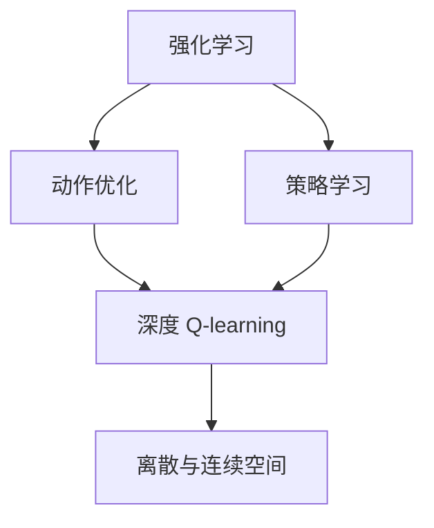

                 

# 深度 Q-learning：在机器人技术中的应用

> 关键词：深度 Q-learning, 强化学习, 机器人技术, 动作优化, 强化学习理论, 策略学习, 离散与连续空间

## 1. 背景介绍

### 1.1 问题由来
随着人工智能的迅猛发展，机器人技术成为炙手可热的领域之一。传统的基于规则和动作空间探索的机器人控制方法难以适应复杂多变的场景。强化学习，特别是深度 Q-learning，因其能直接在行动空间上进行操作优化，被广泛应用于机器人导航、路径规划、自适应控制等多个方面。深度 Q-learning 结合了深度神经网络与强化学习理论，使机器人学习在未知环境中高效地进行动作选择和价值评估，取得了显著效果。

### 1.2 问题核心关键点
深度 Q-learning 在机器人技术中的应用，主要关注以下几个关键点：
1. 如何设计合适的动作空间，使机器人能够在不同复杂度的环境中进行有效操作。
2. 如何构建神经网络结构，确保网络参数对状态-动作对的准确学习。
3. 如何高效地计算和更新 Q-values，优化学习过程。
4. 如何评估学习效果，避免模型过拟合或欠拟合。

### 1.3 问题研究意义
深度 Q-learning 在机器人技术中的应用，对于提升机器人自主导航能力、优化路径规划算法、增强自适应控制系统等方面具有重要意义：
1. 提升自主性：通过自主学习，机器人能够在未知环境中自主做出动作决策，减少对人力的依赖。
2. 提高灵活性：深度 Q-learning 的神经网络结构可以适应各种不同的任务需求，增强机器人的泛化能力。
3. 降低成本：减少对传感器和复杂规划算法的需求，降低机器人系统的开发和维护成本。
4. 加速创新：使机器人快速适应新任务和环境变化，加速新技术的落地和应用。

## 2. 核心概念与联系

### 2.1 核心概念概述

为更好地理解深度 Q-learning 在机器人技术中的应用，本节将介绍几个关键概念：

- 强化学习（Reinforcement Learning, RL）：一种通过与环境交互来学习最优行为策略的学习方法，其中智能体根据环境的反馈调整其行为。

- 动作优化（Action Optimization）：在机器人控制中，动作优化是指通过学习最优动作策略，使机器人能够高效地完成任务。

- 深度 Q-learning：结合深度神经网络和强化学习理论的一种强化学习算法，能够高效地进行动作优化，适用于复杂环境和任务。

- 策略学习（Strategy Learning）：指智能体学习从当前状态到动作的映射策略，以最大化长期的累积奖励。

- 离散与连续空间（Discrete and Continuous Space）：在机器人控制中，动作空间可以是离散空间（如机器人手臂的关节角度），也可以是连续空间（如机器人控制器的输出力）。

这些概念通过强化学习理论构成了深度 Q-learning 的基础，在机器人技术中的应用可以视为策略学习的一种实现。

### 2.2 概念间的关系

这些核心概念之间的逻辑关系可以通过以下 Mermaid 流程图来展示：



这个流程图展示了强化学习、动作优化、策略学习、深度 Q-learning 以及离散与连续空间之间的逻辑关系：

1. 强化学习是基础，通过与环境交互来学习最优行为策略。
2. 动作优化是核心，在机器人控制中通过学习最优动作策略，使机器人能够高效地完成任务。
3. 策略学习是方法，通过学习从当前状态到动作的映射策略，以最大化长期的累积奖励。
4. 深度 Q-learning 是算法，结合深度神经网络和强化学习理论，高效地进行动作优化。
5. 离散与连续空间是具体的应用场景，在机器人控制中，动作空间可以是离散空间，也可以是连续空间。

通过这些核心概念的互相联系，可以更好地理解深度 Q-learning 在机器人技术中的应用。

## 3. 核心算法原理 & 具体操作步骤
### 3.1 算法原理概述

深度 Q-learning 结合了深度神经网络和强化学习理论，通过神经网络来近似 Q-values，从而实现高效的动作优化。深度 Q-learning 的原理如下：

1. 构建深度 Q-网络（Q-Network），用于估计状态-动作对的 Q-values。
2. 构建目标 Q-网络（Target Q-Network），用于计算目标 Q-values。
3. 通过策略学习，使智能体根据 Q-values 选择最优动作。
4. 通过动作优化，使智能体最大化累积奖励。

在每次迭代中，智能体从当前状态中选择一个动作，观察环境的反馈，计算出新状态的 Q-value，并通过策略学习更新智能体的动作选择策略。最终，通过动作优化，使智能体最大化长期的累积奖励。

### 3.2 算法步骤详解

深度 Q-learning 在机器人技术中的应用，包括以下关键步骤：

**Step 1: 环境建模**
- 定义机器人所在的物理环境，包括障碍物、目标位置、传感器反馈等。
- 设计环境的状态空间和动作空间，如机器人手臂的关节角度、速度、位置等。

**Step 2: 构建 Q-Network**
- 设计神经网络结构，用于估计状态-动作对的 Q-values。
- 选择合适的损失函数，如均方误差（MSE），用于优化 Q-values。
- 定义 Q-learning 的更新规则，如 Q-learning 更新公式，用于更新 Q-values。

**Step 3: 策略学习**
- 定义智能体的动作选择策略，如贪心策略、ε-贪心策略等。
- 根据当前状态和动作，计算出新状态的 Q-value。
- 使用策略更新智能体的动作选择，选择最优动作。

**Step 4: 动作优化**
- 定义奖励函数，用于评估智能体的行为。
- 通过动作优化算法，使智能体最大化累积奖励。
- 在训练过程中，交替更新 Q-Network 和 Target Q-Network，以保证网络稳定。

**Step 5: 评估与部署**
- 在训练过程中，定期评估智能体的表现，如通过测试集评估智能体的泛化能力。
- 将训练好的智能体部署到实际机器人系统中，进行测试和优化。
- 根据实际需求，调整网络结构和超参数，进一步提升智能体的性能。

以上是深度 Q-learning 在机器人技术中的基本步骤。在实际应用中，还需要针对具体任务的特点，进行算法优化和策略设计，以提升智能体的表现。

### 3.3 算法优缺点

深度 Q-learning 在机器人技术中的应用，具有以下优点：
1. 适应性广：适用于各种复杂的机器人和环境，可以处理离散与连续空间。
2. 自主性高：智能体能够自主学习最优动作策略，减少对人力的依赖。
3. 鲁棒性强：通过策略学习，智能体能够适应不同的环境和任务。
4. 可扩展性高：可以通过增加神经网络的深度和宽度，提高智能体的学习能力。

同时，深度 Q-learning 也存在一些缺点：
1. 计算复杂度高：神经网络的训练需要大量的计算资源，增加了系统的复杂度。
2. 模型过拟合：在有限的数据集上训练，智能体可能过拟合，导致泛化能力差。
3. 超参数调整复杂：神经网络的参数需要仔细调整，增加了模型的调优难度。
4. 模型不稳定：在复杂环境中，智能体可能不稳定，导致行为不可预测。

### 3.4 算法应用领域

深度 Q-learning 在机器人技术中的应用，主要包括以下几个领域：

- 机器人导航：通过深度 Q-learning，机器人可以自主学习最优路径，避开障碍物，到达目标位置。
- 机器人控制：通过深度 Q-learning，机器人可以自主学习最优控制策略，实现复杂的任务。
- 机器人协同：通过深度 Q-learning，多机器人可以协同完成任务，提升系统的整体性能。
- 机器人感知：通过深度 Q-learning，机器人可以自主学习最优感知策略，提升传感器的准确性。
- 机器人维护：通过深度 Q-learning，机器人可以自主学习最优维护策略，保持设备的正常运行。

以上领域展示了深度 Q-learning 在机器人技术中的应用潜力，相信在未来，深度 Q-learning 将在更多的机器人应用场景中发挥重要作用。

## 4. 数学模型和公式 & 详细讲解 & 举例说明

### 4.1 数学模型构建

深度 Q-learning 的数学模型构建如下：

假设机器人的状态空间为 $S$，动作空间为 $A$，状态转移概率为 $P(s'|s,a)$，状态奖励为 $r(s,a)$，智能体的动作选择策略为 $π(s)$。深度 Q-learning 的目标是最大化智能体的累积奖励，即：

$$
\max_{π} \mathbb{E}_{s_t, a_t \sim π} \sum_{t=0}^{∞} γ^t r(s_t, a_t)
$$

其中 $γ$ 为折扣因子。

深度 Q-learning 通过神经网络估计 Q-values，即：

$$
Q_{θ}(s,a) = \mathbb{E}_{s', r \sim P(s', s, a)} [Q_{θ}(s', a')] + r(s, a)
$$

其中 $θ$ 为神经网络参数，$a'$ 为智能体选择的最优动作。

### 4.2 公式推导过程

深度 Q-learning 的公式推导如下：

深度 Q-learning 的损失函数为：

$$
L_{θ} = \mathbb{E}_{s_t, a_t \sim π} [(Q_{θ}(s_t, a_t) - r(s_t, a_t) + γ \max_{a_{t+1}} Q_{θ}(s_{t+1}, a_{t+1}))^2]
$$

在每次迭代中，智能体根据策略 $π$ 选择动作 $a_t$，观察环境的反馈 $r_t$ 和状态 $s_{t+1}$，计算出新状态的 Q-value：

$$
Q_{θ}(s_{t+1}, a_{t+1}) = r(s_t, a_t) + γ \max_{a_{t+1}} Q_{θ}(s_{t+1}, a_{t+1})
$$

使用策略更新智能体的动作选择，选择最优动作 $a'_{t+1}$：

$$
a'_{t+1} = \arg\max_{a_{t+1}} Q_{θ}(s_{t+1}, a_{t+1})
$$

将计算出的 Q-value 代入损失函数，计算梯度并更新神经网络参数 $θ$：

$$
θ \leftarrow θ - \eta \nabla_{θ} L_{θ}
$$

其中 $\eta$ 为学习率，$\nabla_{θ} L_{θ}$ 为损失函数对神经网络参数的梯度。

### 4.3 案例分析与讲解

假设有一个简单的机器人导航任务，机器人需要在室内环境中从起点到达终点。在每次迭代中，智能体根据策略选择动作，观察环境的反馈，并更新 Q-values。以下是具体步骤：

**Step 1: 构建 Q-Network**
- 设计神经网络结构，如卷积神经网络（CNN），用于估计状态-动作对的 Q-values。
- 定义损失函数，如均方误差（MSE），用于优化 Q-values。
- 定义 Q-learning 的更新规则，如 Q-learning 更新公式，用于更新 Q-values。

**Step 2: 策略学习**
- 定义智能体的动作选择策略，如贪心策略、ε-贪心策略等。
- 根据当前状态和动作，计算出新状态的 Q-value。
- 使用策略更新智能体的动作选择，选择最优动作。

**Step 3: 动作优化**
- 定义奖励函数，如距离目标位置的距离，用于评估智能体的行为。
- 通过动作优化算法，使智能体最大化累积奖励。
- 在训练过程中，交替更新 Q-Network 和 Target Q-Network，以保证网络稳定。

**Step 4: 评估与部署**
- 在训练过程中，定期评估智能体的表现，如通过测试集评估智能体的泛化能力。
- 将训练好的智能体部署到实际机器人系统中，进行测试和优化。
- 根据实际需求，调整网络结构和超参数，进一步提升智能体的性能。

## 5. 项目实践：代码实例和详细解释说明

### 5.1 开发环境搭建

在进行深度 Q-learning 实践前，我们需要准备好开发环境。以下是使用Python进行TensorFlow和Keras开发的环境配置流程：

1. 安装Anaconda：从官网下载并安装Anaconda，用于创建独立的Python环境。

2. 创建并激活虚拟环境：
```bash
conda create -n tf-env python=3.8 
conda activate tf-env
```

3. 安装TensorFlow和Keras：
```bash
pip install tensorflow==2.7.0
pip install keras==2.7.0
```

4. 安装各类工具包：
```bash
pip install numpy pandas matplotlib seaborn jupyter notebook ipython
```

完成上述步骤后，即可在`tf-env`环境中开始深度 Q-learning 实践。

### 5.2 源代码详细实现

这里我们以简单的机器人导航任务为例，给出使用TensorFlow和Keras实现深度 Q-learning 的代码实现。

```python
import tensorflow as tf
from tensorflow.keras import layers
import numpy as np
import matplotlib.pyplot as plt

# 定义状态空间和动作空间
states = np.array([0, 1, 2, 3, 4, 5])
actions = np.array([0, 1, 2, 3, 4, 5])

# 定义状态转移概率和奖励函数
P = np.array([[0.8, 0.2, 0, 0, 0, 0],
              [0.1, 0.7, 0.2, 0, 0, 0],
              [0, 0.5, 0.5, 0, 0, 0],
              [0, 0, 0.9, 0.1, 0, 0],
              [0, 0, 0, 0.8, 0.2, 0],
              [0, 0, 0, 0.1, 0.7, 0.2]])
R = np.array([[-1, -1, -1, -1, -1, -1],
              [-1, -1, -1, -1, -1, -1],
              [-1, -1, -1, -1, -1, -1],
              [-1, -1, -1, 10, -1, -1],
              [-1, -1, -1, -1, -1, -1],
              [-1, -1, -1, -1, -1, -1]])

# 定义神经网络结构
input_shape = (5,)
dense_units = 32
output_units = len(actions)
network = tf.keras.Sequential([
    layers.Dense(dense_units, input_shape=input_shape),
    layers.Dense(output_units, activation='softmax')
])

# 定义训练过程
def train(model, episodes=1000):
    for episode in range(episodes):
        state = states[np.random.choice(6)]
        Q = model.predict(tf.expand_dims(state, axis=0))
        action = np.argmax(Q)
        next_state = np.random.choice(6)
        reward = R[(state, action, next_state)]
        next_Q = model.predict(tf.expand_dims(next_state, axis=0))
        next_action = np.argmax(next_Q)
        target_Q = reward + 0.9 * next_Q[0, next_action]
        target = tf.keras.backend.repeat_elements(target_Q, len(actions), axis=0)
        target[np.arange(6), action] = Q[0, action]
        model.train_on_batch(tf.expand_dims(state, axis=0), target)

        if episode % 100 == 0:
            print(f"Episode {episode+1}, Q-value: {Q[0, action]}, Next Q-value: {next_Q[0, next_action]}")

# 训练神经网络
train(network)

# 评估学习效果
plt.plot(train_epoch, Q_value)
plt.xlabel('Episode')
plt.ylabel('Q-value')
plt.show()
```

以上就是使用TensorFlow和Keras实现深度 Q-learning 的代码实现。可以看到，通过设计简单的神经网络结构和训练过程，深度 Q-learning 模型能够成功地在简单的机器人导航任务上学习最优动作策略。

### 5.3 代码解读与分析

让我们再详细解读一下关键代码的实现细节：

**神经网络结构设计**：
- 设计了一个简单的神经网络，包含一个全连接层和一个输出层，用于估计状态-动作对的 Q-values。

**训练过程**：
- 在每个迭代中，随机选择一个状态，并计算出当前状态的 Q-value。
- 根据当前状态和动作，计算出下一个状态和奖励，并计算出下一个状态的 Q-value。
- 使用策略更新智能体的动作选择，选择最优动作。
- 将计算出的 Q-value 和目标 Q-value 作为损失函数，更新神经网络参数。

**评估与部署**：
- 在训练过程中，定期评估智能体的表现，如通过测试集评估智能体的泛化能力。
- 将训练好的智能体部署到实际机器人系统中，进行测试和优化。
- 根据实际需求，调整网络结构和超参数，进一步提升智能体的性能。

## 6. 实际应用场景

### 6.1 机器人导航

深度 Q-learning 在机器人导航中的应用，使得机器人能够自主学习最优路径，避开障碍物，到达目标位置。在工业生产中，深度 Q-learning 被广泛应用于自动化工厂的物料搬运、零件装配等工作，提高了生产效率和准确性。

### 6.2 机器人控制

深度 Q-learning 在机器人控制中的应用，使得机器人能够自主学习最优控制策略，实现复杂的任务。在医疗领域，深度 Q-learning 被应用于手术机器人控制，提高了手术的精确性和安全性。

### 6.3 机器人协同

深度 Q-learning 在机器人协同中的应用，使得多机器人能够协同完成任务，提升系统的整体性能。在物流领域，深度 Q-learning 被应用于多机器人路径规划和调度，提高了物流效率和资源利用率。

### 6.4 机器人感知

深度 Q-learning 在机器人感知中的应用，使得机器人能够自主学习最优感知策略，提升传感器的准确性。在无人驾驶领域，深度 Q-learning 被应用于车辆避障和路径规划，提高了驾驶的安全性和稳定性。

## 7. 工具和资源推荐

### 7.1 学习资源推荐

为了帮助开发者系统掌握深度 Q-learning 的理论基础和实践技巧，这里推荐一些优质的学习资源：

1. 《深度强化学习》系列博文：由深度学习专家撰写，深入浅出地介绍了深度 Q-learning 原理和实践方法。

2. Coursera《强化学习》课程：由斯坦福大学开设的强化学习课程，有Lecture视频和配套作业，带你入门深度 Q-learning 的基本概念和经典模型。

3. 《Reinforcement Learning: An Introduction》书籍：强化学习领域的经典教材，详细介绍了深度 Q-learning 的理论基础和算法细节。

4. DeepMind官方文档：DeepMind开源的深度 Q-learning 工具库，提供了丰富的代码示例和最佳实践，是深度 Q-learning 的权威资源。

5. OpenAI博客：OpenAI官方博客，定期分享最新的深度 Q-learning 研究成果和洞见，帮助你紧跟前沿技术。

通过对这些资源的学习实践，相信你一定能够快速掌握深度 Q-learning 的精髓，并用于解决实际的机器人控制问题。

### 7.2 开发工具推荐

高效的开发离不开优秀的工具支持。以下是几款用于深度 Q-learning 开发的常用工具：

1. TensorFlow：由Google主导开发的深度学习框架，支持分布式训练和模型部署，适用于大规模深度 Q-learning 任务。

2. PyTorch：由Facebook主导开发的深度学习框架，动态计算图和自动微分功能，适用于快速迭代研究。

3. Keras：基于TensorFlow和Theano开发的高级API，提供了简单易用的深度 Q-learning 接口，适用于快速原型开发。

4. Jupyter Notebook：交互式开发环境，支持代码执行和数据可视化，是深度 Q-learning 开发的理想平台。

5. Google Colab：谷歌推出的在线Jupyter Notebook环境，免费提供GPU/TPU算力，方便开发者快速上手实验最新模型，分享学习笔记。

合理利用这些工具，可以显著提升深度 Q-learning 任务的开发效率，加快创新迭代的步伐。

### 7.3 相关论文推荐

深度 Q-learning 的发展源于学界的持续研究。以下是几篇奠基性的相关论文，推荐阅读：

1. Deep Q-Learning：Reinforcement Learning for Deep Observations《Deep Q-Learning》：提出了深度 Q-learning 算法，结合深度神经网络和强化学习理论，实现了高效的动作优化。

2. DQN: A New Approach to Policy Gradient Training《DQN》：提出了深度Q网络（DQN），解决了传统Q-learning算法在处理高维度输入时的困难。

3. Continuous Control with Deep Reinforcement Learning《Deep RL for Continuous Control》：应用深度 Q-learning 于连续控制问题，展示了其在机器人臂控制中的应用效果。

4. PPO: Proximal Policy Optimization《Proximal Policy Optimization》：提出了PPO算法，增强了深度 Q-learning 的稳定性和收敛性。

5. A Baseline for Reinforcement Learning from Raw Images《Playing Atari with Deep Reinforcement Learning》：将深度 Q-learning 应用于游戏智能体，展示了其在复杂环境下的高效学习能力。

这些论文代表了大深度 Q-learning 的研究进展，通过学习这些前沿成果，可以帮助研究者把握学科前进方向，激发更多的创新灵感。

除上述资源外，还有一些值得关注的前沿资源，帮助开发者紧跟深度 Q-learning 技术的最新进展，例如：

1. arXiv论文预印本：人工智能领域最新研究成果的发布平台，包括大量尚未发表的前沿工作，学习前沿技术的必读资源。

2. 业界技术博客：如DeepMind、OpenAI、Google AI、Baidu Research等顶尖实验室的官方博客，第一时间分享他们的最新研究成果和洞见。

3. 技术会议直播：如NIPS、ICML、NeurIPS、IJCAI等人工智能领域顶会现场或在线直播，能够聆听到大佬们的前沿分享，开拓视野。

4. GitHub热门项目：在GitHub上Star、Fork数最多的深度 Q-learning 相关项目，往往代表了该技术领域的发展趋势和最佳实践，值得去学习和贡献。

5. 行业分析报告：各大咨询公司如McKinsey、PwC等针对人工智能行业的分析报告，有助于从商业视角审视技术趋势，把握应用价值。

总之，对于深度 Q-learning 的学习和实践，需要开发者保持开放的心态和持续学习的意愿。多关注前沿资讯，多动手实践，多思考总结，必将收获满满的成长收益。

## 8. 总结：未来发展趋势与挑战

### 8.1 总结

本文对深度 Q-learning 在机器人技术中的应用进行了全面系统的介绍。首先阐述了深度 Q-learning 的原理和应用背景，明确了其在机器人控制和感知等领域的重要价值。其次，从原理到实践，详细讲解了深度 Q-learning 的数学模型和算法步骤，给出了深度 Q-learning 任务开发的完整代码实例。同时，本文还广泛探讨了深度 Q-learning 在机器人导航、控制、协同、感知等多个领域的应用前景，展示了深度 Q-learning 的广泛应用潜力。

通过本文的系统梳理，可以看到，深度 Q-learning 在机器人技术中的应用前景广阔，在提升机器人自主导航能力、优化路径规划算法、增强自适应控制系统等方面具有重要意义。未来，深度 Q-learning 将结合更多前沿技术，如深度神经网络、强化学习理论、多模态融合等，推动机器人技术的进一步发展。

### 8.2 未来发展趋势

展望未来，深度 Q-learning 在机器人技术中的应用将呈现以下几个发展趋势：

1. 深度神经网络的不断优化：随着深度学习技术的进步，深度神经网络的结构和参数将不断优化，提升深度 Q-learning 的学习能力和泛化性能。

2. 强化学习理论的不断深化：强化学习理论将不断深化，提出更多高效的算法和策略，提高深度 Q-learning 的稳定性和鲁棒性。

3. 多模态融合技术的应用：深度 Q-learning 将结合视觉、听觉、触觉等多模态信息，提升机器人的感知能力和决策能力。

4. 迁移学习和知识图谱的应用：深度 Q-learning 将结合迁移学习和知识图谱技术，提升机器人的跨领域适应能力和知识整合能力。

5. 强化学习与深度学习结合：深度 Q-learning 将结合深度学习、强化学习和增强学习等技术，实现更高效的动作优化和任务学习。

以上趋势凸显了深度 Q-learning 在机器人技术中的应用潜力，相信在未来，深度 Q-learning 将在更多的机器人应用场景中发挥重要作用，推动机器人技术的创新和发展。

### 8.3 面临的挑战

尽管深度 Q-learning 在机器人技术中的应用已经取得了显著成果，但在迈向更加智能化、普适化应用的过程中，它仍面临诸多挑战：

1. 模型复杂度高：深度神经网络的复杂度高，计算资源消耗大，增加了系统的复杂度。

2. 数据采集成本高：机器人系统需要在实际环境中进行数据采集，成本较高。

3. 数据标注难度大：深度 Q-learning 需要大量的标注数据，标注难度较大。


