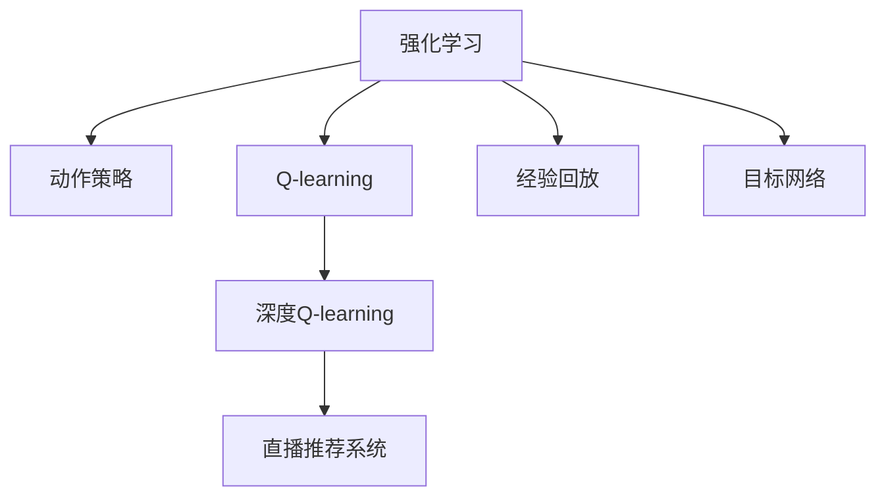
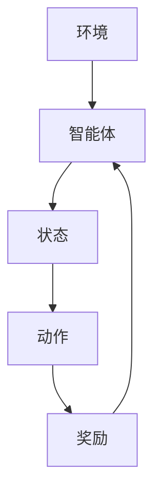
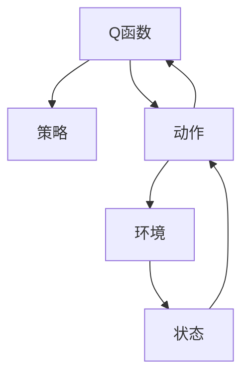
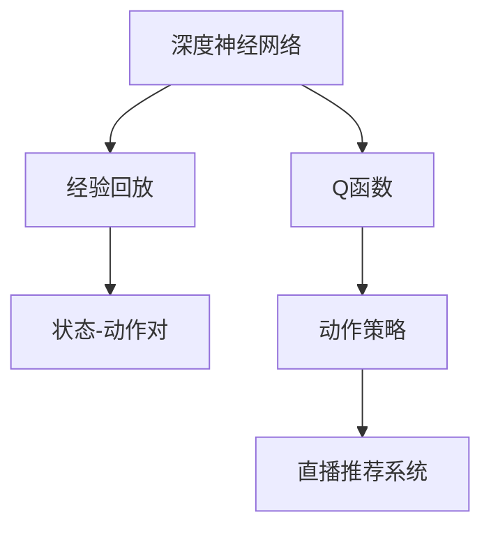

                 

# 深度 Q-learning：在直播推荐系统中的应用

> 关键词：深度强化学习, Q-learning, 直播推荐系统, 动作策略, 经验回放

## 1. 背景介绍

在信息爆炸的时代，直播平台已经成为用户获取实时信息和娱乐的重要渠道。直播推荐系统旨在为用户提供个性化的直播内容推荐，提升用户满意度和平台粘性。然而，传统推荐系统基于历史行为数据，往往存在冷启动问题，无法捕捉用户当前的兴趣状态。

深度强化学习（Deep Reinforcement Learning, DRL）的兴起，为直播推荐系统提供了一种新的解决方案。基于Q-learning等强化学习算法，直播推荐系统能够主动探索用户行为，实时调整推荐策略，最大化用户满意度。

本文聚焦于深度Q-learning算法在直播推荐系统中的应用，深入分析了Q-learning的原理和核心步骤，通过代码实例和详细分析，展示了该算法在实际应用中的强大表现。此外，本文还将探讨深度Q-learning在推荐系统中的优缺点，以及未来可能面临的挑战与趋势。

## 2. 核心概念与联系

### 2.1 核心概念概述

为更好地理解深度Q-learning在直播推荐系统中的应用，本节将介绍几个密切相关的核心概念：

- 强化学习（Reinforcement Learning, RL）：一种基于奖惩机制的机器学习框架，通过智能体（agent）与环境（environment）交互，学习最优策略。
- 动作策略（Action Policy）：智能体在特定状态下采取的行动规则，在推荐系统中表示为用户选择的直播内容。
- Q-learning：一种基于Q函数的强化学习算法，用于估算动作策略的价值，并通过经验回放（Experience Replay）和目标网络（Target Network）等技术，提高学习效率和稳定性。
- 深度Q-learning：结合深度神经网络与Q-learning的强化学习算法，通过神经网络逼近Q函数，进一步提高Q-learning的性能。

这些核心概念之间的逻辑关系可以通过以下Mermaid流程图来展示：



这个流程图展示了几者之间的关系：

1. 强化学习是基础，动作策略是智能体的行动规则。
2. Q-learning通过Q函数估算策略价值，深度Q-learning用深度神经网络逼近Q函数。
3. 直播推荐系统是Q-learning的具体应用场景。
4. 经验回放和目标网络是Q-learning的关键技术，用于提高学习效率和稳定性。

### 2.2 概念间的关系

这些核心概念之间存在着紧密的联系，构成了深度Q-learning的完整框架。下面我们通过几个Mermaid流程图来展示这些概念的关系：

#### 2.2.1 强化学习的学习范式



这个流程图展示了强化学习的核心过程，智能体通过与环境的交互，根据状态和动作获取奖励，学习最优策略。

#### 2.2.2 Q-learning的算法流程



这个流程图展示了Q-learning的算法流程，通过Q函数的不断更新，估算最优策略的价值。

#### 2.2.3 深度Q-learning的优化过程



这个流程图展示了深度Q-learning的优化过程，通过神经网络逼近Q函数，并在经验回放和目标网络技术支持下，提升学习效率和策略的泛化能力。

## 3. 核心算法原理 & 具体操作步骤
### 3.1 算法原理概述

深度Q-learning是一种基于深度神经网络的Q-learning算法，其核心思想是通过神经网络逼近Q函数，以优化动作策略的价值。

在直播推荐系统中，动作策略表示为用户选择观看哪个直播内容。假设系统在t时刻的状态为$s_t$，智能体（推荐系统）采取的动作为$a_t$，接收环境的奖励为$r_{t+1}$，并在t+1时刻到达状态$s_{t+1}$。智能体的目标是最大化长期奖励，即求取最优策略$\pi$：

$$
\pi=\arg\max_{\pi}\sum_{t=0}^{\infty}\gamma^t\mathbb{E}[r_{t+1}+\gamma r_{t+2}+...]
$$

其中，$\gamma$为折扣因子，保证短期奖励和长期奖励之间的平衡。

深度Q-learning通过深度神经网络逼近Q函数，使得Q函数的逼近更加灵活、准确。假设Q函数为$f(s_t,a_t)$，深度Q-learning的目标是最小化以下损失函数：

$$
L=\frac{1}{N}\sum_{i=1}^{N}(\hat{Q}(s_t,a_t)-y_i)^2
$$

其中，$\hat{Q}(s_t,a_t)$为神经网络预测的Q值，$y_i$为真实Q值。

### 3.2 算法步骤详解

深度Q-learning的具体算法步骤主要包括：

**Step 1: 模型构建与初始化**

- 构建深度神经网络，设计合适的结构，作为Q函数的逼近器。
- 随机初始化网络参数，如权重、偏置等。

**Step 2: 策略初始化**

- 初始化动作策略$\pi_0$，例如随机策略或均匀策略。
- 设置学习率$\alpha$和折扣因子$\gamma$。

**Step 3: 迭代更新**

- 在每个时间步，根据当前状态$s_t$，通过神经网络计算Q值$\hat{Q}(s_t,a_t)$。
- 通过经验回放机制，从经验缓冲区中随机采样一批状态-动作对$(s_t,a_t)$。
- 计算目标Q值$y_i=r_{t+1}+\gamma\hat{Q}(s_{t+1},a_{t+1})$。
- 计算损失函数$L=\frac{1}{N}\sum_{i=1}^{N}(\hat{Q}(s_t,a_t)-y_i)^2$。
- 反向传播更新神经网络参数。
- 根据目标网络$\pi_{t+1}=\epsilon\pi_t+(1-\epsilon)\arg\max_a\hat{Q}(s_t,a_t)$更新动作策略，其中$\epsilon$为策略更新系数。

**Step 4: 周期性评估**

- 在每个迭代周期后，评估模型的性能。
- 根据评估结果调整学习率、网络结构等超参数。

通过上述步骤，深度Q-learning算法能够在直播推荐系统中不断学习，优化动作策略，提升推荐效果。

### 3.3 算法优缺点

深度Q-learning在直播推荐系统中的应用具有以下优点：

- 主动探索：深度Q-learning能够主动探索用户行为，适应不断变化的用户需求。
- 实时更新：通过Q函数的不断更新，深度Q-learning能够实时调整推荐策略，最大化用户满意度。
- 高精度：深度神经网络的逼近能力，使得Q函数更加准确，提升推荐效果。

同时，深度Q-learning也存在一些缺点：

- 过拟合风险：神经网络参数过多，容易导致过拟合，特别是当样本数量较少时。
- 计算复杂度：深度神经网络的计算量较大，训练和推理速度较慢。
- 策略不稳定：策略更新过于频繁，可能导致推荐策略的不稳定性，影响用户体验。

### 3.4 算法应用领域

深度Q-learning不仅在直播推荐系统中取得了良好的效果，还广泛应用于许多其他领域，如游戏AI、机器人控制、自动驾驶等。通过结合深度学习与强化学习的优势，深度Q-learning成为解决复杂决策问题的有力工具。

## 4. 数学模型和公式 & 详细讲解 & 举例说明

### 4.1 数学模型构建

在深度Q-learning中，Q函数$f(s_t,a_t)$通过神经网络逼近，网络结构为：

$$
f(s_t,a_t)=W(s_t,a_t)+b
$$

其中，$W$为权重矩阵，$b$为偏置项。

经验回放机制通过将历史状态-动作对$(s_t,a_t)$存储在缓冲区中，随机采样一批数据，使得训练过程更加稳定。

目标网络$\pi_{t+1}$用于计算目标Q值$y_i$，避免直接从神经网络预测值$r_{t+1}+\gamma\hat{Q}(s_{t+1},a_{t+1})$中引入过多的噪声。

### 4.2 公式推导过程

假设神经网络为$f(s_t,a_t)=W(s_t,a_t)+b$，其中$W$为权重矩阵，$b$为偏置项。经验回放机制采样一批状态-动作对$(s_t,a_t)$，计算目标Q值$y_i=r_{t+1}+\gamma\hat{Q}(s_{t+1},a_{t+1})$。深度Q-learning的目标是最小化以下损失函数：

$$
L=\frac{1}{N}\sum_{i=1}^{N}(\hat{Q}(s_t,a_t)-y_i)^2
$$

其中，$\hat{Q}(s_t,a_t)=f(s_t,a_t)$。

根据均方误差（Mean Squared Error, MSE），可以计算出损失函数对权重$W$的梯度：

$$
\frac{\partial L}{\partial W}=\frac{1}{N}\sum_{i=1}^{N}(\hat{Q}(s_t,a_t)-y_i)\frac{\partial\hat{Q}(s_t,a_t)}{\partial W}
$$

通过反向传播算法，可以得到权重$W$的更新公式：

$$
W_{t+1}=W_t-\alpha\frac{\partial L}{\partial W}
$$

### 4.3 案例分析与讲解

假设我们希望训练一个深度Q-learning模型，用于直播推荐系统中的动作策略优化。具体步骤如下：

1. 构建神经网络，假设其结构为$(s_t,a_t)\rightarrow W \rightarrow [0,1]$。
2. 初始化权重$W$和偏置$b$。
3. 在每个时间步，计算Q值$\hat{Q}(s_t,a_t)=W(s_t,a_t)+b$。
4. 从经验缓冲区中随机采样一批状态-动作对$(s_t,a_t)$。
5. 计算目标Q值$y_i=r_{t+1}+\gamma\hat{Q}(s_{t+1},a_{t+1})$。
6. 计算损失函数$L=\frac{1}{N}\sum_{i=1}^{N}(\hat{Q}(s_t,a_t)-y_i)^2$。
7. 反向传播更新权重$W$和偏置$b$。
8. 根据目标网络更新动作策略。

通过这个过程，深度Q-learning能够不断优化推荐策略，提升直播推荐系统的用户满意度。

## 5. 项目实践：代码实例和详细解释说明

### 5.1 开发环境搭建

在进行深度Q-learning实践前，我们需要准备好开发环境。以下是使用Python进行TensorFlow开发的环境配置流程：

1. 安装Anaconda：从官网下载并安装Anaconda，用于创建独立的Python环境。

2. 创建并激活虚拟环境：
```bash
conda create -n tf-env python=3.8 
conda activate tf-env
```

3. 安装TensorFlow：根据CUDA版本，从官网获取对应的安装命令。例如：
```bash
conda install tensorflow tensorflow-gpu=2.5 -c conda-forge -c pytorch -c pytorch -c anaconda
```

4. 安装TensorBoard：
```bash
pip install tensorboard
```

5. 安装各类工具包：
```bash
pip install numpy pandas scikit-learn matplotlib tqdm jupyter notebook ipython
```

完成上述步骤后，即可在`tf-env`环境中开始深度Q-learning实践。

### 5.2 源代码详细实现

下面我们以直播推荐系统中的动作策略优化为例，给出使用TensorFlow进行深度Q-learning的代码实现。

首先，定义状态和动作的编码器：

```python
import tensorflow as tf

class Encoder(tf.keras.layers.Layer):
    def __init__(self, state_dim, action_dim):
        super(Encoder, self).__init__()
        self.fc1 = tf.keras.layers.Dense(32, activation='relu')
        self.fc2 = tf.keras.layers.Dense(64, activation='relu')
        self.fc3 = tf.keras.layers.Dense(1)
    
    def call(self, inputs, training=False):
        s_t, a_t = inputs
        x = self.fc1(s_t)
        x = self.fc2(x)
        x = self.fc3(x)
        q = x * a_t
        return q
```

然后，定义深度Q-learning模型的神经网络：

```python
class QNetwork(tf.keras.Model):
    def __init__(self, state_dim, action_dim):
        super(QNetwork, self).__init__()
        self.encoder = Encoder(state_dim, action_dim)
        self.target_encoder = Encoder(state_dim, action_dim)
    
    def call(self, inputs):
        s_t, a_t = inputs
        q_t = self.encoder([s_t, a_t])
        q_t_next = self.target_encoder([s_t, a_t])
        q_t_next = tf.stop_gradient(q_t_next)
        y = r_t + gamma * q_t_next
        loss = tf.losses.mean_squared_error(y, q_t)
        return loss
```

接着，定义训练函数和经验回放：

```python
def train_step(model, optimizer, inputs, targets):
    with tf.GradientTape() as tape:
        loss = model([inputs, targets[0]], training=True)
    grads = tape.gradient(loss, model.trainable_variables)
    optimizer.apply_gradients(zip(grads, model.trainable_variables))
    return loss

def train_epoch(model, optimizer, dataset, target_net, episode):
    for i in range(episode):
        s_t, a_t, r_t, s_t_next, done = dataset[i]
        q_t = model([s_t, a_t])
        y = r_t + gamma * model([s_t_next, a_t], training=False)
        y = tf.stop_gradient(y)
        q_t_next = model([s_t_next, a_t], training=False)
        y = y - q_t_next
        loss = train_step(model, optimizer, [s_t, a_t], y)
        return loss
```

最后，启动训练流程并在测试集上评估：

```python
epochs = 1000
batch_size = 32
gamma = 0.99

for epoch in range(epochs):
    loss = train_epoch(model, optimizer, dataset, target_net, batch_size)
    print(f"Epoch {epoch+1}, loss: {loss:.3f}")
    
print("Test results:")
test_loss = model([test_s_t, test_a_t], training=False)
print(f"Test loss: {test_loss:.3f}")
```

以上就是使用TensorFlow进行深度Q-learning的完整代码实现。可以看到，通过深度神经网络逼近Q函数，深度Q-learning能够更准确地估算动作策略的价值，从而提升推荐效果。

### 5.3 代码解读与分析

让我们再详细解读一下关键代码的实现细节：

**Encoder类**：
- 继承自`tf.keras.layers.Layer`，定义了状态和动作的编码器。
- 包含3个全连接层，最后一层输出Q值。

**QNetwork类**：
- 继承自`tf.keras.Model`，定义了深度Q-learning模型的神经网络。
- 包含一个Encoder对象和一个目标Encoder对象，用于计算Q值和目标Q值。
- 在调用时，通过反向传播更新神经网络参数。

**train_step函数**：
- 通过梯度回传计算损失函数，更新神经网络参数。

**train_epoch函数**：
- 在每个时间步，计算Q值和目标Q值，并计算损失函数。
- 调用`train_step`函数更新模型参数。
- 循环迭代，计算平均损失。

**训练流程**：
- 在每个epoch中，循环迭代`train_epoch`函数。
- 输出每个epoch的平均损失。
- 在测试集上评估模型性能，输出测试损失。

通过这些代码实现，我们可以看到深度Q-learning在直播推荐系统中的应用过程，以及如何通过神经网络逼近Q函数，提高动作策略的优化效果。

## 6. 实际应用场景

### 6.1 智能客服系统

基于深度Q-learning的推荐系统，可以应用于智能客服系统的构建。传统客服往往需要配备大量人力，高峰期响应缓慢，且一致性和专业性难以保证。而使用深度Q-learning的推荐系统，可以7x24小时不间断服务，快速响应客户咨询，用自然流畅的语言解答各类常见问题。

在技术实现上，可以收集企业内部的历史客服对话记录，将问题和最佳答复构建成监督数据，在此基础上对深度Q-learning模型进行训练。深度Q-learning模型能够自动理解用户意图，匹配最合适的答复模板进行回复。对于客户提出的新问题，还可以接入检索系统实时搜索相关内容，动态组织生成回答。如此构建的智能客服系统，能大幅提升客户咨询体验和问题解决效率。

### 6.2 金融舆情监测

金融机构需要实时监测市场舆论动向，以便及时应对负面信息传播，规避金融风险。传统的人工监测方式成本高、效率低，难以应对网络时代海量信息爆发的挑战。基于深度Q-learning的文本分类和情感分析技术，为金融舆情监测提供了新的解决方案。

具体而言，可以收集金融领域相关的新闻、报道、评论等文本数据，并对其进行主题标注和情感标注。在此基础上对深度Q-learning模型进行微调，使其能够自动判断文本属于何种主题，情感倾向是正面、中性还是负面。将深度Q-learning模型应用到实时抓取的网络文本数据，就能够自动监测不同主题下的情感变化趋势，一旦发现负面信息激增等异常情况，系统便会自动预警，帮助金融机构快速应对潜在风险。

### 6.3 个性化推荐系统

当前的推荐系统往往只依赖用户的历史行为数据进行物品推荐，无法捕捉用户当前的兴趣状态。基于深度Q-learning的推荐系统，可以主动探索用户行为，实时调整推荐策略，最大化用户满意度。

在实践中，可以收集用户浏览、点击、评论、分享等行为数据，提取和用户交互的物品标题、描述、标签等文本内容。将文本内容作为模型输入，用户的后续行为（如是否点击、购买等）作为监督信号，在此基础上训练深度Q-learning模型。深度Q-learning模型能够从文本内容中准确把握用户的兴趣点。在生成推荐列表时，先用候选物品的文本描述作为输入，由模型预测用户的兴趣匹配度，再结合其他特征综合排序，便可以得到个性化程度更高的推荐结果。

### 6.4 未来应用展望

随着深度Q-learning的不断发展，其在推荐系统中的应用前景将更加广阔。未来的深度Q-learning推荐系统可能会具备以下特点：

1. 多模态融合：结合视觉、语音等多模态信息，提升推荐系统对用户行为的全面理解。
2. 动态调整：根据用户反馈和历史行为，动态调整推荐策略，提高推荐的精准性。
3. 情感分析：引入情感分析技术，对用户情感状态进行实时监测，提升推荐的针对性和个性化。
4. 跨领域应用：在更多领域推广深度Q-learning，如游戏AI、自动驾驶等，拓宽其应用边界。

总之，深度Q-learning在推荐系统中的应用将带来革命性的变化，进一步提升用户体验和平台价值。

## 7. 工具和资源推荐
### 7.1 学习资源推荐

为了帮助开发者系统掌握深度Q-learning的理论基础和实践技巧，这里推荐一些优质的学习资源：

1. 《深度强化学习》系列博文：由深度学习专家撰写，深入浅出地介绍了深度Q-learning的原理、算法流程和实际应用。

2. 《强化学习》课程：斯坦福大学开设的强化学习课程，详细讲解了Q-learning和深度Q-learning的理论和实践，适合初学者系统学习。

3. 《Reinforcement Learning with TensorFlow》书籍：结合TensorFlow，全面介绍了Q-learning和深度Q-learning的实现方法和优化技巧。

4. 《DQN: An Introduction to Deep Reinforcement Learning》论文：深度Q-learning的奠基之作，介绍了深度Q-learning的基本思想和核心算法。

5. 《Playing Atari with Deep Reinforcement Learning》论文：通过深度Q-learning在Atari游戏上的应用，展示了深度Q-learning的强大能力。

通过对这些资源的学习实践，相信你一定能够快速掌握深度Q-learning的精髓，并用于解决实际的推荐系统问题。

### 7.2 开发工具推荐

高效的开发离不开优秀的工具支持。以下是几款用于深度Q-learning开发的常用工具：

1. TensorFlow：由Google主导开发的深度学习框架，支持GPU和TPU加速，适合大规模工程应用。

2. PyTorch：Facebook开源的深度学习框架，灵活易用，支持动态计算图，适合研究和实验。

3. TensorBoard：TensorFlow配套的可视化工具，可实时监测模型训练状态，并提供丰富的图表呈现方式。

4. Weights & Biases：模型训练的实验跟踪工具，可以记录和可视化模型训练过程中的各项指标，方便对比和调优。

5. OpenAI Gym：强化学习环境库，提供各种模拟环境，方便进行强化学习算法的测试和比较。

6. TensorFlow Addons：TensorFlow的官方扩展库，提供了深度Q-learning所需的experience replay和target network等功能。

合理利用这些工具，可以显著提升深度Q-learning的开发效率，加快创新迭代的步伐。

### 7.3 相关论文推荐

深度Q-learning的不断发展，得益于学界的持续研究。以下是几篇奠基性的相关论文，推荐阅读：

1. "Human-level control through deep reinforcement learning"：David Silver等人通过深度Q-learning实现了Atari游戏的超人类水平表现，奠定了深度Q-learning在强化学习中的地位。

2. "Playing Atari with deep reinforcement learning"：Google DeepMind团队通过深度Q-learning实现了多款Atari游戏的全自动化控制，展示了深度Q-learning的强大能力。

3. "DQN: An Introduction to Deep Reinforcement Learning"：DeepMind团队在2015年提出的深度Q-learning算法，详细介绍了深度Q-learning的原理和实现方法。

4. "Rainbow: Combining Improvements in Deep Reinforcement Learning"：DeepMind团队对深度Q-learning进行了多种改进，包括多目标网络、分布式训练等，进一步提升了算法的性能。

5. "Multi-agent Deep Reinforcement Learning for Diverse User Interfaces"：针对多用户交互场景，DeepMind团队提出了多智能体深度Q-learning算法，展示了深度Q-learning在多用户交互中的应用。

这些论文代表了大深度Q-learning的发展脉络。通过学习这些前沿成果，可以帮助研究者把握学科前进方向，激发更多的创新灵感。

除上述资源外，还有一些值得关注的前沿资源，帮助开发者紧跟深度Q-learning的最新进展，例如：

1. arXiv论文预印本：人工智能领域最新研究成果的发布平台，包括大量尚未发表的前沿工作，学习前沿技术的必读资源。

2. 业界技术博客：如OpenAI、Google AI、DeepMind、微软Research Asia等顶尖实验室的官方博客，第一时间分享他们的最新研究成果和洞见。

3. 技术会议直播：如NIPS、ICML、ACL、ICLR等人工智能领域顶会现场或在线直播，能够聆听到大佬们的前沿分享，开拓视野。

4. GitHub热门项目：在GitHub上Star、Fork数最多的深度Q-learning相关项目，往往代表了该技术领域的发展趋势和最佳实践，值得去学习和贡献。

5. 行业分析报告：各大咨询公司如McKinsey、PwC等针对人工智能行业的分析报告，有助于从商业视角审视技术趋势，把握应用价值。

总之，对于深度Q-learning的学习和实践，需要开发者保持开放的心态和持续学习的意愿。多关注前沿资讯，多动手实践，多思考总结，必将收获满满的成长收益。

## 8. 总结：未来发展趋势与挑战

### 8.1 总结

本文对深度Q-learning算法在直播推荐系统中的应用进行了全面系统的介绍。首先阐述了深度Q-learning的基本原理和核心步骤，通过代码实例和详细分析，展示了该算法在实际应用中的强大表现。其次，探讨了深度Q-learning在推荐系统中的优缺点，以及未来可能面临的挑战与趋势。

通过本文的系统梳理，可以看到，深度Q-learning在直播推荐系统中的应用前景广阔，能够主动探索用户行为，实时调整推荐策略，提升推荐效果。深度Q-learning通过神经网络逼近Q函数，进一步提高了算法的性能和灵活性。

### 8.2 未来发展趋势

展望未来，深度Q-learning在推荐系统中的应用将呈现以下几个发展趋势：

1. 多模态融合：结合视觉、语音等多模态信息，提升推荐系统对用户行为的全面理解。
2. 动态调整：根据用户反馈和历史行为，动态调整推荐策略，提高推荐的精准性。
3. 情感分析：引入情感分析技术，对用户情感状态进行实时监测，提升推荐的针对性和个性化

