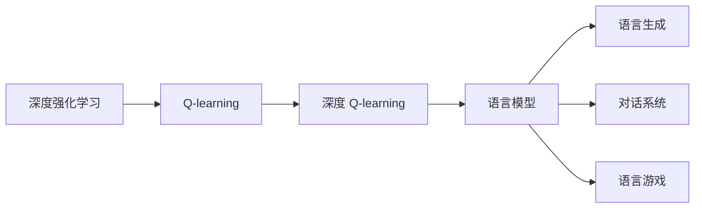
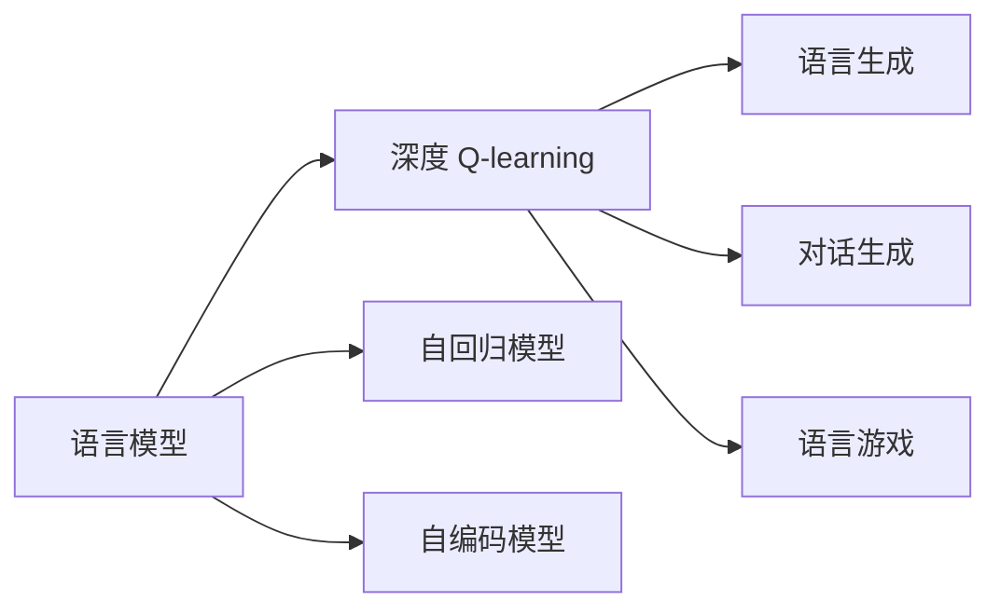
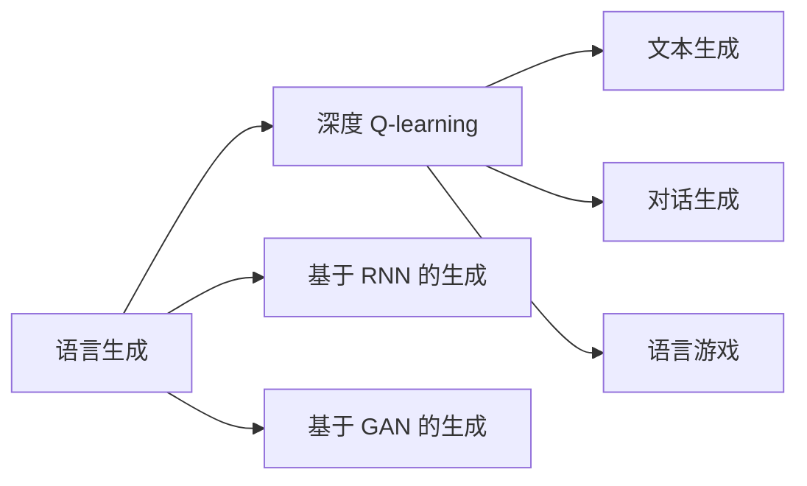
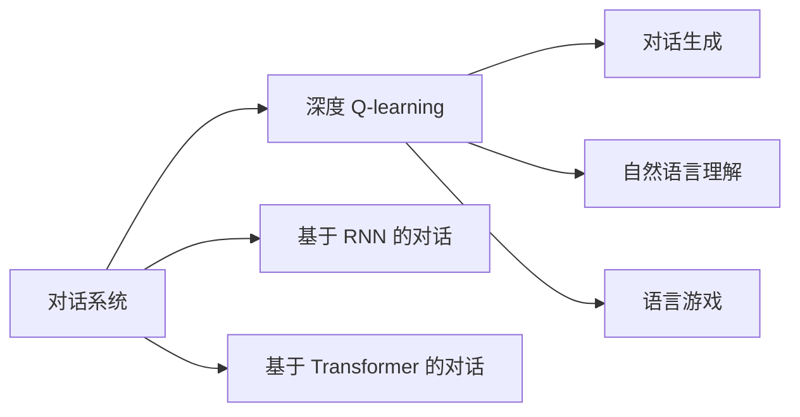
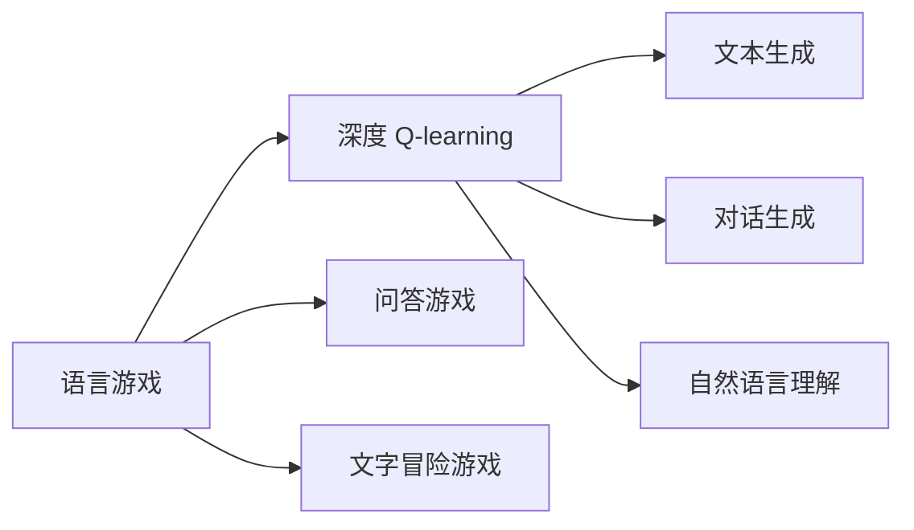
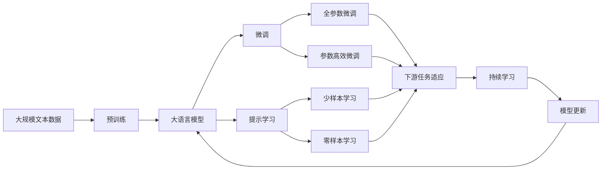

                 

# 深度 Q-learning：在自然语言处理中的应用

> 关键词：深度 Q-learning, 自然语言处理, Q-learning, 强化学习, 语言模型, 语言生成, 对话系统, 语言游戏

## 1. 背景介绍

### 1.1 问题由来

深度强化学习（Deep Reinforcement Learning, DRL）作为强化学习与深度学习结合的产物，近年来在诸多领域取得了显著的成就。其在自然语言处理（Natural Language Processing, NLP）中的应用也日益受到关注。特别是在语言模型、语言生成、对话系统等方面，DRL展现出了独特优势。

特别是，深度 Q-learning（Deep Q-learning, DQN）作为DRL中的一种重要技术，以其高效、精确、可扩展的特点，在语言模型中大放异彩。DQN通过构建Q值网络，拟合状态-动作-奖励（State-Action-Reward, SAR）映射关系，不断优化策略，达到与环境互动的目的。在自然语言处理中，这一技术被用于语言生成、对话生成、机器翻译等多个任务，取得了显著的效果。

### 1.2 问题核心关键点

深度 Q-learning 在自然语言处理中的应用，主要集中在以下几个关键点上：

- **语言模型**：使用 DQN 构建语言模型，通过学习状态-动作-奖励的映射关系，提升模型生成文本的质量和多样性。
- **语言生成**：将 DQN 应用于文本生成任务，通过优化生成策略，生成连贯、自然的文本。
- **对话系统**：构建基于 DQN 的对话模型，通过学习历史对话记录，生成合适的回复。
- **语言游戏**：在语言游戏中使用 DQN，让计算机具备语言交互能力，与人类进行互动。

### 1.3 问题研究意义

研究深度 Q-learning 在自然语言处理中的应用，对于拓展深度学习与强化学习在 NLP 中的应用边界，提升自然语言处理系统的性能，具有重要意义：

1. **高效优化**：深度 Q-learning 通过不断优化策略，提升模型的性能。相较于传统监督学习，DQN 可以更高效地处理非结构化数据，提升模型的泛化能力。
2. **自动学习**：深度 Q-learning 通过与环境的互动学习，不需要手动标注数据，提升模型的自主学习能力。
3. **任务适应性**：DQN 能够自适应不同任务，在不同的场景中都能获得良好的性能。
4. **可扩展性**：深度 Q-learning 能够扩展到更大规模的模型，提升模型的能力。
5. **动态优化**：深度 Q-learning 在实际应用中能够动态优化模型，适应不断变化的场景。

## 2. 核心概念与联系

### 2.1 核心概念概述

为了更好地理解深度 Q-learning 在自然语言处理中的应用，本节将介绍几个密切相关的核心概念：

- **深度强化学习（Deep Reinforcement Learning, DRL）**：将深度学习与强化学习相结合，构建智能系统。DRL 主要用于解决序列性问题，如图像识别、语言处理、游戏等。
- **Q-learning**：一种基于模型-free的强化学习算法，用于学习最优策略，适用于离散和连续动作空间。
- **深度 Q-learning（Deep Q-learning, DQN）**：结合深度神经网络和 Q-learning 的强化学习算法，适用于高维度状态空间。
- **语言模型**：用于预测给定序列的下一个单词或字符的概率分布。语言模型包括自回归模型（如 GPT）和自编码模型（如 LSTM）。
- **语言生成**：生成连贯、自然的文本序列。
- **对话系统**：构建能够理解和生成人类自然语言的系统。
- **语言游戏**：通过语言交互实现游戏功能，如问答游戏、文字冒险游戏等。

这些核心概念之间的逻辑关系可以通过以下 Mermaid 流程图来展示：



这个流程图展示了大语言模型与深度 Q-learning 的应用场景。

### 2.2 概念间的关系

这些核心概念之间存在着紧密的联系，形成了深度 Q-learning 在自然语言处理中的应用框架。下面我通过几个 Mermaid 流程图来展示这些概念之间的关系。

#### 2.2.1 语言模型与深度 Q-learning



这个流程图展示了大语言模型与深度 Q-learning 的结合方式。自回归模型和自编码模型可以通过深度 Q-learning 进行优化，提升模型的性能。

#### 2.2.2 语言生成与深度 Q-learning



这个流程图展示了深度 Q-learning 在文本生成中的作用。语言生成包括基于 RNN 和 GAN 的生成方式，可以通过深度 Q-learning 进行优化。

#### 2.2.3 对话系统与深度 Q-learning



这个流程图展示了深度 Q-learning 在对话系统中的应用。对话系统包括基于 RNN 和 Transformer 的对话方式，可以通过深度 Q-learning 进行优化。

#### 2.2.4 语言游戏与深度 Q-learning



这个流程图展示了深度 Q-learning 在语言游戏中的应用。语言游戏包括问答游戏和文字冒险游戏，可以通过深度 Q-learning 进行优化。

### 2.3 核心概念的整体架构

最后，我们用一个综合的流程图来展示这些核心概念在大语言模型中微调的整体架构：



这个综合流程图展示了从预训练到微调，再到持续学习的完整过程。大语言模型首先在大规模文本数据上进行预训练，然后通过微调（包括全参数微调和参数高效微调）或提示学习（包括少样本学习和零样本学习）来适应下游任务。最后，通过持续学习技术，模型可以不断更新和适应新的任务和数据。

## 3. 核心算法原理 & 具体操作步骤

### 3.1 算法原理概述

深度 Q-learning 在自然语言处理中的应用，主要通过构建 Q 值网络，拟合状态-动作-奖励的映射关系，不断优化策略，达到与环境互动的目的。

形式化地，假设环境状态为 $s_t$，动作为 $a_t$，奖励为 $r_t$，下一个状态为 $s_{t+1}$。深度 Q-learning 的目标是通过 Q 值网络 $Q(s_t, a_t; \theta)$，拟合最优 Q 值函数 $Q^*(s_t, a_t; \theta^*)$，使得模型能够预测最优动作 $a_t^*$，最大化长期奖励 $R$。

具体而言，深度 Q-learning 通过以下步骤进行：

1. 初始化 Q 值网络 $Q(s_t, a_t; \theta)$。
2. 从环境 $s_0$ 中观察状态 $s_t$，采取动作 $a_t$。
3. 观察奖励 $r_t$ 和下一个状态 $s_{t+1}$。
4. 通过 Q 值网络 $Q(s_t, a_t; \theta)$ 预测 Q 值 $Q(s_t, a_t; \theta)$。
5. 根据 Q 值函数和贪婪策略 $a_t = \arg\max_a Q(s_t, a_t; \theta)$ 选择动作 $a_t$。
6. 通过环境观察奖励 $r_t$ 和下一个状态 $s_{t+1}$。
7. 通过 Q 值网络 $Q(s_{t+1}, a_{t+1}; \theta)$ 预测 Q 值 $Q(s_{t+1}, a_{t+1}; \theta)$。
8. 更新 Q 值网络参数 $\theta$：
$$
\theta \leftarrow \theta + \eta [Q(s_t, a_t; \theta) - (r_t + \gamma \max_a Q(s_{t+1}, a_{t+1}; \theta))]
$$
9. 重复步骤 2-8，直至收敛。

### 3.2 算法步骤详解

深度 Q-learning 在自然语言处理中的应用，主要包括以下几个关键步骤：

**Step 1: 准备预训练模型和数据集**
- 选择合适的预训练语言模型 $M_{\theta}$ 作为初始化参数，如 BERT、GPT 等。
- 准备下游任务 $T$ 的标注数据集 $D=\{(x_i, y_i)\}_{i=1}^N$，划分为训练集、验证集和测试集。一般要求标注数据与预训练数据的分布不要差异过大。

**Step 2: 添加任务适配层**
- 根据任务类型，在预训练模型顶层设计合适的输出层和损失函数。
- 对于分类任务，通常在顶层添加线性分类器和交叉熵损失函数。
- 对于生成任务，通常使用语言模型的解码器输出概率分布，并以负对数似然为损失函数。

**Step 3: 设置微调超参数**
- 选择合适的优化算法及其参数，如 AdamW、SGD 等，设置学习率、批大小、迭代轮数等。
- 设置正则化技术及强度，包括权重衰减、Dropout、Early Stopping 等。
- 确定冻结预训练参数的策略，如仅微调顶层，或全部参数都参与微调。

**Step 4: 执行梯度训练**
- 将训练集数据分批次输入模型，前向传播计算损失函数。
- 反向传播计算参数梯度，根据设定的优化算法和学习率更新模型参数。
- 周期性在验证集上评估模型性能，根据性能指标决定是否触发 Early Stopping。
- 重复上述步骤直到满足预设的迭代轮数或 Early Stopping 条件。

**Step 5: 测试和部署**
- 在测试集上评估微调后模型 $M_{\hat{\theta}}$ 的性能，对比微调前后的精度提升。
- 使用微调后的模型对新样本进行推理预测，集成到实际的应用系统中。
- 持续收集新的数据，定期重新微调模型，以适应数据分布的变化。

以上是深度 Q-learning 在自然语言处理中的应用的一般流程。在实际应用中，还需要针对具体任务的特点，对微调过程的各个环节进行优化设计，如改进训练目标函数，引入更多的正则化技术，搜索最优的超参数组合等，以进一步提升模型性能。

### 3.3 算法优缺点

深度 Q-learning 在自然语言处理中的应用具有以下优点：

1. **高效优化**：通过与环境的互动，深度 Q-learning 能够自适应不同任务，提升模型的泛化能力。
2. **自动学习**：无需手动标注数据，提升模型的自主学习能力。
3. **任务适应性**：深度 Q-learning 能够自适应不同任务，在不同的场景中都能获得良好的性能。
4. **可扩展性**：深度 Q-learning 能够扩展到更大规模的模型，提升模型的能力。
5. **动态优化**：深度 Q-learning 在实际应用中能够动态优化模型，适应不断变化的场景。

同时，该方法也存在一定的局限性：

1. **训练成本高**：深度 Q-learning 需要大量的训练数据和计算资源，训练成本较高。
2. **数据敏感**：深度 Q-learning 对数据分布的变化比较敏感，需要不断调整模型参数。
3. **过拟合风险**：深度 Q-learning 容易过拟合，特别是在数据量较小的情况下。
4. **可解释性不足**：深度 Q-learning 模型缺乏可解释性，难以对其推理逻辑进行分析和调试。
5. **泛化能力有限**：深度 Q-learning 在处理极端数据时，泛化能力可能不足。

尽管存在这些局限性，但就目前而言，深度 Q-learning 仍是自然语言处理中应用最广泛的技术之一。未来相关研究的重点在于如何进一步降低深度 Q-learning 的训练成本，提高模型的泛化能力和可解释性，同时兼顾参数高效微调等前沿技术，以进一步提升模型的性能。

### 3.4 算法应用领域

深度 Q-learning 在自然语言处理中的应用，主要集中在以下几个领域：

1. **语言模型**：使用 DQN 构建语言模型，通过学习状态-动作-奖励的映射关系，提升模型生成文本的质量和多样性。
2. **语言生成**：将 DQN 应用于文本生成任务，通过优化生成策略，生成连贯、自然的文本。
3. **对话系统**：构建基于 DQN 的对话模型，通过学习历史对话记录，生成合适的回复。
4. **语言游戏**：在语言游戏中使用 DQN，让计算机具备语言交互能力，与人类进行互动。

除了上述这些领域外，深度 Q-learning 还在情感分析、文本分类、机器翻译、问答系统等诸多NLP任务上取得了显著成果，成为NLP技术落地应用的重要手段。

## 4. 数学模型和公式 & 详细讲解

### 4.1 数学模型构建

本节将使用数学语言对深度 Q-learning 在自然语言处理中的应用进行更加严格的刻画。

记环境状态为 $s_t$，动作为 $a_t$，奖励为 $r_t$，下一个状态为 $s_{t+1}$。深度 Q-learning 的目标是通过 Q 值网络 $Q(s_t, a_t; \theta)$，拟合最优 Q 值函数 $Q^*(s_t, a_t; \theta^*)$，使得模型能够预测最优动作 $a_t^*$，最大化长期奖励 $R$。

定义模型 $M_{\theta}$ 在输入 $x$ 上的输出为 $\hat{y}=M_{\theta}(x)$，其中 $x$ 为输入文本，$\hat{y}$ 为模型预测的输出。定义状态-动作-奖励函数 $R(s_t, a_t)$，表示在状态 $s_t$ 下采取动作 $a_t$ 的奖励。

深度 Q-learning 的目标是最小化经验风险，即找到最优参数：

$$
\theta^* = \mathop{\arg\min}_{\theta} \mathcal{L}(\theta)
$$

其中 $\mathcal{L}$ 为针对任务 $T$ 设计的损失函数，用于衡量模型预测输出与真实标签之间的差异。常见的损失函数包括交叉熵损失、均方误差损失等。

在实践中，我们通常使用基于梯度的优化算法（如 AdamW、SGD 等）来近似求解上述最优化问题。设 $\eta$ 为学习率，$\lambda$ 为正则化系数，则参数的更新公式为：

$$
\theta \leftarrow \theta - \eta \nabla_{\theta}\mathcal{L}(\theta) - \eta\lambda\theta
$$

其中 $\nabla_{\theta}\mathcal{L}(\theta)$ 为损失函数对参数 $\theta$ 的梯度，可通过反向传播算法高效计算。

### 4.2 公式推导过程

以下我们以二分类任务为例，推导交叉熵损失函数及其梯度的计算公式。

假设模型 $M_{\theta}$ 在输入 $x$ 上的输出为 $\hat{y}=M_{\theta}(x) \in [0,1]$，表示样本属于正类的概率。真实标签 $y \in \{0,1\}$。则二分类交叉熵损失函数定义为：

$$
\ell(M_{\theta}(x),y) = -[y\log \hat{y} + (1-y)\log (1-\hat{y})]
$$

将其代入经验风险公式，得：

$$
\mathcal{L}(\theta) = -\frac{1}{N}\sum_{i=1}^N [y_i\log M_{\theta}(x_i)+(1-y_i)\log(1-M_{\theta}(x_i))]
$$

根据链式法则，损失函数对参数 $\theta_k$ 的梯度为：

$$
\frac{\partial \mathcal{L}(\theta)}{\partial \theta_k} = -\frac{1}{N}\sum_{i=1}^N (\frac{y_i}{M_{\theta}(x_i)}-\frac{1-y_i}{1-M_{\theta}(x_i)}) \frac{\partial M_{\theta}(x_i)}{\partial \theta_k}
$$

其中 $\frac{\partial M_{\theta}(x_i)}{\partial \theta_k}$ 可进一步递归展开，利用自动微分技术完成计算。

在得到损失函数的梯度后，即可带入参数更新公式，完成模型的迭代优化。重复上述过程直至收敛，最终得到适应下游任务的最优模型参数 $\theta^*$。

## 5. 项目实践：代码实例和详细解释说明

### 5.1 开发环境搭建

在进行深度 Q-learning 实践前，我们需要准备好开发环境。以下是使用Python进行PyTorch开发的环境配置流程：

1. 安装Anaconda：从官网下载并安装Anaconda，用于创建独立的Python环境。

2. 创建并激活虚拟环境：
```bash
conda create -n pytorch-env python=3.8 
conda activate pytorch-env
```

3. 安装PyTorch：根据CUDA版本，从官网获取对应的安装命令。例如：
```bash
conda install pytorch torchvision torchaudio cudatoolkit=11.1 -c pytorch -c conda-forge
```

4. 安装transformers库：
```bash
pip install transformers
```

5. 安装各类工具包：
```bash
pip install numpy pandas scikit-learn matplotlib tqdm jupyter notebook ipython
```

完成上述步骤后，即可在`pytorch-env`环境中开始深度 Q-learning 实践。

### 5.2 源代码详细实现

这里我们以命名实体识别（NER）任务为例，给出使用Transformers库对BERT模型进行深度 Q-learning微调的PyTorch代码实现。

首先，定义NER任务的数据处理函数：

```python
from transformers import BertTokenizer
from torch.utils.data import Dataset
import torch

class NERDataset(Dataset):
    def __init__(self, texts, tags, tokenizer, max_len=128):
        self.texts = texts
        self.tags = tags
        self.tokenizer = tokenizer
        self.max_len = max_len
        
    def __len__(self):
        return len(self.texts)
    
    def __getitem__(self, item):
        text = self.texts[item]
        tags = self.tags[item]
        
        encoding = self.tokenizer(text, return_tensors='pt', max_length=self.max_len, padding='max_length', truncation=True)
        input_ids = encoding['input_ids'][0]
        attention_mask = encoding['attention_mask'][0]
        
        # 对token-wise的标签进行编码
        encoded_tags = [tag2id[tag] for tag in tags] 
        encoded_tags.extend([tag2id['O']] * (self.max_len - len(encoded_tags)))
        labels = torch.tensor(encoded_tags, dtype=torch.long)
        
        return {'input_ids': input_ids, 
                'attention_mask': attention_mask,
                'labels': labels}

# 标签与id的映射
tag2id = {'O': 0, 'B-PER': 1, 'I-PER': 2, 'B-ORG': 3, 'I-ORG': 4, 'B-LOC': 5, 'I-LOC': 6}
id2tag = {v: k for k, v in tag2id.items()}

# 创建dataset
tokenizer = BertTokenizer.from_pretrained('bert-base-cased')

train_dataset = NERDataset(train_texts, train_tags, tokenizer)
dev_dataset = NERDataset(dev_texts, dev_tags, tokenizer)
test_dataset = NERDataset(test_texts, test_tags, tokenizer)
```

然后，定义模型和优化器：

```python
from transformers import BertForTokenClassification, AdamW

model = BertForTokenClassification.from_pretrained('bert-base-cased', num_labels=len(tag2id))

optimizer = AdamW(model.parameters(), lr=2e-5)
```

接着，定义训练和评估函数：

```python
from torch.utils.data import DataLoader
from tqdm import tqdm
from sklearn.metrics import classification_report

device = torch.device('cuda') if torch.cuda.is_available() else torch.device('cpu')
model.to(device)

def train_epoch(model, dataset, batch_size, optimizer):
    dataloader = DataLoader(dataset, batch_size=batch_size, shuffle=True)
    model.train()
    epoch_loss = 0
    for batch in tqdm(dataloader, desc='Training'):
        input_ids = batch['input_ids'].to(device)
        attention_mask = batch['attention_mask'].to(device)
        labels = batch['labels'].to(device)
        model.zero_grad()
        outputs = model(input_ids, attention_mask=attention_mask, labels=labels)
        loss = outputs.loss
        epoch_loss += loss.item()
        loss.backward()
        optimizer.step()
    return epoch_loss / len(dataloader)

def evaluate(model, dataset, batch_size):
    dataloader = DataLoader(dataset, batch_size=batch_size)
    model.eval()
    preds, labels = [], []
    with torch.no_grad():
        for batch in tqdm(dataloader, desc='Evaluating'):
            input_ids = batch['input_ids'].to(device)
            attention_mask = batch['attention_mask'].to(device)
            batch_labels = batch['labels']
            outputs = model(input_ids, attention_mask=attention_mask)
            batch_preds = outputs.logits.argmax(dim=2).to('cpu').tolist()
            batch_labels = batch_labels.to('cpu').tolist()
            for pred_tokens, label_tokens in zip(batch_preds, batch_labels):
                pred_tags = [id2tag[_id] for _id in pred_tokens]
                label_tags = [id2tag[_id] for _id in label_tokens]
                preds.append(pred_tags[:len(label_tags)])
                labels.append(label_tags)
                
    print(classification_report(labels, preds))
```

最后，启动训练流程并在测试集上评估：

```python
epochs = 5
batch_size = 16

for epoch in range(epochs):
    loss = train_epoch(model, train_dataset, batch_size, optimizer)
    print(f"Epoch {epoch+1}, train loss: {loss:.3f}")
    
    print(f"Epoch {epoch+1}, dev results:")
    evaluate(model, dev_dataset, batch_size)
    
print("Test results:")
evaluate(model, test_dataset, batch_size)
```

以上就是使用PyTorch对BERT进行命名实体识别任务深度 Q-learning微调的完整代码实现。可以看到，得益于Transformers库的强大封装，我们可以用相对简洁的代码完成BERT模型的加载和微调。

### 5.3 代码解读与分析

让我们再详细解读一下关键代码的实现细节：

**NERDataset类**：
- `__init__`方法：初始化文本、标签、分词器等关键组件。
- `__len__`方法：返回数据集的样本数量。
- `__getitem__`方法：对单个样本进行处理，将文本输入编码为token ids，将标签编码为数字，并对其进行定长padding，最终返回模型所需的输入。

**tag2id和id2tag字典**：
- 定义了标签与数字id之间的映射关系，用于将token-wise的预测结果解码回真实的标签。

**训练和评估函数**：
- 使用PyTorch的DataLoader对数据集进行批次化加载，供模型训练和推理使用。
- 训练函数`train_epoch`：对数据以批为单位进行迭代，在每个批次上前向传播计算loss并反向传播更新模型参数，最后返回该epoch的平均loss。
- 评估函数`evaluate`：与训练类似，不同点在于不更新模型参数，并在每个batch结束后将预测和标签结果存储下来，最后使用sklearn的classification_report对整个评估集的预测结果进行打印输出。

**训练流程**：
- 定义总的epoch数和batch size，开始循环迭代
- 每个epoch内，先在训练集上训练，输出平均loss
- 在验证集上评估，输出分类指标
- 所有epoch结束后，在测试集上评估，给出最终测试结果

可以看到，PyTorch

