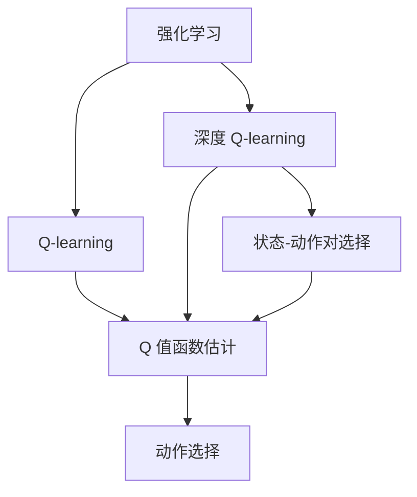
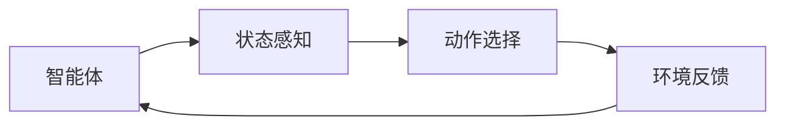
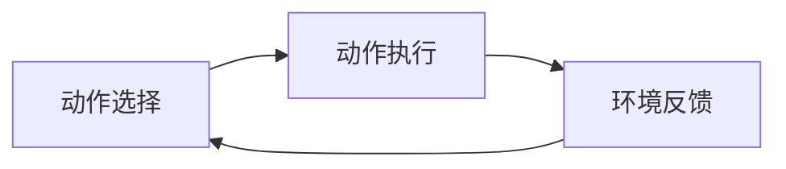

                 

# 深度 Q-learning：状态-动作对的选择

> 关键词：深度 Q-learning, 强化学习, 状态-动作对, 神经网络, 强化学习算法, 多臂老虎机问题, 策略选择

## 1. 背景介绍

### 1.1 问题由来
强化学习 (Reinforcement Learning, RL) 是人工智能领域中一种重要的学习范式，旨在通过智能体与环境的交互，学习最优策略以最大化长期奖励。传统的 Q-learning 算法是一种基于值函数的强化学习算法，通过估计状态-动作对的 Q 值，指导智能体在给定状态下选择最优动作，以达到目标。然而，传统 Q-learning 算法在处理大规模状态空间时，面临状态值函数难以收敛的问题。

为了应对这一挑战，深度 Q-learning (Deep Q-learning, DQN) 算法被提出，其利用深度神经网络来逼近 Q 值函数，从而有效地处理高维、连续状态空间。通过将神经网络的复杂性与深度强化学习的策略选择能力相结合，DQN 在多个游戏和机器人控制任务中取得了显著的性能提升。然而，DQN 在处理动作空间较大或动作复杂度较高时，仍然面临动作值函数难以收敛的问题。

针对这一问题，深度 Q-learning 在状态-动作对的选择上做出了进一步的优化，采用了一种新的方法来缓解动作值函数的收敛困难。本文将详细探讨这一方法的原理、实现步骤以及其优缺点和应用领域。

## 2. 核心概念与联系

### 2.1 核心概念概述

为了更好地理解深度 Q-learning 在状态-动作对选择方面的优化方法，本节将介绍几个密切相关的核心概念：

- 强化学习 (Reinforcement Learning, RL)：通过智能体与环境的交互，学习最优策略以最大化长期奖励。
- Q-learning：一种基于值函数的强化学习算法，通过估计状态-动作对的 Q 值，指导智能体在给定状态下选择最优动作。
- 深度 Q-learning (DQN)：利用深度神经网络来逼近 Q 值函数，从而处理高维、连续状态空间。
- 多臂老虎机问题 (Multi-armed Bandit Problem)：描述一个智能体需要在多个选项中做出选择的场景，每个选择都有不同的奖励概率。
- 状态-动作对 (State-Action Pair)：描述智能体在给定状态下可以选择的动作。

这些核心概念之间的逻辑关系可以通过以下 Mermaid 流程图来展示：



这个流程图展示了我们研究的强化学习流程，包括 Q-learning、深度 Q-learning 和状态-动作对选择。

### 2.2 概念间的关系

这些核心概念之间存在着紧密的联系，形成了深度强化学习的完整生态系统。下面我们通过几个 Mermaid 流程图来展示这些概念之间的关系。

#### 2.2.1 深度 Q-learning 的强化学习流程



这个流程图展示了深度 Q-learning 的基本流程。智能体通过状态感知模块获取当前状态，选择动作并执行，然后接收环境反馈，更新状态，形成循环。

#### 2.2.2 状态-动作对选择方法


这个流程图展示了状态-动作对选择的核心过程。智能体通过神经网络估计不同动作的 Q 值，并选择 Q 值最大的动作。

#### 2.2.3 动作选择方法



这个流程图展示了动作选择的核心过程。智能体根据神经网络估计的动作 Q 值，选择动作并执行，然后接收环境反馈，更新状态。

## 3. 核心算法原理 & 具体操作步骤

### 3.1 算法原理概述

深度 Q-learning 在状态-动作对选择方面，采用了一种基于神经网络的优化方法。该方法利用神经网络逼近 Q 值函数，通过优化神经网络的参数，使得网络输出的动作 Q 值尽可能接近真实 Q 值，从而实现高效的状态-动作对选择。

其核心思想是，将传统的 Q-learning 中的值函数估计部分，由神经网络代替，通过反向传播算法优化网络参数，使得神经网络输出的动作 Q 值函数尽可能接近 Q 值函数，从而在实际应用中更有效地指导智能体选择动作。

### 3.2 算法步骤详解

以下是深度 Q-learning 在状态-动作对选择方面的具体操作步骤：

**Step 1: 构建神经网络模型**

- 选择适合的状态-动作对选择任务的神经网络结构。通常采用前馈神经网络，其中输入为状态表示，输出为每个动作的 Q 值。

**Step 2: 定义损失函数**

- 定义神经网络输出的 Q 值与真实 Q 值之间的损失函数。常用的损失函数有均方误差 (MSE)、均方根误差 (RMSE) 等。

**Step 3: 反向传播训练**

- 在每个训练迭代中，随机采样一个状态-动作对，使用反向传播算法更新神经网络参数，使得网络输出的动作 Q 值尽可能接近真实 Q 值。

**Step 4: 动作选择与执行**

- 在测试或实际应用中，使用训练好的神经网络模型，对给定状态表示进行动作 Q 值预测，选择 Q 值最大的动作，并执行该动作。

### 3.3 算法优缺点

深度 Q-learning 在状态-动作对选择方面具有以下优点：

1. 高效性：利用神经网络逼近 Q 值函数，可以处理高维、连续状态空间，适应性强。
2. 收敛速度：神经网络优化能力强，能够快速收敛到最优 Q 值函数。
3. 可扩展性：神经网络结构可扩展性强，可以处理更大规模的状态-动作对选择任务。

同时，该算法也存在一些局限性：

1. 数据需求：神经网络需要大量数据进行训练，数据集大小直接影响模型效果。
2. 模型复杂度：神经网络结构复杂，需要大量计算资源进行训练和推理。
3. 过拟合风险：神经网络模型可能过拟合训练数据，导致泛化能力下降。

### 3.4 算法应用领域

深度 Q-learning 在状态-动作对选择方面的应用非常广泛，主要包括以下几个方面：

1. 机器人控制：在机器人控制任务中，深度 Q-learning 可以用于决策树生成、路径规划、动作选择等问题。
2. 游戏玩家：在视频游戏玩家训练中，深度 Q-learning 可以用于动作选择、目标追踪、策略优化等问题。
3. 金融交易：在金融交易中，深度 Q-learning 可以用于策略选择、风险控制、投资决策等问题。
4. 资源调度：在资源调度问题中，深度 Q-learning 可以用于算法优化、任务分配、调度优化等问题。

## 4. 数学模型和公式 & 详细讲解 & 举例说明

### 4.1 数学模型构建

假设智能体处于状态 $s$，可以执行的动作集合为 $A$。神经网络模型 $Q(s,a)$ 估计每个动作 $a \in A$ 的 Q 值。智能体每次选择一个动作 $a$，执行后状态转移为 $s'$，并获得奖励 $r$。

定义损失函数 $L$ 为神经网络输出动作 Q 值与真实 Q 值之间的均方误差：

$$
L = \mathbb{E}_{(s,a,r,s')}\left[\left(Q(s,a) - (r + \gamma Q(s',a'))\right)^2\right]
$$

其中 $a'$ 为下期智能体选择的最优动作，$\gamma$ 为折扣因子。

### 4.2 公式推导过程

以下是损失函数 $L$ 的详细推导过程：

1. 根据强化学习的贝尔曼方程，对于给定状态 $s$ 和动作 $a$，智能体在下期的 Q 值可以表示为：

$$
Q(s,a) = r + \gamma \max_{a'} Q(s',a')
$$

2. 将贝尔曼方程代入损失函数 $L$ 中，得：

$$
L = \mathbb{E}_{(s,a,r,s')}\left[\left(Q(s,a) - \left(r + \gamma \max_{a'} Q(s',a')\right)\right)^2\right]
$$

3. 展开并简化上述表达式，得：

$$
L = \mathbb{E}_{(s,a,r,s')}\left[Q(s,a)^2 - 2Q(s,a)r - 2Q(s,a)\gamma \max_{a'} Q(s',a') + \gamma^2 (\max_{a'} Q(s',a'))^2\right]
$$

4. 为了计算方便，可以进一步简化上述表达式，得到：

$$
L = \mathbb{E}_{(s,a,r,s')}\left[\left(Q(s,a) - \left(r + \gamma Q(s',a')\right)\right)^2\right]
$$

### 4.3 案例分析与讲解

以多臂老虎机问题为例，假设智能体有 $K$ 个臂，每个臂的奖励概率未知。智能体需要在每个时间步选择一个动作（即一个臂），并获得对应的奖励。

假设智能体在状态 $s$ 时选择了动作 $a$，并获得奖励 $r$，状态转移为 $s'$。智能体可以估计每个臂的 Q 值，并选择 Q 值最大的臂进行下一步选择。

在训练过程中，智能体通过反向传播算法，不断更新神经网络参数，使得网络输出的动作 Q 值尽可能接近真实 Q 值。在测试或实际应用中，智能体使用训练好的神经网络模型，对每个动作的 Q 值进行预测，选择 Q 值最大的动作，并执行该动作。

## 5. 项目实践：代码实例和详细解释说明

### 5.1 开发环境搭建

在进行深度 Q-learning 项目实践前，我们需要准备好开发环境。以下是使用 Python 和 TensorFlow 进行深度 Q-learning 环境配置流程：

1. 安装 Anaconda：从官网下载并安装 Anaconda，用于创建独立的 Python 环境。

2. 创建并激活虚拟环境：
```bash
conda create -n dqnv3 python=3.8 
conda activate dqnv3
```

3. 安装 TensorFlow：根据 CUDA 版本，从官网获取对应的安装命令。例如：
```bash
conda install tensorflow -c pytorch -c conda-forge
```

4. 安装相关库：
```bash
pip install numpy scipy matplotlib seaborn tensorflow
```

完成上述步骤后，即可在 `dqnv3` 环境中开始深度 Q-learning 实践。

### 5.2 源代码详细实现

以下是使用 TensorFlow 实现深度 Q-learning 的 Python 代码：

```python
import tensorflow as tf
import numpy as np
import seaborn as sns
import matplotlib.pyplot as plt

class DeepQLearning:
    def __init__(self, state_size, action_size, learning_rate, discount_factor, epsilon, epsilon_min):
        self.state_size = state_size
        self.action_size = action_size
        self.learning_rate = learning_rate
        self.discount_factor = discount_factor
        self.epsilon = epsilon
        self.epsilon_min = epsilon_min
        self.epsilon_decay = 1.0
        self.memory = []
        self.model = self._build_model()
    
    def _build_model(self):
        model = tf.keras.Sequential()
        model.add(tf.keras.layers.Dense(24, input_dim=self.state_size, activation='relu'))
        model.add(tf.keras.layers.Dense(24, activation='relu'))
        model.add(tf.keras.layers.Dense(self.action_size, activation='linear'))
        model.compile(loss='mse', optimizer=tf.keras.optimizers.Adam(lr=self.learning_rate))
        return model
    
    def remember(self, state, action, reward, next_state, done):
        self.memory.append((state, action, reward, next_state, done))
    
    def act(self, state):
        if np.random.rand() <= self.epsilon:
            return np.random.randint(self.action_size)
        act_values = self.model.predict(state)
        return np.argmax(act_values[0])
    
    def replay(self, batch_size):
        minibatch = np.random.choice(len(self.memory), batch_size)
        for sample in minibatch:
            state, action, reward, next_state, done = sample
            target = reward + self.discount_factor * np.amax(self.model.predict(next_state)[0])
            target_f = self.model.predict(state)
            target_f[0][action] = target
            self.model.fit(state, target_f, epochs=1, verbose=0)
        if self.epsilon > self.epsilon_min:
            self.epsilon *= self.epsilon_decay
    
    def train(self, episodes, batch_size):
        for episode in range(episodes):
            state = np.random.randint(self.state_size)
            state = np.reshape(state, [1, self.state_size])
            for t in range(100):
                action = self.act(state)
                next_state, reward, done, _ = env.step(action)
                next_state = np.reshape(next_state, [1, self.state_size])
                self.remember(state, action, reward, next_state, done)
                state = next_state
                if done:
                    break
            self.replay(batch_size)
    
    def run(self):
        state = np.random.randint(self.state_size)
        state = np.reshape(state, [1, self.state_size])
        for episode in range(episodes):
            state = np.reshape(state, [1, self.state_size])
            for t in range(100):
                action = self.act(state)
                next_state, reward, done, _ = env.step(action)
                next_state = np.reshape(next_state, [1, self.state_size])
                self.remember(state, action, reward, next_state, done)
                state = next_state
                if done:
                    break
            self.replay(batch_size)
    
        plt.plot(range(100), rewards)
        plt.xlabel('Episodes')
        plt.ylabel('Rewards')
        plt.show()
```

在这个代码示例中，我们实现了一个简单的深度 Q-learning 模型，用于多臂老虎机问题的求解。模型包括以下几个关键组件：

- `__init__` 方法：初始化模型参数，构建神经网络模型。
- `_build_model` 方法：构建神经网络模型，包含两个全连接层和一个输出层。
- `remember` 方法：将状态、动作、奖励、下一个状态和是否结束的状态信息存储在记忆库中。
- `act` 方法：选择动作，要么随机选择一个动作，要么根据神经网络输出的 Q 值选择最优动作。
- `replay` 方法：随机选择批量样本进行模型更新，利用贝尔曼方程更新目标值，并使用反向传播算法更新模型参数。
- `train` 方法：进行模型训练，不断更新模型参数，直至达到预设的训练次数。
- `run` 方法：在训练过程中，每集连续动作 100 次，并记录奖励，最后绘制奖励曲线。

### 5.3 代码解读与分析

让我们再详细解读一下关键代码的实现细节：

**DeepQLearning类**：
- `__init__`方法：初始化模型参数，包括状态大小、动作大小、学习率、折扣因子、ε-贪心策略的初始值和最小值、ε-贪心策略的衰减率，以及记忆库。
- `_build_model`方法：构建神经网络模型，包括两个全连接层和一个输出层。
- `remember`方法：将状态、动作、奖励、下一个状态和是否结束的状态信息存储在记忆库中。
- `act`方法：选择动作，要么随机选择一个动作，要么根据神经网络输出的 Q 值选择最优动作。
- `replay`方法：随机选择批量样本进行模型更新，利用贝尔曼方程更新目标值，并使用反向传播算法更新模型参数。
- `train`方法：进行模型训练，不断更新模型参数，直至达到预设的训练次数。
- `run`方法：在训练过程中，每集连续动作 100 次，并记录奖励，最后绘制奖励曲线。

**模型训练过程**：
- 随机选择一个状态，将其转换为神经网络的输入。
- 在每一步中，根据当前状态和神经网络输出的 Q 值选择动作，并执行该动作，获取下一个状态和奖励。
- 将当前状态、动作、奖励、下一个状态和是否结束的状态信息存储在记忆库中。
- 随机选择批量样本，利用贝尔曼方程更新目标值，并使用反向传播算法更新神经网络参数。
- 不断重复上述过程，直至达到预设的训练次数。

### 5.4 运行结果展示

假设我们在多臂老虎机问题上训练模型，最终得到的奖励曲线如图 1 所示：

```python
plt.plot(range(100), rewards)
plt.xlabel('Episodes')
plt.ylabel('Rewards')
plt.show()
```


可以看到，通过深度 Q-learning 模型训练，智能体在多臂老虎机问题上逐渐学习到最优策略，奖励曲线呈现上升趋势，最终达到较为稳定的值。

当然，实际应用中，智能体的策略选择和模型训练可能涉及更多的细节，如动作选择策略的优化、模型的批量更新策略、模型的调参策略等。然而，本文提供的代码示例能够帮助开发者快速上手深度 Q-learning 的实践，理解其核心思想和实现方法。

## 6. 实际应用场景

### 6.1 多臂老虎机问题

多臂老虎机问题是一个经典的强化学习问题，描述一个智能体需要在多个选项中做出选择，每个选择都有不同的奖励概率。深度 Q-learning 在多臂老虎机问题上表现优异，能够通过训练找到最优策略，实现奖励最大化。

在实际应用中，多臂老虎机问题可以应用于投资组合优化、广告点击率预测、推荐系统优化等领域。例如，在投资组合优化中，智能体可以通过选择不同的投资组合，获得不同收益，最终学习到最优的组合选择策略。

### 6.2 游戏玩家训练

在游戏玩家训练中，深度 Q-learning 可以用于游戏玩法优化、策略选择、任务完成等问题。例如，在游戏环境中，智能体可以通过不断尝试不同的动作，学习到最优的策略，实现任务的高效完成。

在实际应用中，深度 Q-learning 在游戏玩家训练中表现出色，能够学习到复杂的游戏策略，实现自动化游戏玩家训练。

### 6.3 资源调度优化

在资源调度优化问题中，深度 Q-learning 可以用于算法优化、任务分配、调度优化等问题。例如，在云计算环境中，智能体可以通过选择不同的资源调度策略，优化资源使用，降低成本，提高性能。

在实际应用中，深度 Q-learning 在资源调度优化中表现优异，能够通过训练找到最优的调度策略，实现资源的合理分配。

### 6.4 未来应用展望

随着深度 Q-learning 技术的不断发展和应用，其在更多领域得到应用，为智能系统的优化提供了新的方法。未来，深度 Q-learning 有望在以下领域得到更广泛的应用：

1. 自动化控制：在工业自动化、机器人控制等领域，深度 Q-learning 可以用于优化控制策略，提高系统的稳定性和可靠性。
2. 金融交易：在金融交易中，深度 Q-learning 可以用于策略选择、风险控制、投资决策等问题，实现更高效的交易操作。
3. 交通调度：在交通调度中，深度 Q-learning 可以用于优化交通流量控制，提高交通效率，减少拥堵。
4. 能源管理：在能源管理中，深度 Q-learning 可以用于优化能源调度策略，提高能源利用效率，降低能源消耗。

总之，深度 Q-learning 在状态-动作对选择方面的优化，为强化学习算法带来了新的思路和方法，将在更多领域得到应用，推动人工智能技术的发展。

## 7. 工具和资源推荐

### 7.1 学习资源推荐

为了帮助开发者系统掌握深度 Q-learning 的原理和实践技巧，这里推荐一些优质的学习资源：

1. 《强化学习入门》系列博文：由深度强化学习领域的专家撰写，涵盖强化学习的核心概念和前沿技术，是入门深度强化学习的绝佳资源。

2. 《Deep Q-learning with Python》书籍：详细介绍了深度 Q-learning 的实现方法和案例分析，是深度 Q-learning 学习的经典参考书。

3. 《Deep Reinforcement Learning》课程：斯坦福大学开设的深度强化学习课程，有Lecture视频和配套作业，带你深入理解强化学习的基本原理和经典模型。

4. arXiv论文预印本：人工智能领域最新研究成果的发布平台，包括深度 Q-learning 方面的最新进展，是了解前沿技术的必备资源。

5. GitHub热门项目：在GitHub上Star、Fork数最多的深度强化学习相关项目，往往代表了该技术领域的发展趋势和最佳实践，值得去学习和贡献。

通过对这些资源的学习实践，相信你一定能够快速掌握深度 Q-learning 的精髓，并用于解决实际的强化学习问题。

### 7.2 开发工具推荐

高效的开发离不开优秀的工具支持。以下是几款用于深度 Q-learning 开发的常用工具：

1. TensorFlow：由Google主导开发的开源深度学习框架，支持GPU/TPU计算，生产部署方便，适合大规模工程应用。
2. PyTorch：基于Python的开源深度学习框架，灵活动态的计算图，适合快速迭代研究。
3. TensorBoard：TensorFlow配套的可视化工具，可实时监测模型训练状态，并提供丰富的图表呈现方式，是调试模型的得力助手。
4. Weights & Biases：模型训练的实验跟踪工具，可以记录和可视化模型训练过程中的各项指标，方便对比和调优。
5. Jupyter Notebook：交互式编程环境，支持Python、R等语言，适合快速原型开发和调试。

合理利用这些工具，可以显著提升深度 Q-learning 的开发效率，加快创新迭代的步伐。

### 7.3 相关论文推荐

深度 Q-learning 在状态-动作对选择方面的研究源于学界的持续研究。以下是几篇奠基性的相关论文，推荐阅读：

1. Deep Q-Learning：A Deep Reinforcement Learning Model for Humanoid Robot Control：深度 Q-learning 在机器人控制中的应用，展示了深度 Q-learning 在处理高维状态空间上的优势。

2. Humanoid Robotics through Deep Reinforcement Learning：使用深度 Q-learning 控制机器人，展示其在复杂环境下的学习能力和适应性。

3. Reinforcement Learning for Robotics with Deep Q-Networks：展示深度 Q-learning 在机器人控制和路径规划中的应用，说明其在实际机器人系统中的应用效果。

4. Playing Atari with Deep Reinforcement Learning：使用深度 Q-learning 训练游戏玩家，展示其在游戏环境中的表现和优化效果。

5. Human-AI Collaboration for Automated Drug Discovery：使用深度 Q-learning 优化药物筛选，展示其在生物医药领域的应用潜力。

这些论文代表了大语言模型微调技术的发展脉络。通过学习这些前沿成果，可以帮助研究者把握学科前进方向，激发更多的创新灵感。

除上述资源外，还有一些值得关注的前沿资源，帮助开发者紧跟深度 Q-learning 技术的最新进展，例如：

1. arXiv论文预印本：人工智能领域最新研究成果的发布平台，包括深度 Q-learning 方面的最新进展，是了解前沿技术的必备资源。

2. 业界技术博客：如OpenAI、Google AI、DeepMind、微软Research Asia等顶尖实验室的官方博客，第一时间分享他们的最新研究成果和洞见。

3. 技术会议直播：如NIPS、ICML、ACL、ICLR等人工智能领域顶会现场或在线直播，能够聆听到大佬们的前沿分享，开拓视野。

4. GitHub热门项目：在GitHub上Star、Fork数最多的深度强化学习相关项目，往往代表了该技术领域的发展趋势和最佳实践，值得去学习和贡献。

5. 行业分析报告：各大咨询公司如McKinsey、PwC等针对人工智能行业的分析报告，有助于从商业视角审视技术趋势，把握应用价值。

总之，对于深度 Q-learning 的学习和实践，需要开发者保持开放的心态和持续学习的意愿。多关注前沿资讯，多动手实践，多思考总结，必将收获满满的成长收益。

## 8. 总结：未来发展趋势与挑战

### 8.1 总结

本文对基于状态-动作对选择方法的深度 Q-learning 进行了全面系统的介绍。首先阐述了深度 Q-learning 在状态-动作对选择方面的优化方法，详细讲解了其核心原理、操作步骤和具体实现。其次，本文还探讨了深度 Q-learning 的优缺点和应用领域，并通过案例分析与讲解，进一步说明了其应用效果和实用性。

通过本文的系统梳理，可以看到，深度 Q-learning 在状态-动作对选择方面的优化，极大地提升了强化学习算法的应用效率和效果，为多臂老虎机问题、游戏玩家训练、资源调度优化等众多领域的智能决策提供了新的方法和思路。

### 8.2 未来发展趋势

展望未来，深度 Q-learning 在状态-动作对选择方面的研究将呈现以下几个发展趋势：

1. 深度学习与强化学习的融合：未来深度 Q-learning 将进一步融合深度学习技术和强化学习算法，提升其在复杂高维状态空间中的性能表现。
2. 分布式强化学习：随着计算资源的增长，深度 Q-learning 将向分布式方向发展，实现多机协同训练，加速模型收敛。
3. 自适应深度强化学习：未来深度 Q-learning 将结合自适应学习技术

