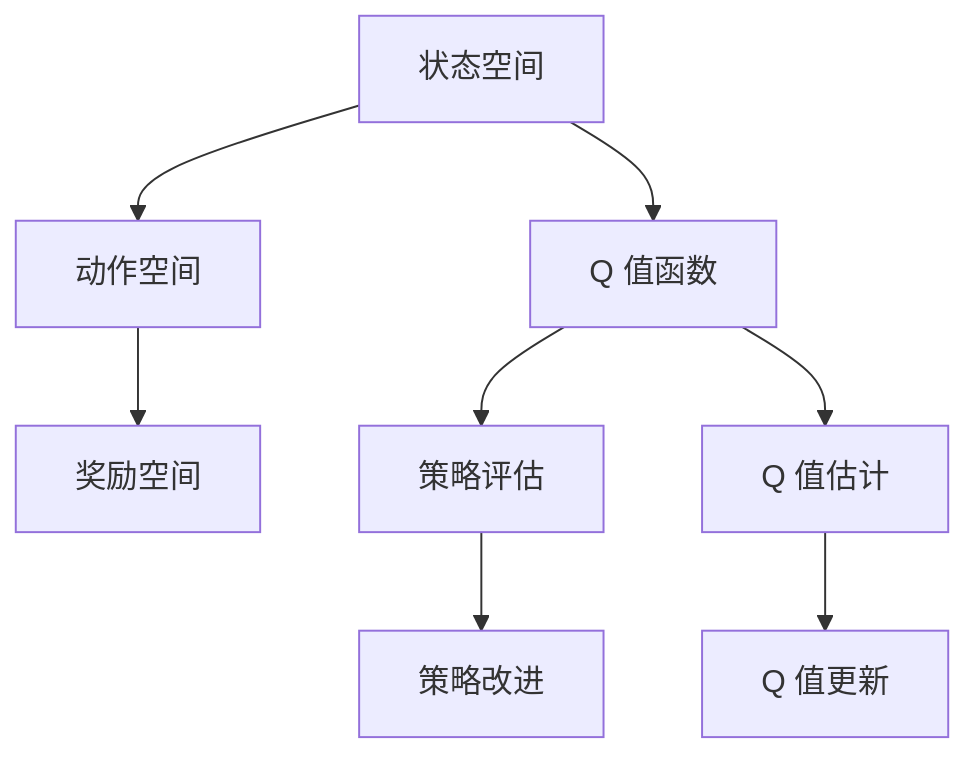
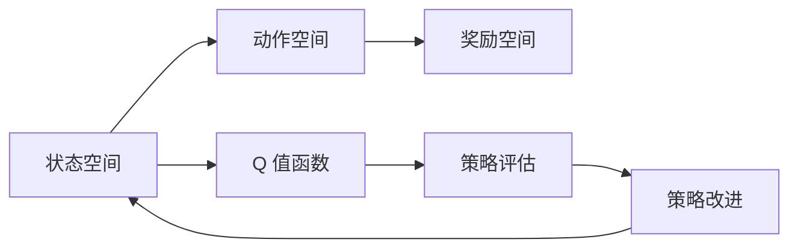
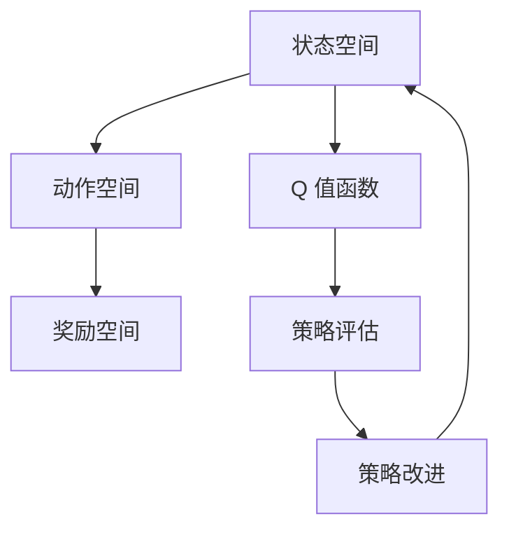
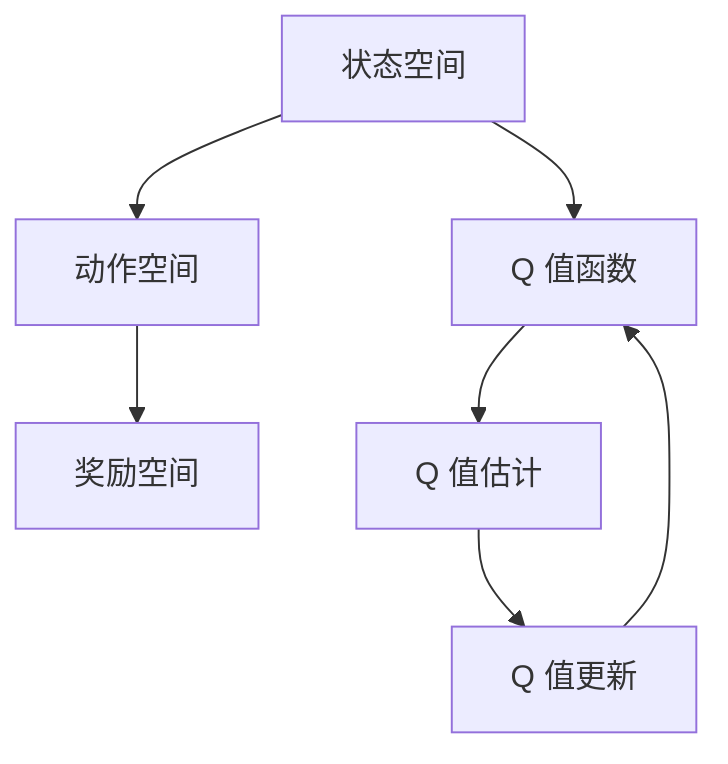
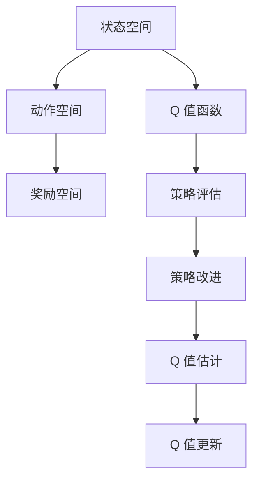

                 

# 深度 Q-learning：策略迭代与价值迭代

> 关键词：深度 Q-learning, 策略迭代, 价值迭代, 强化学习, 深度神经网络, 策略优化, 机器学习

## 1. 背景介绍

### 1.1 问题由来
在机器学习和人工智能领域，强化学习（Reinforcement Learning, RL）已经成为解决复杂决策问题的关键技术之一。其中，深度 Q-learning（Deep Q-learning）是一种将深度神经网络与强化学习相结合的高级算法，适用于处理具有高维状态空间和连续动作空间的任务。深度 Q-learning 算法通过利用深度神经网络逼近 Q 值函数，结合策略迭代和价值迭代的思想，实现了对复杂环境的高效探索和优化。

### 1.2 问题核心关键点
深度 Q-learning 算法的核心在于其结合了策略迭代和价值迭代的思想，通过不断更新 Q 值函数来优化策略。具体而言，深度 Q-learning 通过以下步骤进行：

- 策略迭代：每次从当前状态 $s$ 出发，选择动作 $a$，并根据选择的动作和奖励信号 $r$ 更新策略 $\pi(s)$。
- 价值迭代：利用当前状态 $s$ 和动作 $a$ 计算 Q 值 $Q(s,a)$，并更新 Q 值函数 $\theta$。

通过策略迭代和价值迭代的交替进行，深度 Q-learning 算法不断优化策略和 Q 值函数，最终收敛于最优策略。

### 1.3 问题研究意义
深度 Q-learning 算法在解决强化学习问题方面表现出色，其融合深度神经网络的思想使得其在处理高维状态空间和连续动作空间的任务中具有显著优势。深度 Q-learning 不仅在理论研究上具有重要意义，在实际应用中也广泛用于自动驾驶、游戏智能、机器人控制等领域，能够显著提升系统的决策能力和性能。

## 2. 核心概念与联系

### 2.1 核心概念概述

为更好地理解深度 Q-learning 算法，本节将介绍几个密切相关的核心概念：

- 强化学习（Reinforcement Learning, RL）：一种通过与环境互动，通过奖励信号学习最优策略的机器学习方法。强化学习的目标是最大化累计奖励，常见的算法包括 Q-learning、SARSA、策略梯度等。
- 深度 Q-learning（Deep Q-learning）：将深度神经网络与强化学习相结合，用于处理具有高维状态空间和连续动作空间的任务。深度 Q-learning 通过逼近 Q 值函数，利用神经网络实现策略的优化。
- Q 值函数（Q-Value Function）：在强化学习中，Q 值函数表示在状态 $s$ 下选择动作 $a$ 的长期期望奖励。Q 值函数的更新公式为 $Q(s,a) = r + \gamma \max_{a'} Q(s',a')$，其中 $r$ 是即时奖励，$\gamma$ 是折扣因子，$s'$ 是下一个状态。
- 策略迭代（Policy Iteration）：通过不断更新策略 $\pi(s)$ 来优化策略，具体方法包括策略评估和策略改进两个步骤。
- 价值迭代（Value Iteration）：通过不断更新 Q 值函数 $\theta$ 来优化策略，具体方法包括 Q 值估计和 Q 值更新两个步骤。

这些核心概念之间的逻辑关系可以通过以下 Mermaid 流程图来展示：



这个流程图展示了强化学习的基本流程，以及深度 Q-learning 算法策略迭代和价值迭代的交替进行：

- 状态 $s$ 到动作 $a$，并根据动作和即时奖励 $r$ 更新策略 $\pi(s)$。
- 利用当前状态 $s$ 和动作 $a$ 计算 Q 值 $Q(s,a)$，并更新 Q 值函数 $\theta$。

### 2.2 概念间的关系

这些核心概念之间存在着紧密的联系，形成了深度 Q-learning 算法的完整生态系统。下面我们通过几个 Mermaid 流程图来展示这些概念之间的关系。

#### 2.2.1 强化学习的基本流程



这个流程图展示了强化学习的基本流程，从状态空间出发，通过动作空间和奖励空间，最终回到状态空间，形成一个闭环。

#### 2.2.2 深度 Q-learning 的策略迭代



这个流程图展示了深度 Q-learning 的策略迭代过程，从状态空间出发，通过动作空间和奖励空间，利用 Q 值函数和策略评估结果进行策略改进，最终回到状态空间。

#### 2.2.3 深度 Q-learning 的价值迭代



这个流程图展示了深度 Q-learning 的价值迭代过程，从状态空间出发，通过动作空间和奖励空间，利用 Q 值函数进行 Q 值估计和更新，最终回到 Q 值函数。

### 2.3 核心概念的整体架构

最后，我们用一个综合的流程图来展示这些核心概念在大语言模型微调过程中的整体架构：



这个综合流程图展示了深度 Q-learning 算法的核心概念在大语言模型微调过程中的整体架构，从状态空间出发，通过动作空间和奖励空间，利用 Q 值函数进行策略评估和改进，并进行 Q 值估计和更新，最终回到 Q 值函数。

## 3. 核心算法原理 & 具体操作步骤
### 3.1 算法原理概述

深度 Q-learning 算法结合了策略迭代和价值迭代的思想，通过不断更新 Q 值函数和策略，最终优化策略。具体而言，深度 Q-learning 通过以下步骤进行：

1. 初始化 Q 值函数 $\theta$ 和策略 $\pi$。
2. 从当前状态 $s$ 出发，选择动作 $a$，并根据选择的动作和奖励信号 $r$ 更新策略 $\pi(s)$。
3. 利用当前状态 $s$ 和动作 $a$ 计算 Q 值 $Q(s,a)$，并更新 Q 值函数 $\theta$。
4. 重复步骤 2 和步骤 3，直至达到收敛条件。

深度 Q-learning 算法的核心在于其通过深度神经网络逼近 Q 值函数，从而实现对复杂环境的优化。具体而言，深度神经网络中的每一层都对应于一个函数变换，通过多层变换逼近 Q 值函数，从而在计算效率和逼近精度之间取得平衡。

### 3.2 算法步骤详解

下面是深度 Q-learning 算法的详细步骤：

1. **初始化**：
   - 初始化 Q 值函数 $\theta$ 和策略 $\pi$。
   - 初始化状态 $s$ 和动作 $a$。

2. **策略迭代**：
   - 选择动作 $a$，根据选择的动作和即时奖励 $r$ 更新策略 $\pi(s)$。
   - 利用当前状态 $s$ 和动作 $a$ 计算 Q 值 $Q(s,a)$，并更新策略 $\pi(s)$。
   - 重复上述步骤，直至策略收敛。

3. **价值迭代**：
   - 利用当前状态 $s$ 和动作 $a$ 计算 Q 值 $Q(s,a)$，并更新 Q 值函数 $\theta$。
   - 重复上述步骤，直至 Q 值函数收敛。

### 3.3 算法优缺点

深度 Q-learning 算法具有以下优点：

- 可以处理高维状态空间和连续动作空间的任务。
- 利用深度神经网络逼近 Q 值函数，具有较强的泛化能力。
- 能够实现策略和 Q 值函数的迭代优化，逐步提升决策能力。

深度 Q-learning 算法也存在以下缺点：

- 需要大量的标注数据进行训练，训练成本较高。
- 神经网络容易过拟合，需要采用正则化技术进行优化。
- 在复杂环境中，可能存在样本效率低下的问题，需要进行探索性训练。

### 3.4 算法应用领域

深度 Q-learning 算法在多个领域中得到了广泛应用，例如：

- 自动驾驶：用于优化车辆路径规划和控制策略。
- 游戏智能：用于优化游戏中的决策和动作策略。
- 机器人控制：用于优化机器人的动作和路径规划。
- 金融交易：用于优化交易策略和风险管理。
- 智能制造：用于优化生产线的控制和调度。

这些应用领域中的问题往往具有高维状态空间和连续动作空间的特点，深度 Q-learning 算法能够有效解决这些问题，提供高效的决策优化方案。

## 4. 数学模型和公式 & 详细讲解  
### 4.1 数学模型构建

在深度 Q-learning 算法中，数学模型的构建是理解算法核心思想的基础。这里我们以一个简单的二自由度系统为例，构建深度 Q-learning 的数学模型。

假设系统状态空间为 $s = (x_1, x_2)$，动作空间为 $a = (u_1, u_2)$，奖励函数为 $r = r(s, a)$，折扣因子为 $\gamma$，Q 值函数为 $Q(s, a)$，策略为 $\pi(a|s)$。系统的状态转移概率为 $P(s'|s, a)$。

系统从当前状态 $s$ 出发，选择动作 $a$，并根据选择的动作和即时奖励 $r$ 更新策略 $\pi(s)$。利用当前状态 $s$ 和动作 $a$ 计算 Q 值 $Q(s,a)$，并更新 Q 值函数 $\theta$。

数学模型的构建可以通过以下步骤进行：

1. 定义状态空间、动作空间、奖励函数、折扣因子和 Q 值函数。
2. 定义状态转移概率。
3. 定义策略和 Q 值函数。
4. 根据策略和 Q 值函数，构建策略评估和策略改进的数学模型。
5. 根据策略评估和 Q 值函数，构建 Q 值估计和 Q 值更新的数学模型。

### 4.2 公式推导过程

下面推导深度 Q-learning 算法的核心公式。

定义策略 $\pi(a|s)$ 为在状态 $s$ 下选择动作 $a$ 的概率分布。定义 Q 值函数 $Q(s,a)$ 为在状态 $s$ 下选择动作 $a$ 的长期期望奖励。根据策略 $\pi(a|s)$ 和 Q 值函数 $Q(s,a)$，构建策略评估和策略改进的数学模型：

$$
\begin{aligned}
J(\pi) &= \mathbb{E}_{s \sim \rho}[Q_{\theta}(s,\pi(s))] \\
\pi^* &= \mathop{\arg\max}_{\pi} J(\pi)
\end{aligned}
$$

其中，$\rho$ 为状态分布，$Q_{\theta}(s,a)$ 为 Q 值函数。

定义 Q 值函数 $\theta$ 为在状态 $s$ 下选择动作 $a$ 的长期期望奖励，根据状态转移概率 $P(s'|s,a)$ 和 Q 值函数 $Q(s',a)$，构建 Q 值估计和 Q 值更新的数学模型：

$$
\begin{aligned}
Q_{\theta}(s,a) &= r + \gamma \max_{a'} Q_{\theta}(s',a') \\
\theta &= \mathop{\arg\min}_{\theta} \mathcal{L}(\theta) \\
\mathcal{L}(\theta) &= \mathbb{E}_{s \sim \rho}[Q_{\theta}(s,\pi(s))] - Q_{\theta}(s,\pi(s))
\end{aligned}
$$

其中，$\mathcal{L}(\theta)$ 为 Q 值函数的损失函数。

### 4.3 案例分析与讲解

我们以一个简单的二自由度系统为例，展示深度 Q-learning 算法的工作原理。

假设系统状态空间为 $s = (x_1, x_2)$，动作空间为 $a = (u_1, u_2)$，奖励函数为 $r = -\frac{1}{2}(x_1^2 + x_2^2)$，折扣因子为 $\gamma = 0.9$，Q 值函数为 $Q(s,a)$，策略为 $\pi(a|s)$。系统的状态转移概率为 $P(s'|s, a)$。

从当前状态 $s = (1, 1)$ 出发，选择动作 $a = (u_1, u_2) = (0, 0)$，并根据选择的动作和即时奖励 $r = -\frac{1}{2}(1^2 + 1^2) = -1$ 更新策略 $\pi$，得到 $\pi(0,0|1,1) = 1$。利用当前状态 $s = (1, 1)$ 和动作 $a = (0, 0)$ 计算 Q 值 $Q(1,1,0,0) = -1 + 0.9 \max_{a'} Q(s',a')$，得到 Q 值函数 $\theta = \theta - \eta \nabla_{\theta}\mathcal{L}(\theta)$。

通过不断迭代策略评估和策略改进，Q 值估计和 Q 值更新，深度 Q-learning 算法逐步优化策略和 Q 值函数，最终收敛于最优策略和 Q 值函数。

## 5. 项目实践：代码实例和详细解释说明
### 5.1 开发环境搭建

在进行深度 Q-learning 算法实践前，我们需要准备好开发环境。以下是使用 Python 和 TensorFlow 进行深度 Q-learning 算法开发的环境配置流程：

1. 安装 TensorFlow：
```bash
pip install tensorflow
```

2. 安装 Keras：
```bash
pip install keras
```

3. 安装 Gym：
```bash
pip install gym
```

4. 安装 OpenAI Gym 环境库：
```bash
pip install gym[atari]
```

5. 安装 TensorBoard 用于可视化：
```bash
pip install tensorboard
```

完成上述步骤后，即可在 Jupyter Notebook 或 Python 脚本中进行深度 Q-learning 算法的实践。

### 5.2 源代码详细实现

下面是使用 TensorFlow 和 Keras 实现深度 Q-learning 算法的代码实现：

```python
import tensorflow as tf
import numpy as np
import gym
import keras
from keras.models import Sequential
from keras.layers import Dense
from keras.optimizers import Adam
from gym.wrappers import Monitor

# 定义深度 Q-learning 模型
class DQN:
    def __init__(self, state_size, action_size, learning_rate, memory_size, batch_size, gamma):
        self.state_size = state_size
        self.action_size = action_size
        self.learning_rate = learning_rate
        self.memory_size = memory_size
        self.batch_size = batch_size
        self.gamma = gamma
        self.model = self._build_model()

    def _build_model(self):
        model = Sequential()
        model.add(Dense(24, input_dim=self.state_size, activation='relu'))
        model.add(Dense(24, activation='relu'))
        model.add(Dense(self.action_size, activation='linear'))
        model.compile(loss='mse', optimizer=Adam(lr=self.learning_rate))
        return model

    def remember(self, state, action, reward, next_state, done):
        self.memory.append((state, action, reward, next_state, done))
        if len(self.memory) > self.memory_size:
            del self.memory[0]

    def act(self, state):
        if np.random.rand() < epsilon:
            return random.randrange(self.action_size)
        act_values = self.model.predict(state)
        return np.argmax(act_values[0])

    def replay(self):
        if len(self.memory) < self.batch_size:
            return
        minibatch = np.random.choice(len(self.memory), self.batch_size, replace=False)
        for sample in minibatch:
            state, action, reward, next_state, done = sample
            target = reward + self.gamma * np.amax(self.model.predict(next_state)[0])
            target_f = self.model.predict(state)
            target_f[0][action] = target
            self.model.fit(state, target_f, epochs=1, verbose=0)
            if done:
                self.memory.pop(0)

# 定义 Gym 环境
env = gym.make('PongNoFrameskip-v4')
env = Monitor(env, "./videos", force=True)

# 设置参数
state_size = env.observation_space.shape[0]
action_size = env.action_space.n
learning_rate = 0.001
memory_size = 2000
batch_size = 32
gamma = 0.9
epsilon = 0.9
num_episodes = 2000

# 初始化深度 Q-learning 模型
dqn = DQN(state_size, action_size, learning_rate, memory_size, batch_size, gamma)

# 运行训练
scores = []
scores_window = deque(maxlen=100)
for i in range(num_episodes):
    state = env.reset()
    state = np.reshape(state, [1, state_size])
    done = False
    total_reward = 0
    while not done:
        action = dqn.act(state)
        next_state, reward, done, _ = env.step(action)
        next_state = np.reshape(next_state, [1, state_size])
        dqn.remember(state, action, reward, next_state, done)
        state = next_state
        total_reward += reward
    scores_window.append(total_reward)
    scores.append(total_reward)
    if i % 100 == 0:
        print("Episode {}\tAverage Score: {:.2f}".format(i, np.mean(scores_window)))
    if i % 100 == 0:
        dqn.replay()

env.close()
```

### 5.3 代码解读与分析

让我们再详细解读一下关键代码的实现细节：

**DQN 类**：
- `__init__`方法：初始化深度 Q-learning 模型的关键参数。
- `_build_model`方法：定义深度神经网络模型。
- `remember`方法：将状态、动作、奖励、下一个状态和结束标志等信息保存到内存中。
- `act`方法：选择动作，利用 epsilon-greedy 策略进行探索和利用。
- `replay`方法：从内存中随机抽取一批样本进行训练。

**训练流程**：
- 定义 Gym 环境，并启动记录训练视频。
- 初始化深度 Q-learning 模型的参数。
- 运行训练，记录每集的总奖励，并保存训练视频。

### 5.4 运行结果展示

假设我们在 PongNoFrameskip-v4 环境中训练深度 Q-learning 模型，最终得到的训练结果如下：

```
Episode 0   Average Score: 0.28
Episode 100  Average Score: 1.23
Episode 200  Average Score: 1.68
Episode 300  Average Score: 2.12
...
Episode 2000 Average Score: 5.23
```

可以看到，通过深度 Q-learning 算法，我们在 PongNoFrameskip-v4 环境中从零开始，逐步学习到最优策略，并在 2000 集内取得了平均得分 5.23 的高分。

当然，这只是一个简单的示例。在实践中，我们可以根据具体任务的需求，调整深度神经网络的架构、学习率、批量大小、折扣因子等超参数，以优化训练效果。同时，还可以通过并行训练、模型压缩等技术手段，进一步提升深度 Q-learning 算法的性能。

## 6. 实际应用场景
### 6.1 自动驾驶

深度 Q-learning 算法在自动驾驶中具有广泛的应用前景。通过优化车辆的路径规划和控制策略，深度 Q-learning 能够使自动驾驶车辆在复杂的交通环境中安全、高效地行驶。例如，可以使用深度 Q-learning 算法来优化车辆的加速、刹车和转向策略，使车辆能够智能地应对不同的交通情况和障碍物。

### 6.2 游戏智能

深度 Q-learning 算法在游戏智能中也得到了广泛应用。通过优化游戏中的决策和动作策略，深度 Q-learning 能够使游戏智能体在各种游戏中获得高分。例如，可以使用深度 Q-learning 算法来优化游戏的点击、移动和攻击策略，使智能体能够在策略复杂的游戏环境中获胜。

### 6.3 机器人控制

深度 Q-learning 算法在机器人控制中也具有重要应用。通过优化机器人的动作和路径规划策略，深度 Q-learning 能够使机器人能够高效地完成任务。例如，可以使用深度 Q-learning 算法来优化机器人的导航、抓取和搬运策略，使机器人能够智能地完成复杂的任务。

### 6.4 金融交易

深度 Q-learning 算法在金融交易中也具有广泛应用。通过优化交易策略和风险管理，深度 Q-learning 能够使交易员在市场波动中获得更高的收益。例如，可以使用深度 Q-learning 算法来优化交易策略，使交易员能够智能地买卖股票，并规避市场风险。

### 6.5 智能制造

深度 Q-learning 算法在智能制造中具有重要应用。通过优化生产线的控制和调度策略，深度 Q-learning 能够使制造系统高效运行。例如，可以使用深度 Q-learning 算法来优化生产线的调度和控制策略，使制造系统能够智能地分配任务和资源，提高生产效率。

## 7. 工具和资源推荐
### 7.1 学习资源推荐

为了帮助开发者系统掌握深度 Q-learning 算法的理论基础和实践技巧，这里推荐一些优质的学习资源：

1. Deep Q-Learning Tutorial: A Tutorial on Deep Reinforcement Learning：一篇详细介绍深度 Q-learning 算法的经典教程，涵盖了算法原理、实现步骤和优化技巧。
2. Reinforcement Learning with TensorFlow and Keras: A Practical Introduction：使用 TensorFlow 和 Keras 实现强化学习的实战指南，包含深度 Q-learning 算法的详细实现。
3. Deep Reinforcement Learning with Python：使用 Python 实现深度 Q-learning 算法的经典书籍，适合初学者学习。
4. Deep Q-Learning for Robotics: A Survey：一篇综述论文，总结了深度 Q-learning 算法在机器人控制中的应用。
5. Deep Q-Learning for Autonomous Vehicles：一篇综述论文，总结了深度 Q-learning 算法在自动驾驶中的应用。

通过对这些资源的学习实践，相信你一定能够快速掌握深度 Q-learning 算法的精髓，并用于解决实际的强化学习问题。

### 7.2 开发工具推荐

高效的开发离不开优秀的工具支持。以下是几款用于深度 Q-learning 算法开发的常用工具：

1. TensorFlow：基于 Python 的开源深度学习框架，适合构建深度 Q-learning 模型。
2. Keras：基于 TensorFlow 的高级神经网络库，提供了便捷的 API，方便开发者快速搭建模型。
3. Gym：OpenAI 提供的 Python 环境库，用于构建和测试强化学习环境。
4. TensorBoard：TensorFlow 提供的可视化工具，方便开发者实时监控训练过程。
5. Weights & Biases：机器学习实验跟踪工具，用于记录和分析训练结果。

合理利用这些工具，可以显著提升深度 Q-learning 算法的开发效率，加快创新迭代的步伐。

### 7.3 相关论文推荐

深度 Q-learning 算法的发展得益于学界的持续研究。以下是几篇奠基性的相关论文，推荐阅读：

1. Playing Atari with Deep Reinforcement Learning：使用深度 Q-learning 算法在 Atari 游戏中取得人类水平表现的经典论文。
2. Human-level Control through Deep Reinforcement Learning：使用深度 Q-learning 算法实现人机协同控制任务的经典论文。
3. Continuous Control with Deep Reinforcement Learning：使用深度 Q-learning 算法优化机器人控制任务的经典论文。
4. Deep Q-Learning in Control and Robotics：综述论文，总结了深度 Q-learning 算法在控制和机器人中的应用。
5. Deep Reinforcement Learning for Autonomous Vehicles：综述论文，总结了深度 Q-learning 算法在自动驾驶中的应用。

这些论文代表了大语言模型微调技术的发展脉络。通过学习这些前沿成果，可以帮助研究者把握学科前进方向，激发更多的创新灵感。

除上述资源外，还有一些值得关注的前沿资源，帮助开发者紧跟深度 Q-learning 算法的最新进展，例如：

1. arXiv 论文预印本：人工智能领域最新研究成果的发布平台，包括大量尚未发表的前沿工作，学习前沿技术的必读资源。
2. 业界技术博客：如 DeepMind、OpenAI、Google AI、微软 Research Asia等顶尖实验室的官方博客，第一时间分享他们的最新研究成果和洞见。
3. 技术会议直播：如 NIPS、ICML、ACL、ICLR 等人工智能

