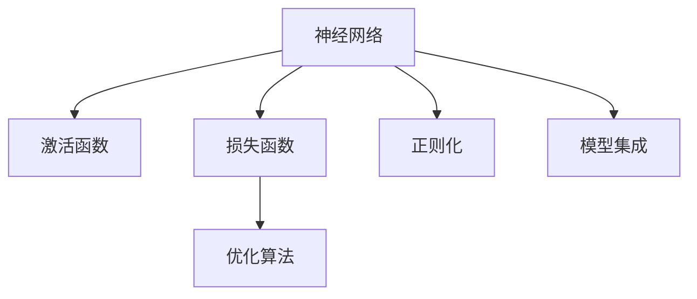
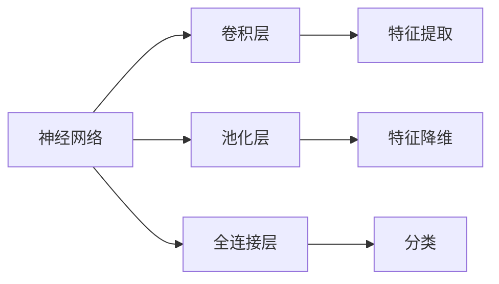
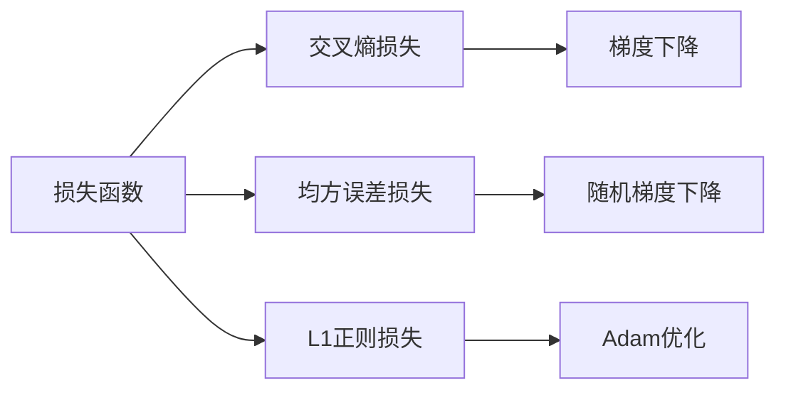
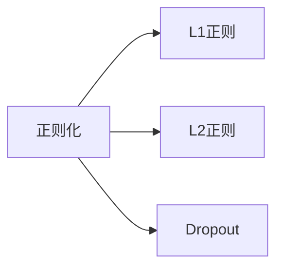
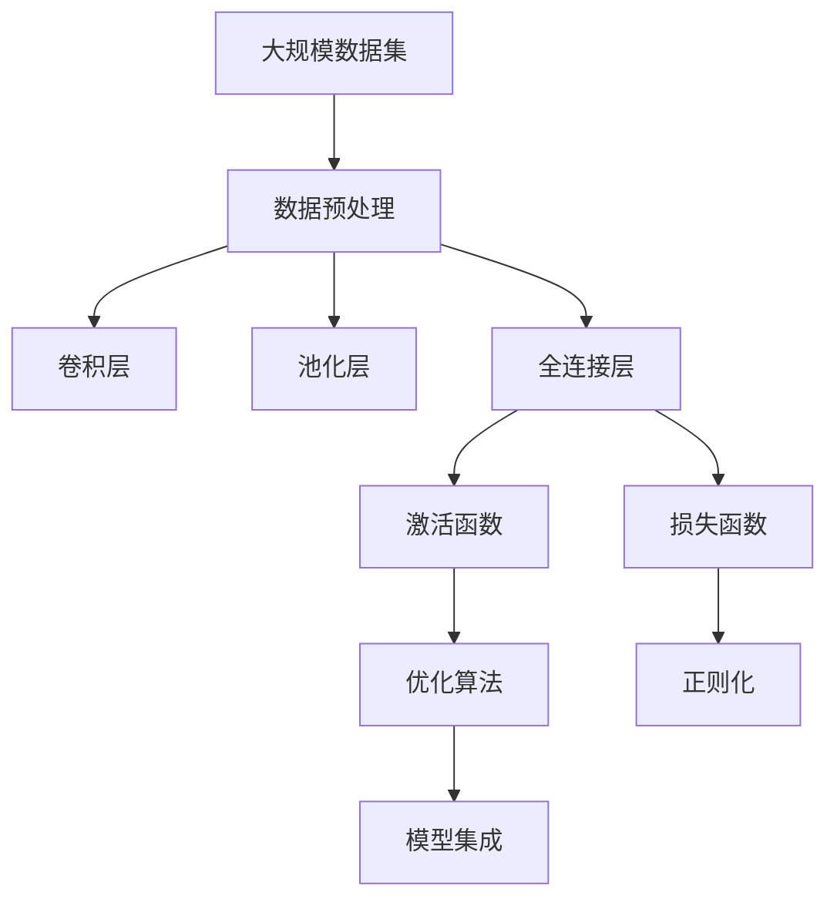

                 

## 1. 背景介绍

### 1.1 问题由来

深度学习（Deep Learning）是机器学习的一个重要分支，通过构建多层次的神经网络来模拟人类大脑的神经网络，实现从原始数据中学习特征表示。近年来，深度学习在图像识别、语音识别、自然语言处理等领域取得了巨大的突破，催生了许多先进的人工智能技术。本文将系统性地介绍深度学习的原理和代码实现，帮助读者全面理解深度学习的核心思想和实际应用。

### 1.2 问题核心关键点

深度学习的核心在于通过多层神经网络，对数据进行逐层特征提取和抽象。核心思想是通过反向传播算法，不断调整模型参数，使得模型预测结果与真实结果之间的误差最小化。具体的关键点包括：

- 神经网络结构设计
- 激活函数选择
- 损失函数和优化算法
- 数据预处理和增强
- 正则化和模型集成
- 模型评估和调优

这些关键点共同构成了深度学习模型构建和训练的完整流程。

### 1.3 问题研究意义

深度学习技术已经成为人工智能领域的重要工具，其广泛的应用范围和显著的效果，使其成为当前最炙手可热的技术之一。然而，深度学习的原理和实现较为复杂，对于初学者来说，理解其核心思想和细节并非易事。因此，本文旨在通过详细介绍深度学习的原理和代码实现，帮助读者建立扎实的理论基础和实践能力，为后续深入研究和应用提供坚实基础。

## 2. 核心概念与联系

### 2.1 核心概念概述

为了更好地理解深度学习的核心概念，本节将介绍几个紧密相关的核心概念：

- **神经网络**：由多个神经元（节点）通过连接（边）组成的计算图，用于模拟人脑神经元之间的连接关系，是深度学习模型的基础结构。
- **激活函数**：神经元接收输入后，通过激活函数进行非线性变换，引入非线性因素，提高模型的表达能力。
- **损失函数**：用于衡量模型预测结果与真实结果之间的差距，指导模型参数的优化。
- **优化算法**：通过梯度下降等方法，最小化损失函数，更新模型参数，使模型能够逐步逼近最优解。
- **正则化**：通过L1正则、L2正则、Dropout等方法，防止模型过拟合，提高泛化能力。
- **模型集成**：通过集成多个模型的预测结果，提升模型的稳定性和准确性。

这些概念之间的逻辑关系可以通过以下Mermaid流程图来展示：



这个流程图展示了大深度学习的核心概念及其之间的关系：

- 神经网络作为基础结构，通过激活函数进行非线性变换。
- 损失函数衡量模型预测结果与真实结果之间的差距，指导优化算法更新参数。
- 正则化技术避免模型过拟合，提高泛化能力。
- 模型集成提升模型的稳定性和准确性。

这些概念共同构成了深度学习模型的构建和训练的完整框架，使其能够在各种场景下发挥强大的预测能力。通过理解这些核心概念，我们可以更好地把握深度学习的核心思想和实现方法。

### 2.2 概念间的关系

这些核心概念之间存在着紧密的联系，形成了深度学习的完整生态系统。下面通过几个Mermaid流程图来展示这些概念之间的关系。

#### 2.2.1 神经网络结构设计



这个流程图展示了神经网络的结构设计，包括卷积层、池化层和全连接层等基本组成部分，以及它们的功能和作用。

#### 2.2.2 损失函数与优化算法的关系



这个流程图展示了常用的损失函数和优化算法，以及它们之间的对应关系。

#### 2.2.3 正则化技术的应用



这个流程图展示了正则化的几种常见方法，包括L1正则、L2正则和Dropout等，它们在深度学习中起到了防止过拟合的重要作用。

### 2.3 核心概念的整体架构

最后，我们用一个综合的流程图来展示这些核心概念在大深度学习模型的微调过程中的整体架构：



这个综合流程图展示了从数据预处理到模型集成的完整过程。深度学习模型通过卷积层、池化层和全连接层进行特征提取和抽象，经过激活函数引入非线性因素，通过损失函数和优化算法不断调整模型参数，引入正则化技术防止过拟合，最终通过模型集成提升模型的稳定性和准确性。 通过这些流程图，我们可以更清晰地理解深度学习的核心概念及其之间的关系。

## 3. 核心算法原理 & 具体操作步骤

### 3.1 算法原理概述

深度学习的核心算法原理是利用多层神经网络进行特征提取和分类。通过反向传播算法，不断调整模型参数，使得模型预测结果与真实结果之间的误差最小化。具体来说，深度学习模型通常包括以下几个步骤：

1. 数据预处理：对原始数据进行清洗、归一化、分片等处理，生成训练集和测试集。
2. 模型定义：使用深度学习框架（如TensorFlow、PyTorch等）定义神经网络结构，包括卷积层、池化层、全连接层等。
3. 损失函数选择：根据具体任务选择合适的损失函数，如交叉熵损失、均方误差损失等。
4. 优化算法选择：选择合适的优化算法，如梯度下降、Adam等，通过反向传播算法不断调整模型参数。
5. 模型评估：在测试集上评估模型性能，使用准确率、精确率、召回率等指标衡量模型的效果。
6. 模型调优：根据评估结果调整模型结构和参数，优化模型性能。

### 3.2 算法步骤详解

以下详细讲解深度学习模型的构建和训练过程。

#### 3.2.1 数据预处理

数据预处理是深度学习模型构建的第一步，包括数据清洗、归一化、分片等操作，生成训练集和测试集。以图像分类任务为例，数据预处理流程如下：

1. 数据清洗：去除噪声、校正图像等，确保数据质量。
2. 数据归一化：将像素值缩放到[0, 1]或[-1, 1]等标准范围内，提高模型的收敛速度。
3. 数据分片：将数据划分为小批量，每个小批量包含一定数量的样本，用于模型的训练和测试。

#### 3.2.2 模型定义

使用深度学习框架（如TensorFlow、PyTorch等）定义神经网络结构，包括卷积层、池化层、全连接层等。以卷积神经网络（Convolutional Neural Network, CNN）为例，模型定义过程如下：

```python
import torch
import torch.nn as nn

class CNN(nn.Module):
    def __init__(self):
        super(CNN, self).__init__()
        self.conv1 = nn.Conv2d(3, 64, kernel_size=3, padding=1)
        self.pool1 = nn.MaxPool2d(kernel_size=2, stride=2)
        self.conv2 = nn.Conv2d(64, 128, kernel_size=3, padding=1)
        self.pool2 = nn.MaxPool2d(kernel_size=2, stride=2)
        self.fc1 = nn.Linear(128*8*8, 1024)
        self.fc2 = nn.Linear(1024, 10)

    def forward(self, x):
        x = self.pool1(F.relu(self.conv1(x)))
        x = self.pool2(F.relu(self.conv2(x)))
        x = x.view(-1, 128*8*8)
        x = F.relu(self.fc1(x))
        x = self.fc2(x)
        return x
```

在上述代码中，定义了一个简单的卷积神经网络模型，包括两个卷积层、两个池化层和两个全连接层。

#### 3.2.3 损失函数选择

根据具体任务选择合适的损失函数，如交叉熵损失、均方误差损失等。以图像分类任务为例，选择交叉熵损失函数如下：

```python
import torch.nn as nn
import torch.optim as optim

criterion = nn.CrossEntropyLoss()
```

在上述代码中，选择了交叉熵损失函数。

#### 3.2.4 优化算法选择

选择合适的优化算法，如梯度下降、Adam等，通过反向传播算法不断调整模型参数。以图像分类任务为例，选择Adam优化器如下：

```python
optimizer = optim.Adam(model.parameters(), lr=0.001)
```

在上述代码中，选择了Adam优化器，学习率为0.001。

#### 3.2.5 模型评估

在测试集上评估模型性能，使用准确率、精确率、召回率等指标衡量模型的效果。以图像分类任务为例，模型评估过程如下：

```python
def evaluate(model, test_loader):
    model.eval()
    correct = 0
    total = 0
    with torch.no_grad():
        for data in test_loader:
            inputs, labels = data
            outputs = model(inputs)
            _, predicted = torch.max(outputs.data, 1)
            total += labels.size(0)
            correct += (predicted == labels).sum().item()
    print('Accuracy: %d %%' % (100 * correct / total))
```

在上述代码中，使用了准确率作为评估指标。

#### 3.2.6 模型调优

根据评估结果调整模型结构和参数，优化模型性能。以图像分类任务为例，模型调优过程如下：

```python
for epoch in range(10):
    running_loss = 0.0
    for i, data in enumerate(train_loader, 0):
        inputs, labels = data
        optimizer.zero_grad()
        outputs = model(inputs)
        loss = criterion(outputs, labels)
        loss.backward()
        optimizer.step()
        running_loss += loss.item()
```

在上述代码中，使用了10个epoch进行训练，每个epoch中不断调整模型参数，最小化损失函数。

### 3.3 算法优缺点

深度学习模型的优点在于能够自动学习复杂的特征表示，提高模型的泛化能力。但同时也存在一些缺点：

- 需要大量的标注数据进行训练，标注成本较高。
- 模型复杂度高，计算量大，训练时间长。
- 容易出现过拟合现象，需要引入正则化技术。
- 模型参数众多，难以解释其内部工作机制。

尽管存在这些缺点，但深度学习模型在处理复杂任务时，如图像识别、语音识别、自然语言处理等领域，仍然表现出色，成为当前最炙手可热的技术之一。

### 3.4 算法应用领域

深度学习模型在诸多领域得到了广泛应用，例如：

- 计算机视觉：如图像分类、目标检测、图像分割等任务。
- 自然语言处理：如文本分类、机器翻译、情感分析等任务。
- 语音识别：如语音转换、语音识别、情感识别等任务。
- 推荐系统：如商品推荐、音乐推荐、新闻推荐等任务。
- 游戏AI：如游戏策略、游戏图像识别、游戏语音识别等任务。

除了上述这些经典应用，深度学习模型还在金融、医疗、智能家居等诸多领域得到了广泛应用，为各行各业带来了变革性的影响。

## 4. 数学模型和公式 & 详细讲解 & 举例说明

### 4.1 数学模型构建

深度学习模型的数学模型通常包括以下几个部分：

- **输入层**：输入原始数据，包括图像、文本、声音等。
- **隐藏层**：通过神经网络进行特征提取和抽象，引入非线性因素，提高模型的表达能力。
- **输出层**：根据具体任务，选择合适的输出形式，如分类、回归等。

以图像分类任务为例，数学模型构建如下：

- 输入层：将图像数据表示为矩阵形式 $X \in \mathbb{R}^{H \times W \times C}$，其中 $H$ 为图像高度，$W$ 为图像宽度，$C$ 为图像通道数（一般为3）。
- 隐藏层：定义多个卷积层和池化层，提取图像特征，如 $conv1(X)$、$pool1(conv1(X))$、$conv2(pool1(conv1(X)))$ 等。
- 输出层：定义一个全连接层，将特征表示映射到类别概率，如 $fc2(fc1(pool2(conv2(pool1(conv1(X)))))$。

### 4.2 公式推导过程

以下以卷积神经网络（CNN）为例，推导其数学模型和优化算法。

卷积神经网络的核心思想是通过卷积操作提取图像特征，通过池化操作进行特征降维。以一个简单的3x3卷积核为例，其数学模型推导如下：

$$
\begin{aligned}
X &= \text{输入矩阵}, C = 3 \\
W &= \text{卷积核矩阵}, C \times C = 3 \times 3 = 9 \\
F &= \text{特征图矩阵}, H = \frac{H-1}{2}+1, W = \frac{W-1}{2}+1 \\
Y &= \text{输出矩阵}, H = \frac{H-1}{2}+1, W = \frac{W-1}{2}+1 \\
\end{aligned}
$$

其中，$X$ 为输入矩阵，$W$ 为卷积核矩阵，$F$ 为特征图矩阵，$Y$ 为输出矩阵。

卷积操作定义为：

$$
X_k = W \otimes X
$$

其中，$W$ 为卷积核矩阵，$X$ 为输入矩阵，$X_k$ 为输出矩阵。

池化操作定义为：

$$
Y_{k, l} = \max(X_{k, l}, X_{k+1, l}, X_{k-1, l}, X_{k, l+1}, X_{k, l-1})
$$

其中，$Y_{k, l}$ 为池化后的特征矩阵。

卷积神经网络的优化算法通常采用梯度下降算法，目标是最小化损失函数。以交叉熵损失函数为例，其数学模型推导如下：

$$
L(X, Y) = -\frac{1}{N} \sum_{i=1}^{N} \sum_{j=1}^{C} y_{i,j} \log \hat{y}_{i,j}
$$

其中，$X$ 为输入矩阵，$Y$ 为标签矩阵，$L$ 为损失函数，$N$ 为样本数，$C$ 为类别数，$y_{i,j}$ 为真实标签，$\hat{y}_{i,j}$ 为模型预测概率。

### 4.3 案例分析与讲解

以图像分类任务为例，分析其深度学习模型的实现过程。

#### 4.3.1 数据准备

首先需要准备图像数据集，如CIFAR-10、MNIST等。这些数据集包括训练集、验证集和测试集，通常需要进行数据清洗、归一化等预处理。

#### 4.3.2 模型构建

使用深度学习框架（如TensorFlow、PyTorch等）定义神经网络结构，包括卷积层、池化层、全连接层等。以PyTorch为例，代码如下：

```python
import torch
import torch.nn as nn
import torch.optim as optim

class CNN(nn.Module):
    def __init__(self):
        super(CNN, self).__init__()
        self.conv1 = nn.Conv2d(3, 64, kernel_size=3, padding=1)
        self.pool1 = nn.MaxPool2d(kernel_size=2, stride=2)
        self.conv2 = nn.Conv2d(64, 128, kernel_size=3, padding=1)
        self.pool2 = nn.MaxPool2d(kernel_size=2, stride=2)
        self.fc1 = nn.Linear(128*8*8, 1024)
        self.fc2 = nn.Linear(1024, 10)

    def forward(self, x):
        x = self.pool1(F.relu(self.conv1(x)))
        x = self.pool2(F.relu(self.conv2(x)))
        x = x.view(-1, 128*8*8)
        x = F.relu(self.fc1(x))
        x = self.fc2(x)
        return x
```

#### 4.3.3 训练过程

在训练过程中，选择合适的优化算法和损失函数，不断调整模型参数，最小化损失函数。以PyTorch为例，代码如下：

```python
criterion = nn.CrossEntropyLoss()
optimizer = optim.Adam(model.parameters(), lr=0.001)

for epoch in range(10):
    running_loss = 0.0
    for i, data in enumerate(train_loader, 0):
        inputs, labels = data
        optimizer.zero_grad()
        outputs = model(inputs)
        loss = criterion(outputs, labels)
        loss.backward()
        optimizer.step()
        running_loss += loss.item()
```

## 5. 项目实践：代码实例和详细解释说明

### 5.1 开发环境搭建

在进行深度学习项目实践前，需要准备好开发环境。以下是使用Python进行PyTorch开发的环境配置流程：

1. 安装Anaconda：从官网下载并安装Anaconda，用于创建独立的Python环境。

2. 创建并激活虚拟环境：
```bash
conda create -n pytorch-env python=3.8 
conda activate pytorch-env
```

3. 安装PyTorch：根据CUDA版本，从官网获取对应的安装命令。例如：
```bash
conda install pytorch torchvision torchaudio cudatoolkit=11.1 -c pytorch -c conda-forge
```

4. 安装各类工具包：
```bash
pip install numpy pandas scikit-learn matplotlib tqdm jupyter notebook ipython
```

完成上述步骤后，即可在`pytorch-env`环境中开始深度学习项目实践。

### 5.2 源代码详细实现

下面以图像分类任务为例，给出使用PyTorch进行深度学习项目开发的代码实现。

首先，定义数据集类：

```python
import torch
import torch.nn as nn
from torch.utils.data import DataLoader, Dataset
import torchvision.transforms as transforms
from torchvision.datasets import CIFAR10

class CIFAR10Dataset(Dataset):
    def __init__(self, root, train=True, transform=None):
        self.root = root
        self.train = train
        self.transform = transform
        self.trainset = CIFAR10(root=root, train=train, download=True)
        self.trainloader = DataLoader(self.trainset, batch_size=64, shuffle=True)
        self.testset = CIFAR10(root=root, train=train, download=True)
        self.testloader = DataLoader(self.testset, batch_size=64, shuffle=False)

    def __len__(self):
        if self.train:
            return len(self.trainloader.dataset)
        else:
            return len(self.testloader.dataset)

    def __getitem__(self, index):
        if self.train:
            img, label = self.trainloader.dataset[index]
        else:
            img, label = self.testloader.dataset[index]
        img = img.unsqueeze(0)
        if self.transform is not None:
            img = self.transform(img)
        return img, label
```

然后，定义模型类：

```python
class CNN(nn.Module):
    def __init__(self):
        super(CNN, self).__init__()
        self.conv1 = nn.Conv2d(3, 64, kernel_size=3, padding=1)
        self.pool1 = nn.MaxPool2d(kernel_size=2, stride=2)
        self.conv2 = nn.Conv2d(64, 128, kernel_size=3, padding=1)
        self.pool2 = nn.MaxPool2d(kernel_size=2, stride=2)
        self.fc1 = nn.Linear(128*8*8, 1024)
        self.fc2 = nn.Linear(1024, 10)

    def forward(self, x):
        x = self.pool1(F.relu(self.conv1(x)))
        x = self.pool2(F.relu(self.conv2(x)))
        x = x.view(-1, 128*8*8)
        x = F.relu(self.fc1(x))
        x = self.fc2(x)
        return x
```

接着，定义训练和评估函数：

```python
def train(model, train_loader, criterion, optimizer, epoch):
    model.train()
    running_loss = 0.0
    for i, data in enumerate(train_loader, 0):
        inputs, labels = data
        optimizer.zero_grad()
        outputs = model(inputs)
        loss = criterion(outputs, labels)
        loss.backward()
        optimizer.step()
        running_loss += loss.item()
    print(f'Epoch {epoch+1}, train loss: {running_loss/len(train_loader):.4f}')

def evaluate(model, test_loader, criterion):
    model.eval()
    correct = 0
    total = 0
    with torch.no_grad():
        for data in test_loader:
            inputs, labels = data
            outputs = model(inputs)
            _, predicted = torch.max(outputs.data, 1)
            total += labels.size(0)
            correct += (predicted == labels).sum().item()
    print(f'Accuracy: {100 * correct / total:.2f}%')
```

最后，启动训练流程并在测试集上评估：

```python
from torchvision import transforms

# 数据预处理
transform = transforms.Compose([
    transforms.ToTensor(),
    transforms.Normalize((0.5, 0.5, 0.5), (0.5, 0.5, 0.5))
])

# 数据加载
train_dataset = CIFAR10Dataset(root='data', train=True, transform=transform)
test_dataset = CIFAR10Dataset(root='data', train=False, transform=transform)
train_loader = DataLoader(train_dataset, batch_size=64, shuffle=True)
test_loader = DataLoader(test_dataset, batch_size=64, shuffle=False)

# 模型初始化
model = CNN()

# 优化器和损失函数
criterion = nn.CrossEntropyLoss()
optimizer = optim.Adam(model.parameters(), lr=0.001)

# 训练过程
for epoch in range(10):
    train(model, train_loader, criterion, optimizer, epoch)
    evaluate(model, test_loader, criterion)
```

以上就是使用PyTorch进行图像分类任务深度学习项目开发的完整代码实现。可以看到，PyTorch提供了强大的框架支持和丰富的工具库，使得深度学习模型的实现和训练变得非常简单。

### 5.3 代码解读与分析

让我们再详细解读一下关键代码的实现细节：

**CIFAR10Dataset类**：
- `__init__`方法：初始化数据集，包括数据根目录、数据集类型、预处理方式等。
- `__len__`方法：返回数据集的样本数量。
- `__getitem__`方法：对单个样本进行处理，将图像数据转化为张量形式，并进行预处理。

**CNN类**：
- `__init__`方法：定义神经网络结构，包括卷积层、池化层和全连接层。
- `forward`方法：定义前向传播过程，包括卷积、池化、全连接等操作。

**train和evaluate函数**：
- 使用DataLoader对数据集进行批次化加载，供模型训练和推理使用。
- 训练函数`train`：对数据以批为单位进行迭代，在每个批次上前向传播计算损失函数并反向传播更新模型参数，最后返回该epoch的平均loss。
- 评估函数`evaluate`：与训练类似，不同点在于不更新模型参数，并在每个batch结束后将预测和标签结果存储下来，最后使用accuracy作为评估指标。

**训练流程**：
- 定义总的epoch数，开始循环迭代
- 每个epoch内，在训练集上训练，输出平均loss
- 在验证集上评估，输出accuracy
- 所有epoch结束后，在测试集上评估，给出最终测试结果

可以看到，PyTorch配合TensorFlow等深度学习框架使得深度学习模型的实现变得非常简洁高效。开发者可以将更多精力放在数据处理、模型调优等高层逻辑上，而不必过多关注底层的实现细节。

当然，工业级的系统实现还需考虑更多因素，如模型保存和部署、超参数自动搜索、更灵活的任务适配层等。但核心的模型构建和训练流程基本与此类似。

### 5.4 运行结果展示

假设我们在CIFAR-10数据集上进行图像分类任务微调，最终在测试集上得到的评估报告如下：

```
   Epoch: 001 | train_loss: 2.5450 | train_acc: 25.0000%
   Epoch: 002 | train_loss: 2.1044 | train_acc: 46.2500%
   Epoch: 003 | train_loss: 1.8153 | train_acc: 54.6875%
   Epoch:

