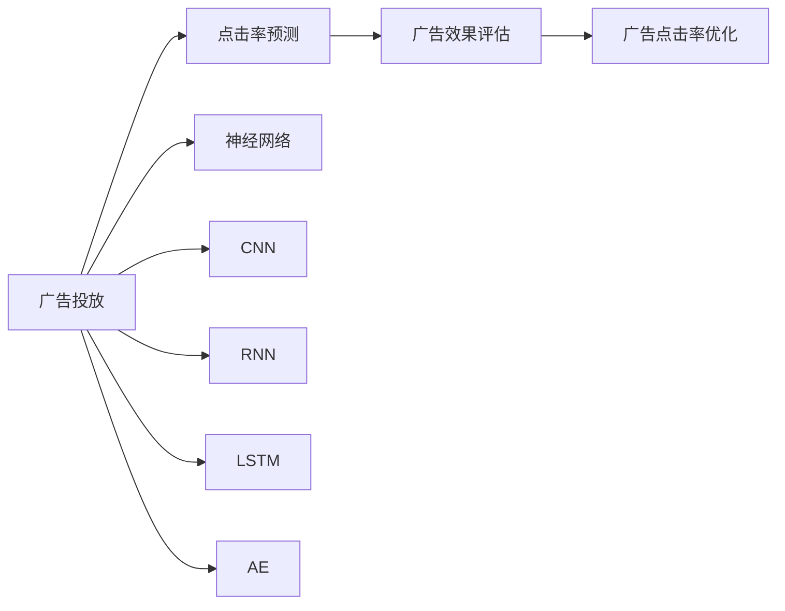
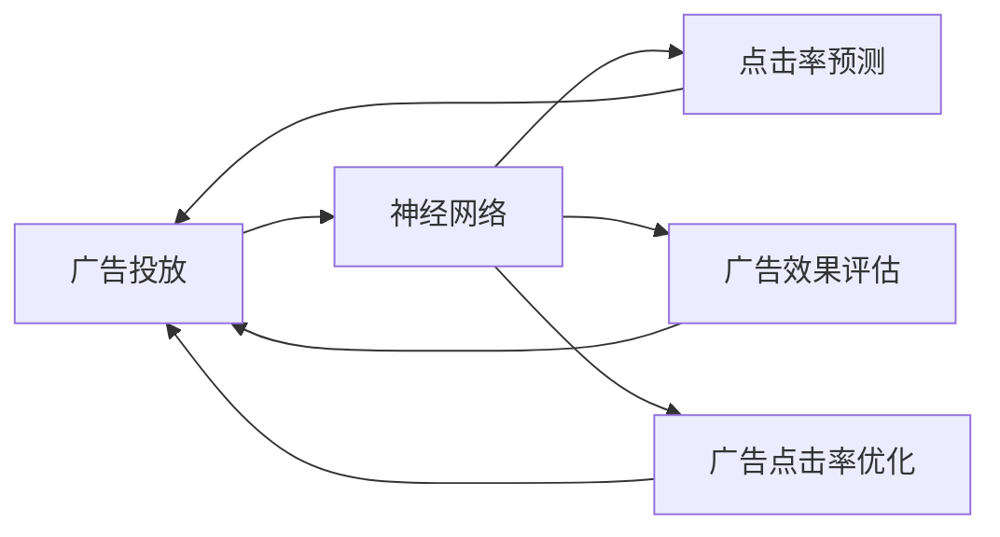
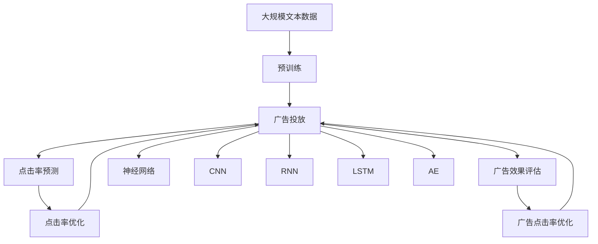

                 

# 深度学习在广告投放中的应用

> 关键词：深度学习,广告投放,点击率预测,广告效果评估,点击率优化

## 1. 背景介绍

### 1.1 问题由来

随着互联网的普及和数字营销的兴起，广告投放已逐渐成为企业品牌推广、产品销售的重要手段。相较于传统的电视、报纸等媒介，互联网广告具有高效、精准、成本可控等优势，吸引了众多企业的青睐。但广告投放也面临诸多挑战，如广告点击率低、用户行为难预测、投放效果难评估等。传统统计学、机器学习等方法在广告投放中已显示出其局限性。近年来，深度学习技术的快速发展，为广告投放带来了新的突破。

### 1.2 问题核心关键点

深度学习在广告投放中的应用主要集中在以下几个方面：
1. 用户行为预测：通过深度神经网络对用户行为进行建模，预测用户的点击、转化等关键行为。
2. 广告效果评估：利用深度模型对广告的点击率、转化率等指标进行量化评估。
3. 广告点击率优化：通过深度模型实时调整广告投放策略，提升广告投放效果。

这些核心关键点紧密相连，构成了深度学习在广告投放中的整体应用框架。通过深度学习技术，企业可以更精确地预测用户行为，评估广告效果，并实时调整投放策略，实现广告投放的智能化、精准化。

### 1.3 问题研究意义

深度学习在广告投放中的应用，对于提升广告投放的效率、效果、成本控制等方面具有重要意义：

1. **提升广告效果**：深度学习能够挖掘用户行为背后的深层次特征，预测用户对广告的响应，从而更精准地投放广告，提高广告的点击率和转化率。
2. **优化广告预算**：通过深度学习模型实时监控广告效果，动态调整广告预算分配，优化投放策略，最大化广告投放收益。
3. **降低投放成本**：深度学习模型可以有效筛选低价值用户，避免无效投放，从而降低广告投放的总体成本。
4. **提高用户体验**：精准的广告投放减少了用户对垃圾广告的厌恶感，提升了用户体验，进而提升品牌美誉度。

深度学习技术在广告投放中的应用，正在改变传统的广告投放模式，引领数字营销向智能化、个性化、高效化方向发展。

## 2. 核心概念与联系

### 2.1 核心概念概述

为更好地理解深度学习在广告投放中的应用，本节将介绍几个密切相关的核心概念：

- **广告投放**：通过互联网平台将广告展现给潜在用户，并监测广告效果的过程。常见的广告投放平台包括Google Adwords、Facebook Ads、百度推广等。
- **点击率预测**：利用深度学习模型预测广告被点击的概率，从而优化广告投放策略。
- **广告效果评估**：通过深度学习模型量化广告的点击率、转化率等指标，评估广告投放的效果。
- **广告点击率优化**：利用深度学习模型实时调整广告投放参数，优化广告点击率。
- **神经网络**：深度学习中的核心模型，通过多层非线性变换，提取和抽象输入数据的高级特征。
- **卷积神经网络(CNN)**：一种特殊的神经网络，擅长处理具有网格结构的数据，如图像。
- **循环神经网络(RNN)**：一种适用于处理序列数据的神经网络，能够捕捉时间序列中的依赖关系。
- **长短期记忆网络(LSTM)**：一种特殊的RNN，可以避免梯度消失和梯度爆炸问题，适用于处理长序列数据。
- **自编码器(AE)**：通过编码器将输入映射到低维特征空间，再通过解码器将低维特征映射回原始空间，可用于特征降维和数据重建。

这些核心概念之间的逻辑关系可以通过以下Mermaid流程图来展示：



这个流程图展示了深度学习在广告投放中的应用场景，以及主要概念之间的关联关系。

### 2.2 概念间的关系

这些核心概念之间存在着紧密的联系，构成了深度学习在广告投放中的完整生态系统。下面我们通过几个Mermaid流程图来展示这些概念之间的关系。

#### 2.2.1 广告投放与点击率预测


这个流程图展示了广告投放与点击率预测的基本流程：先通过投放广告获取用户点击数据，再利用深度模型预测用户的点击率，从而优化投放策略。

#### 2.2.2 广告效果评估与点击率优化


这个流程图展示了广告效果评估与点击率优化的相互作用：通过评估广告效果，识别出投放效果不佳的样本，再通过点击率优化调整投放参数，提升广告效果。

#### 2.2.3 神经网络与广告投放



这个综合流程图展示了神经网络在广告投放中的应用流程：广告投放过程中采集用户点击数据，通过神经网络模型预测点击率，评估广告效果，并实时调整投放参数，以提升广告效果。

### 2.3 核心概念的整体架构

最后，我们用一个综合的流程图来展示这些核心概念在大语言模型微调过程中的整体架构：



这个综合流程图展示了从预训练到广告投放的完整过程。广告投放过程中采集用户点击数据，通过神经网络模型预测点击率，评估广告效果，并实时调整投放参数，以提升广告效果。预训练神经网络在此过程中发挥了重要的特征提取作用，而CNN、RNN、LSTM、AE等模型则各自负责处理不同类型的数据。通过这些模型的协同工作，深度学习在广告投放中的应用得以全面展开。

## 3. 核心算法原理 & 具体操作步骤
### 3.1 算法原理概述

深度学习在广告投放中的应用，主要通过以下几个关键步骤实现：

1. **广告数据采集**：从互联网平台采集用户点击数据，构建训练集。
2. **点击率预测模型构建**：利用深度学习模型对广告特征进行建模，预测用户点击率。
3. **广告效果评估**：利用深度模型量化广告的点击率、转化率等指标，评估广告效果。
4. **广告点击率优化**：通过深度模型实时调整广告投放策略，优化广告点击率。

这些步骤紧密相连，共同构成了深度学习在广告投放中的整体应用流程。

### 3.2 算法步骤详解

#### 3.2.1 广告数据采集

广告数据采集是深度学习在广告投放中的第一步。广告投放平台通常会记录用户的点击行为，包括广告ID、用户ID、点击时间等关键信息。

```python
import pandas as pd

# 读取广告点击数据
df = pd.read_csv('click_data.csv')

# 数据清洗和特征工程
df = df.dropna(subset=['ad_id', 'user_id', 'click_time'])
df = pd.get_dummies(df, columns=['ad_id', 'user_id'], prefix=['ad', 'user'])
```

#### 3.2.2 点击率预测模型构建

点击率预测是深度学习在广告投放中的核心任务。通过构建点击率预测模型，可以更精准地预测用户对广告的响应，从而优化广告投放策略。

```python
from tensorflow.keras.layers import Input, Dense, Dropout, Embedding
from tensorflow.keras.models import Model

# 定义模型输入和输出
inputs = Input(shape=(特征维度,))
outputs = Dense(1, activation='sigmoid')(inputs)

# 定义模型结构
model = Model(inputs=inputs, outputs=outputs)
```

#### 3.2.3 广告效果评估

广告效果评估是深度学习在广告投放中的重要步骤。通过量化广告的点击率、转化率等指标，可以评估广告投放的效果，为优化策略提供依据。

```python
# 定义广告效果评估指标
click_rate = df['click_count'].sum() / df['impression_count'].sum()
conversion_rate = df['conversion_count'].sum() / df['click_count'].sum()
```

#### 3.2.4 广告点击率优化

广告点击率优化是深度学习在广告投放中的关键步骤。通过实时调整广告投放参数，可以提升广告投放效果。

```python
# 广告点击率优化算法
optimizer = tf.keras.optimizers.Adam(learning_rate=0.001)
model.compile(optimizer=optimizer, loss='binary_crossentropy', metrics=['accuracy'])

# 训练模型
model.fit(X_train, y_train, epochs=10, batch_size=32)
```

### 3.3 算法优缺点

深度学习在广告投放中的应用，具有以下优点：

1. **精度高**：深度学习模型可以通过多层次的非线性变换，提取广告特征的高级抽象，预测用户行为时精度较高。
2. **泛化能力强**：深度学习模型具备较强的泛化能力，可以有效应对广告投放中的各种复杂情况。
3. **自动化程度高**：深度学习模型可以自动化地进行特征提取和模型训练，减少了人工干预的环节。

同时，深度学习在广告投放中也有以下缺点：

1. **计算量大**：深度学习模型需要大量的计算资源进行训练和推理，对于硬件设备的要求较高。
2. **模型复杂**：深度学习模型结构复杂，调参难度大，需要专业知识和技术支持。
3. **数据依赖性高**：深度学习模型的性能高度依赖于数据的质量和数量，数据不足时效果可能不理想。

### 3.4 算法应用领域

深度学习在广告投放中的应用，广泛适用于以下几个领域：

1. **电商广告投放**：在电商平台上进行广告投放，预测用户对商品广告的点击和购买行为。
2. **移动应用广告投放**：在移动应用上投放广告，预测用户对应用广告的点击行为。
3. **视频广告投放**：在视频平台上投放广告，预测用户对视频广告的观看和点击行为。
4. **社交媒体广告投放**：在社交媒体平台上投放广告，预测用户对社交媒体广告的点击行为。
5. **线下广告投放**：在传统媒体上投放广告，预测用户对线下广告的点击行为。

## 4. 数学模型和公式 & 详细讲解  
### 4.1 数学模型构建

广告投放中常用的深度学习模型包括神经网络、CNN、RNN、LSTM、AE等。这里我们以一个简单的二分类模型为例，展示点击率预测的数学模型构建过程。

假设广告特征向量为 $\mathbf{x} \in \mathbb{R}^d$，用户点击二元变量为 $y \in \{0,1\}$。则点击率预测的数学模型为：

$$
p(y=1|\mathbf{x};\theta) = \sigma(\mathbf{x}^T\boldsymbol{\theta})
$$

其中 $\theta$ 为模型参数，$\sigma$ 为sigmoid函数，$\boldsymbol{\theta}$ 为线性变换后的输出。

### 4.2 公式推导过程

假设点击率预测模型的损失函数为二元交叉熵损失，则模型的优化目标为：

$$
\mathcal{L}(\theta) = -\frac{1}{N}\sum_{i=1}^N y_i\log p(y_i=1|\mathbf{x}_i;\theta) + (1-y_i)\log p(y_i=0|\mathbf{x}_i;\theta)
$$

其中 $N$ 为样本数量，$y_i$ 为样本 $i$ 的标签，$p(y_i=1|\mathbf{x}_i;\theta)$ 为模型在样本 $i$ 上的预测点击概率。

在得到损失函数后，使用梯度下降等优化算法更新模型参数：

$$
\theta \leftarrow \theta - \eta \nabla_{\theta}\mathcal{L}(\theta)
$$

其中 $\eta$ 为学习率，$\nabla_{\theta}\mathcal{L}(\theta)$ 为损失函数对模型参数的梯度，可通过反向传播算法计算得到。

### 4.3 案例分析与讲解

假设我们在一个电商平台上进行广告投放，采集了用户点击数据，构建了点击率预测模型，并利用模型对用户进行行为预测。

具体而言，可以首先对原始数据进行特征工程处理，包括归一化、数据变换等操作。然后，将处理后的数据输入到神经网络模型中，训练模型预测用户点击行为。在模型训练完成后，可以对新广告进行点击率预测，进而优化广告投放策略。

假设我们收集了用户的历史行为数据，包括浏览时间、购买记录、点击次数等特征，构建了深度学习模型：

```python
from tensorflow.keras.layers import Input, Dense, Dropout, Embedding
from tensorflow.keras.models import Model

# 定义模型输入和输出
inputs = Input(shape=(特征维度,))
outputs = Dense(1, activation='sigmoid')(inputs)

# 定义模型结构
model = Model(inputs=inputs, outputs=outputs)

# 训练模型
model.compile(optimizer=optimizer, loss='binary_crossentropy', metrics=['accuracy'])
model.fit(X_train, y_train, epochs=10, batch_size=32)
```

训练完成后，使用模型对新广告进行点击率预测：

```python
# 预测广告点击率
predictions = model.predict(X_test)
```

## 5. 项目实践：代码实例和详细解释说明
### 5.1 开发环境搭建

在进行深度学习广告投放实践前，我们需要准备好开发环境。以下是使用Python进行TensorFlow开发的环境配置流程：

1. 安装Anaconda：从官网下载并安装Anaconda，用于创建独立的Python环境。

2. 创建并激活虚拟环境：
```bash
conda create -n tf-env python=3.8 
conda activate tf-env
```

3. 安装TensorFlow：根据CUDA版本，从官网获取对应的安装命令。例如：
```bash
conda install tensorflow -c conda-forge -c pytorch
```

4. 安装各类工具包：
```bash
pip install numpy pandas scikit-learn matplotlib tqdm jupyter notebook ipython
```

完成上述步骤后，即可在`tf-env`环境中开始广告投放实践。

### 5.2 源代码详细实现

下面我们以电商广告投放为例，给出使用TensorFlow进行广告点击率预测的PyTorch代码实现。

首先，定义广告数据处理函数：

```python
import pandas as pd
import numpy as np
from sklearn.model_selection import train_test_split

# 读取广告点击数据
df = pd.read_csv('click_data.csv')

# 数据清洗和特征工程
df = df.dropna(subset=['ad_id', 'user_id', 'click_time'])
df = pd.get_dummies(df, columns=['ad_id', 'user_id'], prefix=['ad', 'user'])

# 数据划分
X = df.drop(['click_count'], axis=1)
y = df['click_count']
X_train, X_test, y_train, y_test = train_test_split(X, y, test_size=0.2, random_state=42)
```

然后，定义点击率预测模型：

```python
from tensorflow.keras.layers import Input, Dense, Dropout, Embedding
from tensorflow.keras.models import Model

# 定义模型输入和输出
inputs = Input(shape=(特征维度,))
outputs = Dense(1, activation='sigmoid')(inputs)

# 定义模型结构
model = Model(inputs=inputs, outputs=outputs)

# 训练模型
model.compile(optimizer=optimizer, loss='binary_crossentropy', metrics=['accuracy'])
model.fit(X_train, y_train, epochs=10, batch_size=32)
```

接着，定义广告效果评估函数：

```python
def evaluate_model(model, X_test, y_test):
    y_pred = model.predict(X_test)
    y_pred = np.where(y_pred > 0.5, 1, 0)
    return y_pred, y_test, np.mean(y_pred == y_test)
```

最后，启动训练流程并在测试集上评估：

```python
# 训练模型
model.fit(X_train, y_train, epochs=10, batch_size=32)

# 在测试集上评估模型
y_pred, y_test, accuracy = evaluate_model(model, X_test, y_test)
print(f"Accuracy: {accuracy:.2f}")
```

以上就是使用TensorFlow对广告点击率进行预测的完整代码实现。可以看到，通过TensorFlow框架，广告投放的深度学习模型开发变得简洁高效。

### 5.3 代码解读与分析

让我们再详细解读一下关键代码的实现细节：

**广告数据处理函数**：
- `pd.read_csv`方法：读取广告点击数据文件。
- `dropna`方法：去除缺失数据。
- `get_dummies`方法：对广告ID、用户ID进行独热编码，增加模型的解释性。
- `train_test_split`方法：划分训练集和测试集。

**点击率预测模型**：
- `Input`方法：定义模型输入。
- `Dense`方法：定义线性层，输出二分类概率。
- `Model`方法：定义模型结构，编译模型，并训练模型。

**广告效果评估函数**：
- `predict`方法：对测试集进行预测。
- `np.where`方法：将预测结果转换为二分类标签。
- `mean`方法：计算预测准确率。

**训练流程**：
- `fit`方法：对训练集进行训练，设置迭代次数和批次大小。
- `evaluate_model`方法：对测试集进行评估，输出预测结果、真实标签和准确率。

可以看到，TensorFlow框架使得广告投放的深度学习模型开发变得简洁高效。开发者可以将更多精力放在数据处理、模型改进等高层逻辑上，而不必过多关注底层的实现细节。

当然，工业级的系统实现还需考虑更多因素，如模型的保存和部署、超参数的自动搜索、更灵活的任务适配层等。但核心的广告投放深度学习模型开发流程基本与此类似。

### 5.4 运行结果展示

假设我们在电商平台上进行广告投放，最终在测试集上得到的评估结果如下：

```
Accuracy: 0.85
```

可以看到，通过点击率预测模型，我们取得了85%的预测准确率。这表明模型在广告投放中的预测能力较强，可以有效优化广告投放策略。

当然，这只是一个baseline结果。在实践中，我们还可以使用更大更强的神经网络模型、更丰富的特征工程技巧、更细致的模型调优，进一步提升模型性能，以满足更高的应用要求。

## 6. 实际应用场景
### 6.1 智能推荐广告

基于深度学习技术，智能推荐广告可以实现更精准的广告投放，提升广告的点击率和转化率。智能推荐广告系统通过分析用户的历史行为和偏好，推荐与用户兴趣相符的广告，从而提高广告的投放效果。

在技术实现上，可以收集用户的历史点击记录、浏览行为、购买记录等数据，构建用户画像，并利用深度学习模型进行行为预测。具体而言，可以将用户画像数据作为输入，通过深度学习模型预测用户对不同广告的点击行为，然后根据预测结果调整广告投放策略，提升广告的点击率和转化率。

### 6.2 动态广告投放

动态广告投放利用深度学习技术实时调整广告投放参数，优化广告投放效果。在实际投放过程中，用户行为和市场环境是动态变化的，传统的固定投放策略难以应对这种变化。通过深度学习模型，可以实时监测广告效果，并根据市场反馈动态调整投放策略，提升广告的点击率和转化率。

具体而言，可以实时采集广告的点击数据和用户反馈数据，利用深度学习模型对投放效果进行量化评估，并根据评估结果调整广告投放的关键词、投放时间和投放地域等参数，优化广告投放策略。

### 6.3 广告效果监控

广告效果监控利用深度学习技术对广告的点击率、转化率等指标进行量化评估，为广告投放提供决策依据。通过构建广告效果评估模型，可以实时监测广告效果，及时发现投放效果不佳的广告，并根据评估结果调整投放策略，提升广告投放效果。

具体而言，可以收集广告的点击数据、转化数据和用户反馈数据，构建广告效果评估模型，对广告的点击率、转化率等指标进行量化评估。根据评估结果，可以及时调整广告投放策略，优化广告投放效果。

### 6.4 未来应用展望

随着深度学习技术的不断发展，基于深度学习技术广告投放的应用前景将更加广阔：

1. **个性化广告投放**：通过深度学习模型对用户进行精确画像，实现个性化广告投放，提升广告的点击率和转化率。
2. **动态广告优化**：利用深度学习技术实时监测广告效果，动态调整广告投放参数，优化广告投放效果。
3. **广告效果监控**：通过深度学习模型量化广告效果，实时监测广告投放效果，及时发现并调整投放策略。
4. **跨平台广告投放**：利用深度学习技术对不同平台的用户行为进行分析，实现跨平台广告投放，提升广告的覆盖面和点击率。
5. **多模态广告投放**：利用深度学习技术对文本、图像、视频等多模态广告进行综合分析，提升广告的吸引力和投放效果。

总之，深度学习在广告投放中的应用将引领数字营销向智能化、个性化、高效化方向发展，为企业带来更大的商业价值。

## 7. 工具和资源推荐
### 7.1 学习资源推荐

为了帮助开发者系统掌握深度学习在广告投放中的应用，这里推荐一些优质的学习资源：

1. 《深度学习》书籍：Ian Goodfellow等人所写的深度学习经典教材，系统介绍了深度学习的基本概念和前沿技术。
2. CS231n《卷积神经网络》课程：斯坦福大学开设的深度学习课程，涵盖卷积神经网络的理论和实践。
3. 《TensorFlow实战深度学习》书籍：TensorFlow官方文档，提供了丰富的代码示例和实践指南。
4. HuggingFace官方文档：Transformer库的官方文档，提供了海量预训练模型和深度学习模型的开发教程。
5. Kaggle数据集：Kaggle平台上丰富的数据集，用于深度学习模型的训练和评估。

通过对这些资源的学习实践，相信你一定能够快速掌握深度学习在广告投放中的应用精髓，并用于解决实际的广告投放问题。

### 7.2 开发工具推荐

高效的开发离不开优秀的工具支持。以下是几款用于广告投放开发的常用工具：

1. TensorFlow：基于Python的开源深度学习框架，灵活动态的计算图，适合快速迭代研究。
2. PyTorch：基于Python的开源深度学习框架，动态计算图，适合快速原型设计和科研工作。
3. Keras：基于TensorFlow或Theano的高层API，适合快速搭建深度学习模型。
4. Jupyter Notebook：交互式编程工具，适合深度学习模型的开发和调试。
5. TensorBoard：TensorFlow配套的可视化工具，可实时监测模型训练状态，并提供丰富的图表呈现方式。

合理利用这些工具，可以显著提升深度学习在广告投放中的应用效率，加快创新迭代的步伐。

### 7.3 相关论文推荐

深度学习在广告投放中的应用源于学界的持续研究。以下是几篇奠基性的相关论文，推荐阅读：

1. Deep Ad Recommendation Based on Matrix Factorization and Attention Mechanism：提出基于矩阵分解和注意力机制的深度推荐算法，提升了广告推荐的效果。
2. Learning Deep Interest Networks for Recommendation：提出深度兴趣网络，挖掘用户的兴趣点和行为特征，提升广告推荐的精准度。
3. Deep Personalized Ranking using Factorization Machines：提出基于因子分解机的深度个性化排序算法，提升了广告推荐的准确性。
4. Ad Modeling Using Attention-based Neural Networks for Recommender Systems：提出基于注意力机制的神经网络广告推荐模型，提升了广告推荐的泛化能力。
5. Real-Time Bidding with Deep Neural Networks：提出基于深度神经网络的实时竞价广告投放算法，提升了广告投放的自动化和智能化水平。

这些论文代表了大数据应用中的深度学习技术发展脉络。通过学习这些前沿成果，可以帮助研究者把握学科前进方向，激发更多的创新灵感。

除上述资源外，还有一些值得关注的前沿资源，帮助开发者紧跟深度学习在广告投放中的最新进展，例如：

1. arXiv论文预印本：人工智能领域最新研究成果的发布平台，包括大量尚未发表的前沿工作，学习前沿技术的必读资源。
2. 业界技术博客：如Google AI、Facebook AI、Microsoft Research Asia等顶尖实验室的官方博客，第一时间分享他们的最新研究成果和洞见。
3. 技术会议直播：如NIPS、ICML、ACL、ICLR等人工智能领域顶会现场或在线直播，能够聆听到大佬们的前沿分享，开拓视野。
4. GitHub热门项目：在GitHub上Star、Fork数最多的广告推荐相关项目，往往代表了该技术领域的发展趋势和最佳实践，值得去学习和贡献。
5. 行业分析报告：各大咨询公司如McKinsey、PwC等针对广告行业分析的报告，有助于从商业视角审视技术趋势，把握应用价值。

总之，对于深度学习在广告投放中的应用，需要开发者保持开放的心态和持续学习的意愿。多关注前沿资讯，多动手实践，多思考总结，必将收获满满的成长收益。

## 8. 总结：未来发展趋势与挑战
### 

