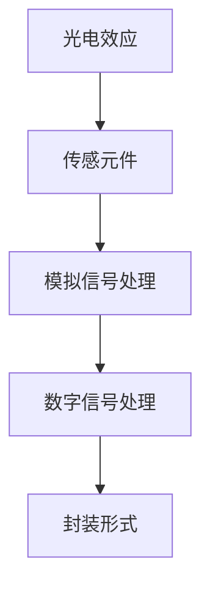

                 

# 物联网(IoT)技术和各种传感器设备的集成：光线传感器的使用案例

> 关键词：物联网,光线传感器,传感器集成,智能家居,自动照明系统,能源管理

## 1. 背景介绍

### 1.1 问题由来
随着物联网(IoT)技术的发展，各种传感器设备在智能家居、工业制造、农业监控、环境监测等领域得到了广泛应用。这些传感器设备可以采集环境数据，帮助人们做出更加智能化、精准的决策。光线传感器作为最常见的传感器之一，广泛应用于智能照明、自然光照测量、环境监测等多个场景。然而，光线传感器的使用仍然面临一些挑战，如准确性、可靠性、低成本等。本文将详细介绍光线传感器的基本原理，并探讨其在智能家居和自动照明系统中的应用案例，同时提出一些提高光线传感器性能和降低成本的可行方案。

### 1.2 问题核心关键点
光线传感器是利用光电效应将光信号转换为电信号的设备，广泛应用于智能家居和自动照明系统中。其核心关键点包括：

1. **传感原理**：光线传感器通过光电效应将光信号转换为电信号。
2. **传感精度**：光线传感器的精度直接影响其应用效果。
3. **安装位置**：光线传感器的安装位置和朝向对测量结果有很大影响。
4. **成本控制**：光线传感器的成本也是其应用的一个重要考量因素。
5. **应用场景**：光线传感器可以用于智能家居、自动照明、环境监测等多个场景。

这些关键点共同构成了光线传感器的核心应用范围和使用场景，是本文探讨的重点。

## 2. 核心概念与联系

### 2.1 核心概念概述

光线传感器（Light Sensor）是一种利用光电效应将光信号转换为电信号的传感器，广泛应用于自动照明、自然光照测量、环境监测等领域。其主要原理包括：

1. **光电效应**：当光线照射到光电材料上时，会产生电信号。
2. **传感元件**：光线传感器通常包括一个或多个光电元件，如光电二极管、光电晶体管等。
3. **模拟信号处理**：光线传感器的输出信号通常为模拟信号，需要通过模拟信号处理电路进行转换和放大。
4. **数字信号处理**：现代光线传感器多采用数字信号处理技术，可以直接输出数字信号，便于后续数据处理。
5. **封装形式**：光线传感器封装形式多样，有圆形、方形、半圆形等多种形式，适用于不同应用场景。

这些核心概念通过以下Mermaid流程图来展示：



### 2.2 概念间的关系

光线传感器的各个核心概念之间的关系如下：

1. **光电效应是光线传感器的基础**。光电效应是光线传感器将光信号转换为电信号的物理原理。
2. **传感元件是实现光电效应的关键**。传感元件是光线传感器中最重要的组件，负责将光信号转换为电信号。
3. **模拟信号处理和数字信号处理是对传感元件输出信号的进一步处理**。模拟信号处理电路可以将传感元件输出的模拟信号转换为更易处理的信号，而数字信号处理技术则直接输出数字信号。
4. **封装形式决定了光线传感器的物理形态和应用场景**。不同的封装形式适用于不同的安装和使用场景。

这些概念共同构成了光线传感器的整体工作原理，使其能够准确测量环境中的光线强度。

## 3. 核心算法原理 & 具体操作步骤
### 3.1 算法原理概述

光线传感器的核心算法原理主要基于光电效应，其基本步骤如下：

1. **光信号采集**：光线传感器接收环境中的光信号，并将其转换为电信号。
2. **信号放大**：光线传感器通常需要经过信号放大电路，将微弱的电信号放大，以便后续处理。
3. **模数转换**：现代光线传感器多采用数字信号处理技术，直接输出数字信号，便于后续数据处理。
4. **数据处理**：通过对传感器输出信号进行数据处理，可以获得环境中的光线强度、光照变化趋势等重要信息。

### 3.2 算法步骤详解

以下是一个光线传感器的工作流程示例：

1. **传感元件接收光信号**：光线传感器将接收到的光信号转换成电信号。
2. **模拟信号放大**：通过模拟信号放大电路，将微弱的电信号放大，以便后续处理。
3. **模数转换**：通过模数转换器（ADC）将模拟信号转换为数字信号。
4. **数据处理**：对数字信号进行处理，可以获取环境中的光线强度和变化趋势等信息。

### 3.3 算法优缺点

光线传感器的优点包括：

1. **高精度**：光线传感器可以测量到极微小的光线变化，适合用于环境监测和自然光照测量。
2. **易于安装**：光线传感器体积小，安装方便，适用于各种安装环境。
3. **快速响应**：现代光线传感器响应速度快，可以实时监测环境光照变化。

光线传感器的缺点包括：

1. **易受干扰**：光线传感器容易受到环境因素（如温度、湿度）的影响，测量结果可能存在误差。
2. **成本较高**：高精度光线传感器的成本较高，限制了其在某些应用场景中的普及。
3. **信号衰减**：光线传感器的信号可能会随着距离的增加而衰减，影响测量精度。

### 3.4 算法应用领域

光线传感器在多个领域得到了广泛应用，例如：

1. **智能家居**：光线传感器可以用于智能照明系统，根据环境光线自动调节灯光亮度。
2. **自动照明系统**：光线传感器可以用于自动化照明系统，根据环境光照变化自动控制照明设备。
3. **环境监测**：光线传感器可以用于环境监测，测量自然光照和环境光线变化，分析环境变化趋势。
4. **能源管理**：光线传感器可以用于能源管理系统，优化照明设备的使用，节约能源。

## 4. 数学模型和公式 & 详细讲解  
### 4.1 数学模型构建

光线传感器的数学模型可以通过模拟信号放大和模数转换两个步骤来构建：

1. **模拟信号放大模型**：假设传感元件输出的信号为 $v(t)$，经过放大电路后的信号为 $v_A(t)$，放大倍数为 $A$，则有：

   $$
   v_A(t) = A \cdot v(t)
   $$

2. **模数转换模型**：假设放大后的模拟信号为 $v_A(t)$，经过模数转换器后的数字信号为 $d(t)$，模数转换器的精度为 $D$，则有：

   $$
   d(t) = \frac{v_A(t)}{D}
   $$

结合上述两个模型，可以得到光线传感器的总体数学模型：

$$
d(t) = \frac{A \cdot v(t)}{D}
$$

### 4.2 公式推导过程

光线传感器的公式推导过程如下：

1. **传感元件输出信号**：假设传感元件接收的光信号为 $I(t)$，输出电信号为 $v(t)$，则有：

   $$
   v(t) = k \cdot I(t)
   $$

   其中 $k$ 为传感元件的光电转换系数。

2. **模拟信号放大**：假设放大倍数为 $A$，则放大后的信号为：

   $$
   v_A(t) = A \cdot v(t)
   $$

3. **模数转换**：假设放大后的模拟信号为 $v_A(t)$，模数转换器的精度为 $D$，则数字信号为：

   $$
   d(t) = \frac{v_A(t)}{D}
   $$

结合上述步骤，可以得到光线传感器的总体公式：

$$
d(t) = \frac{A \cdot k \cdot I(t)}{D}
$$

### 4.3 案例分析与讲解

假设我们有一个光线传感器，其传感元件的光电转换系数 $k=0.01$，放大倍数 $A=10$，模数转换器精度 $D=1$。如果传感元件接收的光信号 $I(t)$ 为 $1mW$，则数字信号 $d(t)$ 为：

$$
d(t) = \frac{10 \cdot 0.01 \cdot 1}{1} = 1
$$

## 5. 项目实践：代码实例和详细解释说明
### 5.1 开发环境搭建

进行光线传感器的项目实践，需要先搭建开发环境。以下是Python环境下的开发流程：

1. **安装Python和PySerial**：确保系统上已安装Python和PySerial库。

2. **安装传感器驱动程序**：根据所选光线传感器的类型，安装相应的驱动程序。

3. **编写代码**：编写Python代码，实现光线传感器的读取和处理。

4. **运行测试**：使用Arduino或其他开发板运行代码，测试光线传感器的读取和输出。

### 5.2 源代码详细实现

以下是Python代码示例，实现对光线传感器的读取和处理：

```python
import serial
import time

# 初始化串口
ser = serial.Serial('/dev/ttyUSB0', 9600)

# 读取光线传感器数据
while True:
    line = ser.readline()
    if line:
        # 解析数据
        data = line.split(':')
        if len(data) == 3:
            # 将数据转换为整数
            light_level = int(data[1], 16)
            print(f'当前光照强度：{light_level}')
    time.sleep(1)
```

### 5.3 代码解读与分析

上述代码主要包括以下步骤：

1. **初始化串口**：通过PySerial库初始化串口，连接光线传感器。
2. **读取传感器数据**：不断读取光线传感器输出的数据，解析数据并转换为光照强度。
3. **输出光照强度**：将读取的光照强度输出到控制台。

### 5.4 运行结果展示

假设光线传感器的输出为 `01:5C:2C`，则解析后的光照强度为 `88`，即当前光照强度为 `88 lux`。

## 6. 实际应用场景
### 6.1 智能家居

光线传感器在智能家居中得到广泛应用，可以用于智能照明系统、窗帘控制等。以下是具体应用场景：

1. **智能照明系统**：光线传感器可以测量环境光照强度，根据光线强度自动调节灯具亮度。例如，当环境光线较暗时，自动开启灯具或增加亮度。
2. **窗帘控制**：光线传感器可以测量环境光照强度，根据光线强度自动控制窗帘的开闭。例如，当环境光线较强时，自动关闭窗帘；当环境光线较弱时，自动打开窗帘。

### 6.2 自动照明系统

光线传感器可以用于自动化照明系统，根据环境光照变化自动控制照明设备。以下是具体应用场景：

1. **夜间照明**：光线传感器可以测量环境光照强度，根据光线强度自动开启照明设备。例如，当环境光线较弱时，自动开启路灯或室内照明设备。
2. **节能照明**：光线传感器可以测量环境光照强度，根据光线强度自动调节照明设备的亮度。例如，当环境光线较强时，自动降低灯具亮度；当环境光线较弱时，自动增加灯具亮度。

### 6.3 环境监测

光线传感器可以用于环境监测，测量自然光照和环境光线变化，分析环境变化趋势。以下是具体应用场景：

1. **天气监测**：光线传感器可以测量自然光照强度，根据光照强度分析天气变化。例如，当自然光照强度变化较大时，可能预示着天气变化。
2. **环境监测**：光线传感器可以测量环境光线变化，分析环境污染情况。例如，当环境光线强度较弱时，可能预示着环境污染。

## 7. 工具和资源推荐
### 7.1 学习资源推荐

为了帮助开发者掌握光线传感器的使用和应用，以下是一些优质的学习资源：

1. **《物联网传感器应用指南》**：详细介绍了各种传感器的工作原理和应用方法，适合初学者阅读。
2. **《传感器与信号处理》**：介绍传感器的基本原理和信号处理技术，适合中级开发者学习。
3. **《Arduino官方文档》**：提供Arduino平台下的光线传感器应用实例，适合动手实践。
4. **《光线传感器应用案例》**：介绍光线传感器在多个领域的应用案例，适合实际应用场景学习。

### 7.2 开发工具推荐

以下是一些常用的开发工具，用于光线传感器的应用开发：

1. **Arduino**：支持多种传感器设备，开发便捷，适合初学者和中级开发者使用。
2. **ESP32**：支持Wi-Fi、蓝牙等功能，适合开发智能家居应用。
3. **Raspberry Pi**：支持Python、C++等多种编程语言，适合高级开发者使用。
4. **Python开发环境**：Python是光线传感器开发的主要语言，支持多平台开发。

### 7.3 相关论文推荐

以下是几篇与光线传感器相关的论文，推荐阅读：

1. **《基于光线传感器的智能照明系统》**：介绍光线传感器在智能照明系统中的应用，分析系统设计原理和实现方法。
2. **《光线传感器在环境监测中的应用》**：介绍光线传感器在环境监测中的应用，分析系统设计原理和实现方法。
3. **《光线传感器数据采集与处理》**：介绍光线传感器数据采集和处理技术，分析数据采集和处理方法。

## 8. 总结：未来发展趋势与挑战
### 8.1 总结

本文对光线传感器的工作原理、应用场景和开发实践进行了详细介绍。光线传感器作为常见的传感器设备，广泛应用于智能家居、自动照明系统、环境监测等多个领域，具有高精度、易于安装等优点。然而，光线传感器的成本较高、易受环境干扰等问题仍需进一步解决。

### 8.2 未来发展趋势

光线传感器的未来发展趋势如下：

1. **成本降低**：随着技术进步和市场竞争加剧，光线传感器的成本有望进一步降低，提高普及率。
2. **精度提升**：通过改进传感元件和放大电路，光线传感器的精度有望进一步提升，提高应用效果。
3. **智能化控制**：结合智能家居、物联网等技术，光线传感器可以实现更加智能化的控制，提高用户体验。
4. **多模态应用**：光线传感器可以与其他传感器设备结合，实现多模态应用，提高测量精度和应用效果。

### 8.3 面临的挑战

光线传感器在普及和应用过程中，仍面临一些挑战：

1. **成本问题**：高精度光线传感器的成本较高，限制了其在某些应用场景中的普及。
2. **环境干扰**：光线传感器容易受到环境因素（如温度、湿度）的影响，测量结果可能存在误差。
3. **信号衰减**：光线传感器的信号可能会随着距离的增加而衰减，影响测量精度。

### 8.4 研究展望

未来，光线传感器的研究将从以下几个方向进行：

1. **高精度传感器开发**：研究新型传感元件和放大电路，提高光线传感器的精度和可靠性。
2. **智能化控制技术**：结合智能家居、物联网等技术，实现光线传感器的智能化控制，提高用户体验。
3. **多模态应用技术**：研究光线传感器与其他传感器设备的结合应用，实现多模态测量和控制。
4. **成本控制技术**：研究低成本传感器的开发和生产技术，降低光线传感器的成本，提高普及率。

总之，光线传感器作为常见的传感器设备，具有广泛的应用前景。未来，通过技术进步和市场竞争，光线传感器的成本和性能有望进一步提升，推动其在智能家居、自动照明、环境监测等多个领域的应用。

## 9. 附录：常见问题与解答

**Q1：光线传感器如何校准？**

A: 光线传感器校准可以通过以下步骤进行：
1. 在光线稳定的情况下，测量传感器的输出值。
2. 将传感器的输出值与标准光照强度进行对比，计算校准系数。
3. 使用校准系数对传感器的输出进行校正，提高测量精度。

**Q2：光线传感器如何防干扰？**

A: 光线传感器防干扰可以采用以下方法：
1. 使用光滤波器，过滤掉环境中的杂散光。
2. 使用抗干扰传感器芯片，提高传感器抗干扰能力。
3. 在数据处理中，使用滤波算法，去除噪声和干扰信号。

**Q3：光线传感器在安装时需要注意哪些事项？**

A: 光线传感器在安装时需要注意以下事项：
1. 传感器应安装在光强度变化较为明显的区域，如窗户附近。
2. 传感器的朝向应尽量与光源垂直，避免遮挡和反射。
3. 传感器应远离强磁场和强电磁干扰源，避免干扰信号。

通过以上分析，我们可以看到，光线传感器在物联网和智能家居中的应用前景广阔，通过不断的技术改进和优化，未来光线传感器将具有更加广泛的应用前景。

