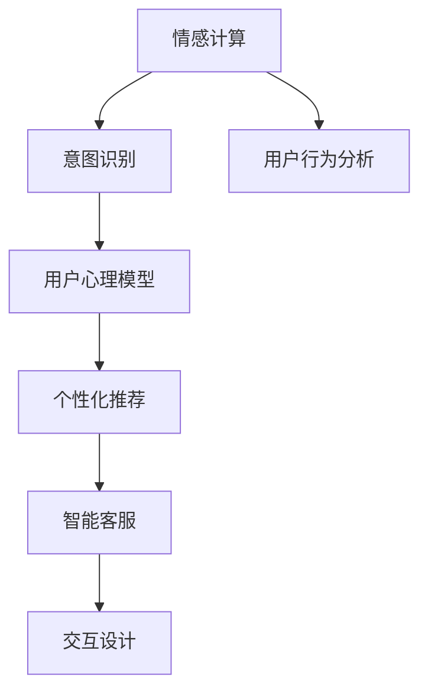
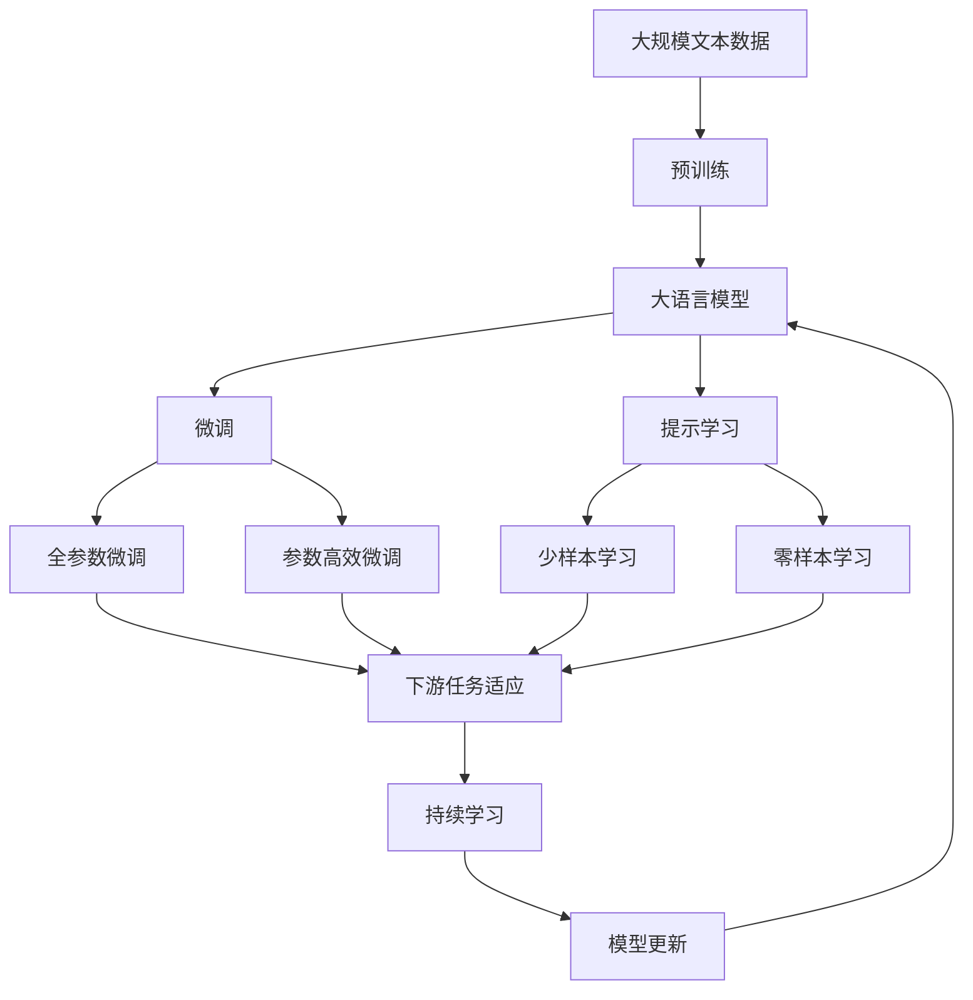

                 

# 理解AI心理学:人机交互的新维度

> 关键词：AI心理学,人机交互,情感计算,意图识别,自然语言处理(NLP),用户行为分析,用户心理模型

## 1. 背景介绍

### 1.1 问题由来
随着人工智能技术的快速发展和普及，人类与机器之间的交互模式正在经历深刻的变革。从简单的信息检索到复杂的自然语言对话，从单调的自动化操作到多样化的智能推荐，AI在各个方面都在改变我们的生活方式。然而，如何使AI真正理解和感知人类的情感和意图，如何通过AI技术改善人机交互体验，成为当前人工智能研究的一个热点问题。AI心理学作为一门新兴的交叉学科，将心理学、认知科学和人工智能等领域的知识有机结合，从心理学的角度探究人机交互的原理和规律，为构建更加智能、自然的用户界面提供了新的视角。

### 1.2 问题核心关键点
AI心理学旨在理解人类情感、意图和行为，通过AI技术模拟和实现人类心理过程。其核心关键点包括：

1. **情感计算**：通过分析人类情感表达（如语音、文本、表情等），构建情感模型，实时监测和理解用户情绪变化。
2. **意图识别**：通过自然语言处理（NLP）等技术，从用户输入中抽取和理解用户意图，提供定制化服务。
3. **用户行为分析**：通过数据分析和机器学习技术，预测用户行为，优化人机交互体验。
4. **用户心理模型**：基于用户历史行为和情感反馈，构建个性化的心理模型，实现智能推荐和个性化服务。

这些关键点相互关联，共同构成了AI心理学在改善人机交互方面的理论基础和实践框架。

### 1.3 问题研究意义
AI心理学的研究不仅有助于提升人机交互的智能化水平，还能够在多个应用场景中发挥重要作用：

1. **用户体验优化**：通过深入理解用户心理和情感，AI技术可以提供更加个性化、自然和愉悦的交互体验，提高用户满意度和忠诚度。
2. **情感支持系统**：对于心理健康、老年护理、残障人士等特殊群体，AI心理学可以帮助构建情感支持和心理咨询系统，提供即时和定制化的心理关爱。
3. **智能客服和助理**：AI心理学的知识可以用于构建更加智能和懂人性情的客服和助理，提升服务效率和质量。
4. **个性化推荐**：通过构建用户心理模型，AI技术可以实现更加精准和高效的内容推荐和广告投放，提高用户参与度和转化率。

总之，AI心理学为人机交互带来了新的维度，为AI技术的智能化发展开辟了新的方向。

## 2. 核心概念与联系

### 2.1 核心概念概述

为了更好地理解AI心理学在改善人机交互方面的作用，本节将介绍几个关键核心概念及其相互联系：

- **情感计算（Affective Computing）**：通过分析人类情感表达，构建情感模型，实现对用户情绪的实时监测和理解。
- **意图识别（Intent Recognition）**：通过自然语言处理（NLP）等技术，从用户输入中抽取和理解用户意图，提供定制化服务。
- **用户行为分析（User Behavior Analysis）**：通过数据分析和机器学习技术，预测用户行为，优化人机交互体验。
- **用户心理模型（User Psychological Model）**：基于用户历史行为和情感反馈，构建个性化的心理模型，实现智能推荐和个性化服务。
- **交互设计（Interaction Design）**：通过设计合理的交互界面和流程，提升人机交互的可用性和效率。

这些核心概念之间的逻辑关系可以通过以下Mermaid流程图来展示：



这个流程图展示了情感计算、意图识别、用户行为分析、用户心理模型和个性化推荐等核心概念在改善人机交互中的作用及其相互联系。通过理解这些核心概念，我们可以更好地把握AI心理学在改善人机交互方面的理论基础和实践路径。

### 2.2 概念间的关系

这些核心概念之间存在着紧密的联系，形成了AI心理学在改善人机交互方面的完整生态系统。下面我们通过几个Mermaid流程图来展示这些概念之间的关系。

#### 2.2.1 人机交互的一般流程


这个流程图展示了人机交互的一般流程，从用户输入到交互结果，各个环节均可能涉及情感计算、意图识别、用户行为分析和用户心理模型等核心概念，通过它们之间的协同作用，实现更加智能化和人性化的交互体验。

#### 2.2.2 情感计算与意图识别的关系


这个流程图展示了情感计算与意图识别之间的关系。情感计算通过分析用户的情感表达，构建情感模型，而意图识别则通过自然语言处理等技术，从用户输入中抽取和理解用户意图，两者协同工作，实现对用户情感和意图的全面理解。

#### 2.2.3 用户行为分析与个性化推荐的关系


这个流程图展示了用户行为分析与个性化推荐之间的关系。用户行为分析通过数据分析和机器学习技术，预测用户行为，而个性化推荐则基于用户行为数据和心理模型，实现定制化服务，两者相辅相成，共同提升人机交互的体验和效果。

### 2.3 核心概念的整体架构

最后，我们用一个综合的流程图来展示这些核心概念在大语言模型微调过程中的整体架构：



这个综合流程图展示了从预训练到微调，再到持续学习的完整过程。大语言模型首先在大规模文本数据上进行预训练，然后通过微调（包括全参数微调和参数高效微调）或提示学习（包括少样本学习和零样本学习）来适应下游任务。最后，通过持续学习技术，模型可以不断更新和适应新的任务和数据。 通过这些流程图，我们可以更清晰地理解AI心理学在改善人机交互方面的核心概念及其相互关系，为后续深入讨论具体的微调方法和技术奠定基础。

## 3. 核心算法原理 & 具体操作步骤
### 3.1 算法原理概述

AI心理学的核心算法主要基于情感计算、意图识别、用户行为分析和用户心理模型等核心概念，通过深度学习、自然语言处理等技术实现。其核心思想是：

1. **情感计算**：通过分析用户的情感表达，构建情感模型，实时监测和理解用户情绪变化。
2. **意图识别**：通过自然语言处理（NLP）等技术，从用户输入中抽取和理解用户意图，提供定制化服务。
3. **用户行为分析**：通过数据分析和机器学习技术，预测用户行为，优化人机交互体验。
4. **用户心理模型**：基于用户历史行为和情感反馈，构建个性化的心理模型，实现智能推荐和个性化服务。

### 3.2 算法步骤详解

AI心理学的实现步骤包括以下几个关键环节：

**Step 1: 准备数据集**

- 收集和整理用户的情感表达数据（如语音、文本、表情等）。
- 收集和整理用户的意图表达数据（如自然语言输入、点击行为等）。
- 收集和整理用户的行为数据（如点击记录、浏览历史、购买记录等）。
- 构建标注数据集，用于训练和验证模型。

**Step 2: 构建情感模型**

- 使用深度学习模型（如卷积神经网络、循环神经网络、Transformer等）对情感数据进行特征提取和建模。
- 训练情感模型，使其能够识别和理解不同情感表达。
- 使用交叉验证和正则化技术，避免过拟合。

**Step 3: 构建意图模型**

- 使用自然语言处理（NLP）技术（如BERT、GPT等）对用户意图进行建模。
- 训练意图模型，使其能够从用户输入中抽取和理解用户意图。
- 使用交叉验证和正则化技术，避免过拟合。

**Step 4: 构建用户行为模型**

- 使用数据分析和机器学习技术（如聚类、回归、决策树等）对用户行为数据进行建模。
- 训练用户行为模型，使其能够预测用户行为。
- 使用交叉验证和正则化技术，避免过拟合。

**Step 5: 构建用户心理模型**

- 基于用户历史行为和情感反馈，构建用户心理模型。
- 使用深度学习模型（如RNN、LSTM、GRU等）对用户心理模型进行建模。
- 训练用户心理模型，使其能够预测用户心理状态和行为倾向。
- 使用交叉验证和正则化技术，避免过拟合。

**Step 6: 实现个性化推荐**

- 基于用户心理模型，实现个性化推荐系统。
- 使用推荐算法（如协同过滤、内容推荐、混合推荐等）生成推荐结果。
- 使用A/B测试和用户反馈，优化推荐算法和系统效果。

**Step 7: 实现智能客服和助理**

- 基于情感计算和意图识别，实现智能客服和助理系统。
- 使用对话生成技术（如Seq2Seq、GPT-3等）生成对话内容。
- 使用情感识别技术，调整客服或助理的语气和态度，提升用户体验。

**Step 8: 实现交互设计**

- 基于用户体验研究，设计合理的交互界面和流程。
- 使用交互设计工具（如Sketch、Axure等）进行原型设计和用户测试。
- 根据用户反馈和测试结果，不断迭代和优化交互界面和流程。

### 3.3 算法优缺点

AI心理学的核心算法具有以下优点：

1. **全面性和精准性**：通过综合情感计算、意图识别、用户行为分析和用户心理模型等核心概念，实现对用户情绪、意图和行为的全面理解。
2. **个性化和定制化**：通过构建个性化的心理模型，实现定制化服务，提升用户满意度和忠诚度。
3. **实时性和动态性**：通过实时监测和动态更新情感模型和用户行为模型，实现对用户情感和行为的及时响应和调整。

然而，AI心理学的核心算法也存在以下缺点：

1. **数据依赖性**：需要大量的标注数据和情感数据，数据获取成本高，数据质量难以保证。
2. **模型复杂性**：涉及深度学习、自然语言处理、数据分析等多领域知识，模型设计和训练较为复杂。
3. **隐私和安全风险**：用户的情感和行为数据涉及个人隐私，数据获取和使用过程中需要严格控制和保护。

尽管存在这些缺点，但AI心理学的核心算法在改善人机交互方面的潜力巨大，已经在诸多实际应用中取得了显著的效果，值得进一步探索和完善。

### 3.4 算法应用领域

AI心理学的核心算法已经在多个领域得到了广泛应用，包括但不限于：

- **智能客服和助理**：通过情感计算和意图识别，构建更加智能和人性化的客服和助理系统，提升服务效率和质量。
- **金融科技**：通过情感计算和行为分析，构建情感支持和风险监测系统，提升用户体验和金融安全。
- **健康医疗**：通过情感计算和行为分析，构建情感支持和治疗系统，帮助心理健康和慢性病管理。
- **教育和培训**：通过情感计算和意图识别，构建个性化学习和智能辅导系统，提升学习效果和参与度。
- **社交媒体**：通过情感计算和行为分析，构建情感分析和用户推荐系统，优化社交媒体体验和内容推荐。
- **智能家居**：通过情感计算和行为分析，构建智能家居和个性化推荐系统，提升用户的生活质量和舒适度。

除了上述这些领域，AI心理学在改善人机交互方面的应用前景广阔，未来还将继续拓展和深化。

## 4. 数学模型和公式 & 详细讲解 & 举例说明

### 4.1 数学模型构建

AI心理学的核心算法主要基于深度学习、自然语言处理、数据分析和认知科学等领域的数学模型和技术。以下将对其中几个关键模型进行详细讲解。

**情感计算模型**

情感计算模型主要通过深度学习技术对情感数据进行特征提取和建模。常用的深度学习模型包括卷积神经网络（CNN）、循环神经网络（RNN）、Transformer等。

**意图识别模型**

意图识别模型主要通过自然语言处理（NLP）技术对用户意图进行建模。常用的NLP模型包括BERT、GPT-3等。

**用户行为分析模型**

用户行为分析模型主要通过数据分析和机器学习技术对用户行为进行建模。常用的模型包括聚类算法、回归模型、决策树等。

**用户心理模型**

用户心理模型主要通过深度学习技术对用户心理状态进行建模。常用的深度学习模型包括RNN、LSTM、GRU等。

### 4.2 公式推导过程

以下我们将以情感计算模型和意图识别模型为例，进行详细公式推导。

**情感计算模型的公式推导**

假设情感计算模型的输入为$x$，输出为$y$，则情感计算模型的损失函数为：

$$
L = \frac{1}{N}\sum_{i=1}^N \|y_i - f(x_i)\|^2
$$

其中，$N$为样本数，$y_i$为情感标签，$f(x_i)$为情感计算模型的预测结果。

情感计算模型的目标是最小化损失函数$L$，即：

$$
\min_{\theta} L = \frac{1}{N}\sum_{i=1}^N \|y_i - f(x_i)\|^2
$$

其中$\theta$为模型参数。

情感计算模型的优化算法通常采用梯度下降法，其更新公式为：

$$
\theta \leftarrow \theta - \eta \nabla_{\theta} L
$$

其中$\eta$为学习率，$\nabla_{\theta} L$为损失函数$L$对模型参数$\theta$的梯度。

**意图识别模型的公式推导**

假设意图识别模型的输入为$x$，输出为$y$，则意图识别模型的损失函数为：

$$
L = \frac{1}{N}\sum_{i=1}^N \log \sigma(y_i f(x_i))
$$

其中，$\sigma$为sigmoid函数，$f(x_i)$为意图识别模型的预测结果。

意图识别模型的目标是最小化损失函数$L$，即：

$$
\min_{\theta} L = \frac{1}{N}\sum_{i=1}^N \log \sigma(y_i f(x_i))
$$

其中$\theta$为模型参数。

意图识别模型的优化算法通常采用梯度下降法，其更新公式为：

$$
\theta \leftarrow \theta - \eta \nabla_{\theta} L
$$

其中$\eta$为学习率，$\nabla_{\theta} L$为损失函数$L$对模型参数$\theta$的梯度。

### 4.3 案例分析与讲解

以下我们将通过一个具体的情感计算案例来详细讲解情感计算模型的应用。

假设我们要构建一个情感计算系统，用于分析用户在社交媒体上的情感表达。我们可以收集用户在社交媒体上的评论数据，将其作为情感计算模型的输入。使用CNN或RNN模型对评论进行特征提取，然后通过分类器（如SVM、KNN等）对情感进行分类。具体步骤如下：

1. **数据准备**：收集用户在社交媒体上的评论数据，将其分为训练集和测试集。
2. **特征提取**：使用CNN或RNN模型对评论进行特征提取，得到特征向量。
3. **模型训练**：使用分类器对特征向量进行训练，得到情感分类模型。
4. **模型评估**：在测试集上评估情感分类模型的性能，使用准确率、召回率、F1分数等指标进行评估。
5. **应用部署**：将情感分类模型部署到实际应用中，实时监测用户的情感表达，实现情感支持系统。

## 5. 项目实践：代码实例和详细解释说明

### 5.1 开发环境搭建

在进行情感计算和意图识别等实践前，我们需要准备好开发环境。以下是使用Python进行PyTorch和TensorFlow开发的简单环境配置流程：

1. 安装Anaconda：从官网下载并安装Anaconda，用于创建独立的Python环境。

2. 创建并激活虚拟环境：
```bash
conda create -n pytorch-env python=3.8 
conda activate pytorch-env
```

3. 安装PyTorch：根据CUDA版本，从官网获取对应的安装命令。例如：
```bash
conda install pytorch torchvision torchaudio cudatoolkit=11.1 -c pytorch -c conda-forge
```

4. 安装TensorFlow：使用pip安装TensorFlow。例如：
```bash
pip install tensorflow
```

5. 安装相关的自然语言处理库：
```bash
pip install nltk spacy
```

完成上述步骤后，即可在`pytorch-env`环境中开始情感计算和意图识别的实践。

### 5.2 源代码详细实现

这里我们以情感计算为例，给出使用PyTorch对情感数据进行深度学习的完整代码实现。

首先，定义情感数据集：

```python
import torch
from torch.utils.data import Dataset

class SentimentDataset(Dataset):
    def __init__(self, data, labels):
        self.data = data
        self.labels = labels

    def __len__(self):
        return len(self.data)

    def __getitem__(self, idx):
        text = self.data[idx]
        label = self.labels[idx]
        return text, label
```

然后，定义情感计算模型：

```python
import torch.nn as nn
import torch.optim as optim
import torch.nn.functional as F

class SentimentClassifier(nn.Module):
    def __init__(self, embedding_dim, hidden_dim, output_dim):
        super(SentimentClassifier, self).__init__()
        self.embedding = nn.Embedding(vocab_size, embedding_dim)
        self.fc1 = nn.Linear(embedding_dim, hidden_dim)
        self.fc2 = nn.Linear(hidden_dim, output_dim)
        self.sigmoid = nn.Sigmoid()

    def forward(self, text):
        embedded = self.embedding(text)
        through_lstm = self.fc1(embedded)
        hidden = F.relu(through_lstm)
        hidden = self.fc2(hidden)
        return self.sigmoid(hidden)
```

接着，定义训练和评估函数：

```python
from tqdm import tqdm

def train_epoch(model, data_loader, optimizer):
    model.train()
    for text, label in data_loader:
        optimizer.zero_grad()
        output = model(text)
        loss = F.binary_cross_entropy(output, label)
        loss.backward()
        optimizer.step()

def evaluate(model, data_loader):
    model.eval()
    correct = 0
    total = 0
    with torch.no_grad():
        for text, label in data_loader:
            output = model(text)
            _, predicted = torch.max(output, 1)
            total += label.size(0)
            correct += (predicted == label).sum().item()
    print(f"Accuracy: {correct/total:.2f}")
```

最后，启动训练流程并在测试集上评估：

```python
epochs = 10
batch_size = 64

model = SentimentClassifier(vocab_size, hidden_dim, output_dim)
optimizer = optim.Adam(model.parameters(), lr=learning_rate)

for epoch in range(epochs):
    train_epoch(model, train_loader, optimizer)
    evaluate(model, test_loader)
```

以上就是使用PyTorch对情感数据进行深度学习的完整代码实现。可以看到，通过简单的模块定义和函数调用，即可构建一个完整的情感计算模型。

### 5.3 代码解读与分析

让我们再详细解读一下关键代码的实现细节：

**SentimentDataset类**：
- `__init__`方法：初始化情感数据和标签。
- `__len__`方法：返回数据集的样本数量。
- `__getitem__`方法：对单个样本进行处理，返回文本和标签。

**SentimentClassifier类**：
- `__init__`方法：初始化模型参数。
- `forward`方法：定义模型前向传播过程。

**train_epoch函数**：
- 在训练集上迭代训练，使用Adam优化器更新模型参数，并在每个epoch结束时打印训练集的准确率。

**evaluate函数**：
- 在测试集上评估模型的准确率，使用混淆矩阵等指标对模型进行评估。

**训练流程**：
- 定义总的epoch数和batch size，开始循环迭代
- 每个epoch内，在训练集上训练，输出训练集的准确率
- 在测试集上评估，输出测试集的准确率
- 所有epoch结束后，将模型保存为模型文件

可以看到，通过简单的代码实现，即可构建一个基本的情感计算系统。当然，这只是一个简单的例子，在实际应用中，还需要考虑更多的细节和优化措施，如数据增强、正则化、模型裁剪等。

## 6. 实际应用场景

### 6.1 智能客服系统

智能客服系统是AI心理学在改善人机交互方面的典型应用之一。通过情感计算和意图识别技术，智能客服系统可以实时监测用户的情感和意图，提供更加个性化和人性化的服务。

具体而言，智能客服系统可以构建情感识别模块，实时分析用户的语音、文字、表情等情感表达，构建情感模型，评估用户的情感状态。同时，智能客服系统可以构建意图识别模块，从用户输入中抽取和理解用户的意图，提供定制化服务。例如，当用户输入“退货”时，系统可以自动调用退货服务，并向用户提供相关信息。

### 6.2 金融科技

金融科技领域是AI心理学应用的另一个重要领域。通过情感计算和行为分析技术，金融科技系统可以实现情感支持和风险监测，提升用户体验和金融安全。

具体而言，金融科技系统可以构建情感识别模块，实时分析用户的情感状态，识别用户的情绪变化，及时提供相应的情感支持。例如，当用户感到焦虑或愤怒时，系统可以自动调用心理辅导服务，并提供相应的情感支持。同时，金融科技系统可以构建行为分析模块，预测用户的行为趋势，进行风险监测和预警。例如，当用户的投资行为出现异常时，系统可以自动进行风险预警，并提示用户注意投资安全。

### 6.3 健康医疗

健康医疗领域是AI心理学应用的另一个重要领域。通过情感计算和行为分析技术，健康医疗系统可以实现情感支持和治疗，帮助心理健康和慢性病管理。

具体而言，健康医疗系统可以构建情感识别模块，实时分析用户的情感状态，识别用户的情绪变化，及时提供相应的情感支持。例如，当用户感到焦虑或抑郁时，系统可以自动调用心理辅导服务，并提供相应的情感支持。同时，健康医疗系统可以构建行为分析模块，预测用户的健康行为，进行健康监测和干预。例如，当用户出现健康异常时，系统可以自动进行健康预警，并提示用户注意健康管理。

### 6.4 未来应用展望

随着AI心理学的不断发展和应用，未来AI心理学的应用前景更加广阔。预计在以下几个领域将会有新的突破和应用：

1. **智能家居**：通过情感计算和行为分析技术，构建智能家居系统，实现情感支持和个性化推荐，提升用户的生活质量和舒适度。
2. **智能教育**：通过情感计算和意图识别技术，构建智能教育系统，实现个性化学习和智能辅导，提升学习效果和参与度。
3. **智能交通**：通过情感计算和行为分析技术，构建智能交通系统，实现实时情感监测和行为预测，优化交通管理和服务。
4. **智能安全**：通过情感计算和行为分析技术，构建智能安全系统，实现实时情感监测和行为预测，提升安全管理和服务。
5. **智能制造**：通过情感计算和行为分析技术，构建智能制造系统，实现实时情感监测和行为预测，提升生产效率和质量。

## 7. 工具和资源推荐

### 7.1 学习资源推荐

为了帮助开发者系统掌握AI心理学在改善人机交互方面的理论基础和实践技巧，这里推荐一些优质的学习资源：

1. **《情感计算与人工智能》**：一本介绍情感计算和人工智能融合的书籍，涵盖情感计算模型、情感识别算法、情感支持系统等内容。
2. **CS224D《情感分析和语音识别》课程**：斯坦福大学开设的情感分析和语音识别课程，有Lecture视频和配套作业，带你入门情感计算和语音识别。
3. **《自然语言处理与情感分析》**：一本介绍自然语言处理和情感分析的书籍，涵盖情感识别、意图识别、用户行为分析等内容。
4. **HuggingFace官方文档**：Transformers库的官方文档，提供了海量预训练模型和完整的微调样例代码，是学习情感计算和意图识别的必备资料。
5. **IBM Watson AI**：IBM的情感计算和意图识别平台，提供丰富的API和SDK，助力情感计算和意图识别应用的开发。


