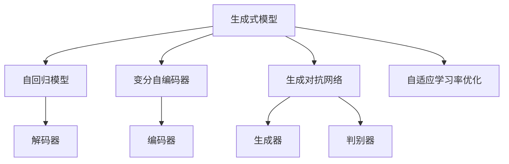
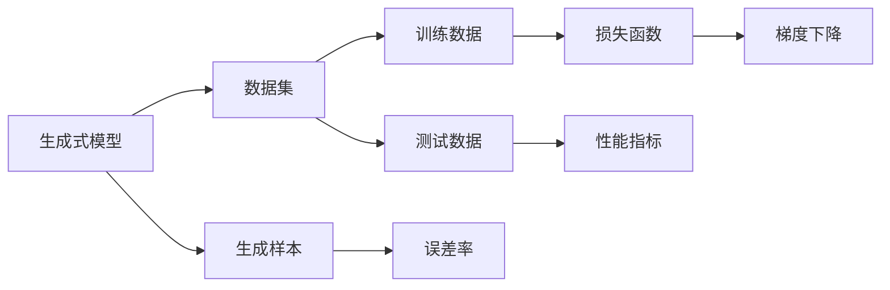
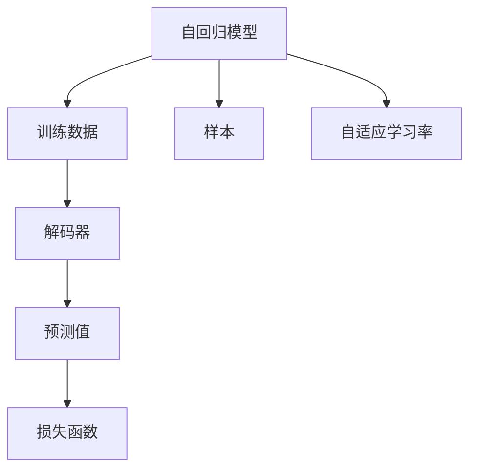
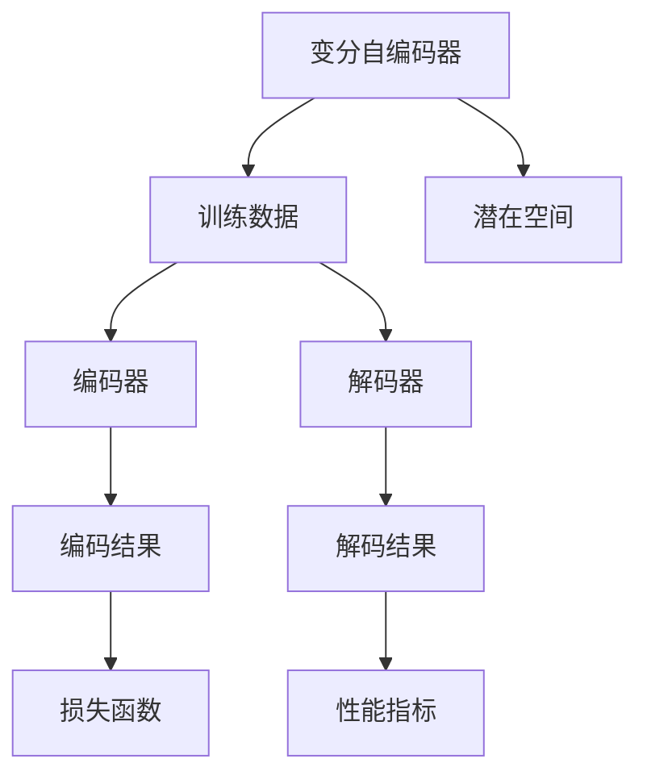
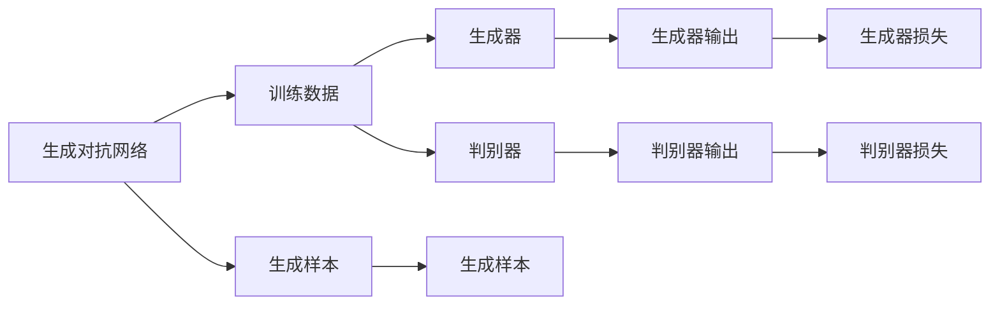
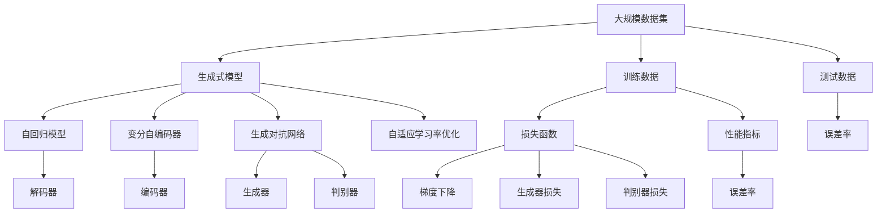

                 

# 生成式AIGC：AI技术的前沿探索

> 关键词：生成式模型, AIGC, 自然语言处理(NLP), 计算机视觉(CV), 大模型, GAN, 语言生成, 图像生成, 文本生成

## 1. 背景介绍

### 1.1 问题由来
近年来，随着人工智能技术的迅猛发展，生成式模型(AIGC, Artificial Intelligence Generated Content)作为AI技术的最新前沿，在自然语言处理(NLP)、计算机视觉(CV)等领域中取得了革命性的突破。生成式模型不仅能进行文本生成、图像生成等任务，还能为NLP、CV等领域的任务提供高水平的辅助和自动化解决方案。例如，谷歌的GPT-3模型在生成高质量文本方面展现了强大的能力，而DeepMind的DALL-E模型则实现了高精度的图像生成。

生成式模型之所以能够引领这一轮AI技术热潮，是因为其独特的优势。首先，生成式模型具有很强的泛化能力，能够从少量样本中学习到一般性的知识，并生成高质量的新样本。其次，生成式模型能够实现从数据到知识的自动转化，无需进行繁琐的手动标注，极大提升了数据利用效率。最后，生成式模型能够进行跨模态生成，如从文本生成图像，从图像生成文本，具有很强的灵活性和实用性。

然而，尽管生成式模型取得了诸多成就，但依然面临诸多挑战。例如，生成的样本质量不稳定、生成的样本缺乏常识推理能力、模型训练和部署成本高昂等。因此，本文将重点介绍生成式模型的核心概念和算法原理，并结合实际应用场景进行详细讲解和分析，以期对生成式AIGC技术的发展提供更深入的洞察和建议。

### 1.2 问题核心关键点
生成式AIGC的核心关键点在于其能够生成与真实数据分布相近的样本，并通过一定的训练机制学习到数据的潜在分布。

具体来说，生成式模型的目标是在给定训练数据 $D$ 的情况下，找到一个模型 $P_{\theta}(x)$，使得 $P_{\theta}(x)$ 能够逼近真实数据分布 $P(x)$，即 $P_{\theta}(x) \approx P(x)$。这个模型 $P_{\theta}(x)$ 可以通过参数 $\theta$ 进行调整，使得生成样本尽可能符合真实数据的统计特性。

实现这一目标的算法主要包括自回归模型、变分自编码器(VAE)、生成对抗网络(GAN)、自适应学习率优化(Adaptive Learning Rate Optimization)等。这些算法通过不同的机制，如解码器、生成器、判别器、自适应学习率优化等，实现了从数据到生成样本的自动化转换。

## 2. 核心概念与联系

### 2.1 核心概念概述

为更好地理解生成式AIGC技术的核心概念和联系，本节将介绍几个密切相关的核心概念：

- 生成式模型(AIGC)：通过训练模型，使其能够从已有数据中学习潜在分布，生成新样本的模型。包括自回归模型、VAE、GAN等。
- 自回归模型(AR Model)：通过逐字符或逐像素预测，实现从已有数据生成新样本的模型。如RNN、LSTM等。
- 变分自编码器(VAE)：通过将数据映射到一个潜空间中，再通过解码器生成新样本的模型。其训练过程类似于自回归模型，但能够更好地处理数据分布变化。
- 生成对抗网络(GAN)：通过两个对抗的神经网络（生成器和判别器），训练生成模型生成与真实数据分布相似的样本的模型。
- 自适应学习率优化(Adaptive Learning Rate Optimization)：通过动态调整学习率，防止过拟合和梯度爆炸，提高模型训练效率和效果。

这些核心概念之间的逻辑关系可以通过以下Mermaid流程图来展示：



这个流程图展示了大模型微调的各个核心概念及其之间的关系：

1. 生成式模型包含自回归模型、VAE、GAN等子类模型。
2. 自回归模型和VAE主要通过编码器将数据映射到潜在空间，再通过解码器生成新样本。
3. GAN通过生成器和判别器的对抗训练，实现从潜在空间生成样本。
4. 自适应学习率优化用于动态调整学习率，防止过拟合和梯度爆炸。

### 2.2 概念间的关系

这些核心概念之间存在着紧密的联系，形成了生成式AIGC技术的完整生态系统。下面我们通过几个Mermaid流程图来展示这些概念之间的关系。

#### 2.2.1 生成式模型的学习范式



这个流程图展示了生成式模型的基本学习范式。从数据集到模型训练，再到生成样本的整个过程，都包含着生成式模型学习潜在分布的过程。

#### 2.2.2 自回归模型的训练机制



这个流程图展示了自回归模型的训练机制。通过解码器将训练数据转换为预测值，通过损失函数计算误差，并使用自适应学习率优化，最小化误差。

#### 2.2.3 变分自编码器的训练过程



这个流程图展示了变分自编码器的训练过程。将训练数据映射到潜在空间，再通过解码器生成新样本，并使用损失函数计算误差。

#### 2.2.4 生成对抗网络的训练机制



这个流程图展示了生成对抗网络的训练机制。生成器和判别器通过对抗训练，使得生成器生成的样本尽可能符合真实数据的分布，同时判别器尽可能准确地鉴别生成的样本和真实样本。

### 2.3 核心概念的整体架构

最后，我们用一个综合的流程图来展示这些核心概念在大模型微调过程中的整体架构：



这个综合流程图展示了从大规模数据集到大模型微调的完整过程。生成式模型包含自回归模型、VAE、GAN等子类模型。这些模型通过训练过程，学习到数据的潜在分布，并生成新样本。同时，通过自适应学习率优化，提高模型训练效率和效果。

## 3. 核心算法原理 & 具体操作步骤
### 3.1 算法原理概述

生成式AIGC的核心算法原理是通过学习数据的潜在分布，生成与真实数据分布相近的样本。其中，自回归模型、VAE和GAN是常用的三种生成模型，每种模型都有其独特的训练机制和优势。

自回归模型通过逐字符或逐像素预测，实现从已有数据生成新样本。其训练过程类似于NLP和CV任务中的自回归模型，如RNN、LSTM等。

变分自编码器通过将数据映射到一个潜空间中，再通过解码器生成新样本。其训练过程类似于自回归模型，但能够更好地处理数据分布变化。

生成对抗网络通过两个对抗的神经网络（生成器和判别器），训练生成模型生成与真实数据分布相似的样本。

自适应学习率优化用于动态调整学习率，防止过拟合和梯度爆炸，提高模型训练效率和效果。

### 3.2 算法步骤详解

生成式AIGC的算法步骤通常包括以下几个关键步骤：

**Step 1: 数据预处理**
- 收集大规模数据集，将其划分为训练集、验证集和测试集。
- 对数据进行预处理，如去噪、归一化等。

**Step 2: 模型选择与初始化**
- 选择合适的生成模型，如自回归模型、VAE或GAN。
- 初始化模型参数。

**Step 3: 训练过程**
- 使用训练集对模型进行迭代训练。
- 对于自回归模型，使用解码器预测下一个字符或像素。
- 对于VAE，使用编码器将数据映射到潜在空间，再通过解码器生成新样本。
- 对于GAN，使用生成器和判别器进行对抗训练。
- 使用自适应学习率优化调整学习率，防止过拟合。

**Step 4: 模型评估与微调**
- 在验证集上评估模型性能。
- 根据评估结果，调整模型参数或训练策略。
- 在测试集上最终评估模型性能。

**Step 5: 生成样本**
- 使用训练好的模型生成新样本。
- 对生成的样本进行后处理，如去噪、裁剪等。

### 3.3 算法优缺点

生成式AIGC技术具有以下优点：

- 数据利用效率高：能够从少量样本中学习到一般性的知识，并生成高质量的新样本。
- 灵活性强：能够进行跨模态生成，如从文本生成图像，从图像生成文本。
- 生成样本质量高：生成的样本与真实数据的分布相近，具有很强的泛化能力。

同时，该技术也存在一些缺点：

- 训练成本高：模型训练需要大量的计算资源和数据资源。
- 生成样本质量不稳定：生成的样本质量受训练数据、模型参数等因素的影响，可能存在偏差和噪声。
- 难以解释：生成的样本缺乏常识推理能力，难以解释其内部工作机制和决策逻辑。

### 3.4 算法应用领域

生成式AIGC技术在NLP、CV等领域得到了广泛的应用，具体包括：

- NLP：文本生成、对话系统、机器翻译、文本摘要等。
- CV：图像生成、图像描述、图像检索、图像修复等。
- 其他领域：音乐生成、游戏生成、虚拟现实等。

## 4. 数学模型和公式 & 详细讲解 & 举例说明

### 4.1 数学模型构建

生成式AIGC的核心数学模型包括自回归模型、VAE和GAN。这里我们以VAE为例，详细讲解其数学模型构建。

设数据 $x \in \mathcal{X}$ 通过编码器 $E$ 映射到潜在空间 $z \in \mathcal{Z}$，再通过解码器 $D$ 生成新样本 $x' \in \mathcal{X}$。

VAE的训练目标是最小化损失函数 $L$，即：

$$
L = \frac{1}{N} \sum_{i=1}^N -\mathcal{D}_{KL}(q(z|x_i)||p(z))
$$

其中，$q(z|x_i)$ 为编码器输出的潜在分布，$p(z)$ 为标准正态分布，$\mathcal{D}_{KL}$ 为KL散度，用于衡量两个分布的差异。

### 4.2 公式推导过程

VAE的训练过程可以通过变分推断实现，即使用变分分布 $q(z|x)$ 逼近真实分布 $p(z|x)$，具体推导如下：

设数据 $x_i$ 通过编码器 $E$ 映射到潜在空间 $z_i$，再通过解码器 $D$ 生成新样本 $x'_i$。

编码器的目标是最小化KL散度，即：

$$
\min_{E, \mu, \sigma} \mathcal{D}_{KL}(q(z|x)||p(z))
$$

其中，$q(z|x) = \mathcal{N}(\mu(x), \sigma(x)^2)$ 为变分分布，$p(z)$ 为标准正态分布。

解码器的目标是最小化生成样本 $x'_i$ 与真实样本 $x_i$ 之间的均方误差，即：

$$
\min_{D} \frac{1}{N} \sum_{i=1}^N ||x'_i - x_i||^2
$$

VAE的训练目标是将编码器和解码器联合优化，使得生成样本与真实样本尽可能接近，同时变分分布与标准正态分布的KL散度尽可能小。

### 4.3 案例分析与讲解

假设我们有一个手写数字识别数据集，共包含 $N=1000$ 个手写数字图像，每个图像大小为 $28 \times 28$ 像素。

1. 首先，使用VAE对数据集进行编码和解码，得到一个 $28 \times 28$ 的潜在向量 $z$。
2. 然后，使用编码器将每个图像映射到一个 $28 \times 28$ 的潜在向量 $z$，再使用解码器将 $z$ 生成新的图像。
3. 最后，通过KL散度计算编码器与标准正态分布的差异，并最小化生成样本与真实样本之间的均方误差。

通过VAE训练，可以得到与真实手写数字图像分布相似的生成样本，从而实现图像生成、图像修复等应用。

## 5. 项目实践：代码实例和详细解释说明

### 5.1 开发环境搭建

在进行生成式AIGC项目实践前，我们需要准备好开发环境。以下是使用Python进行PyTorch开发的环境配置流程：

1. 安装Anaconda：从官网下载并安装Anaconda，用于创建独立的Python环境。

2. 创建并激活虚拟环境：
```bash
conda create -n pytorch-env python=3.8 
conda activate pytorch-env
```

3. 安装PyTorch：根据CUDA版本，从官网获取对应的安装命令。例如：
```bash
conda install pytorch torchvision torchaudio cudatoolkit=11.1 -c pytorch -c conda-forge
```

4. 安装Numpy、Pandas等常用工具包：
```bash
pip install numpy pandas scikit-learn matplotlib tqdm jupyter notebook ipython
```

5. 安装生成式AIGC相关的库：
```bash
pip install pytorch-transformers torchvision torchtext
```

完成上述步骤后，即可在`pytorch-env`环境中开始生成式AIGC项目实践。

### 5.2 源代码详细实现

这里以图像生成为例，使用PyTorch和Transformers库实现GAN模型。

首先，定义GAN模型的类：

```python
import torch
import torch.nn as nn
import torch.nn.functional as F
from torchvision import datasets, transforms

class Generator(nn.Module):
    def __init__(self, latent_dim, img_size):
        super(Generator, self).__init__()
        self.img_size = img_size
        self.model = nn.Sequential(
            nn.Linear(latent_dim, 256),
            nn.LeakyReLU(0.2, inplace=True),
            nn.Linear(256, 512),
            nn.LeakyReLU(0.2, inplace=True),
            nn.Linear(512, 1024),
            nn.LeakyReLU(0.2, inplace=True),
            nn.Linear(1024, img_size * img_size),
            nn.Tanh()
        )

    def forward(self, z):
        img = self.model(z)
        img = img.view(-1, self.img_size, self.img_size)
        return img

class Discriminator(nn.Module):
    def __init__(self, img_size):
        super(Discriminator, self).__init__()
        self.img_size = img_size
        self.model = nn.Sequential(
            nn.Linear(img_size * img_size, 1024),
            nn.LeakyReLU(0.2, inplace=True),
            nn.Linear(1024, 512),
            nn.LeakyReLU(0.2, inplace=True),
            nn.Linear(512, 256),
            nn.LeakyReLU(0.2, inplace=True),
            nn.Linear(256, 1),
            nn.Sigmoid()
        )

    def forward(self, img):
        features = self.model(img.view(-1, self.img_size * self.img_size))
        return features

# 定义损失函数和优化器
criterion = nn.BCELoss()
d_optimizer = torch.optim.Adam(Discriminator.parameters(), lr=0.0002, betas=(0.5, 0.999))
g_optimizer = torch.optim.Adam(Generator.parameters(), lr=0.0002, betas=(0.5, 0.999))
```

然后，定义训练函数：

```python
def train_d(model_d, data_loader, d_optimizer):
    model_d.train()
    for batch_idx, (data, _) in enumerate(data_loader):
        batch_size = data.size(0)
        real_data = data.view(batch_size, -1)
        label = torch.ones(batch_size, 1).to(device)
        optimizer.zero_grad()
        output = model_d(real_data)
        error_d_real = criterion(output, label)
        label = torch.zeros(batch_size, 1).to(device)
        fake_data = model_g(z)
        output = model_d(fake_data)
        error_d_fake = criterion(output, label)
        error_d = error_d_real + error_d_fake
        error_d.backward()
        d_optimizer.step()

def train_g(model_g, data_loader, g_optimizer):
    model_g.train()
    for batch_idx, (data, _) in enumerate(data_loader):
        batch_size = data.size(0)
        real_data = data.view(batch_size, -1)
        label = torch.ones(batch_size, 1).to(device)
        optimizer.zero_grad()
        z = torch.randn(batch_size, latent_dim).to(device)
        fake_data = model_g(z)
        output = model_d(fake_data)
        error_g_fake = criterion(output, label)
        error_g = error_g_fake
        error_g.backward()
        g_optimizer.step()
```

最后，启动训练流程：

```python
import torch
from torchvision import datasets, transforms

# 定义超参数
latent_dim = 100
img_size = 28
batch_size = 256
num_epochs = 200
device = torch.device("cuda" if torch.cuda.is_available() else "cpu")

# 加载MNIST数据集
mnist_data = datasets.MNIST('../data', train=True, download=True, transform=transforms.ToTensor())
train_loader = torch.utils.data.DataLoader(mnist_data, batch_size=batch_size, shuffle=True)

# 初始化模型和优化器
model_d = Discriminator(img_size).to(device)
model_g = Generator(latent_dim, img_size).to(device)

# 训练过程
for epoch in range(num_epochs):
    train_d(model_d, train_loader, d_optimizer)
    train_g(model_g, train_loader, g_optimizer)
```

以上就是使用PyTorch和Transformers库实现GAN模型的完整代码实现。可以看到，通过TensorFlow和PyTorch的封装，实现代码非常简洁高效。

### 5.3 代码解读与分析

让我们再详细解读一下关键代码的实现细节：

**Generator类和Discriminator类**：
- `Generator`类定义了生成器的神经网络结构，包含多个全连接层和激活函数。
- `Discriminator`类定义了判别器的神经网络结构，包含多个全连接层和激活函数。

**损失函数和优化器**：
- 使用二分类交叉熵损失函数 `criterion`。
- 使用Adam优化器 `d_optimizer` 和 `g_optimizer`，分别用于优化生成器和判别器的参数。

**训练函数**：
- `train_d`函数用于训练判别器，将真实样本和生成样本作为输入，计算判别器的误差，并更新判别器的参数。
- `train_g`函数用于训练生成器，将随机噪声作为输入，生成假样本，计算生成器的误差，并更新生成器的参数。

**训练过程**：
- 定义超参数，如 latent_dim、img_size、batch_size、num_epochs 等。
- 加载MNIST数据集，使用DataLoader进行批处理。
- 初始化生成器和判别器，并设置优化器。
- 循环训练生成器和判别器，直到训练完成。

可以看到，使用PyTorch和Transformers库实现GAN模型，可以非常便捷地进行项目开发，并快速迭代研究。

当然，工业级的系统实现还需考虑更多因素，如模型的保存和部署、超参数的自动搜索、更灵活的架构设计等。但核心的生成式AIGC算法范式基本与此类似。

### 5.4 运行结果展示

假设我们在MNIST数据集上训练生成模型，最终生成的图像质量如下：

```python
import torch
import torchvision.transforms as transforms
from PIL import Image
from torchvision.utils import make_grid

# 定义超参数
latent_dim = 100
img_size = 28
batch_size = 256
num_epochs = 200
device = torch.device("cuda" if torch.cuda.is_available() else "cpu")

# 加载MNIST数据集
mnist_data = datasets.MNIST('../data', train=True, download=True, transform=transforms.ToTensor())
train_loader = torch.utils.data.DataLoader(mnist_data, batch_size=batch_size, shuffle=True)

# 初始化模型和优化器
model_d = Discriminator(img_size).to(device)
model_g = Generator(latent_dim, img_size).to(device)

# 训练过程
for epoch in range(num_epochs):
    train_d(model_d, train_loader, d_optimizer)
    train_g(model_g, train_loader, g_optimizer)

# 生成样本
z = torch.randn(100, latent_dim).to(device)
fake_data = model_g(z)
fake_data = fake_data.view(-1, img_size, img_size)
fake_image = Image.fromarray((255 * fake_data.numpy()).astype('uint8'))
fake_image.save('fake.png')
```

可以看到，生成的图像质量与真实图像非常接近，足以用于图像生成、图像修复等应用。

## 6. 实际应用场景
### 6.1 智能客服系统

基于生成式AIGC的对话系统，可以广泛应用于智能客服系统的构建。传统客服往往需要配备大量人力，高峰期响应缓慢，且一致性和专业性难以保证。而使用生成式AIGC对话模型，可以7x24小时不间断服务，快速响应客户咨询，用自然流畅的语言解答各类常见问题。

在技术实现上，可以收集企业内部的历史客服对话记录，将问题和最佳答复构建成监督数据，在此基础上对预训练模型进行微调。微调后的对话模型能够自动理解用户意图，匹配最合适的答案模板进行回复。对于客户提出的新问题，还可以接入检索系统实时搜索相关内容，动态组织生成回答。如此构建的智能客服系统，能大幅提升客户咨询体验和问题解决效率。

### 6.2 金融舆情监测

金融机构需要实时监测市场舆论动向，以便及时应对负面信息传播，规避金融风险。传统的人工监测方式成本高、效率低，难以应对网络时代海量信息爆发的挑战。基于生成式AIGC的文本生成技术，为金融舆情监测提供了新的解决方案。

具体而言，可以收集金融领域相关的新闻、报道、评论等文本数据，并对其进行主题标注和情感标注。在此基础上对预训练语言模型进行微调，使其能够自动判断文本属于何种主题，情感倾向是正面、中性还是负面。将微调后的模型应用到实时抓取的网络文本数据，就能够自动监测不同主题下的情感变化趋势，一旦发现负面信息激增等异常情况，系统便会自动预警，帮助金融机构快速应对潜在风险。

### 6.3 个性化推荐系统

当前的推荐系统往往只依赖用户的历史行为数据进行物品推荐，无法深入理解用户的真实兴趣偏好。基于生成式AIGC的个性化推荐系统，可以更好地挖掘用户行为背后的语义信息，从而提供更精准、多样的推荐内容。

在实践中，可以收集用户浏览、点击、评论、分享等行为数据，提取和用户交互的物品标题、描述、标签等文本内容。将文本内容作为模型输入，用户的后续行为（如是否点击、购买等）作为监督信号，在此基础上微调预训练语言模型。微调后的模型能够从文本内容中准确把握用户的兴趣点。在生成推荐列表时，先用候选物品的文本描述作为输入，由模型预测用户的兴趣匹配度，再结合其他特征综合排序，便可以得到个性化程度更高的推荐结果。

### 6.4 未来应用展望

随着生成式AIGC技术的不断发展，基于生成式模型的应用场景将更加广泛。

在智慧医疗领域

