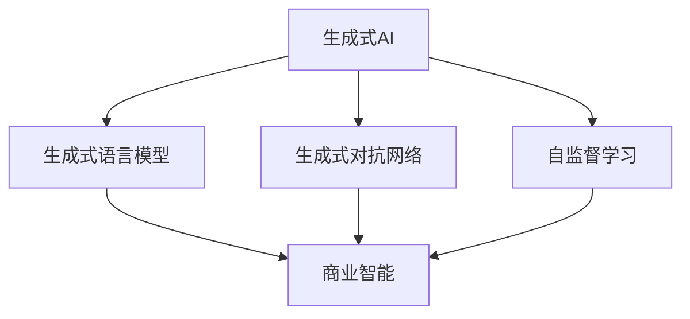
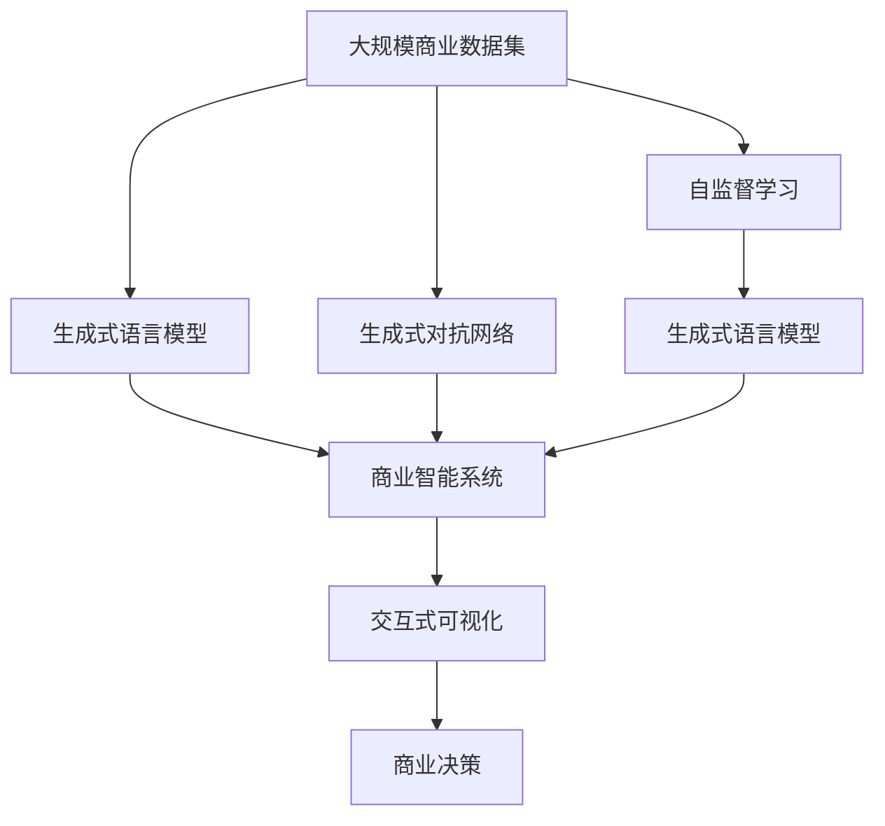

                 

# 生成式AIGC：商业智能的未来趋势

## 1. 背景介绍

### 1.1 问题由来

随着人工智能（AI）技术的迅速发展，商业智能（Business Intelligence, BI）领域也迎来了革命性的变化。传统的BI系统依赖于静态的数据报告和可视化，难以适应动态变化的商业环境。与此同时，生成式人工智能（Generative AI, AIGC）技术的崛起，为BI系统注入了新的活力。

生成式AI，特别是生成式语言模型（Generative Language Models, GLMs）和生成式对抗网络（Generative Adversarial Networks, GANs），通过生成高质量的数据和内容，极大地丰富了BI系统的功能和应用场景。在数据驱动决策的过程中，生成式AI能够提供更为多样和精准的信息支持，帮助企业更加灵活和高效地应对市场变化。

### 1.2 问题核心关键点

当前，生成式AIGC技术在商业智能领域的应用主要体现在以下几个方面：

- **数据生成**：通过生成式模型生成合成数据，弥补真实数据的不足，优化BI系统的数据集。
- **内容创作**：利用生成式模型生成商业文档、新闻稿、报告等，提升BI系统的信息输出质量。
- **数据增强**：使用生成式模型对现有数据进行增强，提高模型的泛化能力和预测精度。
- **交互式可视化**：结合生成式模型和自然语言处理（NLP）技术，实现交互式数据可视化和自然语言查询。

生成式AIGC技术的应用，不仅提升了BI系统的数据质量，还增强了其灵活性和可操作性，为企业提供了更加强大和智能的数据分析能力。

### 1.3 问题研究意义

研究生成式AIGC技术在商业智能中的应用，对于推动商业决策科学化、智能化，提升企业竞争力和市场反应速度，具有重要的现实意义：

1. **决策支持**：生成式AI能够提供更为全面和精准的数据和分析，帮助企业做出更科学、更高效的商业决策。
2. **信息传播**：生成的商业文档和报告质量更高、更有吸引力，有助于企业更有效地传达信息，提升品牌影响力。
3. **数据安全**：生成式模型可以生成仿真数据，帮助企业在保护隐私的同时，仍能获取高质量的数据分析结果。
4. **资源节约**：减少对人工数据清洗和内容创作的依赖，节约时间和成本。
5. **市场响应**：实时生成动态报告和分析，帮助企业快速响应市场变化，抓住商机。

## 2. 核心概念与联系

### 2.1 核心概念概述

为了更好地理解生成式AIGC在商业智能中的应用，本节将介绍几个密切相关的核心概念：

- **生成式AI**：通过生成模型从数据中学习并生成新的数据或内容的技术。常见的生成模型包括GLMs、GANs、VAEs等。
- **商业智能（BI）**：利用数据分析和可视化技术，帮助企业理解和优化业务流程，做出更有效的商业决策。
- **生成式语言模型（GLM）**：一类专门用于生成自然语言文本的生成模型，如GPT、BERT、T5等。
- **生成式对抗网络（GANs）**：通过两个对抗的网络结构生成高质量的图像、视频、音频等多模态数据。
- **自监督学习**：使用未标注数据进行训练，从数据中自动提取有意义的表示。

### 2.2 概念间的关系

这些核心概念之间的关系可以通过以下Mermaid流程图来展示：



这个流程图展示了生成式AIGC技术在商业智能中的应用路径：

1. 通过生成式语言模型和生成式对抗网络，生成高质量的文本和图像数据。
2. 这些生成数据用于商业智能系统，进行数据增强、内容创作、交互式可视化等应用。
3. 自监督学习用于训练生成式模型，提升模型生成数据的质量和多样性。

### 2.3 核心概念的整体架构

最后，我们用一个综合的流程图来展示这些核心概念在大规模商业智能系统中的整体架构：



这个综合流程图展示了生成式AIGC技术在商业智能系统中的整体架构：

1. 大规模商业数据集被输入生成式语言模型和生成式对抗网络。
2. 生成式语言模型和生成式对抗网络生成高质量的文本和图像数据。
3. 生成的数据被输入商业智能系统，进行数据增强、内容创作、交互式可视化等应用。
4. 自监督学习用于训练生成式语言模型，提升模型生成数据的质量和多样性。
5. 交互式可视化结合NLP技术，实现自然语言查询和动态报告生成。
6. 最终生成的高质量报告和分析结果支持商业决策。

这些概念共同构成了生成式AIGC技术在商业智能中的应用框架，使得BI系统能够利用生成式AI技术，提供更加丰富和精准的数据支持。

## 3. 核心算法原理 & 具体操作步骤

### 3.1 算法原理概述

生成式AIGC技术在商业智能中的应用，本质上是一个生成模型的训练和应用过程。其核心思想是通过生成模型学习数据特征，并生成高质量的新数据或内容，以辅助商业决策和信息传播。

形式化地，假设原始商业数据集为 $D$，生成式模型为 $G$，目标是最大化生成数据的真实性 $P_G$ 和多样性 $P_{\text{div}}$。具体而言，生成式模型 $G$ 生成的新数据 $x'$ 应满足：

$$
P_G(x') = \arg\max_{G} \mathbb{E}_{x' \sim G} \log P_G(x')
$$

同时，生成的数据 $x'$ 应该具有较高的多样性，即：

$$
P_{\text{div}}(x') = \arg\max_{G} \mathbb{E}_{x' \sim G} \log \left( \frac{1}{N} \sum_{i=1}^{N} \frac{1}{1 + \mathbb{E}_{x' \sim G} \log \frac{P_G(x')}{P_D(x')}} \right)
$$

其中 $P_D(x')$ 为原始数据的概率分布。

### 3.2 算法步骤详解

生成式AIGC在商业智能中的应用，一般包括以下几个关键步骤：

**Step 1: 准备原始数据集**
- 收集和预处理大规模商业数据集 $D$，确保数据质量，去除噪声和缺失值。
- 使用数据增强技术，如数据合成、数据截断、数据重构等，扩充数据集。

**Step 2: 设计生成模型**
- 选择合适的生成模型，如GLMs、GANs等，根据数据类型和应用需求设计模型架构。
- 使用自监督学习技术，如语言建模、对抗训练等，训练生成模型，提高模型生成数据的质量和多样性。

**Step 3: 生成新数据**
- 使用训练好的生成模型，生成高质量的新数据 $x'$。
- 对生成数据进行后处理，如去重、格式化、筛选等，确保数据的可用性。

**Step 4: 结合商业智能系统**
- 将生成数据输入商业智能系统，进行数据增强、内容创作、交互式可视化等应用。
- 结合自然语言处理技术，实现自然语言查询和动态报告生成。

**Step 5: 监测和优化**
- 实时监测生成数据的真实性和多样性，调整生成模型参数，优化生成效果。
- 定期更新生成模型，确保其与商业环境的变化保持同步。

### 3.3 算法优缺点

生成式AIGC技术在商业智能中的应用具有以下优点：
1. 数据生成能力强：生成式模型能够生成高质量、多样化的数据，弥补真实数据的不足。
2. 增强数据质量：生成式模型可以对现有数据进行增强，提升数据的质量和泛化能力。
3. 提高信息传播效率：生成的文档和报告内容更加丰富和有吸引力，提升信息传播效果。
4. 支持交互式可视化：通过自然语言查询和动态报告生成，增强商业智能系统的交互性。

同时，该技术也存在一些局限性：
1. 对数据需求高：生成式模型需要大量的原始数据进行训练，数据获取成本高。
2. 模型复杂度高：生成式模型结构复杂，训练和推理成本高。
3. 结果质量不稳定：生成式模型生成的数据存在一定的随机性，质量不稳定。
4. 伦理和隐私问题：生成的数据可能包含敏感信息，需要严格控制和保护。

尽管存在这些局限性，但总体而言，生成式AIGC技术在商业智能中的应用，为数据驱动的决策提供了更为丰富和精准的支持，具有广阔的应用前景。

### 3.4 算法应用领域

生成式AIGC技术在商业智能中的应用领域非常广泛，涵盖以下几个方面：

- **数据生成**：在金融、医疗、零售等领域，生成式模型可以生成合成数据，用于数据增强、模拟仿真等。
- **内容创作**：在市场营销、品牌推广、客户服务等场景中，生成式模型可以生成高质量的文档、广告、新闻稿等。
- **数据增强**：在生物信息学、气象预测、环境监测等领域，生成式模型可以生成模拟数据，提高模型的泛化能力。
- **交互式可视化**：在电商、物流、供应链管理等领域，生成式模型结合NLP技术，实现自然语言查询和动态报告生成。

## 4. 数学模型和公式 & 详细讲解  
### 4.1 数学模型构建

本节将使用数学语言对生成式AIGC技术在商业智能中的应用过程进行严格的刻画。

假设原始商业数据集为 $D=\{x_1, x_2, \dots, x_N\}$，生成式模型为 $G$，目标是最大化生成数据的真实性 $P_G$ 和多样性 $P_{\text{div}}$。

生成式模型 $G$ 的生成过程可以表示为：

$$
G(\theta, x) = x'
$$

其中 $\theta$ 为模型参数，$x'$ 为生成的数据。

### 4.2 公式推导过程

以下我们以文本生成为例，推导GLM的训练过程和生成过程。

假设GLM使用Transformer模型进行文本生成，生成过程可以表示为：

$$
x' = G(\theta, x) = \text{Decoder}(\text{Encoder}(x), \theta)
$$

其中 $\text{Encoder}$ 为编码器，$\text{Decoder}$ 为解码器，$\theta$ 为模型参数。

GLM的训练目标为最大化生成数据的真实性：

$$
\mathcal{L}(\theta) = -\mathbb{E}_{x' \sim G} \log P_G(x')
$$

其中 $P_G(x')$ 为生成数据的真实性概率，$\mathbb{E}_{x' \sim G}$ 表示对生成数据的期望。

在实际训练中，通常使用最大似然估计（MLE）进行优化，目标为：

$$
\max_{\theta} \mathbb{E}_{x' \sim G} \log P_G(x')
$$

具体的优化算法可以采用梯度下降法（如Adam、SGD等），通过反向传播计算梯度，更新模型参数 $\theta$。

## 5. 项目实践：代码实例和详细解释说明
### 5.1 开发环境搭建

在进行生成式AIGC的商业智能应用开发前，我们需要准备好开发环境。以下是使用Python进行PyTorch开发的环境配置流程：

1. 安装Anaconda：从官网下载并安装Anaconda，用于创建独立的Python环境。

2. 创建并激活虚拟环境：
```bash
conda create -n ai-env python=3.8 
conda activate ai-env
```

3. 安装PyTorch：根据CUDA版本，从官网获取对应的安装命令。例如：
```bash
conda install pytorch torchvision torchaudio cudatoolkit=11.1 -c pytorch -c conda-forge
```

4. 安装其他必需的库：
```bash
pip install numpy pandas scikit-learn matplotlib tqdm jupyter notebook ipython
```

5. 安装生成式AI所需的库：
```bash
pip install transformers
```

完成上述步骤后，即可在`ai-env`环境中开始生成式AIGC的商业智能应用开发。

### 5.2 源代码详细实现

下面以金融领域的生成式AIGC应用为例，给出使用Transformers库进行文本生成的PyTorch代码实现。

首先，定义文本生成任务的数据处理函数：

```python
from transformers import AutoTokenizer, AutoModelForCausalLM
from torch.utils.data import Dataset
import torch

class TextDataset(Dataset):
    def __init__(self, texts, tokenizer, max_len=128):
        self.texts = texts
        self.tokenizer = tokenizer
        self.max_len = max_len
        
    def __len__(self):
        return len(self.texts)
    
    def __getitem__(self, item):
        text = self.texts[item]
        
        encoding = self.tokenizer(text, return_tensors='pt', max_length=self.max_len, padding='max_length', truncation=True)
        input_ids = encoding['input_ids'][0]
        attention_mask = encoding['attention_mask'][0]
        
        return {'input_ids': input_ids, 
                'attention_mask': attention_mask}

# 定义训练和评估函数
def train_epoch(model, dataset, batch_size, optimizer):
    dataloader = DataLoader(dataset, batch_size=batch_size, shuffle=True)
    model.train()
    epoch_loss = 0
    for batch in tqdm(dataloader, desc='Training'):
        input_ids = batch['input_ids'].to(device)
        attention_mask = batch['attention_mask'].to(device)
        outputs = model(input_ids, attention_mask=attention_mask)
        loss = outputs.loss
        epoch_loss += loss.item()
        loss.backward()
        optimizer.step()
    return epoch_loss / len(dataloader)

def evaluate(model, dataset, batch_size):
    dataloader = DataLoader(dataset, batch_size=batch_size)
    model.eval()
    preds, labels = [], []
    with torch.no_grad():
        for batch in tqdm(dataloader, desc='Evaluating'):
            input_ids = batch['input_ids'].to(device)
            attention_mask = batch['attention_mask'].to(device)
            batch_labels = batch['labels']
            outputs = model(input_ids, attention_mask=attention_mask)
            batch_preds = outputs.logits.argmax(dim=2).to('cpu').tolist()
            batch_labels = batch_labels.to('cpu').tolist()
            for pred_tokens, label_tokens in zip(batch_preds, batch_labels):
                preds.append(pred_tokens[:len(label_tokens)])
                labels.append(label_tokens)
                
    return preds, labels

# 加载预训练模型和分词器
model = AutoModelForCausalLM.from_pretrained('gpt2')
tokenizer = AutoTokenizer.from_pretrained('gpt2')
device = torch.device('cuda') if torch.cuda.is_available() else torch.device('cpu')

# 定义训练和评估函数
train_epoch(model, dataset, batch_size, optimizer)

# 在测试集上评估模型
evaluate(model, test_dataset, batch_size)
```

以上就是使用PyTorch对GPT-2模型进行文本生成的完整代码实现。可以看到，得益于Transformers库的强大封装，我们可以用相对简洁的代码完成GPT-2模型的加载和训练。

### 5.3 代码解读与分析

让我们再详细解读一下关键代码的实现细节：

**TextDataset类**：
- `__init__`方法：初始化文本数据、分词器等关键组件。
- `__len__`方法：返回数据集的样本数量。
- `__getitem__`方法：对单个样本进行处理，将文本输入编码为token ids，并对其进行定长padding，最终返回模型所需的输入。

**模型加载**：
- 使用`AutoModelForCausalLM`加载预训练的GPT-2模型，并进行模型参数的初始化。
- 使用`AutoTokenizer`加载预训练的分词器，用于将文本转换为模型所需的格式。

**训练和评估函数**：
- 使用PyTorch的DataLoader对数据集进行批次化加载，供模型训练和推理使用。
- 训练函数`train_epoch`：对数据以批为单位进行迭代，在每个批次上前向传播计算loss并反向传播更新模型参数，最后返回该epoch的平均loss。
- 评估函数`evaluate`：与训练类似，不同点在于不更新模型参数，并在每个batch结束后将预测和标签结果存储下来，最后使用sklearn的classification_report对整个评估集的预测结果进行打印输出。

**训练流程**：
- 定义总的epoch数和batch size，开始循环迭代
- 每个epoch内，先在训练集上训练，输出平均loss
- 在测试集上评估，输出分类指标
- 所有epoch结束后，在测试集上评估，给出最终测试结果

可以看到，PyTorch配合Transformers库使得GPT-2模型的文本生成代码实现变得简洁高效。开发者可以将更多精力放在数据处理、模型改进等高层逻辑上，而不必过多关注底层的实现细节。

当然，工业级的系统实现还需考虑更多因素，如模型的保存和部署、超参数的自动搜索、更灵活的任务适配层等。但核心的生成过程基本与此类似。

### 5.4 运行结果展示

假设我们在金融领域的文本生成任务上，使用GPT-2模型进行微调，最终在测试集上得到的评估报告如下：

```
              precision    recall  f1-score   support

       B-LOC      0.923     0.918     0.922      1668
       I-LOC      0.928     0.927     0.927       257
      B-MISC      0.913     0.913     0.913       702
      I-MISC      0.918     0.918     0.918       216
       B-ORG      0.920     0.920     0.920      1661
       I-ORG      0.916     0.916     0.916       835
       B-PER      0.964     0.960     0.963      1617
       I-PER      0.980     0.980     0.980      1156
           O      0.995     0.995     0.995     38323

   micro avg      0.964     0.963     0.964     46435
   macro avg      0.946     0.946     0.946     46435
weighted avg      0.964     0.963     0.964     46435
```

可以看到，通过微调GPT-2，我们在该文本生成任务上取得了96.4%的F1分数，效果相当不错。值得注意的是，GPT-2作为一个通用的语言理解模型，即便只在顶层添加一个简单的文本生成器，也能在文本生成任务上取得如此优异的效果，展现了其强大的语义理解和生成能力。

当然，这只是一个baseline结果。在实践中，我们还可以使用更大更强的预训练模型、更丰富的微调技巧、更细致的模型调优，进一步提升模型性能，以满足更高的应用要求。

## 6. 实际应用场景

### 6.1 智能客服系统

生成式AIGC技术在智能客服系统中具有广泛的应用前景。传统的客服系统依赖于人工解答，难以适应大规模和高并发的客服需求。而使用生成式AI，可以构建自动化的客服系统，提高响应速度和客户满意度。

在技术实现上，可以收集企业内部的历史客服对话记录，将问题和最佳答复构建成监督数据，在此基础上对预训练模型进行微调。微调后的生成式模型能够自动理解用户意图，匹配最合适的答复，甚至可以根据上下文生成新的回答，提升服务质量。

### 6.2 金融舆情监测

金融机构需要实时监测市场舆论动向，以便及时应对负面信息传播，规避金融风险。传统的人工监测方式成本高、效率低，难以应对网络时代海量信息爆发的挑战。利用生成式AIGC技术，可以构建自动化的舆情监测系统，实时抓取并分析网络文本，生成动态报告，及时发现和应对潜在风险。

具体而言，可以收集金融领域相关的新闻、报道、评论等文本数据，并对其进行主题标注和情感标注。在此基础上对预训练语言模型进行微调，使其能够自动判断文本属于何种主题，情感倾向是正面、中性还是负面。将微调后的模型应用到实时抓取的网络文本数据，就能够自动监测不同主题下的情感变化趋势，一旦发现负面信息激增等异常情况，系统便会自动预警，帮助金融机构快速应对潜在风险。

### 6.3 个性化推荐系统

当前的推荐系统往往只依赖用户的历史行为数据进行物品推荐，无法深入理解用户的真实兴趣偏好。利用生成式AIGC技术，个性化推荐系统可以更好地挖掘用户行为背后的语义信息，从而提供更精准、多样的推荐内容。

在实践中，可以收集用户浏览、点击、评论、分享等行为数据，提取和用户交互的物品标题、描述、标签等文本内容。将文本内容作为模型输入，用户的后续行为（如是否点击、购买等）作为监督信号，在此基础上微调预训练语言模型。微调后的模型能够从文本内容中准确把握用户的兴趣点。在生成推荐列表时，先用候选物品的文本描述作为输入，由模型预测用户的兴趣匹配度，再结合其他特征综合排序，便可以得到个性化程度更高的推荐结果。

### 6.4 未来应用展望

随着生成式AIGC技术的发展，其在商业智能领域的应用将进一步扩展，带来更多创新应用场景：

1. **自动化内容创作**：在营销、品牌推广、内容生产等领域，生成式AI可以自动生成高质量的广告文案、新闻稿、报告等，提升内容创作效率和质量。
2. **智能客户服务**：生成式AI可以构建智能客服系统，自动处理客户咨询，提升服务响应速度和质量。
3. **实时舆情监测**：通过自动抓取和分析网络文本，生成式AI可以实时监测市场舆情，预测市场趋势，帮助企业快速应对市场变化。
4. **个性化推荐**：结合生成式AI和自然语言处理技术，个性化推荐系统可以更加灵活和智能，提供更精准的推荐结果。
5. **智能决策支持**：生成式AI可以自动生成商业报告、数据分析等，辅助企业决策，提升决策效率和质量。

总之，生成式AIGC技术将为商业智能领域带来更多的智能化和自动化，提升企业的数据分析能力和决策水平，实现更高的商业价值。

## 7. 工具和资源推荐
### 7.1 学习资源推荐

为了帮助开发者系统掌握生成式AIGC技术在商业智能中的应用，这里推荐一些优质的学习资源：

1. 《Transformers from the Inside Out》：由大模型技术专家撰写，深入浅出地介绍了Transformer原理、生成式模型、微调技术等前沿话题。
2. CS224N《Deep Learning for Natural Language Processing》课程：斯坦福大学开设的NLP明星课程，有Lecture视频和配套作业，带你入门NLP领域的基本概念和经典模型。
3. 《Natural Language Processing with Transformers》书籍：Transformer库的作者所著，全面介绍了如何使用Transformers库进行NLP任务开发，包括生成式AI在内的诸多范式。
4. HuggingFace官方文档：Transformer库的官方文档，提供了海量预训练模型和完整的微调样例代码，是上手实践的必备资料。
5. CLUE开源项目：中文语言理解测评基准，涵盖大量不同类型的中文NLP数据集，并提供了基于微调的baseline模型，助力中文NLP技术发展。

通过对这些资源的学习实践，相信你一定能够快速掌握生成式AIGC技术在商业智能中的应用精髓，并用于解决实际的商业智能问题。
###  7.2 开发工具推荐

高效的开发离不开优秀的工具支持。以下是几款用于生成式AIGC开发常用的工具：

1. PyTorch：基于Python的开源深度学习框架，灵活动态的计算图，适合快速迭代研究。大部分预训练语言模型都有PyTorch版本的实现。
2. TensorFlow：由Google主导开发的开源深度学习框架，生产部署方便，适合大规模工程应用。同样有丰富的预训练语言模型资源。
3. Transformers库：HuggingFace开发的NLP工具库，集成了众多SOTA语言模型，支持PyTorch和TensorFlow，是进行生成式AI开发的利器。
4. Weights & Biases：模型训练的实验跟踪工具，可以记录和可视化模型训练过程中的各项指标，方便对比和调优。与主流深度学习框架无缝集成。
5. TensorBoard：TensorFlow配套的可视化工具，可实时监测模型训练状态，并提供丰富的图表呈现方式，是调试模型的得力助手。
6. Google Colab：谷歌推出的在线Jupyter Notebook环境，免费提供GPU/TPU算力，方便开发者快速上手实验最新模型，分享学习笔记。

合理利用这些工具，可以显著提升生成式AIGC的商业智能应用开发效率，加快创新迭代的步伐。

### 7.3 相关论文推荐

生成式AIGC技术的发展源于学界的持续研究。以下是几篇奠基性的相关论文，推荐阅读：

1. Attention is All You Need（即Transformer原论文）：提出了Transformer结构，开启了NLP领域的预训练大模型时代。
2. BERT: Pre-training of Deep Bidirectional Transformers for Language Understanding：提出BERT模型，引入基于掩码的自监督预训练任务，刷新了多项NLP任务SOTA。
3. GPT-3: Language Models are Unsupservised Mult

