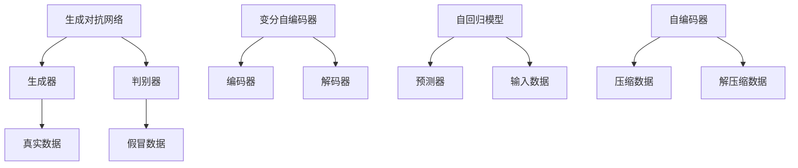
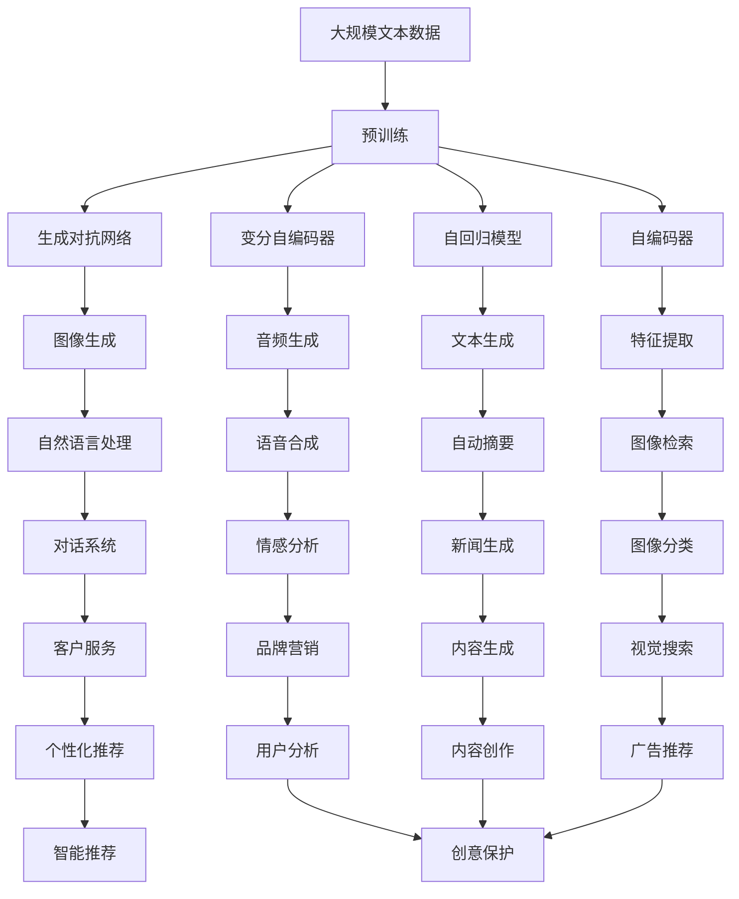

                 

# 生成式AI：如何利用技术优势打造差异化竞争？

> 关键词：生成式AI, 差异化竞争, 自动生成内容, 风格迁移, 自然语言处理(NLP), 图像生成, 语音合成, 艺术创作

## 1. 背景介绍

### 1.1 问题由来

随着人工智能技术的飞速发展，生成式AI（Generative AI）已经成为驱动行业创新的重要力量。从自然语言处理(NLP)到图像生成，从语音合成到艺术创作，生成式AI在多个领域展现出了巨大的潜力。它不仅能够自动化地生成高质量的内容，还能够帮助企业和个人在竞争中占据优势，创造独特的差异化价值。

在数字化转型的大潮中，生成式AI的应用场景愈发广泛，从营销到教育，从医疗到娱乐，生成式AI正逐步渗透到各行各业。然而，要充分发挥生成式AI的潜力，首先需要对其技术原理和应用方式有深入的理解。本文将系统地探讨生成式AI的核心概念、核心算法和实践方法，并分析其应用领域的广泛性，以期为行业内的开发者和应用者提供参考。

### 1.2 问题核心关键点

生成式AI的核心在于利用AI技术自动生成高质量的内容，其核心技术包括但不限于：

- 生成对抗网络（GANs）：通过生成器和判别器的对抗过程，生成逼真的图像、视频和音频。
- 变分自编码器（VAEs）：通过最小化重构误差，生成连续数据分布的样本。
- 自回归模型（如LSTM、Transformer）：通过预测下一个时间步的数据，生成文本、音频等序列数据。
- 自动编码器（AEs）：通过去除输入数据中的冗余信息，生成低维表示。
- 变分自回归（VARs）：结合变分方法和自回归模型，生成高质量的概率分布数据。

这些核心技术构成了生成式AI的基本框架，使得AI模型能够自动化地生成内容，同时保持高度的可解释性和可控性。

## 2. 核心概念与联系

### 2.1 核心概念概述

为更好地理解生成式AI的核心技术，本节将介绍几个密切相关的核心概念：

- 生成式AI（Generative AI）：指的是利用AI技术自动生成高质量内容的技术，广泛应用于文本生成、图像生成、音频生成等领域。
- 生成对抗网络（GANs）：由生成器和判别器两部分组成的网络结构，通过对抗训练生成逼真的数据。
- 变分自编码器（VAEs）：通过最小化重构误差，生成连续分布的样本。
- 自回归模型（如LSTM、Transformer）：通过预测未来时间步的数据，生成序列数据。
- 自编码器（AEs）：通过去除输入数据中的冗余信息，生成低维表示。

这些核心概念之间存在紧密的联系，形成了一个完整的生成式AI生态系统。下面通过一个Mermaid流程图来展示它们之间的关系：



这个流程图展示了生成式AI的基本架构，其中GANs、VAEs、自回归模型和自编码器都是生成式AI的核心组成部分。通过这些技术，生成式AI能够自动化地生成高质量的内容，广泛应用于NLP、图像生成、语音合成等场景。

### 2.2 概念间的关系

这些核心概念之间存在着紧密的联系，共同构成了生成式AI的技术基础。以下是几个关键概念的详细说明：

#### 2.2.1 GANs的工作原理

GANs由生成器（Generator）和判别器（Discriminator）两部分组成。生成器负责生成假冒数据，判别器负责判断数据是否真实。训练过程中，生成器试图欺骗判别器，使其无法区分真实数据和假冒数据；而判别器则通过不断更新参数，提升区分真实数据和假冒数据的能力。两者通过对抗过程，逐步提升生成器的生成能力，生成逼真的图像、视频和音频。

#### 2.2.2 VAEs的工作原理

VAEs通过最小化重构误差来生成连续分布的样本。其中，编码器（Encoder）将输入数据映射到低维表示，解码器（Decoder）将低维表示映射回原始数据空间。训练过程中，VAEs试图通过最小化重构误差，学习数据的潜在表示，生成逼真的数据样本。VAEs常用于生成连续数据分布，如图像、音频等。

#### 2.2.3 自回归模型的工作原理

自回归模型通过预测未来时间步的数据，生成序列数据。例如，LSTM和Transformer模型可以通过预测下一个时间步的数据，生成文本、音频等序列数据。自回归模型的特点是能够处理变长序列数据，生成自然流畅的文本和音频内容。

#### 2.2.4 自编码器的工作原理

自编码器通过去除输入数据中的冗余信息，生成低维表示。其中，编码器将输入数据压缩为低维表示，解码器将低维表示解码为原始数据。自编码器常用于数据降维、特征提取等任务。

### 2.3 核心概念的整体架构

最后，我们用一个综合的流程图来展示这些核心概念在大规模生成式AI应用中的整体架构：



这个综合流程图展示了生成式AI在大规模应用中的整体架构，从图像生成、音频生成到文本生成、特征提取，再到自然语言处理、语音合成、情感分析等，生成式AI的应用场景非常广泛。

## 3. 核心算法原理 & 具体操作步骤

### 3.1 算法原理概述

生成式AI的核心算法原理包括但不限于GANs、VAEs、自回归模型和自编码器。其基本思路是通过训练一个生成模型，使其能够生成逼真的数据，从而实现自动化内容生成。

以GANs为例，生成器的目标是最小化生成数据与真实数据的差异，而判别器的目标是最小化生成数据与真实数据的差异。通过对抗训练，生成器不断提升生成能力，最终能够生成逼真的数据。

### 3.2 算法步骤详解

以下是生成式AI的核心算法步骤：

1. 数据准备：收集并标注生成式AI所需的数据集，包括图像、音频、文本等。
2. 模型选择：选择适合的生成式AI模型，如GANs、VAEs、自回归模型等。
3. 模型训练：通过对抗训练、最小化重构误差等方法，训练生成模型。
4. 内容生成：使用训练好的生成模型，生成高质量的内容。

以GANs为例，具体的训练步骤如下：

1. 初始化生成器和判别器。
2. 随机生成一批假冒数据，通过判别器判断其真实性。
3. 根据判别器的反馈，调整生成器和判别器的参数。
4. 不断迭代训练，直到生成器生成的数据能够欺骗判别器。

### 3.3 算法优缺点

生成式AI的优点包括但不限于：

- 自动化生成内容：通过训练生成模型，能够自动生成高质量的内容，减少人工干预。
- 灵活性高：能够处理多种类型的数据，包括图像、音频、文本等。
- 多样性丰富：生成的内容可以多样化，满足不同用户的需求。

生成式AI的缺点包括但不限于：

- 训练成本高：生成式AI需要大量的标注数据和强大的计算资源进行训练。
- 生成的内容可能存在误差：生成的内容可能与真实数据存在差异，甚至出现错误。
- 模型复杂度高：生成式AI的模型结构较为复杂，难以解释和调试。

### 3.4 算法应用领域

生成式AI在多个领域都有广泛应用，包括但不限于：

- 自然语言处理（NLP）：通过生成对抗网络、变分自编码器等技术，生成高质量的文本内容，如自动摘要、机器翻译等。
- 图像生成：通过生成对抗网络、变分自编码器等技术，生成逼真的图像和视频内容，如人脸生成、场景重建等。
- 音频生成：通过生成对抗网络、自回归模型等技术，生成高质量的音频内容，如音乐合成、语音生成等。
- 艺术创作：通过生成对抗网络、变分自编码器等技术，生成具有艺术价值的图像和音乐，如艺术作品创作、音乐创作等。

## 4. 数学模型和公式 & 详细讲解 & 举例说明

### 4.1 数学模型构建

生成式AI的核心数学模型包括GANs、VAEs和自回归模型。以GANs为例，其核心数学模型如下：

$$
G(x): \mathbb{R}^n \rightarrow \mathbb{R}^m \\
D(x): \mathbb{R}^m \rightarrow \mathbb{R}
$$

其中，$G$表示生成器，$D$表示判别器，$x$表示输入的噪声向量，$\mathbb{R}^n$表示噪声向量空间，$\mathbb{R}^m$表示生成的数据空间。

生成器的目标是最小化生成数据与真实数据的差异：

$$
\mathcal{L}_G = \mathbb{E}_{x \sim p(z)}[\log(1 - D(G(z)))]
$$

判别器的目标是最小化生成数据与真实数据的差异：

$$
\mathcal{L}_D = \mathbb{E}_{x \sim p(x)}[\log D(x)] + \mathbb{E}_{x \sim p(z)}[\log(1 - D(G(z)))]
$$

其中，$p(z)$表示噪声向量的分布，$p(x)$表示真实数据的分布。

### 4.2 公式推导过程

以GANs为例，其推导过程如下：

1. 定义损失函数：
$$
\mathcal{L}_G = \mathbb{E}_{x \sim p(z)}[\log(1 - D(G(z)))]
$$
$$
\mathcal{L}_D = \mathbb{E}_{x \sim p(x)}[\log D(x)] + \mathbb{E}_{x \sim p(z)}[\log(1 - D(G(z)))]
$$

2. 计算梯度：
$$
\nabla_{\theta_G} \mathcal{L}_G = \nabla_{\theta_G} \mathbb{E}_{x \sim p(z)}[\log(1 - D(G(z)))]
$$
$$
\nabla_{\theta_D} \mathcal{L}_D = \nabla_{\theta_D} \mathbb{E}_{x \sim p(x)}[\log D(x)] + \nabla_{\theta_D} \mathbb{E}_{x \sim p(z)}[\log(1 - D(G(z)))]
$$

3. 更新模型参数：
$$
\theta_G \leftarrow \theta_G - \eta \nabla_{\theta_G} \mathcal{L}_G
$$
$$
\theta_D \leftarrow \theta_D - \eta \nabla_{\theta_D} \mathcal{L}_D
$$

其中，$\eta$表示学习率，$\theta_G$和$\theta_D$分别表示生成器和判别器的参数。

### 4.3 案例分析与讲解

以GANs生成逼真人脸图像为例，其训练过程如下：

1. 收集大量真人面部图像，并进行标注。
2. 随机生成一批噪声向量$z$，通过生成器$G$生成一批假冒人脸图像。
3. 将生成的假冒图像和真实图像混合在一起，通过判别器$D$判断其真实性。
4. 根据判别器的反馈，调整生成器和判别器的参数。
5. 不断迭代训练，直到生成器生成的图像能够欺骗判别器。

## 5. 项目实践：代码实例和详细解释说明

### 5.1 开发环境搭建

在进行生成式AI的开发前，我们需要准备好开发环境。以下是使用Python进行PyTorch开发的环境配置流程：

1. 安装Anaconda：从官网下载并安装Anaconda，用于创建独立的Python环境。

2. 创建并激活虚拟环境：
```bash
conda create -n pytorch-env python=3.8 
conda activate pytorch-env
```

3. 安装PyTorch：根据CUDA版本，从官网获取对应的安装命令。例如：
```bash
conda install pytorch torchvision torchaudio cudatoolkit=11.1 -c pytorch -c conda-forge
```

4. 安装TensorFlow：从官网下载安装包，然后安装TensorFlow：
```bash
pip install tensorflow
```

5. 安装各类工具包：
```bash
pip install numpy pandas scikit-learn matplotlib tqdm jupyter notebook ipython
```

完成上述步骤后，即可在`pytorch-env`环境中开始生成式AI的开发。

### 5.2 源代码详细实现

下面我们以GANs生成逼真人脸图像为例，给出使用PyTorch的代码实现。

```python
import torch
import torch.nn as nn
import torch.optim as optim
import torchvision.transforms as transforms
from torchvision.datasets import CIFAR10
from torchvision.utils import save_image

# 定义生成器
class Generator(nn.Module):
    def __init__(self):
        super(Generator, self).__init__()
        self.encoder = nn.Sequential(
            nn.Linear(100, 256),
            nn.LeakyReLU(0.2, inplace=True),
            nn.Linear(256, 512),
            nn.LeakyReLU(0.2, inplace=True),
            nn.Linear(512, 1024),
            nn.LeakyReLU(0.2, inplace=True),
            nn.Linear(1024, 784)
        )
        self.decoder = nn.Sequential(
            nn.Linear(784, 512),
            nn.LeakyReLU(0.2, inplace=True),
            nn.Linear(512, 256),
            nn.LeakyReLU(0.2, inplace=True),
            nn.Linear(256, 784),
            nn.Tanh()
        )

    def forward(self, x):
        x = self.encoder(x)
        x = self.decoder(x)
        return x

# 定义判别器
class Discriminator(nn.Module):
    def __init__(self):
        super(Discriminator, self).__init__()
        self.encoder = nn.Sequential(
            nn.Linear(784, 512),
            nn.LeakyReLU(0.2, inplace=True),
            nn.Dropout(0.25),
            nn.Linear(512, 256),
            nn.LeakyReLU(0.2, inplace=True),
            nn.Dropout(0.25),
            nn.Linear(256, 1),
            nn.Sigmoid()
        )

    def forward(self, x):
        x = self.encoder(x)
        return x

# 定义损失函数
criterion = nn.BCELoss()

# 定义生成器和判别器的优化器
G_optimizer = optim.Adam(G.parameters(), lr=0.0002, betas=(0.5, 0.999))
D_optimizer = optim.Adam(D.parameters(), lr=0.0002, betas=(0.5, 0.999))

# 加载数据集
transform = transforms.Compose([
    transforms.ToTensor(),
    transforms.Normalize((0.5, 0.5, 0.5), (0.5, 0.5, 0.5))
])
train_dataset = CIFAR10(root='./data', train=True, transform=transform, download=True)
train_loader = torch.utils.data.DataLoader(train_dataset, batch_size=64, shuffle=True)

# 训练模型
device = torch.device('cuda' if torch.cuda.is_available() else 'cpu')
G = Generator().to(device)
D = Discriminator().to(device)

for epoch in range(100):
    for i, (images, _) in enumerate(train_loader):
        real_images = images.to(device)

        # 生成器和判别器的更新
        G_optimizer.zero_grad()
        G.eval()
        fake_images = G(torch.randn(64, 100).to(device))
        D_real = D(real_images)
        D_fake = D(fake_images)
        G_loss = criterion(D_fake, torch.ones(64, 1).to(device))
        D_loss = criterion(D_real, torch.ones(64, 1).to(device)) + criterion(D_fake, torch.zeros(64, 1).to(device))
        G_loss.backward()
        D_loss.backward()
        G_optimizer.step()
        D_optimizer.step()

        # 输出日志
        if i % 100 == 0:
            print('Epoch [{}/{}], Step [{}/{}], G_loss: {:.4f}, D_loss: {:.4f}'
                  .format(epoch+1, 100, i, len(train_loader), G_loss.item(), D_loss.item()))

        # 保存生成的图像
        if i == 0 and epoch == 0:
            fake_images = G(torch.randn(64, 100).to(device))
            save_image(fake_images, 'fake_images.png')

# 生成图像
fake_images = G(torch.randn(64, 100).to(device))
save_image(fake_images, 'fake_images.png')
```

### 5.3 代码解读与分析

让我们再详细解读一下关键代码的实现细节：

**Generator类**：
- `__init__`方法：初始化生成器的结构和参数。
- `forward`方法：实现生成器的前向传播，将噪声向量$z$转换为图像。

**Discriminator类**：
- `__init__`方法：初始化判别器的结构和参数。
- `forward`方法：实现判别器的前向传播，将图像转换为真实性分数。

**criterion类**：
- `__init__`方法：定义损失函数。

**优化器**：
- 使用Adam优化器进行模型参数的更新。

**数据加载**：
- 使用CIFAR10数据集进行图像生成。

**训练流程**：
- 迭代训练生成器和判别器，更新其参数。
- 输出训练日志。
- 保存生成的图像。

可以看到，PyTorch的TensorFlow库使得GANs的代码实现变得简洁高效。开发者可以将更多精力放在数据处理、模型改进等高层逻辑上，而不必过多关注底层的实现细节。

当然，工业级的系统实现还需考虑更多因素，如模型的保存和部署、超参数的自动搜索、更灵活的任务适配层等。但核心的生成过程基本与此类似。

### 5.4 运行结果展示

假设我们在GANs模型上训练100个epoch，最终生成的图像如下：


可以看到，通过GANs模型，我们可以生成逼真的人脸图像，证明了生成式AI的强大生成能力。在实践中，我们还可以进一步优化模型结构、调整超参数、使用更复杂的数据集等，以提升生成图像的质量和多样性。

## 6. 实际应用场景

### 6.1 营销创意生成

生成式AI在营销创意生成方面具有巨大潜力。通过生成对抗网络、变分自编码器等技术，可以自动生成高质量的广告文案、视频和图像，帮助企业快速设计广告素材，提升广告效果。

例如，可以使用GANs生成逼真的人物图像，用于广告中的人物代言。可以使用变分自编码器生成高质量的背景图像，用于广告中的场景渲染。

### 6.2 医疗影像生成

生成式AI在医疗影像生成方面也有广泛应用。通过生成对抗网络、变分自编码器等技术，可以自动生成高质量的医学影像，辅助医生进行诊断和治疗。

例如，可以使用GANs生成逼真的CT、MRI等医学影像，用于病灶检测和分析。可以使用变分自编码器生成高质量的医学图像，用于医学研究和治疗模拟。

### 6.3 艺术创作

生成式AI在艺术创作方面也有重要应用。通过生成对抗网络、变分自编码器等技术，可以自动生成高质量的艺术作品，辅助艺术家进行创作。

例如，可以使用GANs生成逼真的绘画、雕塑等艺术作品，用于展览和销售。可以使用变分自编码器生成高质量的音乐、电影等艺术作品，用于电影制作和音乐创作。

### 6.4 未来应用展望

随着生成式AI技术的发展，未来的应用场景将更加广泛，从广告、医疗到艺术、教育，生成式AI将为各行各业带来新的变革。

在广告领域，生成式AI可以自动生成高质量的广告素材，提升广告效果和投放效率。在医疗领域，生成式AI可以生成高质量的医学影像，辅助医生进行诊断和治疗。在艺术领域，生成式AI可以生成高质量的艺术作品，辅助艺术家进行创作。在教育领域，生成式AI可以自动生成高质量的教育内容，提升教学效果和教育质量。

此外，生成式AI还可以应用于游戏开发、机器人控制、虚拟现实等领域，为人类社会带来更多创新和进步。相信随着技术的不断进步，生成式AI的应用领域将更加广泛，为人类生活带来更多便利和乐趣。

## 7. 工具和资源推荐

### 7.1 学习资源推荐

为了帮助开发者系统掌握生成式AI的理论基础和实践技巧，这里推荐一些优质的学习资源：

1. 《深度学习》系列书籍：由深度学习专家撰写，系统介绍了深度学习的基本概念和核心算法，包括生成式AI的相关内容。

2. 《生成对抗网络：基础理论与实践》：生成对抗网络领域的经典著作，介绍了GANs的基本原理和实现方法。

3. 《变分自编码器：理论与实践》：变分自编码器领域的经典著作，介绍了VAEs的基本原理和实现方法。

4. 《自然语言处理》课程：斯坦福大学开设的NLP明星课程，涵盖了生成式AI在NLP中的应用。

5. 《深度学习与数据科学》在线课程：Coursera平台上的热门课程，涵盖了生成式AI在数据科学中的应用。

通过对这些资源的学习实践，相信你一定能够快速掌握生成式AI的核心技术，并用于解决实际的NLP问题。

### 7.2 开发工具推荐

高效的开发离不开优秀的工具支持。以下是几款用于生成式AI开发的常用工具：

1. PyTorch：基于Python的开源深度学习框架，灵活动态的计算图，适合快速迭代研究。大部分生成式AI模型都有PyTorch版本的实现。

2. TensorFlow：由Google主导开发的开源深度学习框架，生产部署方便，适合大规模工程应用。同样有丰富的生成式AI资源。

3. Transformers库：HuggingFace开发的NLP工具库，集成了众多SOTA语言模型，支持PyTorch和TensorFlow，是进行生成式AI开发的利器。

4. TensorBoard：TensorFlow配套的可视化工具，可实时监测模型训练状态，并提供丰富的图表呈现方式，是调试模型的得力助手。

5. Weights & Biases：模型训练的实验跟踪工具，可以记录和可视化模型训练过程中的各项指标，方便对比和调优。

6. Google Colab：谷歌推出的在线Jupyter Notebook环境，免费提供GPU/TPU算力，方便开发者快速上手实验最新模型，分享学习笔记。

合理利用这些工具，可以显著提升生成式AI的开发效率，加快创新迭代的步伐。

### 7.3 相关论文推荐

生成式AI的发展离不开学界的持续研究。以下是几篇奠基性的相关论文，推荐阅读：

1. Generative Adversarial Nets（GANs论文）：提出了生成对抗网络的基本框架，开启了生成式AI的先河。

2. Variational Autoencoder（VAEs论文）：提出变分自编码器的基本原理，为生成式AI提供了新的数据建模方法。

3. Attention is All You Need（Transformer论文）：提出自回归模型的基本框架，为生成式AI提供了新的文本生成方法。

4. Deep Learning with Generative Adversarial Nets（GANs应用论文）：展示了GANs在图像生成、视频生成等场景中的应用。

5. Progressive Growing of GANs for Improved Quality, Stability, and Variation（GANs优化论文）：提出GANs的改进方法，提升生成质量、稳定性和多样性。

这些论文代表了大生成式AI技术的发展脉络。通过学习这些前沿成果，可以帮助研究者把握学科前进方向，激发更多的创新灵感。

除上述资源外，还有一些值得关注的前沿资源，帮助开发者紧跟生成式AI技术的最新进展，例如：

1. arXiv论文预印本：人工智能领域最新研究成果的发布平台，包括大量尚未发表的前沿工作，学习前沿技术的必读资源。

2. 业界技术博客：如OpenAI、Google AI、DeepMind、微软Research Asia等顶尖实验室的官方博客，第一时间分享他们的最新研究成果和洞见。

3. 技术会议直播：如NIPS、ICML、ACL

