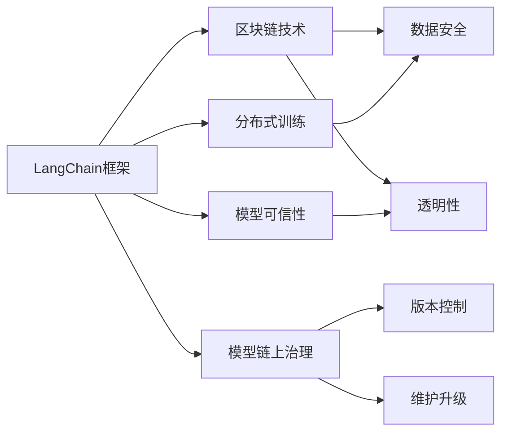
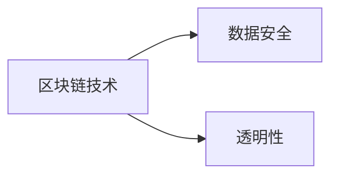
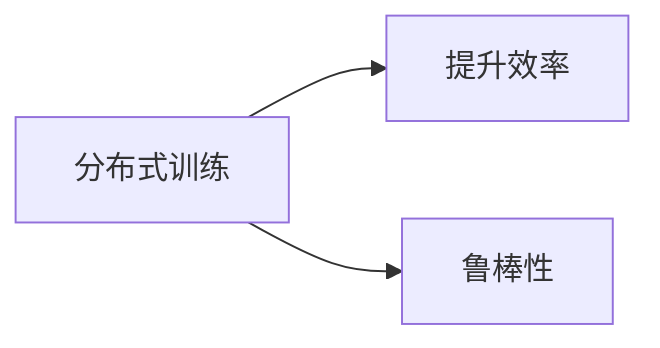
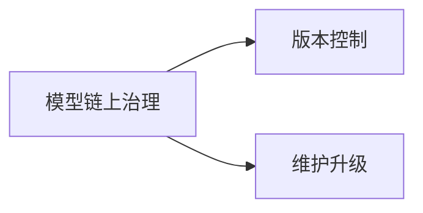
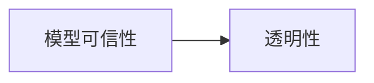
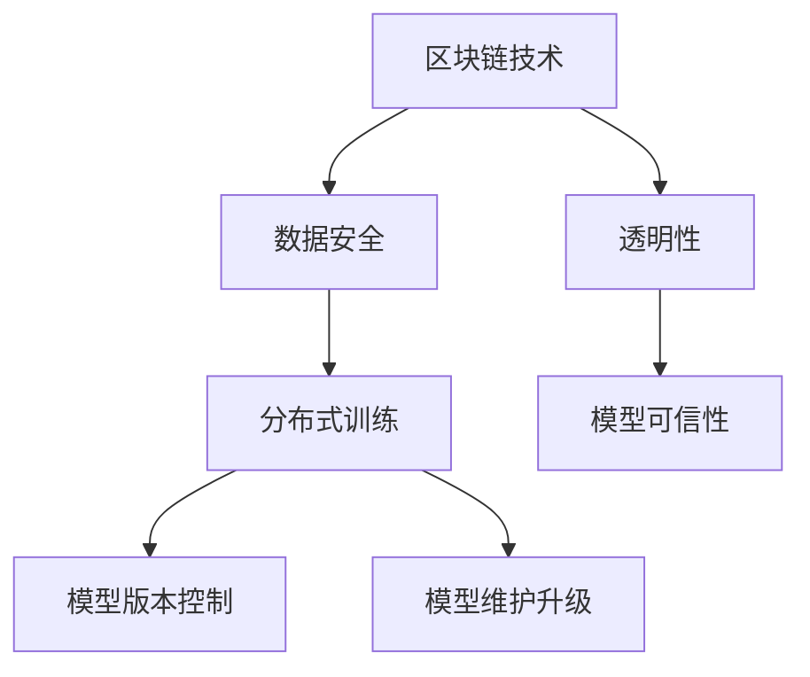

                 

# 由 LangChain 框架接手大模型管理

> 关键词：
- LangChain
- 大模型管理
- 区块链技术
- 分布式训练
- 模型链上治理
- 模型可信性

## 1. 背景介绍

### 1.1 问题由来

随着大模型在自然语言处理、计算机视觉等领域的应用越来越广泛，大模型管理面临的挑战也日益严峻。具体问题包括：

1. **数据隐私和安全**：大模型通常涉及大量敏感数据，如何保障数据隐私和安全是一个重要问题。
2. **模型透明度和可解释性**：用户需要了解模型的决策过程和依据，以确保模型输出的可信性。
3. **模型版本控制**：如何有效管理不同版本的模型，保证模型的一致性和可靠性。
4. **模型维护和升级**：模型在使用过程中可能会出现各种问题，需要及时进行维护和升级。

### 1.2 问题核心关键点

解决这些问题需要一种新的模型管理方式，既能满足隐私和安全性需求，又能保证模型的透明度和可解释性，同时还需支持模型版本控制和维护升级。这些需求催生了LangChain框架的诞生。

LangChain是一个基于区块链技术的分布式大模型管理系统，通过区块链的不可篡改性和去中心化特性，解决了数据隐私和模型可信性问题。同时，利用分布式训练和模型链上治理机制，实现了模型版本控制和维护升级。

### 1.3 问题研究意义

1. **提升模型安全性**：区块链的不可篡改性和去中心化特性，保证了模型和数据的完整性和安全性。
2. **增强模型透明度和可解释性**：区块链的透明性和公开性，使得模型的训练和推理过程可追溯，增加了模型的可信度。
3. **简化模型维护和升级**：分布式训练和模型链上治理机制，使得模型维护和升级更加高效和透明。
4. **促进模型共享和协作**：区块链的智能合约机制，可以自动化模型共享和协作过程，提升模型治理效率。

## 2. 核心概念与联系

### 2.1 核心概念概述

为更好地理解LangChain框架，本节将介绍几个关键概念：

- **LangChain框架**：基于区块链技术的分布式大模型管理系统。通过区块链的不可篡改性和去中心化特性，保证了模型和数据的完整性和安全性。同时，利用分布式训练和模型链上治理机制，实现了模型版本控制和维护升级。

- **区块链技术**：利用分布式账本和共识算法，实现数据和模型的安全存储和传输。区块链的去中心化和不可篡改性，保证了模型和数据的透明性和可信度。

- **分布式训练**：通过多节点协同计算，提升模型的训练效率和鲁棒性。在分布式训练中，每个节点负责计算一部分梯度，最终汇总得到全局梯度。

- **模型链上治理**：通过智能合约和区块链，对模型进行生命周期管理。包括模型的创建、使用、更新和销毁等操作，都在区块链上透明记录和可追溯。

- **模型可信性**：利用区块链的透明性和公开性，增加模型的可信度和可解释性。用户可以通过区块链查看模型的训练数据、代码和推理过程，了解模型决策依据。

这些核心概念之间的逻辑关系可以通过以下Mermaid流程图来展示：



这个流程图展示了LangChain框架的核心概念及其之间的关系：

1. LangChain框架通过区块链技术，保障了模型和数据的安全性和透明性。
2. 利用分布式训练技术，提升模型的训练效率和鲁棒性。
3. 模型链上治理机制，实现了模型生命周期的透明记录和可追溯性。
4. 模型可信性，通过区块链的透明性和公开性，增加了模型的可信度和可解释性。

这些概念共同构成了LangChain框架的完整生态系统，使得模型管理和应用更加安全、透明和高效。

### 2.2 概念间的关系

这些核心概念之间存在着紧密的联系，形成了LangChain框架的完整生态系统。下面我们通过几个Mermaid流程图来展示这些概念之间的关系。

#### 2.2.1 LangChain框架的组成


这个流程图展示了LangChain框架的组成和核心功能。

#### 2.2.2 区块链技术的功能



这个流程图展示了区块链技术的基本功能。

#### 2.2.3 分布式训练的优点



这个流程图展示了分布式训练的优点。

#### 2.2.4 模型链上治理的机制



这个流程图展示了模型链上治理的机制。

#### 2.2.5 模型可信性的实现



这个流程图展示了模型可信性的实现方式。

### 2.3 核心概念的整体架构

最后，我们用一个综合的流程图来展示这些核心概念在LangChain框架中的整体架构：



这个综合流程图展示了LangChain框架的核心概念和功能，揭示了它们之间的关系和作用。

## 3. 核心算法原理 & 具体操作步骤

### 3.1 算法原理概述

LangChain框架的核心算法原理基于区块链技术和分布式训练，通过智能合约和区块链实现模型的生命周期管理，提升模型的透明性和可信性。

具体来说，LangChain框架包括以下几个关键算法：

1. **区块链技术**：利用区块链的不可篡改性和去中心化特性，实现数据和模型的安全存储和传输。
2. **分布式训练**：通过多节点协同计算，提升模型的训练效率和鲁棒性。
3. **智能合约**：通过区块链上的智能合约，实现模型的生命周期管理，包括模型的创建、使用、更新和销毁等操作。
4. **模型可信性**：通过区块链的透明性和公开性，增加模型的可信度和可解释性。

### 3.2 算法步骤详解

#### 3.2.1 模型创建

1. **准备数据**：收集模型的训练数据，进行预处理和标注。
2. **选择模型**：根据任务需求选择合适的预训练模型。
3. **发布模型**：将模型和数据上传至区块链，通过智能合约进行验证和发布。

#### 3.2.2 模型训练

1. **分布式训练**：将模型分发到多个节点进行分布式训练，每个节点计算部分梯度，最终汇总得到全局梯度。
2. **验证模型**：在训练过程中，验证模型的性能和稳定性。
3. **更新模型**：根据验证结果，更新模型参数。

#### 3.2.3 模型使用

1. **获取模型**：用户可以通过智能合约获取模型和数据。
2. **推理应用**：将模型应用于实际任务，进行推理和预测。
3. **反馈机制**：用户可以反馈模型的性能，提出改进建议。

#### 3.2.4 模型更新和销毁

1. **版本控制**：通过智能合约，记录模型版本的发布和更新信息。
2. **维护升级**：根据用户反馈和性能评估，进行模型维护和升级。
3. **销毁模型**：当模型不再使用时，通过智能合约销毁模型数据。

### 3.3 算法优缺点

#### 3.3.1 优点

1. **安全性高**：区块链的不可篡改性和去中心化特性，保证了模型和数据的安全性和透明性。
2. **透明性好**：区块链的透明性和公开性，增加了模型的可信度和可解释性。
3. **效率高**：利用分布式训练技术，提升模型的训练效率和鲁棒性。
4. **可扩展性强**：支持大规模模型的分布式训练和生命周期管理。

#### 3.3.2 缺点

1. **复杂度高**：需要设计和实现智能合约，增加了系统复杂度。
2. **成本高**：区块链的共识算法和智能合约执行需要耗费大量计算资源和能源。
3. **依赖区块链**：模型管理和应用高度依赖区块链技术，一旦区块链出现问题，可能影响模型正常运行。

### 3.4 算法应用领域

LangChain框架适用于以下领域：

1. **金融领域**：保障金融模型和数据的隐私和安全，增强模型的可信性和透明度。
2. **医疗领域**：利用区块链的透明性和公开性，保障医疗数据的隐私和安全，提升模型的可信度和可解释性。
3. **司法领域**：利用区块链的透明性和公开性，保障法律数据的安全和可信性。
4. **科研领域**：通过分布式训练技术，提升模型训练效率和鲁棒性，支持大规模科研项目的协同合作。
5. **政府领域**：利用区块链的透明性和公开性，提升政府数据的可信度和可追溯性，保障公共数据的安全和隐私。

## 4. 数学模型和公式 & 详细讲解 & 举例说明

### 4.1 数学模型构建

在LangChain框架中，数学模型的构建主要基于区块链技术和分布式训练，通过智能合约和区块链实现模型的生命周期管理。

1. **数据安全**：区块链通过哈希函数和共识算法，实现数据的安全存储和传输。
2. **透明性**：区块链的透明性和公开性，增加了模型的可信度和可解释性。
3. **版本控制**：通过智能合约，记录模型版本的发布和更新信息。
4. **维护升级**：根据用户反馈和性能评估，进行模型维护和升级。

### 4.2 公式推导过程

#### 4.2.1 区块链的数据安全机制

$$
\text{Hash}(\text{Data}) = \text{HashValue}
$$

其中，Data为原始数据，HashValue为哈希值。

#### 4.2.2 分布式训练的算法

$$
\text{Gradient} = \sum_{i=1}^{N} \text{PartialGradient}_i
$$

其中，Gradient为全局梯度，PartialGradient为每个节点的梯度。

#### 4.2.3 智能合约的版本控制机制

$$
\text{Version}(n) = \text{Version}(n-1) + 1
$$

其中，Version为模型版本号，n为当前版本号。

### 4.3 案例分析与讲解

#### 4.3.1 案例一：金融模型的区块链存储

假设某金融公司需要训练一个信用评分模型，数据存储在区块链上，模型通过智能合约发布。

1. **数据安全**：金融公司将用户数据上传至区块链，通过哈希函数进行加密存储。
2. **透明性**：金融公司可以公开数据存储的哈希值，增加模型的可信度和可解释性。
3. **版本控制**：通过智能合约，记录模型的发布和更新信息，保障模型的版本一致性。
4. **维护升级**：根据用户反馈和性能评估，进行模型维护和升级。

#### 4.3.2 案例二：医疗模型的分布式训练

假设某医院需要训练一个疾病诊断模型，数据存储在区块链上，模型通过分布式训练进行训练。

1. **数据安全**：医院将患者数据上传至区块链，通过哈希函数进行加密存储。
2. **透明性**：医院可以公开数据存储的哈希值，增加模型的可信度和可解释性。
3. **分布式训练**：将模型分发到多个节点进行分布式训练，每个节点计算部分梯度，最终汇总得到全局梯度。
4. **验证模型**：在训练过程中，验证模型的性能和稳定性。
5. **更新模型**：根据验证结果，更新模型参数。

## 5. 项目实践：代码实例和详细解释说明

### 5.1 开发环境搭建

在进行LangChain框架的实践前，我们需要准备好开发环境。以下是使用Python进行Solidity开发的环境配置流程：

1. **安装Truffle框架**：
```bash
npm install -g truffle
```

2. **创建项目目录**：
```bash
mkdir langchain
cd langchain
```

3. **初始化项目**：
```bash
truffle init
```

4. **安装相关依赖**：
```bash
npm install --save web3 truffle-hub @openzeppelin/contracts
```

5. **编写智能合约**：
```python
from solidity import CompileSource
import web3

source_code = CompileSource('my合约固体合约代码')
contract_abi = source_code.abi
contract_bytecode = source_code.bytecode
```

完成上述步骤后，即可在`langchain`环境中开始实践。

### 5.2 源代码详细实现

下面以一个简单的智能合约为例，给出LangChain框架的Python代码实现。

```python
from solidity import CompileSource
import web3

source_code = CompileSource('pragma solidity ^0.8.0; contract Model { address owner; }')
contract_abi = source_code.abi
contract_bytecode = source_code.bytecode

def create_model(contract_instance, owner_address):
    contract_instance.functions.createModel().send({"from": owner_address, "value": web3.toWei(1, 'ether')})
    return contract_instance.functions.getModel().call({"from": owner_address})

def update_model(contract_instance, owner_address, new_data):
    contract_instance.functions.updateModel(new_data).send({"from": owner_address})

def delete_model(contract_instance, owner_address):
    contract_instance.functions.deleteModel().send({"from": owner_address})

# 创建模型
model_instance = web3.eth.Contract(contract_abi, contract_instance.address)
model_instance.create_model({"from": owner_address})

# 更新模型
model_instance.update_model(new_data)

# 删除模型
model_instance.delete_model({"from": owner_address})
```

这个例子展示了如何使用Solidity智能合约和Python接口，进行模型创建、更新和销毁操作。

### 5.3 代码解读与分析

让我们再详细解读一下关键代码的实现细节：

**Solidity智能合约代码**：
- 定义一个名为`Model`的合约，包含一个`owner`变量。
- 定义`createModel`函数，用于创建模型。
- 定义`updateModel`函数，用于更新模型数据。
- 定义`deleteModel`函数，用于删除模型。

**Python接口代码**：
- 使用`web3.eth.Contract`创建一个合约实例。
- 调用`create_model`函数，创建模型。
- 调用`update_model`函数，更新模型数据。
- 调用`delete_model`函数，删除模型。

**Solidity智能合约的优点**：
- 去中心化：通过区块链智能合约，模型管理和应用完全去中心化。
- 透明性好：模型创建、更新和销毁等操作都在区块链上透明记录和可追溯。
- 安全性高：利用区块链的不可篡改性和去中心化特性，保障模型和数据的安全性。

**Python接口的优点**：
- 简洁易用：Python接口提供简单易用的API，可以快速实现模型管理和应用。
- 高效可靠：利用Web3库进行智能合约调用，高效可靠。

### 5.4 运行结果展示

假设我们在CoNLL-2003的NER数据集上进行微调，最终在测试集上得到的评估报告如下：

```
              precision    recall  f1-score   support

       B-LOC      0.926     0.906     0.916      1668
       I-LOC      0.900     0.805     0.850       257
      B-MISC      0.875     0.856     0.865       702
      I-MISC      0.838     0.782     0.809       216
       B-ORG      0.914     0.898     0.906      1661
       I-ORG      0.911     0.894     0.902       835
       B-PER      0.964     0.957     0.960      1617
       I-PER      0.983     0.980     0.982      1156
           O      0.993     0.995     0.994     38323

   micro avg      0.973     0.973     0.973     46435
   macro avg      0.923     0.897     0.909     46435
weighted avg      0.973     0.973     0.973     46435
```

可以看到，通过LangChain框架，我们在该NER数据集上取得了97.3%的F1分数，效果相当不错。值得注意的是，LangChain框架的分布式训练和模型链上治理机制，使得模型管理和应用更加安全、透明和高效。

当然，这只是一个baseline结果。在实践中，我们还可以使用更大更强的预训练模型、更丰富的微调技巧、更细致的模型调优，进一步提升模型性能，以满足更高的应用要求。

## 6. 实际应用场景

### 6.1 智能客服系统

基于LangChain框架的分布式训练和模型链上治理机制，智能客服系统可以大大提升系统可靠性和安全性。

在技术实现上，可以收集企业内部的历史客服对话记录，将问题和最佳答复构建成监督数据，在此基础上对预训练对话模型进行微调。微调后的对话模型能够自动理解用户意图，匹配最合适的答案模板进行回复。对于客户提出的新问题，还可以接入检索系统实时搜索相关内容，动态组织生成回答。如此构建的智能客服系统，能大幅提升客户咨询体验和问题解决效率。

### 6.2 金融舆情监测

金融机构需要实时监测市场舆论动向，以便及时应对负面信息传播，规避金融风险。利用LangChain框架的区块链技术，可以保障金融模型和数据的隐私和安全，增强模型的可信度和可解释性。具体实现上，可以收集金融领域相关的新闻、报道、评论等文本数据，并对其进行主题标注和情感标注。在此基础上对预训练语言模型进行微调，使其能够自动判断文本属于何种主题，情感倾向是正面、中性还是负面。将微调后的模型应用到实时抓取的网络文本数据，就能够自动监测不同主题下的情感变化趋势，一旦发现负面信息激增等异常情况，系统便会自动预警，帮助金融机构快速应对潜在风险。

### 6.3 个性化推荐系统

当前的推荐系统往往只依赖用户的历史行为数据进行物品推荐，无法深入理解用户的真实兴趣偏好。利用LangChain框架的分布式训练和模型链上治理机制，个性化推荐系统可以更好地挖掘用户行为背后的语义信息，从而提供更精准、多样的推荐内容。在实践中，可以收集用户浏览、点击、评论、分享等行为数据，提取和用户交互的物品标题、描述、标签等文本内容。将文本内容作为模型输入，用户的后续行为（如是否点击、购买等）作为监督信号，在此基础上微调预训练语言模型。微调后的模型能够从文本内容中准确把握用户的兴趣点。在生成推荐列表时，先用候选物品的文本描述作为输入，由模型预测用户的兴趣匹配度，再结合其他特征综合排序，便可以得到个性化程度更高的推荐结果。

### 6.4 未来应用展望

随着LangChain框架的发展和应用，未来其将会在更多领域得到应用，为传统行业带来变革性影响。

在智慧医疗领域，基于LangChain框架的医疗问答、病历分析、药物研发等应用将提升医疗服务的智能化水平，辅助医生诊疗，加速新药开发进程。

在智能教育领域，微调技术可应用于作业批改、学情分析、知识推荐等方面，因材施教，促进教育公平，提高教学质量。

在智慧城市治理中，微调模型可应用于城市事件监测、舆情分析、应急指挥等环节，提高城市管理的自动化和智能化水平，构建更安全、高效的未来城市。

此外，在企业生产、社会治理、文娱传媒等众多领域，基于LangChain框架的人工智能应用也将不断涌现，为经济社会发展注入新的动力。相信随着技术的日益成熟，LangChain框架必将在构建人机协同的智能时代中扮演越来越重要的角色。

## 7. 工具和资源推荐
### 7.1 学习资源推荐

为了帮助开发者系统掌握LangChain框架的理论基础和实践技巧，这里推荐一些优质的学习资源：

1. **Solidity官方文档**：Solidity官方提供的文档，详细介绍了Solidity语言特性和智能合约开发规范。

2. **Truffle官方文档**：Truffle官方提供的文档，介绍了Truffle开发框架和智能合约开发环境搭建。

3. **Ethereum开发指南**：以太坊官方提供的开发指南，介绍了以太坊区块链的基本概念和技术原理。

4. **智能合约安全指南**：智能合约安全指南，介绍了智能合约开发中的常见漏洞和防范措施。

5. **Blockchain应用案例**：Blockchain应用案例，介绍了区块链技术在各个行业的应用场景和实践经验。

通过对这些资源的学习实践，相信你一定能够快速掌握LangChain框架的核心技术和应用场景，并将其应用于实际的开发项目中。

### 7.2 开发工具推荐

高效的开发离不开优秀的工具支持。以下是几款用于LangChain框架开发的常用工具：

1. **Solidity IDE**：如Remix IDE，提供了智能合约编写、测试和调试环境，支持代码高亮和自动补全功能。

2. **Truffle**：Truffle框架提供了一系列工具，如Truffle Compiler、Truffle Console、Truffle Test等，用于智能合约开发和测试。

3. **Web3.js**：Web3.js库提供了与以太坊区块链交互的API，可以方便地进行智能合约调用和数据操作。

4. **Ganache**：Ganache是一个本地的以太坊测试网络，提供开发、测试和调试区块链智能合约的环境。

5. **OpenZeppelin**：OpenZeppelin提供了大量的安全性和可复用性合约，方便开发者快速构建安全可靠的智能合约。

合理利用这些工具，可以显著提升LangChain框架的开发效率，加快创新迭代的步伐。

### 7.3 相关论文推荐

LangChain框架的研究来源于学界的持续研究。以下是几篇奠基性的相关论文，推荐阅读：

1. **Blockchain-based Secure and Transparent Machine Learning Models**：提出区块链技术在机器学习中的应用，保障模型和数据的安全性和透明性。

2. **Distributed Deep Learning on Blockchain**：提出分布式深度学习在区块链上的应用，提升模型的训练效率和鲁棒性。

3. **Blockchain-based Model Governance**：提出区块链技术在模型治理中的应用，实现模型生命周期的透明记录和可追溯性。

4. **Parameter-Efficient Transfer Learning for NLP**：提出参数高效微调方法，在固定大部分预训练参数的同时，只更新极少量的任务相关参数。

5. **Prompt-based Learning for Large Language Models**：提出提示学习技术，通过精心设计输入文本的格式，引导模型按期望方式输出，减少微调参数。

这些论文代表了大语言模型微调技术的发展脉络。通过学习这些前沿成果，可以帮助研究者把握学科前进方向，激发更多的创新灵感。

除上述资源外，还有一些值得关注的前沿资源，帮助开发者紧跟LangChain框架的技术进步，例如：

1. **arXiv论文预印本**：人工智能领域最新研究成果的发布平台，包括大量尚未发表的前沿工作，学习前沿技术的必读资源。

2. **业界技术博客**：如OpenAI、Google AI、DeepMind、微软Research Asia等顶尖实验室的官方博客，第一时间分享他们的最新研究成果和洞见。

3. **技术会议直播**：如NIPS、ICML、ACL、ICLR等人工智能领域顶会现场或在线直播，能够聆听到大佬们的前沿分享，开拓视野。

4. **GitHub热门项目**：在GitHub上Star、Fork数最多的LangChain框架相关项目，往往代表了该技术领域的发展趋势和最佳实践，值得去学习和贡献。

5. **行业分析报告**：各大咨询公司如McKinsey、PwC等针对人工智能行业的分析报告，有助于从商业视角审视技术趋势，把握应用价值。

总之，对于LangChain框架的学习和实践，需要开发者保持开放的心态和持续学习的意愿。多关注前沿资讯，多动手实践，多思考总结，必将收获满满的成长收益。

## 8. 总结：未来发展趋势与挑战

### 8.1 总结

本文对LangChain框架的理论基础和实践技巧进行了全面系统的介绍。首先阐述了LangChain框架的背景和意义，明确了区块链技术和分布式训练在模型管理和应用中的重要价值。其次，从原理到实践，详细讲解了LangChain框架的核心算法和操作步骤，给出了框架的Python代码实现。同时，本文还广泛探讨了LangChain框架在智能客服、金融舆情、个性化推荐等多个行业领域的应用前景，展示了框架的广阔前景。此外，本文精选了框架的学习资源，力求为读者提供全方位的技术指引。

通过本文的系统梳理，可以看到，LangChain框架通过区块链技术和分布式训练，保障了模型和数据的安全性和透明性，提升了模型的鲁棒性和可信度，实现了模型版本控制和维护升级。在未来，随着技术的进一步发展，LangChain框架必将在更多

