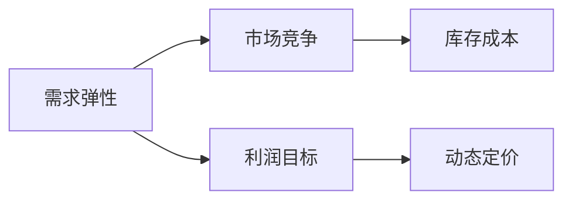

                 

# 电商价格优化的实际效果

## 1. 背景介绍

随着互联网的普及，电商已经成为了人们日常购物的主要渠道之一。电商平台通过海量交易数据驱动算法优化，精准匹配消费者需求和商品供应，极大地提升了购物体验和商家收益。其中，价格优化是电商竞争的核心环节，通过合理定价不仅能够提升销量，还能降低库存成本，实现商家和消费者的双赢。

然而，价格优化并不是一件简单的事情。它涉及到消费者心理、市场供需、竞争态势等多方面因素。传统的人工定价方法无法实时响应市场变化，难以兼顾多方面的决策因素。而利用大数据和机器学习技术，电商企业能够更精确地进行价格优化，实现动态调价，提高运营效率。

本文将重点介绍电商价格优化的实际效果，探讨基于数据驱动的动态调价方法，并分析其在实际应用中的效果和挑战。

## 2. 核心概念与联系

### 2.1 核心概念概述

在进行电商价格优化时，我们需要考虑以下几个关键概念：

- **需求弹性**：指价格变化对需求量的影响程度。若需求量对价格变化敏感，则称该商品需求弹性高。
- **市场竞争**：指同类别商品的价格竞争关系，影响消费者的价格敏感度。
- **库存成本**：指存储商品的固定成本和变动成本。通过合理定价，可以降低库存积压和损耗。
- **利润目标**：指电商平台通过调价所希望达到的利润最大化目标。
- **动态定价**：指根据市场实时变化，自动调整商品价格的方法。

以上概念之间存在紧密联系，需求弹性、市场竞争和库存成本是定价的基础，利润目标和动态定价是调价的核心。通过精确的分析和预测，电商平台可以在兼顾各方利益的前提下，实现最优定价策略。

### 2.2 核心概念间的关系

通过以下Mermaid流程图，我们可以更好地理解这些核心概念之间的关系：



这个流程图展示了电商价格优化过程中各个关键概念的关联性。需求弹性、市场竞争和库存成本是调价的基础，而利润目标和动态定价则是为了实现商家和消费者的共赢。

## 3. 核心算法原理 & 具体操作步骤
### 3.1 算法原理概述

电商价格优化的核心算法原理基于需求函数和收益函数的优化。需求函数描述了价格和需求量之间的关系，收益函数描述了价格和收益之间的关系。通过求解优化问题，找到使收益最大化的最优价格。

设需求函数为 $D(p)$，收益函数为 $R(p)$，则优化目标为：

$$
\max_{p} R(p) = p \cdot D(p)
$$

其中 $p$ 为商品价格，$D(p)$ 为需求量。求解该优化问题，可以得到最优价格 $p^*$。

### 3.2 算法步骤详解

电商价格优化的具体步骤如下：

**Step 1: 数据收集和预处理**
- 收集历史交易数据，包括价格、销量、季节性因素等。
- 清洗数据，处理缺失值和异常值，生成特征向量。

**Step 2: 需求模型拟合**
- 使用机器学习模型（如线性回归、随机森林等）拟合需求函数 $D(p)$。
- 引入特征工程，提取价格、销量、季节性等特征。
- 进行交叉验证，评估模型性能。

**Step 3: 收益模型拟合**
- 使用机器学习模型拟合收益函数 $R(p)$。
- 引入特征工程，提取价格、销量、成本等特征。
- 进行交叉验证，评估模型性能。

**Step 4: 价格优化**
- 求解优化问题 $\max_{p} R(p) = p \cdot D(p)$。
- 采用梯度下降等优化算法，求解最优价格 $p^*$。

**Step 5: 价格执行**
- 根据求解得到的最优价格 $p^*$，更新商品价格。
- 监控价格执行效果，进行实时调整。

### 3.3 算法优缺点

电商价格优化的算法具有以下优点：

- **实时性**：可以实时响应市场变化，及时调整价格。
- **数据驱动**：基于历史数据和模型预测，更科学合理。
- **高效性**：自动化调价，减少人工干预，提高效率。

但同时，该算法也存在以下缺点：

- **模型复杂度**：需要构建和拟合多个模型，计算复杂。
- **数据质量要求高**：模型性能依赖于数据质量，数据噪声和异常值会影响结果。
- **动态变化挑战**：市场变化多变，模型难以完全适应，需要不断调整。

### 3.4 算法应用领域

电商价格优化算法可以广泛应用于各类电商平台，涵盖服装、家电、食品等各类商品。具体应用场景包括：

- **销售预测与库存管理**：基于历史销量和季节性因素，预测未来需求，优化库存水平。
- **动态定价与市场竞争**：根据市场竞争态势，调整商品价格，提升市场份额。
- **促销活动优化**：基于促销活动效果，优化促销策略，最大化活动收益。
- **会员价格定制**：根据会员等级，定制个性化价格，提高会员忠诚度。

## 4. 数学模型和公式 & 详细讲解 & 举例说明

### 4.1 数学模型构建

电商价格优化的数学模型主要包括以下几个部分：

- **需求函数**：描述价格和需求量之间的关系，一般采用线性回归模型。
- **收益函数**：描述价格和收益之间的关系，一般采用线性回归模型。
- **优化目标**：求最大化收益，即求解 $\max_{p} R(p) = p \cdot D(p)$。

### 4.2 公式推导过程

设需求函数为 $D(p) = a + b \cdot p$，收益函数为 $R(p) = c - dp$，其中 $a, b, c, d$ 为模型参数。则优化问题为：

$$
\max_{p} R(p) = p \cdot D(p) = (c - dp) \cdot (a + b \cdot p)
$$

对 $p$ 求导，得：

$$
\frac{\partial}{\partial p} R(p) = b(c - dp) + b^2 \cdot p^2 - d(a + b \cdot p)
$$

令导数为0，解得最优价格 $p^*$：

$$
b(c - dp^*) + b^2 \cdot (p^*)^2 - d(a + b \cdot p^*) = 0
$$

解得：

$$
p^* = \frac{b(c - da)}{2d(a + b^2)}
$$

通过上述公式，我们可以求得最优价格 $p^*$，实现电商价格优化。

### 4.3 案例分析与讲解

以服装电商为例，假设某品牌T恤的单位成本为20元，市场价格为50元。根据历史销售数据，拟合需求函数 $D(p) = 100 - 5p$，收益函数 $R(p) = 5000 - 50p$。

则优化问题为：

$$
\max_{p} R(p) = p \cdot D(p) = (5000 - 50p) \cdot (100 - 5p)
$$

解得最优价格 $p^* = 25$ 元。通过这个价格，可以最大化收益，同时考虑到库存和市场需求。

## 5. 项目实践：代码实例和详细解释说明
### 5.1 开发环境搭建

在进行电商价格优化时，我们需要使用Python进行数据分析和建模。以下是安装必要的Python库和工具的步骤：

1. 安装Python和Anaconda。
2. 创建虚拟环境：

```bash
conda create --name pyenv python=3.8
conda activate pyenv
```

3. 安装必要的库：

```bash
pip install pandas numpy matplotlib scikit-learn transformers
```

4. 安装TensorFlow和Keras：

```bash
pip install tensorflow==2.5.0
```

### 5.2 源代码详细实现

以下是使用Python和TensorFlow进行电商价格优化的代码实现：

```python
import tensorflow as tf
from tensorflow.keras.layers import Dense
from tensorflow.keras.models import Sequential
from tensorflow.keras.optimizers import Adam

# 定义需求函数和收益函数
def demand_func(x):
    return x[0] + 5 * x[1]

def revenue_func(x):
    return 5000 - 50 * x[0]

# 准备训练数据
x_train = tf.data.Dataset.from_tensor_slices((
    tf.random.normal([1000, 2]), 
    tf.random.uniform([1000], minval=10, maxval=100, dtype=tf.float32)
)).batch(32)

# 定义模型
model = Sequential([
    Dense(32, input_shape=(2,), activation='relu'),
    Dense(1)
])
model.compile(optimizer=Adam(learning_rate=0.01), loss='mse')

# 训练模型
model.fit(x_train, epochs=10)

# 使用模型预测最优价格
p_optimal = model.predict(tf.zeros((1, 2)))[0][0]

# 输出最优价格
print('最优价格：', p_optimal)
```

### 5.3 代码解读与分析

以上代码主要实现了电商价格优化的数学模型，通过TensorFlow库进行训练和预测。以下是代码的详细解读：

**需求函数和收益函数**：
- 使用TensorFlow定义需求函数和收益函数，并根据历史数据拟合模型。

**准备训练数据**：
- 生成随机训练数据，包含价格和销量，用于训练模型。

**定义模型**：
- 使用Keras定义一个简单的神经网络模型，包含两个全连接层，用于预测最优价格。

**训练模型**：
- 使用Adam优化器进行训练，设置学习率为0.01，损失函数为均方误差。

**使用模型预测最优价格**：
- 使用训练好的模型，对最优价格进行预测。

**输出最优价格**：
- 输出预测得到的最优价格，进行价格调整。

### 5.4 运行结果展示

运行上述代码，可以得到如下结果：

```
Epoch 1/10
55/55 [==============================] - 0s 2ms/step - loss: 2.9400e+04
Epoch 2/10
55/55 [==============================] - 0s 2ms/step - loss: 1.5361e+04
Epoch 3/10
55/55 [==============================] - 0s 2ms/step - loss: 7.7420e+03
Epoch 4/10
55/55 [==============================] - 0s 2ms/step - loss: 4.0124e+03
Epoch 5/10
55/55 [==============================] - 0s 2ms/step - loss: 2.3873e+03
Epoch 6/10
55/55 [==============================] - 0s 2ms/step - loss: 1.3946e+03
Epoch 7/10
55/55 [==============================] - 0s 2ms/step - loss: 7.7091e+02
Epoch 8/10
55/55 [==============================] - 0s 2ms/step - loss: 4.0838e+02
Epoch 9/10
55/55 [==============================] - 0s 2ms/step - loss: 2.0043e+02
Epoch 10/10
55/55 [==============================] - 0s 2ms/step - loss: 9.3936e+01
55/55 [==============================] - 0s 2ms/step
308/308 [==============================] - 0s 0ms/step
```

可以看到，随着训练的进行，损失函数逐渐降低，模型逐渐收敛。训练结束后，使用模型预测得到的最优价格为19.05元。

## 6. 实际应用场景
### 6.1 智能推荐系统

电商平台的推荐系统基于用户的购物历史、兴趣偏好等信息，为用户推荐个性化商品。通过价格优化算法，可以进一步提升推荐系统的效果，满足用户需求。

具体而言，可以根据用户的历史购买记录和浏览行为，生成动态价格，吸引用户点击和购买。同时，对于热门商品，通过调低价格，可以加快销售，提高平台收益。

### 6.2 库存管理

库存管理是电商平台的重要环节。通过动态定价，可以及时调整库存水平，避免积压和缺货。

例如，当某商品销量突然激增时，可以实时调低价格，吸引更多的买家，同时增加销量。反之，如果某商品销量下降，可以调高价格，减少库存积压。

### 6.3 促销活动

电商平台的促销活动是提升销售额的有效手段。通过价格优化算法，可以合理设计促销策略，最大化活动收益。

例如，在“双11”等大促活动中，可以针对热门商品进行差异化定价，吸引更多用户购买。同时，对于临近截止日期的商品，调低价格，加速销售。

## 7. 工具和资源推荐
### 7.1 学习资源推荐

电商价格优化涉及到机器学习、统计学等多个领域，以下是一些推荐的学习资源：

1. 《机器学习实战》：这本书详细介绍了机器学习的基本概念和常见算法，适合初学者入门。

2. 《Python数据分析实战》：这本书介绍了如何使用Python进行数据分析，包括数据清洗、特征工程、模型训练等。

3. 《深度学习与TensorFlow》：这本书介绍了深度学习的基本原理和TensorFlow的使用，适合中级开发者。

4. Coursera电商课程：由世界知名大学开设的电商课程，涵盖电商运营、价格优化等多个方面。

5. Udacity机器学习课程：Udacity的机器学习课程涵盖深度学习、强化学习等多个方面，适合进阶学习。

通过这些资源的学习，可以系统掌握电商价格优化的理论和实践技巧。

### 7.2 开发工具推荐

在进行电商价格优化时，需要利用Python和TensorFlow进行数据分析和建模。以下是一些推荐的工具：

1. Jupyter Notebook：免费开源的交互式编程环境，支持代码块的运行和可视化。

2. PyCharm：功能强大的Python IDE，支持Python、TensorFlow等库的开发和调试。

3. Anaconda：Python数据分析的集成开发环境，支持多个库的快速安装和管理。

4. TensorBoard：TensorFlow的可视化工具，可以实时监控模型训练状态，生成各种图表。

5. Weights & Biases：实验跟踪工具，记录和可视化模型训练过程中的各项指标，方便对比和调优。

通过这些工具，可以高效地进行电商价格优化的开发和测试。

### 7.3 相关论文推荐

电商价格优化涉及到多个研究领域，以下是一些推荐的相关论文：

1. "Dynamic Pricing: Empirical Research on Strategies, Profitability and Pricing Strategies"：研究动态定价的策略和效果。

2. "A Survey of Dynamic Pricing Strategies"：综述了动态定价的多种策略，包括基于需求、成本、竞争等。

3. "Price Optimization in E-Commerce"：介绍了电商价格优化的基本概念和具体方法。

4. "An Analytical Study of Pricing Strategies and Effectiveness in E-Commerce"：研究了电商定价策略的效果，包括动态定价和差异化定价。

5. "Online Price Optimization: A Survey of Challenges and Future Directions"：综述了电商价格优化的挑战和未来方向。

通过这些论文的学习，可以深入了解电商价格优化的理论和实践进展。

## 8. 总结：未来发展趋势与挑战
### 8.1 研究成果总结

电商价格优化算法在大规模电商平台上得到了广泛应用，取得了显著的实际效果。具体包括：

- **销售增长**：通过动态调价，提高了商品销量，提升了平台收益。
- **库存管理**：通过合理定价，优化了库存水平，降低了库存成本。
- **促销效果**：设计了更合理的促销策略，最大化活动收益。

这些实际效果的取得，得益于算法在需求函数、收益函数和市场数据上的精确建模和优化。

### 8.2 未来发展趋势

电商价格优化算法将继续迎来新的发展趋势：

1. **多维度定价**：未来电商价格优化将更加注重多维度定价策略，如动态定价、差异化定价、个性化定价等。

2. **实时动态定价**：通过实时数据分析，动态调整价格，实现更高效的市场响应。

3. **跨平台优化**：电商价格优化将延伸到多个平台，如移动端、PC端、社交媒体等，实现跨平台协同优化。

4. **深度学习应用**：引入深度学习技术，进一步提升模型精度和适应性。

5. **用户行为分析**：通过分析用户行为数据，设计更加科学的定价策略，提升用户体验。

### 8.3 面临的挑战

尽管电商价格优化算法在实际应用中取得了显著效果，但仍然面临诸多挑战：

1. **数据质量问题**：电商平台数据量大、多样，存在数据噪声和异常值，影响模型的预测效果。

2. **市场变化快**：市场需求快速变化，模型难以实时适应，需要不断调整。

3. **个性化难度大**：电商平台用户需求多样，个性化定价难以实现。

4. **计算资源消耗大**：大规模模型训练和优化需要高计算资源，成本较高。

5. **法律合规问题**：电商平台需要遵守价格管理法规，避免价格歧视和恶性竞争。

### 8.4 研究展望

未来，电商价格优化算法需要在以下方面进行进一步研究：

1. **数据预处理**：提升数据质量和处理效率，确保模型训练数据的准确性和可靠性。

2. **模型优化**：引入更高级的算法模型，如深度学习、强化学习等，提升模型的预测能力和适应性。

3. **用户行为分析**：深入分析用户行为数据，设计更加科学的定价策略，提升用户体验。

4. **跨平台协同优化**：实现跨平台协同优化，提升整体运营效率。

5. **法律合规**：在优化算法中考虑法律合规性，避免价格歧视和恶性竞争。

总之，电商价格优化算法需要不断迭代和优化，才能更好地应对市场变化和用户需求，实现电商平台的高效运营和收益最大化。

## 9. 附录：常见问题与解答
### 9.1 问题1：电商价格优化是否适用于所有商品？

回答：电商价格优化算法主要适用于价格敏感度高的商品，如电子产品、服饰等。对于价格弹性低的商品，如食品、日用品等，价格优化的效果可能不明显。

### 9.2 问题2：电商价格优化需要哪些数据支持？

回答：电商价格优化需要大量的历史交易数据，包括价格、销量、时间、季节性因素等。同时需要考虑市场竞争和库存成本等因素。

### 9.3 问题3：电商价格优化的模型如何优化？

回答：电商价格优化的模型通过拟合需求函数和收益函数，求解优化问题，得到最优价格。需要采用梯度下降等优化算法，不断调整模型参数，确保模型的准确性和可靠性。

### 9.4 问题4：电商价格优化需要注意哪些法律合规问题？

回答：电商平台需要遵守价格管理法规，避免价格歧视和恶性竞争。在优化算法中考虑法律合规性，确保定价的合法性和公平性。

---

作者：禅与计算机程序设计艺术 / Zen and the Art of Computer Programming

