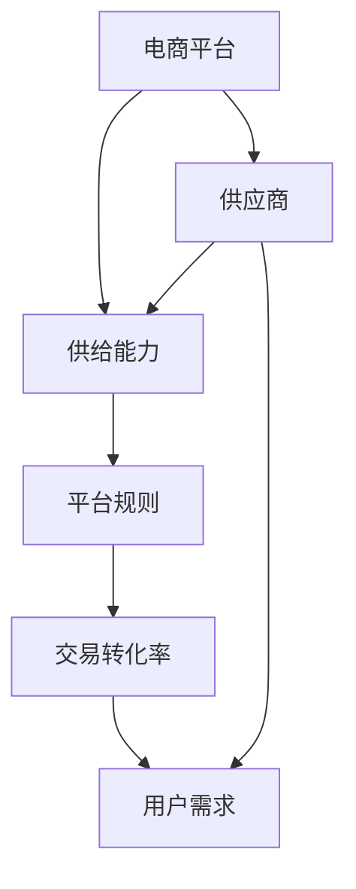
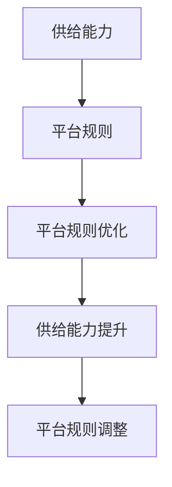
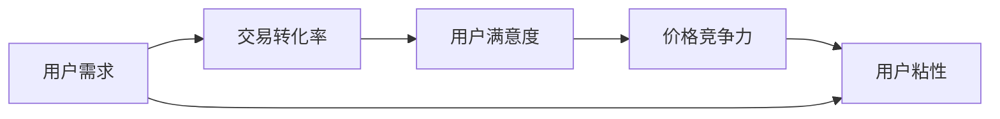
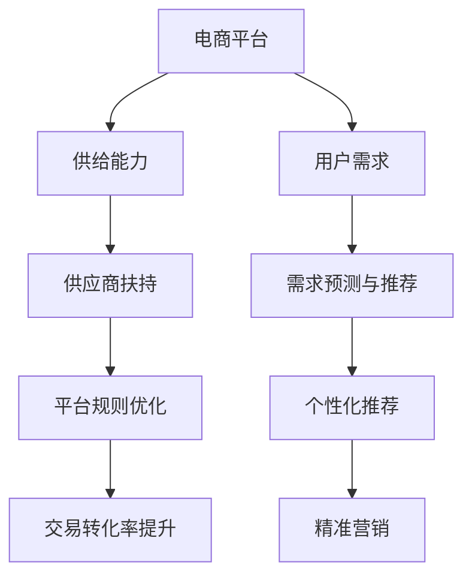

                 

# 电商平台供给能力提升：供应商扶持和平台规则

> 关键词：电商平台,供给能力,供应商扶持,平台规则,数据驱动,算法优化,用户需求,交易转化率

## 1. 背景介绍

随着电商平台的快速发展和竞争加剧，提升供给能力、优化平台规则成为电商平台生存和发展的关键。在高度竞争的市场环境下，如何精准扶持供应商，提升平台供给能力，优化用户购物体验，提高交易转化率，是所有电商平台都面临的重要课题。本文将从供给能力提升、供应商扶持和平台规则优化三个角度，系统地探讨电商平台供给能力的提升路径。

### 1.1 问题由来

在电商平台竞争日益激烈的背景下，提升供给能力、优化平台规则尤为重要。以下是具体问题：

1. **供给能力不足**：中小商家普遍存在资源有限、能力不足的问题，难以满足平台日益增长的商品供需需求。
2. **用户需求多样化**：电商平台用户需求越来越多样化，简单一刀切的平台规则难以满足所有用户需求。
3. **交易转化率低**：交易转化率是电商平台的核心指标之一，如何提升交易转化率，是电商平台必须解决的问题。

### 1.2 问题核心关键点

本文将聚焦于电商平台供给能力提升，涵盖以下几个关键点：

- **精准扶持供应商**：通过数据分析，精准识别优质供应商，提供定制化的扶持方案。
- **优化平台规则**：通过算法优化，设计更加公平、透明的平台规则，满足多样化用户需求。
- **提升交易转化率**：通过用户需求预测和推荐，提升用户购物体验，从而提高交易转化率。

### 1.3 问题研究意义

提升电商平台供给能力、优化平台规则，对于电商平台的发展具有重要的战略意义：

1. **提高竞争力**：通过精准扶持和规则优化，提升平台供给能力和用户满意度，增强平台竞争力。
2. **增加收入**：提高交易转化率，增加平台的收入来源，实现可持续发展。
3. **提升用户粘性**：优化用户购物体验，提升用户粘性，增加平台用户基数。
4. **降低运营成本**：优化平台规则，减少规则维护和纠纷处理成本，提高平台运营效率。

## 2. 核心概念与联系

### 2.1 核心概念概述

为更好地理解电商平台供给能力提升的方法，本节将介绍几个密切相关的核心概念：

- **电商平台(E-commerce Platform)**：连接买家和卖家的在线交易平台，为用户提供商品展示、交易和物流服务。
- **供给能力(Supply Capability)**：电商平台能提供的商品种类、数量和质量，影响平台的用户吸引力和交易量。
- **供应商(Supplier)**：在电商平台上销售商品或服务的商家，是供给能力的主要来源。
- **平台规则(Platform Rules)**：电商平台制定的一系列规则，用于指导供应商行为和用户行为，保证交易的公平、透明和高效。
- **交易转化率(Conversion Rate)**：访问电商平台的用户中，最终完成交易的比例，是衡量电商平台运营效果的重要指标。
- **用户需求(User Demand)**：用户希望从电商平台获取的商品或服务，是电商平台的供给方向和规则制定的重要依据。

这些核心概念之间的逻辑关系可以通过以下Mermaid流程图来展示：



这个流程图展示了几类概念之间的逻辑关系：

1. 电商平台通过供应商提供商品和服务，形成供给能力。
2. 电商平台设计平台规则，指导供应商行为和用户行为，确保交易公平和透明。
3. 平台规则通过优化交易流程，提升交易转化率，满足用户需求。
4. 用户需求的变化驱动平台规则和供给能力的不断优化，实现电商平台的持续发展。

### 2.2 概念间的关系

这些核心概念之间存在着紧密的联系，形成了电商平台供给能力提升的完整生态系统。下面我通过几个Mermaid流程图来展示这些概念之间的关系。

#### 2.2.1 电商平台的核心逻辑


这个流程图展示了电商平台的整体运作逻辑：平台通过供应商提供商品，设计平台规则，满足用户需求，从而提高交易转化率。

#### 2.2.2 供给能力和平台规则的关系



这个流程图展示了供给能力和平台规则之间的互动关系：平台规则影响供给能力，优化供给能力需要调整平台规则。

#### 2.2.3 交易转化率的影响因素



这个流程图展示了交易转化率的影响因素：用户需求直接影响交易转化率，交易转化率又影响用户满意度和粘性，从而进一步影响价格竞争力。

### 2.3 核心概念的整体架构

最后，我们用一个综合的流程图来展示这些核心概念在大语言模型微调过程中的整体架构：



这个综合流程图展示了从供应商扶持到平台规则优化，再到交易转化率提升的完整流程：平台通过精准扶持供应商，优化平台规则，提升交易转化率，同时通过需求预测与推荐，提供个性化推荐，实现精准营销。通过这些流程的不断迭代，电商平台可以持续提升供给能力和用户满意度，从而实现长期发展。

## 3. 核心算法原理 & 具体操作步骤

### 3.1 算法原理概述

电商平台的供给能力提升主要通过以下步骤实现：

1. **数据收集与分析**：收集供应商数据、用户行为数据和交易数据，进行统计分析和预测建模。
2. **供应商精准扶持**：基于数据分析结果，设计定制化的扶持方案，提高供应商的商品供应能力和质量。
3. **平台规则优化**：通过算法优化，设计更加公平、透明的平台规则，提高用户满意度和交易转化率。
4. **需求预测与推荐**：使用机器学习算法，对用户需求进行预测，提供个性化推荐，提升用户体验。

### 3.2 算法步骤详解

以下是电商平台供给能力提升的详细步骤：

#### 3.2.1 数据收集与分析

1. **供应商数据收集**：收集供应商的商品信息、物流信息、价格信息等，建立供应商数据集。
2. **用户行为数据收集**：收集用户的浏览记录、购买记录、评价记录等，建立用户行为数据集。
3. **交易数据收集**：收集交易数据，包括交易量、交易金额、交易时间等，建立交易数据集。
4. **数据分析与建模**：对数据集进行统计分析，建立需求预测模型和推荐模型。

#### 3.2.2 供应商精准扶持

1. **供应商筛选**：基于供应商的评分、评价、交易数据等，筛选出优质供应商。
2. **扶持方案设计**：设计定制化的扶持方案，如补贴、流量扶持、技术支持等。
3. **扶持方案执行**：执行扶持方案，监测效果，不断优化。

#### 3.2.3 平台规则优化

1. **平台规则设计**：设计公平、透明的平台规则，如商品展示规则、价格规则、评价规则等。
2. **规则效果评估**：评估平台规则效果，收集用户反馈，优化规则。
3. **规则自动调整**：使用算法自动调整平台规则，实现动态优化。

#### 3.2.4 需求预测与推荐

1. **需求预测**：使用机器学习算法，对用户需求进行预测。
2. **推荐模型训练**：训练推荐模型，提供个性化推荐。
3. **推荐效果评估**：评估推荐效果，收集用户反馈，优化推荐模型。

### 3.3 算法优缺点

电商平台供给能力提升算法的主要优点包括：

1. **数据驱动**：通过数据分析和建模，精准识别优质供应商和优化平台规则。
2. **效果显著**：通过精准扶持和规则优化，提升平台供给能力和交易转化率。
3. **实时优化**：使用算法自动调整规则，实现动态优化。

主要缺点包括：

1. **数据依赖**：算法效果依赖于高质量的数据集，数据收集和清洗工作量大。
2. **规则复杂性**：平台规则设计复杂，需要综合考虑多方面因素，设计难度大。
3. **推荐算法局限**：推荐算法需要大量数据和计算资源，难以实现实时推荐。

### 3.4 算法应用领域

电商平台供给能力提升算法已经在电商、零售、物流等多个领域得到广泛应用。以下是几个典型应用场景：

- **电商平台**：提升平台供给能力，优化用户购物体验，提高交易转化率。
- **零售企业**：优化库存管理，提升商品供应能力，提高用户满意度。
- **物流公司**：优化物流资源配置，提高配送效率和用户满意度。
- **金融行业**：优化支付和结算流程，提高用户支付体验。

## 4. 数学模型和公式 & 详细讲解  
### 4.1 数学模型构建

电商平台的供给能力提升涉及到多个数学模型，主要包括：

1. **供应商评分模型**：用于评估供应商的商品供应能力和质量。
2. **平台规则优化模型**：用于设计公平、透明的平台规则。
3. **需求预测模型**：用于预测用户需求。
4. **推荐模型**：用于提供个性化推荐。

#### 4.1.1 供应商评分模型

假设供应商 $S$ 的评分由多个指标 $X_i$ 决定，其中 $i \in [1,n]$，$n$ 为指标数量。供应商评分的数学模型为：

$$
Score(S) = \sum_{i=1}^{n}w_iX_i
$$

其中 $w_i$ 为指标 $X_i$ 的权重，$w_i > 0$，且 $\sum_{i=1}^{n}w_i=1$。指标 $X_i$ 可以为供应商的商品评分、物流评分、价格评分等。

#### 4.1.2 平台规则优化模型

平台规则优化模型需要综合考虑多个因素，如商品展示、价格、评价等。假设规则 $R$ 的影响因素为 $Y_j$，其中 $j \in [1,m]$，$m$ 为因素数量。平台规则优化模型的数学模型为：

$$
Opt(R) = \min \left\{ \sum_{j=1}^{m}y_jY_j \right\}

$$

其中 $y_j$ 为规则 $R$ 对因素 $Y_j$ 的影响系数，满足 $y_j \geq 0$。平台规则优化模型通过最小化平台规则对用户的影响，实现规则优化。

#### 4.1.3 需求预测模型

需求预测模型使用时间序列分析等方法，对用户需求进行预测。假设需求 $D$ 受多个因素 $Z_k$ 的影响，其中 $k \in [1,p]$，$p$ 为因素数量。需求预测模型的数学模型为：

$$
\hat{D} = f(Z)
$$

其中 $f$ 为需求预测函数，$Z$ 为需求预测的特征变量。需求预测模型通过训练历史数据，预测未来的需求，为供给能力和平台规则优化提供依据。

#### 4.1.4 推荐模型

推荐模型使用协同过滤、基于内容的推荐等方法，对用户进行个性化推荐。假设用户 $U$ 的需求由多个特征 $V_l$ 决定，其中 $l \in [1,q]$，$q$ 为特征数量。推荐模型的数学模型为：

$$
R(U) = g(V)
$$

其中 $g$ 为推荐函数，$V$ 为用户 $U$ 的特征向量。推荐模型通过训练用户特征和商品特征，提供个性化的推荐，提高用户满意度和交易转化率。

### 4.2 公式推导过程

以下我以需求预测模型和推荐模型为例，推导其公式推导过程。

#### 4.2.1 需求预测模型推导

需求预测模型使用时间序列分析等方法，对用户需求进行预测。假设需求 $D$ 受多个因素 $Z_k$ 的影响，其中 $k \in [1,p]$，$p$ 为因素数量。需求预测模型的数学模型为：

$$
\hat{D} = f(Z)
$$

其中 $f$ 为需求预测函数，$Z$ 为需求预测的特征变量。假设需求 $D$ 与因素 $Z_k$ 的关系为线性关系，即：

$$
D = \alpha + \sum_{k=1}^{p}\beta_kZ_k + \epsilon
$$

其中 $\alpha$ 为截距，$\beta_k$ 为因素 $Z_k$ 的系数，$\epsilon$ 为随机误差项。需求预测模型的目标是找到最优的 $\alpha$ 和 $\beta_k$，使得预测值 $\hat{D}$ 与真实值 $D$ 之间的差异最小。假设已知历史数据 $T$ 为 $(D_1, Z_{11}, ..., Z_{1p}), (D_2, Z_{21}, ..., Z_{2p}), ..., (D_N, Z_{N1}, ..., Z_{Np})$。需求预测模型的最小二乘估计为：

$$
\hat{\alpha} = \frac{1}{N}\sum_{i=1}^{N}D_i
$$

$$
\hat{\beta}_k = \frac{1}{N}\sum_{i=1}^{N}(Z_{ki}-\bar{Z}_k)(D_i-\bar{D})
$$

其中 $\bar{Z}_k = \frac{1}{N}\sum_{i=1}^{N}Z_{ki}$，$\bar{D} = \frac{1}{N}\sum_{i=1}^{N}D_i$。

#### 4.2.2 推荐模型推导

推荐模型使用协同过滤、基于内容的推荐等方法，对用户进行个性化推荐。假设用户 $U$ 的需求由多个特征 $V_l$ 决定，其中 $l \in [1,q]$，$q$ 为特征数量。推荐模型的数学模型为：

$$
R(U) = g(V)
$$

其中 $g$ 为推荐函数，$V$ 为用户 $U$ 的特征向量。假设用户 $U$ 的需求 $R_U$ 与商品 $I$ 的特征 $V_I$ 之间的关系为线性关系，即：

$$
R_U = \gamma + \sum_{l=1}^{q}\delta_lV_{U_l} + \sum_{l=1}^{q}\delta_l'V_{I_l} + \epsilon_U
$$

其中 $\gamma$ 为截距，$\delta_l$ 为用户特征 $V_{U_l}$ 的系数，$\delta_l'$ 为商品特征 $V_{I_l}$ 的系数，$\epsilon_U$ 为随机误差项。推荐模型的目标是找到最优的 $\gamma$、$\delta_l$ 和 $\delta_l'$，使得预测值 $R_U$ 与真实值 $R_{U,i}$ 之间的差异最小。假设已知历史数据 $T$ 为 $(R_{U_1}, V_{U_{11}}, ..., V_{U_{1q}}, V_{I_{11}}, ..., V_{I_{1q}}), (R_{U_2}, V_{U_{21}}, ..., V_{U_{2q}}, V_{I_{21}}, ..., V_{I_{2q}}), ..., (R_{U_M}, V_{U_{M1}}, ..., V_{U_{Mq}}, V_{I_{M1}}, ..., V_{I_{Mq}})$。推荐模型的最小二乘估计为：

$$
\hat{\gamma} = \frac{1}{M}\sum_{i=1}^{M}R_{U_i}
$$

$$
\hat{\delta}_l = \frac{1}{M}\sum_{i=1}^{M}(V_{U_{il}}-\bar{V}_{U_l})(R_{U_i}-\hat{\gamma})
$$

$$
\hat{\delta}'_l = \frac{1}{M}\sum_{i=1}^{M}(V_{I_{il}}-\bar{V}_{I_l})(R_{U_i}-\hat{\gamma})
$$

其中 $\bar{V}_{U_l} = \frac{1}{M}\sum_{i=1}^{M}V_{U_{il}}$，$\bar{V}_{I_l} = \frac{1}{M}\sum_{i=1}^{M}V_{I_{il}}$。

### 4.3 案例分析与讲解

以下以电商平台为例，展示如何应用需求预测模型和推荐模型。

假设某电商平台有 $N$ 个用户 $U_1, ..., U_N$，每个用户有 $q$ 个特征 $V_{U_1}, ..., V_{U_q}$。同时，有 $M$ 种商品 $I_1, ..., I_M$，每个商品有 $q$ 个特征 $V_{I_1}, ..., V_{I_q}$。电商平台通过需求预测模型和推荐模型，实现个性化推荐，提升用户购物体验。

#### 4.3.1 需求预测模型

电商平台的推荐系统基于历史数据，对用户需求进行预测。假设已知 $T = (R_{U_1}, V_{U_{11}}, ..., V_{U_{1q}}, V_{I_{11}}, ..., V_{I_{1q}}), (R_{U_2}, V_{U_{21}}, ..., V_{U_{2q}}, V_{I_{21}}, ..., V_{I_{2q}}), ..., (R_{U_M}, V_{U_{M1}}, ..., V_{U_{Mq}}, V_{I_{M1}}, ..., V_{I_{Mq}})$。

需求预测模型的最小二乘估计为：

$$
\hat{R}_{U_i} = \hat{\gamma} + \sum_{l=1}^{q}\hat{\delta}_lV_{U_{il}} + \sum_{l=1}^{q}\hat{\delta}'_lV_{I_{il}}
$$

其中 $\hat{\gamma} = \frac{1}{M}\sum_{i=1}^{M}R_{U_i}$，$\hat{\delta}_l = \frac{1}{M}\sum_{i=1}^{M}(V_{U_{il}}-\bar{V}_{U_l})(R_{U_i}-\hat{\gamma})$，$\hat{\delta}'_l = \frac{1}{M}\sum_{i=1}^{M}(V_{I_{il}}-\bar{V}_{I_l})(R_{U_i}-\hat{\gamma})$。

#### 4.3.2 推荐模型

电商平台的推荐系统基于需求预测模型，对用户进行个性化推荐。假设已知 $T = (R_{U_1}, V_{U_{11}}, ..., V_{U_{1q}}, V_{I_{11}}, ..., V_{I_{1q}}), (R_{U_2}, V_{U_{21}}, ..., V_{U_{2q}}, V_{I_{21}}, ..., V_{I_{2q}}), ..., (R_{U_M}, V_{U_{M1}}, ..., V_{U_{Mq}}, V_{I_{M1}}, ..., V_{I_{Mq}})$。

推荐模型的最小二乘估计为：

$$
\hat{R}_{U_i} = \hat{\gamma} + \sum_{l=1}^{q}\hat{\delta}_lV_{U_{il}} + \sum_{l=1}^{q}\hat{\delta}'_lV_{I_{il}}
$$

其中 $\hat{\gamma} = \frac{1}{M}\sum_{i=1}^{M}R_{U_i}$，$\hat{\delta}_l = \frac{1}{M}\sum_{i=1}^{M}(V_{U_{il}}-\bar{V}_{U_l})(R_{U_i}-\hat{\gamma})$，$\hat{\delta}'_l = \frac{1}{M}\sum_{i=1}^{M}(V_{I_{il}}-\bar{V}_{I_l})(R_{U_i}-\hat{\gamma})$。

## 5. 项目实践：代码实例和详细解释说明

### 5.1 开发环境搭建

在进行项目实践前，我们需要准备好开发环境。以下是使用Python进行PyTorch开发的环境配置流程：

1. 安装Anaconda：从官网下载并安装Anaconda，用于创建独立的Python环境。

2. 创建并激活虚拟环境：
```bash
conda create -n pytorch-env python=3.8 
conda activate pytorch-env
```

3. 安装PyTorch：根据CUDA版本，从官网获取对应的安装命令。例如：
```bash
conda install pytorch torchvision torchaudio cudatoolkit=11.1 -c pytorch -c conda-forge
```

4. 安装Transformers库：
```bash
pip install transformers
```

5. 安装各类工具包：
```bash
pip install numpy pandas scikit-learn matplotlib tqdm jupyter notebook ipython
```

完成上述步骤后，即可在`pytorch-env`环境中开始项目实践。

### 5.2 源代码详细实现

下面我们以电商平台推荐系统为例，给出使用Transformers库进行个性化推荐模型的PyTorch代码实现。

首先，定义推荐模型的数据处理函数：

```python
from transformers import BertTokenizer
from torch.utils.data import Dataset
import torch

class RecommendationDataset(Dataset):
    def __init__(self, users, items, user_features, item_features, user_labels, tokenizer, max_len=128):
        self.users = users
        self.items = items
        self.user_features = user_features
        self.item_features = item_features
        self.user_labels = user_labels
        self.tokenizer = tokenizer
        self.max_len = max_len
        
    def __len__(self):
        return len(self.users)
    
    def __getitem__(self, item):
        user_id = self.users[item]
        item_id = self.items[item]
        user_features = self.user_features[item]
        item_features = self.item_features[item]
        user_label = self.user_labels[item]
        
        encoding_user = self.tokenizer([str(user_id)], return_tensors='pt', max_length=self.max_len, padding='max_length', truncation=True)
        encoding_item = self.tokenizer([str(item_id)], return_tensors='pt', max_length=self.max_len, padding='max_length', truncation=True)
        
        # 将用户特征和商品特征转化为向量
        user_features = torch.tensor(user_features)
        item_features = torch.tensor(item_features)
        
        return {'user_id': encoding_user['input_ids'][0],
                'item_id': encoding_item['input_ids'][0],
                'user_features': user_features,
                'item_features': item_features,
                'user_label': user_label}
```

然后，定义模型和优化器：

```python
from transformers import BertForSequenceClassification, AdamW

model = BertForSequenceClassification.from_pretrained('bert-base-cased', num_labels=len(user_labels))
optimizer = AdamW(model.parameters(), lr=2e-5)
```

接着，定义训练和评估函数：

```python
from torch.utils.data import DataLoader
from tqdm import tqdm
from sklearn.metrics import classification_report

device = torch.device('cuda') if torch.cuda.is_available() else torch.device('cpu')
model.to(device)

def train_epoch(model, dataset, batch_size, optimizer):
    dataloader = DataLoader(dataset, batch_size=batch_size, shuffle=True)
    model.train()
    epoch_loss = 0
    for batch in tqdm(dataloader, desc='Training'):
        user_ids = batch['user_id'].to(device)
        item_ids = batch['item_id'].to(device)
        user_features = batch['user_features'].to(device)
        item_features = batch['item_features'].to(device)
        user_labels = batch['user_label'].to(device)
        model.zero_grad()
        outputs = model(user_ids, item_ids, user_features, item_features)
        loss = outputs.loss
        epoch_loss += loss.item()
        loss.backward()
        optimizer.step()
    return epoch_loss / len(dataloader)

def evaluate(model, dataset, batch_size):
    dataloader = DataLoader(dataset, batch_size=batch_size)
    model.eval()
    preds, labels = [], []
    with torch.no_grad():
        for batch in tqdm(dataloader, desc='Evaluating'):
            user_ids = batch['user_id'].to(device)
            item_ids = batch['item_id'].to(device)
            user_features = batch['user_features'].to(device)
            item_features = batch['item_features'].to(device)
            batch_labels = batch['user_label'].to(device)
            outputs = model(user_ids, item_ids, user_features, item_features)
            batch_preds = outputs.logits.argmax(dim=2).to('cpu').tolist()
            batch_labels = batch_labels.to('cpu').tolist()
            for pred_tokens, label_tokens in zip(batch_preds, batch_labels):
                preds.append(pred_tokens[:len(label_tokens)])
                labels.append(label_tokens)
                
    print(classification_report(labels, preds))
```

最后，启动训练流程并在测试集上评估：

```python
epochs = 5
batch_size = 16

for epoch in range(epochs):
    loss = train_epoch(model, train_dataset, batch_size, optimizer)
    print(f"Epoch {epoch

