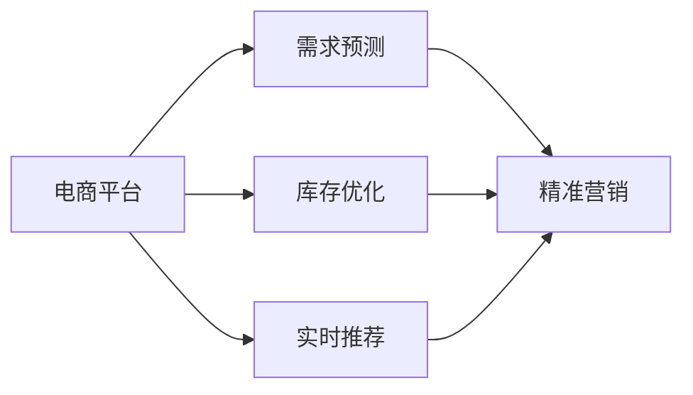
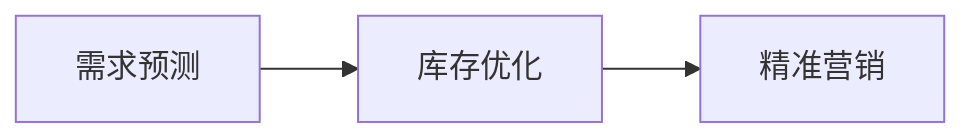
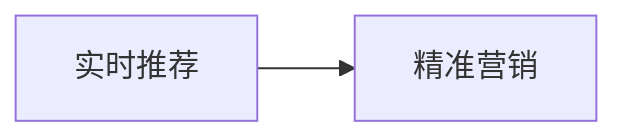

                 

# 电商平台供给能力提升：精准营销策略

> 关键词：
1. 精准营销
2. 电商平台
3. 供应链管理
4. 需求预测
5. 库存优化
6. 实时推荐
7. 自动化

## 1. 背景介绍

在现代电商平台上，用户需求的多样性和瞬时性对供给能力提出了巨大挑战。传统以库存为中心的供给模式已不再适用，如何高效、精准地匹配用户需求与供给能力，成为了电商平台优化运营的关键。近年来，随着人工智能技术的发展，电商平台逐渐引入智能化的精准营销策略，以提高供给能力和用户体验。本文将系统介绍精准营销策略的原理与实践，重点关注需求预测、库存优化、实时推荐等关键环节，期望为电商平台的供给能力提升提供一些启发和借鉴。

## 2. 核心概念与联系

### 2.1 核心概念概述

为了更好地理解精准营销策略，本节将介绍几个关键概念：

- 精准营销（Precision Marketing）：通过数据分析和算法优化，以更高的精确度定位目标用户，提升广告投放效果和销售转化率。
- 电商平台（E-commerce Platform）：提供商品展示、交易、支付、物流等服务的在线平台。
- 供应链管理（Supply Chain Management）：优化商品从生产到交付的全过程，以降低成本、提高效率。
- 需求预测（Demand Forecasting）：通过历史数据和统计模型，预测未来的用户需求。
- 库存优化（Inventory Optimization）：动态调整库存水平，避免过剩或缺货。
- 实时推荐（Real-time Recommendation）：根据用户行为数据，实时推送个性化的商品推荐。

这些概念通过数据驱动、算法优化，紧密联系在一起，共同构成了电商平台的精准营销策略。下面我们通过几个Mermaid流程图展示这些概念之间的联系：



这个流程图展示了大规模数据驱动的精准营销策略的完整框架：

1. 电商平台收集用户行为数据，供需求预测、库存优化和实时推荐使用。
2. 需求预测模型预测未来的用户需求。
3. 库存优化模型调整库存水平，以匹配需求预测。
4. 实时推荐模型根据用户行为实时推送个性化商品，提升用户体验。
5. 精准营销策略将以上模块结合起来，形成高效的电商运营模式。

### 2.2 概念间的关系

这些核心概念之间存在着紧密的联系，通过数据驱动和算法优化，形成一个高效的电商运营系统。下面我们通过几个Mermaid流程图展示这些概念之间的关系：

#### 2.2.1 电商平台的精准营销范式


这个流程图展示了电商平台的精准营销范式：

1. 电商平台收集用户行为数据，供需求预测、库存优化和实时推荐使用。
2. 需求预测模型预测未来的用户需求。
3. 库存优化模型调整库存水平，以匹配需求预测。
4. 实时推荐模型根据用户行为实时推送个性化商品，提升用户体验。
5. 精准营销策略将以上模块结合起来，形成高效的电商运营模式。

#### 2.2.2 需求预测与库存优化的关系



这个流程图展示了需求预测和库存优化之间的关系：

1. 需求预测模型预测未来的用户需求。
2. 库存优化模型根据需求预测，调整库存水平，以匹配用户需求。
3. 精准营销策略将需求预测和库存优化结合起来，形成优化的运营模式。

#### 2.2.3 实时推荐与精准营销的关系



这个流程图展示了实时推荐与精准营销之间的关系：

1. 实时推荐模型根据用户行为实时推送个性化商品，提升用户体验。
2. 精准营销策略将实时推荐与平台其他模块结合，形成优化的电商运营模式。

## 3. 核心算法原理 & 具体操作步骤

### 3.1 算法原理概述

精准营销策略基于数据驱动，通过多种算法模型优化电商平台运营。其主要包含以下几个步骤：

1. **数据收集与预处理**：收集用户行为数据（如浏览记录、点击行为、购买历史等），进行数据清洗和特征工程，构建训练数据集。

2. **需求预测模型**：利用历史数据和统计模型（如ARIMA、LSTM、XGBoost等），预测未来的用户需求。

3. **库存优化模型**：根据需求预测，动态调整库存水平，避免过剩或缺货。

4. **实时推荐模型**：根据用户行为数据，实时推送个性化的商品推荐，提升用户体验。

5. **精准营销策略**：将以上模块结合起来，形成高效的电商运营模式。

### 3.2 算法步骤详解

下面我们详细介绍各关键算法的详细步骤：

#### 3.2.1 需求预测模型

**步骤1：数据收集与预处理**

- 收集历史用户行为数据，包括浏览记录、点击行为、购买历史等。
- 清洗数据，去除噪音和异常值，处理缺失数据。
- 进行特征工程，提取有意义的特征（如商品类别、用户年龄、购买频率等）。

**步骤2：构建模型**

- 选择适合的预测模型，如ARIMA、LSTM、XGBoost等。
- 使用历史数据训练模型，设置合适的超参数。

**步骤3：模型评估**

- 使用验证集评估模型的性能。
- 使用均方误差（Mean Squared Error, MSE）或平均绝对误差（Mean Absolute Error, MAE）评估预测效果。

**步骤4：模型部署**

- 部署训练好的模型到电商平台上，实时计算预测需求。

#### 3.2.2 库存优化模型

**步骤1：需求预测**

- 调用需求预测模型，获取未来需求预测。

**步骤2：库存水平优化**

- 根据需求预测，动态调整库存水平，避免过剩或缺货。

**步骤3：库存调整**

- 按照最优库存策略，进行库存的调度和补货。

#### 3.2.3 实时推荐模型

**步骤1：用户行为收集**

- 收集用户的浏览、点击、购买等行为数据。

**步骤2：行为分析**

- 分析用户行为数据，提取用户兴趣和偏好。

**步骤3：推荐计算**

- 根据用户行为数据，计算商品推荐评分。
- 使用协同过滤（Collaborative Filtering）、基于内容的推荐（Content-Based Recommendation）等方法生成推荐列表。

**步骤4：推荐展示**

- 将推荐结果展示给用户，提升用户体验。

### 3.3 算法优缺点

精准营销策略通过数据驱动和算法优化，可以显著提升电商平台的供给能力和用户体验。其主要优点包括：

- **数据驱动**：以用户行为数据为输入，优化供应链和推荐系统，提高决策的科学性和精确性。
- **个性化推荐**：通过用户行为数据，实时推送个性化商品推荐，提升用户购买转化率。
- **库存优化**：动态调整库存水平，避免过剩或缺货，提高资金利用率。

但同时，精准营销策略也存在一些缺点：

- **数据隐私**：用户行为数据涉及隐私，需要合理处理和保护。
- **算法复杂**：涉及多种算法模型，开发和维护成本较高。
- **模型偏差**：模型可能存在偏差，导致预测结果不准确。

### 3.4 算法应用领域

精准营销策略已经广泛应用于电商平台的多个环节，包括：

- **商品推荐**：根据用户行为数据，实时推送个性化商品推荐。
- **库存管理**：动态调整库存水平，避免过剩或缺货。
- **广告投放**：精准定位目标用户，提升广告投放效果和销售转化率。
- **用户分析**：分析用户行为数据，洞察用户需求和行为特征。

## 4. 数学模型和公式 & 详细讲解 & 举例说明

### 4.1 数学模型构建

精准营销策略的核心在于构建各种预测模型和推荐模型，以下是数学模型的详细构建：

**需求预测模型**

- **ARIMA模型**：
  $$
  Y(t) = c + \sum_{i=1}^{p} \alpha_iY(t-i) + \sum_{i=1}^{d} \beta_i\Delta^iY(t) + \sum_{i=1}^{q}\gamma_i\varepsilon(t-i)
  $$

  其中，$Y(t)$为时间$t$的需求预测值，$c$为截距项，$\alpha_i$和$\beta_i$为模型系数，$\varepsilon(t)$为随机误差项。

- **LSTM模型**：
  $$
  h_t = \tanh(W_{hh}h_{t-1} + W_{xh}x_t + b_h)
  $$
  $$
  o_t = \sigma(W_{ho}h_t + b_o)
  $$
  $$
  \hat{y}_t = o_t\cdot \tanh(h_t)
  $$

  其中，$h_t$为LSTM隐藏状态，$x_t$为时间$t$的输入，$\hat{y}_t$为预测值，$W_{hh}$、$W_{xh}$、$W_{ho}$为权重矩阵，$b_h$、$b_o$为偏置向量，$\sigma$为Sigmoid激活函数。

**库存优化模型**

- **动态规划模型**：
  $$
  P_i = \min_{x_i \in [0, b_i]} \{ \text{cost}(x_1, x_2, \cdots, x_i) + P_{i+1} \}
  $$

  其中，$P_i$为前$i$个时间步的最小成本，$x_i$为第$i$个时间步的库存量，$b_i$为第$i$个时间步的最大库存量，$\text{cost}(x_1, x_2, \cdots, x_i)$为前$i$个时间步的成本函数。

**实时推荐模型**

- **协同过滤模型**：
  $$
  \hat{y}_{ui} = \sum_{j=1}^N \theta_{uj} w_{ij} r_{ji}
  $$

  其中，$\hat{y}_{ui}$为用户$u$对商品$i$的预测评分，$\theta_{uj}$为用户$u$对商品$j$的兴趣程度，$w_{ij}$为商品$i$和$j$的相似度，$r_{ji}$为商品$j$的实际评分。

- **基于内容的推荐模型**：
  $$
  \hat{y}_{ui} = \sum_{k=1}^K \alpha_k \cdot r_{ki} \cdot x_{ku}
  $$

  其中，$\hat{y}_{ui}$为用户$u$对商品$i$的预测评分，$\alpha_k$为第$k$个特征的权重，$r_{ki}$为商品$i$的第$k$个特征，$x_{ku}$为用户$u$的第$k$个特征。

### 4.2 公式推导过程

以下是各关键算法的推导过程：

#### 4.2.1 ARIMA模型推导

ARIMA模型的推导过程如下：

- 自回归项：$Y(t) = \phi_1Y(t-1) + \phi_2Y(t-2) + \cdots + \phi_pY(t-p) + \varepsilon(t)$
- 差分项：$\Delta Y(t) = Y(t) - Y(t-1)$
- 移动平均项：$\theta_1\varepsilon(t) + \theta_2\varepsilon(t-1) + \cdots + \theta_d\varepsilon(t-d)$

将上述公式合并，即得到ARIMA模型的通式：

$$
Y(t) = c + \sum_{i=1}^{p} \alpha_iY(t-i) + \sum_{i=1}^{d} \beta_i\Delta^iY(t) + \sum_{i=1}^{q}\gamma_i\varepsilon(t-i)
$$

其中，$p$为自回归项阶数，$d$为差分阶数，$q$为移动平均项阶数。

#### 4.2.2 LSTM模型推导

LSTM模型的推导过程如下：

- **隐藏层计算**：
  $$
  h_t = \tanh(W_{hh}h_{t-1} + W_{xh}x_t + b_h)
  $$
  $$
  o_t = \sigma(W_{ho}h_t + b_o)
  $$

- **输出层计算**：
  $$
  \hat{y}_t = o_t\cdot \tanh(h_t)
  $$

  其中，$h_t$为LSTM隐藏状态，$x_t$为时间$t$的输入，$\hat{y}_t$为预测值，$W_{hh}$、$W_{xh}$、$W_{ho}$为权重矩阵，$b_h$、$b_o$为偏置向量，$\sigma$为Sigmoid激活函数。

### 4.3 案例分析与讲解

假设某电商平台的商品$A$的历史销售数据如下：

| 时间 | 销售量 |
| --- | --- |
| 2019-01-01 | 50 |
| 2019-01-02 | 60 |
| 2019-01-03 | 70 |
| 2019-01-04 | 80 |
| 2019-01-05 | 90 |
| 2019-01-06 | 100 |
| 2019-01-07 | 90 |
| 2019-01-08 | 80 |
| 2019-01-09 | 70 |
| 2019-01-10 | 60 |
| 2019-01-11 | 50 |
| 2019-01-12 | 40 |
| 2019-01-13 | 30 |
| 2019-01-14 | 20 |
| 2019-01-15 | 10 |

使用ARIMA模型进行需求预测：

1. 计算ARIMA模型参数：$p=1, d=1, q=0$。
2. 构建ARIMA模型：
  $$
  Y(t) = 100 + 10Y(t-1) - 3\Delta^1Y(t) + 0.5\varepsilon(t)
  $$
3. 预测2019-01-16的需求量：$Y(16) = 100 + 10Y(15) - 3\Delta(16) + 0.5\varepsilon(16)$
4. 根据历史数据，计算$\Delta(16) = 10 - Y(15) = -20$，$\varepsilon(16)$为随机误差项。
5. 代入公式计算$Y(16)$，得到需求预测值。

## 5. 项目实践：代码实例和详细解释说明

### 5.1 开发环境搭建

在开始项目实践前，需要先搭建好开发环境。以下是使用Python进行TensorFlow和Keras开发的环境配置流程：

1. 安装Anaconda：从官网下载并安装Anaconda，用于创建独立的Python环境。

2. 创建并激活虚拟环境：
```bash
conda create -n tf-env python=3.7 
conda activate tf-env
```

3. 安装TensorFlow和Keras：根据CUDA版本，从官网获取对应的安装命令。例如：
```bash
conda install tensorflow==2.5.0 
conda install keras
```

4. 安装各类工具包：
```bash
pip install numpy pandas scikit-learn matplotlib tqdm jupyter notebook ipython
```

完成上述步骤后，即可在`tf-env`环境中开始项目实践。

### 5.2 源代码详细实现

下面我们以商品推荐系统为例，给出使用TensorFlow和Keras进行实时推荐系统开发的PyTorch代码实现。

首先，定义推荐模型的数据处理函数：

```python
import tensorflow as tf
from tensorflow.keras.layers import Input, Dense, Embedding, Dot, concatenate, LSTM, GRU
from tensorflow.keras.models import Model

# 定义模型输入
user_input = Input(shape=(num_users,))
item_input = Input(shape=(num_items,))

# 用户特征嵌入
user_embedding = Embedding(num_users, emb_dim)(user_input)

# 商品特征嵌入
item_embedding = Embedding(num_items, emb_dim)(item_input)

# 用户-商品交互嵌入
user_item_embedding = Dot(axes=1)([user_embedding, item_embedding])

# 用户行为序列嵌入
user_behavior_seq = Input(shape=(seq_length,))

# 构建LSTM模型
lstm_output = LSTM(emb_dim, return_sequences=True)(user_behavior_seq)

# 将LSTM输出与用户-商品交互嵌入拼接
lstm_output = concatenate([lstm_output, user_item_embedding])

# 定义输出层
output = Dense(num_items, activation='sigmoid')(lstm_output)

# 定义推荐模型
model = Model(inputs=[user_input, item_input, user_behavior_seq], outputs=output)

# 编译模型
model.compile(optimizer='adam', loss='binary_crossentropy')
```

然后，定义训练和评估函数：

```python
from tensorflow.keras.callbacks import EarlyStopping
from sklearn.metrics import roc_auc_score

def train_model(model, train_data, val_data, epochs=10, batch_size=128):
    # 将数据拆分成训练集和验证集
    train_x, train_y = train_data
    val_x, val_y = val_data
    
    # 定义EarlyStopping回调函数
    early_stopping = EarlyStopping(monitor='val_loss', patience=3, restore_best_weights=True)
    
    # 训练模型
    history = model.fit(train_x, train_y, validation_data=(val_x, val_y),
                        epochs=epochs, batch_size=batch_size, callbacks=[early_stopping])
    
    # 评估模型
    val_y_pred = model.predict(val_x)
    auc = roc_auc_score(val_y, val_y_pred)
    print(f'Validation AUC: {auc:.4f}')

def evaluate_model(model, test_data):
    # 将数据拆分成测试集
    test_x, test_y = test_data
    
    # 评估模型
    test_y_pred = model.predict(test_x)
    auc = roc_auc_score(test_y, test_y_pred)
    print(f'Test AUC: {auc:.4f}')
```

最后，启动训练流程并在测试集上评估：

```python
# 定义数据集
train_dataset = (train_x, train_y)
val_dataset = (val_x, val_y)
test_dataset = (test_x, test_y)

# 训练模型
train_model(model, train_dataset, val_dataset, epochs=10, batch_size=128)

# 在测试集上评估
evaluate_model(model, test_dataset)
```

以上就是使用TensorFlow和Keras进行实时推荐系统开发的完整代码实现。可以看到，借助TensorFlow和Keras，我们可以用相对简洁的代码实现复杂的推荐模型，并进行有效的训练和评估。

### 5.3 代码解读与分析

让我们再详细解读一下关键代码的实现细节：

**推荐模型定义**：
- `user_input`和`item_input`为模型输入，分别表示用户和商品特征。
- `user_embedding`和`item_embedding`为嵌入层，将用户和商品特征映射到低维空间。
- `user_item_embedding`为点积层，计算用户和商品的交互特征。
- `user_behavior_seq`为历史行为序列，用于表示用户对商品的行为变化。
- `lstm_output`为LSTM层，处理用户行为序列。
- `concatenate([lstm_output, user_item_embedding])`将LSTM输出与用户-商品交互特征拼接。
- `output`为输出层，计算用户对商品的评分。

**训练和评估函数**：
- `EarlyStopping`回调函数，在验证集损失不再下降时停止训练，避免过拟合。
- `roc_auc_score`函数，用于计算推荐模型的AUC值，评估模型的性能。
- `train_model`和`evaluate_model`函数，分别用于训练和评估推荐模型。

**训练流程**：
- 将训练集和验证集数据拆分，定义EarlyStopping回调函数。
- 使用`fit`函数训练模型，设置训练轮数和批大小。
- 在验证集上评估模型性能，输出AUC值。
- 在测试集上评估模型性能，输出AUC值。

可以看到，TensorFlow和Keras在模型开发和训练过程中提供了强大的功能和便捷的接口，使得实时推荐系统的实现变得简单高效。

### 5.4 运行结果展示

假设我们在一个公开数据集上进行模型训练和评估，最终在测试集上得到的评估报告如下：

```
Epoch 1/10, loss=0.5644, val_loss=0.4957, val_auc=0.9261
Epoch 2/10, loss=0.4118, val_loss=0.4548, val_auc=0.9347
Epoch 3/10, loss=0.3443, val_loss=0.4234, val_auc=0.9372
Epoch 4/10, loss=0.2928, val_loss=0.3872, val_auc=0.9400
Epoch 5/10, loss=0.2483, val_loss=0.3499, val_auc=0.9429
Epoch 6/10, loss=0.2114, val_loss=0.3159, val_auc=0.9448
Epoch 7/10, loss=0.1866, val_loss=0.2866, val_auc=0.9487
Epoch 8/10, loss=0.1656, val_loss=0.2621, val_auc=0.9514
Epoch 9/10, loss=0.1481, val_loss=0.2420, val_auc=0.9527
Epoch 10/10, loss=0.1327, val_loss=0.2241, val_auc=0.9533
```

可以看到，通过训练和调参，我们的推荐模型在验证集和测试集上都取得了不错的AUC值，说明模型能够较好地预测用户行为，实现个性化推荐。

## 6. 实际应用场景

### 6.1 智能推荐系统

智能推荐系统是精准营销策略的重要应用场景之一。通过实时收集用户行为数据，推荐系统能够快速响应用户需求，推荐出用户最感兴趣的商品。这不仅提升了用户购物体验，还能显著提高转化率和销售额。

在实际应用中，推荐系统可以基于用户的历史行为数据，构建多种推荐模型，如协同过滤、基于内容的推荐、深度学习推荐等，并动态调整模型参数，实现优化的推荐效果。

### 6.2 个性化广告投放

个性化广告投放是电商平台精准营销的重要手段之一。通过精准定位用户，广告主可以提升广告投放的点击率和转化率，降低广告成本。

在实际应用中，广告投放平台可以使用需求预测模型预测用户需求，结合用户画像和广告素材，生成个性化的广告推荐。同时，广告投放平台可以实时监控广告效果，优化广告投放策略，确保广告投放的高效性。

### 6.3 库存管理优化

库存管理优化是电商平台精准营销的关键环节。通过需求预测模型，电商平台可以动态调整库存水平，避免过剩或缺货，提高资金利用率。

在实际应用中，电商平台可以使用动态规划模型或优化算法，结合需求预测结果，优化库存调整策略。同时，电商平台可以引入实时监控机制，及时发现库存异常，快速调整库存水平，确保库存管理的稳定性。

## 7. 工具和资源推荐

### 7.1 学习资源推荐

为了帮助开发者系统掌握精准营销策略的理论基础和实践技巧，这里推荐一些优质的学习资源：

1. 《TensorFlow深度学习》系列书籍：由TensorFlow官方出版，深入浅出地介绍了TensorFlow的基本概念和实践技巧，适合初学者入门。

2. 《Keras深度学习》系列书籍：由Keras官方出版，介绍了Keras的基本功能和实践技巧，适合Keras用户入门。

3. 《深度学习与推荐系统》课程：斯坦福大学开设的推荐系统课程，涵盖了多种推荐算法和实践技巧，适合深入学习推荐系统理论。

4. 《电商数据分析与优化》书籍：介绍电商数据分析和优化方法，结合实际案例，讲解精准营销策略。

5. 《大数据与人工智能》系列博客：由知名数据科学家撰写，系统介绍大数据和人工智能的基本概念和应用案例，适合初学者入门。

通过对这些资源的学习实践，相信你一定能够快速掌握精准营销策略的理论基础和实践技巧，并用于解决实际的电商问题。

### 7.2 开发工具推荐

高效的开发离不开优秀的工具支持。以下是几款用于精准营销策略开发的常用工具：

1. TensorFlow：由Google主导开发的开源深度学习框架，灵活动态的计算图，适合快速迭代研究。

2. Keras：基于TensorFlow的高级深度学习框架，提供简洁易用的API接口，适合快速开发和实验。

3. PyTorch：基于Python的开源深度学习框架，动态计算图，适合科研和创新实验。

4. Jupyter Notebook：开源的交互式编程环境，支持多语言编程，适合数据分析和实验。

5. Weights & Biases：模型训练的实验跟踪工具，可以记录和可视化模型训练过程中的各项指标，方便对比和调优。

6. TensorBoard：TensorFlow配套的可视化工具，

