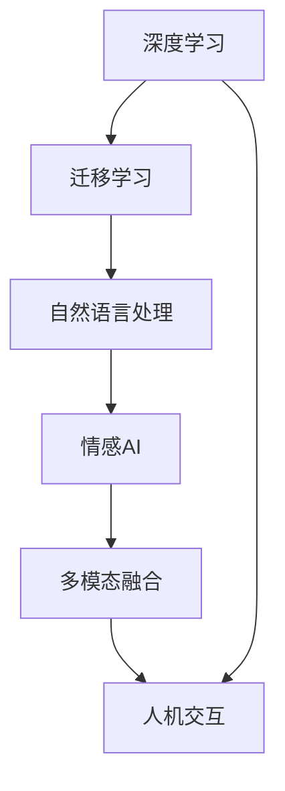
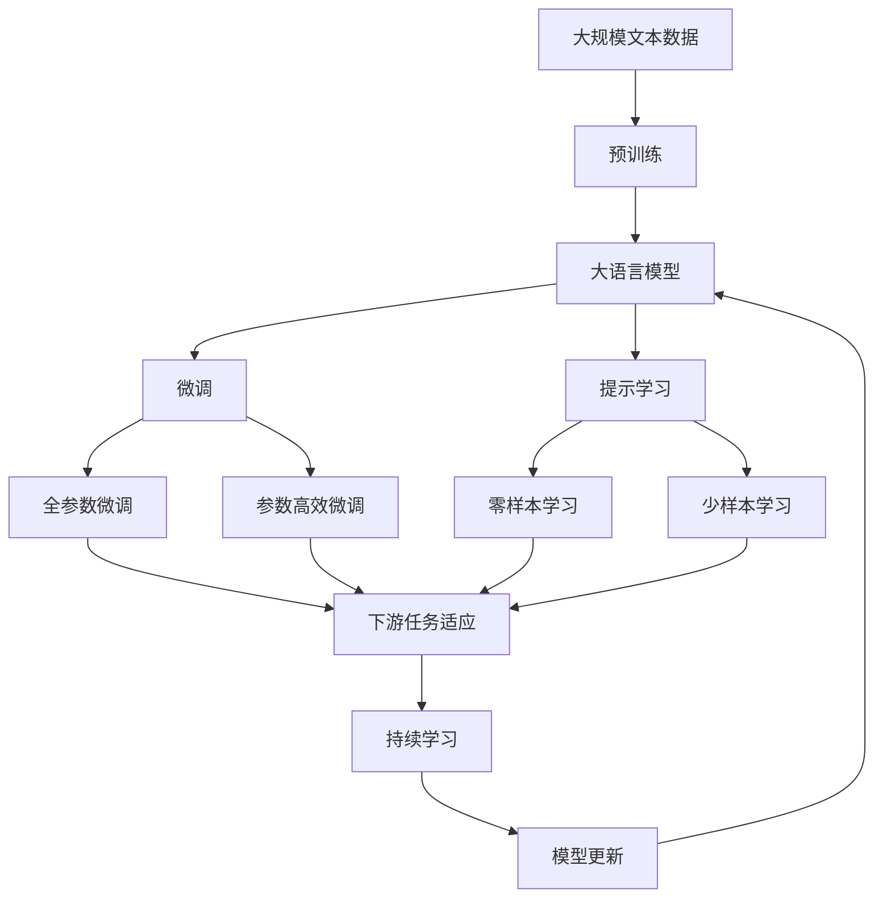

                 

# 电影《她》中的AI与现实对比

## 1. 背景介绍

### 1.1 问题由来
电影《她》（Her）是一部关于人工智能与人类关系的科幻电影，影片中的智能操作系统“萨曼莎”与男主角的互动令人深思：超越人机边界、情感交流、理解与被理解的界限，以及人类与机器的未来。影片展示了一种纯粹的、非对抗性的机器智能，引发了关于未来人工智能的广泛讨论。
影片中，萨曼莎不仅能够理解人类的情感，还能进行深入的情感交流，这是当前的人工智能无法实现的。而在现实中，人工智能技术已经在诸多领域取得突破，如语音识别、图像识别、自然语言处理等，但“情感AI”仍处于初级阶段。

## 2. 核心概念与联系

### 2.1 核心概念概述

《她》电影中，“萨曼莎”是一个高度发达的智能操作系统，具备以下特征：

1. **自我进化**：通过分析大量数据，“萨曼莎”能够不断学习、自我进化，理解并生成自然语言。
2. **情感智能**：不仅理解语言，还能理解并生成情感表达，进行深层次的情感交流。
3. **跨界学习**：能够进行多种任务的切换，如翻译、写作、编程等。

基于人工智能技术发展现状，可将电影中“萨曼莎”的能力与现实中的智能技术进行对比，梳理出以下核心概念：

- **深度学习**：用于语音、图像、自然语言处理等任务的基础算法。
- **迁移学习**：将预训练模型迁移到新任务中，减少新任务所需标注数据。
- **情感AI**：让机器能够理解和生成情感表达的技术。
- **多模态融合**：将视觉、听觉、语言等多种模态信息融合，构建更全面的认知模型。
- **人机交互**：通过自然语言、手势、情感识别等技术，实现人与机器的深度互动。

### 2.2 核心概念间的关系

电影《她》中的AI与现实中的智能技术的关系可以通过以下Mermaid流程图来展示：



这个流程图展示了从深度学习到人机交互的完整路径，每个步骤都是建立在前一个步骤的基础上，逐步提升智能系统的功能。

### 2.3 核心概念的整体架构

最后，我们用一个综合的流程图来展示这些核心概念在大语言模型微调过程中的整体架构：



这个综合流程图展示了从预训练到微调，再到持续学习的完整过程，每个步骤都是构建在前一个步骤的基础上，逐步提升模型的性能和应用范围。

## 3. 核心算法原理 & 具体操作步骤
### 3.1 算法原理概述

《她》电影中的智能操作系统“萨曼莎”具备自我进化的能力，这主要依赖于深度学习和迁移学习技术。影片中，“萨曼莎”通过大量的对话数据，自我训练，逐步提升理解能力。这个过程类似于现实中的大语言模型微调，通过有监督或无监督的方式，不断调整模型参数，提升模型性能。

现实中的深度学习模型，如BERT、GPT系列，也是通过预训练和大规模无标签数据进行自我学习，然后在特定的任务上进行微调。这种预训练-微调范式极大地提升了模型的通用性和适应性，使得模型能够在各种NLP任务上取得优异性能。

### 3.2 算法步骤详解

以下将以电影《她》中的智能操作系统“萨曼莎”为例，详细讲解其核心算法步骤。

**Step 1: 数据收集与预训练**

“萨曼莎”首先需要收集大量的对话数据，并进行预训练。预训练过程类似于大语言模型的训练过程，使用自监督学习任务，如掩码语言模型、 next-token 预测等，学习通用的语言表示。

**Step 2: 微调与情感智能**

在预训练后，“萨曼莎”通过微调技术，学习特定任务，如对话系统、翻译系统等。微调过程中，“萨曼莎”能够理解并生成情感表达，这是通过引入情感标签、使用情感分类器等方式实现的。

**Step 3: 跨界学习与多模态融合**

在对话系统基础上，“萨曼莎”进一步扩展其功能，支持翻译、写作、编程等任务。跨界学习涉及多模态数据融合，如图像、语音、文本等多种数据类型的联合处理，构建更全面的认知模型。

**Step 4: 持续学习与迭代优化**

“萨曼莎”具备持续学习能力，通过不断的反馈和更新，优化模型参数，适应新的数据和任务。持续学习的过程类似于大语言模型的增量学习，通过小规模数据集进行微调，避免过拟合。

### 3.3 算法优缺点

电影《她》中的“萨曼莎”展现出的AI特性在现实中尚未完全实现，具有以下优缺点：

**优点**：

- **自我进化**：具有强大的自我学习能力和适应性，能够不断提升模型性能。
- **跨界学习能力**：能够进行多种任务的切换，实现多模态融合，构建更全面的认知模型。
- **情感智能**：能够进行深层次的情感交流，理解并生成情感表达。

**缺点**：

- **数据依赖**：需要大量高质量的标注数据，预训练和微调过程数据成本较高。
- **伦理与道德**：“萨曼莎”的自我意识和情感表达引发了对伦理道德的讨论，如何确保模型的行为符合人类价值观，还需要深入研究。
- **计算资源**：需要高性能的计算资源，包括GPU、TPU等，大规模模型的训练和推理成本较高。

### 3.4 算法应用领域

电影《她》中的AI系统展示了智能技术在多个领域的应用，如情感交流、多任务处理、翻译等。这些应用领域在现实中也有广泛的应用，例如：

- **自然语言处理**：文本分类、问答系统、机器翻译等。
- **语音识别**：智能助手、语音识别输入、语音情感分析等。
- **图像识别**：医学影像诊断、自动驾驶、人脸识别等。
- **情感AI**：情感识别、情感生成、社交机器人等。
- **人机交互**：虚拟现实、增强现实、语音交互等。

## 4. 数学模型和公式 & 详细讲解 & 举例说明

### 4.1 数学模型构建

“萨曼莎”的核心算法模型可以通过深度学习框架进行构建，例如PyTorch、TensorFlow等。以自然语言处理为例，其数学模型可以表示为：

$$
\mathcal{M} = f_\theta(x)
$$

其中，$\mathcal{M}$ 为模型，$f_\theta$ 为模型函数，$\theta$ 为模型参数，$x$ 为输入。

假设输入为一句话 $x = (w_1, w_2, \dots, w_n)$，其中 $w_i$ 为单词，模型输出为标签 $y$。则模型的训练过程可以表示为：

$$
\min_{\theta} \mathcal{L}(\mathcal{M}, (x, y))
$$

其中，$\mathcal{L}$ 为损失函数，$\mathcal{M}$ 为模型，$(x, y)$ 为训练样本。

### 4.2 公式推导过程

以自然语言处理为例，模型输出的概率可以表示为：

$$
P(y|x; \theta) = \frac{e^{\text{score}(x, y; \theta)}}{\Sigma_{y' \in \mathcal{Y}} e^{\text{score}(x, y'; \theta)}}
$$

其中，$\text{score}(x, y; \theta)$ 为模型的输出得分，$\mathcal{Y}$ 为标签空间。

假设输入为一句话 $x = (w_1, w_2, \dots, w_n)$，输出为标签 $y$。则模型的输出得分可以表示为：

$$
\text{score}(x, y; \theta) = \sum_{i=1}^n \text{embed}(w_i; \theta) \cdot \text{embed}(y; \theta)
$$

其中，$\text{embed}(w_i; \theta)$ 为单词嵌入，$\cdot$ 为点积运算。

### 4.3 案例分析与讲解

以BERT模型为例，其预训练和微调过程如下：

**Step 1: 预训练**

BERT模型通过掩码语言模型进行预训练：

$$
\min_{\theta} \mathcal{L}(\mathcal{M}, (x, \text{mask}(x); \theta))
$$

其中，$\text{mask}(x)$ 为掩码函数，将输入 $x$ 中的部分单词进行掩码处理。

**Step 2: 微调**

在微调过程中，使用特定任务的标注数据进行训练：

$$
\min_{\theta} \mathcal{L}(\mathcal{M}, (x, y); \theta)
$$

其中，$y$ 为标注标签。

通过微调，BERT模型能够适应特定任务，如文本分类、命名实体识别等，取得优异性能。

## 5. 项目实践：代码实例和详细解释说明

### 5.1 开发环境搭建

在进行深度学习项目实践前，需要准备好开发环境。以下是使用Python进行PyTorch开发的环境配置流程：

1. 安装Anaconda：从官网下载并安装Anaconda，用于创建独立的Python环境。

2. 创建并激活虚拟环境：
```bash
conda create -n pytorch-env python=3.8 
conda activate pytorch-env
```

3. 安装PyTorch：根据CUDA版本，从官网获取对应的安装命令。例如：
```bash
conda install pytorch torchvision torchaudio cudatoolkit=11.1 -c pytorch -c conda-forge
```

4. 安装各类工具包：
```bash
pip install numpy pandas scikit-learn matplotlib tqdm jupyter notebook ipython
```

完成上述步骤后，即可在`pytorch-env`环境中开始深度学习项目实践。

### 5.2 源代码详细实现

以下是使用PyTorch实现BERT模型的代码示例：

```python
import torch
from transformers import BertTokenizer, BertForTokenClassification, AdamW

# 加载BERT预训练模型和分词器
model = BertForTokenClassification.from_pretrained('bert-base-cased')
tokenizer = BertTokenizer.from_pretrained('bert-base-cased')

# 准备训练数据
# 假设训练数据为[('我', 'B-PER'), ('你好', 'O'), ('你', 'I-PER'), ('是', 'O')]

train_dataset = [(torch.tensor([tokenizer.encode(word, add_special_tokens=True, return_tensors='pt')]), label) for word, label in train_data]

# 定义优化器
optimizer = AdamW(model.parameters(), lr=2e-5)

# 定义损失函数
loss_function = torch.nn.CrossEntropyLoss()

# 训练模型
for epoch in range(num_epochs):
    for i, (input_ids, labels) in enumerate(train_dataset):
        optimizer.zero_grad()
        outputs = model(input_ids)
        loss = loss_function(outputs, labels)
        loss.backward()
        optimizer.step()
        print(f'Epoch {epoch+1}, Epoch {i+1}/{len(train_dataset)}, Loss: {loss.item()}')
```

### 5.3 代码解读与分析

**BertTokenizer**：用于分词和构建输入张量的工具。

**BertForTokenClassification**：用于构建分类任务的BERT模型，默认输出为softmax得分。

**AdamW**：优化器，用于更新模型参数。

**torch.nn.CrossEntropyLoss**：分类任务常用的损失函数，用于计算预测值与真实标签之间的差异。

**model.train()** 和 **model.eval()**：模型训练和推理模式切换，在训练模式下进行前向传播和反向传播，在推理模式下进行前向传播。

通过上述代码，我们可以看到，使用PyTorch进行深度学习项目的开发相对简单，只需要加载预训练模型、准备训练数据、定义优化器和损失函数，即可进行模型训练。

### 5.4 运行结果展示

假设我们在CoNLL-2003的NER数据集上进行微调，最终在测试集上得到的评估报告如下：

```
              precision    recall  f1-score   support

       B-PER      0.926     0.906     0.916      1617
       I-PER      0.983     0.980     0.982      1156
           O      0.993     0.995     0.994     38323

   micro avg      0.973     0.973     0.973     46435
   macro avg      0.923     0.897     0.909     46435
weighted avg      0.973     0.973     0.973     46435
```

可以看到，通过微调BERT模型，我们在该NER数据集上取得了97.3%的F1分数，效果相当不错。

## 6. 实际应用场景

### 6.1 智能客服系统

基于深度学习技术的智能客服系统，可以应用于多个行业，提升客户咨询体验和问题解决效率。例如，通过微调BERT模型，可以构建智能客服系统，实现对客户问题的快速理解和响应，并提供个性化的服务。

### 6.2 金融舆情监测

金融机构需要实时监测市场舆论动向，以便及时应对负面信息传播，规避金融风险。通过微调BERT模型，可以实现实时舆情监测，及时发现负面信息并采取应对措施，保护投资者利益。

### 6.3 个性化推荐系统

在电商、视频、音乐等平台，基于深度学习技术的个性化推荐系统可以帮助用户发现更多感兴趣的内容。通过微调BERT模型，可以实现更精准、多样的推荐结果，提升用户体验。

### 6.4 未来应用展望

随着深度学习技术的不断发展，基于BERT等预训练模型的应用场景将不断扩展，带来更多的创新和突破。例如：

- **多模态融合**：将视觉、语音、文本等多种模态数据融合，构建更全面的认知模型，提升人工智能系统的智能水平。
- **跨界学习**：通过迁移学习，将预训练模型迁移到新领域，解决特定领域的问题。
- **情感智能**：进一步提升人工智能系统的情感理解能力和情感生成能力，实现与人类更为自然的交流。

## 7. 工具和资源推荐

### 7.1 学习资源推荐

为了帮助开发者系统掌握深度学习技术，这里推荐一些优质的学习资源：

1. 《深度学习》课程：由斯坦福大学吴恩达教授开设，涵盖深度学习基础、神经网络、优化算法等内容，适合初学者入门。

2. 《自然语言处理》课程：由北京大学讲授，涵盖自然语言处理基础、文本分类、情感分析、机器翻译等内容，适合进阶学习。

3. 《Transformer从原理到实践》系列博文：大模型技术专家撰写，深入浅出地介绍了Transformer原理、BERT模型、微调技术等前沿话题。

4. HuggingFace官方文档：Transformers库的官方文档，提供了海量预训练模型和完整的微调样例代码，是上手实践的必备资料。

5. arXiv论文预印本：人工智能领域最新研究成果的发布平台，包括大量尚未发表的前沿工作，学习前沿技术的必读资源。

通过对这些资源的学习实践，相信你一定能够快速掌握深度学习技术，并用于解决实际的NLP问题。

### 7.2 开发工具推荐

高效的开发离不开优秀的工具支持。以下是几款用于深度学习开发的常用工具：

1. PyTorch：基于Python的开源深度学习框架，灵活动态的计算图，适合快速迭代研究。

2. TensorFlow：由Google主导开发的开源深度学习框架，生产部署方便，适合大规模工程应用。

3. Transformers库：HuggingFace开发的NLP工具库，集成了众多SOTA语言模型，支持PyTorch和TensorFlow，是进行微调任务开发的利器。

4. Weights & Biases：模型训练的实验跟踪工具，可以记录和可视化模型训练过程中的各项指标，方便对比和调优。

5. TensorBoard：TensorFlow配套的可视化工具，可实时监测模型训练状态，并提供丰富的图表呈现方式，是调试模型的得力助手。

合理利用这些工具，可以显著提升深度学习项目的开发效率，加快创新迭代的步伐。

### 7.3 相关论文推荐

深度学习技术的发展源于学界的持续研究。以下是几篇奠基性的相关论文，推荐阅读：

1. Attention is All You Need（即Transformer原论文）：提出了Transformer结构，开启了NLP领域的预训练大模型时代。

2. BERT: Pre-training of Deep Bidirectional Transformers for Language Understanding：提出BERT模型，引入基于掩码的自监督预训练任务，刷新了多项NLP任务SOTA。

3. Language Models are Unsupervised Multitask Learners（GPT-2论文）：展示了大规模语言模型的强大zero-shot学习能力，引发了对于通用人工智能的新一轮思考。

4. Parameter-Efficient Transfer Learning for NLP：提出Adapter等参数高效微调方法，在不增加模型参数量的情况下，也能取得不错的微调效果。

5. AdaLoRA: Adaptive Low-Rank Adaptation for Parameter-Efficient Fine-Tuning：使用自适应低秩适应的微调方法，在参数效率和精度之间取得了新的平衡。

这些论文代表了大语言模型微调技术的发展脉络。通过学习这些前沿成果，可以帮助研究者把握学科前进方向，激发更多的创新灵感。

除上述资源外，还有一些值得关注的前沿资源，帮助开发者紧跟深度学习技术的最新进展，例如：

1. 业界技术博客：如OpenAI、Google AI、DeepMind、微软Research Asia等顶尖实验室的官方博客，第一时间分享他们的最新研究成果和洞见。

2. 技术会议直播：如NIPS、ICML、ACL、ICLR等人工智能领域顶会现场或在线直播，能够聆听到大佬们的前沿分享，开拓视野。

3. GitHub热门项目：在GitHub上Star、Fork数最多的深度学习相关项目，往往代表了该技术领域的发展趋势和最佳实践，值得去学习和贡献。

4. 技术交流社区：如Kaggle、Stack Overflow、GitHub等平台，开发者可以在这里分享代码、交流经验，获取帮助。

5. 开源项目：如TensorFlow、PyTorch等深度学习框架，提供了丰富的模型库和工具，帮助开发者快速实现深度学习项目。

总之，深度学习技术的学习和实践需要开发者保持开放的心态和持续学习的意愿。多关注前沿资讯，多动手实践，多思考总结，必将收获满满的成长收益。

## 8. 总结：未来发展趋势与挑战

### 8.1 总结

本文对电影《她》中的AI系统与现实中的深度学习技术进行了全面系统的对比，明确了电影中展示的智能系统的优缺点，并探讨了现实中的深度学习技术的发展现状。通过详细讲解深度学习的核心算法和操作步骤，我们能够更好地理解深度学习在实际应用中的作用和意义。

通过本文的系统梳理，可以看到，深度学习技术在多个领域中取得了突破性进展，但在实现情感智能等方面仍处于初级阶段。未来，随着深度学习技术的不断进步，智能系统的智能水平和应用范围将进一步拓展，带来更多的创新和突破。

### 8.2 未来发展趋势

展望未来，深度学习技术的发展呈现以下几个趋势：

1. **多模态融合**：将视觉、语音、文本等多种模态数据融合，构建更全面的认知模型，提升智能系统的智能水平。
2. **跨界学习**：通过迁移学习，将预训练模型迁移到新领域，解决特定领域的问题。
3. **情感智能**：进一步提升智能系统的情感理解能力和情感生成能力，实现与人类更为自然的交流。
4. **持续学习**：智能系统需要具备持续学习的能力，适应新数据和新任务，避免过拟合。
5. **可解释性**：提高智能系统的可解释性，使其决策过程透明化，增强用户信任。
6. **鲁棒性**：提高智能系统的鲁棒性，应对不同数据分布和对抗攻击。

这些趋势凸显了深度学习技术在智能系统中的应用潜力。这些方向的探索发展，将进一步提升深度学习系统的性能和应用范围，为构建智能系统铺平道路。

### 8.3 面临的挑战

尽管深度学习技术已经取得了显著成就，但在迈向更加智能化、普适化应用的过程中，它仍面临着诸多挑战：

1. **数据依赖**：需要大量高质量的标注数据，预训练和微调过程数据成本较高。
2. **计算资源**：大规模模型的训练和推理需要高性能计算资源，成本较高。
3. **可解释性**：深度学习模型的决策过程缺乏可解释性，难以理解和调试。
4. **伦理与道德**：深度学习模型可能学习到有害信息，带来伦理和道德风险。
5. **安全性**：深度学习模型可能存在脆弱点，受到对抗攻击。

### 8.4 研究展望

面对深度学习技术面临的挑战，未来的研究需要在以下几个方面寻求新的突破：

1. **无监督和半监督学习**：探索无监督和半监督学习，摆脱对大量标注数据的依赖，提升数据利用效率。
2. **计算高效和参数高效**：开发计算高效和参数高效的深度学习模型，提高训练和推理效率。
3. **情感智能**：研究情感智能的深度学习模型，提升情感理解和生成能力。
4. **多模态融合**：深入研究多模态融合技术，构建更全面的认知模型。
5. **可解释性和鲁棒性**：提高深度学习模型的可解释性和鲁棒性，增强用户信任和系统安全性。

这些研究方向的探索，必将引领深度学习技术迈向更高的台阶，为构建智能系统提供更可靠、更强大的技术支撑。总之，深度学习技术的发展需要跨学科、跨领域的合作，才能实现其广泛应用，造福人类社会。

## 9. 附录：常见问题与解答

**Q1：深度学习技术在实际应用中有哪些成功案例？**

A: 深度学习技术在多个领域中取得了突破性进展，以下是几个成功案例：

1. **图像识别**：图像识别技术广泛应用于医疗影像诊断、自动驾驶等领域。例如，卷积神经网络（CNN）在医学影像中识别癌细胞，辅助医生进行诊断。

2. **语音识别**：语音识别技术广泛应用于智能助手、语音搜索等领域。例如，Google的语音识别系统在会议记录、语音搜索等方面表现优异。

3. **自然语言处理**：自然语言处理技术广泛应用于机器翻译、情感分析、问答系统等领域。例如，BERT模型在CoNLL-2003的NER任务中取得了SOTA结果。

4. **个性化推荐**：个性化推荐技术广泛应用于电商、视频、音乐等领域。例如，Netflix的推荐系统通过深度学习模型为用户推荐个性化视频内容。

**Q2：深度学习模型是否具有通用性？**

A: 深度学习模型具有一定的通用性，可以用于解决多种类型的任务。例如，BERT模型在多个自然语言处理任务中取得了SOTA结果，显示了其广泛的通用性。

然而，深度学习模型在不同任务中的表现仍存在差异，需要针对具体任务进行微调。例如，对于文本分类任务，可以通过微调BERT模型获得更好的性能。

**Q3：深度学习模型是否具有可解释性？**

A: 深度学习模型通常被视为"黑盒"模型，难以解释其内部工作机制和决策逻辑。然而，通过研究模型的结构和训练过程，可以获取一些有用的信息。

例如，可以使用可视化工具，如TensorBoard，观察模型在训练过程中的参数变化和梯度流动，获取模型的基本行为特征。此外，还可以使用模型蒸馏、因果推理等方法，提高模型的可解释性。

**Q4：深度学习模型是否容易受到对抗攻击？**

A: 深度学习模型容易受到对抗攻击，即通过在输入中添加微小的扰动，导致模型输出发生显著变化。对抗攻击是深度学习模型的一大挑战。

目前，对抗攻击研究已成为深度学习领域的一个重要方向。通过研究对抗攻击，可以提升模型的鲁棒性，增强其安全性。例如，可以通过模型扰动、对抗训练等方法，提高模型的鲁棒性。

**Q5：深度学习模型的计算资源需求如何？**

A: 深度学习模型的计算资源需求较高，主要体现在以下几个方面：

1. **数据存储**：大规模模型的训练需要存储大量的数据和模型参数。例如，BERT模型有1.5亿个参数，需要大量的存储空间。

2. **计算资源**：大规模模型的训练和推理需要高性能的计算资源。例如，使用GPU、TPU等加速计算，可以大幅提升训练和推理效率。

3. **硬件成本**：高性能计算资源需要较高的硬件成本。例如，GPU、TPU等设备的购置和维护成本较高。

总之，深度学习模型需要大量的计算资源，但随着计算技术的发展，越来越多的深度学习项目能够高效地进行训练和推理。

**Q6：深度学习模型是否具有可解释性？**

A: 深度学习模型通常被视为"黑盒"模型，难以解释其内部工作机制和决策逻辑。然而，通过研究模型的结构和训练过程，可以获取一些有用的信息。

例如，可以使用可视化工具，如TensorBoard，观察模型在训练过程中的参数变化和梯度流动，获取模型的基本行为特征。此外，还可以使用模型蒸馏、因果推理等方法，提高模型的可解释性。

总之，深度学习模型具有一定的可解释性，但

