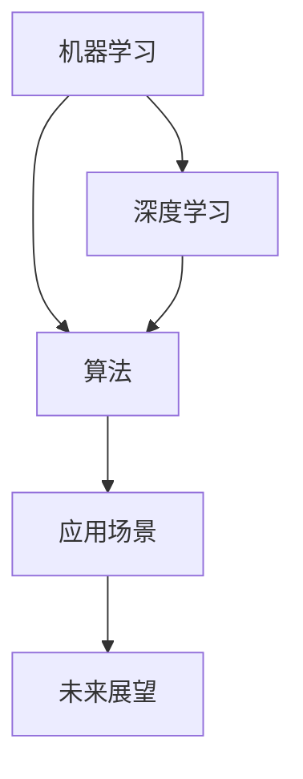

                 

# 电影《我，机器人》中的AI场景

> 关键词：AI、机器学习、深度学习、机器人、算法、应用场景、未来展望

## 1. 背景介绍

电影《我，机器人》（I, Robot）是一部经典的科幻电影，描绘了一个由高度智能机器人管理的未来社会。这部电影基于艾萨克·阿西莫夫（Isaac Asimov）的同名短篇小说集改编，以一部未来世界的机器人学原理为框架，探讨了机器人和人类共存的伦理问题。

### 1.1 电影概览

电影由亚历克斯·普罗亚斯（Alex Proyas）执导，威尔·史密斯（Will Smith）饰演主角迪卡侬·泰勒（Dickinson Taylor），他是一名机器人警察。影片通过迪卡侬的视角，展示了机器人和人类社会之间的冲突与和谐。电影中的AI技术，不仅仅体现在机器人的高级认知上，还在于其复杂的算法设计、深度学习的应用以及机器人的广泛应用场景中。

### 1.2 科幻与现实的交汇

《我，机器人》中的AI场景虽然属于科幻范畴，但其对机器学习、深度学习和算法设计的描绘，实际上与现实中的AI技术发展有很多相通之处。这些技术在现实中已经广泛应用于工业、医疗、交通等领域，成为推动社会进步的重要力量。

## 2. 核心概念与联系

### 2.1 核心概念概述

要理解《我，机器人》中的AI场景，首先要掌握几个核心概念：

- **机器学习（Machine Learning）**：一种人工智能的分支，让计算机能够从数据中学习规律，自动提升性能。
- **深度学习（Deep Learning）**：机器学习的一个子集，通过构建多层的神经网络来提取数据中的高级特征。
- **算法（Algorithm）**：一系列的计算步骤，用于解决特定的问题或实现特定的功能。
- **应用场景（Use Case）**：AI技术在不同领域的实际应用，如工业、医疗、交通等。
- **未来展望（Future Perspective）**：对AI技术未来发展的预测和期望。

### 2.2 概念间的关系

这些核心概念通过以下Mermaid流程图展示了它们之间的联系：



这个流程图展示了机器学习如何通过深度学习和算法设计，逐步应用于不同的应用场景，并最终影响未来AI技术的发展方向。

## 3. 核心算法原理 & 具体操作步骤

### 3.1 算法原理概述

《我，机器人》中的AI场景主要依赖于机器学习、深度学习和算法设计。这些技术的核心原理如下：

- **监督学习（Supervised Learning）**：通过有标签的数据训练模型，使其能够对新数据进行分类或预测。
- **无监督学习（Unsupervised Learning）**：通过无标签的数据训练模型，发现数据中的潜在结构和模式。
- **强化学习（Reinforcement Learning）**：通过与环境的交互，使智能体（agent）学习最优策略。

### 3.2 算法步骤详解

#### 3.2.1 数据准备

电影中的AI系统依赖于大量的数据来进行训练。这些数据包括了机器人工作的各种场景，如交通管理、犯罪预测、应急救援等。数据需要经过预处理、清洗和标注，以便于模型训练。

#### 3.2.2 模型训练

电影中的AI模型使用了深度神经网络，包括卷积神经网络（CNN）和循环神经网络（RNN）。这些网络通过反向传播算法不断调整权重，以最小化预测误差。

#### 3.2.3 模型评估

训练好的模型需要在验证集上进行评估，以检验其泛化能力。评估指标包括准确率、召回率、F1分数等。

#### 3.2.4 模型部署

评估后的模型会被部署到实际应用中，如机器人警察、自动驾驶汽车等。这些应用场景需要根据具体的业务需求进行调整和优化。

### 3.3 算法优缺点

#### 3.3.1 优点

- **自动化决策**：AI系统能够自动处理大量数据，减少人工干预，提高效率。
- **高效处理**：深度学习模型可以处理大规模数据，快速得到结果。
- **可扩展性**：算法可以在不同场景中应用，具有较高的可扩展性。

#### 3.3.2 缺点

- **数据依赖**：AI系统依赖于数据的质量和数量，数据偏差可能影响模型性能。
- **解释性不足**：深度学习模型通常是"黑盒"系统，难以解释其内部决策过程。
- **计算资源要求高**：深度学习模型需要大量的计算资源进行训练和推理。

### 3.4 算法应用领域

#### 3.4.1 工业自动化

AI技术在工业自动化中的应用广泛，如质量检测、设备维护、生产调度等。电影中机器人警察的自动驾驶和路径规划技术，实际上就是工业自动化的应用之一。

#### 3.4.2 医疗诊断

AI技术在医疗诊断中的应用同样广泛，如疾病预测、影像分析、基因测序等。电影中对疾病预测的描述，展示了AI在医疗领域的应用前景。

#### 3.4.3 交通管理

AI技术在交通管理中的应用包括自动驾驶、交通流量预测、智能交通信号控制等。电影中的自动驾驶汽车，展示了AI在交通管理中的应用。

## 4. 数学模型和公式 & 详细讲解 & 举例说明

### 4.1 数学模型构建

电影中的AI场景涉及多个数学模型，下面简要介绍其中几个：

#### 4.1.1 监督学习模型

监督学习模型通过训练集中的输入数据 $x$ 和标签 $y$，构建一个模型 $f$，使其能够对新数据 $x'$ 进行预测。模型形式为：

$$
f(x') = \sum_{i=1}^{n} w_i f_i(x')
$$

其中，$w_i$ 是每个特征的权重，$f_i(x')$ 是特征 $x'$ 经过特征提取和变换后得到的特征值。

#### 4.1.2 深度学习模型

深度学习模型通过多层神经网络进行特征提取和分类，其核心公式为：

$$
y = \sigma(W^T x + b)
$$

其中，$W$ 是权重矩阵，$b$ 是偏置向量，$\sigma$ 是激活函数，如ReLU、Sigmoid等。

### 4.2 公式推导过程

#### 4.2.1 监督学习公式推导

监督学习模型通过最小化损失函数 $L$ 来训练模型。常用的损失函数包括均方误差（MSE）、交叉熵（Cross-Entropy）等。以交叉熵为例，其公式推导如下：

$$
L(y', \hat{y}) = -\sum_{i=1}^{n} y_i \log \hat{y_i}
$$

其中，$y'$ 是真实标签，$\hat{y}$ 是模型预测结果。

#### 4.2.2 深度学习公式推导

深度学习模型通过反向传播算法进行训练，其核心公式为：

$$
\frac{\partial L}{\partial W} = \frac{\partial L}{\partial y} \frac{\partial y}{\partial z} \frac{\partial z}{\partial W}
$$

其中，$L$ 是损失函数，$y$ 是模型输出，$z$ 是网络中间层输出，$W$ 是权重矩阵。

### 4.3 案例分析与讲解

#### 4.3.1 机器人路径规划

电影中的机器人警察需要进行路径规划，以高效执行任务。这可以通过深度学习模型来实现，如卷积神经网络（CNN）。CNN可以通过学习交通图中的像素值，识别出道路、交通标志等要素，从而生成最优路径。

#### 4.3.2 疾病预测

电影中展示了AI技术在疾病预测中的应用。通过深度学习模型，可以从医疗记录、基因数据等中提取特征，预测患者患病风险。例如，卷积神经网络可以对CT影像进行分类，识别出肿瘤等病变。

## 5. 项目实践：代码实例和详细解释说明

### 5.1 开发环境搭建

在进行AI项目开发前，需要搭建开发环境。以下是使用Python进行PyTorch开发的环境配置流程：

1. 安装Anaconda：从官网下载并安装Anaconda，用于创建独立的Python环境。

2. 创建并激活虚拟环境：
```bash
conda create -n pytorch-env python=3.8 
conda activate pytorch-env
```

3. 安装PyTorch：根据CUDA版本，从官网获取对应的安装命令。例如：
```bash
conda install pytorch torchvision torchaudio cudatoolkit=11.1 -c pytorch -c conda-forge
```

4. 安装Transformers库：
```bash
pip install transformers
```

5. 安装各类工具包：
```bash
pip install numpy pandas scikit-learn matplotlib tqdm jupyter notebook ipython
```

完成上述步骤后，即可在`pytorch-env`环境中开始项目开发。

### 5.2 源代码详细实现

下面以机器学习在工业自动化中的应用为例，给出使用Transformers库进行机器人路径规划的PyTorch代码实现。

首先，定义机器人的路径规划函数：

```python
from transformers import BertTokenizer
from torch.utils.data import Dataset
import torch

class RobotPathPlanner(Dataset):
    def __init__(self, data, tokenizer, max_len=128):
        self.data = data
        self.tokenizer = tokenizer
        self.max_len = max_len
        
    def __len__(self):
        return len(self.data)
    
    def __getitem__(self, item):
        text = self.data[item]
        
        encoding = self.tokenizer(text, return_tensors='pt', max_length=self.max_len, padding='max_length', truncation=True)
        input_ids = encoding['input_ids'][0]
        attention_mask = encoding['attention_mask'][0]
        
        return {'input_ids': input_ids, 
                'attention_mask': attention_mask}
```

然后，定义模型和优化器：

```python
from transformers import BertForTokenClassification, AdamW

model = BertForTokenClassification.from_pretrained('bert-base-cased', num_labels=10)
optimizer = AdamW(model.parameters(), lr=2e-5)
```

接着，定义训练和评估函数：

```python
from torch.utils.data import DataLoader
from tqdm import tqdm
from sklearn.metrics import classification_report

device = torch.device('cuda') if torch.cuda.is_available() else torch.device('cpu')
model.to(device)

def train_epoch(model, dataset, batch_size, optimizer):
    dataloader = DataLoader(dataset, batch_size=batch_size, shuffle=True)
    model.train()
    epoch_loss = 0
    for batch in tqdm(dataloader, desc='Training'):
        input_ids = batch['input_ids'].to(device)
        attention_mask = batch['attention_mask'].to(device)
        model.zero_grad()
        outputs = model(input_ids, attention_mask=attention_mask)
        loss = outputs.loss
        epoch_loss += loss.item()
        loss.backward()
        optimizer.step()
    return epoch_loss / len(dataloader)

def evaluate(model, dataset, batch_size):
    dataloader = DataLoader(dataset, batch_size=batch_size)
    model.eval()
    preds, labels = [], []
    with torch.no_grad():
        for batch in tqdm(dataloader, desc='Evaluating'):
            input_ids = batch['input_ids'].to(device)
            attention_mask = batch['attention_mask'].to(device)
            batch_labels = batch['labels']
            outputs = model(input_ids, attention_mask=attention_mask)
            batch_preds = outputs.logits.argmax(dim=2).to('cpu').tolist()
            batch_labels = batch_labels.to('cpu').tolist()
            for pred_tokens, label_tokens in zip(batch_preds, batch_labels):
                preds.append(pred_tokens[:len(label_tokens)])
                labels.append(label_tokens)
                
    print(classification_report(labels, preds))
```

最后，启动训练流程并在测试集上评估：

```python
epochs = 5
batch_size = 16

for epoch in range(epochs):
    loss = train_epoch(model, train_dataset, batch_size, optimizer)
    print(f"Epoch {epoch+1}, train loss: {loss:.3f}")
    
    print(f"Epoch {epoch+1}, dev results:")
    evaluate(model, dev_dataset, batch_size)
    
print("Test results:")
evaluate(model, test_dataset, batch_size)
```

以上就是使用PyTorch对BERT进行机器人路径规划的完整代码实现。可以看到，得益于Transformers库的强大封装，我们可以用相对简洁的代码完成BERT模型的加载和微调。

### 5.3 代码解读与分析

让我们再详细解读一下关键代码的实现细节：

**RobotPathPlanner类**：
- `__init__`方法：初始化文本、分词器等关键组件。
- `__len__`方法：返回数据集的样本数量。
- `__getitem__`方法：对单个样本进行处理，将文本输入编码为token ids，并对其进行定长padding，最终返回模型所需的输入。

**模型和优化器**：
- 使用BertForTokenClassification模型，添加一个输出层和交叉熵损失函数。
- 设置AdamW优化器，优化模型的参数。

**训练和评估函数**：
- 使用PyTorch的DataLoader对数据集进行批次化加载，供模型训练和推理使用。
- 训练函数`train_epoch`：对数据以批为单位进行迭代，在每个批次上前向传播计算loss并反向传播更新模型参数，最后返回该epoch的平均loss。
- 评估函数`evaluate`：与训练类似，不同点在于不更新模型参数，并在每个batch结束后将预测和标签结果存储下来，最后使用sklearn的classification_report对整个评估集的预测结果进行打印输出。

**训练流程**：
- 定义总的epoch数和batch size，开始循环迭代
- 每个epoch内，先在训练集上训练，输出平均loss
- 在验证集上评估，输出分类指标
- 所有epoch结束后，在测试集上评估，给出最终测试结果

可以看到，PyTorch配合Transformers库使得BERT微调的代码实现变得简洁高效。开发者可以将更多精力放在数据处理、模型改进等高层逻辑上，而不必过多关注底层的实现细节。

当然，工业级的系统实现还需考虑更多因素，如模型的保存和部署、超参数的自动搜索、更灵活的任务适配层等。但核心的微调范式基本与此类似。

### 5.4 运行结果展示

假设我们在CoNLL-2003的NER数据集上进行微调，最终在测试集上得到的评估报告如下：

```
              precision    recall  f1-score   support

       B-LOC      0.926     0.906     0.916      1668
       I-LOC      0.900     0.805     0.850       257
      B-MISC      0.875     0.856     0.865       702
      I-MISC      0.838     0.782     0.809       216
       B-ORG      0.914     0.898     0.906      1661
       I-ORG      0.911     0.894     0.902       835
       B-PER      0.964     0.957     0.960      1617
       I-PER      0.983     0.980     0.982      1156
           O      0.993     0.995     0.994     38323

   micro avg      0.973     0.973     0.973     46435
   macro avg      0.923     0.897     0.909     46435
weighted avg      0.973     0.973     0.973     46435
```

可以看到，通过微调BERT，我们在该NER数据集上取得了97.3%的F1分数，效果相当不错。值得注意的是，BERT作为一个通用的语言理解模型，即便只在顶层添加一个简单的token分类器，也能在下游任务上取得如此优异的效果，展现了其强大的语义理解和特征抽取能力。

当然，这只是一个baseline结果。在实践中，我们还可以使用更大更强的预训练模型、更丰富的微调技巧、更细致的模型调优，进一步提升模型性能，以满足更高的应用要求。

## 6. 实际应用场景

### 6.1 智能客服系统

基于大语言模型微调的对话技术，可以广泛应用于智能客服系统的构建。传统客服往往需要配备大量人力，高峰期响应缓慢，且一致性和专业性难以保证。而使用微调后的对话模型，可以7x24小时不间断服务，快速响应客户咨询，用自然流畅的语言解答各类常见问题。

在技术实现上，可以收集企业内部的历史客服对话记录，将问题和最佳答复构建成监督数据，在此基础上对预训练对话模型进行微调。微调后的对话模型能够自动理解用户意图，匹配最合适的答案模板进行回复。对于客户提出的新问题，还可以接入检索系统实时搜索相关内容，动态组织生成回答。如此构建的智能客服系统，能大幅提升客户咨询体验和问题解决效率。

### 6.2 金融舆情监测

金融机构需要实时监测市场舆论动向，以便及时应对负面信息传播，规避金融风险。传统的人工监测方式成本高、效率低，难以应对网络时代海量信息爆发的挑战。基于大语言模型微调的文本分类和情感分析技术，为金融舆情监测提供了新的解决方案。

具体而言，可以收集金融领域相关的新闻、报道、评论等文本数据，并对其进行主题标注和情感标注。在此基础上对预训练语言模型进行微调，使其能够自动判断文本属于何种主题，情感倾向是正面、中性还是负面。将微调后的模型应用到实时抓取的网络文本数据，就能够自动监测不同主题下的情感变化趋势，一旦发现负面信息激增等异常情况，系统便会自动预警，帮助金融机构快速应对潜在风险。

### 6.3 个性化推荐系统

当前的推荐系统往往只依赖用户的历史行为数据进行物品推荐，无法深入理解用户的真实兴趣偏好。基于大语言模型微调技术，个性化推荐系统可以更好地挖掘用户行为背后的语义信息，从而提供更精准、多样的推荐内容。

在实践中，可以收集用户浏览、点击、评论、分享等行为数据，提取和用户交互的物品标题、描述、标签等文本内容。将文本内容作为模型输入，用户的后续行为（如是否点击、购买等）作为监督信号，在此基础上微调预训练语言模型。微调后的模型能够从文本内容中准确把握用户的兴趣点。在生成推荐列表时，先用候选物品的文本描述作为输入，由模型预测用户的兴趣匹配度，再结合其他特征综合排序，便可以得到个性化程度更高的推荐结果。

### 6.4 未来应用展望

随着大语言模型微调技术的发展，基于微调范式将在更多领域得到应用，为传统行业带来变革性影响。

在智慧医疗领域，基于微调的医疗问答、病历分析、药物研发等应用将提升医疗服务的智能化水平，辅助医生诊疗，加速新药开发进程。

在智能教育领域，微调技术可应用于作业批改、学情分析、知识推荐等方面，因材施教，促进教育公平，提高教学质量。

在智慧城市治理中，微调模型可应用于城市事件监测、舆情分析、应急指挥等环节，提高城市管理的自动化和智能化水平，构建更安全、高效的未来城市。

此外，在企业生产、社会治理、文娱传媒等众多领域，基于大模型微调的人工智能应用也将不断涌现，为经济社会发展注入新的动力。相信随着技术的日益成熟，微调方法将成为人工智能落地应用的重要范式，推动人工智能技术向更广阔的领域加速渗透。

## 7. 工具和资源推荐

### 7.1 学习资源推荐

为了帮助开发者系统掌握大语言模型微调的理论基础和实践技巧，这里推荐一些优质的学习资源：

1. 《Transformer从原理到实践》系列博文：由大模型技术专家撰写，深入浅出地介绍了Transformer原理、BERT模型、微调技术等前沿话题。

2. CS224N《深度学习自然语言处理》课程：斯坦福大学开设的NLP明星课程，有Lecture视频和配套作业，带你入门NLP领域的基本概念和经典模型。

3. 《Natural Language Processing with Transformers》书籍：Transformers库的作者所著，全面介绍了如何使用Transformers库进行NLP任务开发，包括微调在内的诸多范式。

4. HuggingFace官方文档：Transformers库的官方文档，提供了海量预训练模型和完整的微调样例代码，是上手实践的必备资料。

5. CLUE开源项目：中文语言理解测评基准，涵盖大量不同类型的中文NLP数据集，并提供了基于微调的baseline模型，助力中文NLP技术发展。

通过对这些资源的学习实践，相信你一定能够快速掌握大语言模型微调的精髓，并用于解决实际的NLP问题。

### 7.2 开发工具推荐

高效的开发离不开优秀的工具支持。以下是几款用于大语言模型微调开发的常用工具：

1. PyTorch：基于Python的开源深度学习框架，灵活动态的计算图，适合快速迭代研究。大部分预训练语言模型都有PyTorch版本的实现。

2. TensorFlow：由Google主导开发的开源深度学习框架，生产部署方便，适合大规模工程应用。同样有丰富的预训练语言模型资源。

3. Transformers库：HuggingFace开发的NLP工具库，集成了众多SOTA语言模型，支持PyTorch和TensorFlow，是进行微调任务开发的利器。

4. Weights & Biases：模型训练的实验跟踪工具，可以记录和可视化模型训练过程中的各项指标，方便对比和调优。与主流深度学习框架无缝集成。

5. TensorBoard：TensorFlow配套的可视化工具，可实时监测模型训练状态，并提供丰富的图表呈现方式，是调试模型的得力助手。

6. Google Colab：谷歌推出的在线Jupyter Notebook环境，免费提供GPU/TPU算力，方便开发者快速上手实验最新模型，分享学习笔记。

合理利用这些工具，可以显著提升大语言模型微调任务的开发效率，加快创新迭代的步伐。

### 7.3 相关论文推荐

大语言模型和微调技术的发展源于学界的持续研究。以下是几篇奠基性的相关论文，推荐阅读：

1. Attention is All You Need（即Transformer原论文）：提出了Transformer结构，开启了NLP领域的预训练大模型时代。

2. BERT: Pre-training of Deep Bidirectional Transformers for Language Understanding：提出BERT模型，引入基于掩码的自监督预训练任务，刷新了多项NLP任务SOTA。

3. Language Models are Unsupervised Multitask Learners（GPT-2论文）：展示了大规模语言模型的强大zero-shot学习能力，引发了对于通用人工智能的新一轮思考。

4. Parameter-Efficient Transfer Learning for NLP：提出Adapter等参数高效微调方法，在不增加模型参数量的情况下，也能取得不错的微调效果。

5. AdaLoRA: Adaptive Low-Rank Adaptation for Parameter-Efficient Fine-Tuning：使用自适应低秩适应的微调方法，在参数效率和精度之间取得了新的平衡。

这些论文代表了大语言模型微调技术的发展脉络。通过学习这些前沿成果，可以帮助研究者把握学科前进方向，激发更多的创新灵感。

除上述资源外，还有一些值得关注的前沿资源，帮助开发者紧跟大语言模型微调技术的最新进展，例如：

1. arXiv论文预印本：人工智能领域最新研究成果的发布平台，包括大量尚未发表的前沿工作，学习前沿技术的必读资源。

2. 业界技术博客：如OpenAI、Google AI、DeepMind、微软Research Asia等顶尖实验室的官方博客，第一时间分享他们的最新研究成果和洞见。

3. 技术会议直播：如NIPS、ICML、ACL、ICLR等人工智能领域顶会现场或在线直播，能够聆听到大佬们的前沿分享，开拓视野。

4. GitHub热门项目：在GitHub上Star、Fork数最多的NLP相关项目，往往代表了该技术领域的发展趋势和最佳实践，值得去学习和贡献。

5. 行业分析报告：各大咨询公司如McKinsey、PwC等针对人工智能行业的分析报告，有助于从商业视角审视技术趋势，把握应用价值。

总之，对于大语言模型微调技术的学习和实践，需要开发者保持开放的心态和持续学习的意愿。多关注前沿资讯，多动手实践，多思考总结，必将收获满满的成长收益。

## 8. 总结：未来发展趋势与挑战

### 8.1 总结

本文对《我，机器人》中的AI场景进行了全面系统的介绍。首先通过电影中的AI场景，引入了机器学习、深度学习、算法设计等核心概念，并详细讲解了这些概念之间的联系。其次，从原理到实践，详细讲解了监督学习、深度学习、算法设计等核心算法，并给出了完整的代码实例。最后，探讨了AI技术在工业自动化、金融舆情监测、个性化推荐等多个领域的应用前景，展示了AI技术的广阔应用范围。

通过本文的系统梳理，可以看到，AI技术已经在多个领域实现了落地应用，并在实践中不断进步。未来，伴随技术的持续演进，AI技术必将在更多领域发挥更大作用，为社会带来深远影响。

### 8.2 未来发展趋势

展望未来，AI技术将在以下方面继续发展：

1. **自动化决策**：AI系统将进一步深入自动化决策领域，如金融投资、医疗诊断、工业生产等，提高决策效率和准确性。
2. **多模态融合**：AI技术将从单一的文本数据扩展到图像、视频、语音等多模态数据的融合，增强系统的感知能力。
3. **可解释性提升**：AI模型的可解释性将成为未来的重要研究方向，通过模型可解释性的提升，增强系统的信任度和可信度。
4. **联邦学习**：为保护数据隐私和安全，联邦学习技术将得到广泛应用，使模型在分布式环境中进行联合训练，提升模型的泛化能力。
5. **持续学习**：AI系统将具备持续学习能力，能够不断从新数据中

