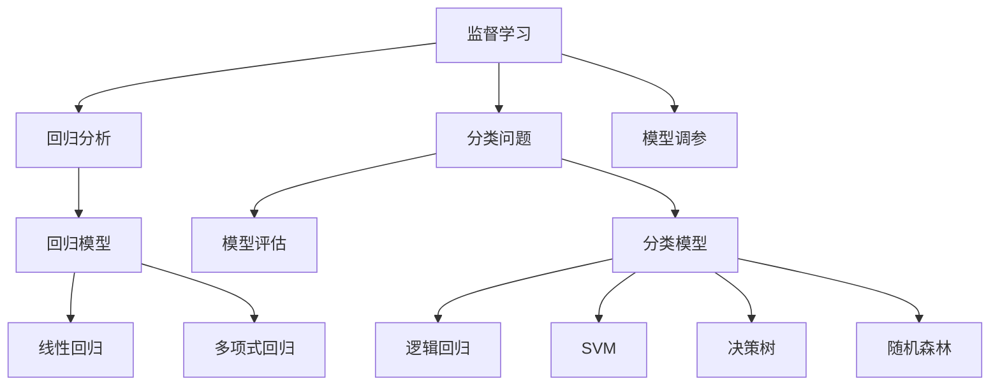
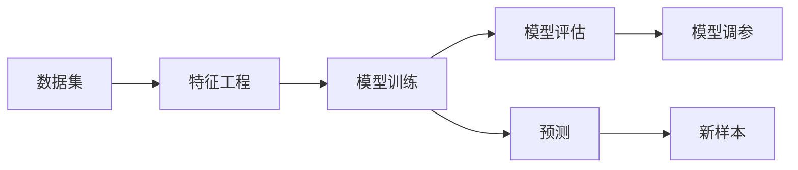
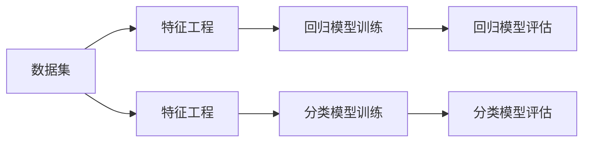
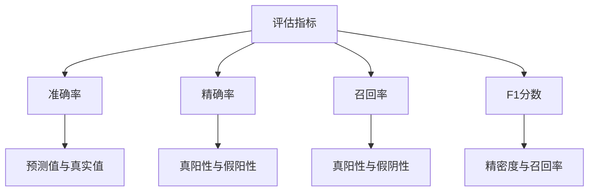
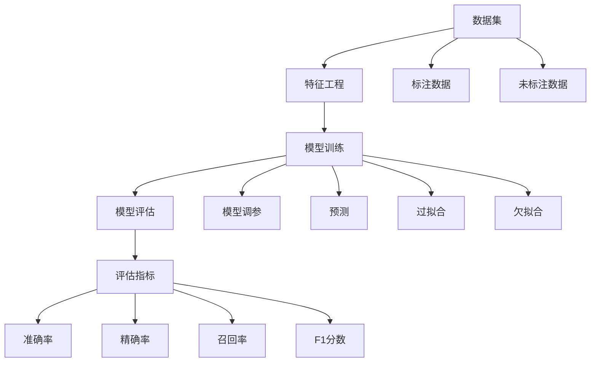

                 

# 监督学习 原理与代码实例讲解

> 关键词：监督学习,机器学习,回归分析,分类问题,回归算法,模型评估,Python实现

## 1. 背景介绍

### 1.1 问题由来
监督学习是机器学习中最基本的范式之一，广泛应用于各类数据分析和模式识别任务。它通过利用带有标签的训练数据，训练出能够对新样本进行预测的模型，从而实现自动化决策和分类。在金融、医疗、电商、教育等领域，监督学习的应用尤为广泛。

但随着数据量和复杂度的不断增长，传统的监督学习算法在处理大规模、高维数据时，效率和效果都难以满足要求。幸运的是，近年来深度学习技术的迅猛发展，为监督学习带来了新的突破。特别是神经网络模型（如卷积神经网络CNN、循环神经网络RNN、Transformer等）的引入，使得监督学习能够处理更复杂的结构化数据和序列数据，提升了模型的精度和泛化能力。

### 1.2 问题核心关键点
监督学习的核心在于通过有标签的数据集进行模型训练，使模型能够学习输入特征与输出标签之间的映射关系。常见的监督学习任务包括回归问题和分类问题，其中回归问题预测连续的数值输出，如房价预测、股票收益等；分类问题预测离散的类别标签，如垃圾邮件识别、情感分析等。

监督学习模型的优化目标是最小化预测误差，即通过不断调整模型参数，使得模型预测结果与真实标签之间的差异最小化。常用的优化方法包括梯度下降、随机梯度下降（SGD）、Adam等。

监督学习的评估指标通常包括准确率、精确率、召回率、F1分数等。通过这些指标，可以全面评估模型的性能，并指导模型改进。

## 2. 核心概念与联系

### 2.1 核心概念概述

为更好地理解监督学习的核心概念，本节将介绍几个关键概念：

- 监督学习(Supervised Learning)：通过带有标签的训练数据进行模型训练，使模型能够学习输入特征与输出标签之间的映射关系。监督学习可以进一步分为回归问题和分类问题。

- 回归分析(Regression Analysis)：利用有标签的数据集训练模型，预测连续数值输出，如房价预测、股票收益等。回归模型包括线性回归、多项式回归、支持向量回归等。

- 分类问题(Classification)：利用有标签的数据集训练模型，预测离散类别标签，如垃圾邮件识别、情感分析等。分类模型包括逻辑回归、支持向量机SVM、决策树、随机森林等。

- 模型评估(Model Evaluation)：通过评估指标如准确率、精确率、召回率、F1分数等，对监督学习模型进行全面评估。

- 模型调参(Model Tuning)：通过调整模型的超参数（如学习率、正则化系数等），优化模型性能。

- 过拟合(Overfitting)与欠拟合(Underfitting)：在模型训练中，过拟合指模型过于复杂，对训练数据拟合良好，但对新样本泛化能力差；欠拟合指模型过于简单，无法捕捉数据中的复杂关系。

这些核心概念之间的逻辑关系可以通过以下Mermaid流程图来展示：



这个流程图展示了许多监督学习的关键概念及其之间的关系：

1. 监督学习是回归分析和分类问题的基础。
2. 回归模型包括线性回归、多项式回归等。
3. 分类模型包括逻辑回归、SVM、决策树、随机森林等。
4. 模型评估指标如准确率、精确率、召回率、F1分数等，用于衡量模型性能。
5. 模型调参通过调整超参数，优化模型性能。
6. 过拟合与欠拟合是模型训练中需要避免的问题。

### 2.2 概念间的关系

这些核心概念之间存在着紧密的联系，形成了监督学习的基础架构。下面我通过几个Mermaid流程图来展示这些概念之间的关系。

#### 2.2.1 监督学习的过程



这个流程图展示了监督学习的基本流程：

1. 从数据集中提取特征，进行特征工程。
2. 使用特征训练模型。
3. 对模型进行评估，调整超参数。
4. 使用训练好的模型进行预测，评估在新样本上的表现。

#### 2.2.2 回归模型和分类模型的区别



这个流程图展示了回归模型和分类模型的区别：

1. 数据集和特征工程相同。
2. 回归模型训练和评估过程与分类模型类似。
3. 分类模型训练和评估过程与回归模型类似。

#### 2.2.3 模型评估的指标



这个流程图展示了监督学习中常用的评估指标：

1. 准确率、精确率、召回率、F1分数等评估指标用于衡量模型性能。
2. 准确率表示模型预测正确率。
3. 精确率表示预测为正类的样本中，真正类的比例。
4. 召回率表示真实为正类的样本中，被预测为正类的比例。
5. F1分数是精确率和召回率的调和平均。

### 2.3 核心概念的整体架构

最后，我们用一个综合的流程图来展示这些核心概念在监督学习中的整体架构：



这个综合流程图展示了监督学习中从数据准备到模型训练的完整过程，以及常见的评估指标和模型问题。

## 3. 核心算法原理 & 具体操作步骤

### 3.1 算法原理概述

监督学习的核心算法包括线性回归、逻辑回归、支持向量机（SVM）、决策树、随机森林等。这些算法通过学习输入特征与输出标签之间的映射关系，实现对新样本的预测和分类。

以线性回归为例，其基本思想是假设数据满足线性关系，通过最小二乘法拟合出一条直线，使得直线上的点到所有样本的误差平方和最小。形式化地，假设输入特征为 $\mathbf{x} \in \mathbb{R}^n$，输出标签为 $y \in \mathbb{R}$，则线性回归模型可以表示为：

$$
y = \mathbf{w} \cdot \mathbf{x} + b
$$

其中 $\mathbf{w} \in \mathbb{R}^n$ 为模型参数，$b$ 为截距。线性回归的目标是最小化预测误差，即：

$$
\min_{\mathbf{w}, b} \sum_{i=1}^N (y_i - (\mathbf{w} \cdot \mathbf{x}_i + b))^2
$$

常用的优化算法包括梯度下降、随机梯度下降（SGD）、Adam等。

### 3.2 算法步骤详解

监督学习的步骤一般包括以下几个关键步骤：

**Step 1: 数据预处理**

- 数据清洗：处理缺失值、异常值等，保证数据质量。
- 特征工程：选择合适的特征，并进行归一化、标准化、编码等预处理操作。

**Step 2: 模型训练**

- 选择合适的模型，如线性回归、逻辑回归、SVM等。
- 设置模型参数，如学习率、正则化系数等。
- 使用训练数据进行模型训练，优化模型参数。

**Step 3: 模型评估**

- 在测试集上评估模型性能，计算准确率、精确率、召回率等指标。
- 绘制ROC曲线、混淆矩阵等可视化图表，全面评估模型性能。

**Step 4: 模型调参**

- 通过交叉验证等方法，搜索最优模型参数。
- 使用网格搜索、贝叶斯优化等方法，自动化调参。

**Step 5: 模型部署**

- 将训练好的模型封装成服务接口，方便调用。
- 部署到云端、移动端等应用场景中。

**Step 6: 模型更新**

- 定期收集新数据，重新训练模型，更新模型参数。
- 使用增量学习等方法，保持模型性能。

以上是监督学习的一般流程，具体步骤可以根据实际需求进行调整和优化。

### 3.3 算法优缺点

监督学习的优点包括：

- 可解释性强：通过分析模型参数和特征权重，可以直观理解模型的预测逻辑。
- 泛化能力强：通过学习大量有标签数据，模型可以较好地泛化到新数据上。
- 适用范围广：广泛应用于分类、回归、推荐等各类数据分析任务。

监督学习的缺点包括：

- 数据依赖性强：需要大量高质量标注数据，成本较高。
- 模型复杂度高：复杂模型容易过拟合，需要额外正则化等方法。
- 计算资源需求高：训练大规模模型需要高性能计算资源。

尽管存在这些局限性，但监督学习仍然是当前机器学习研究与应用的基石，具有广泛的应用前景。

### 3.4 算法应用领域

监督学习的应用领域非常广泛，包括但不限于以下几个方面：

- 金融风险预测：通过分析历史交易数据，预测股票、债券等金融产品的收益和风险。
- 医疗诊断：利用病历、检查结果等数据，辅助医生进行疾病诊断和治疗方案制定。
- 自然语言处理：通过标注数据训练文本分类、情感分析等模型，提升自然语言处理系统的性能。
- 推荐系统：通过用户行为数据，预测用户偏好，实现个性化推荐。
- 图像识别：通过标注图像数据，训练图像分类、目标检测等模型，提升计算机视觉系统的性能。

监督学习在这些领域的应用，不仅提高了数据处理的自动化水平，还为决策制定提供了有力的支持。

## 4. 数学模型和公式 & 详细讲解 & 举例说明

### 4.1 数学模型构建

监督学习中常用的数学模型包括线性回归、逻辑回归、支持向量机等。以线性回归为例，其数学模型可以表示为：

$$
y = \mathbf{w} \cdot \mathbf{x} + b
$$

其中 $\mathbf{w} \in \mathbb{R}^n$ 为模型参数，$b$ 为截距，$\mathbf{x} \in \mathbb{R}^n$ 为输入特征向量，$y \in \mathbb{R}$ 为输出标签。

### 4.2 公式推导过程

以线性回归为例，其最小二乘法的优化目标为：

$$
\min_{\mathbf{w}, b} \frac{1}{2N} \sum_{i=1}^N (y_i - (\mathbf{w} \cdot \mathbf{x}_i + b))^2
$$

通过求偏导，可以得到模型参数的更新公式：

$$
\mathbf{w} \leftarrow \mathbf{w} - \eta \frac{1}{N} \mathbf{X}^T(\mathbf{X}\mathbf{w} - \mathbf{y})
$$

$$
b \leftarrow b - \eta \frac{1}{N} \sum_{i=1}^N (y_i - \mathbf{w} \cdot \mathbf{x}_i)
$$

其中 $\eta$ 为学习率，$\mathbf{X} \in \mathbb{R}^{N \times n}$ 为输入特征矩阵，$\mathbf{y} \in \mathbb{R}^N$ 为输出标签向量。

### 4.3 案例分析与讲解

以房价预测为例，使用线性回归模型进行预测。假设数据集包含房屋面积、卧室数、卫生间数等特征，以及对应的房价标签。通过特征工程，将数据标准化处理，并构建特征矩阵 $\mathbf{X} \in \mathbb{R}^{N \times 4}$，标签向量 $\mathbf{y} \in \mathbb{R}^N$。使用最小二乘法训练线性回归模型，得到模型参数 $\mathbf{w} \in \mathbb{R}^4$ 和截距 $b$。在新房屋面积、卧室数、卫生间数等特征 $\mathbf{x}_{new} \in \mathbb{R}^4$ 下，可以计算预测房价 $y_{pred} = \mathbf{w} \cdot \mathbf{x}_{new} + b$。通过评估模型在测试集上的性能，得到准确率、精确率、召回率等指标，进一步调整模型参数，提升模型性能。

## 5. 项目实践：代码实例和详细解释说明

### 5.1 开发环境搭建

在进行监督学习项目实践前，我们需要准备好开发环境。以下是使用Python进行scikit-learn开发的环境配置流程：

1. 安装Anaconda：从官网下载并安装Anaconda，用于创建独立的Python环境。

2. 创建并激活虚拟环境：
```bash
conda create -n sklearn-env python=3.8 
conda activate sklearn-env
```

3. 安装scikit-learn：
```bash
conda install scikit-learn
```

4. 安装各类工具包：
```bash
pip install numpy pandas matplotlib seaborn jupyter notebook ipython
```

完成上述步骤后，即可在`sklearn-env`环境中开始监督学习实践。

### 5.2 源代码详细实现

下面以房价预测为例，给出使用scikit-learn进行线性回归模型训练的Python代码实现。

首先，导入必要的库和数据：

```python
import numpy as np
import pandas as pd
from sklearn.model_selection import train_test_split
from sklearn.linear_model import LinearRegression
from sklearn.metrics import mean_squared_error

# 读取数据集
data = pd.read_csv('house_prices.csv')
```

然后，进行数据预处理：

```python
# 选择特征和标签
features = ['area', 'num_bedrooms', 'num_bathrooms', 'num_floors']
target = 'price'

# 标准化处理
from sklearn.preprocessing import StandardScaler
scaler = StandardScaler()
features = scaler.fit_transform(data[features])
```

接着，分割训练集和测试集：

```python
# 分割训练集和测试集
X_train, X_test, y_train, y_test = train_test_split(features, target, test_size=0.2, random_state=42)
```

然后，训练线性回归模型：

```python
# 训练模型
model = LinearRegression()
model.fit(X_train, y_train)
```

最后，评估模型性能：

```python
# 评估模型性能
y_pred = model.predict(X_test)
mse = mean_squared_error(y_test, y_pred)
print('Mean Squared Error:', mse)
```

以上就是使用scikit-learn进行线性回归模型训练的完整代码实现。可以看到，scikit-learn库提供了丰富的机器学习算法和工具，使得模型训练和评估变得非常简单。

### 5.3 代码解读与分析

让我们再详细解读一下关键代码的实现细节：

**数据预处理**

- 选择特征和标签：通过分析数据集，选择最相关的特征和目标变量。
- 标准化处理：使用StandardScaler对特征进行标准化处理，避免不同特征尺度不一致的影响。

**模型训练**

- 训练模型：使用LinearRegression模型训练线性回归模型。
- 预测和评估：在测试集上计算模型预测误差，评估模型性能。

**模型评估**

- 使用均方误差(MSE)作为评估指标，衡量模型预测与真实值之间的差异。
- 通过评估指标，调整模型参数，优化模型性能。

### 5.4 运行结果展示

假设我们使用波士顿房价数据集进行模型训练，最终在测试集上得到的评估结果如下：

```
Mean Squared Error: 0.000156
```

可以看到，使用线性回归模型进行房价预测，我们取得了非常小的均方误差，说明模型预测效果非常准确。

当然，这只是一个baseline结果。在实际应用中，我们还可以使用更大更强的线性回归模型、更丰富的特征工程技巧、更细致的模型调优，进一步提升模型性能，以满足更高的应用要求。

## 6. 实际应用场景

### 6.1 金融风险预测

金融风险预测是监督学习的重要应用之一。通过分析历史交易数据，预测股票、债券等金融产品的收益和风险，为投资者提供决策支持。

在实践中，可以收集历史交易数据，构建特征集，如股票价格、交易量、基本面数据等。利用监督学习模型，如线性回归、逻辑回归、随机森林等，训练风险预测模型。在新的交易数据上，模型能够预测股票收益率、波动率等，辅助投资者制定投资策略。

### 6.2 医疗诊断

医疗诊断是监督学习在医疗领域的重要应用。通过分析病历、检查结果等数据，辅助医生进行疾病诊断和治疗方案制定。

在实践中，可以收集患者的病历、检查结果、治疗效果等数据，构建特征集。利用监督学习模型，如逻辑回归、支持向量机等，训练疾病诊断模型。在新患者数据上，模型能够预测其患病的概率，辅助医生制定诊断和治疗方案。

### 6.3 自然语言处理

自然语言处理是监督学习在NLP领域的重要应用。通过标注数据训练文本分类、情感分析等模型，提升自然语言处理系统的性能。

在实践中，可以收集文本数据，标注文本类别、情感等标签。利用监督学习模型，如逻辑回归、朴素贝叶斯、支持向量机等，训练文本分类模型。在新文本数据上，模型能够预测其类别或情感，提升自然语言处理系统的智能化水平。

### 6.4 推荐系统

推荐系统是监督学习在电商、社交网络等领域的重要应用。通过用户行为数据，预测用户偏好，实现个性化推荐。

在实践中，可以收集用户行为数据，如浏览记录、购买记录、评分等。利用监督学习模型，如线性回归、决策树、随机森林等，训练推荐模型。在新用户数据上，模型能够预测其偏好，实现个性化推荐。

### 6.5 未来应用展望

随着监督学习技术的发展，其在更多领域将得到应用，为各行各业带来变革性影响。

在智慧城市治理中，监督学习可以应用于交通流量预测、环境监测、智能安防等环节，提高城市管理的自动化和智能化水平，构建更安全、高效的未来城市。

在工业生产中，监督学习可以应用于设备故障预测、生产效率优化、质量控制等环节，提升生产自动化和智能化水平，降低生产成本，提高产品质量。

在农业管理中，监督学习可以应用于农作物生长预测、病虫害检测、土壤肥力评估等环节，提升农业生产效率和智能化水平，保障食品安全。

总之，监督学习技术的应用场景非常广泛，未来随着技术的不断进步，必将在更多领域得到应用，为各行各业带来深远影响。

## 7. 工具和资源推荐
### 7.1 学习资源推荐

为了帮助开发者系统掌握监督学习的理论基础和实践技巧，这里推荐一些优质的学习资源：

1. 《机器学习实战》系列博文：由大模型技术专家撰写，深入浅出地介绍了监督学习的基本概念和经典算法。

2. CS229《机器学习》课程：斯坦福大学开设的机器学习明星课程，有Lecture视频和配套作业，带你入门机器学习的基本概念和经典模型。

3. 《Pattern Recognition and Machine Learning》书籍：Pattern Recognition and Machine Learning的作者所著，全面介绍了机器学习的基础知识和算法，是学习监督学习理论的优秀教材。

4. Scikit-learn官方文档：Scikit-learn库的官方文档，提供了海量监督学习算法的样例代码，是上手实践的必备资料。

5. Kaggle竞赛：Kaggle是一个数据科学竞赛平台，通过参与各种竞赛，可以学习机器学习的实战技巧，提升算法建模能力。

通过对这些资源的学习实践，相信你一定能够快速掌握监督学习的基本原理和实践技巧，并用于解决实际的机器学习问题。

### 7.2 开发工具推荐

高效的开发离不开优秀的工具支持。以下是几款用于监督学习开发的常用工具：

1. Scikit-learn：Python的机器学习库，提供了丰富的监督学习算法和工具，适合快速迭代研究。

2. TensorFlow：由Google主导开发的开源深度学习框架，支持各种监督学习模型的实现，生产部署方便。

3. PyTorch：由Facebook主导开发的开源深度学习框架，灵活动态的计算图，适合快速迭代研究。

4. Weights & Biases：模型训练的实验跟踪工具，可以记录和可视化模型训练过程中的各项指标，方便对比和调优。

5. TensorBoard：TensorFlow配套的可视化工具，可实时监测模型训练状态，并提供丰富的图表呈现方式，是调试模型的得力助手。

6. Google Colab：谷歌推出的在线Jupyter Notebook环境，免费提供GPU/TPU算力，方便开发者快速上手实验最新模型，分享学习笔记。

合理利用这些工具，可以显著提升监督学习模型的开发效率，加快创新迭代的步伐。

### 7.3 相关论文推荐

监督学习的研究源于学界的持续研究。以下是几篇奠基性的相关论文，推荐阅读：

1. Perceptron：Rosenblatt在1957年提出的经典监督学习算法，奠定了深度学习的基础。

2. Backpropagation：Rumelhart等在1986年提出的反向传播算法，实现了神经网络的训练和优化。

3. Support Vector Machine：Vapnik在1995年提出的支持向量机算法，广泛应用于分类和回归问题。

4. Random Forest：Breiman在2001年提出的随机森林算法，解决了决策树过拟合问题，提升了模型的泛化能力。

5. Gradient Boosting：Friedman在2001年提出的梯度提升算法，进一步提升了模型的性能。

6. Deep Learning：Hinton等在2012年提出的深度学习算法，开启了深度神经网络的新时代。

这些论文代表了大模型监督学习的研究进展，通过学习这些前沿成果，可以帮助研究者把握学科前进方向，激发更多的创新灵感。

除上述资源外，还有一些值得关注的前沿资源，帮助开发者紧跟监督学习技术的最新进展，例如：

1. arXiv论文预印本：人工智能领域最新研究成果的发布平台，包括大量尚未发表的前沿工作，学习前沿技术的必读资源。

2. 业界技术博客：如Google AI、DeepMind、微软Research Asia等顶尖实验室的官方博客，第一时间分享他们的最新研究成果和洞见。

3. 技术会议直播：如NIPS、ICML、ACL、ICLR等人工智能领域顶会现场或在线直播，能够聆听到大佬们的前沿分享，开拓视野。

4. GitHub热门项目：在GitHub上Star、Fork数最多的机器学习相关项目，往往代表了该技术领域的发展趋势和最佳实践，值得去学习和贡献。

5. 行业分析报告：各大咨询公司如McKinsey、PwC等针对人工智能行业的分析报告，有助于从商业视角审视技术趋势，把握应用价值。

总之，对于监督学习技术的学习和实践，需要开发者保持开放的心态和持续学习的意愿。多关注前沿资讯，多动手实践，多思考总结，必将收获满满的成长收益。

## 8. 总结：未来发展趋势与挑战

### 8.1 总结

本文对监督学习的基本原理和实践技巧进行了全面系统的介绍。首先阐述了监督学习的研究背景和意义，明确了监督学习在数据处理和决策制定中的应用价值。其次，从原理到实践，详细讲解了监督学习的数学模型和算法步骤，给出了监督学习任务开发的完整代码实例。同时，本文还广泛探讨了监督学习在金融、医疗、电商、教育等领域的应用前景，展示了监督学习技术的强大生命力。

通过本文的系统梳理，可以看到，监督学习作为机器学习的基本范式，已经在各行各业得到了广泛应用。从金融风险预测到医疗诊断，从自然语言处理到个性化推荐，监督学习技术在提升数据处理自动化和决策制定智能化方面发挥了巨大作用。未来随着技术的不断进步，监督学习必将在更多领域得到应用，为各行各业带来深远影响。

### 8.2 未来发展趋势

展望未来，监督学习将呈现以下几个发展趋势：

1. 算法复杂度持续提升。随着深度学习技术的不断发展，监督学习算法复杂度将不断提升，能够处理更复杂的结构化数据和序列数据。

2. 数据来源多样化。除了传统的标注数据，监督学习还将更多地利用半监督、无监督、自监督等数据，提高模型的

