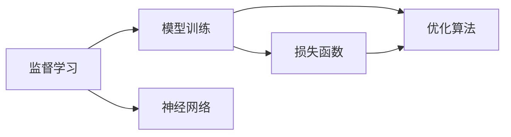
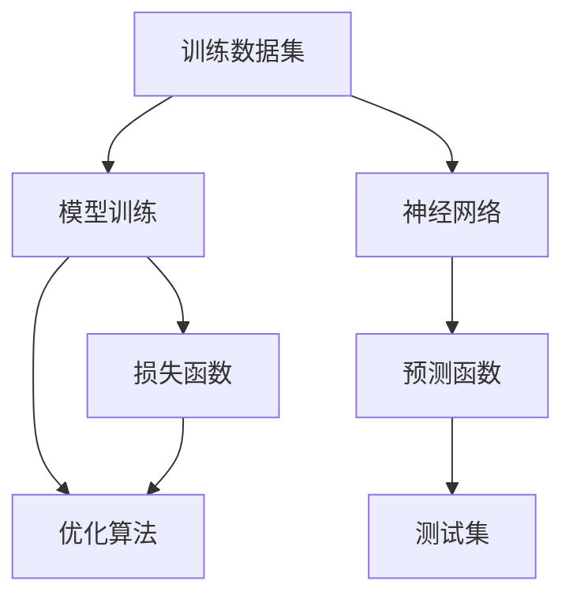

                 

# 监督学习(Supervised Learning) - 原理与代码实例讲解

> 关键词：监督学习, 模型训练, 损失函数, 梯度下降, 神经网络, PyTorch

## 1. 背景介绍

### 1.1 问题由来

监督学习(Supervised Learning)是机器学习领域中最基础、最广泛的应用之一。其核心思想是利用已有的带有标签数据，训练模型使其能够对未知的、未标记数据进行准确的预测。从简单的线性回归、逻辑回归，到复杂的深度神经网络，监督学习覆盖了从入门到高级的各类算法和技术。

在当前AI技术发展迅速的背景下，监督学习在自然语言处理、计算机视觉、推荐系统、金融预测等领域得到了广泛的应用。例如，基于监督学习，可以通过大量的标注数据训练文本分类模型，用于垃圾邮件过滤、情感分析、主题识别等任务；通过训练图像分类模型，可以进行图像识别、医学影像分析等；通过推荐系统模型，可以为用户推荐个性化商品、新闻、视频等。

### 1.2 问题核心关键点

监督学习模型训练的核心在于选择合适的损失函数和优化算法，最小化预测值与真实标签之间的差异。常用的损失函数包括交叉熵损失、均方误差损失等，常用的优化算法包括随机梯度下降(SGD)、Adam、Adagrad等。通过反复迭代，模型不断更新参数，最终逼近目标函数，使得模型预测与真实标签尽量一致。

监督学习的关键在于如何选择合适的损失函数、学习率、正则化等超参数，以确保模型在训练和验证集上均具有良好的泛化能力。同时，如何避免过拟合，减少模型在训练集上的性能提升在测试集上表现不佳的问题，也是监督学习面临的挑战。

## 2. 核心概念与联系

### 2.1 核心概念概述

为更好地理解监督学习，本节将介绍几个密切相关的核心概念：

- **监督学习(Supervised Learning)**：利用已有的标注数据，训练模型使其能够对未知的、未标记数据进行准确预测。
- **模型训练(Model Training)**：在给定训练数据集上，通过模型参数优化，使得模型在训练集上的预测尽量接近真实标签。
- **损失函数(Loss Function)**：衡量模型预测与真实标签之间的差异，常用的有交叉熵损失、均方误差损失等。
- **优化算法(Optimization Algorithm)**：最小化损失函数，使得模型参数逼近最优值。常见的有梯度下降、Adam、Adagrad等。
- **神经网络(Neural Network)**：监督学习中常用的一类模型，通过多层非线性变换，逼近复杂的函数映射。

这些核心概念之间存在着紧密的联系，形成了监督学习的完整框架。通过选择合适的损失函数和优化算法，模型在训练集上不断调整参数，最小化损失函数，最终输出对未知数据的预测。

### 2.2 概念间的关系

这些核心概念之间的逻辑关系可以通过以下Mermaid流程图来展示：



这个流程图展示了监督学习的基本流程：

1. 监督学习利用标注数据进行模型训练，目标是训练出能够对未知数据进行预测的模型。
2. 模型训练通过优化算法最小化损失函数，不断调整模型参数。
3. 损失函数衡量模型预测与真实标签之间的差异。
4. 神经网络是监督学习中常用的模型结构，包含多层非线性变换。

通过这些流程图，我们可以更清晰地理解监督学习的各个环节及其相互作用。

### 2.3 核心概念的整体架构

最后，我们用一个综合的流程图来展示监督学习的完整过程：



这个综合流程图展示了从训练数据集到模型训练，再到测试集的完整监督学习过程。通过模型训练和优化算法，神经网络模型逐步逼近预测函数，并最终在测试集上得到评估。

## 3. 核心算法原理 & 具体操作步骤

### 3.1 算法原理概述

监督学习的核心在于选择合适的损失函数和优化算法，最小化模型预测与真实标签之间的差异。形式化地，假设训练数据集为 $\{(x_i, y_i)\}_{i=1}^N$，其中 $x_i$ 为输入，$y_i$ 为标签。模型 $M_{\theta}$ 的预测为 $\hat{y}=M_{\theta}(x)$。监督学习的目标是找到一个最优的参数 $\theta^*$，使得损失函数 $\mathcal{L}(\theta)$ 最小化：

$$
\theta^* = \mathop{\arg\min}_{\theta} \mathcal{L}(\theta)
$$

其中，常用的损失函数包括交叉熵损失和均方误差损失等。通过梯度下降等优化算法，不断更新模型参数，最小化损失函数。

### 3.2 算法步骤详解

监督学习的具体步骤包括以下几个关键环节：

**Step 1: 数据预处理**

- 数据清洗：处理缺失值、异常值，确保数据的准确性和一致性。
- 特征提取：从原始数据中提取特征，转换为模型所需的输入。
- 数据标准化：对特征进行归一化或标准化处理，提高模型的收敛速度和性能。

**Step 2: 选择合适的损失函数**

- 交叉熵损失：适用于分类问题，模型输出概率分布，损失函数为 $-\frac{1}{N} \sum_{i=1}^N y_i \log \hat{y_i}$。
- 均方误差损失：适用于回归问题，模型输出数值，损失函数为 $\frac{1}{N} \sum_{i=1}^N (y_i - \hat{y_i})^2$。
- 其他损失函数：如对数损失、Huber损失等，根据具体问题选择合适的损失函数。

**Step 3: 设置优化算法**

- 梯度下降：基本的优化算法，更新参数方向为负梯度。
- Adam：一种基于梯度的优化算法，结合动量、自适应学习率，收敛速度更快。
- Adagrad：一种自适应学习率的优化算法，适用于稀疏数据集。

**Step 4: 训练模型**

- 模型初始化：设置随机初始化参数，避免梯度爆炸或消失。
- 迭代训练：在训练集上迭代多次，每次更新模型参数。
- 验证集评估：在验证集上评估模型性能，避免过拟合。
- 模型保存：保存模型参数，防止训练中断。

**Step 5: 测试和部署**

- 测试集评估：在测试集上评估模型性能，确保模型泛化能力。
- 模型部署：将训练好的模型部署到生产环境中，进行实际应用。

### 3.3 算法优缺点

监督学习的优点在于其高效性和普适性。通过标注数据，模型可以快速收敛到目标函数，适用于各类NLP、CV、推荐系统等任务。同时，由于有明确的目标函数，监督学习的可解释性较强，便于模型的调试和优化。

然而，监督学习也存在一些局限性：

- **标注数据需求高**：需要大量的标注数据进行模型训练，获取高质量标注数据成本高，难度大。
- **过拟合风险**：在训练集上表现良好，但在测试集上表现不佳，容易过拟合。
- **模型选择复杂**：不同问题的模型结构复杂多样，选择合适的模型和损失函数需要深入的领域知识。
- **训练时间较长**：特别是深度神经网络，模型参数较多，训练时间较长。

针对这些问题，未来研究的方向包括自动化标注技术、模型蒸馏、参数高效微调等，以进一步提升监督学习的性能和效率。

### 3.4 算法应用领域

监督学习在各个领域都有广泛的应用，具体包括：

- **自然语言处理**：文本分类、情感分析、机器翻译、命名实体识别等。
- **计算机视觉**：图像分类、目标检测、图像分割等。
- **推荐系统**：协同过滤、基于内容的推荐、深度学习推荐等。
- **金融预测**：股票价格预测、信用评分、风险评估等。
- **医疗诊断**：疾病预测、诊断支持、治疗方案推荐等。

监督学习作为机器学习的基础，其在各个领域的广泛应用为AI技术的发展奠定了坚实基础。

## 4. 数学模型和公式 & 详细讲解 & 举例说明

### 4.1 数学模型构建

在监督学习中，常用的数学模型包括线性回归模型、逻辑回归模型、神经网络模型等。以线性回归模型为例，其数学模型可以表示为：

$$
y_i = \theta^T \phi(x_i) + \epsilon_i
$$

其中，$\theta$ 为模型参数，$\phi(x_i)$ 为特征映射函数，$\epsilon_i$ 为噪声项。目标是最小化损失函数：

$$
\mathcal{L}(\theta) = \frac{1}{2N} \sum_{i=1}^N (y_i - \theta^T \phi(x_i))^2
$$

### 4.2 公式推导过程

以线性回归模型为例，假设我们有 $N$ 个样本 $(x_1, y_1), (x_2, y_2), \ldots, (x_N, y_N)$，其中 $x_i \in \mathbb{R}^d$，$y_i \in \mathbb{R}$。模型参数 $\theta = [\theta_0, \theta_1, \ldots, \theta_d]^T$，特征映射函数 $\phi(x_i) = [1, x_i^1, x_i^2, \ldots, x_i^d]^T$。目标是最小化均方误差损失函数：

$$
\mathcal{L}(\theta) = \frac{1}{2N} \sum_{i=1}^N (y_i - \theta^T \phi(x_i))^2
$$

对 $\theta$ 求偏导，得：

$$
\frac{\partial \mathcal{L}(\theta)}{\partial \theta_j} = \frac{1}{N} \sum_{i=1}^N (y_i - \hat{y}_i) \phi_j(x_i)
$$

其中，$\hat{y}_i = \theta^T \phi(x_i)$ 为模型对样本 $x_i$ 的预测值。

使用梯度下降算法更新模型参数：

$$
\theta_j = \theta_j - \eta \frac{\partial \mathcal{L}(\theta)}{\partial \theta_j}
$$

其中，$\eta$ 为学习率，控制每次更新的步长。

### 4.3 案例分析与讲解

以手写数字识别为例，假设我们有一组手写数字图像数据集，每个图像大小为 $28 \times 28$，标签为数字 $0-9$。我们的目标是训练一个线性回归模型，能够正确识别每个数字。

**Step 1: 数据预处理**

- 将图像转换为向量，每个向量大小为 $784$。
- 将标签 $0-9$ 转换为独热编码向量。

**Step 2: 设置模型和损失函数**

- 设置线性回归模型：$\hat{y} = \theta^T \phi(x)$，其中 $\phi(x)$ 为特征映射函数。
- 设置损失函数：均方误差损失。

**Step 3: 训练模型**

- 随机初始化模型参数 $\theta$。
- 在训练集上迭代多次，每次更新模型参数。
- 在验证集上评估模型性能，避免过拟合。

**Step 4: 测试和部署**

- 在测试集上评估模型性能，确保模型泛化能力。
- 将训练好的模型部署到生产环境中，进行实际应用。

## 5. 项目实践：代码实例和详细解释说明

### 5.1 开发环境搭建

在进行监督学习项目开发前，我们需要准备好开发环境。以下是使用Python进行PyTorch开发的环境配置流程：

1. 安装Anaconda：从官网下载并安装Anaconda，用于创建独立的Python环境。

2. 创建并激活虚拟环境：
```bash
conda create -n pytorch-env python=3.8 
conda activate pytorch-env
```

3. 安装PyTorch：根据CUDA版本，从官网获取对应的安装命令。例如：
```bash
conda install pytorch torchvision torchaudio cudatoolkit=11.1 -c pytorch -c conda-forge
```

4. 安装TensorFlow：
```bash
pip install tensorflow
```

5. 安装各类工具包：
```bash
pip install numpy pandas scikit-learn matplotlib tqdm jupyter notebook ipython
```

完成上述步骤后，即可在`pytorch-env`环境中开始监督学习项目开发。

### 5.2 源代码详细实现

这里我们以线性回归为例，使用PyTorch框架实现监督学习模型训练的完整代码。

```python
import torch
import torch.nn as nn
import torch.optim as optim
import numpy as np
from sklearn.datasets import load_boston
from sklearn.model_selection import train_test_split
from sklearn.preprocessing import StandardScaler

# 加载数据集
boston = load_boston()
X = boston.data
y = boston.target

# 特征标准化
scaler = StandardScaler()
X_scaled = scaler.fit_transform(X)

# 划分数据集
X_train, X_test, y_train, y_test = train_test_split(X_scaled, y, test_size=0.2, random_state=42)

# 定义模型
class LinearRegression(nn.Module):
    def __init__(self, input_dim):
        super(LinearRegression, self).__init__()
        self.linear = nn.Linear(input_dim, 1)

    def forward(self, x):
        return self.linear(x)

# 设置超参数
input_dim = X_train.shape[1]
learning_rate = 0.01
epochs = 1000

# 定义损失函数和优化器
criterion = nn.MSELoss()
optimizer = optim.SGD(model.parameters(), lr=learning_rate)

# 训练模型
for epoch in range(epochs):
    optimizer.zero_grad()
    predictions = model(X_train)
    loss = criterion(predictions, y_train)
    loss.backward()
    optimizer.step()

    if (epoch + 1) % 100 == 0:
        print(f'Epoch [{epoch+1}/{epochs}], Loss: {loss.item():.4f}')

# 评估模型
model.eval()
with torch.no_grad():
    predictions = model(X_test)
    loss = criterion(predictions, y_test)
    print(f'Test Loss: {loss.item():.4f}')
```

以上代码展示了从数据预处理到模型训练和评估的完整过程。首先，我们使用sklearn加载波士顿房价数据集，并进行特征标准化。然后，划分训练集和测试集，定义线性回归模型，并设置超参数。接着，定义损失函数和优化器，并在训练集上迭代训练模型，并在验证集上评估模型性能。最后，在测试集上评估模型性能，给出最终结果。

### 5.3 代码解读与分析

让我们再详细解读一下关键代码的实现细节：

**LinearRegression类**：
- `__init__`方法：初始化模型参数，包括线性层。
- `forward`方法：定义模型前向传播过程。

**模型训练**：
- 在训练集上迭代多次，每次更新模型参数。
- 每次迭代前，使用 `optimizer.zero_grad()` 清除梯度缓存。
- 计算模型在训练集上的预测值和损失，并通过 `loss.backward()` 计算梯度。
- 使用 `optimizer.step()` 更新模型参数。

**模型评估**：
- 在测试集上计算模型预测值和损失，并通过 `criterion` 计算均方误差损失。
- 使用 `model.eval()` 将模型设为评估模式，关闭梯度累积和dropout等特性。

**运行结果展示**：
- 训练过程中，每100个epoch输出一次损失值，查看模型在训练集上的损失收敛情况。
- 在测试集上输出均方误差损失，评估模型在未知数据上的性能。

## 6. 实际应用场景

### 6.1 金融预测

监督学习在金融领域有着广泛的应用，如股票价格预测、信用评分、风险评估等。通过监督学习模型，金融机构可以预测未来市场趋势，规避风险，提高决策效率。

例如，我们可以收集历史股票价格数据和相关市场指标，利用监督学习模型预测未来股票价格变化。模型可以通过对历史数据的学习，捕捉市场趋势和规律，从而进行未来价格预测。在实际应用中，可以通过机器学习模型结合专家经验，进行多层次的预测和风险控制，提高金融决策的准确性和稳定性。

### 6.2 推荐系统

推荐系统是监督学习的经典应用之一，其核心思想是利用用户历史行为数据，预测用户对物品的评分和偏好。监督学习模型通过学习用户和物品之间的关系，实现个性化的推荐服务。

例如，电商平台的推荐系统可以收集用户浏览、点击、购买等行为数据，将其作为监督信号，训练推荐模型。模型可以通过学习用户的历史行为，预测用户对新物品的评分，从而进行推荐。在实际应用中，可以通过监督学习模型结合多臂老虎机策略，进行实时推荐优化，提高用户体验和平台收益。

### 6.3 医学影像分析

医学影像分析是监督学习的另一个重要应用领域，通过监督学习模型，可以辅助医生进行疾病诊断和治疗方案推荐。

例如，我们可以通过收集大量医学影像数据和标注数据，训练监督学习模型，实现疾病诊断和分期。模型可以通过学习医学影像特征，识别出病灶区域，并预测疾病类型和严重程度。在实际应用中，可以通过监督学习模型结合深度学习和图像处理技术，进行多模态医学影像分析，提高疾病诊断的准确性和效率。

## 7. 工具和资源推荐

### 7.1 学习资源推荐

为了帮助开发者系统掌握监督学习的理论基础和实践技巧，这里推荐一些优质的学习资源：

1. **《机器学习》(周志华)**：经典的机器学习入门书籍，涵盖监督学习的基础理论和算法。
2. **《Python机器学习》(Sebastian Raschka)**：基于Python的机器学习实战教程，详细讲解了监督学习模型的实现和应用。
3. **《Deep Learning》(Ian Goodfellow, Yoshua Bengio, Aaron Courville)**：深度学习领域的经典教材，详细介绍了监督学习模型的深度实现和应用。
4. **Coursera《机器学习》课程**：由斯坦福大学开设的机器学习课程，系统讲解了监督学习的基本概念和算法。
5. **Kaggle竞赛**：Kaggle是一个数据科学竞赛平台，通过参加监督学习竞赛，可以快速掌握模型的训练和评估方法。

通过对这些资源的学习实践，相信你一定能够快速掌握监督学习的精髓，并用于解决实际的机器学习问题。

### 7.2 开发工具推荐

高效的开发离不开优秀的工具支持。以下是几款用于监督学习开发的常用工具：

1. **PyTorch**：基于Python的开源深度学习框架，灵活的计算图，适合快速迭代研究。
2. **TensorFlow**：由Google主导开发的开源深度学习框架，生产部署方便，适合大规模工程应用。
3. **scikit-learn**：基于Python的机器学习库，提供丰富的模型和算法，易于上手。
4. **Keras**：基于TensorFlow的高级深度学习框架，提供了简单易用的API，适合快速开发原型。
5. **Jupyter Notebook**：交互式的编程环境，支持多种语言和框架，适合数据分析和模型训练。

合理利用这些工具，可以显著提升监督学习任务的开发效率，加快创新迭代的步伐。

### 7.3 相关论文推荐

监督学习的发展离不开学界的持续研究。以下是几篇奠基性的相关论文，推荐阅读：

1. **《回归分析导论》(Julian C. Stanley)**：经典的回归分析教材，详细介绍了回归模型的原理和应用。
2. **《统计学习方法》(李航)**：国内最经典的机器学习教材，涵盖了监督学习的基本理论和方法。
3. **《深度学习》(Ian Goodfellow, Yoshua Bengio, Aaron Courville)**：深度学习领域的经典教材，详细介绍了深度神经网络的原理和应用。
4. **《Python数据科学手册》(Jake VanderPlas)**：基于Python的数据科学教程，涵盖数据预处理、模型训练和评估等环节。
5. **《TensorFlow实战》(Andrei Lutu)**：基于TensorFlow的深度学习实战教程，详细介绍了模型构建、训练和调优等过程。

这些论文代表了大规模语言模型微调技术的发展脉络。通过学习这些前沿成果，可以帮助研究者把握学科前进方向，激发更多的创新灵感。

除上述资源外，还有一些值得关注的前沿资源，帮助开发者紧跟监督学习技术的最新进展，例如：

1. **arXiv论文预印本**：人工智能领域最新研究成果的发布平台，包括大量尚未发表的前沿工作，学习前沿技术的必读资源。
2. **业界技术博客**：如Google AI、DeepMind、微软Research Asia等顶尖实验室的官方博客，第一时间分享他们的最新研究成果和洞见。
3. **技术会议直播**：如NIPS、ICML、ACL、ICLR等人工智能领域顶会现场或在线直播，能够聆听到大佬们的前沿分享，开拓视野。
4. **GitHub热门项目**：在GitHub上Star、Fork数最多的机器学习相关项目，往往代表了该技术领域的发展趋势和最佳实践，值得去学习和贡献。
5. **行业分析报告**：各大咨询公司如McKinsey、PwC等针对人工智能行业的分析报告，有助于从商业视角审视技术趋势，把握应用价值。

总之，对于监督学习技术的学习和实践，需要开发者保持开放的心态和持续学习的意愿。多关注前沿资讯，多动手实践，多思考总结，必将收获满满的成长收益。

## 8. 总结：未来发展趋势与挑战

### 8.1 总结

本文对监督学习进行了全面系统的介绍。首先阐述了监督学习的基本原理和核心概念，明确了其在机器学习和人工智能中的重要地位。其次，从原理到实践，详细讲解了监督学习模型的训练过程，给出了监督学习任务开发的完整代码实例。同时，本文还广泛探讨了监督学习在金融预测、推荐系统、医学影像分析等多个行业领域的应用前景，展示了监督学习技术的巨大潜力。最后，本文精选了监督学习的各类学习资源，力求为读者提供全方位的技术指引。

通过本文的系统梳理，可以看到，监督学习作为机器学习的基础，其在各个领域的应用为AI技术的发展奠定了坚实基础。未来，伴随模型的复杂化和数据的多样化，监督学习将面临新的挑战和机遇，需要研究者不断优化模型结构和算法，提升其泛化能力和鲁棒性。

### 8.2 未来发展趋势

展望未来，监督学习的趋势可以总结为以下几个方面：

1. **深度学习模型的普及**：随着深度学习技术的不断发展，深度神经网络模型将成为监督学习的主流。特别是卷积神经网络(CNN)和循环神经网络(RNN)等架构，将进一步提升模型的性能和泛化能力。
2. **自动化机器学习(AutoML)**：通过自动化机器学习技术，简化模型选择和调优的过程，提高机器学习算法的效率和可扩展性。
3. **迁移学习(Transfer Learning)**：利用预训练模型和迁移学习技术，降低监督学习对标注数据的依赖，提升模型的迁移能力和泛化能力。
4. **多模态学习**：结合视觉、听觉、文本等多模态数据，提升模型对复杂场景的识别和理解能力。
5. **联邦学习(Federated Learning)**：利用分布式计算和多源数据，保护数据隐私和安全，提升模型的鲁棒性和普适性。
6. **模型蒸馏(Distillation)**：通过知识蒸馏技术，将复杂模型压缩为轻量级模型，提高模型的效率和可解释性。

以上趋势凸显了监督学习技术的广阔前景。这些方向的探索发展，必将进一步提升监督学习的性能和效率，为人工智能技术的发展提供新的动力。

### 8.3 面临的挑战

尽管监督学习技术已经取得了瞩目成就，但在迈向更加智能化、普适化应用的过程中，它仍面临着诸多挑战：

1. **数据质量瓶颈**：获取高质量标注数据成本高、难度大，制约了监督学习模型的训练效果。如何自动化标注、降低数据获取成本，是未来研究的重点方向。
2. **模型复杂性**：深度神经网络模型参数较多，训练时间较长。如何设计高效的模型结构和算法，缩短训练时间，是监督学习面临的重要挑战。
3. **可解释性问题**：深度学习模型的黑盒特性，难以解释其内部工作机制和决策逻辑。如何增强模型的可解释性，提高模型的可信度和可接受性，是研究者需要解决的关键问题。
4. **鲁棒性和泛化能力**：在训练集上表现良好，但在测试集上泛化性能不足。如何提高模型的鲁棒性和泛化能力，避免过拟合和模型退化，是未来研究的重点方向。
5. **伦理与安全**：监督学习模型可能存在偏见、歧视等问题，如何保障模型的公平性和安全性，避免有害应用，是监督学习面临的重要挑战。

### 8.4 研究展望

面对监督学习面临的挑战，未来的研究需要在以下几个方面寻求新的突破：

1. **自动化标注技术**：通过自然语言处理、图像识别等技术，自动从非标注数据中提取标注信息，降低数据获取成本。
2. **模型蒸馏技术**：通过知识蒸馏等技术，

