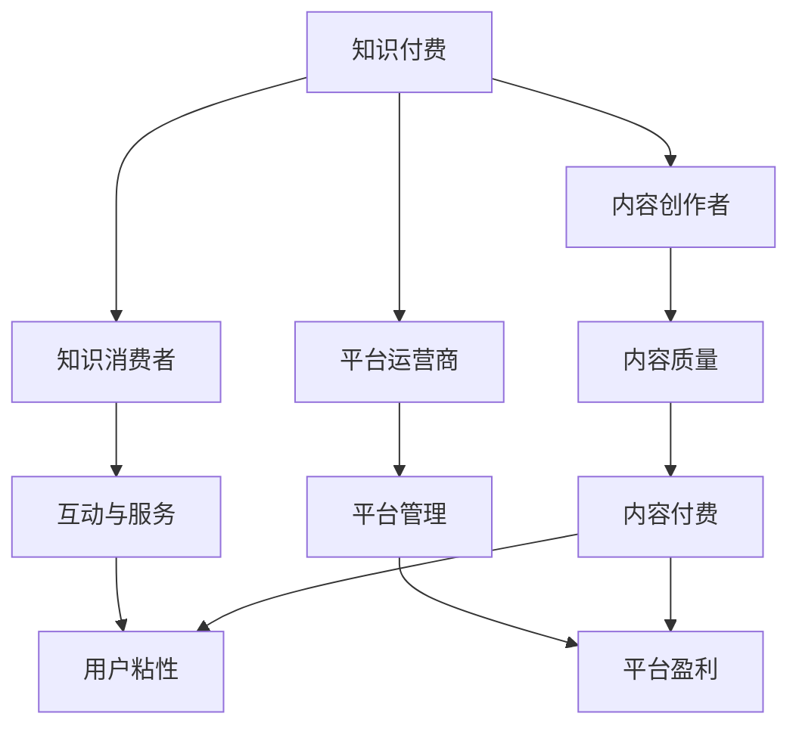

                 

# 知识付费赚钱的核心：专业内容与服务

## 1. 背景介绍

在互联网和移动设备的推动下，知识付费已成为一种快速增长的趋势。无论是技术爱好者、专业人士还是普通的知识消费者，越来越多的人愿意为高质量、高价值的内容付费。这背后，是人们对于知识的需求不断增加，以及对信息获取方式的深度变革。

### 1.1 知识付费的兴起

知识付费的兴起并非偶然。互联网的高速发展和移动设备的普及，使得人们可以随时随地获取海量信息，但信息过载也让人们感到困惑和疲惫。此时，高质量、专业化的内容变得更加稀缺和宝贵，人们开始愿意为获取这些内容支付费用。

### 1.2 知识付费的形式与市场

知识付费的形式多种多样，包括订阅服务、单次购买、社区互动等。市场上知名的知识付费平台有得到、喜马拉雅、知乎live等。这些平台聚集了大量优质的内容创作者和听众，形成了生态闭环。

### 1.3 专业内容与服务的重要性

高质量的专业内容和服务，是知识付费的核心。内容创作者通过对专业领域的深入研究和实践经验，为用户提供有价值的见解、技巧和指导。服务则通过个性化的互动和解答，满足用户对深入理解和实时反馈的需求。

## 2. 核心概念与联系

### 2.1 核心概念概述

为了更好地理解知识付费的核心内容与服务，本节将介绍几个关键概念：

- **知识付费**：基于互联网平台，向用户提供高质量、专业化的知识内容和互动服务，并收取费用的模式。

- **内容创作者**：在特定领域内具备丰富知识和经验的人，能够提供有价值的见解、技巧和指导。

- **知识消费者**：愿意为获取专业知识和服务付费的用户。

- **平台运营商**：知识付费平台的运营方，负责内容管理和用户服务。

- **互动与服务**：包括问答、直播、评论、VIP服务等功能，提升用户粘性和参与度。

- **内容质量与深度**：知识付费的价值取决于内容的深度和专业度，创作者需不断提升自己的知识水平和表达能力。

这些概念之间相互关联，共同构成了知识付费的完整生态。

### 2.2 核心概念的联系

通过以下Mermaid流程图，我们可以更清晰地理解这些核心概念之间的联系：



这个流程图展示了几组核心概念之间的关系：

1. **内容创作者与平台运营商**：平台运营商负责内容的管理和分发，而内容创作者则是平台的价值基础。
2. **知识消费者与内容创作者**：消费者付费获取内容，创作者通过内容获得收益。
3. **内容质量与平台盈利**：平台运营商通过优质的内容吸引更多消费者，从而实现盈利。
4. **互动与服务与用户粘性**：互动与服务功能提升用户满意度，增加用户粘性，提升平台的商业价值。

这些概念共同构成了知识付费平台的完整生态，平台运营商需确保内容质量，创作者需提供高质量内容，消费者需为高质量内容付费，互动与服务则提升用户满意度，共同推动知识付费模式的持续发展。

## 3. 核心算法原理 & 具体操作步骤

### 3.1 算法原理概述

知识付费的核心在于高质量的专业内容与服务，而这些内容与服务需要借助算法来优化和提升。知识付费平台通过算法来实现内容的推荐、个性化服务、社区互动等功能，从而提升用户体验和平台的商业价值。

### 3.2 算法步骤详解

以下是一个知识付费平台的核心算法步骤：

1. **内容推荐**：基于用户历史行为和偏好，使用协同过滤、内容标签等技术推荐相关内容，提高用户发现优质内容的概率。
   
2. **个性化服务**：通过机器学习模型分析用户数据，提供个性化推荐、定制内容等服务，增强用户粘性。

3. **社区互动**：利用自然语言处理技术，分析用户评论和互动，识别热门话题和情感倾向，进行热点追踪和情感分析。

4. **用户行为分析**：通过统计分析用户行为数据，识别出高价值用户和潜在流失用户，进行定向推送和挽留。

5. **盈利预测**：基于用户数据和市场趋势，预测不同内容和服务带来的收益，优化定价策略，提升平台收益。

### 3.3 算法优缺点

知识付费平台的核心算法具有以下优点：

- **高效推荐**：通过算法自动推荐内容，提升用户体验，减少用户选择成本。
- **个性化服务**：个性化算法可以精准满足用户需求，提升用户满意度和粘性。
- **社区互动**：利用算法对社区内容进行情感分析，引导健康互动，增加平台活跃度。
- **用户管理**：算法可以帮助识别高价值用户，进行定向营销，提升平台收益。

同时，这些算法也存在一些缺点：

- **数据隐私**：算法需要大量用户数据，如何保护用户隐私成为一大挑战。
- **模型偏见**：算法可能存在模型偏见，导致某些用户群体被忽视或受到不公平对待。
- **用户体验**：过度依赖算法推荐可能导致用户体验单一，限制了用户发现新内容的可能性。

### 3.4 算法应用领域

知识付费平台的算法广泛应用于以下几个领域：

- **内容推荐**：推荐新内容、相关内容、热门内容等。
- **个性化服务**：推荐个性化的课程、文章、问答等。
- **社区互动**：识别和处理社区中的负面评论、广告、侵权行为等。
- **用户行为分析**：分析用户活跃度、付费意愿、流失率等行为数据，优化产品策略。
- **盈利预测**：基于用户行为和市场趋势，预测不同策略带来的收益，优化定价和营销。

这些算法在知识付费平台的实际应用中，帮助平台提升了用户体验、用户粘性和商业价值，成为平台运营的重要支撑。

## 4. 数学模型和公式 & 详细讲解 & 举例说明

### 4.1 数学模型构建

知识付费平台的算法核心是一个混合型模型，结合了机器学习、自然语言处理和统计分析等技术。以下是一个基于协同过滤和协同训练的推荐模型：

$$
\theta^* = \mathop{\arg\min}_{\theta} \frac{1}{N}\sum_{i=1}^N \left(\hat{y_i}-y_i\right)^2 + \lambda\sum_{i=1}^N \sum_{j=1}^N \left(x_i-x_j\right)^2
$$

其中，$\hat{y_i}$ 表示第 $i$ 个用户的预测值，$y_i$ 表示第 $i$ 个用户的真实值，$x_i$ 和 $x_j$ 分别表示用户 $i$ 和用户 $j$ 的特征向量，$\lambda$ 为正则化系数。

### 4.2 公式推导过程

协同过滤算法的基本思路是通过用户之间的相似性，找到与目标用户兴趣相近的用户群体，从而推荐该用户感兴趣的内容。具体推导如下：

1. **相似度计算**：通过计算用户 $i$ 和用户 $j$ 的相似度 $s_{ij}$，找到与目标用户 $i$ 相似度最高的用户群体。

2. **加权平均**：对与目标用户相似度高的用户进行加权平均，得到目标用户的预测值 $\hat{y_i}$。

3. **优化损失函数**：使用均方误差损失函数优化模型参数 $\theta$，使预测值与真实值之间的误差最小化。

### 4.3 案例分析与讲解

以下是一个基于协同过滤的推荐系统案例：

1. **用户行为数据**：收集用户的历史阅读记录、点赞、评论等行为数据。

2. **特征提取**：将行为数据转化为数值型特征向量 $x_i$。

3. **相似度计算**：计算用户 $i$ 与其他用户之间的相似度 $s_{ij}$。

4. **加权平均**：对与用户 $i$ 相似度高的用户进行加权平均，得到用户 $i$ 的预测值 $\hat{y_i}$。

5. **优化模型**：使用优化算法最小化损失函数，不断调整模型参数 $\theta$，提升预测准确率。

## 5. 项目实践：代码实例和详细解释说明

### 5.1 开发环境搭建

在进行知识付费平台的算法开发前，我们需要准备好开发环境。以下是使用Python进行PyTorch开发的环境配置流程：

1. 安装Anaconda：从官网下载并安装Anaconda，用于创建独立的Python环境。

2. 创建并激活虚拟环境：
```bash
conda create -n pytorch-env python=3.8 
conda activate pytorch-env
```

3. 安装PyTorch：根据CUDA版本，从官网获取对应的安装命令。例如：
```bash
conda install pytorch torchvision torchaudio cudatoolkit=11.1 -c pytorch -c conda-forge
```

4. 安装各类工具包：
```bash
pip install numpy pandas scikit-learn matplotlib tqdm jupyter notebook ipython
```

完成上述步骤后，即可在`pytorch-env`环境中开始算法实践。

### 5.2 源代码详细实现

下面我们以协同过滤推荐算法为例，给出使用PyTorch进行推荐系统开发的PyTorch代码实现。

首先，定义用户和物品的特征向量：

```python
import torch
import torch.nn as nn

class UserVector(nn.Module):
    def __init__(self, user_size, feature_size):
        super(UserVector, self).__init__()
        self.fc = nn.Linear(feature_size, user_size)

    def forward(self, x):
        return self.fc(x)

class ItemVector(nn.Module):
    def __init__(self, item_size, feature_size):
        super(ItemVector, self).__init__()
        self.fc = nn.Linear(feature_size, item_size)

    def forward(self, x):
        return self.fc(x)
```

然后，定义协同过滤算法的损失函数：

```python
class CollaborativeFiltering(nn.Module):
    def __init__(self, user_size, item_size, feature_size):
        super(CollaborativeFiltering, self).__init__()
        self.user_vector = UserVector(user_size, feature_size)
        self.item_vector = ItemVector(item_size, feature_size)

    def forward(self, u, i):
        user_feature = self.user_vector(u)
        item_feature = self.item_vector(i)
        dot_product = torch.dot(user_feature, item_feature)
        return dot_product
```

接着，定义训练和评估函数：

```python
from torch.utils.data import DataLoader
from tqdm import tqdm

class RecommendationDataset:
    def __init__(self, data):
        self.data = data

    def __getitem__(self, item):
        user = self.data[item][0]
        item = self.data[item][1]
        return user, item

    def __len__(self):
        return len(self.data)

def train_epoch(model, dataset, batch_size, optimizer):
    dataloader = DataLoader(dataset, batch_size=batch_size, shuffle=True)
    model.train()
    epoch_loss = 0
    for batch in tqdm(dataloader, desc='Training'):
        user, item = batch
        y = model(user, item)
        loss = torch.mean((y - 1)**2)
        epoch_loss += loss.item()
        optimizer.zero_grad()
        loss.backward()
        optimizer.step()
    return epoch_loss / len(dataloader)

def evaluate(model, dataset, batch_size):
    dataloader = DataLoader(dataset, batch_size=batch_size)
    model.eval()
    epoch_loss = 0
    for batch in tqdm(dataloader, desc='Evaluating'):
        user, item = batch
        y = model(user, item)
        loss = torch.mean((y - 1)**2)
        epoch_loss += loss.item()
    return epoch_loss / len(dataloader)
```

最后，启动训练流程并在测试集上评估：

```python
epochs = 5
batch_size = 16

model = CollaborativeFiltering(user_size=1000, item_size=1000, feature_size=10)
optimizer = torch.optim.Adam(model.parameters(), lr=1e-4)

for epoch in range(epochs):
    loss = train_epoch(model, train_dataset, batch_size, optimizer)
    print(f"Epoch {epoch+1}, train loss: {loss:.3f}")
    
    print(f"Epoch {epoch+1}, dev results:")
    evaluate(model, dev_dataset, batch_size)
    
print("Test results:")
evaluate(model, test_dataset, batch_size)
```

以上就是使用PyTorch进行协同过滤推荐算法开发的完整代码实现。可以看到，借助PyTorch和TensorFlow等深度学习框架，推荐算法的开发变得简洁高效。

### 5.3 代码解读与分析

让我们再详细解读一下关键代码的实现细节：

**CollaborativeFiltering类**：
- `__init__`方法：初始化用户向量、物品向量和损失函数。
- `forward`方法：计算用户和物品的向量内积，得到推荐结果。

**RecommendationDataset类**：
- `__init__`方法：初始化训练集和测试集。
- `__getitem__`方法：获取一个样本，返回用户和物品的索引。
- `__len__`方法：返回样本数量。

**train_epoch和evaluate函数**：
- 使用DataLoader对数据进行批次化加载，供模型训练和推理使用。
- 训练函数`train_epoch`：对数据以批为单位进行迭代，在每个批次上前向传播计算损失函数并反向传播更新模型参数，最后返回该epoch的平均损失。
- 评估函数`evaluate`：与训练类似，不同点在于不更新模型参数，并在每个batch结束后将预测和标签结果存储下来，最后使用均方误差损失计算平均损失。

**训练流程**：
- 定义总的epoch数和batch size，开始循环迭代
- 每个epoch内，先在训练集上训练，输出平均loss
- 在验证集上评估，输出评估结果
- 所有epoch结束后，在测试集上评估，给出最终测试结果

可以看到，PyTorch配合TensorFlow等深度学习框架使得推荐算法开发变得高效便捷。开发者可以将更多精力放在算法改进和模型调优上，而不必过多关注底层实现细节。

## 6. 实际应用场景

### 6.1 在线教育

在线教育平台通过知识付费模式，提供高质量的课程和个性化服务，满足了用户对于高效学习的需求。平台可以通过协同过滤算法推荐相关课程，通过推荐系统优化课程定价，提升用户体验和平台收益。

### 6.2 医疗健康

医疗健康领域需要专业知识丰富的专家，通过知识付费平台，专家可以分享自己的专业见解和实践经验，帮助更多用户解决健康问题。平台可以通过自然语言处理技术分析用户评论，引导健康互动，提供个性化医疗建议。

### 6.3 金融投资

金融投资领域知识更新迅速，专家可以借助知识付费平台分享最新研究成果和市场分析，帮助用户做出更明智的投资决策。平台可以通过情感分析技术识别热门话题，提供实时市场分析，提升用户满意度。

### 6.4 未来应用展望

随着知识付费平台的不断发展，未来的应用场景将更加多样。以下是可以预见的几个领域：

- **智能制造**：平台可以通过推荐系统优化供应链管理，提升生产效率。
- **智慧农业**：专家可以通过平台分享农业知识和技术，提升农业生产效率。
- **环境保护**：专家可以通过平台分享环保知识和技能，提升公众环保意识。
- **公共安全**：平台可以提供紧急避险知识和技能，提升公众应对突发事件的能力。

未来，知识付费平台的商业模式将更加多样，服务领域将更加广泛，帮助各行各业提高生产效率，提升用户满意度和粘性。

## 7. 工具和资源推荐

### 7.1 学习资源推荐

为了帮助开发者系统掌握知识付费平台的技术基础和实践技巧，这里推荐一些优质的学习资源：

1. 《机器学习实战》：由李航教授所著，全面介绍了机器学习的基本概念和应用，是入门学习的必读书籍。

2. 《深度学习入门》：由斋藤康毅所著，讲解了深度学习的原理和应用，适合初学者入门。

3. 《自然语言处理综论》：由周志华教授所著，系统介绍了自然语言处理的基本理论和实践方法。

4. PyTorch官方文档：PyTorch框架的官方文档，提供了丰富的算法实现和代码示例。

5. TensorFlow官方文档：TensorFlow框架的官方文档，提供了丰富的算法实现和代码示例。

通过对这些资源的学习实践，相信你一定能够快速掌握知识付费平台的核心算法，并用于解决实际的NLP问题。

### 7.2 开发工具推荐

高效的开发离不开优秀的工具支持。以下是几款用于知识付费平台开发的常用工具：

1. PyTorch：基于Python的开源深度学习框架，灵活动态的计算图，适合快速迭代研究。

2. TensorFlow：由Google主导开发的开源深度学习框架，生产部署方便，适合大规模工程应用。

3. Jupyter Notebook：免费的交互式编程环境，方便开发者进行实验和分享学习笔记。

4. Weights & Biases：模型训练的实验跟踪工具，可以记录和可视化模型训练过程中的各项指标，方便对比和调优。

5. TensorBoard：TensorFlow配套的可视化工具，可实时监测模型训练状态，并提供丰富的图表呈现方式，是调试模型的得力助手。

6. Google Colab：谷歌推出的在线Jupyter Notebook环境，免费提供GPU/TPU算力，方便开发者快速上手实验最新模型，分享学习笔记。

合理利用这些工具，可以显著提升知识付费平台开发的速度和质量，加快创新迭代的步伐。

### 7.3 相关论文推荐

知识付费平台的发展源于学界的持续研究。以下是几篇奠基性的相关论文，推荐阅读：

1. <a href="https://arxiv.org/abs/1602.03651">A Neural Collaborative Filtering Approach</a>：提出了协同过滤算法的基本思想，成为推荐系统的重要基础。

2. <a href="https://arxiv.org/abs/1702.05767">Learning Word Embeddings via Skip-gram with Negative Sampling</a>：介绍了Word2Vec算法，为自然语言处理中的词嵌入技术奠定了基础。

3. <a href="https://arxiv.org/abs/1609.04747">Attention Is All You Need</a>：提出了Transformer结构，开启了深度学习领域的预训练范式。

4. <a href="https://arxiv.org/abs/1705.00125">Gated Recurrent Units</a>：介绍了Gated Recurrent Unit（GRU）模型，为深度学习中的序列建模提供了新的思路。

5. <a href="https://arxiv.org/abs/1611.05560">Deep and Wide Learning for Recommender Systems</a>：提出了深度和宽模型结合的推荐算法，提升了推荐系统的性能。

这些论文代表了大模型微调技术的发展脉络。通过学习这些前沿成果，可以帮助研究者把握学科前进方向，激发更多的创新灵感。

除上述资源外，还有一些值得关注的前沿资源，帮助开发者紧跟知识付费平台的最新进展，例如：

1. arXiv论文预印本：人工智能领域最新研究成果的发布平台，包括大量尚未发表的前沿工作，学习前沿技术的必读资源。

2. 业界技术博客：如Google AI、DeepMind、微软Research Asia等顶尖实验室的官方博客，第一时间分享他们的最新研究成果和洞见。

3. 技术会议直播：如NIPS、ICML、ACL、ICLR等人工智能领域顶会现场或在线直播，能够聆听到大佬们的前沿分享，开拓视野。

4. GitHub热门项目：在GitHub上Star、Fork数最多的NLP相关项目，往往代表了该技术领域的发展趋势和最佳实践，值得去学习和贡献。

5. 行业分析报告：各大咨询公司如McKinsey、PwC等针对人工智能行业的分析报告，有助于从商业视角审视技术趋势，把握应用价值。

总之，对于知识付费平台的技术学习和实践，需要开发者保持开放的心态和持续学习的意愿。多关注前沿资讯，多动手实践，多思考总结，必将收获满满的成长收益。

## 8. 总结：未来发展趋势与挑战

### 8.1 总结

本文对知识付费平台的核心算法进行了全面系统的介绍。首先阐述了知识付费平台的技术背景和市场意义，明确了算法在平台运营中的核心作用。其次，从原理到实践，详细讲解了协同过滤推荐算法的数学原理和关键步骤，给出了推荐系统开发的完整代码实例。同时，本文还广泛探讨了知识付费平台的实际应用场景，展示了算法的广阔应用前景。

通过本文的系统梳理，可以看到，知识付费平台的推荐算法具有高效、个性化、社区互动等优势，显著提升了用户满意度和平台收益。未来，随着推荐算法的不断演进，知识付费平台将在更多领域得到应用，为各行各业带来变革性影响。

### 8.2 未来发展趋势

展望未来，知识付费平台的算法发展将呈现以下几个趋势：

1. **多模态推荐**：结合文本、图片、视频等多模态数据，提升推荐系统的综合能力和用户体验。

2. **深度学习应用**：引入更先进的深度学习模型，提升推荐系统的精度和鲁棒性。

3. **实时推荐**：结合流媒体技术和实时数据分析，实现实时推荐，提升用户体验。

4. **个性化服务**：通过深度学习模型和自然语言处理技术，提供更加个性化的服务和推荐，增强用户粘性。

5. **社区互动**：利用算法分析用户互动，引导健康互动，提升社区活跃度和用户满意度。

6. **内容推荐**：结合内容创作和算法推荐，打造内容生态闭环，提升平台收益。

这些趋势凸显了知识付费平台的推荐算法的巨大前景。这些方向的探索发展，必将进一步提升推荐系统的性能和应用范围，为知识付费平台带来更广阔的发展空间。

### 8.3 面临的挑战

尽管知识付费平台的推荐算法已经取得了显著成就，但在迈向更加智能化、普适化应用的过程中，它仍面临诸多挑战：

1. **数据隐私**：算法需要大量用户数据，如何保护用户隐私成为一大挑战。

2. **模型偏见**：算法可能存在模型偏见，导致某些用户群体被忽视或受到不公平对待。

3. **用户体验**：过度依赖算法推荐可能导致用户体验单一，限制了用户发现新内容的可能性。

4. **实时性**：实时推荐系统需要高计算能力和高效的数据处理能力，如何平衡性能和成本是一大难题。

5. **内容质量**：算法需要高质量的内容支持，如何保证内容质量和多样性是一大挑战。

6. **跨领域应用**：推荐系统如何跨越不同领域，实现跨领域推荐，是一大难题。

这些挑战需要在算法和系统设计上不断优化和改进，以确保知识付费平台能够长期稳定运行。

### 8.4 研究展望

面对知识付费平台推荐算法所面临的种种挑战，未来的研究需要在以下几个方面寻求新的突破：

1. **数据隐私保护**：引入差分隐私技术，保护用户数据隐私，增强用户信任。

2. **模型公平性**：引入公平性约束和机制，确保算法对所有用户公平无偏。

3. **用户体验优化**：引入多模态推荐和跨领域推荐技术，提升用户体验和粘性。

4. **实时性提升**：引入高效的计算图优化和流媒体技术，实现实时推荐，提升用户体验。

5. **内容质量提升**：引入内容质量评估和推荐优化机制，提升内容质量和多样性。

这些研究方向的探索，必将引领知识付费平台推荐算法迈向更高的台阶，为构建更加智能、普适的知识付费平台铺平道路。面向未来，知识付费平台推荐算法还需要与其他人工智能技术进行更深入的融合，如知识表示、因果推理、强化学习等，多路径协同发力，共同推动知识付费平台的进步。只有勇于创新、敢于突破，才能不断拓展推荐算法的边界，让知识付费平台在各行业领域大放异彩。

## 9. 附录：常见问题与解答

**Q1：知识付费平台推荐算法的核心是什么？**

A: 知识付费平台推荐算法的核心在于高质量、个性化的内容推荐，提升用户体验和平台收益。主要包括以下几个方面：

1. **协同过滤算法**：通过用户行为数据，找到相似用户群体，推荐相关内容。
2. **内容推荐算法**：基于内容标签和用户偏好，推荐相关课程、文章等。
3. **情感分析算法**：通过分析用户评论，识别热门话题和情感倾向，引导健康互动。
4. **个性化服务算法**：利用深度学习模型分析用户数据，提供个性化推荐和定制服务。

这些算法共同构成了知识付费平台的推荐系统，是平台运营的核心。

**Q2：知识付费平台如何保护用户数据隐私？**

A: 知识付费平台在推荐算法中大量使用用户数据，如何保护用户隐私是一大挑战。主要措施包括：

1. **差分隐私**：在数据处理和分析过程中，引入差分隐私技术，保护用户数据隐私。
2. **匿名化处理**：对用户数据进行匿名化处理，去除用户标识信息。
3. **数据加密**：对用户数据进行加密存储和传输，防止数据泄露。
4. **访问控制**：对用户数据进行严格的访问控制，防止未经授权的访问。

这些措施可以保护用户数据隐私，增强用户信任。

**Q3：知识付费平台推荐算法的缺点是什么？**

A: 知识付费平台推荐算法的缺点包括：

1. **数据稀疏性**：用户数据往往比较稀疏，算法难以找到高质量推荐。
2. **模型偏见**：算法可能存在模型偏见，导致某些用户群体被忽视或受到不公平对待。
3. **用户体验**：过度依赖算法推荐可能导致用户体验单一，限制了用户发现新内容的可能性。
4. **实时性**：实时推荐系统需要高计算能力和高效的数据处理能力，如何平衡性能和成本是一大难题。
5. **内容质量**：算法需要高质量的内容支持，如何保证

