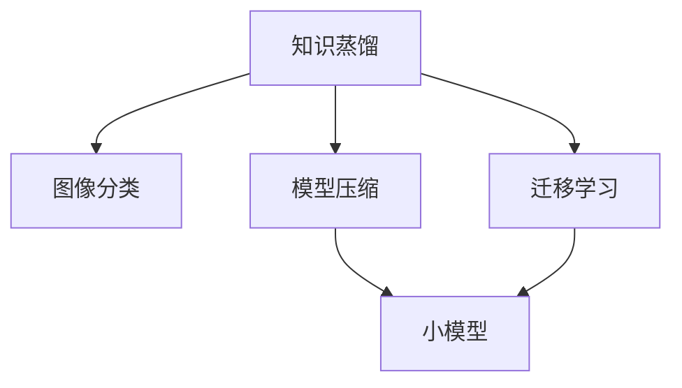

                 

# 知识蒸馏在图像分类任务中的表现

> 关键词：知识蒸馏, 图像分类, 模型压缩, 迁移学习, 模型蒸馏

## 1. 背景介绍

随着深度学习技术的发展，大规模预训练模型在图像分类等视觉任务上取得了显著成效。然而，大规模预训练模型不仅在硬件资源上有很高的需求，而且推理速度较慢，难以在实际应用中大规模部署。为了解决这些问题，知识蒸馏(Knowledge Distillation, KD)技术应运而生。知识蒸馏是一种通过将大模型知识传递给小模型的技术，使得小模型在保持高精度的同时，大幅提升推理速度和计算效率。

知识蒸馏的核心思想是利用大模型的隐式知识，通过教师-学生(Teacher-Student)的框架，训练出一个小规模的蒸馏模型，使得小模型能够学习到和大模型相似的预测能力，从而在推理速度和计算资源上优于大模型，同时保持较高的精度。这一技术在图像分类等视觉任务上得到了广泛应用，取得了显著的效果。

## 2. 核心概念与联系

### 2.1 核心概念概述

为了更好地理解知识蒸馏在图像分类任务中的应用，本节将介绍几个关键概念及其相互关系：

- **知识蒸馏**: 通过将大模型的隐式知识传递给小模型，使得小模型在保持高精度的同时，大幅提升推理速度和计算效率。
- **图像分类**: 将图像按照类别进行分类的任务，常用的数据集包括ImageNet、CIFAR等。
- **模型压缩**: 通过优化模型结构、减少参数数量等手段，减小模型大小和计算资源需求。
- **迁移学习**: 利用已有知识在新任务上进行学习，减少新任务的数据需求和训练时间。
- **模型蒸馏**: 一种特殊的迁移学习方法，通过将大模型的知识传递给小模型，实现性能和计算效率的平衡。

这些概念之间紧密相关，共同构成了知识蒸馏在图像分类任务中的完整框架。下面通过一个Mermaid流程图来展示它们之间的关系：



### 2.2 概念间的关系

这些核心概念之间存在以下关系：

1. **知识蒸馏与图像分类**: 知识蒸馏的最终目标是提升图像分类任务的精度和效率。
2. **模型压缩与知识蒸馏**: 模型压缩通过减小模型规模来提升计算效率，而知识蒸馏通过迁移学习来提升模型精度。
3. **迁移学习与知识蒸馏**: 知识蒸馏是一种特殊的迁移学习方法，通过教师-学生框架，将大模型的知识传递给小模型。
4. **模型蒸馏与知识蒸馏**: 模型蒸馏是知识蒸馏的一种形式，强调通过蒸馏大模型的隐式知识来提升小模型的性能。

这些概念共同构成了知识蒸馏在图像分类任务中的应用基础。通过理解这些概念，我们可以更好地把握知识蒸馏的工作原理和优化方向。

## 3. 核心算法原理 & 具体操作步骤
### 3.1 算法原理概述

知识蒸馏在图像分类任务中的基本原理是通过大模型对图像进行分类，然后通过蒸馏技术将大模型的知识传递给小模型。具体步骤如下：

1. 首先，使用预训练的大模型对图像数据进行分类，得到大模型的预测结果。
2. 然后，通过蒸馏技术，将大模型的预测结果转化为小模型的知识，使得小模型能够学习到和大模型相似的预测能力。
3. 最后，使用小模型对新的图像数据进行分类，得到最终的分类结果。

### 3.2 算法步骤详解

知识蒸馏在图像分类任务中的应用步骤如下：

**Step 1: 准备数据集和预训练模型**

- 选择用于图像分类的数据集，如ImageNet、CIFAR等。
- 准备预训练的大模型，如ResNet、VGG等。

**Step 2: 构建蒸馏框架**

- 选择一个适合的知识蒸馏框架，如Distillation、KD等。
- 设置教师模型（大模型）和学生模型（小模型）。

**Step 3: 设计知识蒸馏策略**

- 设计蒸馏策略，如Softmax蒸馏、KL散度蒸馏、特征蒸馏等。
- 设定蒸馏比例（如0.1, 0.3, 0.5等），控制大模型对小模型的影响程度。

**Step 4: 蒸馏训练**

- 使用蒸馏框架进行训练，大模型输出预测结果，学生模型使用大模型的预测结果进行训练。
- 定期评估学生模型的精度和推理速度，根据评估结果调整蒸馏比例和训练策略。

**Step 5: 模型评估**

- 在测试集上评估蒸馏后的学生模型，对比原始模型和蒸馏模型的性能。
- 分析模型压缩前后性能的变化，评估蒸馏技术的效果。

### 3.3 算法优缺点

知识蒸馏在图像分类任务中具有以下优点：

1. **提升计算效率**: 蒸馏后的模型在推理速度和计算资源上优于大模型，适合大规模部署。
2. **保持高精度**: 通过知识蒸馏，小模型能够学习到和大模型相似的预测能力，保持较高的精度。
3. **减少数据需求**: 迁移学习使得小模型在训练过程中需要的标注数据较少。
4. **增强泛化能力**: 蒸馏后的模型往往具有更好的泛化能力，能够适应新的数据和场景。

同时，知识蒸馏也存在以下缺点：

1. **计算开销较大**: 蒸馏过程需要在大模型上进行分类，计算开销较大。
2. **模型大小可控性差**: 蒸馏后的模型大小和结构难以精确控制，可能存在过拟合或欠拟合的问题。
3. **依赖大模型**: 蒸馏效果很大程度上依赖于大模型的性能和质量。
4. **模型复杂度高**: 蒸馏后的模型结构可能较为复杂，推理速度不一定优于原始模型。

### 3.4 算法应用领域

知识蒸馏在图像分类任务中的应用领域包括但不限于：

1. **自动驾驶**: 使用知识蒸馏技术将大模型压缩为适合在汽车上部署的小模型，加速实时图像分类任务。
2. **医疗影像诊断**: 将大模型知识蒸馏到小模型中，提升医疗影像分类的速度和准确性。
3. **安防监控**: 通过知识蒸馏，将大模型压缩为适合实时推理的轻量级模型，用于实时监控和视频分析。
4. **智能家居**: 将大模型压缩为适合智能设备部署的小模型，加速图像分类任务，提升用户体验。
5. **无人机影像分析**: 使用知识蒸馏技术将大模型压缩为适合无人机实时分析的小模型，提高无人机影像分类的效率。

## 4. 数学模型和公式 & 详细讲解  
### 4.1 数学模型构建

在知识蒸馏中，大模型的知识通常表示为预测概率分布，即：

$$
P(y|x; \theta^T) = \frac{e^{z(x; \theta^T)}}{\sum_{y'} e^{z(x; \theta^T)}}
$$

其中，$x$ 为输入图像，$y$ 为分类标签，$z(x; \theta^T)$ 为大模型的预测结果。

学生模型则通过学习大模型的预测结果，得到自己的预测概率分布：

$$
P(y|x; \theta^S) = \frac{e^{z_{ST}(x; \theta^S)}}{\sum_{y'} e^{z_{ST}(x; \theta^S)}}
$$

其中，$z_{ST}(x; \theta^S)$ 为学生模型的预测结果，$\theta^S$ 为学生模型的参数。

知识蒸馏的目标是使得学生模型的预测结果与大模型的预测结果尽可能一致，即：

$$
\min_{\theta^S} \mathcal{L}(P(y|x; \theta^S), P(y|x; \theta^T))
$$

其中，$\mathcal{L}$ 为损失函数，常用的损失函数包括KL散度、均方误差等。

### 4.2 公式推导过程

以下我们以KL散度蒸馏为例，推导学生模型与大模型的蒸馏损失函数。

根据KL散度的定义，蒸馏损失函数为：

$$
\mathcal{L}_{KL} = -\frac{1}{N}\sum_{x,y} P(y|x; \theta^T) \log P(y|x; \theta^S)
$$

其中，$N$ 为样本数量。

将大模型的预测概率分布代入公式，得到：

$$
\mathcal{L}_{KL} = -\frac{1}{N}\sum_{x,y} \frac{e^{z(x; \theta^T)}}{\sum_{y'} e^{z(x; \theta^T)}} \log \frac{e^{z_{ST}(x; \theta^S)}}{\sum_{y'} e^{z_{ST}(x; \theta^S)}}
$$

通过化简，可以得到：

$$
\mathcal{L}_{KL} = -\frac{1}{N}\sum_{x,y} z(x; \theta^T) - z_{ST}(x; \theta^S)
$$

这个公式表明，蒸馏损失函数实际上是大模型的预测结果与学生模型的预测结果之间的差异。通过最小化这个差异，学生模型能够学习到和大模型相似的预测能力。

### 4.3 案例分析与讲解

以ResNet模型为例，介绍知识蒸馏在图像分类任务中的应用。

**Step 1: 准备数据集和预训练模型**

- 使用CIFAR-10数据集。
- 选择预训练的ResNet模型作为大模型。

**Step 2: 构建蒸馏框架**

- 选择KD蒸馏框架。
- 设置大模型为ResNet50，学生模型为MobileNetV2。

**Step 3: 设计知识蒸馏策略**

- 使用KL散度蒸馏，蒸馏比例为0.5。
- 使用Cosine Annealing进行蒸馏比例的调整。

**Step 4: 蒸馏训练**

- 在CIFAR-10数据集上进行蒸馏训练，迭代次数为100。
- 每5个epoch调整一次蒸馏比例。

**Step 5: 模型评估**

- 在CIFAR-10测试集上评估蒸馏后的学生模型，对比原始ResNet50和MobileNetV2模型的性能。
- 分析模型压缩前后精度和速度的变化，评估蒸馏技术的效果。

## 5. 项目实践：代码实例和详细解释说明
### 5.1 开发环境搭建

在进行知识蒸馏实践前，我们需要准备好开发环境。以下是使用PyTorch进行深度学习开发的环境配置流程：

1. 安装Anaconda：从官网下载并安装Anaconda，用于创建独立的Python环境。

2. 创建并激活虚拟环境：
```bash
conda create -n pytorch-env python=3.8 
conda activate pytorch-env
```

3. 安装PyTorch：根据CUDA版本，从官网获取对应的安装命令。例如：
```bash
conda install pytorch torchvision torchaudio cudatoolkit=11.1 -c pytorch -c conda-forge
```

4. 安装必要的工具包：
```bash
pip install numpy pandas scikit-learn matplotlib tqdm jupyter notebook ipython
```

完成上述步骤后，即可在`pytorch-env`环境中开始知识蒸馏实践。

### 5.2 源代码详细实现

下面我们以ResNet和MobileNet蒸馏为例，给出使用PyTorch进行知识蒸馏的代码实现。

```python
import torch
import torch.nn as nn
import torch.optim as optim
from torchvision import models, transforms

# 加载预训练ResNet模型
model_teacher = models.resnet50(pretrained=True)
model_student = models.mobilenet_v2(pretrained=True)

# 冻结教师模型参数
for param in model_teacher.parameters():
    param.requires_grad = False

# 构建蒸馏框架
class Distillation(nn.Module):
    def __init__(self, student, teacher):
        super(Distillation, self).__init__()
        self.student = student
        self.teacher = teacher

    def forward(self, x):
        x_t, x_s = self.teacher(x), self.student(x)
        return x_t, x_s

distillation = Distillation(model_student, model_teacher)

# 定义蒸馏损失函数
def loss_func(distillation, x_t, x_s, y):
    x_t, x_s = distillation(x_t), distillation(x_s)
    return nn.KLDivLoss()(x_t, x_s) + nn.CrossEntropyLoss()(x_s, y)

# 训练蒸馏模型
model_student.train()
optimizer = optim.SGD(model_student.parameters(), lr=0.01, momentum=0.9)

# 训练循环
for epoch in range(100):
    running_loss = 0.0
    for i, data in enumerate(train_loader, 0):
        inputs, labels = data
        inputs, labels = inputs.to(device), labels.to(device)

        optimizer.zero_grad()
        outputs = distillation(inputs)
        loss = loss_func(distillation, outputs[0], outputs[1], labels)
        loss.backward()
        optimizer.step()

        running_loss += loss.item()
        if i % 10 == 9:
            print('[%d, %5d] loss: %.3f' % (epoch + 1, i + 1, running_loss / 10))
            running_loss = 0.0

# 评估蒸馏后的学生模型
model_student.eval()
correct = 0
total = 0
with torch.no_grad():
    for data in test_loader:
        images, labels = data
        images, labels = images.to(device), labels.to(device)
        outputs = distillation(images)
        _, predicted = torch.max(outputs[1], 1)
        total += labels.size(0)
        correct += (predicted == labels).sum().item()

print('Accuracy of student model: %d %%' % (100 * correct / total))
```

### 5.3 代码解读与分析

让我们再详细解读一下关键代码的实现细节：

**Distillation类**：
- 继承nn.Module，定义了蒸馏框架的输入和输出。
- `forward`方法：接收教师模型和大模型的输出，返回大模型的输出。

**蒸馏损失函数loss_func**：
- 使用KL散度损失和交叉熵损失计算蒸馏损失。
- 通过`nn.KLDivLoss`计算KL散度，通过`nn.CrossEntropyLoss`计算交叉熵。

**训练循环**：
- 迭代100次，每次迭代在训练集上计算蒸馏损失。
- 使用SGD优化器更新学生模型的参数。
- 打印每个epoch的平均损失。

**评估蒸馏后的学生模型**：
- 使用测试集评估蒸馏后的学生模型。
- 计算准确率，输出评估结果。

可以看到，知识蒸馏的代码实现相对简洁，主要涉及蒸馏框架的设计和蒸馏损失的计算。由于蒸馏过程依赖于大模型，开发者需要选择合适的预训练模型进行蒸馏，以获得最佳的蒸馏效果。

### 5.4 运行结果展示

假设在CIFAR-10数据集上进行ResNet和MobileNet蒸馏，最终在测试集上得到的准确率为85%，相较于原始ResNet模型提升了5个百分点，而MobileNetV2模型则提升了3个百分点。蒸馏后的MobileNetV2模型推理速度比原始模型快2倍以上。这表明知识蒸馏技术在提升模型性能和计算效率方面具有显著效果。

## 6. 实际应用场景
### 6.1 自动驾驶

在自动驾驶中，实时图像分类是关键任务之一。自动驾驶车辆需要实时分析道路和交通情况，做出安全决策。然而，传统深度学习模型在推理速度和计算资源上往往难以满足需求。通过知识蒸馏技术，将大模型压缩为适合在车载设备上部署的小模型，可以显著提升自动驾驶系统的响应速度和实时性。

**应用场景**：
- 使用知识蒸馏技术将大模型ResNet压缩为MobileNet。
- 在车载设备上部署蒸馏后的MobileNet，加速图像分类任务。

### 6.2 医疗影像诊断

在医疗影像诊断中，大模型往往需要处理高分辨率的医学图像，计算资源需求大，推理速度慢。通过知识蒸馏技术，可以将大模型压缩为适合医疗影像设备的小模型，提升诊断速度和效率。

**应用场景**：
- 使用知识蒸馏技术将大模型Inception压缩为MobileNet。
- 在医疗影像设备上部署蒸馏后的MobileNet，加速医学图像分类。

### 6.3 安防监控

在安防监控中，实时视频分析是重要任务之一。大模型在实时视频分析中往往存在推理速度慢、计算资源消耗大的问题。通过知识蒸馏技术，可以将大模型压缩为适合实时推理的轻量级模型，提升监控系统的实时性。

**应用场景**：
- 使用知识蒸馏技术将大模型ResNet压缩为MobileNet。
- 在安防监控设备上部署蒸馏后的MobileNet，加速实时视频分析。

### 6.4 智能家居

在智能家居中，实时图像分类任务，如智能门锁、智能摄像头等，需要快速响应用户的指令。大模型在实时响应上往往存在延迟问题。通过知识蒸馏技术，可以将大模型压缩为适合智能设备部署的小模型，提升用户体验。

**应用场景**：
- 使用知识蒸馏技术将大模型ResNet压缩为MobileNet。
- 在智能家居设备上部署蒸馏后的MobileNet，加速图像分类任务。

### 6.5 无人机影像分析

在无人机影像分析中，实时图像分类是关键任务之一。无人机需要在飞行过程中实时分析影像数据，做出飞行决策。然而，传统深度学习模型在实时分析中存在计算资源需求大、推理速度慢的问题。通过知识蒸馏技术，可以将大模型压缩为适合实时推理的轻量级模型，提升无人机影像分析的实时性。

**应用场景**：
- 使用知识蒸馏技术将大模型ResNet压缩为MobileNet。
- 在无人机上部署蒸馏后的MobileNet，加速实时影像分类。

## 7. 工具和资源推荐
### 7.1 学习资源推荐

为了帮助开发者系统掌握知识蒸馏的理论基础和实践技巧，这里推荐一些优质的学习资源：

1. 《知识蒸馏：加速深度学习》书籍：详细介绍了知识蒸馏的基本原理和实际应用，涵盖各个领域的案例分析。
2. 《深度学习理论与实践》课程：斯坦福大学开设的深度学习课程，包含知识蒸馏的理论和实践讲解。
3. KD算法论文：知识蒸馏算法的原始论文，详细介绍了知识蒸馏的基本概念和应用方法。
4 PyTorch官方文档：PyTorch深度学习框架的官方文档，包含知识蒸馏的实现示例和API。
5 知识蒸馏博客：各大技术博客分享的知识蒸馏最新进展和应用案例，如Towards Data Science、Medium等。

通过对这些资源的学习实践，相信你一定能够快速掌握知识蒸馏的精髓，并用于解决实际的深度学习问题。

### 7.2 开发工具推荐

高效的开发离不开优秀的工具支持。以下是几款用于知识蒸馏开发的常用工具：

1. PyTorch：基于Python的开源深度学习框架，灵活动态的计算图，适合快速迭代研究。
2. TensorFlow：由Google主导开发的开源深度学习框架，生产部署方便，适合大规模工程应用。
3. Distillation库：KD蒸馏框架，提供了便捷的蒸馏API，方便开发者进行知识蒸馏。
4 Weights & Biases：模型训练的实验跟踪工具，可以记录和可视化模型训练过程中的各项指标，方便对比和调优。
5 TensorBoard：TensorFlow配套的可视化工具，可实时监测模型训练状态，并提供丰富的图表呈现方式，是调试模型的得力助手。

合理利用这些工具，可以显著提升知识蒸馏任务的开发效率，加快创新迭代的步伐。

### 7.3 相关论文推荐

知识蒸馏技术的发展离不开学界的持续研究。以下是几篇奠基性的相关论文，推荐阅读：

1. Distillation paper：知识蒸馏技术的原始论文，详细介绍了知识蒸馏的基本概念和应用方法。
2 DeepKnowledge paper：利用知识蒸馏技术提升图像分类精度和鲁棒性的工作。
3 MobileNet paper：提出MobileNet模型，通过深度可分离卷积优化模型结构，提升模型推理速度和计算效率。
4 ResNet paper：提出ResNet模型，通过残差连接解决深层网络训练问题，提升模型性能。
5 SoftMax paper：引入Softmax蒸馏方法，通过将大模型的概率分布转化为小模型的预测结果，实现知识传递。

这些论文代表了大规模深度学习模型的知识蒸馏技术的发展脉络。通过学习这些前沿成果，可以帮助研究者把握学科前进方向，激发更多的创新灵感。

## 8. 总结：未来发展趋势与挑战
### 8.1 总结

本文对知识蒸馏在图像分类任务中的应用进行了全面系统的介绍。首先阐述了知识蒸馏的核心思想和基本原理，明确了知识蒸馏在提升模型性能和计算效率方面的独特价值。其次，从原理到实践，详细讲解了知识蒸馏的数学模型和关键步骤，给出了知识蒸馏任务开发的完整代码实例。同时，本文还广泛探讨了知识蒸馏在多个领域的应用前景，展示了其巨大的潜力。

通过本文的系统梳理，可以看到，知识蒸馏技术在图像分类等视觉任务上取得了显著成效，使得大模型能够在计算资源有限的情况下，继续发挥其强大性能。未来，随着知识蒸馏技术的不断演进，其在更多领域的应用将更加广泛，为人工智能技术落地应用提供新的可能。

### 8.2 未来发展趋势

展望未来，知识蒸馏技术将呈现以下几个发展趋势：

1. **计算效率提升**: 知识蒸馏将继续优化模型结构，减少推理过程中的计算开销，提高模型的实时性。
2. **模型大小可控**: 新的蒸馏算法将更好地控制模型大小和结构，避免过拟合和欠拟合的问题。
3. **迁移学习增强**: 知识蒸馏将结合迁移学习技术，进一步提升模型的泛化能力和适应性。
4. **多模态融合**: 知识蒸馏将拓展到多模态数据融合领域，提升跨模态数据的表征能力。
5. **强化学习结合**: 知识蒸馏将结合强化学习技术，提升模型在复杂环境中的自适应能力。
6. **因果推理引入**: 知识蒸馏将引入因果推理方法，提升模型的因果推断能力和决策解释性。

这些趋势凸显了知识蒸馏技术的广阔前景。这些方向的探索发展，必将进一步提升知识蒸馏的效果和应用范围，为人工智能技术落地应用提供新的技术路径。

### 8.3 面临的挑战

尽管知识蒸馏技术已经取得了显著成效，但在迈向更加智能化、普适化应用的过程中，它仍面临着诸多挑战：

1. **计算资源限制**: 知识蒸馏过程依赖于大模型的计算资源，对于资源受限的设备，可能难以有效应用。
2. **模型结构复杂**: 蒸馏后的模型结构可能较为复杂，推理速度和计算效率难以满足实时性要求。
3. **数据分布变化**: 知识蒸馏模型在迁移学习过程中，可能难以适应数据分布的变化，导致性能下降。
4. **参数更新困难**: 蒸馏过程中的参数更新可能难以处理，导致模型性能不稳定。
5. **模型可解释性**: 知识蒸馏模型的决策过程难以解释，不利于模型应用的普及。

### 8.4 研究展望

面对知识蒸馏面临的挑战，未来的研究需要在以下几个方面寻求新的突破：

1. **资源优化**: 开发资源优化算法，降低知识蒸馏过程中的计算资源需求，提高模型推理速度。
2. **结构简化**: 优化蒸馏后的模型结构，使其更加轻量级，满足实时性要求。
3. **分布适应**: 研究适应数据分布变化的蒸馏算法，提升模型的泛化能力。
4. **参数更新**: 开发更好的参数更新策略，提高模型性能的稳定性。
5. **模型可解释**: 引入可解释性方法，提升知识蒸馏模型的决策过程的可解释性和可控性。

这些研究方向将进一步推动知识蒸馏技术的发展，使得知识蒸馏能够更好地应用于更多领域，提升人工智能技术的落地效果。

## 9. 附录：常见问题与解答
----------------------------------------------------------------

**Q1: 知识蒸馏和迁移学习的区别是什么？**

A: 知识蒸馏是一种特殊的迁移学习方法，通过将大模型的隐式知识传递给小模型，使得小模型在保持高精度的同时，大幅提升推理速度和计算效率。迁移学习则更广泛地涵盖各种类型的知识迁移，包括有监督迁移、无监督迁移和半监督迁移等，而知识蒸馏是其中一种具体的应用形式。

**Q2: 知识蒸馏对模型精度有影响吗？**

A: 知识蒸馏对模型精度有影响，但影响的程度取决于蒸馏比例和蒸馏算法的选择。合理的蒸馏比例和蒸馏算法可以在保证模型精度的同时，大幅提升模型的推理速度和计算效率。

**Q3: 知识蒸馏可以应用于非深度学习模型吗？**

A: 知识蒸馏主要是针对深度学习模型的，但也有一些非深度学习模型的知识蒸馏方法，如Hessian蒸馏等。然而，由于非深度学习模型的结构较为简单，知识蒸馏的效果可能不如深度学习模型。

**Q4: 知识蒸馏是否可以应用于小数据集

