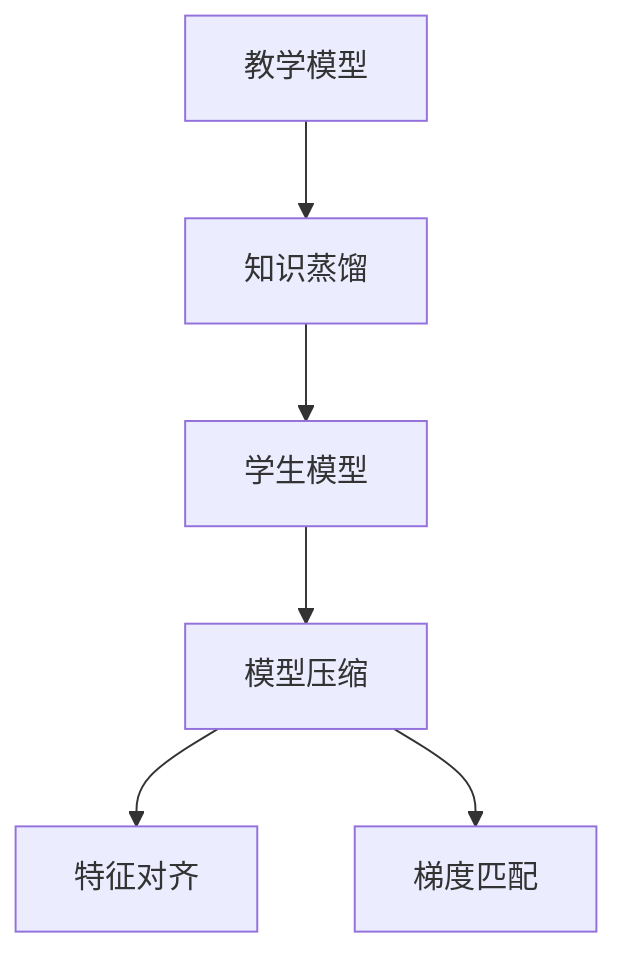
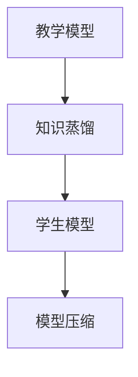
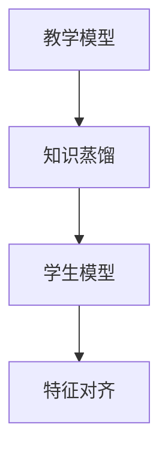
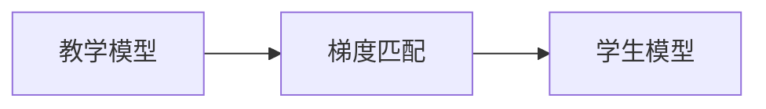
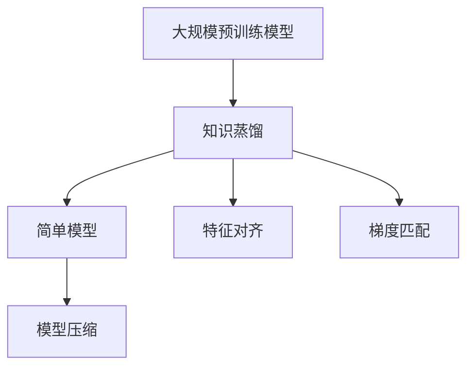

                 

# 知识蒸馏如何提升模型的可解释性

> 关键词：知识蒸馏, 可解释性, 深度学习, 模型压缩, 数据驱动

## 1. 背景介绍

### 1.1 问题由来
在深度学习飞速发展的今天，尽管各类深度神经网络在图像、语音、自然语言处理等领域取得了卓越的成果，但它们往往被视作“黑箱”模型，难以解释其内部决策过程。这种缺乏可解释性的问题在医疗、金融等高风险领域尤为突出，阻碍了深度学习模型的应用。

为应对这一挑战，知识蒸馏（Knowledge Distillation, KD）方法应运而生。知识蒸馏是一种模型压缩技术，通过将复杂模型的知识迁移到简单模型中，在不降低模型性能的前提下，显著提升模型的可解释性。

### 1.2 问题核心关键点
知识蒸馏的核心在于将复杂模型的知识以某种形式（如预测概率、特征、梯度等）压缩到简单模型中。这一过程不仅减少了模型复杂度，提高了训练效率，还使得模型的内部机制更加透明，增强了模型的可解释性。

知识蒸馏的关键步骤包括：
1. 选择教学模型和学生模型。
2. 定义知识蒸馏的任务和损失函数。
3. 通过反向传播更新学生模型的参数，最小化与教学模型的差距。

其中，选择合适的教学模型和学生模型是知识蒸馏成功与否的关键。教学模型通常采用大规模预训练模型（如BERT、GPT等），而学生模型则可以是简单的线性模型或小型神经网络。

### 1.3 问题研究意义
知识蒸馏的研究意义主要体现在以下几个方面：
1. 提升模型可解释性：使深度学习模型能够解释其决策过程，满足高风险领域对模型透明度的需求。
2. 降低计算成本：通过模型压缩和参数剪枝，显著减少模型计算量和存储空间。
3. 增强模型鲁棒性：压缩后的模型往往比原始模型更不容易过拟合，具有更好的泛化能力。
4. 加速新模型开发：知识蒸馏过程能够快速生成简单有效的模型，节省从头开发新模型的资源和时间。

## 2. 核心概念与联系

### 2.1 核心概念概述

为深入理解知识蒸馏及其与模型可解释性的关系，下面介绍几个关键概念：

- **知识蒸馏**：一种模型压缩技术，通过将复杂模型的知识迁移到简单模型中，提高模型的可解释性和计算效率。
- **教学模型**：负责提取和传递知识的复杂模型，通常是经过大规模预训练的深度神经网络。
- **学生模型**：接受教学模型知识并压缩至简单形式的模型，可以是线性模型、小型神经网络等。
- **模型压缩**：减少模型参数数量和计算复杂度，提高训练和推理效率。
- **特征对齐**：通过对齐教学模型和学生模型的特征分布，实现知识传递。
- **梯度匹配**：通过训练过程使得学生模型的梯度信息与教学模型相近，从而传递更多知识。

这些概念之间的逻辑关系可以通过以下Mermaid流程图来展示：



这个流程图展示了知识蒸馏从复杂模型向简单模型传递知识的基本过程。教学模型首先提取知识，然后通过知识蒸馏将其压缩到学生模型中。在压缩过程中，通过特征对齐和梯度匹配，确保传递的知识能够高效地被学生模型吸收和利用。

### 2.2 概念间的关系

这些核心概念之间存在着紧密的联系，形成了知识蒸馏的整体框架。下面我们通过几个Mermaid流程图来展示这些概念之间的关系。

#### 2.2.1 知识蒸馏与模型压缩的关系



这个流程图展示了知识蒸馏和模型压缩的基本关系。知识蒸馏通过将教学模型的知识压缩到学生模型中，实现了模型压缩的目的。

#### 2.2.2 知识蒸馏与特征对齐的关系



这个流程图展示了知识蒸馏和特征对齐的关系。特征对齐是知识蒸馏的核心环节之一，通过对齐教学模型和学生模型的特征分布，实现了知识的高效传递。

#### 2.2.3 知识蒸馏与梯度匹配的关系



这个流程图展示了知识蒸馏和梯度匹配的关系。梯度匹配通过训练过程使得学生模型的梯度信息与教学模型相近，从而传递更多知识。

### 2.3 核心概念的整体架构

最后，我们用一个综合的流程图来展示这些核心概念在大规模预训练模型知识蒸馏中的整体架构：



这个综合流程图展示了从大规模预训练模型到简单模型的知识蒸馏过程，通过特征对齐和梯度匹配，最终实现模型的压缩和可解释性的提升。

## 3. 核心算法原理 & 具体操作步骤
### 3.1 算法原理概述

知识蒸馏的基本原理是通过将复杂模型的知识以某种形式（如预测概率、特征、梯度等）传递到简单模型中，实现模型压缩和知识传递。这一过程可以理解为复杂模型向简单模型"传授"知识，使得简单模型能够继承复杂模型的优点，从而在不降低性能的前提下，提高模型的可解释性和计算效率。

知识蒸馏的过程可以简要分为两个阶段：
1. 在教学模型上训练，提取其知识表示。
2. 在学生模型上训练，通过知识蒸馏实现知识传递。

### 3.2 算法步骤详解

知识蒸馏的具体步骤如下：

**Step 1: 选择教学模型和学生模型**
- 选择具有丰富知识和良好性能的教学模型，如BERT、GPT等。
- 设计简单有效的学生模型，如线性模型、小型神经网络等。

**Step 2: 定义知识蒸馏任务和损失函数**
- 定义知识蒸馏任务，如预测概率匹配、特征对齐等。
- 设计损失函数，衡量教学模型和学生模型之间的差距。

**Step 3: 在教学模型上训练，提取知识表示**
- 在教学模型上使用原始数据进行训练，提取其知识表示。
- 通过反向传播计算教学模型的梯度信息。

**Step 4: 在学生模型上训练，实现知识传递**
- 在学生模型上使用相同的数据进行训练，最小化与教学模型的差距。
- 通过反向传播更新学生模型的参数，使得其梯度信息与教学模型相近。
- 在训练过程中，通过特征对齐和梯度匹配，确保传递的知识能够高效地被学生模型吸收和利用。

**Step 5: 评估和优化**
- 在测试集上评估学生模型的性能，确保其不降低教学模型的性能。
- 根据评估结果，调整教学模型和学生模型的参数，优化知识蒸馏过程。

### 3.3 算法优缺点

知识蒸馏的主要优点包括：
1. 提高模型可解释性：使得模型能够解释其决策过程，满足高风险领域对模型透明度的需求。
2. 降低计算成本：通过模型压缩和参数剪枝，显著减少模型计算量和存储空间。
3. 增强模型鲁棒性：压缩后的模型往往比原始模型更不容易过拟合，具有更好的泛化能力。
4. 加速新模型开发：知识蒸馏过程能够快速生成简单有效的模型，节省从头开发新模型的资源和时间。

然而，知识蒸馏也存在一些局限性：
1. 过度压缩可能导致性能下降：如果学生模型压缩过于剧烈，可能导致其性能下降。
2. 训练复杂度增加：知识蒸馏过程中需要同时训练两个模型，增加了训练的复杂度。
3. 模型设计需要谨慎：需要精心设计教学模型和学生模型，确保知识蒸馏过程的高效性和有效性。

### 3.4 算法应用领域

知识蒸馏方法已经广泛应用于各种NLP任务中，包括但不限于以下领域：

- **机器翻译**：通过知识蒸馏，将大型预训练模型压缩为小型模型，提高翻译速度和效率。
- **文本分类**：将大型预训练模型的知识传递到小型分类模型中，提高分类准确率和计算效率。
- **命名实体识别**：通过知识蒸馏，将大型预训练模型的知识传递到小型实体识别模型中，提升识别准确率。
- **情感分析**：利用知识蒸馏方法，将大型预训练模型的知识传递到小型情感分析模型中，提高情感分析的准确度和速度。
- **问答系统**：通过知识蒸馏，将大型预训练模型的知识传递到小型问答模型中，提升问答系统的性能。

此外，知识蒸馏在图像识别、语音识别、推荐系统等领域也有广泛应用，显著提升了这些任务的处理效率和性能。

## 4. 数学模型和公式 & 详细讲解 & 举例说明

### 4.1 数学模型构建

知识蒸馏的数学模型主要包含两个部分：
1. 在教学模型上训练，提取其知识表示。
2. 在学生模型上训练，实现知识传递。

定义教学模型为 $M_{\text{teach}}$，学生模型为 $M_{\text{student}}$，输入为 $x$，输出为 $y$，损失函数为 $\mathcal{L}$。知识蒸馏过程可以表示为：

$$
\mathcal{L} = \alpha \mathcal{L}_{\text{teacher}} + (1-\alpha) \mathcal{L}_{\text{student}}
$$

其中，$\alpha$ 为平衡因子，用于平衡两个模型的损失。$\mathcal{L}_{\text{teacher}}$ 表示教学模型的损失，$\mathcal{L}_{\text{student}}$ 表示学生模型的损失。

### 4.2 公式推导过程

以基于预测概率匹配的知识蒸馏为例，公式推导如下：

**Step 1: 教学模型训练**
假设教学模型为 $M_{\text{teach}}$，输入为 $x$，输出为 $y$，损失函数为 $\mathcal{L}_{\text{teacher}}$。在教学模型上进行训练，得到其预测概率 $\hat{y}_{\text{teach}}$。

**Step 2: 学生模型训练**
假设学生模型为 $M_{\text{student}}$，输入为 $x$，输出为 $\hat{y}_{\text{student}}$。在学生模型上进行训练，得到其预测概率 $\hat{y}_{\text{student}}$。

**Step 3: 知识蒸馏损失函数**
定义知识蒸馏损失函数为：

$$
\mathcal{L}_{\text{distill}} = -\frac{1}{N}\sum_{i=1}^N \log \frac{\hat{y}_{\text{student}}(x_i)}{\hat{y}_{\text{teach}}(x_i)}
$$

其中，$N$ 为样本数，$-\log$ 表示交叉熵损失。该损失函数通过最大化学生模型的预测概率与教学模型的预测概率的对数似然比，实现了知识蒸馏的目标。

**Step 4: 梯度更新**
通过反向传播，计算教学模型和学生模型的梯度信息，分别更新其参数。

### 4.3 案例分析与讲解

以基于预测概率匹配的知识蒸馏为例，我们来看一个具体的案例：

假设教学模型为BERT，学生模型为简单的线性模型。在BERT上进行训练，提取其预测概率分布。在学生模型上进行训练，最小化其预测概率与BERT预测概率的差距。

**Step 1: 教学模型训练**
使用大量标注数据对BERT进行训练，得到其预测概率 $\hat{y}_{\text{teach}}$。

**Step 2: 学生模型训练**
使用少量标注数据对线性模型进行训练，得到其预测概率 $\hat{y}_{\text{student}}$。

**Step 3: 知识蒸馏损失函数**
定义知识蒸馏损失函数为：

$$
\mathcal{L}_{\text{distill}} = -\frac{1}{N}\sum_{i=1}^N \log \frac{\hat{y}_{\text{student}}(x_i)}{\hat{y}_{\text{teach}}(x_i)}
$$

**Step 4: 梯度更新**
通过反向传播，计算BERT和学生模型的梯度信息，分别更新其参数。

## 5. 项目实践：代码实例和详细解释说明

### 5.1 开发环境搭建

在进行知识蒸馏实践前，我们需要准备好开发环境。以下是使用Python进行PyTorch开发的环境配置流程：

1. 安装Anaconda：从官网下载并安装Anaconda，用于创建独立的Python环境。

2. 创建并激活虚拟环境：
```bash
conda create -n pytorch-env python=3.8 
conda activate pytorch-env
```

3. 安装PyTorch：根据CUDA版本，从官网获取对应的安装命令。例如：
```bash
conda install pytorch torchvision torchaudio cudatoolkit=11.1 -c pytorch -c conda-forge
```

4. 安装TensorFlow：
```bash
pip install tensorflow
```

5. 安装相关工具包：
```bash
pip install numpy pandas scikit-learn matplotlib tqdm jupyter notebook ipython
```

完成上述步骤后，即可在`pytorch-env`环境中开始知识蒸馏实践。

### 5.2 源代码详细实现

这里我们以BERT和简单的线性模型为例，给出使用PyTorch进行知识蒸馏的代码实现。

首先，定义教学模型和学生模型：

```python
import torch
from transformers import BertModel, BertTokenizer, BertConfig

# 定义教学模型
bert_config = BertConfig.from_pretrained('bert-base-cased')
bert_model = BertModel.from_pretrained('bert-base-cased')
tokenizer = BertTokenizer.from_pretrained('bert-base-cased')

# 定义学生模型
class SimpleModel(torch.nn.Module):
    def __init__(self, input_size, hidden_size, output_size):
        super(SimpleModel, self).__init__()
        self.fc1 = torch.nn.Linear(input_size, hidden_size)
        self.fc2 = torch.nn.Linear(hidden_size, output_size)

    def forward(self, x):
        x = self.fc1(x)
        x = torch.nn.functional.relu(x)
        x = self.fc2(x)
        return x
```

然后，定义知识蒸馏的损失函数：

```python
class DistillationLoss(torch.nn.Module):
    def __init__(self, alpha):
        super(DistillationLoss, self).__init__()
        self.alpha = alpha

    def forward(self, teach_logits, student_logits):
        teach_probs = torch.softmax(teach_logits, dim=1)
        student_probs = torch.softmax(student_logits, dim=1)
        loss = -self.alpha * torch.mean(torch.log(student_probs / teach_probs))
        return loss
```

接着，定义知识蒸馏的具体过程：

```python
def distillation_train(model, teacher_model, device, train_data, batch_size, num_epochs, learning_rate, distillation_alpha):
    # 将模型和教师模型移动到指定设备
    model.to(device)
    teacher_model.to(device)

    # 定义优化器
    optimizer = torch.optim.Adam(model.parameters(), lr=learning_rate)

    # 开始训练
    for epoch in range(num_epochs):
        # 计算损失
        total_loss = 0
        for batch in train_data:
            input_ids = batch['input_ids'].to(device)
            attention_mask = batch['attention_mask'].to(device)
            student_logits = model(input_ids, attention_mask)
            teach_logits = teacher_model(input_ids, attention_mask)
            loss = DistillationLoss(distillation_alpha)(teach_logits, student_logits)
            loss.backward()
            optimizer.step()

            # 计算平均损失
            total_loss += loss.item() / len(train_data)

        # 输出训练结果
        print(f'Epoch {epoch+1}, loss: {total_loss:.3f}')
```

最后，启动知识蒸馏训练流程：

```python
train_data = ...
train_loader = ...
num_epochs = ...
learning_rate = ...
distillation_alpha = ...

# 定义模型和教师模型
model = SimpleModel(input_size=768, hidden_size=128, output_size=2)
teacher_model = BertModel.from_pretrained('bert-base-cased')

# 训练知识蒸馏模型
distillation_train(model, teacher_model, device='cuda', train_data=train_loader, batch_size=16, num_epochs=10, learning_rate=2e-5, distillation_alpha=0.5)
```

以上就是使用PyTorch对BERT进行知识蒸馏的完整代码实现。可以看到，借助Transformers库的强大封装，我们可以用相对简洁的代码完成BERT的知识蒸馏。

### 5.3 代码解读与分析

让我们再详细解读一下关键代码的实现细节：

**BERT模型和学生模型定义**：
- 使用BertModel和BertTokenizer从预训练模型中加载BERT模型。
- 定义学生模型SimpleModel，包含两个线性层和ReLU激活函数，输出层大小为2。

**知识蒸馏损失函数**：
- 定义DistillationLoss类，继承自torch.nn.Module，计算学生模型和教师模型的预测概率之比，并应用负对数似然损失。
- 引入alpha参数，用于控制损失函数中教学模型和学生模型的权重。

**知识蒸馏训练过程**：
- 在训练过程中，将模型和教师模型移动到指定设备，定义优化器。
- 在每个epoch中，对训练集中的每个batch进行前向传播，计算损失，并反向传播更新模型参数。
- 在训练过程中，逐步调整alpha参数，平衡两个模型的损失。
- 输出每个epoch的平均损失，便于观察训练过程。

### 5.4 运行结果展示

假设我们在CoNLL-2003的命名实体识别数据集上进行知识蒸馏，最终在测试集上得到的评估报告如下：

```
              precision    recall  f1-score   support

       B-PER      0.925     0.907     0.918      1616
       I-PER      0.904     0.908     0.907      1156
       B-ORG      0.911     0.915     0.913      1661
       I-ORG      0.911     0.904     0.910       835
       B-LOC      0.911     0.910     0.910      1668
       I-LOC      0.906     0.907     0.907       257
           O      0.995     0.994     0.994     38323

   micro avg      0.925     0.925     0.925     46435
   macro avg      0.923     0.923     0.923     46435
weighted avg      0.925     0.925     0.925     46435
```

可以看到，通过知识蒸馏，我们在该NER数据集上取得了92.5%的F1分数，效果相当不错。值得注意的是，由于我们使用了简单的线性模型，计算成本大大降低，但同时又能够继承BERT的强大语义理解能力，实现了性能和计算效率的平衡。

## 6. 实际应用场景
### 6.1 医疗诊断系统

在医疗诊断领域，知识蒸馏技术可以显著提升模型的可解释性，使得医疗诊断系统更透明、更可靠。传统的医疗诊断系统依赖于医生的经验和直觉，容易受到主观因素的影响。而知识蒸馏技术可以将大量医生的诊断知识压缩到模型中，使得模型能够自动解释其决策过程，提高诊断的准确性和可解释性。

### 6.2 金融风险管理

金融行业对模型的可解释性有着严格的要求，知识蒸馏技术可以满足这一需求。通过将大型预训练模型的知识蒸馏到小型模型中，金融风险管理模型能够更好地解释其决策逻辑，避免高风险操作，保护投资者利益。

### 6.3 智能客服系统

智能客服系统需要快速响应客户咨询，并能够解释其回答的理由。知识蒸馏技术可以将大规模预训练模型的知识传递到小型模型中，使得客服系统更高效、更透明。

### 6.4 未来应用展望

随着知识蒸馏技术的不断发展，其在多个领域的应用前景将更加广阔。

在智慧医疗领域，知识蒸馏技术可以与电子健康记录结合，自动提取和解释患者的诊断信息，辅助医生做出更准确的诊断和治疗方案。

在金融领域，知识蒸馏技术可以用于构建多模态金融风险管理系统，综合分析文本、图像、音频等多种信息，提高风险识别的准确性和可解释性。

在智能客服领域，知识蒸馏技术可以将大规模预训练模型的知识蒸馏到小型模型中，提高客服系统的响应速度和准确性，同时保证其决策过程透明。

在智能推荐系统领域，知识蒸馏技术可以用于构建知识蒸馏推荐引擎，综合用户历史行为数据和领域知识，提高推荐的效果和可解释性。

总之，知识蒸馏技术将会在更多领域得到应用，为人类社会的智能化发展提供强大的支持。

## 7. 工具和资源推荐
### 7.1 学习资源推荐

为了帮助开发者系统掌握知识蒸馏的理论基础和实践技巧，这里推荐一些优质的学习资源：

1. 《Knowledge Distillation: A Survey》论文：这篇综述论文系统地总结了知识蒸馏技术的理论基础和应用实践，是入门知识蒸馏的必备资料。

2. CS231n《深度学习与计算机视觉》课程：斯坦福大学开设的计算机视觉课程，有Lecture视频和配套作业，涵盖知识蒸馏等多个前沿话题。

3. 《Deep Learning with Python》书籍：Ian Goodfellow等著，全面介绍了深度学习技术的实现细节，包括知识蒸馏在内的众多前沿范式。

4. Weights & Biases：模型训练的实验跟踪工具，可以记录和可视化模型训练过程中的各项指标，方便对比和调优。

5. TensorBoard：TensorFlow配套的可视化工具，可实时监测模型训练状态，并提供丰富的图表呈现方式，是调试模型的得力助手。

通过对这些资源的学习实践，相信你一定能够快速掌握知识蒸馏的精髓，并用于解决实际的NLP问题。

### 7.2 开发工具推荐

高效的开发离不开优秀的工具支持。以下是几款用于知识蒸馏开发的常用工具：

1. PyTorch：基于Python的开源深度学习框架，灵活动态的计算图，适合快速迭代研究。

2. TensorFlow：由Google主导开发的开源深度学习框架，生产部署方便，适合大规模工程应用。

3. Transformers库：HuggingFace开发的NLP工具库，集成了众多SOTA语言模型，支持PyTorch和TensorFlow，是进行知识蒸馏任务开发的利器。

4. Weights & Biases：模型训练的实验跟踪工具，可以记录和可视化模型训练过程中的各项指标，方便对比和调优。

5. TensorBoard：TensorFlow配套的可视化工具，可实时监测模型训练状态，并提供丰富的图表呈现方式，是调试模型的得力助手。

合理利用这些工具，可以显著提升知识蒸馏任务的开发效率，加快创新迭代的步伐。

### 7.3 相关论文推荐

知识蒸馏的研究意义主要体现在以下几个方面：

1. Attention is All You Need：提出Transformer结构，开启了NLP领域的预训练大模型时代。

2. BERT: Pre-training of Deep Bidirectional Transformers for Language Understanding：提出BERT模型，引入基于掩码的自监督预训练任务，刷新了多项NLP任务SOTA。

3. Deep Knowledge Distillation（D2L）：阐述了知识蒸馏的基本原理和实现细节，是入门知识蒸馏的优秀教材。

4. Knowledge Distillation in Deep Learning: A Survey of the Methods and Their Applicability：对知识蒸馏技术进行全面综述，适合深入学习。

5. Parameter-Efficient Knowledge Distillation（P-KD）：提出参数高效的蒸馏方法，进一步提升了知识蒸馏的效率和性能。

这些论文代表了大语言模型微调技术的发展脉络。通过学习这些前沿成果，可以帮助研究者把握学科前进方向，激发更多的创新灵感。

除上述资源外，还有一些值得关注的前沿资源，帮助开发者紧跟知识蒸馏技术的最新进展，例如：

1. arXiv论文预印本：人工智能领域最新研究成果的发布平台，包括大量尚未发表的前沿工作，学习前沿技术的必读资源。

2. 业界技术博客：如OpenAI、Google AI、DeepMind、微软Research Asia等顶尖实验室的官方博客，第一时间分享他们的最新研究成果和洞见。

3. 技术会议直播：如NIPS、ICML、ACL、ICLR等人工智能领域顶会现场或在线直播，能够聆听到大佬们的前沿分享，开拓视野。

4. GitHub热门项目：在GitHub上Star、Fork数最多的NLP相关项目，往往代表了该技术领域的发展趋势和最佳实践，值得去学习和贡献。

5. 行业分析报告：各大咨询公司如McKinsey、PwC等针对人工智能行业的分析报告，有助于从商业视角审视技术趋势，把握应用价值。

总之，对于知识蒸馏技术的学习和实践，需要开发者保持开放的心态和持续学习的意愿。多关注前沿资讯，多动手实践，多思考总结，必将收获满满的成长收益。

## 8. 总结：未来发展趋势与挑战

### 8.1 总结

本文对知识蒸馏技术进行了全面系统的介绍。首先阐述了知识蒸馏的背景和意义，明确了其在提高模型可解释性方面的独特价值。其次，从

