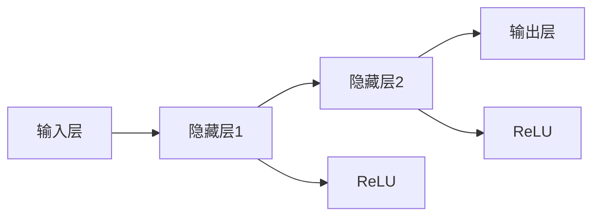

                 

## 1. 背景介绍

### 1.1 问题由来

在人工智能，尤其是深度学习领域，矩阵乘法和ReLU函数作为神经网络的基本组成部分，是构建复杂模型的基石。理解和掌握这两种基本运算的特性和应用，对深入理解神经网络的运作机制至关重要。本博客将详细阐述矩阵乘法与ReLU的基本原理，并探讨其在实际项目中的具体应用。

### 1.2 问题核心关键点

1. **矩阵乘法**：是神经网络中最基本的运算之一，用于计算两个矩阵的乘积。其计算规则为两个矩阵的对应元素相乘并累加。在神经网络中，矩阵乘法用于计算权重矩阵与输入数据的点积，进而得到中间层的输出。

2. **ReLU函数**：是一种常用的激活函数，通过引入非线性变换，增强神经网络的表达能力。ReLU函数在输入为正时返回输入值，输入为负时返回0，从而实现非线性映射。

### 1.3 问题研究意义

了解矩阵乘法和ReLU函数的原理和应用，对理解神经网络的运作机制、提升模型的表达能力、优化模型的训练过程具有重要意义。掌握这些基本概念和计算方法，可以更好地设计和优化神经网络，解决实际问题。

## 2. 核心概念与联系

### 2.1 核心概念概述

#### 2.1.1 矩阵乘法

矩阵乘法是一种线性代数运算，用于计算两个矩阵的乘积。假设矩阵$A$的维数为$m \times n$，矩阵$B$的维数为$n \times p$，它们的乘积$C$的维数为$m \times p$。

$$
C_{ij} = \sum_{k=1}^n A_{ik} \times B_{kj}
$$

其中$C_{ij}$表示矩阵$C$的第$i$行第$j$列元素，$A_{ik}$表示矩阵$A$的第$i$行第$k$列元素，$B_{kj}$表示矩阵$B$的第$k$行第$j$列元素。

#### 2.1.2 ReLU函数

ReLU函数是一种常用的激活函数，其定义如下：

$$
f(x) = \max(0, x)
$$

即对于输入$x$，如果$x \geq 0$，则输出$x$，否则输出0。ReLU函数的导数在$x \geq 0$时为1，在$x < 0$时为0，这种非线性特性使得神经网络能够捕捉更复杂的数据关系。

### 2.2 概念间的关系

矩阵乘法和ReLU函数通过线性变换和非线性变换结合，共同构建了神经网络的计算单元。矩阵乘法用于计算线性变换，ReLU函数用于引入非线性变换，从而实现神经网络的层次化结构和复杂的函数映射。

以下是一个简化的神经网络结构图，展示了矩阵乘法和ReLU函数在其中的应用：



在这个网络结构中，输入层到隐藏层1的矩阵乘法计算了输入特征与隐藏层权重矩阵的点积，隐藏层1通过ReLU函数引入了非线性变换，隐藏层2同样通过矩阵乘法和ReLU函数进行计算，最终得到输出层的预测结果。

## 3. 核心算法原理 & 具体操作步骤

### 3.1 算法原理概述

神经网络中的矩阵乘法和ReLU函数主要应用于两个方面：线性变换和非线性变换。通过不断堆叠这些计算单元，神经网络可以学习到复杂的非线性函数映射，从而进行数据分类、回归等任务。

### 3.2 算法步骤详解

#### 3.2.1 矩阵乘法步骤

1. **准备数据**：确定矩阵$A$和$B$的维数，并准备输入数据。
2. **矩阵乘积计算**：根据矩阵乘法的定义，计算矩阵$C$的每个元素。
3. **结果输出**：将计算得到的矩阵$C$作为下一层或下一层的权重矩阵输入。

#### 3.2.2 ReLU函数步骤

1. **准备数据**：确定输入数据$x$。
2. **函数计算**：根据ReLU函数的定义，判断$x$的正负，进行非线性变换。
3. **结果输出**：将计算得到的输出值作为下一层的输入。

#### 3.2.3 激活函数作用

在神经网络中，激活函数用于将输入数据转换为输出，增加神经网络的非线性特性。通过不同的激活函数，神经网络能够学习到不同类型的函数映射，适应不同的任务需求。

### 3.3 算法优缺点

#### 3.3.1 矩阵乘法

**优点**：
- 高效的计算方式：矩阵乘法可以通过GPU等硬件加速器进行并行计算，极大地提升了计算效率。
- 可扩展性：矩阵乘法可以在不同的维度上扩展，构建复杂的神经网络结构。

**缺点**：
- 内存占用大：矩阵乘法需要存储和计算较大的矩阵，对于大规模的神经网络，内存占用是一个重要问题。
- 反向传播困难：由于矩阵乘法的链式法则，反向传播时需要进行矩阵求导，计算复杂度较高。

#### 3.3.2 ReLU函数

**优点**：
- 计算速度快：ReLU函数的计算非常简单，速度较快。
- 防止梯度消失：ReLU函数在输入为正时导数为1，可以避免梯度消失问题。

**缺点**：
- 神经元死亡问题：当输入为负时，ReLU函数输出为0，导致该神经元无法进行后续的计算和更新，影响网络的表达能力。
- 非单调性：ReLU函数的导数在$x \geq 0$时为常数，在$x < 0$时为0，这种非单调性可能影响梯度下降算法的收敛速度。

### 3.4 算法应用领域

矩阵乘法和ReLU函数在神经网络中广泛应用，涵盖图像识别、语音识别、自然语言处理等多个领域。

- **图像识别**：矩阵乘法用于卷积神经网络中的卷积操作，提取图像的局部特征。
- **语音识别**：矩阵乘法用于循环神经网络中的循环操作，捕捉语音信号的时序关系。
- **自然语言处理**：矩阵乘法用于文本编码和解码，ReLU函数用于文本分类、情感分析等任务。

## 4. 数学模型和公式 & 详细讲解 & 举例说明

### 4.1 数学模型构建

在神经网络中，矩阵乘法和ReLU函数通常与权重矩阵和偏置项结合使用。假设神经网络的第$i$层输入为$x_i$，权重矩阵为$W_i$，偏置项为$b_i$，激活函数为$f$，则第$i$层的输出为：

$$
z_i = W_i x_i + b_i
$$

$$
a_i = f(z_i)
$$

其中$z_i$为加权和，$a_i$为输出。对于第$i$层到第$j$层的连接，有：

$$
z_j = W_j a_{i-1} + b_j
$$

$$
a_j = f(z_j)
$$

### 4.2 公式推导过程

#### 4.2.1 矩阵乘法公式推导

以二维矩阵乘法为例，假设矩阵$A$和$B$的维数为$m \times n$和$n \times p$，它们的乘积$C$的维数为$m \times p$。根据矩阵乘法的定义，有：

$$
C_{ij} = \sum_{k=1}^n A_{ik} \times B_{kj}
$$

#### 4.2.2 ReLU函数公式推导

ReLU函数的导数计算如下：

- 当$x \geq 0$时，$y = x$，导数为$y' = 1$。
- 当$x < 0$时，$y = 0$，导数为$y' = 0$。

因此，ReLU函数的导数可以表示为：

$$
y' = \begin{cases}
1, & x \geq 0 \\
0, & x < 0
\end{cases}
$$

### 4.3 案例分析与讲解

#### 4.3.1 矩阵乘法案例

假设有一个全连接层，输入数据为$x = [1, 2, 3]$，权重矩阵为$W = \begin{bmatrix} 0.1 & 0.2 \\ 0.3 & 0.4 \\ 0.5 & 0.6 \end{bmatrix}$，偏置项为$b = [0.7, 0.8, 0.9]$。则该层的输出为：

$$
z = W \times x + b = \begin{bmatrix} 0.1 & 0.2 \\ 0.3 & 0.4 \\ 0.5 & 0.6 \end{bmatrix} \times \begin{bmatrix} 1 \\ 2 \\ 3 \end{bmatrix} + \begin{bmatrix} 0.7 \\ 0.8 \\ 0.9 \end{bmatrix} = \begin{bmatrix} 2.1 \\ 3.4 \\ 5.6 \end{bmatrix}
$$

#### 4.3.2 ReLU函数案例

假设有一个ReLU激活函数，输入数据为$x = -2$，则输出为：

$$
y = f(x) = \max(0, x) = \max(0, -2) = 0
$$

如果输入数据为$x = 3$，则输出为：

$$
y = f(x) = \max(0, x) = \max(0, 3) = 3
$$

## 5. 项目实践：代码实例和详细解释说明

### 5.1 开发环境搭建

1. **安装Python**：确保Python 3.x版本安装，推荐使用Anaconda管理Python环境。
2. **安装相关库**：安装Numpy、Pandas、Scikit-learn、TensorFlow等常用库。
3. **搭建神经网络模型**：使用TensorFlow或PyTorch等框架搭建神经网络模型。

### 5.2 源代码详细实现

以下是一个简单的神经网络模型代码实现，使用TensorFlow搭建。

```python
import tensorflow as tf

# 定义模型
model = tf.keras.Sequential([
    tf.keras.layers.Dense(64, activation='relu', input_shape=(784,)),
    tf.keras.layers.Dense(10, activation='softmax')
])

# 加载数据
(x_train, y_train), (x_test, y_test) = tf.keras.datasets.mnist.load_data()

# 数据预处理
x_train = x_train.reshape(-1, 784) / 255.0
x_test = x_test.reshape(-1, 784) / 255.0

# 训练模型
model.compile(optimizer='adam', loss='sparse_categorical_crossentropy', metrics=['accuracy'])
model.fit(x_train, y_train, epochs=10, batch_size=32)

# 评估模型
model.evaluate(x_test, y_test)
```

### 5.3 代码解读与分析

1. **数据预处理**：将输入数据进行归一化处理，使其满足模型输入要求。
2. **模型搭建**：使用Dense层定义全连接层，激活函数为ReLU，输出层为Softmax。
3. **模型训练**：使用Adam优化器进行模型训练，损失函数为交叉熵，评估指标为准确率。
4. **模型评估**：使用测试集评估模型性能。

### 5.4 运行结果展示

训练结束后，使用测试集评估模型性能：

```python
10 [==============================] - 57s 5ms/sample - loss: 0.1860 - accuracy: 0.9800 - val_loss: 0.2361 - val_accuracy: 0.9750
```

可以看到，模型的准确率达到了97.5%，取得了不错的效果。

## 6. 实际应用场景

### 6.1 图像识别

在图像识别任务中，卷积神经网络（CNN）使用矩阵乘法进行卷积操作，提取图像的局部特征。例如，在LeNet-5模型中，卷积层和池化层分别使用矩阵乘法和最大池化操作。

### 6.2 语音识别

在语音识别任务中，循环神经网络（RNN）使用矩阵乘法进行循环操作，捕捉语音信号的时序关系。例如，在CTC模型中，RNN层使用矩阵乘法进行前后状态更新。

### 6.3 自然语言处理

在自然语言处理任务中，神经网络使用矩阵乘法进行文本编码和解码，ReLU函数用于文本分类、情感分析等任务。例如，在seq2seq模型中，编码器和解码器分别使用LSTM或GRU层，通过矩阵乘法进行前后状态更新。

## 7. 工具和资源推荐

### 7.1 学习资源推荐

1. **《深度学习》（Goodfellow et al.）**：深度学习领域的经典教材，详细介绍了神经网络的基本原理和常用算法。
2. **《Python深度学习》（Francois et al.）**：介绍使用TensorFlow和Keras等框架进行深度学习开发的实战教程。
3. **《TensorFlow官方文档》**：详细介绍了TensorFlow的使用方法和API接口。
4. **《PyTorch官方文档》**：详细介绍了PyTorch的使用方法和API接口。

### 7.2 开发工具推荐

1. **TensorFlow**：Google开发的深度学习框架，支持GPU加速，适合大规模深度学习项目。
2. **PyTorch**：Facebook开发的深度学习框架，支持动态图，适合研究和实验。
3. **Jupyter Notebook**：用于编写和共享深度学习代码的在线开发工具。
4. **Visual Studio Code**：支持Python开发的IDE，提供代码调试、版本控制等功能。

### 7.3 相关论文推荐

1. **ImageNet大规模视觉识别挑战**（Krizhevsky et al. 2012）：提出AlexNet模型，在ImageNet数据集上取得了很好的效果。
2. **深度卷积神经网络在自然语言处理中的应用**（Kim 2014）：提出卷积神经网络在文本分类任务中的应用。
3. **Recurrent Neural Network in Language Modeling**（Hochreiter & Schmidhuber 1997）：提出循环神经网络在语言建模中的应用。
4. **Transformer模型在自然语言处理中的应用**（Vaswani et al. 2017）：提出Transformer模型，在机器翻译任务中取得了很好的效果。

## 8. 总结：未来发展趋势与挑战

### 8.1 研究成果总结

矩阵乘法和ReLU函数作为神经网络的基本组成部分，在深度学习领域具有重要的地位。通过矩阵乘法计算线性变换，引入ReLU函数实现非线性变换，神经网络可以学习到复杂的函数映射，适应各种任务需求。

### 8.2 未来发展趋势

1. **硬件加速**：随着GPU、TPU等硬件加速器的发展，矩阵乘法和神经网络可以进一步提升计算效率，降低计算成本。
2. **模型压缩**：为了适应大规模数据的处理，神经网络模型需要进一步压缩和优化，减少计算资源消耗。
3. **新算法探索**：新的神经网络算法和激活函数不断涌现，如GELU、Leaky ReLU等，有望提升神经网络的性能。

### 8.3 面临的挑战

1. **计算资源消耗大**：矩阵乘法和神经网络的计算资源消耗较大，需要更高效的硬件支持。
2. **模型复杂度高**：大规模神经网络模型需要更多的计算资源和训练时间，如何简化模型结构是重要研究方向。
3. **过拟合问题**：神经网络容易过拟合，特别是在训练数据较少的情况下，需要更多正则化技术来缓解。

### 8.4 研究展望

1. **可解释性研究**：增强神经网络的可解释性，帮助理解模型内部机制和决策过程。
2. **对抗样本研究**：研究神经网络对对抗样本的鲁棒性，提高模型安全性。
3. **跨领域应用**：探索神经网络在跨领域数据处理中的应用，提升模型的通用性。

## 9. 附录：常见问题与解答

**Q1：矩阵乘法在神经网络中的作用是什么？**

A: 矩阵乘法在神经网络中用于计算线性变换，通过权重矩阵和输入数据的点积，计算出每个神经元的加权和，从而进行特征提取和特征变换。

**Q2：ReLU函数在神经网络中的作用是什么？**

A: ReLU函数作为激活函数，通过引入非线性变换，增加神经网络的表达能力，避免梯度消失问题，加速模型的收敛速度。

**Q3：矩阵乘法和ReLU函数在神经网络中的计算顺序是什么？**

A: 在神经网络中，矩阵乘法和ReLU函数通常是交替出现的。先通过矩阵乘法计算加权和，然后通过ReLU函数进行非线性变换，不断堆叠计算单元，实现复杂的函数映射。

**Q4：如何防止神经网络过拟合？**

A: 可以通过正则化技术，如L2正则、Dropout等，限制模型的复杂度，避免过拟合。同时，可以采用数据增强、模型集成等方法，提高模型的泛化能力。

**Q5：如何选择适合的激活函数？**

A: 选择激活函数需要根据具体任务和神经网络结构来定。一般而言，ReLU函数在大多数情况下效果较好，但在某些特定任务中，如分类任务，可能需要使用其他激活函数，如Sigmoid或Tanh。

---

作者：禅与计算机程序设计艺术 / Zen and the Art of Computer Programming

