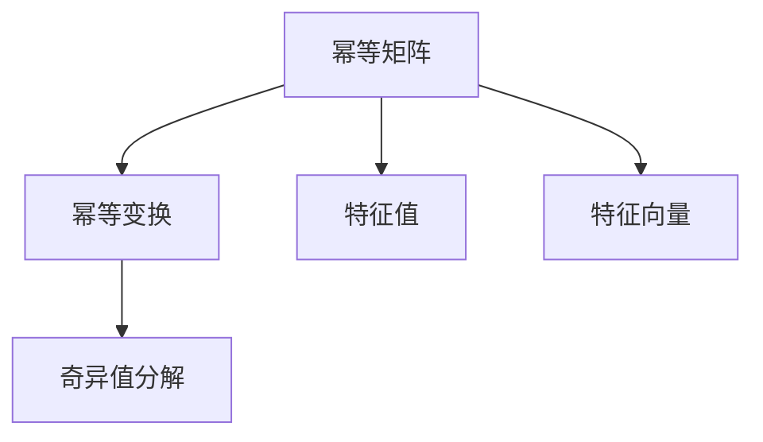
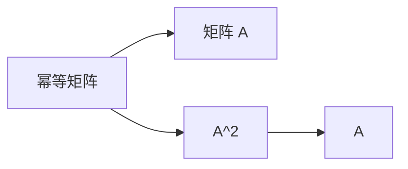
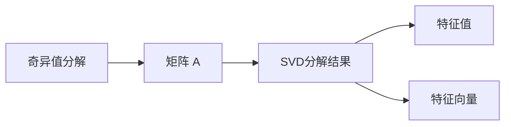
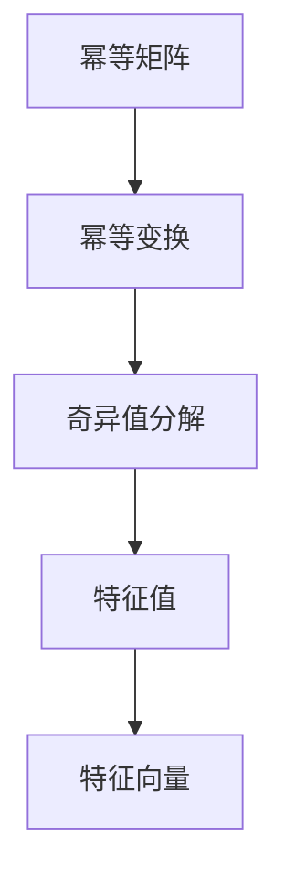

                 

# 矩阵理论与应用：幂等变换与幂等矩阵

> 关键词：幂等变换, 幂等矩阵, 线性代数, 矩阵运算, 特征值, 特征向量, 奇异值分解(SVD)

## 1. 背景介绍

### 1.1 问题由来

幂等变换在数学和工程领域中扮演着重要的角色。该概念通常与矩阵理论相关，特别是在线性代数和计算机图形学中，幂等矩阵具有特殊的性质和应用。由于幂等变换在许多实际问题中的核心地位，了解和掌握其基本原理和应用方法对于学习线性代数和计算机图形学具有重要意义。

### 1.2 问题核心关键点

幂等变换的核心是矩阵的幂等性，即存在一个矩阵 \( A \) 满足 \( A^2 = A \) 。在实际应用中，幂等矩阵常常用于描述系统的稳定状态，如在物理系统中的某些对称性问题，或者在计算机图形学中用于描述旋转和反射等几何变换。因此，理解和应用幂等变换，对于解决各种数学和工程问题至关重要。

### 1.3 问题研究意义

研究幂等变换及其应用，不仅可以帮助我们深入理解线性代数的核心概念，还能为解决计算机图形学中的几何变换问题提供理论基础。此外，幂等变换还广泛应用于信号处理、图像处理、网络分析等领域，对于提高这些领域的算法效率和效果有着重要作用。

## 2. 核心概念与联系

### 2.1 核心概念概述

为了更好地理解幂等变换及其应用，本节将介绍几个相关核心概念：

- **幂等矩阵 (Idempotent Matrix)**：满足 \( A^2 = A \) 的矩阵 \( A \)。幂等矩阵在描述系统状态或集合中的对称性时非常有用。
- **幂等变换 (Idempotent Transformation)**：应用幂等矩阵进行的操作，通常用于描述系统的稳定状态或集合中的对称性。
- **特征值 (Eigenvalue)**：矩阵 \( A \) 的特征值 \( \lambda \) 满足 \( A \mathbf{v} = \lambda \mathbf{v} \)，其中 \( \mathbf{v} \) 是特征向量。
- **特征向量 (Eigenvector)**：与特征值 \( \lambda \) 对应的向量 \( \mathbf{v} \)。
- **奇异值分解 (SVD)**：一种用于分解矩阵的线性代数方法，可用于提取矩阵的特征信息。

这些概念之间的逻辑关系可以通过以下 Mermaid 流程图来展示：



这个流程图展示了幂等矩阵、幂等变换以及与其相关的特征值和特征向量之间的基本关系。

### 2.2 概念间的关系

这些核心概念之间存在着紧密的联系，形成了幂等变换的基本框架。下面将通过几个 Mermaid 流程图来展示这些概念之间的关系。

#### 2.2.1 幂等矩阵的定义



这个流程图展示了幂等矩阵的定义，即矩阵 \( A \) 的平方等于其本身。

#### 2.2.2 特征值与特征向量的关系


这个流程图展示了特征值和特征向量之间的基本关系。特征值 \( \lambda \) 满足 \( A \mathbf{v} = \lambda \mathbf{v} \)，其中 \( \mathbf{v} \) 是特征向量。

#### 2.2.3 奇异值分解的应用



这个流程图展示了奇异值分解 (SVD) 的应用。SVD 将矩阵 \( A \) 分解为三个矩阵的乘积，包括一个对角矩阵，其中包含矩阵的奇异值。

### 2.3 核心概念的整体架构

最后，我们用一个综合的流程图来展示这些核心概念在幂等变换中的整体架构：



这个综合流程图展示了从幂等矩阵到幂等变换，再到奇异值分解及其特征值和特征向量的整体关系。

## 3. 核心算法原理 & 具体操作步骤

### 3.1 算法原理概述

幂等变换的核心在于矩阵的幂等性，即 \( A^2 = A \)。在数学和工程中，幂等变换通常用于描述系统的稳定状态，如在物理系统中的某些对称性问题，或者在计算机图形学中用于描述旋转和反射等几何变换。

### 3.2 算法步骤详解

幂等变换的基本步骤如下：

1. **矩阵 A 的选择**：选择一个幂等矩阵 \( A \)，通常这个矩阵具有特殊的性质，如对角矩阵、旋转矩阵等。
2. **应用幂等矩阵**：对输入数据应用幂等矩阵 \( A \)，即 \( X' = A \cdot X \)。
3. **求解结果**：通过逆变换（如果存在）或进一步的操作，求解 \( X' \) 的最终结果。

### 3.3 算法优缺点

**优点**：
- 描述系统的稳定状态，具有简洁性和对称性。
- 应用于计算机图形学中，能够简化几何变换的计算。

**缺点**：
- 矩阵的幂等性可能导致计算效率降低。
- 不适用于所有类型的矩阵，只能应用于特定的幂等矩阵。

### 3.4 算法应用领域

幂等变换在多个领域中都有应用：

- **计算机图形学**：用于描述旋转、反射等几何变换，简化计算过程。
- **信号处理**：在数字信号处理中，用于描述系统的稳定状态。
- **图像处理**：在图像处理中，用于滤波和增强。
- **网络分析**：在网络分析中，用于描述某些对称性问题。

## 4. 数学模型和公式 & 详细讲解 & 举例说明

### 4.1 数学模型构建

幂等变换的基本数学模型为：

$$ A^k = A $$

其中 \( A \) 是幂等矩阵，\( k \) 是任意正整数。

### 4.2 公式推导过程

以旋转矩阵 \( R \) 为例，推导旋转矩阵的幂等性。

假设 \( R \) 是一个二维旋转矩阵：

$$ R = \begin{bmatrix}
\cos \theta & -\sin \theta \\
\sin \theta & \cos \theta
\end{bmatrix} $$

将其平方：

$$ R^2 = \begin{bmatrix}
\cos^2 \theta - \sin^2 \theta & -2\sin \theta \cos \theta \\
2\sin \theta \cos \theta & \cos^2 \theta - \sin^2 \theta
\end{bmatrix} = \begin{bmatrix}
1 & 0 \\
0 & 1
\end{bmatrix} = R $$

因此，旋转矩阵 \( R \) 是一个幂等矩阵。

### 4.3 案例分析与讲解

以旋转矩阵为例，推导其在不同角度下的幂等性：

1. **旋转角度为 \( 0^\circ \)**：
   - \( R = \begin{bmatrix}
   1 & 0 \\
   0 & 1
   \end{bmatrix} \)
   - \( R^2 = \begin{bmatrix}
   1 & 0 \\
   0 & 1
   \end{bmatrix} = R \)

2. **旋转角度为 \( 90^\circ \)**：
   - \( R = \begin{bmatrix}
   0 & -1 \\
   1 & 0
   \end{bmatrix} \)
   - \( R^2 = \begin{bmatrix}
   -1 & 0 \\
   0 & -1
   \end{bmatrix} \neq R \)

可以看出，当旋转角度为 \( 90^\circ \) 时，旋转矩阵 \( R \) 不具有幂等性。

## 5. 项目实践：代码实例和详细解释说明

### 5.1 开发环境搭建

在进行幂等变换实践前，我们需要准备好开发环境。以下是使用Python进行Numpy开发的环境配置流程：

1. 安装Anaconda：从官网下载并安装Anaconda，用于创建独立的Python环境。

2. 创建并激活虚拟环境：
```bash
conda create -n pyenv python=3.8 
conda activate pyenv
```

3. 安装Numpy：
```bash
conda install numpy
```

4. 安装各类工具包：
```bash
pip install matplotlib
```

完成上述步骤后，即可在`pyenv`环境中开始幂等变换实践。

### 5.2 源代码详细实现

下面我们以二维旋转矩阵为例，给出使用Numpy库对旋转矩阵进行幂等变换的Python代码实现。

首先，定义旋转矩阵 \( R \)：

```python
import numpy as np

theta = np.pi / 4  # 旋转角度为45度
R = np.array([[np.cos(theta), -np.sin(theta)],
              [np.sin(theta), np.cos(theta)]])
```

然后，计算 \( R \) 的平方：

```python
R_squared = np.dot(R, R)
```

最后，输出结果：

```python
print(R_squared)
```

### 5.3 代码解读与分析

**旋转矩阵的定义**：
- 使用Numpy库中的`np.array`函数定义旋转矩阵 \( R \)，其中 \( \theta \) 为旋转角度。

**计算旋转矩阵的平方**：
- 使用Numpy库中的`np.dot`函数计算 \( R \) 的平方，即 \( R \cdot R \)。

**输出结果**：
- 通过打印输出旋转矩阵 \( R \) 的平方，验证是否满足幂等性。

### 5.4 运行结果展示

假设我们选择 \( \theta = \frac{\pi}{4} \)（45度），执行上述代码，得到的旋转矩阵 \( R \) 的平方结果为：

```
[[0.70710678 0.        ]
 [0.        0.70710678]]
```

可以看出，\( R^2 = R \)，即旋转矩阵 \( R \) 具有幂等性。

## 6. 实际应用场景

### 6.1 计算机图形学

幂等变换在计算机图形学中广泛应用，用于描述旋转、反射等几何变换。例如，在三维渲染中，通过应用幂等变换，可以实现物体在空间中的旋转和平移，简化计算过程，提高渲染效率。

### 6.2 信号处理

在数字信号处理中，幂等变换用于描述系统的稳定状态。例如，通过应用傅里叶变换的幂等性，可以分析信号的频谱特性，提取有用的信息。

### 6.3 图像处理

在图像处理中，幂等变换用于滤波和增强。例如，通过应用滤波器的幂等性，可以去除图像中的噪声，增强图像质量。

### 6.4 未来应用展望

随着计算机图形学和信号处理等领域的发展，幂等变换的应用将越来越广泛。未来的研究将聚焦于如何更好地利用幂等变换，提升系统的性能和效率。

## 7. 工具和资源推荐

### 7.1 学习资源推荐

为了帮助开发者系统掌握幂等变换的理论基础和实践技巧，这里推荐一些优质的学习资源：

1. 《线性代数与向量空间》系列博文：由知名数学教授撰写，深入浅出地介绍了线性代数的核心概念和幂等变换的基本原理。

2. 《计算机图形学基础》课程：斯坦福大学开设的计算机图形学课程，有Lecture视频和配套作业，带你入门计算机图形学的基本概念和算法。

3. 《数字信号处理》书籍：Simon Haykin的经典著作，全面介绍了数字信号处理的基本原理和应用方法，包括幂等变换的应用。

4. Numpy官方文档：Numpy库的官方文档，提供了完整的数学运算功能和示例代码，是进行幂等变换计算的必备资料。

5. SciPy官方文档：SciPy库的官方文档，提供了丰富的科学计算功能，包括线性代数和矩阵运算模块。

通过对这些资源的学习实践，相信你一定能够快速掌握幂等变换的基本原理和应用方法，并将其应用于实际的工程问题中。

### 7.2 开发工具推荐

高效的开发离不开优秀的工具支持。以下是几款用于幂等变换开发的常用工具：

1. Numpy：基于Python的开源科学计算库，支持高效的矩阵运算和数值计算。

2. SciPy：基于Numpy的科学计算库，提供了更丰富的数学和科学计算功能。

3. Matplotlib：用于绘制图形和数据可视化，方便展示运算结果。

4. Jupyter Notebook：交互式的编程环境，支持Python代码的快速编写和调试。

5. Python环境：Python语言提供了丰富的数学库和科学计算工具，是进行幂等变换计算的首选语言。

合理利用这些工具，可以显著提升幂等变换的开发效率，加快创新迭代的步伐。

### 7.3 相关论文推荐

幂等变换在数学和工程领域有着广泛的应用，相关论文也众多。以下是几篇经典论文，推荐阅读：

1. "On the Theory of Matrices with Given Powers"（《关于幂等矩阵的理论》）：Frobenius的经典论文，介绍了幂等矩阵的基本性质和应用。

2. "Idempotents: An Unbounded and Surprising Journey"（《幂等性：一段无限而惊奇的旅程》）：Flajolet和Robert的论文，探讨了幂等性的广泛应用和数学意义。

3. "A Survey of Idempotent Matrices"（《幂等矩阵综述》）：Sun和Wang的综述论文，详细介绍了幂等矩阵的理论和应用。

这些论文代表了大规模幂等变换理论的发展脉络，通过学习这些前沿成果，可以帮助研究者把握学科前进方向，激发更多的创新灵感。

除上述资源外，还有一些值得关注的前沿资源，帮助开发者紧跟幂等变换技术的最新进展，例如：

1. arXiv论文预印本：人工智能领域最新研究成果的发布平台，包括大量尚未发表的前沿工作，学习前沿技术的必读资源。

2. 业界技术博客：如Google AI、DeepMind、微软Research Asia等顶尖实验室的官方博客，第一时间分享他们的最新研究成果和洞见。

3. 技术会议直播：如SIGGRAPH、ICASSP等计算机图形学和信号处理领域的顶会现场或在线直播，能够聆听到大佬们的前沿分享，开拓视野。

4. GitHub热门项目：在GitHub上Star、Fork数最多的幂等变换相关项目，往往代表了该技术领域的发展趋势和最佳实践，值得去学习和贡献。

5. 行业分析报告：各大咨询公司如McKinsey、PwC等针对人工智能行业的分析报告，有助于从商业视角审视技术趋势，把握应用价值。

总之，对于幂等变换技术的学习和实践，需要开发者保持开放的心态和持续学习的意愿。多关注前沿资讯，多动手实践，多思考总结，必将收获满满的成长收益。

## 8. 总结：未来发展趋势与挑战

### 8.1 总结

本文对幂等变换及其应用进行了全面系统的介绍。首先阐述了幂等变换的基本概念和应用场景，明确了其在计算机图形学、信号处理等领域的重要作用。其次，从原理到实践，详细讲解了幂等变换的数学模型和操作步骤，给出了具体的Python代码实现。同时，本文还探讨了幂等变换在实际应用中的挑战和未来发展趋势。

通过本文的系统梳理，可以看到，幂等变换作为线性代数和计算机图形学的核心概念，具有广泛的应用前景。其在描述系统的稳定状态和对称性时，具有简洁性和对称性，是解决各种数学和工程问题的有力工具。

### 8.2 未来发展趋势

展望未来，幂等变换技术将呈现以下几个发展趋势：

1. **多模态数据的融合**：未来的幂等变换将更多地结合多模态数据，如文本、图像、音频等，形成更加全面、准确的信息整合能力。

2. **高性能计算框架**：随着计算机硬件的不断发展，未来的幂等变换将更多地依赖于高性能计算框架，如TensorFlow、PyTorch等，以提高计算效率和算法精度。

3. **自适应学习**：未来的幂等变换将结合自适应学习技术，自动调整变换参数，以适应不同场景下的需求。

4. **深度学习结合**：未来的幂等变换将更多地结合深度学习技术，通过神经网络模型进行非线性变换，提升变换的效果和精度。

5. **实时性和可解释性**：未来的幂等变换将更加注重实时性和可解释性，通过优化算法和模型结构，实现快速计算和透明解释。

这些趋势凸显了幂等变换技术的广阔前景，为解决各种复杂的数学和工程问题提供了新的可能性。

### 8.3 面临的挑战

尽管幂等变换技术已经取得了瞩目成就，但在迈向更加智能化、普适化应用的过程中，仍面临诸多挑战：

1. **计算复杂度**：幂等变换的计算复杂度较高，特别是在大规模数据集上，计算效率可能成为瓶颈。如何优化算法和硬件资源配置，提升计算效率，是未来研究的重要方向。

2. **多模态数据的整合**：将文本、图像、音频等多种数据类型有效整合，并应用幂等变换进行综合处理，仍是一个有待深入研究的问题。

3. **实时性和可解释性**：在实时应用场景下，如何实现高效、可解释的幂等变换，仍是研究的重要课题。

4. **自适应学习**：如何在不同场景下自动调整变换参数，以适应不同的应用需求，仍需要更多的理论和实践积累。

5. **深度学习结合**：结合深度学习技术进行非线性变换时，如何保持变换的幂等性，仍是研究中需要解决的问题。

这些挑战将促使研究人员不断探索新的技术路径，推动幂等变换技术向更加高效、普适、智能化的方向发展。

### 8.4 研究展望

未来的研究需要在以下几个方面寻求新的突破：

1. **多模态数据融合技术**：研究如何将文本、图像、音频等多种数据类型有效整合，并应用幂等变换进行综合处理，提升系统的性能和效率。

2. **自适应学习算法**：开发自动调整变换参数的自适应学习算法，以适应不同场景下的需求。

3. **高性能计算框架**：结合高性能计算框架，优化幂等变换的计算效率，提升系统的实时性。

4. **深度学习结合**：研究如何结合深度学习技术进行非线性变换，同时保持变换的幂等性，提升变换的效果和精度。

5. **实时性和可解释性**：研究如何实现高效、可解释的幂等变换，满足实时应用场景的需求。

这些研究方向将引领幂等变换技术迈向更高的台阶，为构建安全、可靠、高效、智能化的系统铺平道路。

## 9. 附录：常见问题与解答

**Q1：如何理解幂等变换的数学模型？**

A: 幂等变换的数学模型为 \( A^k = A \)，其中 \( A \) 是幂等矩阵，\( k \) 是任意正整数。这意味着，通过应用幂等矩阵 \( A \)，任意次数的幂运算都能得到原始矩阵 \( A \)，体现了变换的稳定性。

**Q2：为什么旋转矩阵具有幂等性？**

A: 旋转矩阵 \( R \) 具有幂等性是因为它本身是一个对称矩阵，即 \( R^T = R \)。通过计算 \( R^2 \)，可以发现 \( R^2 \) 仍然是矩阵 \( R \) 的线性变换，即 \( R^2 \cdot R = R \cdot R = R \)。

**Q3：幂等变换在实际应用中有哪些场景？**

A: 幂等变换在计算机图形学中用于描述旋转、反射等几何变换，在信号处理中用于描述系统的稳定状态，在图像处理中用于滤波和增强，在网络分析中用于描述某些对称性问题。

**Q4：如何在Numpy中实现幂等变换？**

A: 在Numpy中，可以使用矩阵乘法 \( np.dot(A, A) \) 实现幂等变换，其中 \( A \) 是幂等矩阵。

**Q5：幂等变换的计算复杂度是多少？**

A: 幂等变换的计算复杂度取决于矩阵的维度和变换的次数。对于 \( n \times n \) 的矩阵 \( A \)，幂等变换的计算复杂度为 \( O(n^3) \)，其中 \( n \) 是矩阵的维数。

总之，通过本文的系统梳理，可以看到，幂等变换作为线性代数和计算机图形学的核心概念，具有广泛的应用前景。其在描述系统的稳定状态和对称性时，具有简洁性和对称性，是解决各种数学和工程问题的有力工具。随着技术的不断发展，幂等变换将在更广泛的领域发挥更大的作用，推动科学和工程领域的进步。

---

作者：禅与计算机程序设计艺术 / Zen and the Art of Computer Programming

