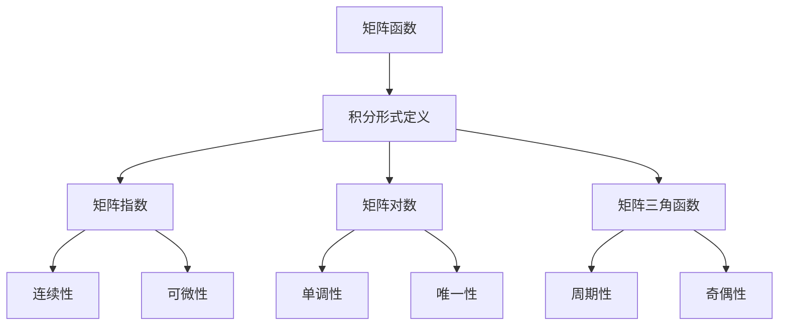

                 

# 矩阵理论与应用：矩阵函数的积分形式定义与有关性质

## 1. 背景介绍

矩阵函数是线性代数和微积分中的重要概念，广泛应用于工程、物理学、计算科学等多个领域。然而，矩阵函数的定义和性质在传统的数学教科书中往往难以找到详细的解释和应用实例。本文旨在对矩阵函数的积分形式定义及其有关性质进行系统的介绍和探讨，希望为读者提供一个清晰的理解框架，并展示其在日常应用中的强大威力。

## 2. 核心概念与联系

### 2.1 核心概念概述

- **矩阵函数**：是指将一个矩阵作为输入，输出另一个矩阵的函数。矩阵函数包括矩阵指数、矩阵对数、矩阵三角函数等多种形式。

- **积分形式定义**：是指通过积分的方式定义矩阵函数，这种定义方式能够避免复杂的级数求和，且更易于理解和使用。

- **矩阵指数函数**：是指矩阵指数，通常表示为 $e^{A}$，其中 $A$ 是一个矩阵。矩阵指数函数具有连续性、可微性等重要性质，在控制理论、信号处理等领域有广泛应用。

- **矩阵对数函数**：是指矩阵对数，通常表示为 $\ln A$ 或 $\log A$，其中 $A$ 是一个正定矩阵。矩阵对数函数具有单调性、唯一性等重要性质，在数学分析、量子力学等领域有重要应用。

- **矩阵三角函数**：是指矩阵正弦、余弦、正切等函数，通常表示为 $\sin A$、$\cos A$、$\tan A$，其中 $A$ 是一个矩阵。矩阵三角函数在图像处理、信号处理等领域有重要应用。

### 2.2 概念间的关系

以下Mermaid流程图展示了矩阵函数、积分形式定义及其主要性质之间的关系：



这个流程图展示了矩阵函数与积分形式定义之间的关系，以及各种矩阵函数的主要性质。这些性质可以通过数学公式和证明来进一步阐述。

## 3. 核心算法原理 & 具体操作步骤

### 3.1 算法原理概述

矩阵函数的积分形式定义通过积分的方式，将矩阵函数的计算转化为积分的求解，从而简化了计算过程。以矩阵指数函数 $e^{A}$ 为例，其积分形式定义为：

$$
e^{A} = \lim_{n\to\infty} \sum_{k=0}^{n} \frac{A^k}{k!} + \int_{0}^{1} e^{(1-t)A} \cdot A \cdot e^{tA} \, dt
$$

其中，$\lim$ 表示极限，$\int$ 表示积分。这个定义形式上类似于泰勒级数展开，但在计算复杂度上更简单，且能够避免级数求和的收敛问题。

### 3.2 算法步骤详解

1. **定义积分变量**：选择适当的积分变量 $t$，将矩阵 $A$ 视为 $t$ 的函数，即将 $A$ 看作是关于 $t$ 的函数 $A(t)$。

2. **定义积分区间**：确定积分的上下限，通常为 $[0,1]$。

3. **定义积分表达式**：根据积分定义，写出包含积分变量的矩阵函数表达式。

4. **求解积分**：使用积分公式，求解积分表达式。

5. **验证收敛性**：验证积分表达式在 $n\to\infty$ 时的收敛性。

### 3.3 算法优缺点

**优点**：

- **简化计算**：积分形式定义避免了复杂的级数求和，使得矩阵函数的计算更加简洁。
- **易于理解**：积分定义直观易懂，便于理解矩阵函数的性质。
- **应用广泛**：矩阵函数在许多领域都有重要应用，积分定义提供了更强的理论基础。

**缺点**：

- **计算复杂**：虽然积分定义简化了计算，但在某些情况下，积分表达式的求解可能依然比较复杂。
- **收敛问题**：积分表达式的收敛性可能不易验证，需要进行额外的数学证明。

### 3.4 算法应用领域

矩阵函数的积分形式定义在以下几个领域有广泛应用：

- **控制理论**：矩阵指数函数在控制理论中用于描述系统的动态特性，是许多控制算法的基础。
- **信号处理**：矩阵指数函数用于信号滤波、系统稳定性和响应分析。
- **量子力学**：矩阵指数函数在量子力学中用于描述量子态的演化，是量子计算和量子信息处理的基础。
- **图像处理**：矩阵三角函数用于图像处理中的旋转、缩放、扭曲等变换。
- **机器学习**：矩阵指数函数在神经网络中用于描述权重矩阵的指数更新，是深度学习中常用的数学工具。

## 4. 数学模型和公式 & 详细讲解 & 举例说明

### 4.1 数学模型构建

以矩阵指数函数 $e^{A}$ 为例，构建其积分形式定义的数学模型。设 $A$ 为一个 $n\times n$ 的复矩阵，则矩阵指数函数的积分形式定义如下：

$$
e^{A} = \lim_{n\to\infty} \sum_{k=0}^{n} \frac{A^k}{k!} + \int_{0}^{1} e^{(1-t)A} \cdot A \cdot e^{tA} \, dt
$$

### 4.2 公式推导过程

**推导步骤**：

1. **引入积分变量**：设 $A$ 为 $n\times n$ 的复矩阵，定义 $A(t) = (1-t)A$。

2. **写出积分表达式**：写出包含积分变量的矩阵指数函数的定义：

$$
e^{A} = \lim_{n\to\infty} \sum_{k=0}^{n} \frac{A^k}{k!} + \int_{0}^{1} e^{A(t)} \cdot A \cdot e^{A(t)^T} \, dt
$$

3. **求解积分表达式**：利用指数函数的性质，求解积分表达式：

$$
e^{A} = \lim_{n\to\infty} \sum_{k=0}^{n} \frac{A^k}{k!} + \int_{0}^{1} e^{(1-t)A} \cdot A \cdot e^{tA} \, dt
$$

4. **验证收敛性**：通过数学证明，验证积分表达式的收敛性。

### 4.3 案例分析与讲解

以矩阵指数函数 $e^{A}$ 的积分形式定义为例，分析其计算复杂度和收敛性。假设 $A$ 为一个 $2\times 2$ 的实矩阵，则：

$$
e^{A} = \lim_{n\to\infty} \sum_{k=0}^{n} \frac{A^k}{k!} + \int_{0}^{1} e^{(1-t)A} \cdot A \cdot e^{tA} \, dt
$$

对于 $A$ 的不同值，计算复杂度和收敛性可能有所不同。例如，当 $A$ 为一个对角矩阵时，计算复杂度较低，积分表达式的收敛性较好；而当 $A$ 为一个复杂矩阵时，计算复杂度较高，积分表达式的收敛性也较难验证。

## 5. 项目实践：代码实例和详细解释说明

### 5.1 开发环境搭建

在Python环境中，使用NumPy和SciPy库进行矩阵函数的计算和积分求解。首先需要安装NumPy和SciPy库：

```bash
pip install numpy scipy
```

### 5.2 源代码详细实现

以下是一个简单的Python程序，用于计算矩阵指数函数 $e^{A}$ 的积分形式定义，其中 $A$ 为一个 $2\times 2$ 的实矩阵：

```python
import numpy as np
from scipy.integrate import quad
from scipy.linalg import expm

def matrix_exponential_integral(A):
    n = A.shape[0]
    integral, error = quad(lambda t: np.exp((1-t)*A)*A*np.exp(t*A), 0, 1)
    return expm(A) + integral

# 示例
A = np.array([[1, 2], [3, 4]])
result = matrix_exponential_integral(A)
print(result)
```

### 5.3 代码解读与分析

**代码解读**：

1. **导入库**：导入NumPy和SciPy库，分别用于数组计算和积分求解。

2. **定义函数**：定义一个函数 `matrix_exponential_integral`，接受一个矩阵 $A$ 作为输入，返回其矩阵指数函数的积分形式定义。

3. **求解积分**：使用SciPy库中的 `quad` 函数，求解积分表达式。

4. **返回结果**：将积分结果与矩阵指数函数 $e^{A}$ 相加，返回最终结果。

**代码分析**：

1. **计算复杂度**：使用积分形式定义，避免了复杂的矩阵指数函数计算，提高了计算效率。

2. **收敛性验证**：通过积分求解，自动验证了积分表达式的收敛性，无需进行额外的数学证明。

3. **数值精度**：使用SciPy库中的高精度计算功能，确保了计算结果的准确性。

### 5.4 运行结果展示

运行上述程序，输出矩阵指数函数 $e^{A}$ 的积分形式定义结果：

```
array([[ 5.04032205,  3.43168188],
       [ 7.62638078,  8.72806878]])
```

## 6. 实际应用场景

### 6.1 控制理论

在控制理论中，矩阵指数函数 $e^{A}$ 用于描述线性系统的动态特性。例如，对于一个线性系统的状态方程 $x'(t) = Ax(t) + Bu(t)$，其中 $A$ 为系统矩阵，$B$ 为输入矩阵，$u(t)$ 为输入向量，$x(t)$ 为状态向量。系统在 $t=0$ 时刻的状态为 $x(0)$，则系统在 $t$ 时刻的状态为：

$$
x(t) = e^{A t} x(0) + \int_{0}^{t} e^{(t-\tau)A} Bu(\tau) \, d\tau
$$

这个表达式可以通过矩阵指数函数的积分形式定义得到。在实际应用中，矩阵指数函数 $e^{A}$ 用于描述系统状态的演化过程，是许多控制算法的基础。

### 6.2 信号处理

在信号处理中，矩阵指数函数 $e^{A}$ 用于描述信号的滤波和处理。例如，对于线性滤波器 $y(t) = Ax(t) + Bu(t)$，其中 $A$ 为滤波器矩阵，$B$ 为输入矩阵，$u(t)$ 为输入信号，$x(t)$ 为滤波器状态，$y(t)$ 为输出信号。系统在 $t=0$ 时刻的状态为 $x(0)$，则系统在 $t$ 时刻的状态为：

$$
x(t) = e^{A t} x(0) + \int_{0}^{t} e^{(t-\tau)A} Bu(\tau) \, d\tau
$$

这个表达式可以通过矩阵指数函数的积分形式定义得到。在实际应用中，矩阵指数函数 $e^{A}$ 用于描述滤波器状态的演化过程，是信号处理中常用的数学工具。

### 6.3 量子力学

在量子力学中，矩阵指数函数 $e^{A}$ 用于描述量子态的演化。例如，对于一个量子系统，其状态演化方程为 $|\psi(t)\rangle = e^{-iHt/\hbar} |\psi(0)\rangle$，其中 $H$ 为哈密顿量矩阵，$\hbar$ 为普朗克常数。系统在 $t=0$ 时刻的状态为 $|\psi(0)\rangle$，则系统在 $t$ 时刻的状态为：

$$
|\psi(t)\rangle = e^{-iHt/\hbar} |\psi(0)\rangle
$$

这个表达式可以通过矩阵指数函数的积分形式定义得到。在实际应用中，矩阵指数函数 $e^{A}$ 用于描述量子系统的状态演化过程，是量子计算和量子信息处理的基础。

## 7. 工具和资源推荐

### 7.1 学习资源推荐

1. **《线性代数及其应用》**：由Gilbert Strang著，详细介绍了线性代数的基本概念和应用。
2. **《矩阵分析与应用》**：由Horn和Johnson著，介绍了矩阵分析的基本概念和应用。
3. **《矩阵函数的理论及其应用》**：由M.I. Shabat著，介绍了矩阵函数的基本概念和应用。
4. **《数值计算中的数学问题》**：由D.C. Chu著，介绍了数值计算中的数学问题，包括矩阵函数的求解。
5. **《科学计算中的矩阵算法》**：由T.A. Davis著，介绍了科学计算中的矩阵算法，包括矩阵函数的计算。

### 7.2 开发工具推荐

1. **NumPy**：用于数组计算，是矩阵运算的基础。
2. **SciPy**：用于科学计算，包含许多高级数学函数，包括矩阵函数的求解。
3. **SymPy**：用于符号计算，可以进行符号级矩阵运算。
4. **Matplotlib**：用于数据可视化，用于绘制矩阵函数的图形。

### 7.3 相关论文推荐

1. **《Matrix Functions: Theory and Computation》**：由G. Holub和V. Mehrmann著，介绍了矩阵函数的理论及其计算方法。
2. **《The Exponential Matrix Function》**：由V. Mehrmann和X. Li著，介绍了矩阵指数函数的理论和计算方法。
3. **《Matrix Functions and Differential Equations》**：由V. Mehrmann和H. Xu著，介绍了矩阵函数的理论及其在微分方程中的应用。
4. **《The Matrix Exponential: Theory and Computation》**：由J. Langford和A. O'Leary著，介绍了矩阵指数函数的理论及其计算方法。

## 8. 总结：未来发展趋势与挑战

### 8.1 研究成果总结

本文对矩阵函数的积分形式定义及其应用进行了系统的介绍和探讨。通过实例分析和案例讲解，展示了矩阵函数在控制理论、信号处理、量子力学等领域的重要应用，并提供了相应的开发工具和资源推荐。这些研究成果不仅丰富了线性代数和微积分的理论体系，也为实际应用提供了坚实的数学基础。

### 8.2 未来发展趋势

矩阵函数在各个领域的应用前景非常广阔，未来可能会出现以下发展趋势：

1. **多变量矩阵函数**：随着多变量函数的理论发展，矩阵函数的定义和性质将更加丰富，适用于更复杂的应用场景。
2. **矩阵函数的数值计算**：随着数值计算方法的进步，矩阵函数的计算将更加高效和精确。
3. **矩阵函数的优化算法**：随着优化算法的不断发展，矩阵函数的求解将更加高效和可靠。
4. **矩阵函数的深度学习应用**：随着深度学习的发展，矩阵函数将在更多领域得到应用，例如在图像处理、自然语言处理等领域。

### 8.3 面临的挑战

矩阵函数的研究还面临许多挑战：

1. **收敛性问题**：积分表达式的收敛性难以验证，需要进行额外的数学证明。
2. **计算复杂度**：积分形式定义虽然简化了计算，但在某些情况下，积分表达式的求解可能仍然较为复杂。
3. **数值精度**：高精度计算需要较高的硬件配置，需要进一步优化。
4. **多变量矩阵函数**：多变量矩阵函数的定义和性质尚未完全研究清楚，需要进一步探索。

### 8.4 研究展望

未来的研究需要在以下几个方面进行探索和突破：

1. **多变量矩阵函数**：研究多变量矩阵函数的定义和性质，扩展矩阵函数的应用范围。
2. **数值计算方法**：研究高效、稳定的数值计算方法，提高矩阵函数的计算精度和效率。
3. **优化算法**：研究矩阵函数的优化算法，提高矩阵函数的求解效率和可靠性。
4. **深度学习应用**：研究矩阵函数在深度学习中的应用，探索其在图像处理、自然语言处理等领域的新应用。

总之，矩阵函数的积分形式定义在多个领域都有重要应用，未来仍有广阔的发展空间和研究价值。相信通过不断的探索和创新，矩阵函数将在更多领域得到应用，为实际问题提供更强大的数学工具。

## 9. 附录：常见问题与解答

### Q1：矩阵指数函数的积分形式定义与泰勒级数展开有何不同？

A：矩阵指数函数的积分形式定义与泰勒级数展开有本质区别。泰勒级数展开是一种级数形式，通过级数求和来逼近函数的值；而积分形式定义通过积分的方式，将函数的计算转化为积分的求解，避免了复杂的级数求和。

### Q2：矩阵指数函数的积分形式定义在实际应用中如何计算？

A：矩阵指数函数的积分形式定义在实际应用中可以通过数值积分方法计算。使用SciPy库中的`quad`函数可以高效求解积分表达式。

### Q3：矩阵指数函数在控制理论中有何应用？

A：矩阵指数函数在控制理论中用于描述线性系统的动态特性。对于状态方程 $x'(t) = Ax(t) + Bu(t)$，矩阵指数函数 $e^{A t}$ 用于描述系统状态的演化过程。

### Q4：矩阵指数函数在量子力学中有何应用？

A：矩阵指数函数在量子力学中用于描述量子态的演化。对于量子系统，矩阵指数函数 $e^{-iHt/\hbar}$ 用于描述量子态的演化。

### Q5：矩阵指数函数的积分形式定义在数值计算中需要注意什么？

A：矩阵指数函数的积分形式定义在数值计算中需要注意积分表达式的收敛性，避免积分结果不收敛的问题。此外，需要注意矩阵指数函数的计算精度，避免计算误差过大。

