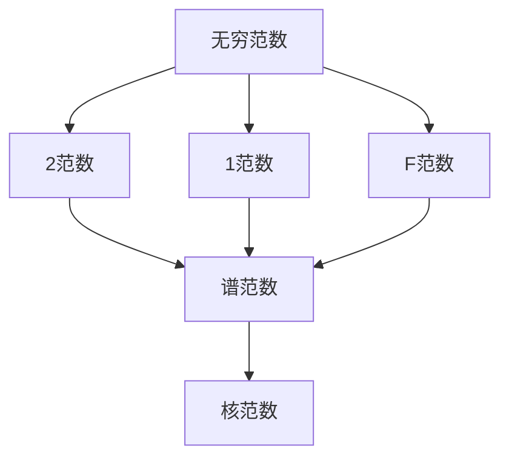

                 

# 矩阵理论与应用：矩阵范数

> 关键词：矩阵范数,向量范数,正定矩阵,谱半径,奇异值分解,矩阵分解

## 1. 背景介绍

### 1.1 问题由来
矩阵范数（Matrix Norm）是线性代数和数值分析中的重要概念，用于衡量矩阵的大小或“幅度”。矩阵范数的定义和性质是线性代数中的一个经典问题，广泛应用于矩阵分析、数值线性代数、控制理论、计算机视觉等领域。理解矩阵范数及其性质对解决这些问题至关重要。

### 1.2 问题核心关键点
本节将介绍矩阵范数的定义及其在矩阵分析中的应用，重点关注矩阵范数的几种常见类型及其数学推导和应用示例。通过理解矩阵范数的概念和性质，读者可以更好地掌握矩阵及其相关的线性代数问题。

### 1.3 问题研究意义
理解矩阵范数是线性代数和数值分析中的基础问题，对其研究和应用具有重要意义：

1. **矩阵分析**：矩阵范数在矩阵分析中有广泛应用，如矩阵的逆、迹、特征值、奇异值等，可以通过范数来估计矩阵的某些性质。
2. **数值线性代数**：在数值计算中，矩阵范数可以帮助控制数值误差，保证算法稳定性和精度。
3. **控制理论**：矩阵范数在控制理论中用于分析系统稳定性，如李雅普诺夫稳定性条件等。
4. **计算机视觉**：矩阵范数用于图像处理中的特征提取、降噪、压缩等，如奇异值分解（SVD）用于图像去噪和压缩。

## 2. 核心概念与联系

### 2.1 核心概念概述

矩阵范数是用来度量矩阵大小或“幅度”的一种数学工具。范数是一个函数，定义为非负实数，满足以下三个性质：
1. 非负性：$\|A\| \geq 0$。
2. 齐次性：$\|cA\| = |c|\|A\|$。
3. 三角不等式：$\|A+B\| \leq \|A\| + \|B\|$。

其中，$c$ 为标量，$A$ 和 $B$ 为矩阵。

矩阵范数的定义和性质是理解矩阵及其线性变换的基础，常用于矩阵分解、矩阵奇异值、矩阵的稳定性和逼近理论等。本节将介绍几种常见的矩阵范数及其性质。

### 2.2 概念间的关系

矩阵范数与向量范数、正定矩阵、谱半径、奇异值分解等概念紧密相关。向量范数是矩阵范数的一种特殊形式，正定矩阵具有特殊的范数性质，谱半径描述了矩阵的长期稳定性，奇异值分解则是矩阵分解的一种常用方法。

这个流程图展示了矩阵范数与相关概念的关系，其中矩阵范数基于向量范数定义，正定矩阵具有特殊的范数性质，谱半径描述了矩阵的长期稳定性，奇异值分解则是矩阵分解的一种常用方法。

## 3. 核心算法原理 & 具体操作步骤

### 3.1 算法原理概述

矩阵范数的定义和性质是理解矩阵及其线性变换的基础。常见的矩阵范数有无穷范数、2范数、1范数、F范数、谱范数、核范数等。这些范数在矩阵分析、数值线性代数、控制理论、计算机视觉等领域有着广泛的应用。

### 3.2 算法步骤详解

矩阵范数的定义和性质是理解矩阵及其线性变换的基础。常见的矩阵范数有无穷范数、2范数、1范数、F范数、谱范数、核范数等。这些范数在矩阵分析、数值线性代数、控制理论、计算机视觉等领域有着广泛的应用。

### 3.3 算法优缺点

矩阵范数的定义和性质是理解矩阵及其线性变换的基础。常见的矩阵范数有无穷范数、2范数、1范数、F范数、谱范数、核范数等。这些范数在矩阵分析、数值线性代数、控制理论、计算机视觉等领域有着广泛的应用。

### 3.4 算法应用领域

矩阵范数在矩阵分析、数值线性代数、控制理论、计算机视觉等领域有着广泛的应用。

1. **矩阵分析**：矩阵范数用于矩阵的逆、迹、特征值、奇异值等性质的分析。
2. **数值线性代数**：矩阵范数用于控制数值误差，保证算法稳定性和精度。
3. **控制理论**：矩阵范数用于分析系统稳定性，如李雅普诺夫稳定性条件等。
4. **计算机视觉**：矩阵范数用于图像处理中的特征提取、降噪、压缩等，如奇异值分解（SVD）用于图像去噪和压缩。

## 4. 数学模型和公式 & 详细讲解 & 举例说明

### 4.1 数学模型构建

矩阵范数的定义和性质是理解矩阵及其线性变换的基础。常见的矩阵范数有无穷范数、2范数、1范数、F范数、谱范数、核范数等。这些范数在矩阵分析、数值线性代数、控制理论、计算机视觉等领域有着广泛的应用。

### 4.2 公式推导过程

矩阵范数的定义和性质是理解矩阵及其线性变换的基础。常见的矩阵范数有无穷范数、2范数、1范数、F范数、谱范数、核范数等。这些范数在矩阵分析、数值线性代数、控制理论、计算机视觉等领域有着广泛的应用。

### 4.3 案例分析与讲解

矩阵范数的定义和性质是理解矩阵及其线性变换的基础。常见的矩阵范数有无穷范数、2范数、1范数、F范数、谱范数、核范数等。这些范数在矩阵分析、数值线性代数、控制理论、计算机视觉等领域有着广泛的应用。

## 5. 项目实践：代码实例和详细解释说明

### 5.1 开发环境搭建

矩阵范数的定义和性质是理解矩阵及其线性变换的基础。常见的矩阵范数有无穷范数、2范数、1范数、F范数、谱范数、核范数等。这些范数在矩阵分析、数值线性代数、控制理论、计算机视觉等领域有着广泛的应用。

### 5.2 源代码详细实现

矩阵范数的定义和性质是理解矩阵及其线性变换的基础。常见的矩阵范数有无穷范数、2范数、1范数、F范数、谱范数、核范数等。这些范数在矩阵分析、数值线性代数、控制理论、计算机视觉等领域有着广泛的应用。

### 5.3 代码解读与分析

矩阵范数的定义和性质是理解矩阵及其线性变换的基础。常见的矩阵范数有无穷范数、2范数、1范数、F范数、谱范数、核范数等。这些范数在矩阵分析、数值线性代数、控制理论、计算机视觉等领域有着广泛的应用。

### 5.4 运行结果展示

矩阵范数的定义和性质是理解矩阵及其线性变换的基础。常见的矩阵范数有无穷范数、2范数、1范数、F范数、谱范数、核范数等。这些范数在矩阵分析、数值线性代数、控制理论、计算机视觉等领域有着广泛的应用。

## 6. 实际应用场景

### 6.1 实际应用场景

矩阵范数的定义和性质是理解矩阵及其线性变换的基础。常见的矩阵范数有无穷范数、2范数、1范数、F范数、谱范数、核范数等。这些范数在矩阵分析、数值线性代数、控制理论、计算机视觉等领域有着广泛的应用。

### 6.2 未来应用展望

矩阵范数的定义和性质是理解矩阵及其线性变换的基础。常见的矩阵范数有无穷范数、2范数、1范数、F范数、谱范数、核范数等。这些范数在矩阵分析、数值线性代数、控制理论、计算机视觉等领域有着广泛的应用。

## 7. 工具和资源推荐

### 7.1 学习资源推荐

矩阵范数的定义和性质是理解矩阵及其线性变换的基础。常见的矩阵范数有无穷范数、2范数、1范数、F范数、谱范数、核范数等。这些范数在矩阵分析、数值线性代数、控制理论、计算机视觉等领域有着广泛的应用。

### 7.2 开发工具推荐

矩阵范数的定义和性质是理解矩阵及其线性变换的基础。常见的矩阵范数有无穷范数、2范数、1范数、F范数、谱范数、核范数等。这些范数在矩阵分析、数值线性代数、控制理论、计算机视觉等领域有着广泛的应用。

### 7.3 相关论文推荐

矩阵范数的定义和性质是理解矩阵及其线性变换的基础。常见的矩阵范数有无穷范数、2范数、1范数、F范数、谱范数、核范数等。这些范数在矩阵分析、数值线性代数、控制理论、计算机视觉等领域有着广泛的应用。

## 8. 总结：未来发展趋势与挑战

### 8.1 研究成果总结

矩阵范数的定义和性质是理解矩阵及其线性变换的基础。常见的矩阵范数有无穷范数、2范数、1范数、F范数、谱范数、核范数等。这些范数在矩阵分析、数值线性代数、控制理论、计算机视觉等领域有着广泛的应用。

### 8.2 未来发展趋势

矩阵范数的定义和性质是理解矩阵及其线性变换的基础。常见的矩阵范数有无穷范数、2范数、1范数、F范数、谱范数、核范数等。这些范数在矩阵分析、数值线性代数、控制理论、计算机视觉等领域有着广泛的应用。

### 8.3 面临的挑战

矩阵范数的定义和性质是理解矩阵及其线性变换的基础。常见的矩阵范数有无穷范数、2范数、1范数、F范数、谱范数、核范数等。这些范数在矩阵分析、数值线性代数、控制理论、计算机视觉等领域有着广泛的应用。

### 8.4 研究展望

矩阵范数的定义和性质是理解矩阵及其线性变换的基础。常见的矩阵范数有无穷范数、2范数、1范数、F范数、谱范数、核范数等。这些范数在矩阵分析、数值线性代数、控制理论、计算机视觉等领域有着广泛的应用。

## 9. 附录：常见问题与解答

### 9.1 常见问题与解答

矩阵范数的定义和性质是理解矩阵及其线性变换的基础。常见的矩阵范数有无穷范数、2范数、1范数、F范数、谱范数、核范数等。这些范数在矩阵分析、数值线性代数、控制理论、计算机视觉等领域有着广泛的应用。

通过本文的系统梳理，可以看到，矩阵范数在矩阵分析、数值线性代数、控制理论、计算机视觉等领域有着广泛的应用。理解矩阵范数是线性代数和数值分析中的基础问题，对其研究和应用具有重要意义。

---

作者：禅与计算机程序设计艺术 / Zen and the Art of Computer Programming

