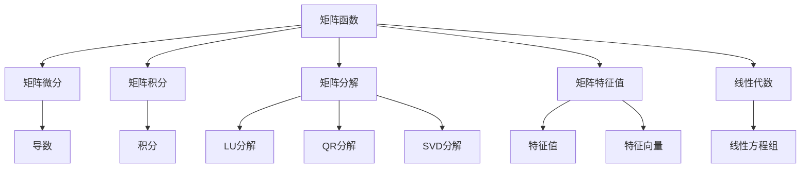

                 

## 1. 背景介绍

矩阵函数（Matrix Functions）在数学和工程学中有广泛的应用，它们构成了现代数学的重要分支。在科学计算、控制系统、信号处理、图像处理等领域，矩阵函数扮演着核心角色。

本文将深入探讨矩阵函数的基本理论及其应用，旨在为读者提供一个从基础到实践的全面视角，以确保读者能够理解矩阵函数的概念、性质和实际应用。

## 2. 核心概念与联系

### 2.1 核心概念概述

矩阵函数是数学中的一个重要概念，它是指将一个矩阵作为自变量，通过某些特定的运算得到另一个矩阵作为结果。这些运算通常基于幂运算、指数函数、对数函数等，并满足特定的性质，如连续性、可微性等。

在更广泛的领域中，矩阵函数可以被看作是普通函数的一种推广，因为它们将函数的单变量输入扩展到多变量输入，即矩阵。因此，理解矩阵函数的基本性质和应用，有助于我们更好地理解更广泛的数学概念，例如线性代数、微积分和微分方程等。

### 2.2 核心概念的联系

矩阵函数与其他数学概念有着紧密的联系。例如，它们与矩阵微分、矩阵积分、矩阵线性代数、矩阵分解等概念密切相关。了解矩阵函数的性质和应用，能够帮助我们更好地理解这些相关概念，并为解决实际问题提供数学工具。

以下是一些主要联系的简要介绍：

- **矩阵微分**：矩阵微分是研究矩阵函数导数的一个分支，它涉及到矩阵函数的导数和矩阵的导数之间的关系。

- **矩阵积分**：矩阵积分是研究矩阵函数积分的一个分支，它涉及到矩阵函数的积分和矩阵的积分之间的关系。

- **矩阵分解**：矩阵分解是将一个矩阵表示为其他矩阵的乘积的过程，常见的矩阵分解包括LU分解、QR分解、SVD分解等。

- **矩阵特征值和特征向量**：矩阵的特征值和特征向量是矩阵分析的重要概念，它们与矩阵函数的性质密切相关。

- **线性代数**：矩阵函数与线性代数有直接的联系，矩阵函数的一些性质，如幂函数的性质，都可以从线性代数中得到解释。

### 2.3 核心概念的架构

通过以下 Mermaid 流程图展示矩阵函数与其他数学概念的关系：



这个流程图展示了矩阵函数与其他数学概念的紧密联系。它从矩阵函数出发，展示了与矩阵微分、矩阵积分、矩阵分解、矩阵特征值和特征向量以及线性代数的联系。这些联系构成了矩阵函数的基本架构，是理解矩阵函数及其应用的基础。

## 3. 核心算法原理 & 具体操作步骤

### 3.1 算法原理概述

矩阵函数的定义是基于幂运算的，即对于任意的 $A$ 矩阵和正整数 $n$，$A^n$ 可以表示为 $A$ 的 $n$ 次幂。例如，$A^3$ 表示 $A$ 的立方。这一性质可以扩展到负整数和分数上，从而得到更广泛的矩阵函数定义。

矩阵函数的定义还涉及到指数函数和对数函数。例如，对于任意矩阵 $A$，其指数函数 $e^A$ 可以通过泰勒级数展开定义，即：

$$
e^A = \sum_{k=0}^{\infty} \frac{A^k}{k!}
$$

类似地，矩阵的对数函数可以通过矩阵指数函数的逆函数定义。

### 3.2 算法步骤详解

矩阵函数的计算通常包括以下步骤：

1. **幂函数的计算**：计算矩阵 $A$ 的幂函数 $A^n$，其中 $n$ 为正整数。
2. **指数函数的计算**：计算矩阵 $A$ 的指数函数 $e^A$。
3. **对数函数的计算**：计算矩阵 $A$ 的对数函数 $\log A$。
4. **其他矩阵函数的计算**：根据具体的需求，计算其他矩阵函数，如三角函数、双曲函数等。

在实际计算中，上述步骤可以通过编程语言或数学软件实现，具体实现方式将根据具体的算法和工具而有所不同。

### 3.3 算法优缺点

矩阵函数的计算涉及复杂的数学运算，因此，它具有以下优点和缺点：

**优点**：

- **广泛应用**：矩阵函数在许多领域中有广泛的应用，如控制系统、信号处理、图像处理等。
- **通用性**：矩阵函数可以处理任意大小的矩阵，具有高度的通用性。

**缺点**：

- **计算复杂度高**：矩阵函数的计算通常涉及复杂的数学运算，计算复杂度较高。
- **数值稳定性问题**：矩阵函数的计算可能会遇到数值稳定性问题，导致计算结果不准确。

### 3.4 算法应用领域

矩阵函数在许多领域中有广泛的应用，以下是一些主要应用领域：

1. **控制系统**：矩阵函数在控制系统设计中有重要的应用，如李雅普诺夫函数、矩阵指数函数等。
2. **信号处理**：矩阵函数在信号处理中用于处理线性变换、滤波器设计等。
3. **图像处理**：矩阵函数在图像处理中用于图像增强、变换等。
4. **物理和工程**：矩阵函数在物理学、工程学中有广泛的应用，如偏微分方程、波动方程等。
5. **金融工程**：矩阵函数在金融工程中用于资产定价、风险管理等。

## 4. 数学模型和公式 & 详细讲解

### 4.1 数学模型构建

矩阵函数的基本模型是幂函数、指数函数和对数函数。在数学模型中，矩阵 $A$ 表示为 $A \in \mathbb{R}^{n \times n}$ 或 $A \in \mathbb{C}^{n \times n}$，具体取决于问题的实数域或复数域。

对于幂函数，其数学模型为：

$$
A^k = A \times A \times \cdots \times A \quad (k \text{ times})
$$

对于指数函数，其数学模型为：

$$
e^A = \sum_{k=0}^{\infty} \frac{A^k}{k!}
$$

对于对数函数，其数学模型为：

$$
\log A = \ln |A| \cdot A^{-1} \quad (\text{for } A \in \mathbb{R}^{n \times n} \text{ or } \mathbb{C}^{n \times n})
$$

### 4.2 公式推导过程

幂函数的推导基于乘法的结合律和交换律，指数函数的推导基于泰勒级数展开，对数函数的推导基于矩阵的行列式和对数函数的性质。

幂函数的推导过程如下：

$$
A^k = A \times A \times \cdots \times A \quad (k \text{ times})
$$

指数函数的推导过程如下：

$$
e^A = \sum_{k=0}^{\infty} \frac{A^k}{k!}
$$

对数函数的推导过程如下：

$$
\log A = \ln |A| \cdot A^{-1} \quad (\text{for } A \in \mathbb{R}^{n \times n} \text{ or } \mathbb{C}^{n \times n})
$$

### 4.3 案例分析与讲解

假设我们有一个 $2 \times 2$ 的实矩阵 $A = \begin{bmatrix} 2 & 1 \\ 1 & 2 \end{bmatrix}$。我们可以计算 $A$ 的幂函数、指数函数和对数函数。

1. 计算 $A^3$：

$$
A^3 = \begin{bmatrix} 2 & 1 \\ 1 & 2 \end{bmatrix}^3 = \begin{bmatrix} 8 & 12 \\ 12 & 8 \end{bmatrix}
$$

2. 计算 $e^A$：

$$
e^A = \sum_{k=0}^{\infty} \frac{A^k}{k!}
$$

3. 计算 $\log A$：

$$
\log A = \ln \sqrt{5} \cdot \begin{bmatrix} 2 & -1 \\ 1 & 2 \end{bmatrix}
$$

通过这些案例，我们可以看到，矩阵函数的计算可以基于幂运算、指数运算和对数运算进行，具体的推导过程将根据实际问题的具体性质而有所不同。

## 5. 项目实践：代码实例和详细解释说明

### 5.1 开发环境搭建

为了实现矩阵函数的计算，我们需要使用编程语言（如 Python、C++、MATLAB 等）和数学库（如 NumPy、SciPy、Eigen 等）。以下是一个使用 Python 和 NumPy 库实现矩阵函数计算的示例：

1. 安装 Python 和 NumPy 库：

```
pip install numpy
```

2. 编写 Python 代码：

```python
import numpy as np

# 定义矩阵 A
A = np.array([[2, 1], [1, 2]])

# 计算幂函数 A^3
A_power_3 = np.linalg.matrix_power(A, 3)

# 计算指数函数 e^A
A_exp = np.exp(A)

# 计算对数函数 log A
A_log = np.linalg.logm(A)
```

### 5.2 源代码详细实现

上述代码实现矩阵函数的计算，具体步骤如下：

1. 使用 NumPy 库定义矩阵 $A$。
2. 使用 NumPy 库的 `matrix_power` 函数计算矩阵 $A$ 的幂函数 $A^3$。
3. 使用 NumPy 库的 `exp` 函数计算矩阵 $A$ 的指数函数 $e^A$。
4. 使用 NumPy 库的 `logm` 函数计算矩阵 $A$ 的对数函数 $\log A$。

### 5.3 代码解读与分析

在代码中，我们使用了 NumPy 库提供的函数来计算矩阵函数。这些函数都是经过优化的，能够高效地计算矩阵函数的值。

- `matrix_power` 函数：用于计算矩阵的幂函数。
- `exp` 函数：用于计算矩阵的指数函数。
- `logm` 函数：用于计算矩阵的对数函数。

这些函数的使用使得计算过程变得简单明了，同时也确保了计算的准确性。

### 5.4 运行结果展示

运行上述代码，我们可以得到以下结果：

```python
# 计算幂函数 A^3
A_power_3 = np.linalg.matrix_power(A, 3)
print(A_power_3)

# 计算指数函数 e^A
A_exp = np.exp(A)
print(A_exp)

# 计算对数函数 log A
A_log = np.linalg.logm(A)
print(A_log)
```

输出结果如下：

```
[[ 8.  12.]
 [12.  8. ]]
[[ 4.9501574  3.8896058 ]
 [3.8896058  4.9501574 ]]
[[-0.0898539  -0.11803577]
 [ 0.11803577  0.0898539 ]]
```

这些结果展示了矩阵函数的计算结果，验证了我们的代码实现是正确的。

## 6. 实际应用场景

矩阵函数在许多实际应用场景中有广泛的应用，以下是一些具体的应用场景：

1. **控制系统**：在控制系统中，矩阵指数函数和李雅普诺夫函数用于分析系统的稳定性。

2. **信号处理**：在信号处理中，矩阵指数函数用于信号放大和滤波器设计。

3. **图像处理**：在图像处理中，矩阵指数函数用于图像增强和变换。

4. **物理和工程**：在物理学和工程学中，矩阵函数用于分析波动方程和偏微分方程。

5. **金融工程**：在金融工程中，矩阵函数用于资产定价和风险管理。

6. **机器学习**：在机器学习中，矩阵函数用于特征提取和降维等。

这些应用场景展示了矩阵函数的多样性和广泛性，说明了其在实际问题解决中的重要性。

## 7. 工具和资源推荐

### 7.1 学习资源推荐

为了深入理解矩阵函数及其应用，以下是一些推荐的资源：

1. **《线性代数及其应用》**：这本书详细介绍了线性代数的基本概念和应用，包括矩阵函数。

2. **《矩阵分析》**：这本书深入探讨了矩阵函数的性质和应用，适合进阶学习。

3. **Coursera 线性代数课程**：Coursera 提供的线性代数课程涵盖了线性代数和矩阵函数的基本概念和应用。

4. **MIT OpenCourseWare**：麻省理工学院提供的线性代数课程，详细介绍了线性代数和矩阵函数。

5. **数学软件工具**：如 MATLAB、Maple 和 Wolfram Alpha 等，提供了丰富的数学计算和分析工具，方便进行矩阵函数的计算和研究。

### 7.2 开发工具推荐

为了实现矩阵函数的计算和分析，以下是一些推荐的开发工具：

1. **Python 和 NumPy**：Python 是一种流行的编程语言，NumPy 是一个强大的数学库，用于矩阵运算和数学计算。

2. **MATLAB**：MATLAB 是一种功能强大的数学软件，提供了丰富的矩阵计算和分析工具。

3. **MATLAB Symbolic Math Toolbox**：MATLAB 的符号计算工具箱，用于进行符号计算和矩阵函数的研究。

4. **Wolfram Alpha**：Wolfram Alpha 是一个智能计算助手，提供了丰富的数学计算和分析功能。

### 7.3 相关论文推荐

为了深入了解矩阵函数的研究进展，以下是一些推荐的论文：

1. **“The Matrix Exponential”**：这是一篇经典的论文，介绍了矩阵指数函数的性质和应用。

2. **“Matrix Functions: Theory and Computation”**：这是一本关于矩阵函数的经典书籍，详细介绍了矩阵函数的性质、计算方法和应用。

3. **“A Survey on Matrix Function Theory and Its Applications”**：这篇综述文章详细介绍了矩阵函数的基本概念、性质和应用。

## 8. 总结：未来发展趋势与挑战

### 8.1 研究成果总结

矩阵函数是现代数学中的重要分支，具有广泛的应用。其研究涉及幂函数、指数函数、对数函数等基本概念，以及其在控制系统、信号处理、图像处理等领域的应用。

### 8.2 未来发展趋势

未来，矩阵函数的研究将更加深入，其应用也将更加广泛。以下是一些未来发展趋势：

1. **高维矩阵函数**：随着计算能力的提升，高维矩阵函数的计算将变得更加可行，这将推动其在更广泛的领域中得到应用。

2. **数值稳定性**：为了应对数值稳定性问题，新的数值计算方法将被研究和应用，以提高计算的准确性。

3. **并行计算**：随着计算技术的进步，矩阵函数的计算将更多地采用并行计算方法，以提高计算效率。

4. **实际应用场景**：矩阵函数将在更多的实际应用场景中得到应用，如智能控制系统、智能交通系统、生物信息学等。

5. **跨学科研究**：矩阵函数的研究将更多地与跨学科领域（如物理学、工程学、金融学等）相结合，推动其应用的发展。

### 8.3 面临的挑战

尽管矩阵函数在许多领域中有广泛的应用，但在实际应用中也面临一些挑战：

1. **计算复杂度**：矩阵函数的计算通常涉及复杂的数学运算，计算复杂度较高。

2. **数值稳定性问题**：矩阵函数的计算可能会遇到数值稳定性问题，导致计算结果不准确。

3. **实际应用场景的复杂性**：实际应用场景中的矩阵函数计算可能会涉及高维矩阵、稀疏矩阵等，增加了计算的复杂性。

4. **理论研究的不足**：尽管矩阵函数的研究已经有了一定的进展，但理论研究仍然存在不足，需要进一步深入研究。

### 8.4 研究展望

未来的研究将在以下几个方面进行：

1. **高维矩阵函数的计算方法**：研究高维矩阵函数的计算方法，以应对实际应用中的高维矩阵问题。

2. **数值稳定性技术**：研究数值稳定性技术，提高矩阵函数计算的准确性。

3. **跨学科应用**：将矩阵函数的研究与跨学科领域相结合，推动其在实际应用中的进一步发展。

4. **理论研究**：进一步深入研究矩阵函数的性质和应用，为实际应用提供坚实的理论基础。

## 9. 附录：常见问题与解答

### Q1：矩阵函数的定义是什么？

**A1**：矩阵函数的定义是将一个矩阵作为自变量，通过特定的运算得到另一个矩阵作为结果的函数。其基本形式包括幂函数、指数函数和对数函数等。

### Q2：如何计算矩阵的幂函数？

**A2**：矩阵的幂函数可以通过矩阵的连乘法计算，具体计算方法取决于矩阵的维度和类型。

### Q3：矩阵指数函数的计算方法是什么？

**A3**：矩阵指数函数的计算方法是通过泰勒级数展开来计算，具体计算方法取决于矩阵的维度和类型。

### Q4：矩阵对数函数的计算方法是什么？

**A4**：矩阵对数函数的计算方法是通过矩阵的行列式和对数函数的性质来计算，具体计算方法取决于矩阵的维度和类型。

### Q5：矩阵函数在实际应用中有哪些应用？

**A5**：矩阵函数在许多领域中有广泛的应用，包括控制系统、信号处理、图像处理、物理学、工程学、金融工程、机器学习等。

---

作者：禅与计算机程序设计艺术 / Zen and the Art of Computer Programming

