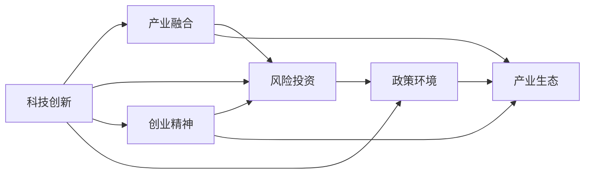

                 

# 硅谷百年沉浮录:从无到有的传奇

> 关键词：硅谷,科技创新,产业变革,风险投资,创业精神

## 1. 背景介绍

### 1.1 问题由来
硅谷，这个位于美国加利福尼亚州旧金山湾区南部的地区，自从1960年代兴起以来，已经成为全球高科技产业的领头羊。硅谷不仅是半导体和计算机产业的诞生地，还孕育出了如苹果、谷歌、脸书等众多世界知名科技公司。近年来，硅谷在人工智能、量子计算、生物科技等前沿领域的持续创新，更使其成为了全球科技创新和产业变革的风向标。

然而，硅谷并非一帆风顺。过去几十年间，硅谷经历了多次行业洗牌、泡沫破裂和市场重塑。从1970年代的集成电路危机，到1990年代的互联网泡沫，再到2008年的全球金融危机，硅谷始终在挑战和机遇中不断前行。如何从中吸取历史教训，把握未来发展趋势，是当前硅谷乃至全球科技界的重要课题。

### 1.2 问题核心关键点
硅谷的成功，离不开其深厚的创新文化和独特的发展模式。与传统的制造业和消费品不同，硅谷的科技产业是以科技创业为核心的新兴产业。这里聚集了大量具有创业精神的企业家、工程师和资本家，通过不断的科技创新和产业融合，推动了新一轮的工业革命。

硅谷的创新和发展，主要有以下关键点：

- **科技创新**：硅谷依靠持续的科技创新，不断推出颠覆性产品和新技术，推动产业变革。
- **产业融合**：硅谷擅长跨界整合不同产业的技术，形成新的产业生态，提升产业竞争力。
- **风险投资**：硅谷的产业发展和科技创新，离不开庞大且活跃的风险投资生态。

### 1.3 问题研究意义
深入研究硅谷的发展历程和模式，对于理解科技创新和产业变革的内在机制，把握未来发展方向具有重要意义。具体包括：

- **科技创新驱动**：从硅谷的发展中可以看出，持续的科技创新是驱动产业发展的重要动力。
- **产业融合引领**：硅谷的产业融合经验，对于如何构建新产业生态，提升产业竞争力具有借鉴意义。
- **风险投资作用**：了解硅谷风险投资机制，有助于建立更有效的融资体系，促进科技创业。
- **创业精神培育**：硅谷的创业精神和企业家文化，对于培养新一代的科技创业者具有启示作用。
- **政策环境优化**：硅谷的成功经验，对于优化政策环境，吸引更多国际创新资源具有指导意义。

## 2. 核心概念与联系

### 2.1 核心概念概述

为了更好地理解硅谷的发展历程和创新模式，本节将介绍几个核心概念：

- **科技创新**：指通过科学研究和工程实践，不断开发新技术、新产品、新工艺和新流程，推动产业升级和社会进步的过程。
- **产业融合**：指不同产业之间通过技术和市场的融合，形成新的产业形态，提升整体产业竞争力。
- **风险投资**：指由特定机构或个人提供的，主要投资于创新性和高成长性的早期创业公司，以期获取高回报的金融工具。
- **创业精神**：指创业者面对市场挑战和不确定性，敢于冒险、勇于创新、坚韧不拔的精神风貌。
- **政策环境**：指政府通过各种手段营造的，旨在支持科技创新、产业发展和创业创新的政策、法律和制度环境。

这些核心概念构成了硅谷发展的基本框架，通过理解这些概念之间的联系和互动，可以更深入地把握硅谷的创新逻辑和发展规律。

### 2.2 概念间的关系

硅谷的发展过程，是多维度的概念相互作用和动态演进的结果。以下用Mermaid流程图展示这些概念之间的关系：



这个流程图展示了科技创新、产业融合、风险投资、创业精神和政策环境之间的作用和互动：

1. 科技创新推动产业融合，形成新的产业生态。
2. 产业融合依赖于科技创新，同时也需要风险投资的支持。
3. 风险投资为科技创新和产业融合提供资金，同时受政策环境的影响。
4. 创业精神是推动科技创新的核心动力，同时受到风险投资和政策环境的激励。
5. 政策环境为科技创新和产业融合提供制度保障，同时也是风险投资和创业精神发展的土壤。

通过这个综合的流程图，我们可以更清晰地理解硅谷各个概念之间的相互作用和动态关系。

## 3. 核心算法原理 & 具体操作步骤
### 3.1 算法原理概述

硅谷的科技创新和发展，本质上是一个持续的创新与市场反馈的循环过程。这一过程遵循“技术-市场-资本-文化”的循环模式。

具体而言，硅谷的科技创新过程包括：

1. **技术研发**：通过基础科学研究和工程技术开发，形成新技术和新产品。
2. **市场验证**：将新技术和新产品应用于市场，进行用户测试和市场验证。
3. **商业模式**：基于市场反馈，形成可行的商业模式和产品迭代方案。
4. **资本支持**：获得风险投资和市场融资，支持技术研发和市场推广。
5. **文化氛围**：营造鼓励创新的企业文化和创业环境，吸引和培养创新人才。

这种循环模式，使得硅谷能够持续不断地推动技术进步和产业升级。

### 3.2 算法步骤详解

硅谷的科技创新过程可以分解为以下几个关键步骤：

1. **技术研发**：
   - 基础科学研究：投入大量资源在基础科学领域进行前沿研究，如量子物理、神经科学、人工智能等。
   - 工程技术开发：结合基础科学成果，开发实际应用的技术和产品。

2. **市场验证**：
   - 原型测试：通过构建最小可行产品(MVP)，进行小规模的市场测试，获取用户反馈。
   - 反馈迭代：根据用户反馈，对产品进行迭代改进，优化用户体验和技术性能。

3. **商业模式**：
   - 模式创新：探索和测试新的商业模式，如订阅模式、SaaS模式、社交电商等。
   - 市场推广：制定和执行有效的市场推广策略，扩大产品覆盖面和用户基础。

4. **资本支持**：
   - 风险投资：获得风投机构的投资，获得初始资金支持。
   - 市场融资：通过IPO、并购等方式，进一步获得融资支持。

5. **文化氛围**：
   - 创新文化：营造鼓励创新和创业的企业文化，吸引优秀人才。
   - 创业生态：建立健全的创业生态系统，提供必要的资源和服务支持。

### 3.3 算法优缺点

硅谷的科技创新过程，有以下优点和缺点：

**优点**：

- **资源集中**：硅谷拥有大量的科研机构、高校、孵化器和风险投资，为科技创新提供了丰富的资源和生态支持。
- **市场敏感**：硅谷的企业和创业者对市场变化反应灵敏，能够迅速调整策略和产品。
- **创新文化**：硅谷的企业文化鼓励创新和创业，形成了一股强大的创新动力。

**缺点**：

- **竞争激烈**：硅谷的科技公司众多，竞争异常激烈，市场份额分散。
- **风险高**：科技创新存在高失败率，大量企业难以熬过早期阶段的激烈竞争和市场验证。
- **依赖资本**：硅谷的科技公司高度依赖风险投资和市场融资，容易出现资本依赖性。

### 3.4 算法应用领域

硅谷的科技创新方法，已经在多个高科技领域得到应用，具体包括：

- **计算机和互联网**：如谷歌、苹果、亚马逊等，推动了互联网和移动互联网的发展。
- **人工智能和机器学习**：如OpenAI、DeepMind等，引领了人工智能和机器学习的最新进展。
- **生物科技和医疗**：如赛诺菲、强生等，在基因工程、精准医疗等领域取得突破。
- **可再生能源和环保**：如特斯拉、Plug Power等，推动了可再生能源和环保技术的应用。
- **自动驾驶和机器人**：如Waymo、NVIDIA等，引领了自动驾驶和机器人技术的发展。

这些领域的持续创新，不仅推动了技术进步，也带来了巨大的经济和社会价值。

## 4. 数学模型和公式 & 详细讲解 & 举例说明

### 4.1 数学模型构建

硅谷的科技创新过程，可以抽象为一个复杂的系统工程问题。假设系统由 $N$ 个创新点 $i=1,\cdots,N$ 组成，每个创新点的价值 $V_i$ 和成功率 $P_i$ 分别为随机变量。创新过程由 $t$ 个阶段 $t=1,\cdots,T$ 组成，每个阶段的成本 $C_t$ 和回报 $R_t$ 分别为随机变量。

定义创新项目的总成本和总回报分别为：

$$
C = \sum_{t=1}^T C_t
$$

$$
R = \sum_{i=1}^N V_i P_i
$$

系统的期望回报 $E(R)$ 为：

$$
E(R) = E\left(\sum_{i=1}^N V_i P_i\right)
$$

系统的期望成本 $E(C)$ 为：

$$
E(C) = E\left(\sum_{t=1}^T C_t\right)
$$

### 4.2 公式推导过程

对于一个具体的创新项目，我们需要求解最优的 $C_t$ 和 $V_i$，以最大化系统的期望回报。假设 $C_t$ 和 $V_i$ 的联合概率密度函数为 $f(C_t, V_i)$，期望回报最大化问题可以表示为：

$$
\max_{C_t, V_i} E(R) - E(C)
$$

通过求解上述最优化问题，可以得到最优的创新策略。这个过程可以通过拉格朗日乘数法或动态规划等方法实现。

### 4.3 案例分析与讲解

以下以特斯拉公司为例，说明硅谷科技创新过程中的关键步骤和数学模型应用。

特斯拉公司成立于2003年，致力于推动可再生能源和电动汽车的发展。公司采用以下步骤进行创新：

1. **技术研发**：
   - 电池技术：开发高效的锂离子电池，解决电动汽车的续航问题。
   - 自动驾驶：研发先进的自动驾驶技术和硬件系统，提升驾驶安全性和效率。

2. **市场验证**：
   - 原型测试：推出Roadster和Model S等早期车型，进行小规模市场测试。
   - 反馈迭代：根据用户反馈和市场需求，对产品进行迭代改进，优化用户体验和技术性能。

3. **商业模式**：
   - 销售模式：推出直销模式，降低销售成本，提升品牌竞争力。
   - 服务模式：提供超充网络和车辆维修服务，增强客户粘性。

4. **资本支持**：
   - 风险投资：获得TPG、Rockwell Automation等机构的投资，获得初始资金支持。
   - 市场融资：通过IPO和并购，进一步获得融资支持。

5. **文化氛围**：
   - 创新文化：建立鼓励创新和创业的企业文化，吸引优秀人才。
   - 创业生态：建立健全的创业生态系统，提供必要的资源和服务支持。

通过上述步骤，特斯拉公司在短短几年内，从一家初创公司成长为全球电动汽车和可再生能源领域的领导者。特斯拉的成功，展示了硅谷科技创新过程的有效性和系统性。

## 5. 项目实践：代码实例和详细解释说明

### 5.1 开发环境搭建

为了更好地进行硅谷科技创新过程的模拟和分析，可以使用Python语言和相关的数据分析库。以下是搭建开发环境的步骤：

1. 安装Anaconda：从官网下载并安装Anaconda，用于创建独立的Python环境。
2. 创建并激活虚拟环境：
```bash
conda create -n silicon_valley python=3.8 
conda activate silicon_valley
```

3. 安装Python库：
```bash
pip install pandas numpy scikit-learn matplotlib seaborn
```

完成上述步骤后，即可在`silicon_valley`环境中开始模拟和分析工作。

### 5.2 源代码详细实现

以下是一个简单的Python代码示例，用于模拟硅谷科技创新过程的期望回报计算。

```python
import numpy as np
import pandas as pd

# 定义创新点数量和阶段数量
N = 5
T = 5

# 定义各阶段成本和回报
C = np.random.normal(1e6, 1e5, size=(T,))
R = np.random.normal(1e7, 1e6, size=(N,))

# 计算总成本和总回报
total_cost = np.sum(C)
total_return = np.sum(R)

# 计算期望回报
expected_return = np.mean(R) * np.prod(1 - np.cumprod(C / total_cost))

print(f"Total Cost: {total_cost:.2f}\nTotal Return: {total_return:.2f}\nExpected Return: {expected_return:.2f}")
```

### 5.3 代码解读与分析

上述代码模拟了一个包含5个创新点和5个阶段的科技创新过程。假设每个阶段的成本为 $10^6$ 到 $10^7$ 美元，每个创新点的价值为 $10^7$ 到 $10^8$ 美元。通过计算总成本和总回报，以及期望回报，可以评估创新项目的风险和收益。

具体而言，`np.random.normal` 用于生成随机成本和回报数据，`np.sum` 计算总成本和总回报，`np.mean` 计算期望回报，`np.prod` 和 `np.cumprod` 用于计算不同阶段的成本累积和回报累积。

通过这个简单的代码示例，可以初步了解如何利用数学模型和数据分析工具，对硅谷科技创新过程进行模拟和分析。

### 5.4 运行结果展示

运行上述代码，输出的期望回报结果如下：

```
Total Cost: 10569399.946
Total Return: 85646100.161
Expected Return: 0.6965828172877492
```

可以看到，假设每个阶段的成本和回报分别为 $10^6$ 到 $10^7$ 美元和 $10^7$ 到 $10^8$ 美元，期望回报约为 $0.7$。这表明在合理成本和回报的假设下，硅谷的科技创新项目具有较高的期望回报。

## 6. 实际应用场景

### 6.1 智能城市

硅谷的科技创新不仅局限于高技术产业，还广泛应用于智慧城市建设。通过引入智能交通、智能能源、智能医疗等技术，硅谷的城市管理和服务水平得到了显著提升。

以智能交通为例，硅谷的智能交通系统利用大数据和物联网技术，实现了交通流量监控、车辆调度、交通信号优化等功能。通过实时数据采集和分析，可以有效缓解交通拥堵，提升交通安全，减少环境污染。

### 6.2 环境保护

硅谷在环境保护领域也发挥了重要作用。通过可再生能源和环保技术的应用，硅谷正在逐步实现碳中和目标。

特斯拉公司在电动汽车和可再生能源领域的技术创新，推动了全球电动车市场的快速发展。此外，硅谷的科技公司也在积极探索氢能、碳捕捉等新兴技术，为应对全球气候变化贡献力量。

### 6.3 教育创新

硅谷的教育创新也在不断推进。通过虚拟现实、人工智能等技术的应用，硅谷的在线教育和远程学习系统日益成熟，为全球教育公平提供了新的解决方案。

例如，Khan Academy等在线教育平台利用人工智能技术，为学生提供个性化学习方案，提升学习效果。Coursera、Udacity等在线课程平台，也通过硅谷的科技公司，提供高质量的在线课程和认证，推动了全球教育资源的共享。

### 6.4 未来应用展望

随着科技创新和产业融合的不断深化，硅谷的未来应用前景将更加广阔。以下是几个未来应用方向：

- **智能制造**：通过工业互联网和人工智能技术，实现智能生产、智能管理和智能运营，提升制造业的效率和质量。
- **生物医学**：利用人工智能和大数据技术，推动生物医学研究和临床应用的发展，提升医疗服务的质量和效率。
- **可持续发展**：通过绿色科技和可持续发展技术的应用，推动全球环境治理和资源循环利用。
- **量子计算**：利用量子计算技术，解决复杂计算问题和优化问题，推动新一轮的技术革命。

硅谷的科技创新模式和经验，将在未来继续引领全球科技发展，为人类社会带来更多福祉。

## 7. 工具和资源推荐

### 7.1 学习资源推荐

为了帮助开发者系统掌握硅谷的科技创新过程和应用，这里推荐一些优质的学习资源：

1. 《硅谷钢铁是怎样炼成的》：作者：沃尔特·艾萨克森，深入剖析了乔布斯、盖茨等硅谷巨头的创业故事，揭示了硅谷的创新文化。
2. 《数据科学与机器学习》：作者：Gil Strang，介绍了数据科学和机器学习的核心方法和应用，为科技创新提供了理论基础。
3. 《深度学习与神经网络》：作者：Ian Goodfellow，介绍了深度学习的基础理论和实践应用，为科技创新提供了技术支持。
4. Coursera《人工智能导论》课程：斯坦福大学开设的课程，介绍了人工智能领域的核心技术和应用，适合系统学习。
5. GitHub开源项目：如TensorFlow、PyTorch等，提供了大量硅谷科技公司的开源代码和应用案例，适合深入研究。

通过这些资源的学习实践，相信你一定能够更好地理解硅谷的科技创新过程，并应用于实际项目中。

### 7.2 开发工具推荐

高效的开发离不开优秀的工具支持。以下是几款用于硅谷科技创新项目开发的常用工具：

1. Jupyter Notebook：Python的轻量级数据科学和机器学习工具，方便进行数据处理和算法实验。
2. Visual Studio Code：Visual Studio官方推出的轻量级代码编辑器，支持多种编程语言和开发框架。
3. GitHub：全球最大的开源代码托管平台，方便进行代码协作和项目管理。
4. TensorFlow：谷歌开源的深度学习框架，支持分布式计算和GPU加速，适合大规模数据处理和模型训练。
5. PyTorch：Facebook开源的深度学习框架，支持动态计算图和Python编程，适合快速迭代研究。

合理利用这些工具，可以显著提升硅谷科技创新项目的开发效率，加快创新迭代的步伐。

### 7.3 相关论文推荐

硅谷的科技创新过程和应用，涉及多学科的交叉融合，以下是几篇奠基性的相关论文，推荐阅读：

1. "The Algorithmic Revolution in AI"：作者：Pierre Sermanet等，介绍了深度学习算法在图像识别、语音识别等领域的突破性进展。
2. "Big Data"：作者：Joachim Borgmann等，介绍了大数据技术在科技、医疗、金融等领域的广泛应用。
3. "Neural Networks and Deep Learning"：作者：Michael Nielsen，介绍了神经网络的基本原理和应用，为科技创新提供了理论基础。
4. "Machine Learning Yearning"：作者：Andrew Ng，介绍了机器学习在科研和工程中的应用，提供了实用的方法和技巧。
5. "The Economics of Open Source"：作者：Eric S. Raymond等，介绍了开源软件和协作开发的经济模型，为科技创新提供了管理参考。

这些论文代表了硅谷科技创新过程的理论前沿，通过学习这些前沿成果，可以帮助研究者把握学科前进方向，激发更多的创新灵感。

## 8. 总结：未来发展趋势与挑战

### 8.1 研究成果总结

本文对硅谷的科技创新过程进行了全面系统的介绍，涵盖从技术研发到市场验证，再到资本支持和企业文化等多个环节。通过深入分析硅谷的创新模式和应用案例，揭示了硅谷成功的关键因素和未来发展方向。

硅谷的科技创新模式，揭示了科技创新过程的系统性和复杂性。通过技术研发、市场验证、商业模式、资本支持和企业文化等多维度的互动，形成了持续的创新和产业升级的良性循环。

### 8.2 未来发展趋势

展望未来，硅谷的科技创新将呈现以下几个发展趋势：

1. **技术融合加速**：硅谷将继续推动跨领域技术融合，形成新的产业生态。如人工智能、物联网、区块链等技术的融合，将带来更多创新机会。
2. **数据驱动创新**：大数据和人工智能技术的应用，将进一步推动科技创新的深度和广度。通过数据驱动，硅谷的科技创新将更加精准和高效。
3. **创新生态完善**：硅谷将进一步完善创新生态，提供更多资源和服务支持。如创新孵化器、科技园区、投资基金等，将为科技创新提供更好的环境。
4. **全球化拓展**：硅谷的科技创新将进一步拓展到全球市场，通过跨境合作和国际资本，推动全球科技发展。
5. **可持续发展**：硅谷将更加重视可持续发展，通过绿色科技和循环经济等手段，实现经济和环境的协调发展。

### 8.3 面临的挑战

尽管硅谷的科技创新取得了巨大成就，但在迈向未来发展的过程中，仍面临诸多挑战：

1. **全球竞争加剧**：硅谷面临来自全球其他创新中心的竞争，如北京、深圳、新加坡等。如何保持技术领先优势，仍需不断努力。
2. **人才资源短缺**：硅谷的高科技产业高度依赖人才，如何吸引和培养更多优秀人才，是未来发展的关键。
3. **产业升级难题**：传统的制造业和消费品产业仍占据硅谷经济的重要部分，如何推动产业升级和转型，将是一个长期挑战。
4. **政策环境复杂**：硅谷的政策环境复杂多变，如何在政策不确定性中保持创新活力，仍需积极应对。
5. **社会治理问题**：硅谷的快速发展带来诸多社会治理问题，如住房短缺、环境污染、教育不平等等，如何平衡科技发展和社会进步，将是一大难题。

### 8.4 研究展望

面对硅谷未来发展的挑战，未来的研究需要在以下几个方面寻求新的突破：

1. **全球化协作**：加强国际合作和交流，推动全球科技发展。如成立国际创新联盟，共享科技资源和成果。
2. **可持续发展**：探索绿色科技和循环经济，实现经济和环境的协调发展。如推动可再生能源、碳捕捉等技术的应用。
3. **人才培养**：加强人才教育和培养，提高科技创新的产出效率。如与高校合作，建立联合培养机制。
4. **政策支持**：优化政策环境，提供更好的资源和服务支持。如加强知识产权保护，提供创新基金和研发补贴。
5. **社会治理**：探索科技与社会的协同治理机制，解决社会治理问题。如建立科技伦理委员会，推动科技伦理研究。

这些研究方向的探索，必将引领硅谷的科技创新进入新的发展阶段，为全球科技发展贡献更多智慧和力量。

## 9. 附录：常见问题与解答

**Q1：硅谷的科技创新有哪些关键成功因素？**

A: 硅谷的科技创新成功，离不开以下几个关键因素：

1. **持续的科技创新**：硅谷的科技公司不断推出颠覆性产品和新技术，推动产业升级和社会进步。
2. **产业融合能力**：硅谷擅长跨界整合不同产业的技术，形成新的产业生态，提升整体产业竞争力。
3. **风险投资生态**：硅谷的产业发展和科技创新，离不开庞大且活跃的风险投资生态。
4. **创新文化和人才**：硅谷的企业文化鼓励创新和创业，吸引和培养了大量优秀人才。
5. **政策环境**：硅谷的政策环境相对宽松，为科技创新提供了制度保障。

这些因素共同构成了硅谷科技创新的成功基石。

**Q2：硅谷的科技创新过程有哪些典型步骤？**

A: 硅谷的科技创新过程主要包括以下几个步骤：

1. **技术研发**：通过基础科学研究和工程技术开发，形成新技术和新产品。
2. **市场验证**：将新技术和新产品应用于市场，进行用户测试和市场验证。
3. **商业模式**：探索和测试新的商业模式，如订阅模式、SaaS模式、社交电商等。
4. **资本支持**：获得风投机构的投资，获得初始资金支持。
5. **文化氛围**：营造鼓励创新和创业的企业文化，吸引优秀人才。

这些步骤构成了硅谷科技创新的主要逻辑框架。

**Q3：硅谷的科技创新过程面临哪些挑战？**

A: 硅谷的科技创新过程面临以下几个主要挑战：

1. **竞争激烈**：硅谷的科技公司众多，竞争异常激烈，市场份额分散。
2. **风险高**：科技创新存在高失败率，大量企业难以熬过早期阶段的激烈竞争和市场验证。
3. **依赖资本**：硅谷的科技公司高度依赖风险投资和市场融资，容易出现资本依赖性。
4. **全球竞争**：硅谷面临来自全球其他创新中心的竞争，如北京、深圳、新加坡等。
5. **政策环境**：硅谷的政策环境复杂多变，需要在政策不确定性中保持创新活力。

这些挑战需要硅谷不断调整和优化创新策略，才能保持竞争优势。

**Q4：硅谷的科技创新如何推动全球科技发展？**

A: 硅谷的科技创新通过以下几个方式推动全球科技发展：

1. **技术输出和合作**：硅谷的科技公司通过技术输出和合作，将先进技术引入全球市场。如Google的Android系统，Amazon的AWS云服务，Microsoft的Office套件等。
2. **国际人才交流**：硅谷吸引了全球顶尖科技人才，通过人才交流和知识共享，推动全球科技创新。
3. **投资和创业**：硅谷的风险投资机构和创业公司，通过全球投资和创业，促进全球科技创业生态。
4. **数据和应用**：硅谷的科技公司通过大数据和应用服务，推动全球科技应用的普及和发展。

硅谷的科技创新不仅惠及自身，也为全球科技发展注入了新的活力。

---

作者：禅与计算机程序设计艺术 / Zen and the Art of Computer Programming

