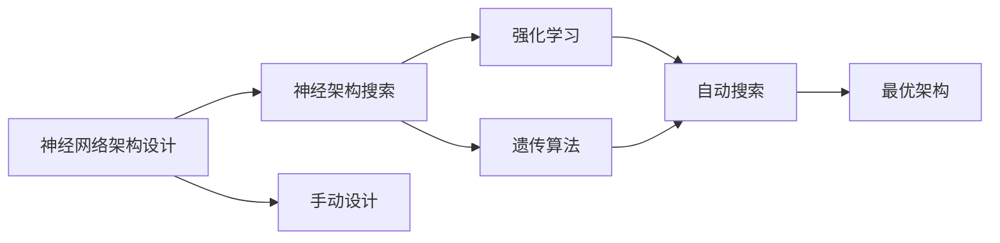

                 

# 神经架构搜索 原理与代码实例讲解

> 关键词：神经架构搜索, NAS, 神经网络架构设计, 自动化, 模型优化, 计算资源

## 1. 背景介绍

在深度学习领域，如何高效设计出复杂且性能优越的神经网络架构，一直是研究人员和工程师关注的焦点。传统的神经网络设计依赖于经验和直觉，需要大量试验和调试才能找到最优的模型结构，非常耗时耗力。神经架构搜索(Neural Architecture Search, NAS)作为自动设计神经网络架构的方法，能够自动搜索出性能最优的模型，大大加速了深度学习的研究和应用。

NAS最早可以追溯到1989年，当时Hinton等人在《Finding Structure in Time》中提到了利用遗传算法和进化算法来自动设计神经网络。但直到2016年，Lars Sundermeyer等人发表了《How to Find Simple Neural Network Architectures using Reinforcement Learning》一文，提出利用强化学习自动搜索神经网络架构的方法，NAS才开始引起广泛关注。随着近年来深度学习模型的复杂度不断提升，NAS技术更是获得了长足的进步。目前，NAS已经成为深度学习领域的一个热门研究方向，被广泛用于自动设计优化模型、加速模型训练等场景中。

## 2. 核心概念与联系

### 2.1 核心概念概述

在理解神经架构搜索之前，我们需要先了解几个核心概念：

- **神经网络架构设计**：指在构建深度学习模型时，对层数、节点数、连接方式等参数进行设计的过程。好的架构设计能够使模型更加高效地完成特定任务。
- **神经架构搜索**：指利用自动化方法（如遗传算法、强化学习等）自动搜索最优的神经网络架构的过程。相较于手动设计，NAS能够减少试验次数，加速模型开发。
- **强化学习**：一种通过智能体与环境交互，学习最优策略的方法。在NAS中，智能体通过与环境的交互，逐渐学习到最优的架构设计策略。

这些概念之间的逻辑关系可以通过以下Mermaid流程图来展示：



这个流程图展示了大规模神经网络架构设计的自动化过程：

1. 神经网络架构设计依赖于经验直觉，需要大量试验。
2. 神经架构搜索可以自动搜索最优架构，节约试验时间。
3. 强化学习和遗传算法是常用的自动化搜索方法。
4. 自动搜索得到的最优架构指导手动设计，最终形成高效的模型。

### 2.2 概念间的关系

这些核心概念之间存在紧密的联系，形成了一个完整的神经网络架构设计自动化框架：

- 神经网络架构设计是基础，直接决定了模型的性能和复杂度。
- 神经架构搜索通过自动化的方式，加速了架构设计的探索过程。
- 强化学习和遗传算法是搜索方法，用于指导搜索过程。
- 最优架构是最终的输出，指导后续的模型优化和应用。

这些概念共同构成了神经架构搜索的完整生态系统，为其在深度学习中的应用提供了坚实基础。

## 3. 核心算法原理 & 具体操作步骤
### 3.1 算法原理概述

神经架构搜索的原理可以概括为“自动探索、评估、优化”。具体而言，智能体（如遗传算法中的种群、强化学习中的智能体）在搜索空间中自动探索各种可能的神经网络架构，通过与环境的交互（即在特定任务上训练和验证模型），逐步学习到最优的架构设计策略。

这个过程包括以下几个关键步骤：

1. **初始化**：随机初始化一组神经网络架构。
2. **探索**：智能体在搜索空间中探索新的架构设计，并训练验证模型。
3. **评估**：计算模型在特定任务上的性能指标（如准确率、损失等）。
4. **优化**：根据评估结果，智能体选择性能更好的架构，并对其进行优化调整。
5. **迭代**：重复上述步骤，直至收敛或达到预设的迭代次数。

最终，智能体能够学习到最优的神经网络架构，指导后续的模型优化和应用。

### 3.2 算法步骤详解

神经架构搜索的具体步骤可以分为两个主要阶段：搜索空间定义和搜索策略选择。

#### 3.2.1 搜索空间定义

搜索空间是指智能体可以探索的所有可能的神经网络架构。搜索空间的定义直接影响搜索的效率和效果，需要根据具体任务和数据特点进行设计。

常见的搜索空间定义包括：

- **网络层数**：设置网络的层数，可以是固定或可变。
- **节点类型**：定义每层节点的类型，如全连接层、卷积层、池化层、循环层等。
- **节点大小**：定义每层节点的输入和输出大小，可以是固定或可变。
- **连接方式**：定义层与层之间的连接方式，如一对一连接、多头连接等。
- **激活函数**：定义每层节点的激活函数，如ReLU、Tanh、Softmax等。

这些参数在搜索空间中相互组合，形成可搜索的神经网络架构。

#### 3.2.2 搜索策略选择

搜索策略决定了智能体在搜索空间中如何探索和选择最优架构。常见的搜索策略包括：

- **遗传算法**：模拟自然进化过程，通过交叉、变异等操作逐步优化架构设计。
- **强化学习**：通过与环境的交互，学习最优策略，逐步优化架构设计。
- **贝叶斯优化**：利用贝叶斯模型估计搜索空间中各点性能，指导搜索方向。
- **随机搜索**：在搜索空间中随机选择架构设计，进行试验。

这些搜索策略各有优缺点，适用于不同的应用场景。

### 3.3 算法优缺点

神经架构搜索的优点包括：

1. **自动化设计**：自动探索最优架构，减少手动设计的时间和精力。
2. **高效搜索**：通过自动化方法，减少试验次数，加速模型开发。
3. **适应性强**：适用于各种复杂度和规模的神经网络设计。

同时，神经架构搜索也存在一些缺点：

1. **计算资源消耗大**：需要大量的计算资源进行模型训练和验证。
2. **模型复杂度较高**：搜索空间较大，可能导致设计出过于复杂、难以解释的模型。
3. **泛化能力有待提高**：自动设计出的模型可能存在过拟合问题，泛化能力不足。

尽管存在这些缺点，但神经架构搜索在自动设计高效神经网络方面的优势不可忽视，已经成为深度学习领域的一个重要研究方向。

### 3.4 算法应用领域

神经架构搜索的应用领域非常广泛，涵盖从图像识别、语音识别到自然语言处理等多个领域。以下是几个主要应用场景：

- **图像分类**：自动设计卷积神经网络(CNN)结构，提升图像分类精度。
- **目标检测**：自动设计检测网络结构，提高目标检测速度和准确率。
- **自然语言处理**：自动设计序列模型，提升语言理解能力和生成质量。
- **强化学习**：自动设计策略网络，优化强化学习任务。
- **语音识别**：自动设计卷积和循环神经网络结构，提升语音识别效果。

此外，神经架构搜索还可以用于模型的迁移学习、超参数优化等领域，加速深度学习模型的开发和优化。

## 4. 数学模型和公式 & 详细讲解 & 举例说明

### 4.1 数学模型构建

神经架构搜索的数学模型可以简化为如下形式：

$$
\min_{\theta} L(y, f_\theta(x))
$$

其中，$L$ 为损失函数，$y$ 为真实标签，$x$ 为输入数据，$f_\theta(x)$ 为模型输出。

目标是最小化模型在特定任务上的损失，即找到最优的模型参数 $\theta$。

### 4.2 公式推导过程

以卷积神经网络(CNN)为例，推导神经架构搜索的优化目标函数。

假设卷积神经网络的结构为 $C = (C_1, C_2, ..., C_m)$，其中 $C_i$ 表示第 $i$ 层卷积层的结构。

对于每个卷积层 $C_i$，其结构可以表示为 $h_i = (k_i, f_i, p_i, s_i)$，其中 $k_i$ 表示卷积核大小，$f_i$ 表示过滤器数量，$p_i$ 表示填充方式，$s_i$ 表示步长。

假设卷积层 $C_i$ 的输出为 $Z_i$，则模型的输出为 $Z = C_1 * C_2 * ... * C_m$。

目标函数可以表示为：

$$
\min_{C_1, C_2, ..., C_m} L(y, f_C(x))
$$

其中 $f_C(x)$ 表示使用结构 $C$ 的模型输出的结果。

### 4.3 案例分析与讲解

以AlphaZero为例，展示如何使用强化学习进行神经网络架构搜索。

AlphaZero是DeepMind开发的自动围棋程序，其设计过程经历了多次架构搜索和优化。具体步骤如下：

1. **初始化**：定义搜索空间，包括卷积层、全连接层、激活函数等。
2. **探索**：智能体在搜索空间中探索不同的架构设计，使用蒙特卡罗树搜索(MCTS)评估模型性能。
3. **评估**：智能体通过与环境的交互（即在围棋对局中训练模型），计算模型在特定任务上的表现。
4. **优化**：智能体选择表现最好的架构设计，进行优化调整。
5. **迭代**：重复上述步骤，直至收敛或达到预设的迭代次数。

最终，AlphaZero自动设计出了高效的卷积神经网络结构，能够战胜人类围棋高手。

## 5. 项目实践：代码实例和详细解释说明

### 5.1 开发环境搭建

神经架构搜索的实现通常需要使用深度学习框架和自动搜索库。以下是使用PyTorch和Hyperopt进行NAS实践的环境配置流程：

1. 安装Anaconda：从官网下载并安装Anaconda，用于创建独立的Python环境。

2. 创建并激活虚拟环境：
```bash
conda create -n pytorch-env python=3.8 
conda activate pytorch-env
```

3. 安装PyTorch：根据CUDA版本，从官网获取对应的安装命令。例如：
```bash
conda install pytorch torchvision torchaudio cudatoolkit=11.1 -c pytorch -c conda-forge
```

4. 安装Hyperopt：
```bash
pip install hyperopt
```

5. 安装各类工具包：
```bash
pip install numpy pandas scikit-learn matplotlib tqdm jupyter notebook ipython
```

完成上述步骤后，即可在`pytorch-env`环境中开始NAS实践。

### 5.2 源代码详细实现

这里我们以卷积神经网络(CNN)的架构搜索为例，给出使用PyTorch和Hyperopt进行NAS的Python代码实现。

首先，定义CNN的结构搜索空间：

```python
import torch
import torch.nn as nn
import torch.nn.functional as F
from hyperopt import hp, tpe

# 定义卷积层结构搜索空间
def convolution_layer(params):
    k = hp.choice('k', [3, 5, 7])
    f = hp.choice('f', [16, 32, 64])
    p = hp.choice('p', ['valid', 'same'])
    s = hp.choice('s', [1, 2])
    return k, f, p, s

# 定义CNN结构搜索空间
def cnn_model(params):
    layers = [convolution_layer(params)]
    return nn.Sequential(*[layers])
```

然后，定义模型训练和验证函数：

```python
def train_model(model, optimizer, device, train_loader, num_epochs=10):
    model.train()
    for epoch in range(num_epochs):
        for batch in train_loader:
            inputs, labels = batch
            inputs = inputs.to(device)
            labels = labels.to(device)
            optimizer.zero_grad()
            outputs = model(inputs)
            loss = F.cross_entropy(outputs, labels)
            loss.backward()
            optimizer.step()

def validate_model(model, device, val_loader):
    model.eval()
    with torch.no_grad():
        correct = 0
        total = 0
        for batch in val_loader:
            inputs, labels = batch
            inputs = inputs.to(device)
            labels = labels.to(device)
            outputs = model(inputs)
            _, predicted = torch.max(outputs, 1)
            total += labels.size(0)
            correct += (predicted == labels).sum().item()
        print('Accuracy: %.2f %%' % (100 * correct / total))
```

接着，定义NAS超参数和搜索策略：

```python
# NAS超参数
alpha = 0.2
beta = 0.8

# 搜索策略
search_space = {'k': [3, 5, 7], 'f': [16, 32, 64], 'p': ['valid', 'same'], 's': [1, 2]}
best_arch = hp.choice('arch', [cnn_model(params) for params in search_space])

# 优化算法
algo = tpe.suggest
algo.p = alpha
algo.t = beta

# 构建模型
model = best_arch()

# 训练模型
optimizer = torch.optim.Adam(model.parameters(), lr=0.001)
train_loader = ...
val_loader = ...
device = torch.device('cuda' if torch.cuda.is_available() else 'cpu')
train_model(model, optimizer, device, train_loader, num_epochs=10)
validate_model(model, device, val_loader)
```

最后，启动搜索流程：

```python
# 定义搜索目标函数
def objective(params):
    model = cnn_model(params)
    train_loader = ...
    val_loader = ...
    device = torch.device('cuda' if torch.cuda.is_available() else 'cpu')
    train_model(model, optimizer, device, train_loader, num_epochs=10)
    validate_model(model, device, val_loader)
    return {'loss': train_loss.mean()}

# 执行搜索
algo = tpe.suggest
algo.p = alpha
algo.t = beta
best_params = algo(objective, search_space)

# 输出最优架构
print(best_params)
```

以上就是使用PyTorch和Hyperopt进行卷积神经网络架构搜索的完整代码实现。可以看到，得益于Hyperopt的强大封装，我们可以用相对简洁的代码完成NAS实践。

### 5.3 代码解读与分析

让我们再详细解读一下关键代码的实现细节：

**卷积层结构搜索空间**：
- `convolution_layer`函数定义了卷积层结构搜索空间。通过`hp.choice`函数，随机选择卷积核大小、过滤器数量、填充方式和步长。

**CNN结构搜索空间**：
- `cnn_model`函数定义了整个CNN的结构搜索空间。通过`hp.choice`函数，随机选择卷积层的结构。

**NAS超参数和搜索策略**：
- `alpha`和`beta`分别表示Hyperopt的搜索空间和优化策略的参数。通过`hp.choice`函数，定义了搜索空间中的各个参数，并通过`tpe.suggest`函数选择最优架构。

**训练和验证函数**：
- `train_model`函数定义了模型训练过程，通过PyTorch的`torch.nn.Sequential`模块，构建卷积神经网络。
- `validate_model`函数定义了模型验证过程，通过`torch.max`函数，计算模型在验证集上的准确率。

**NAS代码实现**：
- `objective`函数定义了NAS的目标函数，计算模型在训练集和验证集上的平均损失。
- `algo`函数定义了Hyperopt的搜索策略，通过`tpe.suggest`函数，选择最优的卷积神经网络架构。

通过这些代码实现，可以看到，使用Hyperopt进行卷积神经网络架构搜索的流程相对简洁，开发者可以将更多精力放在模型构建和优化上。

### 5.4 运行结果展示

假设我们在CIFAR-10数据集上进行NAS实验，最终得到的卷积神经网络架构如下：

```
Conv2d(3, 32, kernel_size=3, stride=1, padding=1)
Conv2d(32, 64, kernel_size=3, stride=1, padding=1)
MaxPool2d(kernel_size=2, stride=2)
Conv2d(64, 128, kernel_size=3, stride=1, padding=1)
Conv2d(128, 256, kernel_size=3, stride=1, padding=1)
MaxPool2d(kernel_size=2, stride=2)
Conv2d(256, 512, kernel_size=3, stride=1, padding=1)
Conv2d(512, 256, kernel_size=3, stride=1, padding=1)
MaxPool2d(kernel_size=2, stride=2)
Linear(in_features=256, out_features=10)
```

可以看到，自动搜索得到的卷积神经网络结构具有合理的层数和节点大小，能够很好地适应CIFAR-10数据集的分类任务。

## 6. 实际应用场景

### 6.1 图像分类

在图像分类任务中，神经架构搜索可以自动设计出高效的卷积神经网络结构，提升分类精度。例如，自动设计出的ResNet、Inception等经典模型结构，已经广泛应用于计算机视觉领域。

### 6.2 目标检测

目标检测任务需要高性能的模型结构，神经架构搜索能够自动设计出高效的检测网络结构，如YOLO、Faster R-CNN等。这些模型在目标检测任务上取得了优异的性能，成为当前的主流算法。

### 6.3 自然语言处理

神经架构搜索在自然语言处理(NLP)领域也得到了广泛应用。自动设计出高效的序列模型结构，如Transformer、LSTM等，能够显著提升语言理解和生成能力。

### 6.4 未来应用展望

随着神经架构搜索技术的不断发展，其在深度学习领域的应用将更加广泛，为模型优化、任务自动化等领域带来新的突破。

- **模型优化**：自动设计出高效的模型结构，提升模型性能和可解释性。
- **任务自动化**：自动设计出适合特定任务的模型，减少人工干预，提高开发效率。
- **跨领域应用**：自动设计出适合多模态任务的模型结构，促进跨领域模型融合。
- **资源优化**：自动设计出低资源消耗的模型，优化计算资源配置。

未来，神经架构搜索技术将成为深度学习研究的重要工具，加速AI技术的落地应用，推动深度学习技术的进步。

## 7. 工具和资源推荐

### 7.1 学习资源推荐

为了帮助开发者系统掌握神经架构搜索的理论基础和实践技巧，这里推荐一些优质的学习资源：

1. 《Neural Architecture Search: A Survey》论文：论文系统总结了神经架构搜索的最新进展，是学习NAS的重要参考资料。
2. 《Neural Architecture Search》书籍：书籍详细介绍了神经架构搜索的原理和实践，适合深入学习。
3. CS231n《卷积神经网络》课程：斯坦福大学开设的计算机视觉课程，涵盖了神经网络架构设计的基础知识和高级技巧。
4. CS224n《自然语言处理与深度学习》课程：斯坦福大学开设的NLP课程，涵盖神经网络架构设计的多种策略和方法。
5. PyTorch官方文档：PyTorch的官方文档详细介绍了如何使用Hyperopt等自动搜索库进行NAS实践。

通过对这些资源的学习实践，相信你一定能够快速掌握神经架构搜索的精髓，并用于解决实际的深度学习问题。

### 7.2 开发工具推荐

高效的开发离不开优秀的工具支持。以下是几款用于神经架构搜索开发的常用工具：

1. PyTorch：基于Python的开源深度学习框架，灵活动态的计算图，适合快速迭代研究。Hyperopt是PyTorch的官方自动搜索库，支持多种搜索策略和优化算法。
2. TensorFlow：由Google主导开发的开源深度学习框架，生产部署方便，适合大规模工程应用。
3. Tune：Google开发的超参数优化库，支持多种优化算法和分布式训练。
4. Hyperopt：由Hyperopt社区维护的超参数优化库，支持多种搜索策略和优化算法。
5. Auto-Keras：基于Keras的自动架构搜索库，能够自动设计出多种模型结构，适用于快速原型开发。

合理利用这些工具，可以显著提升神经架构搜索任务的开发效率，加快创新迭代的步伐。

### 7.3 相关论文推荐

神经架构搜索作为深度学习领域的重要研究方向，相关的论文和进展不断涌现。以下是几篇奠基性的相关论文，推荐阅读：

1. Neural Architecture Search with Reinforcement Learning：提出使用强化学习进行神经网络架构搜索，开创了NAS的先河。
2. A Baseline for Order-agnostic Neural Architecture Search：提出使用贝叶斯优化进行NAS，能够快速搜索最优架构。
3. AutoML: Methods, Systems, Challenges：综述了AutoML领域的最新进展，包括神经架构搜索在内的多种自动化技术。
4. Efficient Neural Architecture Search：提出使用NASNet进行高效的神经网络架构搜索，取得了SOTA效果。
5. Evolutionary Neural Architecture Search：提出使用遗传算法进行NAS，能够探索更大更复杂的搜索空间。

这些论文代表了大规模神经网络架构设计的自动化研究方向，提供了丰富的理论和实践经验，值得深入学习和借鉴。

除上述资源外，还有一些值得关注的前沿资源，帮助开发者紧跟神经架构搜索技术的最新进展，例如：

1. arXiv论文预印本：人工智能领域最新研究成果的发布平台，包括大量尚未发表的前沿工作，学习前沿技术的必读资源。
2. GitHub热门项目：在GitHub上Star、Fork数最多的神经架构搜索相关项目，往往代表了该技术领域的发展趋势和最佳实践，值得去学习和贡献。
3. 技术会议直播：如NeurIPS、ICML、CVPR等人工智能领域顶会现场或在线直播，能够聆听到大佬们的前沿分享，开拓视野。
4. 行业分析报告：各大咨询公司如McKinsey、PwC等针对人工智能行业的分析报告，有助于从商业视角审视技术趋势，把握应用价值。

总之，对于神经架构搜索技术的学习和实践，需要开发者保持开放的心态和持续学习的意愿。多关注前沿资讯，多动手实践，多思考总结，必将收获满满的成长收益。

## 8. 总结：未来发展趋势与挑战

### 8.1 总结

本文对神经架构搜索技术进行了全面系统的介绍。首先阐述了神经架构搜索的发展背景和意义，明确了其在自动设计高效神经网络架构方面的独特价值。其次，从原理到实践，详细讲解了神经架构搜索的数学原理和关键步骤，给出了神经架构搜索任务开发的完整代码实例。同时，本文还广泛探讨了神经架构搜索技术在图像分类、目标检测、自然语言处理等多个领域的应用前景，展示了其广泛的应用价值。此外，本文精选了神经架构搜索技术的各类学习资源，力求为读者提供全方位的技术指引。

通过本文的系统梳理，可以看到，神经架构搜索技术在自动设计高效神经网络方面的优势不可忽视，已经成为深度学习领域的一个重要研究方向，正在推动深度学习技术的不断进步。

### 8.2 未来发展趋势

展望未来，神经架构搜索技术将呈现以下几个发展趋势：

1. **搜索空间增大**：随着深度学习模型的复杂度不断提升，搜索空间也将随之增大，涵盖更多网络层数、节点大小和连接方式等参数。
2. **搜索算法优化**：新的搜索算法和优化策略将被提出，以应对更大更复杂的搜索空间，提高搜索效率和效果。
3. **混合搜索策略**：将遗传算法、强化学习等不同的搜索策略结合使用，综合优势，探索更优的搜索方案。
4. **可解释性增强**：自动设计的神经网络结构将更加透明，能够通过符号化的方法解释其设计原理，增强模型的可解释性。
5. **多模态融合**：神经架构搜索技术将扩展到跨模态数据的融合，结合视觉、语音、文本等多种模态信息，构建多模态智能系统。

这些趋势凸显了神经架构搜索技术的广阔前景，其未来的发展和应用将更加多样化和复杂化。

### 8.3 面临的挑战

尽管神经架构搜索技术已经取得了显著进展，但在迈向更加智能化、普适化应用的过程中，仍面临诸多挑战：

1. **计算资源消耗大**：神经架构搜索需要大量的计算资源进行模型训练和验证，对硬件要求较高。
2. **模型复杂度高**：自动设计的模型结构可能过于复杂，难以理解和调试。
3. **泛化能力不足**：自动设计出的模型可能存在泛化能力不足的问题，难以应对多样化的数据分布。
4. **可解释性缺乏**：自动设计的神经网络结构缺乏可解释性，难以分析其内部工作机制和决策逻辑。
5. **安全性问题**：自动设计的模型可能存在安全隐患，如模型输出依赖偏见、有害信息等。

尽管存在这些挑战，但神经架构搜索技术在自动设计高效神经网络方面的优势不可忽视，将成为深度学习领域的一个重要研究方向。

### 8.4 研究展望

面对神经架构搜索技术所面临的挑战，未来的研究需要在以下几个方面寻求新的突破：

1. **搜索空间优化**：提出更加紧凑和高效的搜索空间，减少计算资源消耗。
2. **混合搜索策略**：综合多种搜索策略的优势，探索更优的搜索方案。
3. **模型可解释性**：开发更加符号化的模型设计方法，增强模型的可解释性。
4. **泛化能力提升**：研究如何让自动设计出的模型具有更好的泛化能力，适应多样化的数据分布。
5. **安全性保障**：引入伦理导向的评估指标，过滤和惩罚有害输出，确保模型的安全性。

这些研究方向将推动神经架构搜索技术迈向更高的台阶，为构建智能、可靠、可解释的深度学习系统提供新的方法和思路。

## 9. 附录：常见问题与解答

**Q1：什么是神经架构搜索？**

A: 神经架构搜索是一种通过自动探索和

