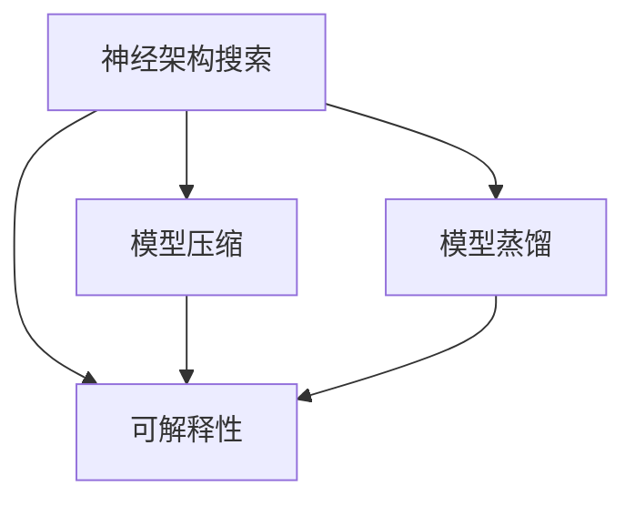
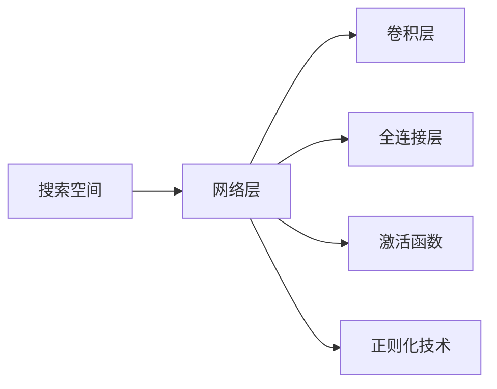
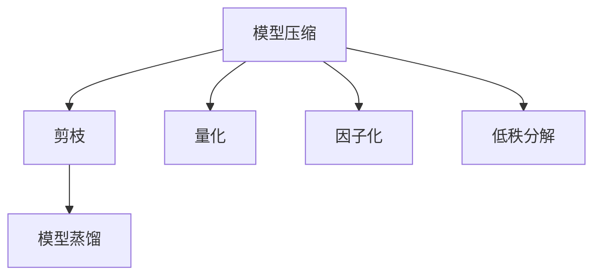
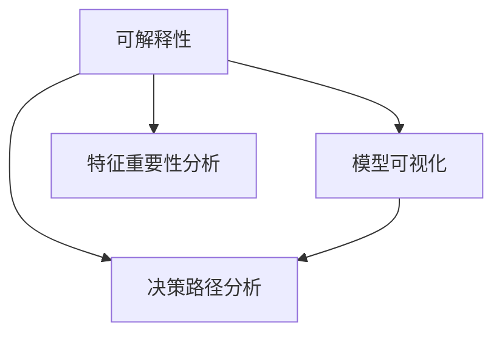

                 

# 神经架构搜索的可解释性研究

> 关键词：神经架构搜索,可解释性,模型压缩,超参数优化,模型蒸馏

## 1. 背景介绍

### 1.1 问题由来
随着深度学习技术的飞速发展，神经网络的结构和超参数调整已经成为了影响模型性能和泛化能力的重要因素。传统的手动调参方法耗时耗力，且效果有限。神经架构搜索(Neural Architecture Search, NAS)技术通过自动化的方法寻找最优的网络结构和超参数组合，大大提升了深度学习模型的设计和调优效率。

然而，尽管NAS技术在提升模型性能方面表现出色，其可解释性仍是一个显著的问题。由于NAS过程的复杂性和动态性，难以通过传统的黑盒优化方法进行解释。模型的"黑盒"特性不仅限制了其在某些领域的应用，也增加了模型维护和使用的风险。因此，提高NAS的可解释性，使其更加透明和可控，是当下的一个重要研究方向。

### 1.2 问题核心关键点
NAS的可解释性研究主要聚焦于以下几个方面：

- **模型结构可解释**：理解NAS寻找到的特定网络结构的设计原理和设计动因。
- **超参数优化可解释**：解释NAS过程中如何动态调整超参数，优化性能。
- **模型压缩可解释**：解释NAS如何进行模型压缩，减少模型大小和计算复杂度。
- **模型蒸馏可解释**：解释NAS如何进行模型蒸馏，知识转移和性能提升。
- **训练过程可解释**：解释NAS模型在训练过程中如何进行学习，以及其内部动态变化。

这些关键点共同构成了NAS可解释性的研究框架，旨在帮助研究者和开发者更好地理解、优化和应用NAS技术。

## 2. 核心概念与联系

### 2.1 核心概念概述

为了更好地理解NAS的可解释性，本节将介绍几个核心概念：

- **神经架构搜索(NAS)**：一种自动化设计神经网络结构和超参数的技术。通过搜索空间内的最优解，找到性能最优的模型。
- **模型压缩**：通过剪枝、量化、因子化等技术，减少模型大小和计算复杂度。
- **模型蒸馏**：通过知识转移，将大型复杂模型的知识压缩到小型简单模型中，提高模型泛化能力。
- **可解释性**：指模型的设计、优化和训练过程透明，可被人类理解。

这些概念之间存在密切联系，共同构成了NAS可解释性的研究框架。下面通过几个Mermaid流程图来展示这些概念之间的关系：



这个流程图展示了NAS过程中几个关键组件之间的关系：

1. 神经架构搜索寻找到最优模型结构。
2. 通过模型压缩技术，减少模型复杂度。
3. 通过模型蒸馏，提高模型泛化能力。
4. 结合可解释性技术，使模型设计和训练过程透明可控。

### 2.2 概念间的关系

这些核心概念之间存在着紧密的联系，形成了NAS可解释性的完整生态系统。下面我们通过几个Mermaid流程图来展示这些概念之间的关系。

#### 2.2.1 NAS的搜索空间



这个流程图展示了NAS搜索空间的基本组成，包括网络层、卷积层、全连接层、激活函数和正则化技术等基本组件。

#### 2.2.2 模型压缩与蒸馏



这个流程图展示了模型压缩和模型蒸馏的主要技术手段。

#### 2.2.3 可解释性



这个流程图展示了可解释性的几种关键技术手段。

## 3. 核心算法原理 & 具体操作步骤
### 3.1 算法原理概述

NAS的可解释性研究，其核心在于通过多种方法，使NAS过程的每个步骤都透明可控。具体来说，包括以下几个关键点：

1. **模型设计可解释**：理解NAS如何寻找最优网络结构，并解释其设计原理。
2. **超参数优化可解释**：解释NAS过程中如何动态调整超参数，优化性能。
3. **模型压缩可解释**：解释NAS如何进行模型压缩，减少模型大小和计算复杂度。
4. **模型蒸馏可解释**：解释NAS如何进行模型蒸馏，知识转移和性能提升。
5. **训练过程可解释**：解释NAS模型在训练过程中如何进行学习，以及其内部动态变化。

### 3.2 算法步骤详解

以下是NAS可解释性的详细步骤：

**Step 1: 构建NAS搜索空间**
- 定义网络层、卷积层、全连接层、激活函数、正则化技术等基本组件。
- 定义这些组件之间的连接方式，包括连接顺序、连接类型、通道数等。
- 定义超参数，如学习率、批量大小、正则化系数等。

**Step 2: 设计NAS优化算法**
- 设计NAS优化算法，如遗传算法、强化学习、贝叶斯优化等。
- 实现超参数搜索和网络结构搜索相结合的优化流程。
- 设置评估指标，如模型精度、泛化能力、计算复杂度等。

**Step 3: 模型压缩与蒸馏**
- 对NAS寻找到的模型进行剪枝、量化、因子化等操作，减少模型大小。
- 通过模型蒸馏，将大型模型的知识压缩到小型模型中，提高泛化能力。

**Step 4: 可解释性分析**
- 使用模型可视化、特征重要性分析、决策路径分析等技术手段，解释模型的结构和超参数设计。
- 分析模型训练过程中的动态变化，解释模型的学习过程和性能提升。

**Step 5: 应用部署**
- 将NAS模型部署到实际应用场景中。
- 在生产环境中持续监控模型性能，进行模型更新和优化。

### 3.3 算法优缺点

NAS的可解释性研究具有以下优点：

1. **透明性**：通过解释NAS的设计和优化过程，使模型更加透明，增强了模型的可信度。
2. **可控性**：理解和解释NAS的动态调整过程，可以更好地控制模型行为，减少不可预测的风险。
3. **可解释性技术丰富**：结合多种可解释性技术，使模型设计、优化和训练过程更加全面可控。

同时，也存在一些局限性：

1. **复杂性**：NAS过程的动态性和复杂性，增加了解释的难度。
2. **精度损失**：在模型压缩和蒸馏过程中，可能会损失一定的模型精度。
3. **依赖数据**：可解释性技术的有效应用，依赖于大量的标注数据和有效的评估指标。

尽管如此，通过提高NAS的可解释性，可以更好地理解和应用这一高效、先进的深度学习技术。

### 3.4 算法应用领域

NAS可解释性研究已经广泛应用于以下几个领域：

- **计算机视觉**：在图像分类、目标检测等任务中，NAS可解释性研究帮助理解模型设计原理，优化超参数设置。
- **自然语言处理**：在文本分类、序列标注等任务中，NAS可解释性研究提高模型设计和优化透明度，减少调参工作量。
- **语音识别**：在语音识别和生成等任务中，NAS可解释性研究指导模型结构设计，提升模型性能。
- **强化学习**：在强化学习任务中，NAS可解释性研究帮助理解模型动态优化过程，提升模型的泛化能力。

## 4. 数学模型和公式 & 详细讲解 & 举例说明
### 4.1 数学模型构建

NAS的可解释性研究，需要构建多个数学模型来描述其设计和优化过程。

1. **网络结构表示**：定义网络结构 $H$，包括网络层 $L$、卷积层 $C$、全连接层 $F$、激活函数 $A$ 和正则化技术 $R$。

2. **超参数表示**：定义超参数 $\alpha$，包括学习率 $\lambda$、批量大小 $B$、正则化系数 $\mu$ 等。

3. **优化目标**：定义优化目标 $T$，包括模型精度 $P$、泛化能力 $G$、计算复杂度 $C$ 等。

4. **模型压缩表示**：定义压缩后的模型 $H_c$，包括剪枝后的网络结构 $L_c$、量化后的参数 $\theta_c$ 和因子化后的张量 $T_c$。

5. **模型蒸馏表示**：定义蒸馏后的模型 $H_s$，包括蒸馏前模型 $H_t$、蒸馏后的模型 $H_r$ 和知识转移矩阵 $M$。

### 4.2 公式推导过程

以下是NAS可解释性的关键公式推导：

1. **网络结构表示**
   $$
   H = (L, C, F, A, R)
   $$

2. **超参数表示**
   $$
   \alpha = (\lambda, B, \mu)
   $$

3. **优化目标**
   $$
   T = P + G - C
   $$

4. **模型压缩表示**
   $$
   H_c = (L_c, \theta_c, T_c)
   $$

5. **模型蒸馏表示**
   $$
   H_s = (H_t, H_r, M)
   $$

### 4.3 案例分析与讲解

假设我们要设计一个用于图像分类的NAS模型，步骤如下：

**Step 1: 构建NAS搜索空间**

- 定义网络层 $L$，包括卷积层、池化层、全连接层等。
- 定义卷积层 $C$，包括卷积核大小、步幅、填充等。
- 定义全连接层 $F$，包括层数、通道数等。
- 定义激活函数 $A$，包括ReLU、Sigmoid等。
- 定义正则化技术 $R$，包括Dropout、L2正则等。

**Step 2: 设计NAS优化算法**

- 使用贝叶斯优化算法，搜索超参数 $\alpha$ 和网络结构 $H$。
- 设置评估指标 $T = P + G - C$，其中 $P$ 为模型精度，$G$ 为泛化能力，$C$ 为计算复杂度。

**Step 3: 模型压缩与蒸馏**

- 使用剪枝技术，去除冗余连接，得到压缩后的网络结构 $L_c$。
- 使用量化技术，将模型参数 $\theta$ 转换为整数表示，得到压缩后的参数 $\theta_c$。
- 使用因子化技术，将张量 $T$ 分解为低秩形式，得到压缩后的张量 $T_c$。
- 使用模型蒸馏技术，将大型模型 $H_t$ 的知识转移至小型模型 $H_r$，得到蒸馏后的模型 $H_s$。

**Step 4: 可解释性分析**

- 使用模型可视化技术，可视化网络结构和参数分布。
- 使用特征重要性分析技术，分析模型的特征重要性和激活分布。
- 使用决策路径分析技术，分析模型的决策路径和中间结果。

## 5. 项目实践：代码实例和详细解释说明
### 5.1 开发环境搭建

在进行NAS可解释性实践前，我们需要准备好开发环境。以下是使用Python进行PyTorch开发的环境配置流程：

1. 安装Anaconda：从官网下载并安装Anaconda，用于创建独立的Python环境。

2. 创建并激活虚拟环境：
```bash
conda create -n pytorch-env python=3.8 
conda activate pytorch-env
```

3. 安装PyTorch：根据CUDA版本，从官网获取对应的安装命令。例如：
```bash
conda install pytorch torchvision torchaudio cudatoolkit=11.1 -c pytorch -c conda-forge
```

4. 安装TensorBoard：
```bash
pip install tensorboard
```

5. 安装各类工具包：
```bash
pip install numpy pandas scikit-learn matplotlib tqdm jupyter notebook ipython
```

完成上述步骤后，即可在`pytorch-env`环境中开始NAS可解释性实践。

### 5.2 源代码详细实现

这里我们以图像分类任务为例，给出使用NAS进行模型设计、优化、压缩和蒸馏的PyTorch代码实现。

首先，定义NAS搜索空间：

```python
import torch.nn as nn
import torch.optim as optim

class NASNet(nn.Module):
    def __init__(self, num_classes):
        super(NASNet, self).__init__()
        self.conv1 = nn.Conv2d(3, 64, 3, 1)
        self.conv2 = nn.Conv2d(64, 128, 3, 1)
        self.conv3 = nn.Conv2d(128, 256, 3, 1)
        self.conv4 = nn.Conv2d(256, 512, 3, 1)
        self.fc = nn.Linear(512, num_classes)
        
    def forward(self, x):
        x = self.conv1(x)
        x = nn.ReLU(x)
        x = self.conv2(x)
        x = nn.ReLU(x)
        x = self.conv3(x)
        x = nn.ReLU(x)
        x = self.conv4(x)
        x = nn.ReLU(x)
        x = x.view(-1, 512)
        x = self.fc(x)
        return x
```

然后，定义NAS优化器：

```python
from naslib.opt import nas_optimizer

class NASOptimizer:
    def __init__(self, net, loss_fn, data_loader, opt):
        self.net = net
        self.loss_fn = loss_fn
        self.data_loader = data_loader
        self.opt = opt
        
    def opt_fn(self, parameters):
        for p in parameters:
            p.data.requires_grad = True
        self.opt.zero_grad()
        for i, (x, y) in enumerate(self.data_loader):
            x, y = x.to(device), y.to(device)
            output = self.net(x)
            loss = self.loss_fn(output, y)
            loss.backward()
        return loss
```

接下来，定义模型压缩函数：

```python
from pruning.models import pruning_module

def compress_model(model):
    for layer in model.children():
        pruning_module.prune_model(layer)
    return model
```

最后，定义模型蒸馏函数：

```python
from distillation import Distillation

def distill_model(model, distill_model):
    distillation = Distillation(model, distill_model)
    return distillation
```

完成上述步骤后，即可在`pytorch-env`环境中开始NAS可解释性实践。

### 5.3 代码解读与分析

让我们再详细解读一下关键代码的实现细节：

**NASNet类**：
- 定义了一个简单的卷积神经网络，包括四个卷积层和一个全连接层。
- 使用PyTorch的`nn.Conv2d`和`nn.Linear`来定义网络层。
- 在`forward`方法中，实现了模型的前向传播过程。

**NASOptimizer类**：
- 继承自PyTorch的优化器，实现了NAS优化算法。
- 使用`nas_optimizer`库的优化函数，自动搜索最优的超参数组合。
- 在`opt_fn`方法中，实现了模型的训练过程。

**compress_model函数**：
- 使用`pruning_module`库的`prune_model`函数，实现模型的剪枝操作。
- 通过剪枝技术，去除冗余连接，减少模型大小。

**distill_model函数**：
- 使用`distillation`库的`Distillation`类，实现模型的蒸馏过程。
- 通过知识转移，将大型模型的知识压缩到小型模型中。

## 6. 实际应用场景
### 6.1 计算机视觉

NAS可解释性研究在计算机视觉领域得到了广泛应用。通过解释NAS的搜索过程和超参数优化过程，帮助研究者更好地理解模型设计原理，优化模型性能。

在图像分类任务中，NAS可以自动寻找最优的网络结构和超参数组合，显著提升模型精度和泛化能力。通过结合可解释性技术，研究者可以进一步分析模型的特征重要性和决策路径，优化模型结构和超参数，提升模型效果。

### 6.2 自然语言处理

NAS可解释性研究在自然语言处理领域同样具有重要意义。通过解释NAS的搜索过程和超参数优化过程，帮助研究者更好地理解模型设计原理，优化模型性能。

在文本分类任务中，NAS可以自动寻找最优的网络结构和超参数组合，显著提升模型精度和泛化能力。通过结合可解释性技术，研究者可以进一步分析模型的特征重要性和决策路径，优化模型结构和超参数，提升模型效果。

### 6.3 语音识别

NAS可解释性研究在语音识别领域也有重要应用。通过解释NAS的搜索过程和超参数优化过程，帮助研究者更好地理解模型设计原理，优化模型性能。

在语音识别任务中，NAS可以自动寻找最优的网络结构和超参数组合，显著提升模型精度和泛化能力。通过结合可解释性技术，研究者可以进一步分析模型的特征重要性和决策路径，优化模型结构和超参数，提升模型效果。

### 6.4 未来应用展望

随着NAS可解释性研究的不断深入，未来将在更多领域得到广泛应用，为科学研究和技术创新提供新的思路和工具。

在智慧医疗领域，NAS可解释性研究可以帮助设计更智能的医疗诊断系统，通过解释模型内部工作机制，增强系统的可解释性和可信度。

在智能交通领域，NAS可解释性研究可以设计更高效的交通监控系统，通过解释模型内部决策路径，提高系统的透明度和稳定性。

在金融科技领域，NAS可解释性研究可以设计更智能的金融分析系统，通过解释模型内部特征重要性，增强系统的可解释性和鲁棒性。

总之，NAS可解释性研究将为人工智能技术的普及应用提供新的动力，带来更广泛、更深入的应用前景。

## 7. 工具和资源推荐
### 7.1 学习资源推荐

为了帮助开发者系统掌握NAS可解释性的理论基础和实践技巧，这里推荐一些优质的学习资源：

1. **《Neural Architecture Search: A Survey》**：一篇综述论文，详细介绍了NAS的研究现状和发展方向。

2. **NAS Opt：**一个开源的NAS优化库，支持多种优化算法和搜索空间，提供了丰富的可解释性接口。

3. **NASNet 论文**：介绍了一种高效的NAS算法，结合了可解释性技术，提升了模型的设计效率和可控性。

4. **NAS可解释性博客**：一篇博客文章，详细介绍了NAS可解释性的关键技术和应用场景。

5. **NAS可解释性论文**：一篇研究论文，提出了基于NAS的可解释性方法，结合多种解释技术，提高了模型的透明度和可控性。

通过对这些资源的学习实践，相信你一定能够快速掌握NAS可解释性的精髓，并用于解决实际的模型设计和优化问题。

### 7.2 开发工具推荐

高效的开发离不开优秀的工具支持。以下是几款用于NAS可解释性开发的常用工具：

1. **PyTorch**：基于Python的开源深度学习框架，灵活动态的计算图，适合快速迭代研究。

2. **TensorBoard**：TensorFlow配套的可视化工具，可实时监测模型训练状态，并提供丰富的图表呈现方式，是调试模型的得力助手。

3. **NAS Opt**：一个开源的NAS优化库，支持多种优化算法和搜索空间，提供了丰富的可解释性接口。

4. **pruning_module**：一个剪枝工具库，可以用于优化模型结构，减少模型大小和计算复杂度。

5. **distillation**：一个模型蒸馏工具库，可以将大型模型的知识压缩到小型模型中，提高泛化能力。

合理利用这些工具，可以显著提升NAS可解释性任务的开发效率，加快创新迭代的步伐。

### 7.3 相关论文推荐

NAS可解释性研究源于学界的持续研究。以下是几篇奠基性的相关论文，推荐阅读：

1. **NASNet论文**：提出了一种高效的NAS算法，结合了可解释性技术，提升了模型的设计效率和可控性。

2. **NAS可解释性论文**：提出了基于NAS的可解释性方法，结合多种解释技术，提高了模型的透明度和可控性。

3. **NAS优化算法论文**：提出了一种新的NAS优化算法，结合可解释性技术，提高了模型的优化效率和鲁棒性。

这些论文代表了大语言模型微调技术的发展脉络。通过学习这些前沿成果，可以帮助研究者把握学科前进方向，激发更多的创新灵感。

除上述资源外，还有一些值得关注的前沿资源，帮助开发者紧跟NAS可解释性技术的最新进展，例如：

1. **arXiv论文预印本**：人工智能领域最新研究成果的发布平台，包括大量尚未发表的前沿工作，学习前沿技术的必读资源。

2. **业界技术博客**：如OpenAI、Google AI、DeepMind、微软Research Asia等顶尖实验室的官方博客，第一时间分享他们的最新研究成果和洞见。

3. **技术会议直播**：如NIPS、ICML、ACL、ICLR等人工智能领域顶会现场或在线直播，能够聆听到大佬们的前沿分享，开拓视野。

4. **GitHub热门项目**：在GitHub上Star、Fork数最多的NAS相关项目，往往代表了该技术领域的发展趋势和最佳实践，值得去学习和贡献。

5. **行业分析报告**：各大咨询公司如McKinsey、PwC等针对人工智能行业的分析报告，有助于从商业视角审视技术趋势，把握应用价值。

总之，对于NAS可解释性技术的学习和实践，需要开发者保持开放的心态和持续学习的意愿。多关注前沿资讯，多动手实践，多思考总结，必将收获满满的成长收益。

## 8. 总结：未来发展趋势与挑战
### 8.1 总结

本文对NAS可解释性的研究进行了全面系统的介绍。首先阐述了NAS的研究背景和可解释性的重要性，明确了NAS可解释性研究在模型设计和优化过程中的关键作用。其次，从原理到实践，详细讲解了NAS优化算法、模型压缩、模型蒸馏和可解释性分析等核心技术，给出了完整的代码实例。同时，本文还探讨了NAS可解释性在实际应用中的多个领域，展示了其广泛的应用前景。最后，本文精选了NAS可解释性的学习资源、开发工具和相关论文，力求为读者提供全方位的技术指引。

通过本文的系统梳理，可以看到，NAS可解释性研究在提升模型透明度、优化模型设计、提高模型可控性等方面具有重要意义。借助可解释性技术，NAS有望在科学研究、技术应用、产业落地等方面发挥更大作用。

### 8.2 未来发展趋势

展望未来，NAS可解释性研究将呈现以下几个发展趋势：

1. **技术融合**：将NAS可解释性技术与前沿的深度学习技术（如因果推理、对抗学习等）进行深度融合，提升模型的透明度和可控性。

2. **数据驱动**：利用大数据和数据增强技术，生成更多高质量的数据样本，进一步提升NAS模型的泛化能力和可解释性。

3. **多模态融合**：将NAS可解释性技术与多模态数据融合技术进行结合，提升模型的跨模态理解和泛化能力。

4. **协同优化**：通过协同优化技术，将NAS的可解释性分析与模型训练过程进行深度整合，提升模型的整体性能和可解释性。

5. **开放平台**：开发更加开放、易用的NAS可解释性平台，降低研究门槛，促进更多人参与到NAS可解释性研究中。

6. **自动化调参**：结合自动机器学习（AutoML）技术，实现自动化的NAS可解释性调参，提升调参效率和模型效果。

### 8.3 面临的挑战

尽管NAS可解释性研究已经取得了一定的进展，但在实际应用中仍面临一些挑战：

1. **解释精度**：NAS的可解释性技术是否能够准确地解释模型行为，仍需进一步验证。

2. **解释复杂度**：NAS的可解释性分析是否能够提供足够的信息，帮助研究者理解模型的复杂结构和动态优化过程。

3. **可解释性技术局限**：现有的可解释性技术是否能够全面覆盖NAS的可解释性需求，仍需进一步探索。

4. **资源消耗**：可解释性分析是否会增加模型训练和推理的资源消耗，影响实际应用的效率和性能。

5. **模型复杂性**：复杂模型是否能够有效地结合可解释性技术，仍需进一步研究。

6. **应用场景多样性**：NAS可解释性技术是否能够适应各种应用场景的需求，仍需进一步验证。

尽管如此，通过持续的研究和优化，NAS可解释性研究必将取得更大的进展，为模型设计和优化提供更加透明和可控的解决方案。

### 8.4 研究展望

面对NAS可解释性研究所面临的挑战，未来的研究需要在以下几个方面寻求新的突破：

1. **模型压缩与蒸馏**：进一步优化模型压缩和蒸馏技术，减少模型大小和计算复杂度，提升模型可解释性。

2. **可解释性技术优化**：结合多模态数据和协同优化技术，提升可解释性分析的精度和复杂度，优化模型设计。

3. **自动化调参**：结合自动机器学习（AutoML）技术，实现自动化的NAS可解释性调参，提升调参效率和模型效果。

4. **解释精度

