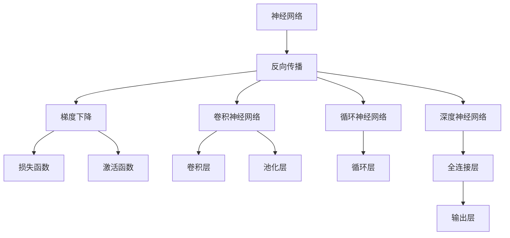
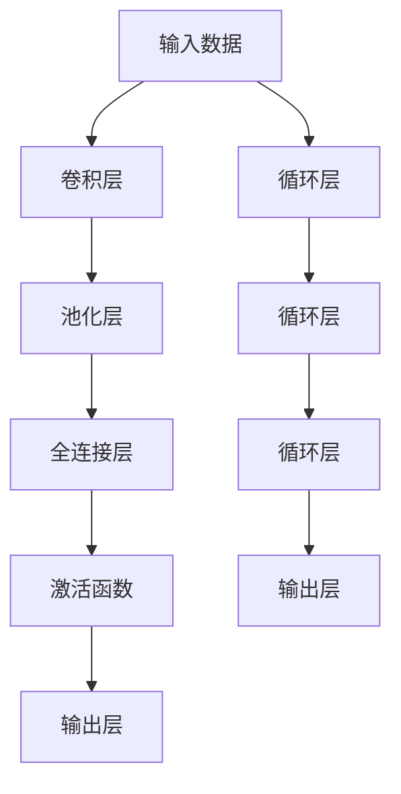
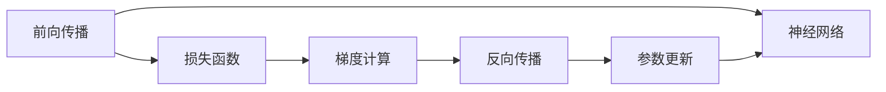
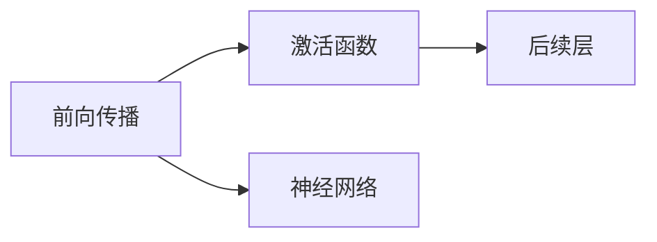
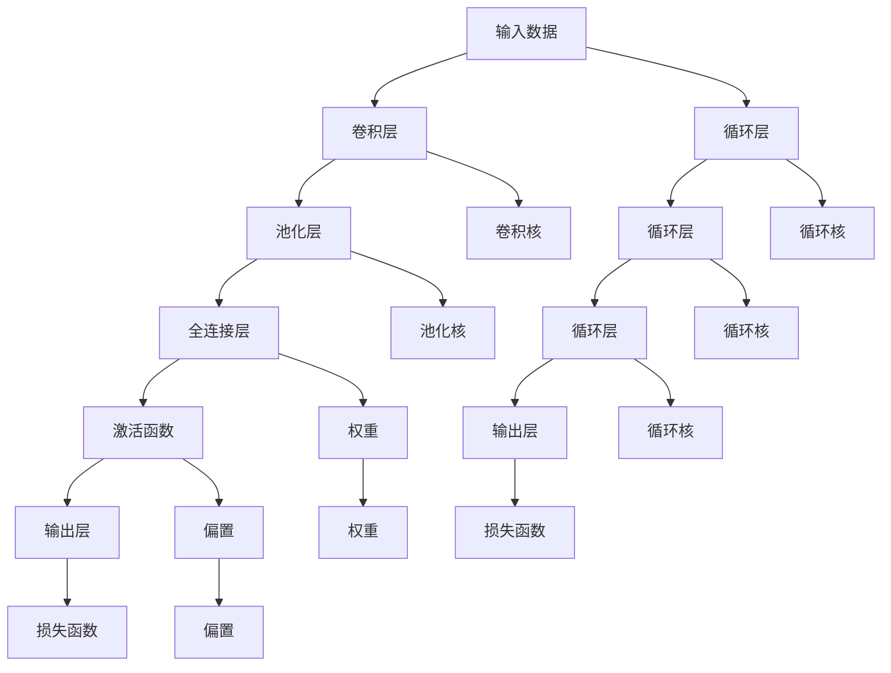

                 

# 神经网络 (Neural Network)

> 关键词：神经网络,反向传播,梯度下降,损失函数,激活函数,卷积神经网络,循环神经网络,深度神经网络,卷积层,池化层,全连接层,循环层,递归神经网络,长短期记忆网络(LSTM),门控循环单元(GRU),softmax,交叉熵损失函数,卷积神经网络(Convolutional Neural Network, CNN),循环神经网络(Recurrent Neural Network, RNN),深度学习,深度神经网络(Deep Neural Network, DNN)

## 1. 背景介绍

### 1.1 问题由来
神经网络（Neural Network, NN）是一种基于生物神经系统的计算模型，它通过模拟人类大脑的神经元之间的连接和信息传递机制，实现了对复杂非线性问题的建模和求解。自20世纪80年代以来，神经网络在图像识别、语音识别、自然语言处理等诸多领域取得了显著进展，成为人工智能研究中的重要方向之一。

近年来，随着深度学习（Deep Learning）技术的发展，神经网络模型变得更加复杂和深层次，出现了卷积神经网络（Convolutional Neural Network, CNN）、循环神经网络（Recurrent Neural Network, RNN）、长短期记忆网络（Long Short-Term Memory, LSTM）、门控循环单元（Gated Recurrent Unit, GRU）等先进模型。这些模型在视觉识别、自然语言处理、语音识别等领域取得了令人瞩目的成果，展示了神经网络在处理复杂结构化数据方面的强大能力。

尽管如此，神经网络的理论基础和计算方法仍然存在诸多未解之谜。本文将深入探讨神经网络的核心概念和关键算法，同时提供详细的代码实例和应用场景，以期帮助读者更好地理解并应用神经网络技术。

## 2. 核心概念与联系

### 2.1 核心概念概述

为更好地理解神经网络的原理和应用，本节将介绍几个核心概念：

- **神经网络**：由多个神经元（Neuron）组成的网络结构，用于解决分类、回归、聚类等任务。
- **反向传播**：一种计算图算法，通过反向计算梯度，优化神经网络的参数，提高模型的预测准确性。
- **梯度下降**：一种常用的优化算法，通过迭代更新参数，最小化损失函数，逐步逼近最优解。
- **损失函数**：衡量模型预测输出与真实标签之间的差异，常用的包括交叉熵损失、均方误差损失等。
- **激活函数**：神经元内部使用的非线性函数，如Sigmoid、ReLU、Tanh等，用于引入非线性特性。
- **卷积神经网络**：一种专门用于处理图像数据的神经网络结构，通过卷积层、池化层等结构提取图像特征。
- **循环神经网络**：一种用于处理序列数据的神经网络结构，通过循环层捕捉时间依赖关系。
- **深度神经网络**：具有多个隐藏层的神经网络，通过逐层特征提取和抽象，提高模型的复杂度。

这些核心概念之间有着紧密的联系，形成了一个完整的神经网络系统。下面我们通过一个Mermaid流程图来展示这些概念之间的关系：



这个流程图展示了神经网络的几个重要组件及其关系：

1. 神经网络包括反向传播、梯度下降、损失函数和激活函数等核心组件。
2. 卷积神经网络通过卷积层、池化层等结构，提取图像特征。
3. 循环神经网络通过循环层，捕捉时间序列数据的时序依赖关系。
4. 深度神经网络通过多个隐藏层，逐层提取和抽象数据特征。

这些组件相互作用，构成了神经网络强大的表达能力和学习能力。通过理解这些核心概念，我们可以更好地把握神经网络的工作原理和优化方向。

### 2.2 概念间的关系

这些核心概念之间存在紧密的联系，形成了神经网络完整的计算和优化框架。下面我们通过几个Mermaid流程图来展示这些概念之间的关系。

#### 2.2.1 神经网络的计算流程



这个流程图展示了神经网络的基本计算流程：

1. 输入数据经过卷积层、池化层等提取特征。
2. 特征经过全连接层和激活函数，产生中间结果。
3. 中间结果经过输出层得到最终预测。

#### 2.2.2 反向传播与梯度下降



这个流程图展示了反向传播和梯度下降的基本流程：

1. 前向传播计算损失函数。
2. 反向传播计算梯度。
3. 梯度下降更新参数。

#### 2.2.3 激活函数的引入



这个流程图展示了激活函数在神经网络中的作用：

1. 激活函数引入非线性特性。
2. 激活函数通过链式法则，传递梯度信息。
3. 激活函数对后续层的计算和优化至关重要。

通过这些流程图，我们可以更清晰地理解神经网络的工作原理和优化方向。

### 2.3 核心概念的整体架构

最后，我们用一个综合的流程图来展示这些核心概念在神经网络中的整体架构：



这个综合流程图展示了神经网络的全貌，从数据输入到参数更新，再到最终输出，每个组件的作用都得到了详细描述。

## 3. 核心算法原理 & 具体操作步骤
### 3.1 算法原理概述

神经网络的训练过程主要通过反向传播和梯度下降算法实现。其核心思想是：通过前向传播计算模型输出，然后计算损失函数，并反向传播损失函数的梯度，最终使用梯度下降算法更新模型参数，使模型输出逼近真实标签。

具体来说，设神经网络 $F$ 接受输入 $x$，输出 $y$，并包含参数 $\theta$。训练过程中，我们通过前向传播计算预测输出 $y^{\prime}$，并计算损失函数 $L(y^{\prime},y)$。损失函数的梯度通过反向传播算法计算，然后应用梯度下降算法更新参数 $\theta$。

形式化地，设损失函数 $L$ 为交叉熵损失函数，则神经网络训练的目标为：

$$
\min_{\theta} L(y^{\prime},y) = \frac{1}{N}\sum_{i=1}^N \ell(y^{\prime}_i, y_i)
$$

其中，$N$ 为样本数量，$\ell$ 为单个样本的损失函数，如交叉熵损失。

### 3.2 算法步骤详解

神经网络训练的具体步骤如下：

1. **初始化参数**：随机初始化模型的权重和偏置。
2. **前向传播**：输入数据 $x$ 通过网络，计算预测输出 $y^{\prime}$。
3. **计算损失**：计算预测输出与真实标签之间的损失函数 $L(y^{\prime},y)$。
4. **反向传播**：通过链式法则，计算损失函数的梯度 $\nabla L$。
5. **更新参数**：使用梯度下降算法，更新模型的参数 $\theta$。
6. **重复迭代**：重复上述步骤，直至收敛或达到预设的迭代次数。

其中，前向传播和反向传播是神经网络训练的关键步骤。前向传播通过计算神经网络内部各层的输出，将输入数据转化为预测结果。反向传播则通过计算梯度，更新模型参数，使模型在训练集上表现更好。

### 3.3 算法优缺点

神经网络作为一种强大的机器学习模型，具有以下优点：

- **强大的表达能力**：神经网络能够处理非线性关系，适合于解决复杂的分类、回归、聚类等任务。
- **端到端训练**：神经网络通过反向传播算法，可以自动更新所有参数，实现端到端训练。
- **自动特征提取**：神经网络通过逐层特征提取和抽象，能够自动学习输入数据的特征表示。
- **泛化能力强**：神经网络具有较好的泛化能力，可以在新数据上表现良好。

然而，神经网络也存在以下缺点：

- **过拟合风险**：神经网络容易在训练集上过拟合，需要采取一些正则化技术，如Dropout、L2正则等，以防止过拟合。
- **计算复杂度高**：神经网络需要大量的计算资源和存储空间，尤其是在深度和宽度较大的情况下。
- **模型解释性差**：神经网络通常被视为"黑盒"模型，难以解释其内部工作机制和决策逻辑。

尽管如此，神经网络凭借其强大的表达能力和学习能力，在许多领域取得了显著的成果，成为机器学习领域的重要技术之一。

### 3.4 算法应用领域

神经网络已经被广泛应用于各个领域，以下是几个典型的应用场景：

- **计算机视觉**：通过卷积神经网络（CNN）处理图像数据，用于图像分类、目标检测、图像分割等任务。
- **自然语言处理**：通过循环神经网络（RNN）、长短期记忆网络（LSTM）等处理文本数据，用于机器翻译、文本生成、情感分析等任务。
- **语音识别**：通过循环神经网络（RNN）处理音频数据，用于语音识别、语音合成等任务。
- **推荐系统**：通过深度神经网络（DNN）处理用户行为数据，用于推荐商品、新闻、视频等。
- **自动驾驶**：通过卷积神经网络（CNN）和循环神经网络（RNN）处理传感器数据，用于自动驾驶、智能交通等。

神经网络在上述领域的广泛应用，展示了其强大的数据处理和建模能力，为人类社会带来了巨大的变革和进步。

## 4. 数学模型和公式 & 详细讲解  
### 4.1 数学模型构建

神经网络的数学模型通常由输入层、隐藏层和输出层组成。设神经网络包含 $L$ 个隐藏层，每个隐藏层包含 $n$ 个神经元。输入层包含 $d$ 个特征，输出层包含 $m$ 个输出节点。

神经网络中，每个神经元的输出可以通过激活函数计算，具体如下：

$$
z = w^Tx + b
$$

其中，$z$ 为神经元的输入，$w$ 为权重矩阵，$x$ 为输入数据，$b$ 为偏置项。激活函数 $f$ 将 $z$ 映射到输出 $a$，即：

$$
a = f(z)
$$

常用的激活函数包括 Sigmoid、ReLU、Tanh 等。

隐藏层的计算公式可以表示为：

$$
a^{(l)} = f(z^{(l)})
$$

其中，$l$ 为层数，$z^{(l)}$ 为第 $l$ 层的输入，$a^{(l)}$ 为第 $l$ 层的输出。

输出层的计算公式为：

$$
a^{(L)} = f(z^{(L)})
$$

其中，$L$ 为神经网络的层数，$z^{(L)}$ 为输出层的输入，$a^{(L)}$ 为输出层的输出。

### 4.2 公式推导过程

下面我们以单层神经网络为例，推导其计算过程和梯度下降算法的具体实现。

假设输入数据 $x$ 为 $d$ 维向量，权重矩阵 $w$ 为 $n \times d$ 矩阵，偏置项 $b$ 为 $n$ 维向量，激活函数 $f$ 为 Sigmoid 函数。则单层神经网络的输出 $a$ 可以表示为：

$$
a = f(z) = \sigma(w^Tx + b)
$$

其中，$\sigma$ 为 Sigmoid 函数，$z = w^Tx + b$ 为神经元的输入。

为了最小化损失函数 $L$，我们使用梯度下降算法更新权重矩阵 $w$ 和偏置项 $b$。梯度下降算法的更新公式为：

$$
w \leftarrow w - \eta\nabla_L L
$$

其中，$\eta$ 为学习率，$\nabla_L L$ 为损失函数 $L$ 对权重矩阵 $w$ 的梯度。

为了计算 $\nabla_L L$，我们需要计算损失函数 $L$ 对权重矩阵 $w$ 和偏置项 $b$ 的偏导数。设损失函数 $L$ 为交叉熵损失函数，则：

$$
L = -\frac{1}{N}\sum_{i=1}^N \ell(y_i, \hat{y_i})
$$

其中，$y_i$ 为真实标签，$\hat{y_i}$ 为预测输出，$\ell$ 为交叉熵损失函数。

对于单个样本 $i$，其损失函数为：

$$
\ell_i = -[y_i\log\hat{y_i} + (1-y_i)\log(1-\hat{y_i})]
$$

则梯度 $\nabla_L L$ 可以表示为：

$$
\nabla_L L = -\frac{1}{N}\sum_{i=1}^N \nabla_L \ell_i
$$

其中，$\nabla_L \ell_i$ 为损失函数对权重矩阵 $w$ 的偏导数，可以表示为：

$$
\nabla_L \ell_i = \frac{\partial \ell_i}{\partial z_i} \frac{\partial z_i}{\partial w}
$$

其中，$\frac{\partial \ell_i}{\partial z_i}$ 为损失函数对神经元输入的偏导数，$\frac{\partial z_i}{\partial w}$ 为神经元输入对权重矩阵的偏导数。

根据上述公式，我们可以使用反向传播算法计算 $\nabla_L L$，并使用梯度下降算法更新权重矩阵 $w$ 和偏置项 $b$。

### 4.3 案例分析与讲解

为了更好地理解神经网络的计算和优化过程，下面以手写数字识别为例，展示其应用和优化。

假设我们有手写数字识别任务，训练集包含 $N$ 个样本，每个样本包含 $d=784$ 个像素点，输出层包含 $m=10$ 个节点，分别对应数字 $0$ 到 $9$。

我们使用单层神经网络进行训练，权重矩阵 $w$ 为 $10 \times 784$ 矩阵，偏置项 $b$ 为 $10$ 维向量，激活函数 $f$ 为 Sigmoid 函数。设学习率为 $\eta=0.1$，损失函数为交叉熵损失函数。

在训练过程中，我们首先随机初始化权重矩阵 $w$ 和偏置项 $b$，然后对每个样本进行前向传播和反向传播，更新权重矩阵和偏置项。具体步骤如下：

1. **初始化参数**：随机初始化权重矩阵 $w$ 和偏置项 $b$。
2. **前向传播**：对每个样本进行前向传播，计算预测输出 $\hat{y_i}$。
3. **计算损失**：计算交叉熵损失 $L_i$。
4. **反向传播**：计算损失函数 $L_i$ 对权重矩阵 $w$ 和偏置项 $b$ 的偏导数 $\nabla_L \ell_i$。
5. **更新参数**：使用梯度下降算法，更新权重矩阵 $w$ 和偏置项 $b$。
6. **重复迭代**：重复上述步骤，直至收敛或达到预设的迭代次数。

在训练过程中，我们还需要对模型进行正则化，防止过拟合。常用的正则化技术包括 L2 正则和 Dropout。

L2 正则可以通过在损失函数中引入正则项，限制权重矩阵的范数，防止其过大。Dropout 则可以在训练过程中随机丢弃一部分神经元，减少模型的复杂度。

在训练完成后，我们可以在测试集上评估模型的性能，如准确率、召回率等指标，对比微调前后的效果提升。

## 5. 项目实践：代码实例和详细解释说明
### 5.1 开发环境搭建

在进行神经网络训练和优化前，我们需要准备好开发环境。以下是使用Python进行TensorFlow开发的简单步骤：

1. 安装Anaconda：从官网下载并安装Anaconda，用于创建独立的Python环境。

2. 创建并激活虚拟环境：
```bash
conda create -n tensorflow-env python=3.8 
conda activate tensorflow-env
```

3. 安装TensorFlow：根据CUDA版本，从官网获取对应的安装命令。例如：
```bash
conda install tensorflow tensorflow-gpu=2.5.0=cudatoolkit=11.1 -c pytorch -c conda-forge
```

4. 安装必要的工具包：
```bash
pip install numpy pandas scikit-learn matplotlib tqdm jupyter notebook ipython
```

完成上述步骤后，即可在`tensorflow-env`环境中开始神经网络训练。

### 5.2 源代码详细实现

下面我们以手写数字识别为例，使用TensorFlow实现一个简单的单层神经网络。

首先，定义神经网络的输入、输出和权重：

```python
import tensorflow as tf
import numpy as np

# 定义神经网络结构
input_size = 784
hidden_size = 256
output_size = 10

# 定义输入和输出
x = tf.placeholder(tf.float32, [None, input_size])
y = tf.placeholder(tf.float32, [None, output_size])

# 定义权重和偏置项
W1 = tf.Variable(tf.truncated_normal([input_size, hidden_size], stddev=0.1))
b1 = tf.Variable(tf.zeros([hidden_size]))
W2 = tf.Variable(tf.truncated_normal([hidden_size, output_size], stddev=0.1))
b2 = tf.Variable(tf.zeros([output_size]))

# 定义激活函数和损失函数
hidden_layer = tf.nn.relu(tf.matmul(x, W1) + b1)
output_layer = tf.matmul(hidden_layer, W2) + b2
logits = tf.nn.softmax(output_layer)
loss = tf.reduce_mean(tf.nn.softmax_cross_entropy_with_logits(logits=logits, labels=y))
```

然后，定义优化器和训练过程：

```python
# 定义优化器
optimizer = tf.train.AdamOptimizer(learning_rate=0.01).minimize(loss)

# 定义训练过程
with tf.Session() as sess:
    sess.run(tf.global_variables_initializer())
    
    # 训练过程
    for i in range(1000):
        batch_x, batch_y = mnist.train.next_batch(100)
        sess.run(optimizer, feed_dict={x: batch_x, y: batch_y})
        
        if i % 100 == 0:
            acc = accuracy(sess, mnist.test.images, mnist.test.labels)
            print("Iteration %d, accuracy: %f" % (i, acc))
```

最后，定义评估函数：

```python
def accuracy(sess, x_test, y_test):
    correct_prediction = tf.equal(tf.argmax(logits, 1), tf.argmax(y, 1))
    accuracy = tf.reduce_mean(tf.cast(correct_prediction, tf.float32))
    return sess.run(accuracy, feed_dict={x: x_test, y: y_test})
```

在训练完成后，我们可以使用测试集评估模型的性能，计算准确率：

```python
# 计算测试集上的准确率
test_x, test_y = mnist.test.images, mnist.test.labels
acc = accuracy(sess, test_x, test_y)
print("Test accuracy: %f" % acc)
```

以上就是使用TensorFlow实现单层神经网络的基本代码，包括模型定义、优化器定义、训练过程和评估函数。

### 5.3 代码解读与分析

这里我们详细解读一下代码的关键部分：

**神经网络定义**：
- 首先定义输入大小、隐藏层大小和输出大小。
- 定义输入和输出占位符。
- 定义权重矩阵和偏置项。
- 定义隐藏层和输出层的计算过程。

**优化器定义**：
- 使用Adam优化器定义损失函数和参数更新过程。

**训练过程**：
- 在TensorFlow会话中，初始化变量。
- 循环迭代训练过程，每次随机抽取100个样本进行前向传播和反向传播，更新参数。
- 每100次迭代输出一次准确率。

**评估函数**：
- 定义评估函数，计算预测输出与真实标签的准确率。

**训练完成后的评估**：
- 在测试集上计算准确率，输出最终结果。

通过这些代码，我们可以方便地实现神经网络的训练和评估，掌握神经网络的基本计算和优化流程。

## 6. 实际应用场景
### 6.1 计算机视觉

神经网络在计算机视觉领域的应用非常广泛，以下是几个典型的应用场景：

- **图像分类**：使用卷积神经网络（CNN）对图像进行分类，如手写数字识别、物体识别、场景分类等。
- **目标检测**：使用区域卷积神经网络（RCNN）、YOLO（You Only Look Once）、SSD（Single Shot MultiBox Detector）等模型，对图像中的目标进行定位和分类。
- **图像分割**：使用全卷积神经网络（FCN）、U-Net等模型，对图像进行像素级别的分割，如医学影像分割、地理图像分割等。

神经网络在计算机视觉领域的应用，展示了其在处理图像数据的强大能力，为图像识别、目标检测、图像分割等任务提供了有效的解决方案。

### 6.2 自然语言处理

神经网络在自然语言处理领域也有广泛的应用，以下是几个典型的应用场景：

- **机器翻译**：使用序列到序列模型（Seq2Seq）、注意力机制（Attention）等模型，将源语言翻译成目标语言。
- **文本生成**：使用循环神经网络（RNN）、长短期记忆网络（LSTM）等模型，生成文本内容，如文本摘要、对话系统等。
- **情感分析**：使用卷积神经网络（CNN）、循环神经网络（RNN）等模型，对文本进行情感分类，如情感分析、用户评论分析等。

神经网络在自然语言处理领域的应用，展示了其在处理文本数据的强大能力，为文本分类、文本生成、情感分析等任务提供了有效的解决方案。

### 6.3 语音识别

神经网络在语音识别领域也有广泛的应用，以下是几个典型的应用场景：

- **语音识别**：使用卷积神经网络（CNN）、循环神经网络（RNN）等模型，将语音信号转换为文本内容。
- **语音合成**：使用循环神经网络（RNN）、变分自编码器（VAE）等模型，将文本转换为语音信号。

神经网络在语音识别领域的应用，展示了其在处理音频数据的强大能力，为语音识别、语音合成等任务提供了有效的解决方案。

### 6.4 未来应用展望

未来，神经网络在各个领域的应用将更加广泛和深入，以下是几个值得关注的方向：

- **多模态学习**：将神经网络应用于处理图像、文本、音频等多种模态的数据，提升跨模态学习能力。
- **联邦学习**：将神经网络应用于分布式训练，保护数据隐私的同时，提升模型的泛化能力。
- **增强学习**：将神经网络应用于增强学习，解决复杂的决策和优化问题。
- **元学习**：将神经网络应用于元学习，快速适应新任务和新数据。

神经网络在上述方向的探索发展，必将进一步提升其在各个领域的应用能力，带来更加智能和高效的系统。

## 7. 工具和资源推荐
### 7.1 学习资源推荐

为了帮助开发者系统掌握神经网络的理论基础和实践技巧，这里推荐一些优质的学习资源：

1. **深度学习课程**：
   - 《深度学习》课程，由斯坦福大学Andrew Ng教授主讲，涵盖了深度学习的理论基础和应用实践，是入门深度学习的经典课程。
   - 《CS231n: 卷积神经网络与视觉识别》课程，由斯坦福大学李飞飞教授主讲，专注于计算机视觉领域的深度学习应用。

2. **神经网络框架**：
   - TensorFlow：由Google开发的开源深度学习框架，提供了丰富的模型和工具，支持端到端的训练和部署。
   

