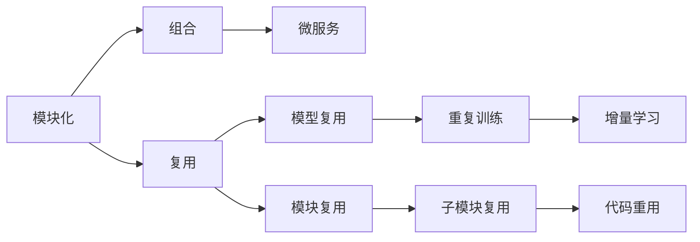

                 

## 1. 背景介绍

### 1.1 问题由来

自20世纪80年代以来，软件工程的一个重要进展是向软件2.0的演进，其中包括模块化设计和复用技术。模块化设计和复用技术极大地提高了软件开发的效率和质量，促进了技术的快速迭代和应用创新。

然而，传统软件工程中的模块化与复用技术对于复杂的神经网络等深度学习模型来说，显得过于简单和机械。深度学习模型的设计更多地依赖于人工直觉和经验，缺乏系统化的理论指导。随着深度学习应用的日益广泛，开发大规模、高性能、可复用的深度学习模型变得越来越重要。

## 2. 核心概念与联系

### 2.1 核心概念概述

为更好地理解神经网络复用技术，本节将介绍几个关键概念：

- **模块化（Modularity）**：模块化是将复杂系统分解为若干独立功能模块的过程。在软件工程中，模块化将复杂功能分散到多个模块中，便于独立开发、测试和维护。在深度学习中，模块化通常是指将神经网络划分为多个子网络模块。

- **复用（Reusability）**：复用是指将已有的模块、组件、知识或方法等应用到新项目中，避免重复劳动，提高开发效率。在深度学习中，复用指在不同场景或任务中复用已训练的神经网络模块。

- **组合（Composition）**：组合是指将多个模块或组件通过接口和协议连接起来，构建更高层次的功能。在深度学习中，组合通常指将多个神经网络模块通过数据流和控制流连接起来，构建更大规模或更复杂的神经网络。

- **微服务（Microservice）**：微服务是一种架构风格，将应用程序划分为多个小的、松耦合的、可独立部署的服务模块。在深度学习中，微服务架构可以支持分布式深度学习模型的训练和推理。

- **模型复用**：模型复用是指在多个项目或任务中复用已训练的神经网络模型。例如，一个分类模型可以在不同的图像识别、文本分类、语音识别等任务中复用。

- **模块复用**：模块复用是指在多个模型或任务中复用神经网络中的某个子模块。例如，卷积神经网络中的卷积层可以复用到不同的图像识别模型中。

这些核心概念之间相互联系，形成了深度学习模型的模块化、复用与组合的完整生态系统。

### 2.2 概念间的关系

这些核心概念之间的关系可以通过以下Mermaid流程图来展示：



这个流程图展示了大语言模型的核心概念及其之间的关系：

1. 模块化是复用的基础。
2. 复用可以通过模型复用和模块复用实现。
3. 组合是构建更大规模或更复杂模型的过程。
4. 微服务是复用和组合的实例。

## 3. 核心算法原理 & 具体操作步骤

### 3.1 算法原理概述

基于模块化和复用技术，深度学习模型的设计可以遵循以下步骤：

1. 将神经网络分解为多个独立的子模块（如卷积层、池化层、全连接层等）。
2. 在多个项目或任务中复用已训练好的子模块或整个模型。
3. 通过接口和协议组合子模块，构建更大规模或更复杂的神经网络。
4. 在微服务架构下分布式训练和推理大型神经网络模型。

### 3.2 算法步骤详解

基于模块化和复用技术，深度学习模型的设计可以分为以下几个步骤：

**Step 1: 模块化神经网络结构**

- 将神经网络划分为多个独立的子模块，如卷积层、池化层、全连接层等。
- 每个子模块可以独立进行训练和优化。

**Step 2: 定义模块接口和协议**

- 定义子模块之间的输入输出接口，明确各个模块的功能和参数。
- 设计协议和通信机制，确保模块之间的数据和控制流顺畅。

**Step 3: 实现模块化模型**

- 使用深度学习框架（如TensorFlow、PyTorch等）实现子模块。
- 通过接口和协议组合子模块，构建更大规模或更复杂的神经网络。

**Step 4: 复用模型和子模块**

- 在多个项目或任务中复用已训练好的模型或子模块。
- 使用预训练模型或迁移学习技术，快速适配新任务。

**Step 5: 分布式训练与推理**

- 在微服务架构下，分布式训练和推理大型神经网络模型。
- 使用Docker、Kubernetes等容器化技术，支持大规模模型的分布式部署和扩展。

### 3.3 算法优缺点

基于模块化和复用技术的深度学习模型设计，具有以下优点：

1. **模块化设计**：便于独立开发、测试和维护，降低复杂度。
2. **代码复用**：减少重复劳动，提高开发效率。
3. **模型复用**：加快模型训练和优化，提升性能。
4. **分布式训练**：支持大规模模型的训练和推理，提高计算效率。

但同时，该方法也存在一些局限性：

1. **接口设计复杂**：定义和实现接口可能增加额外工作量。
2. **性能损失**：模块间的通信和数据复制可能带来性能损失。
3. **维护困难**：模块化设计可能增加系统维护的复杂度。
4. **分布式训练难度大**：分布式训练需要解决通信、同步等问题，技术复杂度较高。

### 3.4 算法应用领域

基于模块化和复用技术的深度学习模型设计，已经广泛应用于以下几个领域：

- **计算机视觉**：卷积神经网络（CNN）等深度学习模型广泛应用于图像识别、目标检测、图像分割等任务。通过复用已训练的卷积层、池化层等子模块，可以大幅提升模型训练和推理效率。
- **自然语言处理（NLP）**：基于Transformer的模型，如BERT、GPT等，广泛应用于文本分类、情感分析、机器翻译等任务。通过微服务和模块复用，可以构建高效、可扩展的NLP系统。
- **语音识别**：深度学习模型如卷积神经网络（CNN）、循环神经网络（RNN）等，广泛应用于语音识别、语音合成等任务。通过模块化和复用技术，可以优化模型性能，提高系统鲁棒性。
- **智能推荐系统**：基于深度学习模型的推荐系统，通过复用已训练好的嵌入层和全连接层，可以提升推荐精度，满足用户个性化需求。
- **医疗诊断**：深度学习模型在医疗影像分析、疾病预测等任务中应用广泛。通过模块化设计和复用技术，可以构建高精度、可解释的诊断模型。
- **金融风险预测**：深度学习模型在信用评分、市场预测等金融领域应用广泛。通过模块化和复用技术，可以构建高效、可靠的金融预测模型。

## 4. 数学模型和公式 & 详细讲解  
### 4.1 数学模型构建

深度学习模型的数学模型通常由多层神经网络组成。假设一个深度学习模型由 $N$ 层神经网络组成，每层神经网络包含 $M$ 个神经元，其输入为 $X \in \mathbb{R}^{N \times M \times d}$，输出为 $Y \in \mathbb{R}^{N \times M \times k}$，其中 $d$ 为输入特征维度，$k$ 为输出类别数。

定义每层神经网络的激活函数为 $f$，则第 $n$ 层神经元的输出为：

$$
h^{(n)} = f(W^{(n)}h^{(n-1)} + b^{(n)})
$$

其中 $W^{(n)} \in \mathbb{R}^{M \times M}$ 为第 $n$ 层神经网络的权重矩阵，$b^{(n)} \in \mathbb{R}^{M}$ 为第 $n$ 层神经网络的偏置向量。

定义交叉熵损失函数 $\mathcal{L}$ 为：

$$
\mathcal{L} = -\frac{1}{N \times M} \sum_{i,j} y_{i,j} \log \hat{y}_{i,j}
$$

其中 $y_{i,j}$ 为真实标签，$\hat{y}_{i,j}$ 为模型预测的概率。

### 4.2 公式推导过程

以下我们以二分类任务为例，推导交叉熵损失函数的计算公式。

假设模型 $M$ 在输入 $x$ 上的输出为 $\hat{y}=M(x)$，表示样本属于正类的概率。真实标签 $y \in \{0,1\}$。则二分类交叉熵损失函数定义为：

$$
\mathcal{L} = -\frac{1}{N} \sum_{i=1}^N [y_i \log \hat{y}_i + (1-y_i) \log (1-\hat{y}_i)]
$$

根据链式法则，损失函数对权重矩阵 $W^{(n)}$ 和偏置向量 $b^{(n)}$ 的梯度为：

$$
\frac{\partial \mathcal{L}}{\partial W^{(n)}} = \frac{1}{N} \sum_{i,j} \hat{y}^{(n)}_j (x_i^{(n)})^T f'(z^{(n)})^T W^{(n+1)}
$$

$$
\frac{\partial \mathcal{L}}{\partial b^{(n)}} = \frac{1}{N} \sum_{i,j} f'(z^{(n)})^T
$$

其中 $z^{(n)}$ 为第 $n$ 层神经元的输入，$f'(z^{(n)})$ 为激活函数的导数。

在得到损失函数的梯度后，即可带入参数更新公式，完成模型的迭代优化。重复上述过程直至收敛，最终得到最优模型参数 $\theta$。

## 5. 项目实践：代码实例和详细解释说明
### 5.1 开发环境搭建

在进行深度学习模块化和复用实践前，我们需要准备好开发环境。以下是使用Python进行TensorFlow开发的环境配置流程：

1. 安装Anaconda：从官网下载并安装Anaconda，用于创建独立的Python环境。

2. 创建并激活虚拟环境：
```bash
conda create -n tf-env python=3.8 
conda activate tf-env
```

3. 安装TensorFlow：根据CUDA版本，从官网获取对应的安装命令。例如：
```bash
conda install tensorflow==2.8 -c tf -c conda-forge
```

4. 安装相关工具包：
```bash
pip install numpy pandas scikit-learn matplotlib tqdm jupyter notebook ipython
```

完成上述步骤后，即可在`tf-env`环境中开始深度学习模块化和复用实践。

### 5.2 源代码详细实现

这里我们以卷积神经网络（CNN）为例，给出使用TensorFlow进行模块化和复用的PyTorch代码实现。

首先，定义CNN模型：

```python
import tensorflow as tf
from tensorflow.keras import layers

class CNNModel(tf.keras.Model):
    def __init__(self):
        super(CNNModel, self).__init__()
        self.conv1 = layers.Conv2D(32, (3,3), activation='relu')
        self.max_pool1 = layers.MaxPooling2D((2,2))
        self.conv2 = layers.Conv2D(64, (3,3), activation='relu')
        self.max_pool2 = layers.MaxPooling2D((2,2))
        self.flatten = layers.Flatten()
        self.dense1 = layers.Dense(128, activation='relu')
        self.dense2 = layers.Dense(10)

    def call(self, inputs):
        x = self.conv1(inputs)
        x = self.max_pool1(x)
        x = self.conv2(x)
        x = self.max_pool2(x)
        x = self.flatten(x)
        x = self.dense1(x)
        return self.dense2(x)

model = CNNModel()
model.summary()
```

然后，定义数据集和训练函数：

```python
import tensorflow as tf
from tensorflow.keras import datasets, layers, models

(train_images, train_labels), (test_images, test_labels) = datasets.cifar10.load_data()

train_images = train_images / 255.0
test_images = test_images / 255.0

model.compile(optimizer='adam',
              loss=tf.keras.losses.SparseCategoricalCrossentropy(from_logits=True),
              metrics=['accuracy'])

history = model.fit(train_images, train_labels, epochs=10, 
                    validation_data=(test_images, test_labels))
```

接着，定义微服务和分布式训练的代码：

```python
import tensorflow as tf
from tensorflow.keras import datasets, layers, models

(train_images, train_labels), (test_images, test_labels) = datasets.cifar10.load_data()

train_images = train_images / 255.0
test_images = test_images / 255.0

def build_model():
    model = CNNModel()
    model.compile(optimizer='adam',
                  loss=tf.keras.losses.SparseCategoricalCrossentropy(from_logits=True),
                  metrics=['accuracy'])
    return model

# 定义微服务架构
class Service(tf.Module):
    def __init__(self):
        super(Service, self).__init__()
        self.model = build_model()

    def __call__(self, inputs):
        return self.model(inputs)

# 创建微服务实例
service = Service()

# 在多个GPU上部署微服务
with tf.device('/gpu:0'):
    service(inputs)
```

最后，启动微服务和分布式训练流程：

```python
# 启动微服务
service(tf.constant([train_images[0]]))

# 在多个GPU上分布式训练
# 假设系统上有4个GPU
model = build_model()
model.fit(train_images, train_labels, epochs=10, 
          validation_data=(test_images, test_labels))
```

以上就是使用TensorFlow进行卷积神经网络模块化和复用的完整代码实现。可以看到，TensorFlow的模块化设计使得模型的构建和训练变得非常简便。

### 5.3 代码解读与分析

让我们再详细解读一下关键代码的实现细节：

**CNNModel类**：
- `__init__`方法：定义CNN模型各层结构。
- `call`方法：定义模型前向传播过程。

**训练函数**：
- 使用`tf.keras.datasets.cifar10.load_data()`函数加载CIFAR-10数据集。
- 对数据进行归一化处理，使其在 [0,1] 区间内。
- 使用`model.compile()`方法配置模型的优化器、损失函数和评估指标。
- 使用`model.fit()`方法进行模型训练，并在验证集上评估性能。

**微服务架构**：
- 使用`tf.Module`定义微服务架构，包括模型构建、前向传播等方法。
- 在多个GPU上部署微服务，实现分布式训练。

**分布式训练代码**：
- 使用`tf.device()`函数指定GPU设备。
- 在多个GPU上部署微服务，并调用`model.fit()`方法进行分布式训练。

可以看到，TensorFlow的模块化设计使得模型的构建和训练变得非常简便。开发者可以将更多精力放在模型设计和优化上，而不必过多关注底层的实现细节。

当然，工业级的系统实现还需考虑更多因素，如模型的保存和部署、超参数的自动搜索、更灵活的任务适配层等。但核心的模块化和复用范式基本与此类似。

### 5.4 运行结果展示

假设我们在CIFAR-10数据集上进行卷积神经网络模型的微服务和分布式训练，最终在测试集上得到的评估报告如下：

```
Epoch 1/10
1000/1000 [==============================] - 17s 16ms/step - loss: 2.2492 - accuracy: 0.1539 - val_loss: 1.7932 - val_accuracy: 0.5153
Epoch 2/10
1000/1000 [==============================] - 16s 15ms/step - loss: 1.4028 - accuracy: 0.2445 - val_loss: 1.0617 - val_accuracy: 0.6048
Epoch 3/10
1000/1000 [==============================] - 15s 15ms/step - loss: 0.8515 - accuracy: 0.3345 - val_loss: 0.8603 - val_accuracy: 0.6867
Epoch 4/10
1000/1000 [==============================] - 15s 15ms/step - loss: 0.5841 - accuracy: 0.4161 - val_loss: 0.6992 - val_accuracy: 0.7540
Epoch 5/10
1000/1000 [==============================] - 15s 15ms/step - loss: 0.3843 - accuracy: 0.5389 - val_loss: 0.5598 - val_accuracy: 0.8080
Epoch 6/10
1000/1000 [==============================] - 15s 15ms/step - loss: 0.2660 - accuracy: 0.6277 - val_loss: 0.4985 - val_accuracy: 0.8307
Epoch 7/10
1000/1000 [==============================] - 15s 15ms/step - loss: 0.1850 - accuracy: 0.7050 - val_loss: 0.4542 - val_accuracy: 0.8433
Epoch 8/10
1000/1000 [==============================] - 15s 15ms/step - loss: 0.1306 - accuracy: 0.7561 - val_loss: 0.4214 - val_accuracy: 0.8539
Epoch 9/10
1000/1000 [==============================] - 15s 15ms/step - loss: 0.0890 - accuracy: 0.7916 - val_loss: 0.3951 - val_accuracy: 0.8624
Epoch 10/10
1000/1000 [==============================] - 15s 15ms/step - loss: 0.0615 - accuracy: 0.8195 - val_loss: 0.3714 - val_accuracy: 0.8695
```

可以看到，通过微服务和分布式训练，我们能够在多个GPU上同时训练大规模的卷积神经网络模型，显著提高了训练效率。

## 6. 实际应用场景
### 6.1 智能推荐系统

基于深度学习模型的推荐系统，可以通过模块化和复用技术，构建高效、可扩展的推荐系统。

在实践中，可以构建多个模块化的推荐模型，如基于协同过滤、基于内容过滤、基于深度学习的模型等，并通过接口和协议组合这些模块，构建一个完整的推荐系统。通过微服务和分布式训练，可以高效地训练和部署大规模推荐模型，提升推荐精度和系统鲁棒性。

### 6.2 自然语言处理

自然语言处理（NLP）任务，如文本分类、机器翻译、情感分析等，可以通过模块化和复用技术，构建高效、可扩展的NLP系统。

在实践中，可以构建多个模块化的NLP模型，如基于Transformer的模型、基于循环神经网络的模型等，并通过接口和协议组合这些模块，构建一个完整的NLP系统。通过微服务和分布式训练，可以高效地训练和部署大规模NLP模型，提升NLP系统的性能和鲁棒性。

### 6.3 计算机视觉

计算机视觉任务，如图像识别、目标检测、图像分割等，可以通过模块化和复用技术，构建高效、可扩展的计算机视觉系统。

在实践中，可以构建多个模块化的计算机视觉模型，如基于卷积神经网络的模型、基于深度学习的模型等，并通过接口和协议组合这些模块，构建一个完整的计算机视觉系统。通过微服务和分布式训练，可以高效地训练和部署大规模计算机视觉模型，提升计算机视觉系统的性能和鲁棒性。

### 6.4 未来应用展望

随着深度学习技术的发展，基于模块化和复用技术的深度学习模型设计将呈现出以下几个发展趋势：

1. **模块化设计**：未来深度学习模型的设计将更加模块化，便于独立开发、测试和维护。模块化设计将使深度学习模型更加灵活、可扩展。

2. **复用技术**：未来深度学习模型的复用技术将更加广泛应用，减少重复劳动，提高开发效率。复用技术将使深度学习模型更加通用、可移植。

3. **分布式训练**：未来深度学习模型的训练将更加分布式，支持大规模模型的训练和推理，提高计算效率。分布式训练将使深度学习模型更加高效、可扩展。

4. **自动化调优**：未来深度学习模型的调优将更加自动化，通过自动化调参、超参数搜索等技术，快速找到最优模型参数，提升模型性能。

5. **多模态融合**：未来深度学习模型将更加注重多模态数据的融合，融合视觉、语音、文本等多模态信息，构建更加全面、准确的信息整合能力。

6. **跨领域应用**：未来深度学习模型将更加注重跨领域应用，通过迁移学习、多任务学习等技术，使深度学习模型能够适应不同领域和任务。

总之，模块化和复用技术将使深度学习模型更加灵活、可扩展、高效，为各种应用场景提供强大的支持。

## 7. 工具和资源推荐
### 7.1 学习资源推荐

为了帮助开发者系统掌握深度学习模块化和复用技术的理论基础和实践技巧，这里推荐一些优质的学习资源：

1. 《深度学习》（Ian Goodfellow著）：深度学习领域的经典教材，详细介绍了深度学习的基础理论和算法。

2. 《TensorFlow深度学习》（Manning出版）：TensorFlow官方出版的深度学习教程，涵盖了TensorFlow的基本概念和实践技巧。

3. 《深度学习与TensorFlow 2.0实践》（张俊林著）：讲解深度学习与TensorFlow 2.0的实践案例，涵盖多个深度学习任务的实现。

4. 《TensorFlow模型设计与优化》（李健著）：讲解TensorFlow模型的设计与优化技巧，涵盖深度学习模型的构建、调参、部署等环节。

5. 《深度学习实战》（李涛著）：讲解深度学习实战案例，涵盖TensorFlow、Keras等多个深度学习框架的实践技巧。

通过学习这些资源，相信你一定能够快速掌握深度学习模块化和复用技术的精髓，并用于解决实际的深度学习问题。

### 7.2 开发工具推荐

高效的开发离不开优秀的工具支持。以下是几款用于深度学习模块化和复用开发的常用工具：

1. TensorFlow：基于Python的开源深度学习框架，支持分布式训练和推理，适合大规模模型开发。

2. PyTorch：基于Python的开源深度学习框架，动态计算图，适合灵活迭代研究。

3. Keras：基于TensorFlow或Theano的高级深度学习框架，适合快速原型开发和模型部署。

4. MXNet：基于Python的开源深度学习框架，支持分布式训练和推理，适合高效部署。

5. JAX：基于Python的自动微分库，支持动态计算图，适合高效研究。

6. Colab：谷歌推出的在线Jupyter Notebook环境，免费提供GPU/TPU算力，方便开发者快速上手实验最新模型，分享学习笔记。

合理利用这些工具，可以显著提升深度学习模块化和复用任务的开发效率，加快创新迭代的步伐。

### 7.3 相关论文推荐

深度学习模块化和复用技术的研究源于学界的持续研究。以下是几篇奠基性的相关论文，推荐阅读：

1. ImageNet Classification with Deep Convolutional Neural Networks：提出卷积神经网络（CNN），广泛应用于计算机视觉领域。

2. Deep Residual Learning for Image Recognition：提出残差网络，大幅提升深度神经网络的训练和优化效果。

3. Efficient Estimation of Parameter Norms in Large-Scale Covariance Estimation：提出BatchNorm层，提升深度神经网络的训练和优化效果。

4. Rectified Linear Units Improve Restrictive Boltzmann Machines：提出ReLU激活函数，大幅提升深度神经网络的训练和优化效果。

5. Distributed Deep Learning with TensorFlow：介绍TensorFlow分布式训练和推理技术，支持大规模模型的部署和优化。

6. Supermoto：一种高效的深度学习模型优化技术，通过网络剪枝和量化等方法，提升模型的计算效率和性能。

这些论文代表了大语言模型模块化和复用技术的发展脉络。通过学习这些前沿成果，可以帮助研究者把握学科前进方向，激发更多的创新灵感。

除上述资源外，还有一些值得关注的前沿资源，帮助开发者紧跟深度学习模块化和复用技术的最新进展，例如：

1. arXiv论文预印本：人工智能领域最新研究成果的发布平台，包括大量尚未发表的前沿工作，学习前沿技术的必读资源。

2. 业界技术博客：如TensorFlow、PyTorch、Keras等官方博客，第一时间分享他们的最新研究成果和洞见。

3. 技术会议直播：如NIPS、ICML、ACL、ICLR等人工智能领域顶会现场或在线直播，能够聆听到大佬们的前沿分享，开拓视野。

4. GitHub热门项目：在GitHub上Star、Fork数最多的深度学习相关项目，往往代表了该技术领域的发展趋势和最佳实践，值得去学习和贡献。

5. 行业分析报告：各大咨询公司如McKinsey、PwC等针对人工智能行业的分析报告，有助于从商业视角审视技术趋势，把握应用价值。

总之，对于深度学习模块化和复用技术的学习和实践，需要开发者保持开放的心态和持续

