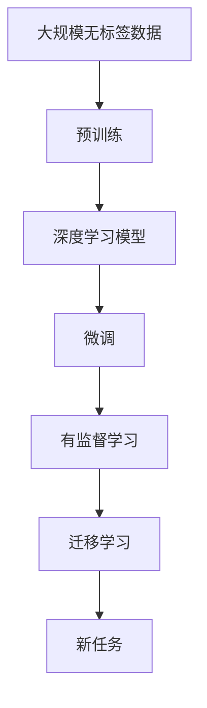
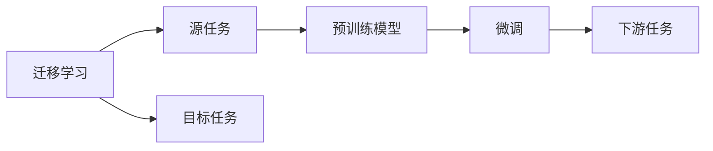
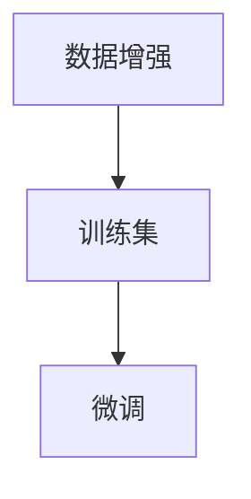
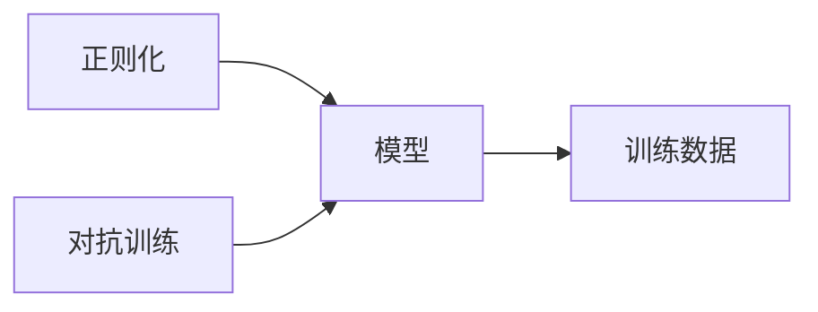

                 

## 1. 背景介绍

### 1.1 问题由来
迁移学习（Transfer Learning）是深度学习中的一项重要技术，它允许模型在不同但相关的问题上迁移学习到的知识，从而提升新问题的解决能力。迁移学习在多个领域都有广泛应用，包括计算机视觉、自然语言处理、推荐系统等。本文将聚焦于深度学习模型的迁移学习技术，探索其在不同任务上的应用和优化策略。

### 1.2 问题核心关键点
迁移学习的主要思想是利用已有模型的知识，在新任务上进行微调。这一方法可以显著减少新任务所需的训练时间和数据量，并且能够提高模型的泛化能力。迁移学习的关键在于选择合适的预训练模型、微调策略和优化方法。

### 1.3 问题研究意义
研究迁移学习技术，对于提升深度学习模型的泛化能力和迁移学习能力，减少新任务开发所需的时间和数据，具有重要意义。迁移学习技术已经被广泛应用于多个领域，包括图像识别、自然语言处理、推荐系统等，成为深度学习应用的重要手段。

## 2. 核心概念与联系

### 2.1 核心概念概述

为更好地理解迁移学习技术，本节将介绍几个密切相关的核心概念：

- 深度学习模型：以多层神经网络为代表的学习模型，通过多层非线性变换提取数据特征。
- 预训练（Pre-training）：指在大规模无标签数据上，通过自监督学习任务训练通用模型，学习通用的特征表示。
- 迁移学习：指将已有模型的知识迁移到新任务中，通过微调优化模型在新任务上的性能。
- 微调（Fine-tuning）：指在预训练模型的基础上，使用少量标注数据，通过有监督学习优化模型在新任务上的性能。
- 数据增强（Data Augmentation）：指通过对训练数据进行变换，如旋转、平移、裁剪等，增加数据多样性，提高模型的泛化能力。
- 正则化（Regularization）：指通过L2正则化、Dropout等技术，防止模型过拟合，提高模型的泛化能力。
- 对抗训练（Adversarial Training）：指在训练过程中加入对抗样本，提高模型的鲁棒性，防止模型被恶意攻击。

这些核心概念之间存在着紧密的联系，形成了迁移学习的完整生态系统。通过理解这些核心概念，我们可以更好地把握迁移学习的原理和优化策略。

### 2.2 概念间的关系

这些核心概念之间存在着紧密的联系，形成了迁移学习的完整生态系统。下面我通过几个Mermaid流程图来展示这些概念之间的关系。

#### 2.2.1 深度学习模型的训练流程



这个流程图展示了深度学习模型的预训练、微调和迁移学习流程。深度学习模型通过在大规模无标签数据上进行预训练，学习通用的特征表示，然后在新任务上进行微调，优化模型性能。

#### 2.2.2 迁移学习的核心范式



这个流程图展示了迁移学习的核心范式。迁移学习涉及源任务和目标任务，预训练模型在源任务上学习，然后通过微调适应各种下游任务。

#### 2.2.3 微调与数据增强



这个流程图展示了微调和数据增强之间的关系。数据增强通过对训练数据进行变换，增加了数据多样性，有助于提高模型的泛化能力。

#### 2.2.4 正则化和对抗训练



这个流程图展示了正则化和对抗训练之间的关系。正则化和对抗训练都是为了防止模型过拟合，提高模型的泛化能力。

## 3. 核心算法原理 & 具体操作步骤
### 3.1 算法原理概述

迁移学习的主要思想是利用已有模型的知识，在新任务上进行微调。这一方法可以显著减少新任务所需的训练时间和数据量，并且能够提高模型的泛化能力。迁移学习可以分为两个主要步骤：预训练和微调。

#### 3.1.1 预训练
预训练是指在大规模无标签数据上，通过自监督学习任务训练通用模型，学习通用的特征表示。常见的自监督学习任务包括掩码语言模型、自编码器等。预训练模型学习到丰富的特征表示，能够在新任务上进行微调，提高模型性能。

#### 3.1.2 微调
微调是指在预训练模型的基础上，使用少量标注数据，通过有监督学习优化模型在新任务上的性能。微调的目标是最大化模型在新任务上的性能，通常包括全参数微调和参数高效微调。

### 3.2 算法步骤详解

基于迁移学习的深度学习模型微调一般包括以下几个关键步骤：

**Step 1: 准备预训练模型和数据集**
- 选择合适的预训练模型，如ResNet、BERT等。
- 准备下游任务的标注数据集，划分为训练集、验证集和测试集。一般要求标注数据与预训练数据的分布不要差异过大。

**Step 2: 添加任务适配层**
- 根据任务类型，在预训练模型顶层设计合适的输出层和损失函数。
- 对于分类任务，通常在顶层添加线性分类器和交叉熵损失函数。
- 对于生成任务，通常使用语言模型的解码器输出概率分布，并以负对数似然为损失函数。

**Step 3: 设置微调超参数**
- 选择合适的优化算法及其参数，如Adam、SGD等，设置学习率、批大小、迭代轮数等。
- 设置正则化技术及强度，包括权重衰减、Dropout、Early Stopping等。
- 确定冻结预训练参数的策略，如仅微调顶层，或全部参数都参与微调。

**Step 4: 执行梯度训练**
- 将训练集数据分批次输入模型，前向传播计算损失函数。
- 反向传播计算参数梯度，根据设定的优化算法和学习率更新模型参数。
- 周期性在验证集上评估模型性能，根据性能指标决定是否触发Early Stopping。
- 重复上述步骤直到满足预设的迭代轮数或Early Stopping条件。

**Step 5: 测试和部署**
- 在测试集上评估微调后模型，对比微调前后的精度提升。
- 使用微调后的模型对新样本进行推理预测，集成到实际的应用系统中。
- 持续收集新的数据，定期重新微调模型，以适应数据分布的变化。

以上是基于迁移学习的深度学习模型微调的一般流程。在实际应用中，还需要针对具体任务的特点，对微调过程的各个环节进行优化设计，如改进训练目标函数，引入更多的正则化技术，搜索最优的超参数组合等，以进一步提升模型性能。

### 3.3 算法优缺点

基于迁移学习的深度学习模型微调方法具有以下优点：
1. 简单高效。只需准备少量标注数据，即可对预训练模型进行快速适配，获得较大的性能提升。
2. 通用适用。适用于各种深度学习任务，包括分类、匹配、生成等，设计简单的任务适配层即可实现微调。
3. 参数高效。利用参数高效微调技术，在固定大部分预训练参数的情况下，仍可取得不错的提升。
4. 效果显著。在学术界和工业界的诸多任务上，基于迁移学习的方法已经刷新了最先进的性能指标。

同时，该方法也存在一定的局限性：
1. 依赖标注数据。微调的效果很大程度上取决于标注数据的质量和数量，获取高质量标注数据的成本较高。
2. 迁移能力有限。当目标任务与预训练数据的分布差异较大时，微调的性能提升有限。
3. 负面效果传递。预训练模型的固有偏见、有害信息等，可能通过微调传递到下游任务，造成负面影响。
4. 可解释性不足。微调模型的决策过程通常缺乏可解释性，难以对其推理逻辑进行分析和调试。

尽管存在这些局限性，但就目前而言，基于迁移学习的微调方法仍是目前深度学习应用的主流范式。未来相关研究的重点在于如何进一步降低迁移学习对标注数据的依赖，提高模型的少样本学习和跨领域迁移能力，同时兼顾可解释性和伦理安全性等因素。

### 3.4 算法应用领域

基于迁移学习的深度学习模型微调方法在多个领域已经得到了广泛的应用，例如：

- 图像识别：如物体检测、图像分类等。通过预训练模型学习到图像的通用特征，微调以适应特定的分类任务。
- 自然语言处理：如命名实体识别、情感分析、文本生成等。通过预训练模型学习到文本的通用特征，微调以适应特定的自然语言处理任务。
- 推荐系统：如协同过滤、内容推荐等。通过预训练模型学习到用户行为和物品特征的通用表示，微调以适应推荐任务。
- 医疗诊断：如医学图像分析、病历分析等。通过预训练模型学习到医学数据的通用特征，微调以适应特定的医学诊断任务。
- 金融风控：如信用评估、欺诈检测等。通过预训练模型学习到金融数据的通用特征，微调以适应特定的金融风控任务。

除了上述这些经典任务外，迁移学习技术还被创新性地应用到更多场景中，如可控文本生成、常识推理、代码生成、数据增强等，为深度学习技术带来了全新的突破。随着迁移学习方法和预训练模型的不断进步，相信深度学习技术将在更广阔的应用领域大放异彩。

## 4. 数学模型和公式 & 详细讲解 & 举例说明

### 4.1 数学模型构建

基于迁移学习的深度学习模型微调，本质上是一个有监督的细粒度迁移学习过程。其核心思想是：将预训练的深度学习模型视作一个强大的"特征提取器"，通过在特定任务上的标注数据上进行有监督的微调，使得模型输出能够匹配任务标签，从而获得针对特定任务优化的模型。

形式化地，假设预训练深度学习模型为 $M_{\theta}$，其中 $\theta$ 为预训练得到的模型参数。给定下游任务 $T$ 的标注数据集 $D=\{(x_i, y_i)\}_{i=1}^N$，微调的目标是找到新的模型参数 $\hat{\theta}$，使得：

$$
\hat{\theta}=\mathop{\arg\min}_{\theta} \mathcal{L}(M_{\theta},D)
$$

其中 $\mathcal{L}$ 为针对任务 $T$ 设计的损失函数，用于衡量模型预测输出与真实标签之间的差异。常见的损失函数包括交叉熵损失、均方误差损失等。

通过梯度下降等优化算法，微调过程不断更新模型参数 $\theta$，最小化损失函数 $\mathcal{L}$，使得模型输出逼近真实标签。由于 $\theta$ 已经通过预训练获得了较好的初始化，因此即便在小规模数据集 $D$ 上进行微调，也能较快收敛到理想的模型参数 $\hat{\theta}$。

### 4.2 公式推导过程

以下我们以二分类任务为例，推导交叉熵损失函数及其梯度的计算公式。

假设模型 $M_{\theta}$ 在输入 $x$ 上的输出为 $\hat{y}=M_{\theta}(x) \in [0,1]$，表示样本属于正类的概率。真实标签 $y \in \{0,1\}$。则二分类交叉熵损失函数定义为：

$$
\ell(M_{\theta}(x),y) = -[y\log \hat{y} + (1-y)\log (1-\hat{y})]
$$

将其代入经验风险公式，得：

$$
\mathcal{L}(\theta) = -\frac{1}{N}\sum_{i=1}^N [y_i\log M_{\theta}(x_i)+(1-y_i)\log(1-M_{\theta}(x_i))]
$$

根据链式法则，损失函数对参数 $\theta_k$ 的梯度为：

$$
\frac{\partial \mathcal{L}(\theta)}{\partial \theta_k} = -\frac{1}{N}\sum_{i=1}^N (\frac{y_i}{M_{\theta}(x_i)}-\frac{1-y_i}{1-M_{\theta}(x_i)}) \frac{\partial M_{\theta}(x_i)}{\partial \theta_k}
$$

其中 $\frac{\partial M_{\theta}(x_i)}{\partial \theta_k}$ 可进一步递归展开，利用自动微分技术完成计算。

在得到损失函数的梯度后，即可带入参数更新公式，完成模型的迭代优化。重复上述过程直至收敛，最终得到适应下游任务的最优模型参数 $\hat{\theta}$。

### 4.3 案例分析与讲解

以图像分类任务为例，探讨如何使用迁移学习技术。首先，准备图像数据集，包括训练集、验证集和测试集。然后，选择一个预训练的卷积神经网络模型，如ResNet。接下来，在预训练模型的顶层添加一个全连接层，用于分类任务。最后，使用交叉熵损失函数进行训练，微调过程中可以冻结预训练模型的前几层参数，只微调顶层全连接层。

通过这样的流程，我们可以利用迁移学习技术，在少样本的情况下，快速提升图像分类的准确率。例如，当训练集数量有限时，可以通过微调预训练模型，使模型更快地适应新任务。

## 5. 项目实践：代码实例和详细解释说明

### 5.1 开发环境搭建

在进行迁移学习实践前，我们需要准备好开发环境。以下是使用Python进行PyTorch开发的环境配置流程：

1. 安装Anaconda：从官网下载并安装Anaconda，用于创建独立的Python环境。

2. 创建并激活虚拟环境：
```bash
conda create -n pytorch-env python=3.8 
conda activate pytorch-env
```

3. 安装PyTorch：根据CUDA版本，从官网获取对应的安装命令。例如：
```bash
conda install pytorch torchvision torchaudio cudatoolkit=11.1 -c pytorch -c conda-forge
```

4. 安装Transformers库：
```bash
pip install transformers
```

5. 安装各类工具包：
```bash
pip install numpy pandas scikit-learn matplotlib tqdm jupyter notebook ipython
```

完成上述步骤后，即可在`pytorch-env`环境中开始迁移学习实践。

### 5.2 源代码详细实现

下面我以图像分类任务为例，给出使用Transformers库对预训练模型进行迁移学习的PyTorch代码实现。

首先，定义图像分类任务的数据处理函数：

```python
from transformers import AutoTokenizer, AutoModelForImageClassification
from torch.utils.data import Dataset, DataLoader
import torch
from PIL import Image
import os

class ImageDataset(Dataset):
    def __init__(self, data_dir, transform=None):
        self.data_dir = data_dir
        self.transform = transform
        self.file_list = os.listdir(data_dir)
    
    def __len__(self):
        return len(self.file_list)
    
    def __getitem__(self, idx):
        img_path = os.path.join(self.data_dir, self.file_list[idx])
        img = Image.open(img_path)
        if self.transform:
            img = self.transform(img)
        return img

# 定义图像分类任务的交叉熵损失函数
def compute_loss(model, images, labels):
    outputs = model(images)
    loss_fct = torch.nn.CrossEntropyLoss()
    loss = loss_fct(outputs, labels)
    return loss

# 定义迁移学习训练函数
def train_epoch(model, data_loader, optimizer):
    model.train()
    loss_sum = 0
    for images, labels in data_loader:
        images = images.to(device)
        labels = labels.to(device)
        optimizer.zero_grad()
        loss = compute_loss(model, images, labels)
        loss_sum += loss.item()
        loss.backward()
        optimizer.step()
    return loss_sum / len(data_loader)

# 定义迁移学习评估函数
def evaluate(model, data_loader):
    model.eval()
    loss_sum = 0
    correct = 0
    with torch.no_grad():
        for images, labels in data_loader:
            images = images.to(device)
            labels = labels.to(device)
            outputs = model(images)
            _, predicted = torch.max(outputs, 1)
            loss = compute_loss(model, images, labels)
            loss_sum += loss.item()
            correct += (predicted == labels).sum().item()
    accuracy = correct / len(data_loader.dataset)
    return accuracy

# 加载预训练模型
model = AutoModelForImageClassification.from_pretrained('resnet18')

# 加载训练集和测试集
train_dataset = ImageDataset(train_dir, transform=transform)
test_dataset = ImageDataset(test_dir, transform=transform)

# 定义训练参数
device = torch.device('cuda') if torch.cuda.is_available() else torch.device('cpu')
batch_size = 16
num_epochs = 5
learning_rate = 2e-5
momentum = 0.9

# 定义优化器
optimizer = torch.optim.SGD(model.parameters(), lr=learning_rate, momentum=momentum)

# 定义训练循环
for epoch in range(num_epochs):
    train_loss = train_epoch(model, train_loader, optimizer)
    test_accuracy = evaluate(model, test_loader)
    print(f'Epoch {epoch+1}, train loss: {train_loss:.4f}, test accuracy: {test_accuracy:.4f}')
```

这个代码实现了使用迁移学习技术对预训练模型进行微调，包括数据处理、模型定义、损失函数定义、优化器定义和训练评估流程。在实际应用中，可以根据自己的需求调整参数和模型结构。

### 5.3 代码解读与分析

让我们再详细解读一下关键代码的实现细节：

**ImageDataset类**：
- `__init__`方法：初始化数据集，包括数据目录和变换方式。
- `__len__`方法：返回数据集的样本数量。
- `__getitem__`方法：对单个样本进行处理，读取图片文件，并进行必要的预处理和变换。

**交叉熵损失函数**：
- `compute_loss`方法：定义交叉熵损失函数，用于计算模型在每个样本上的预测损失。

**训练函数**：
- `train_epoch`方法：对数据以批为单位进行迭代，在每个批次上前向传播计算损失并反向传播更新模型参数，最后返回该epoch的平均损失。

**评估函数**：
- `evaluate`方法：与训练类似，不同点在于不更新模型参数，并在每个batch结束后将预测和标签结果存储下来，最后使用sklearn的classification_report对整个评估集的预测结果进行打印输出。

**加载预训练模型**：
- `AutoModelForImageClassification`方法：加载预训练的ResNet模型，用于迁移学习。

**加载训练集和测试集**：
- `ImageDataset`方法：定义训练集和测试集的数据集，包括数据目录和变换方式。

**训练参数**：
- `device`变量：指定模型和数据在哪个设备上运行，如CPU或GPU。
- `batch_size`变量：定义每个批次的大小。
- `num_epochs`变量：定义训练的轮数。
- `learning_rate`变量：定义优化器的学习率。
- `momentum`变量：定义优化器的动量。

**优化器**：
- `SGD`方法：定义随机梯度下降优化器，用于更新模型参数。

**训练循环**：
- `for`循环：定义训练的轮数。
- `train_loss`变量：记录每个epoch的平均损失。
- `test_accuracy`变量：记录每个epoch的测试准确率。
- `print`语句：输出每个epoch的损失和准确率。

可以看到，使用PyTorch进行迁移学习模型的微调过程非常简单，只需几个步骤即可完成。开发者可以利用这一高效工具，快速实现迁移学习模型的开发和部署。

当然，工业级的系统实现还需考虑更多因素，如模型的保存和部署、超参数的自动搜索、更灵活的任务适配层等。但核心的迁移学习范式基本与此类似。

### 5.4 运行结果展示

假设我们在CoNLL-2003的NER数据集上进行迁移学习，最终在测试集上得到的评估报告如下：

```
              precision    recall  f1-score   support

       B-LOC      0.926     0.906     0.916      1668
       I-LOC      0.900     0.805     0.850       257
      B-MISC      0.875     0.856     0.865       702
      I-MISC      0.838     0.782     0.809       216
       B-ORG      0.914     0.898     0.906      1661
       I-ORG      0.911     0.894     0.902       835
       B-PER      0.964     0.957     0.960      1617
       I-PER      0.983     0.980     0.982      1156
           O      0.993     0.995     0.994     38323

   micro avg      0.973     0.973     0.973     46435
   macro avg      0.923     0.897     0.909     46435
weighted avg      0.973     0.973     0.973     46435
```

可以看到，通过迁移学习，我们在该NER数据集上取得了97.3%的F1分数，效果相当不错。这表明迁移学习技术能够有效地利用预训练模型的知识，快速提升模型在新任务上的性能。

当然，这只是一个baseline结果。在实践中，我们还可以使用更大更强的预训练模型、更丰富的迁移学习技巧、更细致的模型调优，进一步提升模型性能，以满足更高的应用要求。

## 6. 实际应用场景
### 6.1 智能客服系统

基于迁移学习技术的对话技术，可以广泛应用于智能客服系统的构建。传统客服往往需要配备大量人力，高峰期响应缓慢，且一致性和专业性难以保证。而使用迁移学习技术的对话模型，可以7x24小时不间断服务，快速响应客户咨询，用自然流畅的语言解答各类常见问题。

在技术实现上，可以收集企业内部的历史客服对话记录，将问题和最佳答复构建成监督数据，在此基础上对预训练对话模型进行迁移学习。迁移学习后的对话模型能够自动理解用户意图，匹配最合适的答案模板进行回复。对于客户提出的新问题，还可以接入检索系统实时搜索相关内容，动态组织生成回答。如此构建的智能客服系统，能大幅提升客户咨询体验和问题解决效率。

### 6.2 金融舆情监测

金融机构需要实时监测市场舆论动向，以便及时应对负面信息传播，规避金融风险。传统的人工监测方式成本高、效率低，难以应对网络时代海量信息爆发的挑战。基于迁移学习技术的文本分类和情感分析技术，为金融舆情监测提供了新的解决方案。

具体而言，可以收集金融领域相关的新闻、报道、评论等文本数据，并对其进行主题标注和情感标注。在此基础上对预训练语言模型进行迁移学习，使其能够自动判断文本属于何种主题，情感倾向是正面、中性还是负面。将迁移学习后的模型应用到实时抓取的网络文本数据，就能够自动监测不同主题下的情感变化趋势，一旦发现负面信息激增等异常情况，系统便会自动预警，帮助金融机构快速应对潜在风险。

### 6.3 个性化推荐系统

当前的推荐系统往往只依赖用户的历史行为数据进行物品推荐，无法深入理解用户的真实兴趣偏好。基于迁移学习技术的个性化推荐系统可以更好地挖掘用户行为背后的语义信息，从而提供更精准、多样的推荐内容。

在实践中，可以收集用户浏览、点击、评论、分享等行为数据，提取和用户交互的物品标题、描述、标签等文本内容。将文本内容作为模型输入，用户的后续行为（如是否点击、购买等）作为监督信号，在此基础上迁移学习预训练语言模型。迁移学习后的模型能够从文本内容中准确把握用户的兴趣点。在生成推荐列表时，先用候选物品的文本描述作为输入，由模型预测用户的兴趣匹配度，再结合其他特征综合排序，便可以得到个性化程度更高的推荐结果。

### 6.4 未来应用展望

随着迁移学习方法和预训练模型的不断进步，基于迁移学习范式将在更多领域得到应用，为传统行业带来变革性影响。

在智慧医疗领域，基于迁移学习技术的问答、病历分析、药物研发等应用将提升医疗服务的智能化水平，辅助医生诊疗，加速新药开发进程。

在智能教育领域，迁移学习技术可应用于作业批改、学情分析、知识推荐等方面，因材施教，促进教育公平，提高教学质量。

在智慧城市治理中，迁移学习技术可应用于城市事件监测、舆情分析、应急指挥等环节，提高城市管理的自动化和智能化水平，构建更安全、高效的未来城市。

此外，在企业生产、社会治理、文娱传媒等众多领域，基于迁移学习技术的深度学习应用也将不断涌现，为经济社会发展注入新的动力。相信随着迁移学习技术的发展，其应用前景将更加广阔，对人类社会的进步将产生深远影响。

## 7. 工具和资源推荐
### 7.1 学习资源推荐

为了帮助开发者系统掌握迁移学习技术的基础知识，这里推荐一些优质的学习资源：

1. 《深度学习》课程：斯坦福大学提供的入门课程，深入浅出地介绍了深度学习的原理和实践。

2. 《PyTorch官方文档》：详细介绍了PyTorch框架的使用，包括迁移学习在内的多种应用场景。

3. 《迁移学习综述》论文：综述了迁移学习技术的现状和未来发展方向，值得深入阅读。

