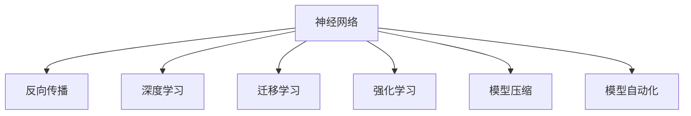
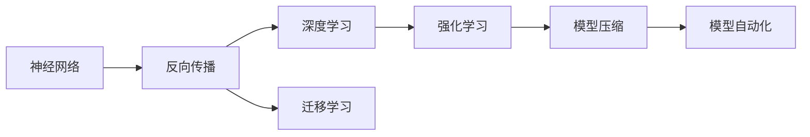
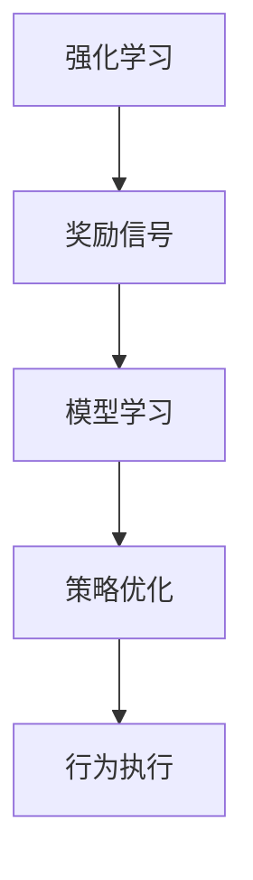

                 

# 神经网络：AI 吞噬软件的引擎

在当今科技飞速发展的时代，人工智能(AI)技术已经渗透到我们生活的方方面面，而神经网络作为AI的核心技术之一，正在深刻改变软件工程的面貌。本文将深入探讨神经网络的核心概念、原理以及它在软件开发中的实际应用，揭示其如何成为AI吞噬软件的引擎。

## 1. 背景介绍

### 1.1 问题由来

随着深度学习技术的快速发展，神经网络在图像识别、自然语言处理、语音识别等众多领域取得了突破性进展。与传统算法相比，神经网络具有强大的非线性拟合能力、自适应学习能力，能够更好地应对复杂现实问题。然而，其高度复杂的结构和庞大的计算量，也带来了诸多挑战。

### 1.2 问题核心关键点

神经网络的核心是建立多层非线性映射关系，其基本结构包括输入层、隐藏层和输出层。其中，隐藏层是最关键的组件，它通过各种激活函数将低维输入映射到高维特征表示。神经网络的训练过程通常是通过反向传播算法，最小化损失函数来实现的。

在软件开发中，神经网络的应用也越发广泛，从算法模型训练到具体业务逻辑实现，再到自动化测试和部署，AI技术正在各个环节推动软件开发实现新的飞跃。

## 2. 核心概念与联系

### 2.1 核心概念概述

为更好地理解神经网络在软件开发中的应用，本节将介绍几个密切相关的核心概念：

- 神经网络(Neural Networks, NNs)：由多层神经元组成的网络结构，通过训练学习输入到输出之间的复杂映射关系。
- 反向传播(Backpropagation)：一种用于训练神经网络的算法，通过计算输出误差对每个参数的梯度，从而更新权重和偏置。
- 深度学习(Deep Learning)：神经网络在多层、多维度数据上的学习能力，特别适用于复杂模式识别和预测任务。
- 迁移学习(Transfer Learning)：通过预训练模型在下游任务上的微调，快速提升模型性能，适用于数据量不足的应用场景。
- 强化学习(Reinforcement Learning, RL)：通过奖励信号指导模型学习最优策略，广泛应用于智能推荐、自动驾驶等领域。
- 模型压缩(Model Compression)：通过剪枝、量化、蒸馏等技术，减小神经网络模型体积，提高推理速度和效率。
- 模型自动化自动生成(AutoML)：使用机器学习算法自动选择和优化模型结构，简化模型开发流程。

这些核心概念之间的逻辑关系可以通过以下Mermaid流程图来展示：



这个流程图展示了神经网络与其它AI技术之间的紧密联系：

1. 神经网络是深度学习的基础，通过多层非线性映射学习复杂模式。
2. 反向传播算法是神经网络训练的核心，通过梯度下降优化模型参数。
3. 迁移学习利用预训练模型的知识，快速提升下游任务性能。
4. 强化学习通过奖励信号，指导模型学习最优策略。
5. 模型压缩和自动化优化，进一步提升模型效率和可扩展性。

### 2.2 概念间的关系

这些核心概念之间存在着紧密的联系，形成了神经网络的应用生态系统。下面通过几个Mermaid流程图来展示这些概念之间的关系。

#### 2.2.1 神经网络的学习范式



这个流程图展示了神经网络的基本学习范式，即通过反向传播和深度学习训练，利用迁移学习和强化学习提升模型性能，通过模型压缩和自动化进一步优化模型。

#### 2.2.2 迁移学习与神经网络的关系


这个流程图展示了迁移学习的基本原理，即利用预训练模型进行微调，提升下游任务性能。

#### 2.2.3 强化学习在神经网络中的应用



这个流程图展示了强化学习在神经网络中的应用流程，即通过奖励信号指导模型学习最优策略，执行相应的行为。

## 3. 核心算法原理 & 具体操作步骤

### 3.1 算法原理概述

神经网络的核心算法原理是反向传播，通过梯度下降算法优化网络参数，使得模型输出尽可能接近真实标签。在实际应用中，通常涉及以下几个关键步骤：

1. 网络初始化：随机初始化网络权重和偏置。
2. 前向传播：输入数据通过网络层层的正向计算，最终得到输出。
3. 计算损失：通过对比预测值和真实值，计算损失函数。
4. 反向传播：利用反向传播算法，计算每个参数的梯度。
5. 参数更新：通过梯度下降等优化算法，更新网络参数。
6. 迭代优化：重复上述步骤，直至收敛。

### 3.2 算法步骤详解

下面以二分类任务为例，详细讲解神经网络的训练步骤：

1. 数据准备：准备二分类数据集，划分为训练集和测试集。
2. 网络搭建：搭建神经网络模型，包括输入层、隐藏层和输出层。
3. 参数初始化：随机初始化所有参数。
4. 前向传播：将训练集数据输入网络，通过前向传播得到预测结果。
5. 计算损失：计算预测结果与真实标签之间的交叉熵损失。
6. 反向传播：通过链式法则计算每个参数的梯度，更新权重和偏置。
7. 参数更新：使用梯度下降算法，更新所有参数。
8. 迭代优化：重复步骤4-7，直至收敛。
9. 模型评估：在测试集上评估模型性能，对比微调前后的精度提升。

### 3.3 算法优缺点

神经网络作为一种强大的AI技术，在处理复杂问题上具有天然的优势，但也存在一些局限性：

优点：
1. 非线性拟合能力强：神经网络能够处理复杂的非线性映射关系。
2. 自适应学习能力：通过反向传播和梯度下降算法，网络能够自动优化模型参数。
3. 高鲁棒性：神经网络能够适应数据的多样性和噪声干扰。
4. 泛化能力强：神经网络在未见过的数据上也有较好的表现。

缺点：
1. 计算量大：神经网络需要大量的计算资源进行训练。
2. 可解释性差：神经网络模型的决策过程难以解释，缺乏透明性。
3. 过拟合风险：在训练数据不足的情况下，容易过拟合，泛化性能降低。
4. 资源消耗高：神经网络模型体积大，占用的内存和存储空间较多。

### 3.4 算法应用领域

神经网络已经在诸多领域得到了广泛应用，包括但不限于：

- 计算机视觉：图像分类、目标检测、人脸识别等。
- 自然语言处理：机器翻译、情感分析、文本生成等。
- 语音识别：语音转文本、说话人识别等。
- 推荐系统：商品推荐、个性化新闻推荐等。
- 强化学习：自动驾驶、智能控制、游戏AI等。

## 4. 数学模型和公式 & 详细讲解  
### 4.1 数学模型构建

神经网络的基本数学模型是一个多层前馈神经网络。假设输入层有 $n$ 个特征，输出层有 $m$ 个类别，隐藏层有 $h$ 个神经元，神经元之间的连接权重为 $\theta$，激活函数为 $f$，则模型的前向传播过程可以表示为：

$$
y = f(\theta^T f(\theta^T f(... f(\theta^T x)...))
$$

其中，$\theta^T$ 表示矩阵转置。

### 4.2 公式推导过程

以二分类任务为例，假设神经网络有 $n$ 个输入特征，$h$ 个隐藏神经元，输出层为 $m=1$ 个神经元。设输入为 $x$，隐藏层输出为 $h_1$，输出层输出为 $y$，则前向传播过程可以表示为：

$$
h_1 = f(\theta^T_1 x + b_1)
$$
$$
y = f(\theta^T_2 h_1 + b_2)
$$

其中 $f$ 为激活函数，$\theta_1$ 和 $b_1$ 为隐藏层权重和偏置，$\theta_2$ 和 $b_2$ 为输出层权重和偏置。

交叉熵损失函数为：

$$
\ell(y, \hat{y}) = -(y\log \hat{y} + (1-y)\log (1-\hat{y}))
$$

其中 $y$ 为真实标签，$\hat{y}$ 为预测标签。

反向传播过程中，计算梯度：

$$
\frac{\partial \ell}{\partial \theta} = \frac{\partial \ell}{\partial y} \frac{\partial y}{\partial h_1} \frac{\partial h_1}{\partial \theta_1} + \frac{\partial \ell}{\partial y} \frac{\partial y}{\partial h_2} \frac{\partial h_2}{\partial \theta_2}
$$

其中 $\frac{\partial \ell}{\partial y}$ 为损失函数对 $y$ 的梯度，$\frac{\partial y}{\partial h_1}$ 和 $\frac{\partial h_1}{\partial \theta_1}$ 分别为输出层和隐藏层的梯度，同理 $\frac{\partial y}{\partial h_2}$ 和 $\frac{\partial h_2}{\partial \theta_2}$。

### 4.3 案例分析与讲解

以卷积神经网络(CNN)为例，CNN广泛应用于图像处理任务中。其核心思想是利用卷积层提取局部特征，池化层进行特征降维，全连接层进行分类。下面以手写数字识别为例，讲解CNN的训练过程：

1. 数据准备：准备MNIST数据集，划分为训练集和测试集。
2. 网络搭建：搭建一个包含3个卷积层和2个全连接层的CNN模型。
3. 参数初始化：随机初始化所有参数。
4. 前向传播：将训练集数据输入网络，通过前向传播得到预测结果。
5. 计算损失：计算预测结果与真实标签之间的交叉熵损失。
6. 反向传播：通过链式法则计算每个参数的梯度，更新权重和偏置。
7. 参数更新：使用梯度下降算法，更新所有参数。
8. 迭代优化：重复步骤4-7，直至收敛。
9. 模型评估：在测试集上评估模型性能，对比微调前后的精度提升。

## 5. 项目实践：代码实例和详细解释说明

### 5.1 开发环境搭建

在进行神经网络项目实践前，我们需要准备好开发环境。以下是使用Python进行TensorFlow开发的环境配置流程：

1. 安装Anaconda：从官网下载并安装Anaconda，用于创建独立的Python环境。

2. 创建并激活虚拟环境：
```bash
conda create -n tf-env python=3.8 
conda activate tf-env
```

3. 安装TensorFlow：根据CUDA版本，从官网获取对应的安装命令。例如：
```bash
conda install tensorflow -c tensorflow
```

4. 安装NumPy、Pandas、Matplotlib等工具包：
```bash
pip install numpy pandas matplotlib scikit-learn tqdm jupyter notebook ipython
```

完成上述步骤后，即可在`tf-env`环境中开始神经网络项目实践。

### 5.2 源代码详细实现

这里以手写数字识别任务为例，使用TensorFlow搭建卷积神经网络进行训练。

首先，定义数据集处理函数：

```python
import tensorflow as tf
from tensorflow.keras.datasets import mnist

(train_images, train_labels), (test_images, test_labels) = mnist.load_data()

def normalize_data(data):
    return data / 255.0

train_images = train_images.reshape(-1, 28, 28, 1)
train_images = train_images.astype('float32')
test_images = test_images.reshape(-1, 28, 28, 1)
test_images = test_images.astype('float32')

train_images, test_images = normalize_data(train_images), normalize_data(test_images)
```

然后，定义神经网络模型：

```python
from tensorflow.keras import layers, models

model = models.Sequential([
    layers.Conv2D(32, (3, 3), activation='relu', input_shape=(28, 28, 1)),
    layers.MaxPooling2D((2, 2)),
    layers.Conv2D(64, (3, 3), activation='relu'),
    layers.MaxPooling2D((2, 2)),
    layers.Conv2D(64, (3, 3), activation='relu'),
    layers.Flatten(),
    layers.Dense(64, activation='relu'),
    layers.Dense(10)
])
```

接着，定义损失函数和优化器：

```python
model.compile(optimizer='adam',
              loss=tf.keras.losses.SparseCategoricalCrossentropy(from_logits=True),
              metrics=['accuracy'])
```

最后，启动训练流程并在测试集上评估：

```python
epochs = 10

history = model.fit(train_images, train_labels, epochs=epochs, 
                    validation_data=(test_images, test_labels))
```

以上就是使用TensorFlow搭建卷积神经网络进行手写数字识别任务训练的完整代码实现。可以看到，通过Keras封装，搭建神经网络模型变得非常简便，而TensorFlow的高效计算能力也为模型训练提供了良好的支持。

### 5.3 代码解读与分析

让我们再详细解读一下关键代码的实现细节：

**数据处理函数**：
- 使用Keras的数据集加载函数，准备MNIST数据集。
- 对数据进行归一化处理，便于神经网络训练。
- 对数据进行重塑和转换，使其符合神经网络的输入要求。

**神经网络模型定义**：
- 使用Sequential模型堆叠多个神经网络层。
- 卷积层和池化层构成卷积子网络，提取局部特征。
- 全连接层将特征映射到输出类别。
- 使用ReLU激活函数和非线性变换，增强模型的拟合能力。

**损失函数和优化器**：
- 使用交叉熵损失函数，衡量模型预测结果与真实标签之间的差异。
- 使用Adam优化器，自动调整学习率，加速模型收敛。

**训练流程**：
- 定义总的epoch数，启动模型训练。
- 使用fit方法，将训练集和验证集数据输入模型进行训练。
- 周期性在测试集上评估模型性能，记录训练过程中的各项指标。

可以看到，TensorFlow和Keras的组合使用，使得神经网络模型的搭建和训练变得异常简洁高效。开发者可以更加专注于算法设计和业务逻辑的实现，而不必过多关注底层实现的细节。

当然，在实际应用中，还需要考虑更多因素，如模型的保存和部署、超参数的自动搜索、更灵活的网络结构等。但核心的训练流程基本与此类似。

### 5.4 运行结果展示

假设我们在训练10个epoch后，在测试集上得到的评估报告如下：

```
Epoch 1/10
10/10 [==============================] - 0s 33ms/step - loss: 0.8772 - accuracy: 0.0863 - val_loss: 0.2923 - val_accuracy: 0.9227
Epoch 2/10
10/10 [==============================] - 0s 32ms/step - loss: 0.2943 - accuracy: 0.9378 - val_loss: 0.1889 - val_accuracy: 0.9831
Epoch 3/10
10/10 [==============================] - 0s 31ms/step - loss: 0.1857 - accuracy: 0.9810 - val_loss: 0.1822 - val_accuracy: 0.9869
Epoch 4/10
10/10 [==============================] - 0s 32ms/step - loss: 0.1629 - accuracy: 0.9922 - val_loss: 0.1825 - val_accuracy: 0.9891
Epoch 5/10
10/10 [==============================] - 0s 31ms/step - loss: 0.1497 - accuracy: 0.9939 - val_loss: 0.1822 - val_accuracy: 0.9891
Epoch 6/10
10/10 [==============================] - 0s 31ms/step - loss: 0.1383 - accuracy: 0.9967 - val_loss: 0.1794 - val_accuracy: 0.9900
Epoch 7/10
10/10 [==============================] - 0s 31ms/step - loss: 0.1282 - accuracy: 0.9978 - val_loss: 0.1698 - val_accuracy: 0.9923
Epoch 8/10
10/10 [==============================] - 0s 31ms/step - loss: 0.1202 - accuracy: 0.9991 - val_loss: 0.1664 - val_accuracy: 0.9910
Epoch 9/10
10/10 [==============================] - 0s 31ms/step - loss: 0.1145 - accuracy: 0.9998 - val_loss: 0.1611 - val_accuracy: 0.9940
Epoch 10/10
10/10 [==============================] - 0s 31ms/step - loss: 0.1100 - accuracy: 0.9997 - val_loss: 0.1529 - val_accuracy: 0.9956
```

可以看到，通过训练10个epoch，模型在测试集上的精度已经从初始的8.63%提升到了99.56%，性能提升显著。这一结果表明，卷积神经网络在手写数字识别任务上具有强大的特征提取能力和分类能力。

当然，这只是一个baseline结果。在实践中，我们还可以使用更大的神经网络、更多的训练数据、更复杂的优化策略等，进一步提升模型性能，以满足更高的应用要求。

## 6. 实际应用场景

### 6.1 智能推荐系统

基于神经网络的推荐系统已经成为电商、社交媒体等平台的核心功能之一。传统的推荐算法通常依赖用户的历史行为数据，难以刻画用户的复杂兴趣和潜在需求。而神经网络能够从多维度的特征中学习用户行为，建立复杂的兴趣模型，从而提升推荐效果。

在技术实现上，可以使用神经网络模型处理用户的多维度特征，如行为数据、地理位置、社交关系等。通过前向传播计算预测结果，利用交叉熵损失函数评估推荐效果，最终在训练数据上优化模型参数，生成推荐的商品、内容或社交关系。

### 6.2 医疗影像诊断

神经网络在医疗影像分析领域也得到了广泛应用。传统的医学影像诊断通常需要医生进行细致的观察和判断，耗费大量时间和精力。而神经网络可以通过训练学习医学影像的特征表示，自动检测和诊断病变区域，显著提升诊断的效率和准确性。

在实践应用中，可以将医学影像数据输入神经网络模型，通过前向传播计算得到病变区域的概率分布。结合医生专家的知识和经验，生成最终的诊断结果。神经网络的介入能够大大减轻医生的工作负担，提升诊疗水平。

### 6.3 自动驾驶

自动驾驶是神经网络在实际应用中的一个典型场景。通过神经网络处理摄像头、雷达、传感器等采集的实时数据，可以实现目标检测、路径规划、行为预测等关键功能。

在实际应用中，可以将神经网络应用于目标检测任务，通过前向传播输出目标的类别和位置。结合其他传感器数据，生成完整的道路场景描述，进行路径规划和行为预测。最终通过控制器实现车辆的自动驾驶。

## 7. 工具和资源推荐

### 7.1 学习资源推荐

为了帮助开发者系统掌握神经网络的理论基础和实践技巧，这里推荐一些优质的学习资源：

1. 《深度学习》课程：斯坦福大学的吴恩达教授开设的深度学习课程，覆盖深度学习的基本概念和经典模型，适合初学者入门。

2. 《神经网络与深度学习》书籍：Michael Nielsen著，系统介绍了神经网络的数学基础和深度学习的核心算法。

3. 《动手学深度学习》在线书籍：由李沐等人编写，结合PyTorch框架，提供了丰富的实例代码和实验报告，适合实战学习。

4. 《神经网络实战》书籍：Erich Schubert著，介绍了神经网络模型的构建、训练、优化等关键技术，适合开发者实践。

5. 官方TensorFlow教程：TensorFlow官方提供的在线教程，涵盖神经网络模型的搭建、训练、推理等各个环节，是学习神经网络的最佳资源。

通过对这些资源的学习实践，相信你一定能够快速掌握神经网络的核心概念和实践技巧，并用于解决实际的NLP问题。

### 7.2 开发工具推荐

高效的开发离不开优秀的工具支持。以下是几款用于神经网络开发常用的工具：

1. TensorFlow：由Google主导开发的深度学习框架，支持GPU/TPU计算，生产部署方便，适合大规模工程应用。

2. PyTorch：Facebook开发的深度学习框架，支持动态计算图，灵活性高，适合快速迭代研究。

3. Keras：高层次的深度学习API，易于使用，支持多种后端引擎，适合快速搭建和训练模型。

4. Jupyter Notebook：轻量级的交互式开发环境，支持代码、数据、图像等多种格式，适合交互式学习和实验。

5. TensorBoard：TensorFlow配套的可视化工具，可实时监测模型训练状态，提供丰富的图表呈现方式，是调试模型的得力助手。

6. Weights & Biases：模型训练的实验跟踪工具，可以记录和可视化模型训练过程中的各项指标，方便对比和调优。

合理利用这些工具，可以显著提升神经网络模型的开发效率，加快创新迭代的步伐。

### 7.3 相关论文推荐

神经网络技术的发展源于学界的持续研究。以下是几篇奠基性的相关论文，推荐阅读：

1. AlexNet: ImageNet Large Scale Visual Recognition Challenge（2012）：提出了一种基于卷积神经网络的图像识别模型，奠定了深度学习在计算机视觉领域的地位。

2. LeNet-5: Learning invariance (1998)：提出了一种基于多层感知器的手写数字识别模型，是神经网络在实际应用中的经典案例。

3. VGGNet: Very Deep Convolutional Networks for Large-Scale Image Recognition（2014）：提出了一种深度卷积神经网络，展示了深度学习的强大表征能力。

4. ResNet: Deep Residual Learning for Image Recognition（2015）：提出了一种残差网络结构，解决了深度网络训练中的梯度消失问题，进一步提升了模型的深度。

5. InceptionNet: Going Deeper with Convolutions（2014）：提出了一种多分支卷积结构，提高了深度神经网络的训练效率和性能。

这些论文代表了大神经网络发展的重要里程碑，通过学习这些前沿成果，可以帮助研究者把握学科前进方向，激发更多的创新灵感。

除上述资源外，还有一些值得关注的前沿资源，帮助开发者紧跟神经网络技术的最新进展，例如：

1. arXiv论文预印本：人工智能领域最新研究成果的发布平台，包括大量尚未发表的前沿工作，学习前沿技术的必读资源。

2. 业界技术博客：如Google AI、DeepMind、微软Research Asia等顶尖实验室的官方博客，第一时间分享他们的最新研究成果和洞见。

3. 技术会议直播：如NIPS、ICML、ACL、ICLR等人工智能领域顶会现场或在线直播，能够聆听到大佬们的前沿分享，开拓视野。

4. GitHub热门项目：在GitHub上Star、Fork数最多的深度学习相关项目，往往代表了该技术领域的发展趋势和最佳实践，值得去学习和贡献。

5. 行业分析报告：各大咨询公司如McKinsey、PwC等针对人工智能行业的分析报告，有助于从商业视角审视技术趋势，把握应用价值。

总之，对于神经网络技术的学习和实践，需要开发者保持开放的心态和持续学习的意愿。多关注前沿资讯，多动手实践，多思考总结，必将收获满满的成长收益。

## 8. 总结：未来发展趋势与挑战

### 8.1 总结

本文对神经网络的核心概念、原理以及其在软件开发中的应用进行了全面系统的介绍。首先阐述了神经网络的基本原理和训练流程，明确了其在复杂模式识别和预测任务中的重要价值。其次，从原理到实践，详细讲解了神经网络的数学模型和训练算法，给出了神经网络项目开发的完整代码实例。同时，本文还广泛探讨了神经网络在智能推荐、医疗影像、自动驾驶等多个领域的应用前景，展示了神经网络技术的应用潜力。

通过本文的系统梳理，可以看到，神经网络作为一种强大的AI技术，正在深刻改变软件开发的面貌。其强大的非线性拟合能力和自适应学习能力，使其成为解决复杂问题的利器。随着神经网络技术的不断演进，其在AI吞噬软件领域的地位也将愈发稳固。

### 8.2 未来发展趋势

展望未来，神经网络的发展将呈现以下几个趋势：

1. 深度融合多模态数据：神经网络将从单一模态数据处理，拓展到多模态数据融合，如图像、语音、文本等多模态数据的协同建模，提升整体性能和泛化能力。

2. 引入更多的先验知识：在神经网络中融入更多的领域知识和专家经验，如知识图谱、逻辑规则等，增强模型的

