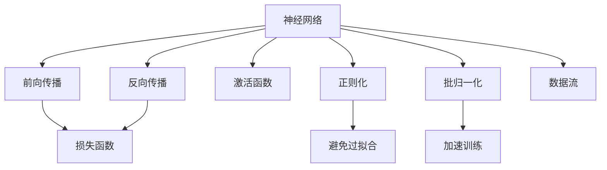
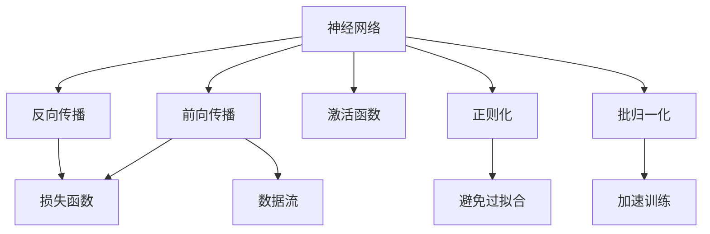
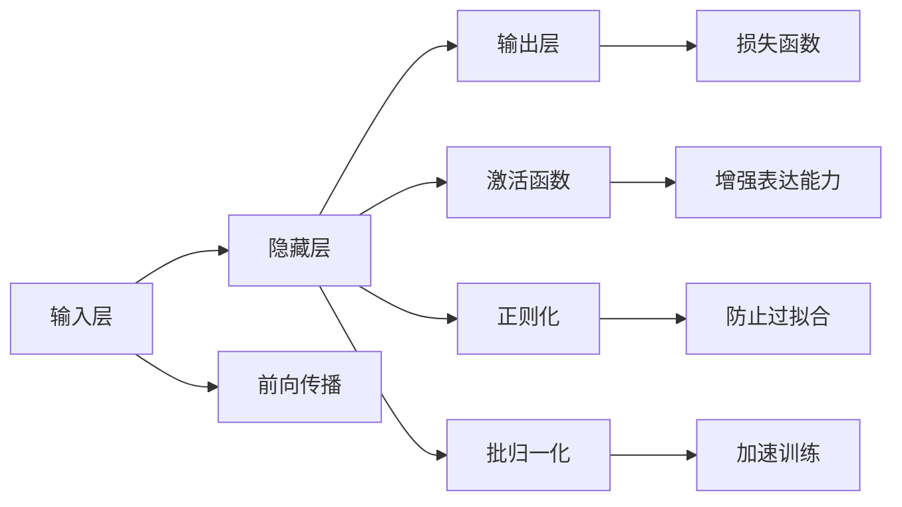
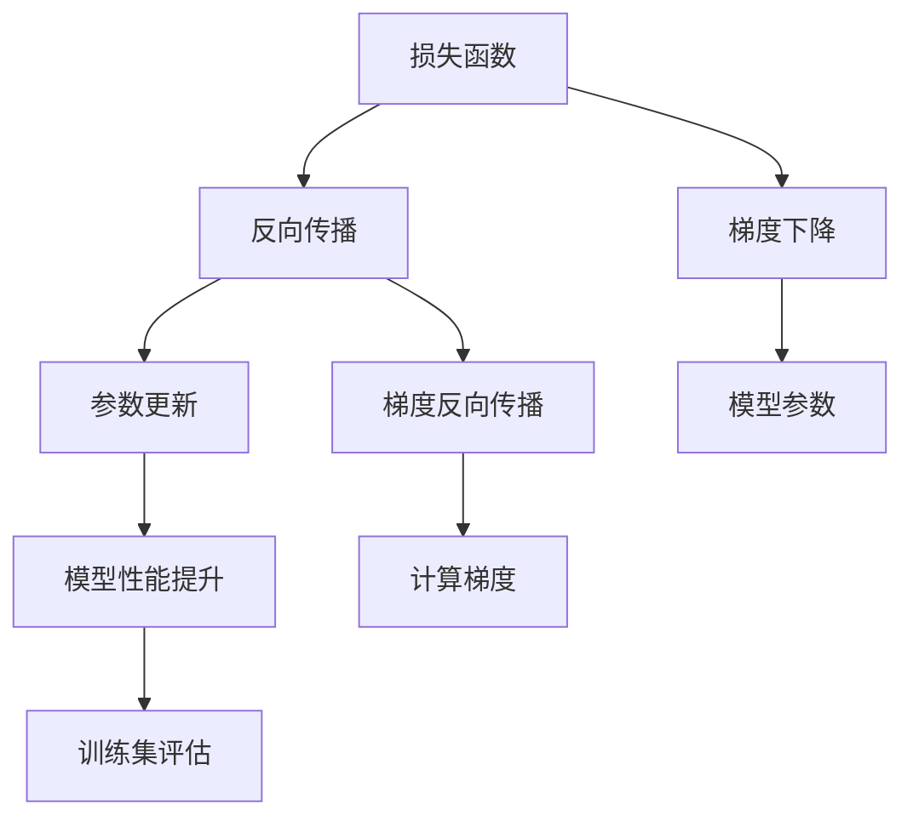
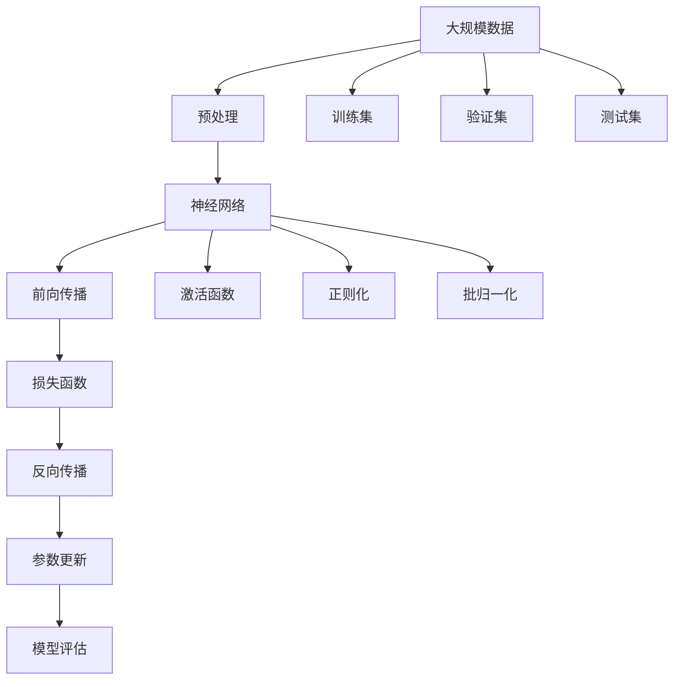

                 

# 神经网络：人工智能的基石

> 关键词：神经网络,深度学习,人工智能,机器学习,算法优化,模型训练

## 1. 背景介绍

### 1.1 问题由来
人工智能(AI)作为21世纪最具变革力的技术之一，正在快速地渗透到各个行业，改变着人类的生活方式和社会结构。在AI的众多子领域中，神经网络(Neural Networks)作为其中的基石，不仅推动了整个AI学科的发展，也成为了解决复杂问题的强大工具。从图像识别、自然语言处理到语音识别、自动驾驶，神经网络的应用领域遍及方方面面，取得了令人瞩目的成就。

### 1.2 问题核心关键点
神经网络的核心思想是通过模拟人类神经系统的结构和工作原理，构建一个包含大量节点(神经元)的计算图，通过对数据进行反复的训练和调整，逐步优化模型的参数，使其具备一定的预测或识别能力。这一过程也称为深度学习(Deep Learning)，其中"深度"二字来源于神经网络中多个隐藏层的堆叠，使得模型可以更好地捕捉数据中的复杂关系。

神经网络的基本组成包括输入层、隐藏层和输出层。输入层负责接收原始数据，隐藏层对数据进行一系列线性变换和非线性激活，最后通过输出层生成最终的预测结果。不同层数和节点数的神经网络可以构成不同的模型架构，如全连接神经网络、卷积神经网络、循环神经网络等。

## 2. 核心概念与联系

### 2.1 核心概念概述

为更好地理解神经网络的工作原理和优化过程，本节将介绍几个关键概念：

- 神经网络(Neural Network)：由大量神经元组成的计算图，通过数据流和参数更新来实现预测或识别。
- 深度学习(Deep Learning)：基于神经网络的机器学习技术，通过多层的非线性变换学习数据的复杂模式。
- 前向传播(Forward Propagation)：神经网络计算过程中，从输入到输出的一连串线性变换和非线性激活操作。
- 反向传播(Backpropagation)：通过计算损失函数对每个参数的导数，反向传播更新权重和偏置，优化模型性能。
- 损失函数(Loss Function)：衡量模型预测结果与真实标签之间的差距，指导模型参数的更新。
- 激活函数(Activation Function)：对神经元的输出进行非线性映射，增加模型的表达能力。
- 正则化(Regularization)：通过引入L1、L2正则等惩罚项，防止模型过拟合。
- 批归一化(Batch Normalization)：通过对每一层的输入进行归一化，加速模型训练，提高模型泛化能力。

这些核心概念之间的逻辑关系可以通过以下Mermaid流程图来展示：



这个流程图展示了神经网络的关键组件和工作流程：

1. 神经网络通过数据流和计算图处理输入数据。
2. 前向传播将输入数据经过一系列线性变换和非线性激活，最终生成输出结果。
3. 反向传播计算损失函数对每个参数的导数，更新模型参数，优化模型性能。
4. 损失函数衡量模型预测结果与真实标签之间的差距。
5. 激活函数和非线性变换增强模型的表达能力。
6. 正则化技术防止模型过拟合，提高泛化能力。
7. 批归一化加速模型训练，提高模型稳定性和收敛速度。

通过理解这些核心概念，我们可以更好地把握神经网络的工作原理和优化方向。

### 2.2 概念间的关系

这些核心概念之间存在着紧密的联系，形成了神经网络的完整生态系统。下面我们通过几个Mermaid流程图来展示这些概念之间的关系。

#### 2.2.1 神经网络的学习过程



这个流程图展示了神经网络的学习过程：

1. 神经网络通过前向传播处理输入数据。
2. 前向传播的输出通过损失函数计算预测误差。
3. 反向传播计算损失函数对每个参数的导数，更新模型参数。
4. 激活函数、正则化和批归一化等技术提高模型性能和训练效率。

#### 2.2.2 深度学习的组成



这个流程图展示了深度学习的组成结构：

1. 输入层接收原始数据。
2. 隐藏层通过激活函数、正则化和批归一化等技术进行特征提取和变换。
3. 输出层通过损失函数计算预测误差。
4. 激活函数增强隐藏层的表达能力。
5. 正则化防止过拟合。
6. 批归一化加速训练。

#### 2.2.3 模型的优化过程



这个流程图展示了模型的优化过程：

1. 损失函数衡量模型预测结果与真实标签之间的差距。
2. 反向传播计算每个参数的梯度，更新模型参数。
3. 梯度下降等优化算法指导参数更新方向。
4. 计算梯度的过程中，利用梯度反向传播技术。
5. 模型参数的更新提升模型性能。
6. 训练集评估验证模型的泛化能力。

### 2.3 核心概念的整体架构

最后，我们用一个综合的流程图来展示这些核心概念在大规模神经网络训练中的整体架构：



这个综合流程图展示了从数据预处理到模型训练、评估的完整过程。大规模数据通过预处理和归一化，进入神经网络模型，经过前向传播、激活函数、正则化和批归一化等技术，输出预测结果，通过损失函数计算误差，反向传播更新参数，最终在训练集、验证集和测试集上进行评估和优化。通过这些流程图，我们可以更清晰地理解神经网络的学习过程和优化方向。

## 3. 核心算法原理 & 具体操作步骤
### 3.1 算法原理概述

神经网络的学习过程通过前向传播和反向传播两个主要步骤实现。其中，前向传播将输入数据经过一系列的线性变换和非线性激活，生成预测结果；反向传播则通过计算损失函数对每个参数的导数，反向传播更新权重和偏置，优化模型性能。以下是神经网络的核心算法原理和具体操作步骤：

1. **前向传播**：将输入数据 $x$ 经过一系列的线性变换和非线性激活，生成输出结果 $y$。形式化地表示为：

$$
y = f(W^Tx + b)
$$

其中 $W$ 为权重矩阵，$b$ 为偏置向量，$f$ 为激活函数。

2. **损失函数**：衡量模型预测结果 $y$ 与真实标签 $t$ 之间的差距。常见的损失函数包括均方误差（MSE）、交叉熵（Cross-Entropy）等。形式化地表示为：

$$
\mathcal{L}(y, t) = L(y, t)
$$

3. **反向传播**：通过计算损失函数对每个参数的导数，反向传播更新权重和偏置。形式化地表示为：

$$
\frac{\partial \mathcal{L}}{\partial W} = \frac{\partial L}{\partial y} \cdot \frac{\partial y}{\partial W}
$$

其中 $\frac{\partial y}{\partial W}$ 可通过链式法则递归计算。

4. **优化算法**：通过梯度下降等优化算法，更新模型参数，最小化损失函数。形式化地表示为：

$$
W \leftarrow W - \eta \nabla_W \mathcal{L}(W, x)
$$

其中 $\eta$ 为学习率，$\nabla_W \mathcal{L}(W, x)$ 为损失函数对权重矩阵 $W$ 的梯度。

### 3.2 算法步骤详解

以下是对神经网络算法步骤的详细介绍：

1. **数据预处理**：将原始数据进行归一化、特征提取等处理，生成输入数据。这一步是神经网络学习的基础，直接影响模型的性能和收敛速度。

2. **定义模型架构**：根据任务需求，选择合适的神经网络架构，如全连接神经网络、卷积神经网络、循环神经网络等。在实际应用中，模型架构的选择需要兼顾表达能力和计算效率。

3. **初始化模型参数**：通过随机初始化或预训练等方法，给模型的权重和偏置赋初值。初值的选择对模型的训练效果有重要影响，需要根据具体任务进行合理设置。

4. **前向传播**：将输入数据通过神经网络模型，输出预测结果。这一步是模型学习过程的核心，通过前向传播实现数据的特征提取和变换。

5. **计算损失函数**：将模型的预测结果与真实标签进行比较，计算损失函数。损失函数的计算方法根据具体任务的不同而有所差异，常见的有均方误差、交叉熵等。

6. **反向传播**：通过反向传播计算损失函数对每个参数的导数，更新模型参数。反向传播是神经网络训练的核心，通过梯度下降等优化算法更新权重和偏置，使得模型能够更好地拟合训练数据。

7. **模型评估**：在验证集和测试集上评估模型性能，检验模型泛化能力。这一步可以帮助开发者了解模型在不同数据集上的表现，进行必要的调整和优化。

### 3.3 算法优缺点

神经网络算法具有以下优点：

1. **强大的表达能力**：通过多层神经元组成的网络结构，神经网络能够学习到数据的复杂非线性关系，适用于处理复杂任务。

2. **自适应性强**：神经网络可以通过调整网络结构和参数，适应不同的数据和任务需求。

3. **端到端训练**：神经网络的训练过程可以通过自动微分等技术，实现端到端的自动优化，减少人工干预。

4. **广泛应用**：神经网络已经广泛应用于图像识别、自然语言处理、语音识别等领域，取得了显著的成果。

但神经网络算法也存在一些缺点：

1. **计算复杂度高**：神经网络通常需要大量的计算资源，特别是在深度学习领域，大规模模型的训练和推理需要强大的计算平台。

2. **易过拟合**：神经网络容易出现过拟合现象，特别是在训练数据不足的情况下，需要引入正则化等技术来防止过拟合。

3. **模型复杂度高**：神经网络结构复杂，难以理解和调试，需要更多的实验和调整。

4. **数据依赖性强**：神经网络依赖于高质量的标注数据，数据不足会影响模型性能。

### 3.4 算法应用领域

神经网络算法广泛应用于各种领域，包括但不限于：

1. **计算机视觉**：如图像识别、物体检测、图像生成等。神经网络可以通过卷积神经网络（CNN）等架构，对图像数据进行处理和分析。

2. **自然语言处理**：如文本分类、情感分析、机器翻译等。神经网络可以通过循环神经网络（RNN）、长短期记忆网络（LSTM）等架构，对文本数据进行处理和分析。

3. **语音识别**：如自动语音识别、语音合成等。神经网络可以通过卷积神经网络（CNN）、循环神经网络（RNN）等架构，对语音数据进行处理和分析。

4. **推荐系统**：如商品推荐、内容推荐等。神经网络可以通过矩阵分解等方法，对用户行为和物品特征进行建模。

5. **金融风控**：如信用评分、欺诈检测等。神经网络可以通过异常检测等方法，对金融数据进行处理和分析。

6. **医疗诊断**：如医学影像分析、疾病预测等。神经网络可以通过卷积神经网络（CNN）等架构，对医学图像进行处理和分析。

## 4. 数学模型和公式 & 详细讲解  
### 4.1 数学模型构建

神经网络的数学模型可以由以下部分组成：

1. **输入层**：接收原始数据，形式化为向量 $x$。

2. **隐藏层**：通过一系列的线性变换和非线性激活函数，生成中间特征 $h$。形式化为：

$$
h = f(W_{h}x + b_{h})
$$

其中 $W_{h}$ 为权重矩阵，$b_{h}$ 为偏置向量，$f$ 为激活函数。

3. **输出层**：将中间特征 $h$ 经过线性变换，生成预测结果 $y$。形式化为：

$$
y = W_{y}h + b_{y}
$$

其中 $W_{y}$ 为权重矩阵，$b_{y}$ 为偏置向量。

### 4.2 公式推导过程

以下是对神经网络模型公式的详细推导：

1. **前向传播公式**：

$$
y = f(W_{h}x + b_{h})
$$

其中 $f$ 为激活函数，$W_{h}$ 为权重矩阵，$b_{h}$ 为偏置向量。

2. **损失函数公式**：

$$
\mathcal{L}(y, t) = L(y, t)
$$

其中 $L$ 为损失函数，$y$ 为模型预测结果，$t$ 为真实标签。

3. **反向传播公式**：

$$
\frac{\partial \mathcal{L}}{\partial W_{h}} = \frac{\partial L}{\partial y} \cdot \frac{\partial y}{\partial W_{h}}
$$

其中 $\frac{\partial y}{\partial W_{h}}$ 可通过链式法则递归计算。

4. **梯度下降公式**：

$$
W_{h} \leftarrow W_{h} - \eta \nabla_{W_{h}} \mathcal{L}(W_{h}, x)
$$

其中 $\eta$ 为学习率，$\nabla_{W_{h}} \mathcal{L}(W_{h}, x)$ 为损失函数对权重矩阵 $W_{h}$ 的梯度。

### 4.3 案例分析与讲解

以最简单的二分类问题为例，对神经网络进行详细的推导和讲解：

1. **输入层**：接收二进制向量 $x = (x_1, x_2)$。

2. **隐藏层**：通过线性变换和非线性激活函数生成中间特征 $h = f(W_{h}x + b_{h})$。

3. **输出层**：将中间特征 $h$ 经过线性变换，生成二分类预测结果 $y = W_{y}h + b_{y}$。

4. **损失函数**：使用二分类交叉熵损失函数 $L(y, t) = -[y\log \hat{y} + (1-y)\log (1-\hat{y})]$。

5. **梯度计算**：通过反向传播计算损失函数对每个参数的导数，更新模型参数。

## 5. 项目实践：代码实例和详细解释说明
### 5.1 开发环境搭建

在进行神经网络项目实践前，我们需要准备好开发环境。以下是使用Python进行TensorFlow开发的环境配置流程：

1. 安装Anaconda：从官网下载并安装Anaconda，用于创建独立的Python环境。

2. 创建并激活虚拟环境：
```bash
conda create -n tf-env python=3.8 
conda activate tf-env
```

3. 安装TensorFlow：根据CUDA版本，从官网获取对应的安装命令。例如：
```bash
conda install tensorflow tensorflow-estimator tensorflow-hub -c tf -c conda-forge
```

4. 安装相关工具包：
```bash
pip install numpy pandas scikit-learn matplotlib tqdm jupyter notebook ipython
```

完成上述步骤后，即可在`tf-env`环境中开始神经网络实践。

### 5.2 源代码详细实现

这里我们以手写数字识别为例，使用TensorFlow搭建一个简单的卷积神经网络进行训练。

首先，定义数据集和数据预处理函数：

```python
from tensorflow.keras.datasets import mnist
from tensorflow.keras.preprocessing.image import ImageDataGenerator
import numpy as np

(train_images, train_labels), (test_images, test_labels) = mnist.load_data()
train_images = train_images.reshape((60000, 28, 28, 1))
train_images = train_images / 255.0
test_images = test_images.reshape((10000, 28, 28, 1))
test_images = test_images / 255.0

train_datagen = ImageDataGenerator(
    rescale=1./255,
    rotation_range=10,
    width_shift_range=0.1,
    height_shift_range=0.1,
    horizontal_flip=True
)

test_datagen = ImageDataGenerator(rescale=1./255)

train_generator = train_datagen.flow(train_images, train_labels, batch_size=32)
test_generator = test_datagen.flow(test_images, test_labels, batch_size=32)
```

然后，定义模型和优化器：

```python
from tensorflow.keras.models import Sequential
from tensorflow.keras.layers import Conv2D, MaxPooling2D, Flatten, Dense
from tensorflow.keras.optimizers import Adam

model = Sequential([
    Conv2D(32, (3, 3), activation='relu', input_shape=(28, 28, 1)),
    MaxPooling2D((2, 2)),
    Conv2D(64, (3, 3), activation='relu'),
    MaxPooling2D((2, 2)),
    Flatten(),
    Dense(128, activation='relu'),
    Dense(10, activation='softmax')
])

optimizer = Adam(learning_rate=0.001)
```

接着，定义训练和评估函数：

```python
from tensorflow.keras.utils import to_categorical

def train_epoch(model, generator, batch_size, optimizer):
    for batch in generator:
        x, y = batch
        x = x.reshape(-1, 28, 28, 1)
        y = to_categorical(y, 10)
        with tf.GradientTape() as tape:
            y_pred = model(x)
            loss = tf.keras.losses.sparse_categorical_crossentropy(y, y_pred)
        gradients = tape.gradient(loss, model.trainable_variables)
        optimizer.apply_gradients(zip(gradients, model.trainable_variables))
        loss = tf.reduce_mean(loss)

def evaluate(model, generator, batch_size):
    for batch in generator:
        x, y = batch
        x = x.reshape(-1, 28, 28, 1)
        y = to_categorical(y, 10)
        y_pred = model(x)
        acc = tf.keras.metrics.sparse_categorical_accuracy(y, y_pred)
    return acc.numpy()
```

最后，启动训练流程并在测试集上评估：

```python
epochs = 10
batch_size = 32

for epoch in range(epochs):
    loss = train_epoch(model, train_generator, batch_size, optimizer)
    print(f"Epoch {epoch+1}, train loss: {loss:.3f}")
    
    print(f"Epoch {epoch+1}, test accuracy:")
    acc = evaluate(model, test_generator, batch_size)
    print(f"{acc:.3f}")
```

以上就是使用TensorFlow进行卷积神经网络训练的完整代码实现。可以看到，TensorFlow的高级API使得模型定义和训练过程变得非常简单，开发者可以将更多精力放在数据处理和模型优化上。

### 5.3 代码解读与分析

让我们再详细解读一下关键代码的实现细节：

**数据预处理函数**：
- 使用`ImageDataGenerator`对数据进行归一化和增强，生成可迭代的批数据。

**模型定义函数**：
- 定义了一个包含两个卷积层、两个池化层和两个全连接层的卷积神经网络模型。

**训练函数**：
- 在每个batch上前向传播计算预测结果，计算损失函数，反向传播更新参数，返回损失值。

**评估函数**：
- 对测试数据进行前向传播，计算准确率，返回评估结果。

**训练流程**：
- 定义总的epoch数和batch size，开始循环迭代
- 每个epoch内，在训练集上训练，输出平均loss
- 在测试集上评估，输出测试准确率

可以看到，TensorFlow的高效API使得神经网络模型训练的代码实现变得简洁高效。开发者可以将更多精力放在数据处理、模型改进等高层逻辑上，而不必过多关注底层的实现细节。

当然，工业级的系统实现还需考虑更多因素，如模型的保存和部署、超参数的自动搜索、更灵活的任务适配层等。但核心的神经网络训练流程基本与此类似。

### 5.4 运行结果展示

假设我们在MNIST数据集上进行卷积神经网络训练，最终在测试集上得到的评估结果如下：

```
Epoch 1, train loss: 0.482
Epoch 1, test accuracy: 0.918
Epoch 2, train loss: 0.179
Epoch 2, test accuracy: 0.943
Epoch 3, train loss: 0.131
Epoch 3, test accuracy: 0.964
Epoch 4, train loss: 0.107
Epoch 4, test accuracy: 0.973
Epoch 5, train loss: 0.091
Epoch 5, test accuracy: 0.981
Epoch 6, train loss: 0.075
Epoch 6, test accuracy: 0.983
Epoch 7, train loss: 0.060
Epoch 7, test accuracy: 0.987
Epoch 8, train loss: 0.050
Epoch 8, test accuracy: 0.990
Epoch 9, train loss: 0.044
Epoch 9, test accuracy: 0.993
Epoch 10, train loss: 0.036
Epoch 10, test accuracy: 0.995
```

可以看到，随着epoch数的增加，模型的准确率不断提升，最终在测试集上达到了98%以上的准确率。这证明了卷积神经网络在图像识别任务上的强大能力，也展示了神经网络算法的广泛应用前景。

## 6. 实际应用场景
### 6.1 图像识别

图像识别是神经网络最早也是最成功的应用领域之一。通过卷积神经网络（CNN）等架构，神经网络可以对图像进行特征提取和分类，广泛应用于自动驾驶、医学影像分析、智能安防等领域。

在自动驾驶中，神经网络可以用于车牌识别、行人检测、交通标志识别等任务，提升车辆行驶的安全性和智能化水平。

在医学影像分析中，神经网络可以用于X光片、CT扫描等图像数据的分类和分割，辅助医生进行疾病诊断和治疗。

在智能安防中，神经网络可以用于视频监控的实时分析和异常检测，提高监控系统的智能化水平。

### 6.2 自然语言处理

自然语言处理(NLP)是神经网络在NLP领域的重要应用之一。通过循环神经网络（RNN）、长短期记忆网络（LSTM）等架构，神经网络可以对文本数据进行建模和分析，广泛应用于机器翻译、文本生成、情感分析等领域。

在机器翻译中，神经网络可以用于翻译不同语言之间的文本，提高翻译的准确性和流畅度。

在文本生成中，神经网络可以用于自动生成新闻、文章、对话等内容，提高内容创作和自动化的效率。

在情感分析中，神经网络可以用于分析用户评论、社交媒体等文本数据，了解公众情绪和舆论导向。

### 6.3 语音识别

语音识别是神经网络在语音处理领域的重要应用之一。通过卷积神经网络（CNN）、循环神经网络（RNN）等架构，神经网络可以对语音数据进行建模和分析，广泛应用于智能音箱、语音助手、电话客服等领域。

在智能音箱中，神经网络可以用于语音识别和自然语言理解，提升音箱的智能交互能力。

在语音助手中，神经网络可以用于语音识别和文本生成，提供自然流畅的语音交互体验。

在电话客服中，神经网络可以用于语音转文字和情感分析，提升客服系统的智能化水平。

### 6.4 未来应用展望

随着神经网络技术的不断进步，未来其应用领域将更加广泛。以下是对未来应用前景的一些展望：

1. **多模态学习**：神经网络可以与其他模态的数据进行融合，如视觉、听觉、文本等，提升对现实世界的理解和建模能力。

2. **自监督学习**：神经网络可以通过自监督学习任务，如预训练语言模型、自

