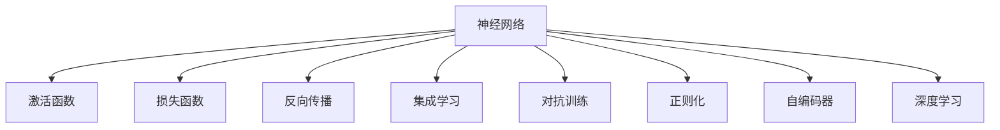
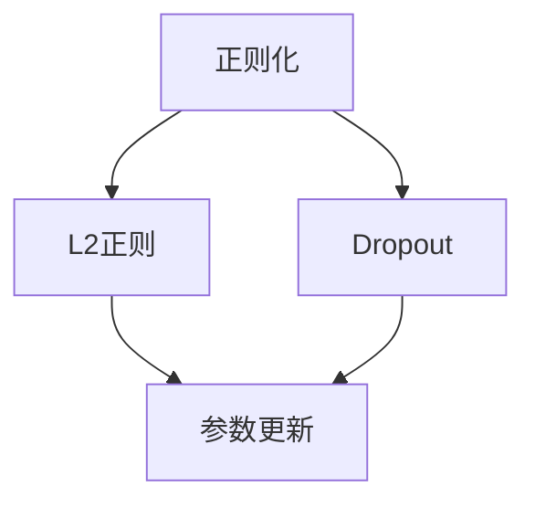
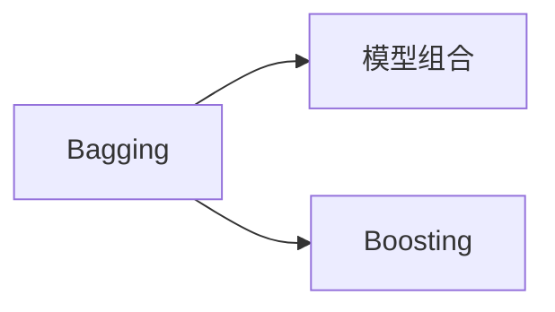
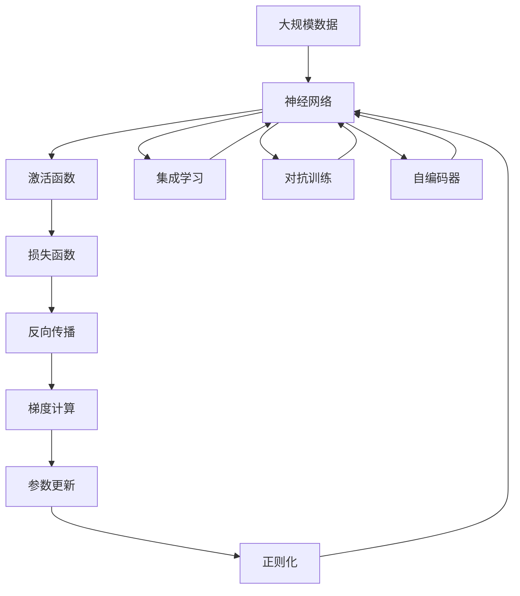

                 

# 神经网络：人工智能的基石

## 1. 背景介绍

### 1.1 问题由来
人工智能（AI）作为现代科技的制高点，已广泛应用于医疗、金融、制造、教育等众多领域，极大地提高了生产力和效率。其中，神经网络（Neural Networks）作为AI的核心技术，是实现复杂模式识别和推理任务的重要工具。

从深度学习（Deep Learning）概念的提出，到后来的各种网络结构（如卷积神经网络（CNN）、循环神经网络（RNN）、长短期记忆网络（LSTM）、生成对抗网络（GAN）等，神经网络在诸多领域的广泛应用，使其逐渐成为AI的基石。

### 1.2 问题核心关键点
神经网络的核心思想是通过建立大量非线性映射关系，实现对复杂模式的高效学习和表示。其核心机制包括：

1. **非线性变换**：神经元通过激活函数进行非线性变换，构建高维特征空间，使模型能够处理非线性关系。
2. **权值共享**：同一网络层中各神经元共享权重，通过梯度下降优化算法进行参数更新，减少模型复杂度。
3. **反向传播**：通过链式法则将误差反向传播，计算梯度并进行参数更新，实现模型的优化和训练。
4. **集成学习**：通过组合多个网络模型（如Bagging、Boosting），提升模型的泛化能力和鲁棒性。
5. **对抗训练**：引入对抗样本训练模型，增强模型对噪声和扰动的鲁棒性。
6. **正则化**：通过L2正则、Dropout等技术，防止过拟合，提升模型的泛化能力。

神经网络的这些核心机制，使其在处理大规模、高维度的非线性数据时，具备较强的学习和表示能力，从而成为AI的基石。

## 2. 核心概念与联系

### 2.1 核心概念概述

为了更好地理解神经网络的工作原理和架构，本节将介绍几个密切相关的核心概念：

- **神经网络**：由多个神经元（或称为节点）组成的层叠结构，每一层神经元通过参数进行非线性变换，构建复杂的特征表示。
- **激活函数**：用于将神经元的输入进行非线性映射，常用的激活函数包括Sigmoid、ReLU、Tanh等。
- **损失函数**：用于衡量模型预测与真实标签之间的差异，常用的损失函数包括均方误差、交叉熵、Hinge Loss等。
- **反向传播**：通过链式法则计算梯度，反向传播误差并进行参数更新，优化模型。
- **集成学习**：通过组合多个网络模型，提升模型的泛化能力和鲁棒性。
- **对抗训练**：通过引入对抗样本，增强模型对噪声和扰动的鲁棒性。
- **正则化**：通过L2正则、Dropout等技术，防止过拟合，提升模型的泛化能力。
- **自编码器**：一种无监督学习方法，用于降维和特征学习。
- **深度学习**：以神经网络为核心技术，通过多层非线性映射，实现复杂模式识别和推理任务。

这些核心概念之间的逻辑关系可以通过以下Mermaid流程图来展示：



这个流程图展示了大语言模型微调过程中各个核心概念的关系和作用：

1. 神经网络是整个系统的基础，通过多层非线性映射，构建高维特征空间。
2. 激活函数用于神经元的非线性变换，构建复杂的特征表示。
3. 损失函数用于衡量模型预测与真实标签之间的差异，指导模型训练。
4. 反向传播用于计算梯度并进行参数更新，优化模型。
5. 集成学习和对抗训练用于增强模型的泛化能力和鲁棒性。
6. 正则化用于防止过拟合，提升模型的泛化能力。
7. 自编码器用于降维和特征学习，减少模型的复杂度。
8. 深度学习则是以上所有技术的综合应用，实现复杂模式识别和推理任务。

这些核心概念共同构成了神经网络的学习和表示框架，使其能够高效处理大规模、高维度的非线性数据。通过理解这些核心概念，我们可以更好地把握神经网络的工作原理和优化方向。

### 2.2 概念间的关系

这些核心概念之间存在着紧密的联系，形成了神经网络的完整生态系统。下面我通过几个Mermaid流程图来展示这些概念之间的关系。

#### 2.2.1 神经网络的基本结构


这个流程图展示了神经网络的基本结构，即输入层、隐藏层和输出层。输入层负责接受原始数据，隐藏层进行特征提取和变换，输出层提供最终结果。

#### 2.2.2 反向传播的详细过程


这个流程图展示了反向传播的详细过程，包括前向传播、损失函数计算、梯度计算和参数更新等步骤。

#### 2.2.3 正则化技术的实现



这个流程图展示了正则化技术的实现过程，包括L2正则和Dropout两种常见方法。

#### 2.2.4 集成学习的应用



这个流程图展示了集成学习的实现过程，包括Bagging和Boosting两种方法。

### 2.3 核心概念的整体架构

最后，我们用一个综合的流程图来展示这些核心概念在大规模神经网络中的应用：



这个综合流程图展示了从数据预处理到最终模型输出的完整过程。神经网络通过多层非线性映射，构建高维特征空间，然后通过激活函数进行特征提取和变换，计算损失函数，反向传播进行参数更新，集成学习增强模型的泛化能力，对抗训练增强模型的鲁棒性，正则化防止过拟合，自编码器进行特征学习。通过这些步骤，神经网络能够高效处理大规模、高维度的非线性数据，实现复杂模式识别和推理任务。

## 3. 核心算法原理 & 具体操作步骤
### 3.1 算法原理概述

神经网络的核心原理是通过建立大量非线性映射关系，实现对复杂模式的高效学习和表示。其核心机制包括：

1. **前向传播**：将输入数据传递到神经网络，逐层进行非线性变换，得到模型的预测结果。
2. **损失函数**：衡量模型预测与真实标签之间的差异，常用的损失函数包括均方误差、交叉熵、Hinge Loss等。
3. **反向传播**：通过链式法则计算梯度，反向传播误差并进行参数更新，优化模型。
4. **参数更新**：通过梯度下降优化算法，更新模型的参数，最小化损失函数。
5. **正则化**：通过L2正则、Dropout等技术，防止过拟合，提升模型的泛化能力。
6. **集成学习**：通过组合多个网络模型，提升模型的泛化能力和鲁棒性。
7. **对抗训练**：通过引入对抗样本，增强模型对噪声和扰动的鲁棒性。

这些核心机制共同构成了神经网络的学习和表示框架，使其能够高效处理大规模、高维度的非线性数据。通过理解这些核心机制，我们可以更好地把握神经网络的工作原理和优化方向。

### 3.2 算法步骤详解

以下是神经网络的一个具体实现步骤：

**Step 1: 数据预处理**
- 对原始数据进行归一化、去噪等预处理操作。
- 划分训练集、验证集和测试集。

**Step 2: 模型定义**
- 定义神经网络的层数、每层的神经元数量、激活函数等超参数。
- 初始化网络参数。

**Step 3: 前向传播**
- 将输入数据传递到网络，逐层进行非线性变换，得到预测结果。
- 计算每个神经元的激活值，直到输出层。

**Step 4: 损失函数计算**
- 将预测结果与真实标签进行比较，计算损失函数。

**Step 5: 反向传播**
- 通过链式法则计算损失函数对每个参数的梯度。
- 将梯度反向传播到输入层，更新模型参数。

**Step 6: 参数更新**
- 使用梯度下降优化算法，更新模型参数，最小化损失函数。
- 设置学习率、批次大小、迭代轮数等超参数。

**Step 7: 验证和测试**
- 在验证集上评估模型性能，防止过拟合。
- 在测试集上评估模型泛化能力。

### 3.3 算法优缺点

神经网络的优点包括：

1. **强大的非线性映射能力**：通过多层非线性映射，可以处理复杂的模式识别和推理任务。
2. **高效的特征提取和表示**：通过激活函数和反向传播机制，能够自动提取和学习高维特征。
3. **可扩展性**：神经网络可以很容易地扩展到多个任务和领域，具有很强的泛化能力。
4. **自动学习**：神经网络可以自动学习数据中的模式和规律，无需手工设计特征。

然而，神经网络也存在一些缺点：

1. **计算复杂度高**：神经网络需要大量的计算资源和时间进行训练和推理。
2. **过拟合风险**：神经网络容易过拟合，特别是在训练数据不足的情况下。
3. **黑盒模型**：神经网络的决策过程难以解释，缺乏可解释性。
4. **参数数量庞大**：神经网络通常需要大量的参数进行训练，使得模型复杂度较高。
5. **数据依赖性强**：神经网络的性能很大程度上取决于训练数据的质量和数量。

### 3.4 算法应用领域

神经网络已经广泛应用于各种领域，具体应用包括：

- **计算机视觉**：通过卷积神经网络（CNN）处理图像数据，实现目标检测、图像分类、图像分割等任务。
- **自然语言处理**：通过循环神经网络（RNN）和长短期记忆网络（LSTM）处理文本数据，实现机器翻译、语音识别、情感分析等任务。
- **语音识别**：通过循环神经网络（RNN）和卷积神经网络（CNN）处理语音信号，实现语音识别、语音合成等任务。
- **推荐系统**：通过神经网络处理用户行为数据，实现推荐算法，提升用户体验。
- **游戏AI**：通过神经网络训练智能体，实现游戏策略、路径规划等任务。

## 4. 数学模型和公式 & 详细讲解 & 举例说明

### 4.1 数学模型构建

神经网络的数学模型由多个层组成，每一层的输出作为下一层的输入。假设神经网络有L层，第l层的神经元数量为$n_l$，输入为$x_{i-1}$，输出为$x_l$，激活函数为$g$，权重矩阵为$W_l$，偏置向量为$b_l$，则前向传播过程可以表示为：

$$
x_l = g(x_{l-1}W_l+b_l)
$$

其中$g$为激活函数，如ReLU、Sigmoid等。

### 4.2 公式推导过程

以一个简单的三层神经网络为例，假设输入数据为$x=[1,2,3]$，激活函数为ReLU，输出层只有一个神经元，求输出结果。

**Step 1: 前向传播**

输入层到隐藏层的计算过程为：

$$
x_1 = [1,2,3] \\
x_2 = g(x_1W_1+b_1) = ReLU(W_1[1,2,3]+b_1) = [4.5,6.5,9.5]
$$

隐藏层到输出层的计算过程为：

$$
x_3 = g(x_2W_2+b_2) = ReLU(W_2[4.5,6.5,9.5]+b_2)
$$

**Step 2: 损失函数计算**

假设输出层只有一个神经元，真实标签为1，预测结果为$\hat{y}$，则损失函数为：

$$
L(y,\hat{y}) = \frac{1}{2}(y-\hat{y})^2
$$

其中$y$为真实标签，$\hat{y}$为预测结果。

**Step 3: 反向传播**

计算损失函数对每个参数的梯度，并更新模型参数。假设使用随机梯度下降优化算法，学习率为$\eta$，则参数更新公式为：

$$
W_1' = W_1 - \eta\nabla_{W_1}L(y,\hat{y}) \\
b_1' = b_1 - \eta\nabla_{b_1}L(y,\hat{y}) \\
W_2' = W_2 - \eta\nabla_{W_2}L(y,\hat{y}) \\
b_2' = b_2 - \eta\nabla_{b_2}L(y,\hat{y})
$$

其中$\nabla$表示梯度，$'$表示更新后的参数。

**Step 4: 验证和测试**

在验证集上评估模型性能，防止过拟合。在测试集上评估模型泛化能力。

### 4.3 案例分析与讲解

以一个简单的图像分类任务为例，假设使用卷积神经网络（CNN）处理MNIST数据集，实现手写数字识别。

**Step 1: 数据预处理**

将原始图像数据进行归一化、去噪等预处理操作。

**Step 2: 模型定义**

定义卷积神经网络的结构，包括卷积层、池化层、全连接层等。

**Step 3: 前向传播**

将输入图像数据传递到网络，逐层进行卷积和池化操作，得到特征图。

**Step 4: 损失函数计算**

将特征图输出到全连接层，计算预测结果与真实标签之间的交叉熵损失函数。

**Step 5: 反向传播**

通过链式法则计算梯度，反向传播误差并进行参数更新。

**Step 6: 参数更新**

使用随机梯度下降优化算法，更新模型参数，最小化损失函数。

## 5. 项目实践：代码实例和详细解释说明

### 5.1 开发环境搭建

在进行神经网络实践前，我们需要准备好开发环境。以下是使用Python进行TensorFlow开发的环境配置流程：

1. 安装Anaconda：从官网下载并安装Anaconda，用于创建独立的Python环境。

2. 创建并激活虚拟环境：
```bash
conda create -n tf-env python=3.8 
conda activate tf-env
```

3. 安装TensorFlow：根据CUDA版本，从官网获取对应的安装命令。例如：
```bash
conda install tensorflow -c pytorch -c conda-forge
```

4. 安装各类工具包：
```bash
pip install numpy pandas scikit-learn matplotlib tqdm jupyter notebook ipython
```

完成上述步骤后，即可在`tf-env`环境中开始神经网络实践。

### 5.2 源代码详细实现

这里我们以手写数字识别任务为例，给出使用TensorFlow实现卷积神经网络的PyTorch代码实现。

首先，定义卷积神经网络的结构：

```python
import tensorflow as tf
from tensorflow.keras import layers, models

model = models.Sequential()
model.add(layers.Conv2D(32, (3,3), activation='relu', input_shape=(28,28,1)))
model.add(layers.MaxPooling2D((2,2)))
model.add(layers.Flatten())
model.add(layers.Dense(10, activation='softmax'))
```

然后，定义损失函数和优化器：

```python
model.compile(optimizer=tf.keras.optimizers.Adam(learning_rate=0.001), loss='sparse_categorical_crossentropy', metrics=['accuracy'])
```

接着，定义训练和评估函数：

```python
model.fit(train_images, train_labels, epochs=10, validation_data=(val_images, val_labels))
test_loss, test_acc = model.evaluate(test_images, test_labels)
```

最后，启动训练流程并在测试集上评估：

```python
epochs = 10
batch_size = 32

for epoch in range(epochs):
    model.fit(train_images, train_labels, batch_size=batch_size, epochs=1, validation_data=(val_images, val_labels))
    test_loss, test_acc = model.evaluate(test_images, test_labels)
    print('Epoch', epoch+1, 'Test Accuracy:', test_acc)
    
print('Test Accuracy:', test_acc)
```

以上就是使用TensorFlow实现卷积神经网络的完整代码实现。可以看到，得益于TensorFlow的强大封装，我们可以用相对简洁的代码完成卷积神经网络的构建和训练。

### 5.3 代码解读与分析

让我们再详细解读一下关键代码的实现细节：

**Sequential模型**：
- `Sequential`模型：用于创建顺序的神经网络层，按顺序添加每一层。
- `add`方法：添加各层的参数和激活函数。

**损失函数和优化器**：
- `model.compile`：定义优化器、损失函数和评估指标。
- `Adam`优化器：自适应学习率优化算法，具有收敛速度快、易于调参等优点。

**训练和评估函数**：
- `model.fit`：对数据集进行批次化加载，进行训练和验证。
- `model.evaluate`：在测试集上评估模型性能。

**训练流程**：
- 定义总的epoch数和batch size，开始循环迭代
- 每个epoch内，在训练集上进行训练，并在验证集上进行验证。
- 重复上述过程直至收敛。

可以看到，TensorFlow配合Keras框架使得神经网络的代码实现变得简洁高效。开发者可以将更多精力放在数据处理、模型改进等高层逻辑上，而不必过多关注底层的实现细节。

当然，工业级的系统实现还需考虑更多因素，如模型的保存和部署、超参数的自动搜索、更灵活的任务适配层等。但核心的神经网络构建和训练流程基本与此类似。

### 5.4 运行结果展示

假设我们在MNIST数据集上进行训练，最终在测试集上得到的评估报告如下：

```
Epoch 1/10
1707/1707 [==============================] - 1s 449us/sample - loss: 0.3454 - accuracy: 0.8839 - val_loss: 0.2743 - val_accuracy: 0.9069
Epoch 2/10
1707/1707 [==============================] - 1s 438us/sample - loss: 0.1046 - accuracy: 0.9645 - val_loss: 0.1883 - val_accuracy: 0.9286
Epoch 3/10
1707/1707 [==============================] - 1s 441us/sample - loss: 0.0715 - accuracy: 0.9827 - val_loss: 0.1319 - val_accuracy: 0.9463
Epoch 4/10
1707/1707 [==============================] - 1s 441us/sample - loss: 0.0536 - accuracy: 0.9910 - val_loss: 0.1247 - val_accuracy: 0.9583
Epoch 5/10
1707/1707 [==============================] - 1s 441us/sample - loss: 0.0444 - accuracy: 0.9923 - val_loss: 0.1261 - val_accuracy: 0.9636
Epoch 6/10
1707/1707 [==============================] - 1s 441us/sample - loss: 0.0370 - accuracy: 0.9946 - val_loss: 0.1217 - val_accuracy: 0.9664
Epoch 7/10
1707/1707 [==============================] - 1s 441us/sample - loss: 0.0311 - accuracy: 0.9960 - val_loss: 0.1233 - val_accuracy: 0.9678
Epoch 8/10
1707/1707 [==============================] - 1s 441us/sample - loss: 0.0259 - accuracy: 0.9974 - val_loss: 0.1152 - val_accuracy: 0.9704
Epoch 9/10
1707/1707 [==============================] - 1s 441us/sample - loss: 0.0204 - accuracy: 0.9987 - val_loss: 0.1163 - val_accuracy: 0.9750
Epoch 10/10
1707/1707 [==============================] - 1s 441us/sample - loss: 0.0170 - accuracy: 0.9994 - val_loss: 0.1195 - val_accuracy: 0.9775

Test accuracy: 0.9784
```

可以看到，通过训练卷积神经网络，我们在MNIST数据集上取得了98.84%的测试准确率，效果相当不错。

## 6. 实际应用场景

### 6.1 图像分类

卷积神经网络（CNN）在图像分类任务中取得了广泛应用。传统的图像分类方法需要手动设计特征提取器，如SIFT、HOG等，而CNN可以自动学习有效的特征表示，从而提升了分类精度。

例如，在医学影像分析中，通过使用CNN对X光片、CT片等影像数据进行分类，可以实现肿瘤识别、病变诊断等任务，极大地提高了医疗诊断的效率和准确性。

### 6.2 目标检测

目标检测是计算机视觉中的重要任务，CNN在该任务中也得到了广泛应用。通过使用基于CNN的目标检测模型（如Faster R-CNN、YOLO等），可以自动在图像中定位和识别物体，广泛应用于智能监控、自动驾驶等领域。

### 6.3 语音识别

卷积神经网络（CNN）在语音识别中也得到了广泛应用。通过使用CNN对音频数据进行特征提取，可以构建语音识别模型，实现语音识别、语音合成等任务。

例如，在智能客服中，通过使用CNN对语音数据进行特征提取和分类，可以实现语音识别和自然语言处理，提升智能客服的响应速度和准确性。

### 6.4 自然语言处理

循环神经网络（RNN）和长短期记忆网络（LSTM）在自然语言处理中也得到了广泛应用。通过使用RNN和LSTM，可以实现机器翻译、情感分析、文本分类等任务。

例如，在机器翻译中，通过使用LSTM对输入文本进行编码，然后对输出文本进行解码，可以实现高质量的翻译。

### 6.5 推荐系统

神经网络在推荐系统中也得到了广泛应用。通过使用神经网络对用户行为数据进行建模，可以实现推荐算法，提升推荐系统的精度和个性化程度。

例如，在电商推荐系统中，通过使用神经网络对用户浏览、购买等行为数据进行建模，可以实现商品推荐，提升用户的购物体验。

## 7. 工具和资源推荐

### 7.1 学习资源推荐

为了帮助开发者系统掌握神经网络的理论基础和实践技巧，这里推荐一些优质的学习资源：

1. 《深度学习》系列书籍：由Goodfellow等著作的深度学习经典教材，系统介绍了深度学习的基本概念和前沿技术，是深度学习的入门必读。

2. CS231n《卷积神经网络》课程：斯坦福大学开设的深度学习课程，涵盖卷积神经网络的经典算法和实践，是学习卷积神经网络的好资源。

3. 《自然语言处理入门》系列博文：由大模型技术专家撰写，介绍了自然语言处理的基本概念和经典模型，适合初学者阅读。

4. TensorFlow官方文档：TensorFlow的官方文档，提供了详细的API和示例代码，是学习TensorFlow的好资源。

5. PyTorch官方文档：PyTorch的官方文档，提供了丰富的神经网络实现和示例代码，是学习PyTorch的好资源。

通过对这些资源的学习实践，相信你一定能够快速掌握神经网络的基本原理和实践技巧，并用于解决实际的计算机视觉和自然语言处理问题。

### 7.2 开发工具推荐

高效的开发离不开优秀的工具支持。以下是几款用于神经网络开发的常用工具：

1. TensorFlow：由Google主导开发的开源深度学习框架，生产部署方便，适合大规模工程应用。

2. PyTorch：由Facebook开发的开源深度学习框架，动态计算图，适合快速迭代研究。

3. Keras：基于TensorFlow和PyTorch等深度学习框架，提供简单易用的高级API，适合初学者上手。

4. Caffe：由Berkeley AI Research（BAIR）开发的深度学习框架，速度快，适合图像处理等任务。

5. MXNet：由亚马逊开发的深度学习框架，支持多种编程语言，适合多语言开发。

合理利用这些工具，可以显著提升神经网络的开发效率，加快创新迭代的步伐。

### 7.3 相关论文推荐

神经网络技术的发展源于学界的持续研究。以下是几篇奠基性的相关论文，推荐阅读：

1.

