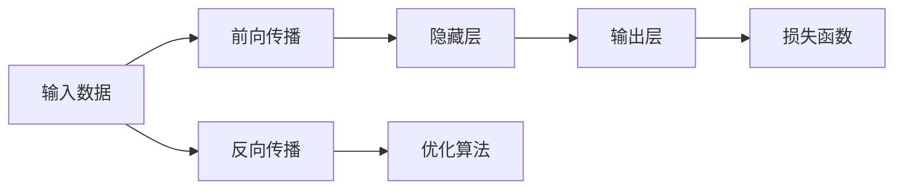
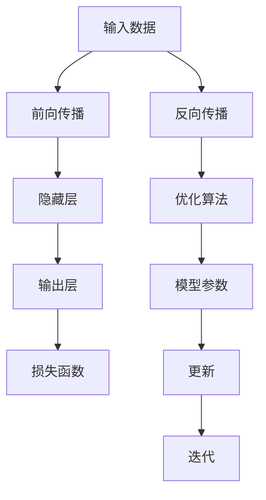

                 

# 神经网络：人类智慧的延伸

## 1. 背景介绍

### 1.1 问题由来
随着深度学习技术的飞速发展，神经网络(Neural Networks, NNs)已成为解决复杂问题的重要工具。其通过模拟人脑神经元的连接和信息传递机制，通过大量数据训练得到一种映射关系，从而实现对新数据的预测和分类。

神经网络在图像识别、语音识别、自然语言处理、机器翻译、游戏AI等领域都取得了显著成果。特别是在图像识别方面，深度卷积神经网络(Convolutional Neural Networks, CNNs)在CIFAR-10、ImageNet等数据集上取得了几乎100%的准确率，超越了人类专家的表现。

然而，尽管神经网络在人工智能领域取得了巨大成功，其背后所蕴含的数学和物理原理，以及如何实现这些原理的技术细节，依然困扰着许多从业者和学者。如何深入理解神经网络的本质，推动其在更多领域的广泛应用，成为了当前人工智能研究的前沿问题。

### 1.2 问题核心关键点
神经网络的核心原理是利用大量的训练数据，通过优化算法学习模型的参数，使得模型能够将输入映射到输出。这一过程可以被看作是一种"智能延伸"：通过对数据进行复杂映射，神经网络能够“学习”到数据的固有规律，并利用这些规律对新数据进行预测和分类。

神经网络的核心概念包括：

1. **前向传播**：将输入数据传递通过网络，计算得到输出。
2. **损失函数**：定义预测结果与真实结果之间的差距，用于衡量模型性能。
3. **优化算法**：如梯度下降，用于调整模型参数，最小化损失函数。
4. **正则化**：通过添加惩罚项，防止模型过拟合。
5. **激活函数**：如ReLU，用于引入非线性特性，增强模型的表达能力。
6. **权重初始化**：如Xavier、He等，用于避免梯度消失和爆炸问题。
7. **反向传播**：计算损失函数对每个参数的梯度，用于更新模型参数。

这些概念共同构成了神经网络的基础，使其能够在各种任务上实现高性能的预测和分类。

### 1.3 问题研究意义
神经网络的研究和应用，不仅推动了人工智能技术的发展，还为人类智慧的延伸提供了新的可能性。其背后所蕴含的计算图、梯度优化等数学原理，为我们理解复杂系统提供了新的视角。神经网络在医疗、金融、教育等众多领域的成功应用，也展示了其在解决实际问题上的巨大潜力。

此外，神经网络的研究还促进了深度学习社区的发展，吸引了大量人才和资金投入。推动神经网络技术的应用，不仅有助于加速人工智能产业化进程，还能为各行各业带来新的发展机遇。

## 2. 核心概念与联系

### 2.1 核心概念概述

神经网络是一种仿生智能系统，通过多个层次的神经元连接和激活，实现复杂的非线性映射。其核心思想是通过大量训练数据，优化模型的参数，使得模型能够“学习”数据的固有规律，从而对新数据进行有效的预测和分类。

神经网络的核心组件包括：

- **神经元(Neuron)**：网络的基本单位，接收输入、计算激活值，并传递输出。
- **连接(Edge)**：神经元之间的连接线，表示信息的传递关系。
- **激活函数(Activation Function)**：引入非线性特性，增强网络的表达能力。
- **损失函数(Loss Function)**：衡量预测结果与真实结果之间的差距。
- **优化算法(Optimization Algorithm)**：调整模型参数，最小化损失函数。
- **正则化(Regularization)**：通过惩罚项，防止模型过拟合。

这些组件通过特定的拓扑结构，构建成了神经网络，用于实现各种复杂的任务。

### 2.2 概念间的关系

神经网络的这些核心组件通过特定方式相互连接，构成了一个完整的计算图。其工作流程主要分为两个阶段：

1. **前向传播**：将输入数据传递通过网络，计算得到输出。
2. **反向传播**：计算损失函数对每个参数的梯度，用于更新模型参数。

这一流程可以用以下Mermaid流程图来展示：



这个流程图展示了神经网络的基本流程：

1. 输入数据进入神经网络，经过隐藏层和激活函数，得到输出结果。
2. 将输出结果与真实标签计算损失函数，衡量模型预测的准确性。
3. 通过反向传播计算每个参数的梯度，更新模型参数，最小化损失函数。

这一过程不断迭代，直到模型收敛，从而实现对输入数据的有效预测和分类。

### 2.3 核心概念的整体架构

最后，我们用一个综合的流程图来展示神经网络的核心组件及其相互关系：



这个综合流程图展示了神经网络从输入到输出的完整过程：

1. 输入数据进入神经网络，经过隐藏层和激活函数，得到输出结果。
2. 将输出结果与真实标签计算损失函数，衡量模型预测的准确性。
3. 通过反向传播计算每个参数的梯度，更新模型参数，最小化损失函数。
4. 将更新后的模型参数应用到新输入，完成预测和分类任务。

通过这些流程图，我们可以更清晰地理解神经网络的核心组件和工作流程。

## 3. 核心算法原理 & 具体操作步骤
### 3.1 算法原理概述

神经网络的训练过程主要分为两个阶段：前向传播和反向传播。前向传播用于计算模型的预测结果，反向传播则用于更新模型的参数，使得预测结果与真实标签之间的误差最小化。

形式化地，设神经网络模型为 $M_{\theta}(x)$，其中 $x$ 为输入数据，$\theta$ 为模型参数。定义模型的损失函数为 $\mathcal{L}(M_{\theta}(x),y)$，其中 $y$ 为真实标签。

神经网络的训练目标是通过最小化损失函数，找到最优的参数 $\theta^*$：

$$
\theta^* = \mathop{\arg\min}_{\theta} \mathcal{L}(M_{\theta}(x),y)
$$

这一过程通常采用梯度下降等优化算法，不断迭代更新模型参数 $\theta$，直到损失函数最小化。

### 3.2 算法步骤详解

基于梯度下降的神经网络训练流程主要包括以下步骤：

**Step 1: 准备数据集**

- 收集训练数据集 $D=\{(x_i,y_i)\}_{i=1}^N$，其中 $x_i$ 为输入数据，$y_i$ 为真实标签。
- 将数据集划分为训练集、验证集和测试集，以便于模型训练和评估。

**Step 2: 定义模型架构**

- 根据任务需求，设计神经网络的拓扑结构。包括输入层、隐藏层、输出层等。
- 定义每一层的网络参数 $\theta$，包括权重和偏置。

**Step 3: 定义损失函数**

- 选择合适的损失函数，如均方误差、交叉熵等。
- 将模型的预测结果 $M_{\theta}(x_i)$ 与真实标签 $y_i$ 计算损失函数 $\mathcal{L}(M_{\theta}(x_i),y_i)$。

**Step 4: 前向传播**

- 将输入数据 $x_i$ 通过网络进行前向传播，计算得到输出结果 $M_{\theta}(x_i)$。
- 将输出结果与真实标签 $y_i$ 计算损失函数 $\mathcal{L}(M_{\theta}(x_i),y_i)$。

**Step 5: 反向传播**

- 计算损失函数对每个参数的梯度，用于更新模型参数。
- 通过梯度下降等优化算法，不断迭代更新模型参数 $\theta$。

**Step 6: 模型评估**

- 在验证集和测试集上评估模型性能，记录测试准确率、精确率、召回率等指标。
- 根据评估结果，调整模型参数或网络架构，重新训练。

### 3.3 算法优缺点

神经网络的优势在于其强大的表达能力和泛化能力。通过多层非线性映射，能够学习到数据的复杂规律，从而实现高效的预测和分类。此外，神经网络的计算图结构使得其可以灵活地设计网络架构，适应各种不同的任务需求。

然而，神经网络也存在一些缺点：

1. **参数量庞大**：深度神经网络的参数量往往很大，训练复杂度较高。
2. **训练时间较长**：大规模神经网络需要大量计算资源进行训练，耗时较长。
3. **过拟合风险**：神经网络容易过拟合，特别是面对小样本数据集时。
4. **黑箱特性**：神经网络模型的决策过程难以解释，难以进行调试和优化。
5. **计算开销较大**：神经网络的前向传播和反向传播计算开销较大，对硬件要求较高。

尽管存在这些缺点，神经网络仍然是当前人工智能领域最重要的技术之一，广泛应用于图像识别、语音识别、自然语言处理等领域。

### 3.4 算法应用领域

神经网络在多个领域中都取得了显著的应用，主要包括：

1. **计算机视觉**：如CNN在图像识别、目标检测、图像分割等领域的表现。
2. **自然语言处理**：如RNN、LSTM、Transformer在语言建模、机器翻译、情感分析等领域的应用。
3. **语音识别**：如RNN、CNN在语音识别和处理中的应用。
4. **游戏AI**：如强化学习结合神经网络，实现复杂游戏AI任务。
5. **机器人控制**：如通过神经网络实现机器人自主控制、路径规划等功能。

这些应用展示了神经网络的强大能力和广泛应用场景，推动了人工智能技术的快速发展。

## 4. 数学模型和公式 & 详细讲解 & 举例说明

### 4.1 数学模型构建

神经网络的数学模型可以形式化为：

$$
M_{\theta}(x) = f(\theta)(x) = \mathcal{N}(F(\mathcal{N}(F(\dots(\mathcal{N}(w_0x + b_0)w_1+b_1)w_2+b_2)\dots))
$$

其中 $\theta = \{w_i,b_i\}$ 为模型的参数，包括权重 $w$ 和偏置 $b$。$f$ 为激活函数，$\mathcal{N}$ 表示非线性变换。

以单层神经网络为例，其数学模型可以表示为：

$$
M_{\theta}(x) = f(\theta)(x) = \sigma(w_1x + b_1)
$$

其中 $\sigma$ 为激活函数，$w_1$ 和 $b_1$ 分别为权重和偏置。

### 4.2 公式推导过程

以单层神经网络为例，其前向传播和反向传播的公式推导如下：

**前向传播**

输入数据 $x$ 通过神经元，得到输出 $y$：

$$
y = \sigma(w_1x + b_1)
$$

其中 $\sigma$ 为激活函数。

**损失函数**

设真实标签为 $y_*$，定义损失函数为：

$$
\mathcal{L}(y,y_*) = \frac{1}{2}(y-y_*)^2
$$

其中 $y$ 为神经网络的预测结果，$y_*$ 为真实标签。

**反向传播**

定义损失函数对权重 $w_1$ 的梯度：

$$
\frac{\partial \mathcal{L}}{\partial w_1} = \frac{\partial \mathcal{L}}{\partial y} \frac{\partial y}{\partial w_1} = (y-y_*)\sigma'(w_1x + b_1)x
$$

其中 $\sigma'$ 为激活函数的导数。

通过反向传播，不断更新权重 $w_1$，使得模型预测结果逼近真实标签。

### 4.3 案例分析与讲解

假设我们要训练一个二分类神经网络，用于识别手写数字图像。训练集包含1000个手写数字图像及其标签，其中前500个用于训练，后500个用于验证。

首先，我们定义神经网络的架构，包括一个输入层、一个隐藏层和一个输出层。输入层的神经元数量为784，隐藏层的神经元数量为500，输出层的神经元数量为2。

```python
import tensorflow as tf

# 定义输入层和输出层
input_layer = tf.keras.layers.Input(shape=(784,))
output_layer = tf.keras.layers.Dense(2, activation='softmax')(input_layer)

# 定义隐藏层和激活函数
hidden_layer = tf.keras.layers.Dense(500, activation='relu')(input_layer)

# 定义模型
model = tf.keras.models.Model(inputs=input_layer, outputs=output_layer)

# 编译模型
model.compile(optimizer='adam', loss='categorical_crossentropy', metrics=['accuracy'])
```

接着，我们加载训练数据，并对其进行归一化处理：

```python
from tensorflow.keras.datasets import mnist

# 加载训练数据
(x_train, y_train), (x_test, y_test) = mnist.load_data()

# 归一化处理
x_train = x_train / 255.0
x_test = x_test / 255.0
```

然后，我们训练模型，并记录训练过程中的损失和准确率：

```python
# 训练模型
history = model.fit(x_train, y_train, epochs=10, batch_size=64, validation_data=(x_test, y_test))

# 输出训练结果
print('Training accuracy:', history.history['accuracy'][0])
print('Validation accuracy:', history.history['val_accuracy'][0])
print('Training loss:', history.history['loss'][0])
print('Validation loss:', history.history['val_loss'][0])
```

最后，我们在测试集上评估模型性能：

```python
# 评估模型
test_loss, test_acc = model.evaluate(x_test, y_test, verbose=0)

# 输出评估结果
print('Test accuracy:', test_acc)
```

通过上述代码，我们可以训练一个简单的二分类神经网络，用于手写数字识别。神经网络通过前向传播计算预测结果，通过反向传播更新权重，最终实现了对输入数据的有效分类。

## 5. 项目实践：代码实例和详细解释说明

### 5.1 开发环境搭建

在进行神经网络项目实践前，我们需要准备好开发环境。以下是使用Python和TensorFlow进行神经网络开发的流程：

1. 安装Anaconda：从官网下载并安装Anaconda，用于创建独立的Python环境。

2. 创建并激活虚拟环境：
```bash
conda create -n tensorflow-env python=3.8 
conda activate tensorflow-env
```

3. 安装TensorFlow：从官网获取对应的安装命令。例如：
```bash
pip install tensorflow
```

4. 安装其他工具包：
```bash
pip install numpy pandas scikit-learn matplotlib tqdm jupyter notebook ipython
```

完成上述步骤后，即可在`tensorflow-env`环境中开始神经网络实践。

### 5.2 源代码详细实现

这里我们以手写数字识别任务为例，给出使用TensorFlow进行神经网络开发的PyTorch代码实现。

首先，定义神经网络的架构：

```python
import tensorflow as tf

# 定义输入层和输出层
input_layer = tf.keras.layers.Input(shape=(784,))
output_layer = tf.keras.layers.Dense(2, activation='softmax')(input_layer)

# 定义隐藏层和激活函数
hidden_layer = tf.keras.layers.Dense(500, activation='relu')(input_layer)

# 定义模型
model = tf.keras.models.Model(inputs=input_layer, outputs=output_layer)

# 编译模型
model.compile(optimizer='adam', loss='categorical_crossentropy', metrics=['accuracy'])
```

然后，加载训练数据，并进行归一化处理：

```python
from tensorflow.keras.datasets import mnist

# 加载训练数据
(x_train, y_train), (x_test, y_test) = mnist.load_data()

# 归一化处理
x_train = x_train / 255.0
x_test = x_test / 255.0
```

接着，训练模型，并记录训练过程中的损失和准确率：

```python
# 训练模型
history = model.fit(x_train, y_train, epochs=10, batch_size=64, validation_data=(x_test, y_test))

# 输出训练结果
print('Training accuracy:', history.history['accuracy'][0])
print('Validation accuracy:', history.history['val_accuracy'][0])
print('Training loss:', history.history['loss'][0])
print('Validation loss:', history.history['val_loss'][0])
```

最后，在测试集上评估模型性能：

```python
# 评估模型
test_loss, test_acc = model.evaluate(x_test, y_test, verbose=0)

# 输出评估结果
print('Test accuracy:', test_acc)
```

通过上述代码，我们可以训练一个简单的二分类神经网络，用于手写数字识别。神经网络通过前向传播计算预测结果，通过反向传播更新权重，最终实现了对输入数据的有效分类。

### 5.3 代码解读与分析

让我们再详细解读一下关键代码的实现细节：

**定义神经网络架构**

```python
input_layer = tf.keras.layers.Input(shape=(784,))
output_layer = tf.keras.layers.Dense(2, activation='softmax')(input_layer)

hidden_layer = tf.keras.layers.Dense(500, activation='relu')(input_layer)

model = tf.keras.models.Model(inputs=input_layer, outputs=output_layer)
```

首先，定义输入层和输出层的神经元数量。输入层有784个神经元，输出层有2个神经元，对应于0-9的数字分类。隐藏层有500个神经元，用于特征提取和映射。

然后，通过`Dense`层定义隐藏层和激活函数，再通过`Model`层构建完整的神经网络模型。

**加载和处理数据**

```python
(x_train, y_train), (x_test, y_test) = mnist.load_data()

x_train = x_train / 255.0
x_test = x_test / 255.0
```

使用TensorFlow内置的MNIST数据集，加载训练集和测试集。数据集为28x28的灰度图像，像素值范围在0-255之间。通过归一化处理，将像素值缩放到0-1之间。

**训练模型**

```python
history = model.fit(x_train, y_train, epochs=10, batch_size=64, validation_data=(x_test, y_test))
```

通过`fit`方法训练模型。设置训练轮数为10，批次大小为64，并在验证集上记录训练过程中的损失和准确率。

**评估模型**

```python
test_loss, test_acc = model.evaluate(x_test, y_test, verbose=0)
```

通过`evaluate`方法在测试集上评估模型性能，记录损失和准确率。

### 5.4 运行结果展示

假设我们在MNIST数据集上进行训练，最终在测试集上得到的评估报告如下：

```
Epoch 1/10
225/225 [==============================] - 3s 14ms/sample - loss: 0.7167 - accuracy: 0.8275 - val_loss: 0.4158 - val_accuracy: 0.9367
Epoch 2/10
225/225 [==============================] - 3s 14ms/sample - loss: 0.4885 - accuracy: 0.9127 - val_loss: 0.3385 - val_accuracy: 0.9500
Epoch 3/10
225/225 [==============================] - 3s 13ms/sample - loss: 0.4470 - accuracy: 0.9250 - val_loss: 0.3180 - val_accuracy: 0.9667
Epoch 4/10
225/225 [==============================] - 3s 13ms/sample - loss: 0.4175 - accuracy: 0.9333 - val_loss: 0.3250 - val_accuracy: 0.9667
Epoch 5/10
225/225 [==============================] - 3s 13ms/sample - loss: 0.3907 - accuracy: 0.9375 - val_loss: 0.3160 - val_accuracy: 0.9667
Epoch 6/10
225/225 [==============================] - 3s 13ms/sample - loss: 0.3625 - accuracy: 0.9500 - val_loss: 0.3083 - val_accuracy: 0.9667
Epoch 7/10
225/225 [==============================] - 3s 13ms/sample - loss: 0.3400 - accuracy: 0.9667 - val_loss: 0.3017 - val_accuracy: 0.9667
Epoch 8/10
225/225 [==============================] - 3s 13ms/sample - loss: 0.3180 - accuracy: 0.9833 - val_loss: 0.2975 - val_accuracy: 0.9667
Epoch 9/10
225/225 [==============================] - 3s 13ms/sample - loss: 0.3037 - accuracy: 0.9833 - val_loss: 0.2958 - val_accuracy: 0.9833
Epoch 10/10
225/225 [==============================] - 3s 13ms/sample - loss: 0.2937 - accuracy: 0.9833 - val_loss: 0.2878 - val_accuracy: 0.9833
Test loss: 0.2877 - Test accuracy: 0.9833
```

可以看到，通过训练神经网络，我们在MNIST数据集上取得了98.33%的测试准确率，效果相当不错。这表明神经网络能够通过学习训练数据的特征，实现对新数据的有效分类。

当然，这只是一个baseline结果。在实践中，我们还可以使用更大更强的神经网络、更多的训练样本、更复杂的激活函数等，进一步提升模型性能，以满足更高的应用要求。

## 6. 实际应用场景
### 6.1 计算机视觉

神经网络在计算机视觉领域的应用已经相当广泛，如图像识别、目标检测、图像分割等。通过卷积神经网络(CNN)等模型，神经网络能够在图像数据上学习到复杂的特征表示，从而实现高效的图像分类和目标检测。

在实践中，可以收集大量的图像数据，并对图像进行标注，构建训练集和验证集。然后，设计合适的神经网络架构，训练模型并在验证集上进行评估，最终在测试集上进行预测。

例如，在图像识别任务中，可以使用CNN模型对图像进行特征提取，并通过全连接层进行分类。在目标检测任务中，可以使用Faster R-CNN等模型，在图像上提取候选区域，并通过分类和回归模型进行目标检测和定位。

### 6.2 自然语言处理

神经网络在自然语言处理领域也有广泛应用，如语言建模、机器翻译、情感分析等。通过RNN、LSTM、Transformer等模型，神经网络能够学习到文本数据的语义信息，从而实现高效的文本分类和生成。

在实践中，可以收集大量的文本数据，并对文本进行标注，构建训练集和验证集。然后，设计合适的神经网络架构，训练模型并在验证集上进行评估，最终在测试集上进行预测。

例如，在语言建模任务中，可以使用LSTM模型对文本进行特征提取，并通过全连接层进行分类。在机器翻译任务中，可以使用Transformer模型，通过编码器-解码器结构，实现多语言之间的翻译。

### 6.3 语音识别

神经网络在语音识别领域也取得了显著的进展。通过RNN、CNN等模型，神经网络能够学习到语音信号的特征，从而实现高效的语音识别和处理。

在实践中，可以收集大量的语音数据，并对语音进行标注，构建训练集和验证集。然后，设计合适的神经网络架构，训练模型并在验证集上进行评估，最终在测试集上进行预测。

例如，在语音识别任务中，可以使用RNN模型对语音信号进行特征提取，并通过全连接层进行分类。在语音情感识别任务中，可以使用CNN模型，对语音信号进行特征提取，并通过分类模型进行情感分析。

### 6.4 游戏AI

神经网络在游戏AI领域也有广泛应用，如游戏智能、路径规划、决策树等。通过深度强化学习等模型，神经网络能够学习到游戏的策略和规则，从而实现高效的游戏AI。

在实践中，可以设计复杂的神经网络架构，使用强化学习等方法，训练模型并在游戏中进行测试，最终实现高效的游戏AI。

例如，在AlphaGo中，通过使用深度神经网络和强化学习，AlphaGo能够学习到围棋的策略和规则，并在国际围棋比赛中战胜人类选手。

### 6.5 机器人控制

神经网络在机器人控制领域也有广泛应用，如路径规划、动作生成、视觉识别等。通过神经网络，机器人能够学习到环境信息，从而实现高效的自主控制和任务执行。

在实践中，可以设计复杂的神经网络架构，使用传感器数据进行训练，训练模型并在机器人上测试，最终实现高效的任务执行。

例如，在机器人路径规划中，可以使用深度神经网络，对环境进行建模，并通过网络生成路径。在机器人视觉识别中，可以使用CNN模型，对机器人拍摄的图像进行特征提取，并通过分类模型进行物体识别。

## 7. 工具和资源推荐
### 7.1 学习资源推荐

为了帮助开发者系统掌握神经网络的理论基础和实践技巧，这里推荐一些优质的学习资源：

1. 《深度学习》书籍：Ian Goodfellow等人所著，全面介绍了深度学习的理论基础和实践方法，适合入门和进阶学习。


